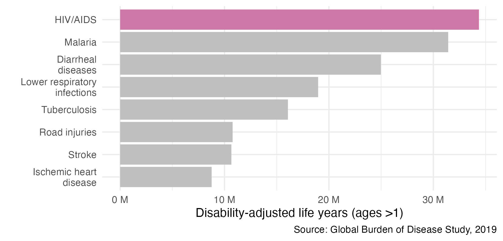
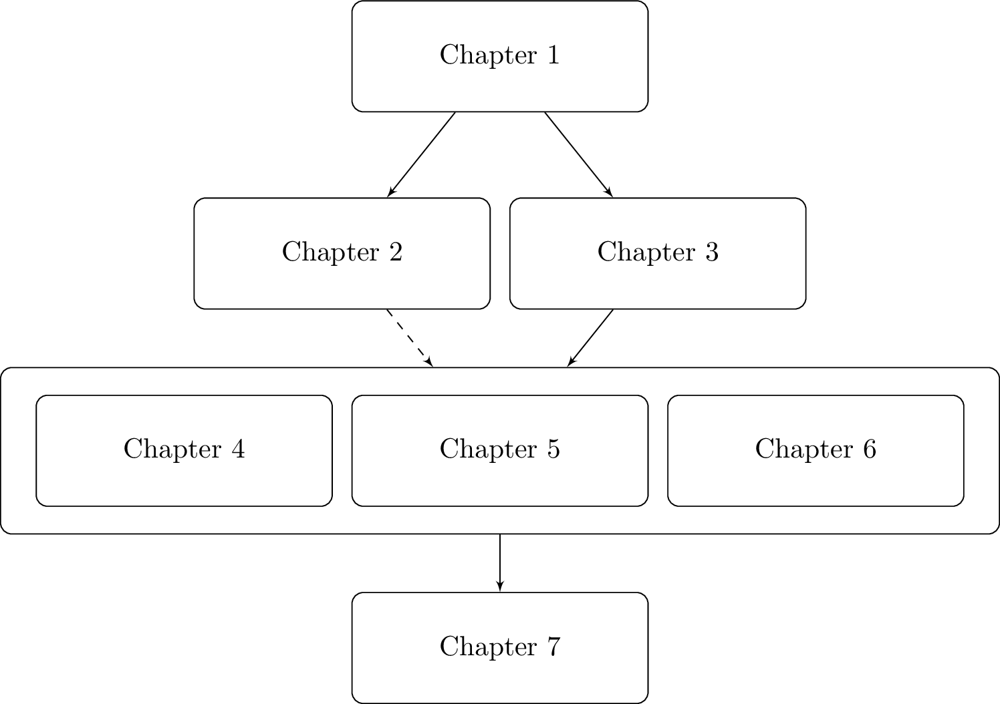

---
#########################################
# options for knitting a single chapter #
#########################################
output:
  bookdown::pdf_document2:
    template: templates/brief_template.tex
    citation_package: biblatex
  bookdown::html_document2: default
  bookdown::word_document2: default
documentclass: book
bibliography: references.bib
---

```{r echo = FALSE}
options(scipen = 100)

knitr::opts_chunk$set(
  echo = FALSE,
  warning = FALSE,
  message = FALSE,
  dpi = 320,
  cache = TRUE,
  out.width = "95%",
  fig.align = 'center'
)
```

# Introduction
\adjustmtc
\markboth{Introduction}{}
<!-- For PDF output, include these two LaTeX commands after unnumbered chapter headings, otherwise the mini table of contents and the running header will show the previous chapter -->

```{r}
custom_numbers_to_words <- function(number) {
  powers <- c(3, 6, 9, 12)
  
  if (number == 0) {
    return("0")
  }
  
  sign <- ifelse(number < 0, -1, 1)
  number <- abs(number)
  
  for (power in powers) {
    scaled_number <- number / 10^power
    if (scaled_number >= 1 && scaled_number < 1000) {
      suffix <- gsub("^one\\s", "", xfun::numbers_to_words(10^power))
      return(paste0(sign * scaled_number, " ", suffix))
    }
  }
  
  return("Number out of range.")
}

esa_plhiv2022 <- 20.8 * 1e6
wca_plhiv2022 <- 4.8 * 1e6
ssa_plhiv2022 <- esa_plhiv2022 + wca_plhiv2022

plhiv2022 <- 39 * 1e6

ssa_pop2022 <- 1.2 * 1e9 #' From the world bank
```

This thesis is about applied and methodological Bayesian statistics.
It is applied and methodological in that I am concerned with real world questions and the means to answer them.
It is Bayesian in that I arrive at conclusions based on data using probability models.

(ref:gbd) HIV/AIDS is the largest cause of DALYs for non-infacts (>1 years) in SSA [@ihme2019]. One DALY represents the loss of the equivalent of one year of full health, and is calculated by the sum of years of life lost and years lost due to disability. The disability weights vary depending on severity of the condition.

```{r gbd, fig.cap="(ref:gbd)"}

```

The real world questions relate to surveillance of the human immunodeficiency virus (HIV) epidemic in sub-Saharan Africa (SSA).
HIV is the largest cause of disability adjusted life years (DALYs) in SSA among non-infants [@ihme2019; Figure \@ref(fig:gbd)].
Quantifying the epidemic using statistics is an important part of the public health response, and the path towards disease control and elimination.
However, there are substantial challenges in obtaining suitable estimates of relevant indicators needed to mount this response.

The data I use are recorded from national household surveys or routinely collected from healthcare facilities.
An important feature of this data is its location and the time at which it was recorded.
While diverse, spatio-temporal data have distinctive commonalities which reoccur across settings.
As a result, the work in this thesis makes use of modelling techniques from spatio-temporal statistics.

Computation is an essential part of modern statistical practice.
Each project in this thesis, as well as the thesis itself, is accompanied by R code, hosted on GitHub.

## Chapter overview

The structure of this thesis (Figure \@ref(fig:chapter-flowchart)) is as follows:

* Chapter \@ref(hiv-aids): I begin by providing an overview of the HIV/AIDS epidemic, and describing the challenges faced by disease surveillance efforts.
* Chapter \@ref(bayes-st): I then introduce the statistical concepts and notation used throughout the thesis, focusing on Bayesian modelling and computation, spatio-temporal statistics, and survey methods.
* Chapter \@ref(beyond-borders): The prevailing model for spatial structure used in small-area estimation [@besag1991bayesian] was intended to analyse a grid of pixels.
In disease mapping, we work using the districts of a country, which are typically not a grid.
I evaluate the practical consequences of this this concern [@howes2023beyond].
* Chapter \@ref(multi-agyw): Adolescent girls and young women are a demographic group at disproportionate risk of HIV infection.
The Global AIDS Strategy suggests prioritising interventions on the basis of behaviour to prevent the most new infections using available resources.
I estimate the size of behavioural risk groups across priority countries to enable implementation of this strategy, and assess the potential benefits in terms of numbers of new infections prevented [@howes2023spatio].
* Chapter \@ref(naomi-aghq): The Naomi small-area estimation model [@eaton2021naomi] is used by countries to estimate district-level HIV indicators.
With this model in mind, I develop an approximate Bayesian inference method combining adaptive Gauss-Hermite quadrature with principal components analysis [@howes2023fast].
I apply the method to data from Malawi, and analyse the consequences of inference method choice for policy relevant outcomes.
Further, I open the door to a new class of fast, flexible, and accurate Bayesian inference algorithms.
* Chapter \@ref(conclusions): Finally, I discuss avenues for future work, and my conclusions regarding the research, as well as its strengths and weaknesses.

(ref:chapter-flowchart) The chapters in this thesis are structured to depend on each other. Dashed lines represents a recommended, but not required dependency. Though chronological order is recommended, Chapter \@ref(beyond-borders), Chapter \@ref(multi-agyw) and Chapter \@ref(naomi-aghq) may be read in any order as they correspond to separable research projects.

```{r chapter-flowchart, fig.cap="(ref:chapter-flowchart)"}

```
