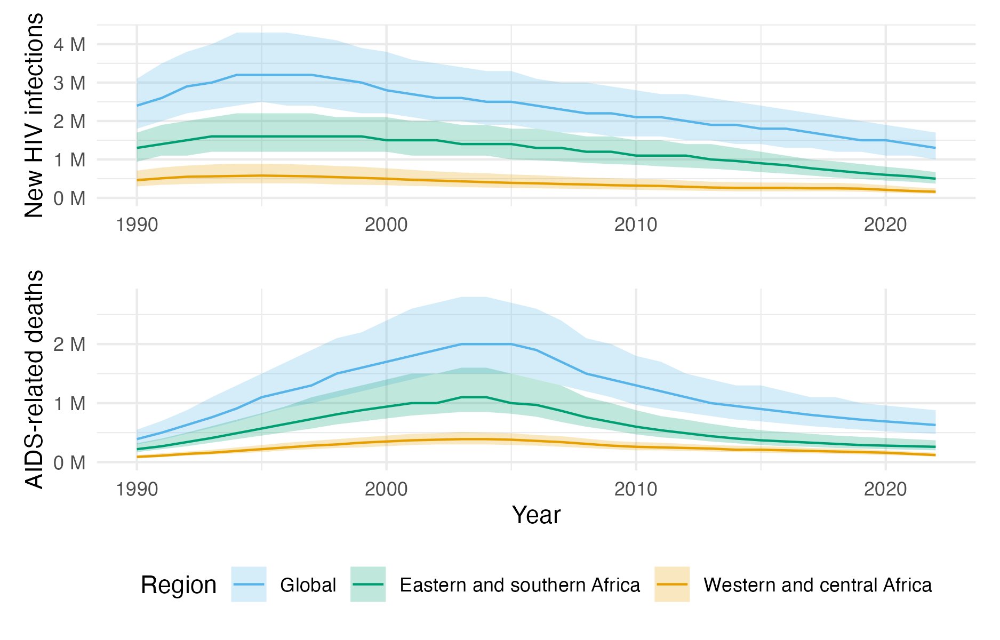

---
#########################################
# options for knitting a single chapter #
#########################################
output:
  bookdown::pdf_document2:
    template: templates/brief_template.tex
    citation_package: biblatex
  bookdown::html_document2: default
  bookdown::word_document2: default
documentclass: book
bibliography: references.bib
---

```{r echo = FALSE}
options(scipen = 100)

knitr::opts_chunk$set(
  echo = FALSE,
  warning = FALSE,
  message = FALSE,
  dpi = 320,
  cache = TRUE,
  out.width = "95%",
  fig.align = 'center'
)
```

# Background {#background}
\adjustmtc
\markboth{Background}{}
<!-- For PDF output, include these two LaTeX commands after unnumbered chapter headings, otherwise the mini table of contents and the running header will show the previous chapter -->

## The HIV/AIDS epidemic

```{r}
plhiv2021 <- 38000000
deaths2021 <- 650000
infections2021 <- 1500000
```

<!-- What is HIV -->
Human immunodeficiency virus (HIV) is a virus.
Over time, if left untreated HIV can progress to a more advanced stage known as acquired immunodeficiency syndrome (AIDS).
HIV can be transmitted by exposure to certain bodily fluids, most commonly during sexual intercourse.

<!-- The extent of HIV as a problem -->
Though the HIV/AIDS epidemic began over forty years ago, it remains a major source of disease burden today.
In 2021 there were `r xfun::numbers_to_words(plhiv2021)` people living with HIV, `r xfun::numbers_to_words(deaths2021)` AIDS-related deaths, and `r xfun::numbers_to_words(infections2021)` people newly infected with HIV [@unaids2021global].

<!-- What is being done -->
A major global effort has been made to address the epidemic.
Significant progress has been made, both in reducing the number of new HIV cases and decreasing the number of AIDS related deaths (Figure \ref{fig:overall-picture}).
Roll out of antiretroviral therapy (ART) has been a key tool.
Other interventions include condoms, pre-exposure prophylaxis (PrEP) and post-exposure prophylaxis (PEP), and voluntary medical male circumcision (VMMC).

```{r overall-picture, fig.cap="Overall picture."}

```

<!-- Uneven burden in space -->
Disease burden is not evenly distributed geographically.
The region most affected is Sub-Saharan Africa.
Within sub-Saharan Africa, there is significant geographic heterogeneity.

<!-- Uneven burden across people -->
Disease burden is not evenly distributed across populations.
Disproportionately impacted groups are sometimes referred to as key populations.
Key populations include men who have sex with men (MSM), female sex workers (FSW), people who inject drugs (PWID), transgender people, and incarcerated people.
Key populations are often marginalised, and face legal and social issues.

<!-- How difuse is burden -->
In sub-Saharan Africa, the epidemic is not as concentrated in key populations as in other contexts.
Large demographic groups at higher risk include adolescent girls and young women.

<!-- Prioritisation of interventions  -->
HIV interventions can be prioritised.
Precision public health aims to get the right interventions, to the right population, in the right place, at the right time.
Methods for prevention prioritisation include geographic, demographic, key population services, risk screening, and individual-level risk characteristics.

<!-- What is surveillance and how can it be used to meet these needs -->
Surveillance is used to track epidemic trends, identify at-risk populations, find drivers of transmission, and evaluate the impact of prevention and treatment programs.
HIV prevalence is the proportion of the population who have HIV.
HIV incidence is the rate of new HIV infections.
ART coverage is the proprotion of people living with HIV who are on ART.

<!-- Why is surveillance difficult -->
There are significant difficulties associated with furnishing these estimates.
These include sparsity in space and time, survey bias, conflicting information sources, hard to reach populations, changing demographics.
These data limitations foreground the importance of synthesising multiple sources of information to obtain estimates.
Doing so increases the complexity of the statistical models used.

<!-- Future trends in surveillance -->
Aims for HIV response going forward, and surveillance capabilities are needed to meet them.
Phasing out of nationally-representative household surveys for HIV.

## Bayesian spatio-temporal statistics

### Bayesian statistics

Bayesian statistics is a mathematical paradigm for learning from data.
I provide a brief, opinionated, overview in this section, and recommend @mcelreath2020statistical or @gelman2013bayesian for a more complete introduction.

#### Bayesian modelling

At its best, the Bayesian paradigm allows the analyst focus their attention on the question of how to model the data.
This is achieved by the construction of a generative model $p(\y, \bvartheta)$ for the observed data $\y$ together with parameters $\bvartheta$.
The model is generative in the sense that one can simulate from it to obtain draws $(\y, \bvartheta) \sim p(\y, \bvartheta)$.
If these draws differ too greatly from what the analyst would expect, then the generative model can be refined.
This is what is known as a prior predictive check.

The model is usually constructed from two parts, known as the likelihood $p(\y \, | \, \bvartheta)$ and the prior $p(\bvartheta)$ such that $p(\y, \bvartheta) = p(\y \, | \, \bvartheta) p(\bvartheta)$.
The likelihood, as a function of $\bvartheta$ with $\y$ fixed, reflects the probability of observing the data when the true value of the parameters is $\bvartheta$.
The prior encapsulates beliefs about the parameters $\bvartheta$ before the data is observed.

There is disagreement about how the prior should be specified.
The distinction between likelihood and prior can sometimes be blurred (Section \@ref(hierarchical-lgm-elgm)).

#### Bayesian computation

Interest lies in obtaining the posterior distribution $p(\bvartheta \, | \, \y)$ which represents beliefs about the parameters given the observed data.
Using Bayes' theorem, the posterior distribution is given by
\begin{equation}
p(\bvartheta \, | \, \y) = \frac{p(\y \, | \, \bvartheta) p(\bvartheta)}{p(\y)}. \label{eq:posterior}
\end{equation}
However, it is usually intractable to calculate the posterior distribution directly because of the integral $p(\y) = \int p(\y, \bvartheta) \text{d}\bvartheta$ in the denominator.
As such, though the numerator is proportional to the posterior $p(\bvartheta \, | \, \y) \propto p(\y \, | \, \bvartheta) p(\bvartheta)$ and easy to evaluate, it is not easy to evaluate the posterior itself.
A great variety of computational methods have been developed at to tackle this problem.
Markov chain Monte Carlo (MCMC) is the most popular approach, and proceeds by simulating samples from a Markov chain with the posterior as its stationary distribution.
Variational Bayes approaches assume the posterior distribution belongs to a certain class of functions and use optimisation to choose the best member of that class.

#### Interplay between modelling and computation

Bayesian computation aspires to abstract away calculation of the posterior distribution.
Modern computational techniques and software have made this aspiration a reality for many models.
However, computation of the posterior remains intractable for a substantial majority of models.
As such, the analyst need not only to be concerned with choosing a model suitable for the data, but also choosing a model for which the posterior is tractable in reasonable time.
It is in this sense, that there is an interplay between modelling and computation.
As computation improves, the space of models available to the analyst expands.

### Spatio-temporal statistics

In spatio-temporal statistics [@cressie2015statistics] we observe data indexed by spatial or temporal location.
In this thesis we assume that the spatial study region $\mathcal{S} \subseteq \mathbb{R}^2$ has two dimensions, corresponding to latitude and longitude.
Data may be associated to a point in space $s \in \mathcal{S}$ or an area $A \subseteq \mathcal{S}$.
The temporal study period $\mathcal{T} \subseteq \mathbb{R}$ can more generally be assumed to be one dimensional.

Commonly used independent and identically distributed (IID) assumptions on observations are rarely suitable in this setting because we expect there to be spatio-temporal correlation structure.

### Model classes {#hierarchical-lgm-elgm}

#### Hierarchical models {#hierarchical}

Bayesian hierarchical models are comprised of multiple stages
\begin{align*}
p(\x, \btheta \, | \, \y) \propto p(\y, \x, \btheta) = p(\y \, | \, \x, \btheta) p(\x \, | \, \btheta) p(\btheta).
\end{align*}

#### Latent Gaussian models

Latent Gaussian models [LGMs; @rue2009approximate] are a class of three-stage Bayesian hierarchical models in which, loosely speaking, the middle layer is Gaussian.
More specifically, in an LGM, the likelihood is given by
\begin{align*}
y_i &\sim p(y_i \, | \, \eta_i, \theta_1), \quad i \in [n]\\
\mu_i &= \mathbb{E}(y_i \, | \, \eta_i) = g(\eta_i), \\
\eta_i &= \beta_0 + \sum_{l = 1}^{p} \beta_j z_{ji} + \sum_{k = 1}^{r} f_k(u_{ki}),
\end{align*}
where $[n] = \{1, \ldots, n\}$.
The response variable is $\y = (y)_{i \in [n]}$ with likelihood $p(\y \, | \, \bmeta, \btheta_1) = \prod_{i = 1}^n p(y_i \, | \, \eta_i, \btheta_1)$, where $\bmeta = (\eta)_{i \in [n]}$.
Each response has conditional mean $\mu_i$ with inverse link function $g: \mathbb{R} \to \mathbb{R}$ such that $\mu_i = g(\eta_i)$.
The vector $\btheta_1 \in \mathbb{R}^{s_1}$, with $s_1$ assumed small, are additional parameters of the likelihood.
The structured additive predictor $\eta_i$ may include an intercept $\beta_0$, linear effects $\beta_j$ of the covariates $z_{ji}$, and unknown functions $f_k(\cdot)$ of the covariates $u_{ki}$.
The parameters $\beta_0$, $\{\beta_j\}$, $\{f_k(\cdot)\}$ are each assigned Gaussian priors, and can be collected into a vector $\x \in \mathbb{R}^N$ such that $\x \sim \mathcal{N}(\mathbf{0}, \mathbf{Q}(\btheta_2)^{-1})$ where $\btheta_2 \in \mathbb{R}^{s_2}$ are further parameters, again with $s_2$ assumed small.
Let $\btheta = (\btheta_1, \btheta_2) \in \mathbb{R}^m$ with $m = s_1 + s_2$ be all hyperparameters, with prior $p(\theta)$.
In total, the parameters of the LGM $\bvartheta = (\x, \btheta)$ comprise both the latent field and hyperparameters.

Spatio-temporal data are well suited to being modelled with LGMs.

#### Extended latent Gaussian models

<!-- Strictly speaking, many-to-one is not an issue for `R-INLA`, the latent field is implemented as a concatenation of many vectors already e.g. for $\eta_i = \beta_0 + \phi_i$ with $i = 1, \ldots, n$ the latent field is $(\eta_1, \ldots, \eta_n, \beta_0, \phi_1, \ldots, \phi_n)^\top$ of dimension $2n + 1$ -->
<!-- Finn Lindgren is working on a method for non-linear predictors, called the [iterative INLA method](https://github.com/inlabru-org/inlabru/blob/55896f10d563c14e34cab577b29b733aac051f86/vignettes/method.Rmd). More [slides](https://informatique-mia.inrae.fr/reseau-resste/sites/default/files/2020-09/slides-Lindgren_Avignon2018.pdf) here -->
<!-- Thesis work of [Follestad](https://cds.cern.ch/record/639625/files/sis-2003-305.pdf) that stayed as a preprint -->

Many of leading-edge disease mapping models fall outside the LGM class.
<!-- There are other complex models from [ecology](https://www.bioss.ac.uk/rsse/2013/September2013slides-Illian.pdf) that can't currently be fit using `R-INLA` -->
However, many of these models do fit into the class of extended latent Gaussian models [ELGMs; @stringer2021fast].
By allowing many-to-one link functions, ELGMs facilitate modelling of non-linearities.
The structured additive predictor is redefined as $\bmeta = (\eta)_{i \in [N_n]}$, where $N_n \in \mathbb{N}$ is a function of $n$, and it is possible that $N_n \neq n$.
Each mean response $\mu_i$ now depends on some subset $\mathcal{J}_i \subseteq [N_n]$ of indices of $\bmeta$, with $\cup_{i = 1}^n \mathcal{J}_i = [N_n]$ and $1 \leq |\mathcal{J}_i| \leq N_n$.
The inverse link function $g(\cdot)$ is redefined for each observation to be a possibly many-to-one mapping $g_i: \mathbb{R}^{|\mathcal{J}_i|} \to \mathbb{R}$, such that $\mu_i = g_i(\bmeta_{\mathcal{J}_i})$.
Put together, ELGMs are then of the form
\begin{align*}
y_i &\sim p(y_i \, | \, \bmeta_{\mathcal{J}_i}, \btheta_1), \quad i \in [n] \\
\mu_i &= \mathbb{E}(y_i \, | \, \bmeta_{\mathcal{J}_i}) = g_i(\bmeta_{\mathcal{J}_i}), \\
\eta_j &= \beta_0 + \sum_{l = 1}^{p} \beta_j z_{ji} + \sum_{k = 1}^{r} f_k(u_{ki}), \quad j \in [N_n],
\end{align*}
with latent field and hyperparameter priors as in the LGM case.
