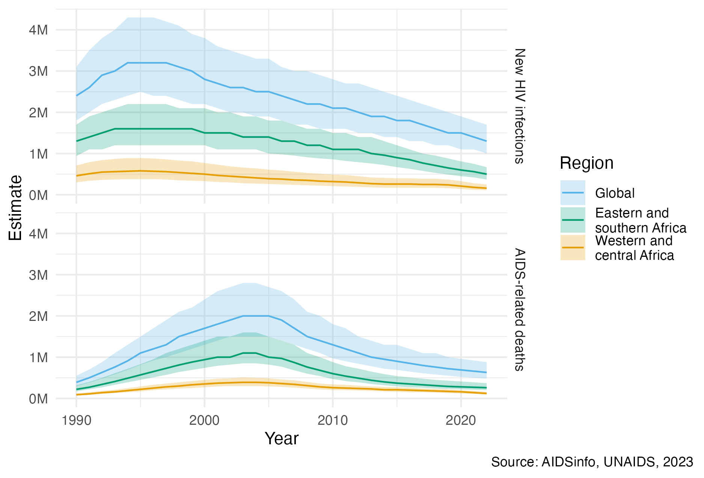
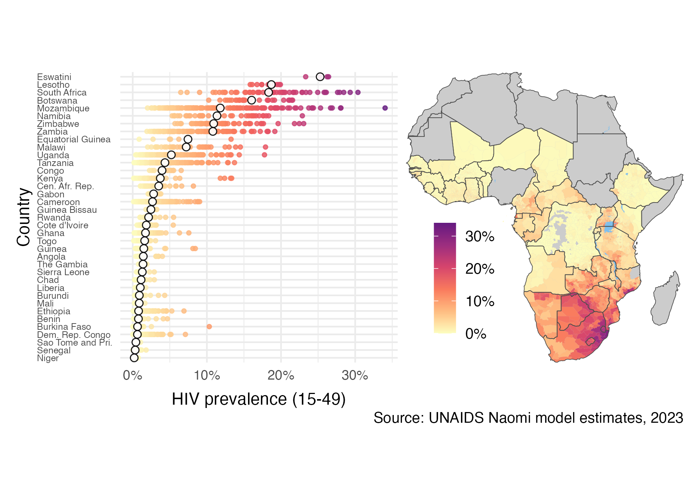

---
#########################################
# options for knitting a single chapter #
#########################################
output:
  bookdown::pdf_document2:
    template: templates/brief_template.tex
    citation_package: biblatex
  bookdown::html_document2: default
  bookdown::word_document2: default
documentclass: book
bibliography: references.bib
---

```{r echo = FALSE}
options(scipen = 100)

knitr::opts_chunk$set(
  echo = FALSE,
  warning = FALSE,
  message = FALSE,
  dpi = 320,
  cache = TRUE,
  out.width = "95%",
  fig.align = 'centre'
)
```

# The HIV/AIDS epidemic {#hiv-aids}
\adjustmtc
\markboth{The HIV/AIDS epidemic}{}
<!-- For PDF output, include these two LaTeX commands after unnumbered chapter headings, otherwise the mini table of contents and the running header will show the previous chapter -->

```{r}
deaths <- 40 * 1e6
infections <- 86 * 1e6

plhiv2022 <- 39 * 1e6
deaths2022 <- 630 * 1e3
infections2022 <- 1.3 * 1e6

coverage2022 <- 76
```

## Background {#background}

<!-- What is HIV -->
HIV is a retrovirus which infects humans.
If untreated, infection with HIV can develop into a more advanced stage known as acquired immunodeficiency syndrome (AIDS).
HIV primarily attacks a type of white blood cell vital for the function of the immune system.
As a result, AIDS is characterised by increased risk of developing opportunistic infections such as tuberculosis or *Pneumocystis* pneumonias, which can result in death.

<!-- HIV is a big problem, plus how is it transmitted -->
The first AIDS cases were reported in Los Angeles in the early 1980s [@gottlieb1981pneumocystis; @barre1983isolation].
Since then, HIV has spread globally.
Transmission occurs by exposure to specific bodily fluids of an infected person.
The most common mode of transmission is via unprotected anal or vaginal sex.
Transmission can also occur from a mother to her baby, or when drug injection equipment is shared.
Approximately `r custom_numbers_to_words(infections)` people have become infected with HIV, and of those `r custom_numbers_to_words(deaths)` have died of AIDS-related causes [@unaids2023aidsinfo].

```{r}
pepfar <- 100 * 1e9
#' From https://www.theglobalfund.org/en/hivaids/
global_fund <- round((24.2 + 5)) * 1e9
```

<!-- A lot of effort going into it -->
An ongoing global effort has been made to respond to the epidemic.
The multifaceted response has been shaped by local communities, civil society organisations, national governments, research institutions, pharmaceutical companies, international agencies like the Joint United Nations Programme
on HIV/AIDS (UNAIDS), and global health initiatives such like the President's Emergency Plan for AIDS Relief (PEPFAR) and the Global Fund to Fight AIDS, Tuberculosis, and Malaria (the Global Fund).
As an indication as to the scale of the response, the investment of $`r custom_numbers_to_words(pepfar)` by PEPFAR constitutes the "largest commitment by a single nation to address a single disease in history" [@pepfar2022].

```{r}
#' From https://www.unaids.org/en/resources/presscentre/featurestories/2021/september/20210906_global-roll-out-hiv-treatment
art_deaths_averted <- 21 * 1e6
condom_infections_averted <- 117 * 1e6
vmmc_infections_averted <- 340 * 1e3
```

(ref:overall-picture) Globally, yearly new HIV infections peaked in 1995, and have since decreased by 59%. Yearly AIDS-related deaths peaked in 2004, and have since decreased by 68% [@unaids2023aidsinfo]. Much of the global disease burden is concentrated in eastern and southern Africa, as well as western and central Africa. The unit "M" refers to millions. The colour palette used in this figure, and throughout the thesis, is that of @okabe2008color. It is designed to be colourblind friendly, and the default used by @wilke2019fundamentals.

```{r overall-picture, fig.cap="(ref:overall-picture)"}

```

<!-- The effort has translated into progress -->
Implementation of HIV prevention and treatment has significantly reduced the number of new HIV infections and AIDS-related deaths per year since their respective peaks (Figure \@ref(fig:overall-picture)).
The most significant evidence-based interventions, in more or less chronological order of introduction, are described below:

* Condoms are an inexpensive and effective method for prevention of HIV and other sexually transmitted infections (STIs) such as *Chlamydia trachomatis*, *Neisseria gonorrhoeae*, syphilis, and *Trichomonas vaginalis*.
Condom usage has increased significantly since 1990, which is estimated to have averted `r custom_numbers_to_words(condom_infections_averted)` new HIV infections [@stover2021impact].
However, there remain significant but difficult to close gaps in condom usage.

* Antiretroviral therapy (ART) is a combination of drugs which stop the virus from replicating in the body.
A person living with HIV who takes ART daily can live a full and healthy life, transforming what was once a terminal illness to a treatable chronic condition.
Of the `r custom_numbers_to_words(plhiv2022)` people living with HIV (PLHIV) in 2022, around `r coverage2022`% were accessing ART.
The number of AIDS-related deaths, `r custom_numbers_to_words(art_deaths_averted)`, estimated to have been averted by ART is staggering [@unaids2023global].

  ART reduces the amount of virus in the blood and genital secretions.
  If the virus is undetectable then there is significant evidence that it cannot be transmitted sexually [@cohen2011prevention; @broyles2023risk].
  For this reason, in addition to providing life saving treatment, ART also operates as prevention.
  Approaches to lowering risk of HIV transmission in this way are referred to as treatment as prevention (TaSP).
  Particular efforts have been made to provide pregnant women with ART to reduce the chance of mother-to-child transmission (MTCT) [@siegfried2011antiretrovirals].

* Voluntary medical male circumcision (VMMC) partially protects against female-to-male HIV acquisition.
Three landmark randomised control trials (RCTs) [@auvert2005randomized; @gray2007male; @bailey2007male] found complete surgical removal of the foreskin to result in a reduction of HIV acquisition in men by 50-60%.
Based on this evidence, VMMC has been recommended since 2007 by the World Health Organization (WHO) and UNAIDS as a key HIV intervention in high-prevalence settings [@world2007new].
Scale up of VMMC across 15 priority countries between 2008 and 2019 is estimated to have already averted `r custom_numbers_to_words(vmmc_infections_averted)` new HIV infections, though the future number of new HIV infections averted is likely to be much higher [@mcgillen2018emerging; @unaids2021vmmc].

* Pre-exposure prophylaxis (PrEP) and post-exposure prophylaxis (PEP) are antiretroviral drugs which can be taken before and after exposure to prevent transmission.
PrEP has been shown to be effective at an individual-level across a number of RCTs [@baeten2012antiretroviral; @thigpen2012antiretroviral], but there are few population-level studies.
Though PEP cannot be studied with RCTs, observational studies indicate it is highly effective [@dominguez2016updated].
These medical interventions are more costly than other prevention options, so are primarily useful in high risk settings.

Though implementation of the above interventions has enabled important progress to be made, there remains much more to do.
In 2022, `r custom_numbers_to_words(infections2022)` people were newly infected with HIV and there were `r custom_numbers_to_words(deaths2022)` AIDS-related deaths, more than one death every minute [@unaids2022global].
Bold fast-track targets have been set to accelerate the end of AIDS as a global public health threat by 2030 [@assembly2016political].
To meet these targets in the context of disruption to HIV services caused by the COVID-19 pandemic and a potential shortfall in HIV funding, renewed commitments are required [@economist2023triple].

<!-- Prioritisation of interventions  -->
For available resources to have the greatest impact, it is important that the right HIV interventions are prioritised to the right populations, in the right place, and at the right time.
By analogy to precision medicine, this paradigm has been termed precision public health [@khoury2016precision].
While precision medicine tailors treatments to individuals, precision public health tailors treatments to populations.
The importance of precision public health is underscored by the vast potential differences in the cost-effectiveness of any given intervention, with some interventions orders of magnitude more impactful than others [@ord2013moral].

(ref:naomi-continent) Adult (15-49) HIV prevalence varies substantially both within and between countries in SSA. The estimates from 2023 were generated by country teams using the Naomi small-area estimation model in a process supported by UNAIDS, and are available from @unaids2023aidsinfo. White filled points are country-level estimates, and coloured points are district-level estimates. Results from Nigeria were not published. Data collection in the Cabo Delgado province of Mozambique was disrupted by conflict. Obtaining results for the Democratic Republic of the Congo required removing some districts from the model.

```{r naomi-continent, fig.cap="(ref:naomi-continent)"}

```

<!-- Uneven burden in space -->
Disease burden varies substantially across multiple spatial scales.
In some countries, the epidemic is concentrated in small populations, and national HIV prevalence is low.
In others, the epidemic is sustained by heterosexual transmission, and national HIV prevalence is higher (typically >1%).
These two epidemic settings are sometimes described as concentrated and generalised, respectively.
Most countries severely affected by HIV are in sub-Saharan Africa (SSA).
It is estimated that `r round(ssa_plhiv2022 / plhiv2022 * 100)`% of the `r custom_numbers_to_words(plhiv2022)` PLHIV worldwide live in SSA.
HIV prevalence in adults aged 15-49 is above 10% in some countries in southern Africa.
Some districts even exceed 20% (Figure \@ref(fig:naomi-continent)).
Indeed, just as there is variation between countries, there is variation within countries.
As an illustration, adult HIV prevalence at the district municipality level in South Africa ranges from `r 6`% in Namakwa to `r 30`% in uMkhanyakude.
Accordingly, the work in this thesis is centred on measurement of HIV at the district level in SSA.

<!-- Uneven burden across people -->
In all countries and contexts, some groups of people are at much higher risk than others.
Groups of people at increased risk of HIV infection are known as key populations (KPs).
Examples include men who have sex with men (MSM), female sex workers (FSW), people who inject drugs (PWID), and transgender people (TGP) [@stevens2023estimating].
KPs are often marginalised, and face legal and social barriers.
Concentrated settings are defined by the majority of new HIV infections occurring in KPs and their sexual partners.
In generalised settings like SSA, though concentrated subepidemics do occur [@tanser2014concentrated], risk is more diffuse across the population.
In SSA adolescent girls and young women (AGYW) are a large demographic group at increased risk of HIV infection [@risher2021age; @monod2023longitudinal] but not typically considered a KP.
Chapter \@ref(multi-agyw) focuses on measurement of HIV for AGYW and FSW.

<!-- Practical methods for prevention prioritisation: what is being done and is it working -->
There are a number of ways to practically implement differentiated HIV treatment and prevention services [@godfrey2022hiv].
These include geographic and demographic prioritisation [@meyer2018targeting], key population services [@world2022consolidated], and risk screening based on individual-level risk characteristics [@jia2022risk].
Each approach requires strategic information about HIV disease burden.
This thesis focuses on using HIV surveillance to inform geographic and demographic prioritisation.

## HIV surveillance {#surveillance}

<!-- What is surveillance and how can it be used to meet these needs -->
HIV surveillance refers to the collection, analysis, interpretation and dissemination of data relating to HIV [@pisani2003hiv].
Surveillance can be used to track epidemic indicators, identify at-risk populations, uncover drivers of transmission, implement prevention and treatment programs, and assess their impact.
Important indicators to measure include:

* **HIV prevalence** is the proportion $\rho \in [0, 1]$ of a population who have HIV.
The number of PLHIV is given by $N\rho$, where $N$ is the (living) population size.
Increases in HIV prevalence, and the number of PLHIV, can be caused either by new HIV infections or more PLHIV remaining alive by taking treatment.
For this reason caution should be taken in directly interpreting changes in HIV prevalence.
Nonetheless, as a primary measure of population disease burden, HIV prevalence is vital in calculating all of the other indicators given below.

* **HIV incidence** is the rate $\lambda > 0$ of new HIV infections.
In writing, HIV incidence is often given as a number of new infections per 1000 person years.
The number of new HIV infections that occur during a given time is the integral of the rate of HIV incidence over time $\lambda_t$ multiplied by the size of the susceptible population.
Let $\rho_t$ be the HIV prevalence, and $N_t$ be the population size, at time $t$.
Then the number of new HIV infections which occur during a given period of time are given by
$$
I = \int \lambda_t \cdot (1 - \rho_t) \cdot N_t \text{d}t.
$$
Planning, delivery, and evaluation of prevention programming relies on estimates of HIV incidence and the number of new HIV infections.
Knowing whether the rate of new infections is rising or declining within specific populations is crucial.

* **ART coverage** is the proportion $\alpha \in [0, 1]$ of PLHIV who are on ART.
The number of people taking ART is given by $N \cdot \rho \cdot \alpha$.
Estimates of ART coverage play a direct role in planning provision of treatment services, and finding unmet treatment need.

* **Recent infection** is the proportion $\kappa \in [0, 1]$ of PLHIV who have been recently infected.
Recency assays use biomarkers to distinguish between recent and longstanding infection, with varying sensitivity and specificity.
Estimates of recent infection are primarily used to help estimate HIV incidence [@kassanjee2012new; @unaids2022using].

* **Awareness of status** is the proportion $\xi \in [0, 1]$ of PLHIV who have been diagnosed with HIV.
Programming of HIV testing and diagnosis is informed by estimates of awareness of HIV status.
HIV diagnosis allows for linkage to care and progression along the HIV treatment cascade and care continuum [@cdc2014].

### Data {#hiv-data}

Measuring the HIV indicators above requires data.
To give the most complete picture of the epidemic, it is important to use multiple sources of data.
The most prominent categories are:

* **Household surveys** are large, national, cross-sectional studies.
The surveys conducted in the most countries are Demographic and Health Surveys [DHS ;@measure2012sampling], which include a wide range of health related questions, and more HIV-specific Population-based HIV Impact Assessment [PHIA; @phia] and AIDS Indicator Surveys (AIS).
Some countries also implement their own survey series, such as the South Africa Behavioural, Sero-status and Media Impact Survey (SABSSM).
Household surveys provide high quality standardised data about HIV, typically designed to furnish nationally-representative estimates.
Both DHS and PHIA surveys collect demographic, behavioural, and clinical information.
Additionally, HIV testing is conducted via home-based testing, with results returned immediately, or anonymous dried blood spot testing.

* **Programmatic data** refer to data routinely collected during delivery of health services.
Examples include data from antenatal care (ANC), HIV testing, and ART service delivery.
Due to their integration with regular service delivery, programmatic data are available at higher frequency than other data sources.
However, in comparison with designed studies, less control can be exercised over collection of programmatic data.
It is common to encounter issues of data quality and reliability, as well as bias, in working with programmatic data.

* **Cohort studies** follow a group of people over time.
Outcomes may be measured more systematically in a cohort study than in other study designs.
The data from cohort studies have particular use in informing otherwise difficult to estimate epidemiological parameters.
Such parameters include disease progression and mortality rates, transmission dynamics, and treatment outcomes.
Examples of population-based cohort studies in SSA include the Manicaland Project Open Cohort Study in Zimbabwe [@gregson2006hiv], the Rakai Community Cohort Study in Uganda [@grabowski2017hiv], and the Karonga Demographic Surveillance Site in Malawi [@crampin2012profile].

<!-- * **Key population surveys** ... -->

### Challenges

Obtaining reliable, timely estimates of the HIV indicators at an appropriate spatial resolution using the available data sources is challenging.
The most significant difficulties faced are enumerated below, providing important context for the work in this thesis:

1. **Data sparsity**:
Collection of data is costly and time consuming.
As a result, limited direct data might be available for the particular time, location, or population of interest.
For example, in many countries the last conducted household survey is several years out of date.
Furthermore, the sample sizes in household surveys are typically designed to be representative at a national-level.
As a result, data for subpopulations are usually sparse.

2. **Missing data**:
The sampling frame of a survey may not correspond to the target population.
For example, some KPs are difficult to reach, and may be omitted from sampling frames [@jin2021overview].
Additionally, individuals included on the sampling frame may choose not to respond.
Each of these issues can be characterised as being problems of missing data.

3. **Response and measurement biases**:
Individuals may be hesitant to disclose their HIV status, or report higher risk behaviours, due to social desirability bias or a fear of discrimination or stigma.
Furthermore, individuals may be unaware of their HIV status.
When available, biomarker data can be used to overcome under-reporting of HIV status, but still may be subject to measurement errors.
Biases in behavioural data can be more difficult to disentangle.

4. **Denominators and demography**:
Many indicators are rates or proportions, which rely on estimates of the population at risk in the denominator.
For example, HIV prevalence is a proportion of the population, and HIV incidence is a rate per person-years at risk.
Accurately estimating population denominators over space, time, and demographies is itself a challenging task [@tatem2017worldpop].
Taking a ratio of uncertain quantities amplifies uncertainty, but is rarely properly accounted for.

5. **Inconsistent data collection and reporting**:
The sources of data that are collected might vary across space and time.
Additionally, reporting protocols or definitions for the same data source can also change.
Though household surveys tend to be more consistent than programmatic data, the questions included and design of the surveys do change.

6. **Reliance on epidemiological parameters**:
Indicators rely on estimates of epidemiological parameters such as rates of disease progression.
These parameters may not generalise to the setting of interest.
Further, they are typically applied coarsely, and without proper accounting for uncertainty.

### Statistical approaches

The challenges above make direct interpretation of the data often misleading or impossible.
Careful statistical modelling is required to mitigate these limitations as effectively as possible.
The most important statistical approaches for estimating HIV indicators used in this thesis are:

1. **Borrowing information**:
When little direct data are available, data judged to be indirectly related can be used to help improve estimation.
For example, if limited data are available for individuals of a certain age, it is likely reasonable to make use of data for individuals of a similar age.
As well as over age groups, information can be borrowed between and within countries, and across times.
Chapter \@ref(beyond-borders) discusses models for borrowing information over space.
These models, along with others for borrowing information in other dimensions, are applied in Chapters \@ref(multi-agyw) and \@ref(naomi-aghq).

2. **Evidence synthesis**:
Multiple sources of evidence can be combined to overcome the limitations of any one data source.
For example, infrequently run household surveys can be complemented by more up-to-date programmatic data.
Chapter \@ref(naomi-aghq) develops methods suitable for the complex statistical models required to integrate data sources.
Multiple data sources are used in Chapter \@ref(multi-agyw) to overcome the limitations of household surveys for measuring KP population sizes.

3. **Expert guidance**:
Expert epidemiological, demographic, and local stakeholder guidance can be used to improve estimates.
Ensuring the quality of any data used in the estimation process is essential.
Indeed, careful validation of data by country teams is a crucial part of the yearly UNAIDS HIV estimates process.

4. **Uncertainty quantification**:
Conclusions drawn by synthesising multiple incomplete data sources are unlikely to be firm and unanimous.
It is therefore especially important that the uncertainties inherent to any statistical analysis are accurately and transparently presented.
The Bayesian statistical paradigm introduced in Chapter \@ref(bayes-st) and used throughout this thesis is particularly well suited to handling of uncertainty.
