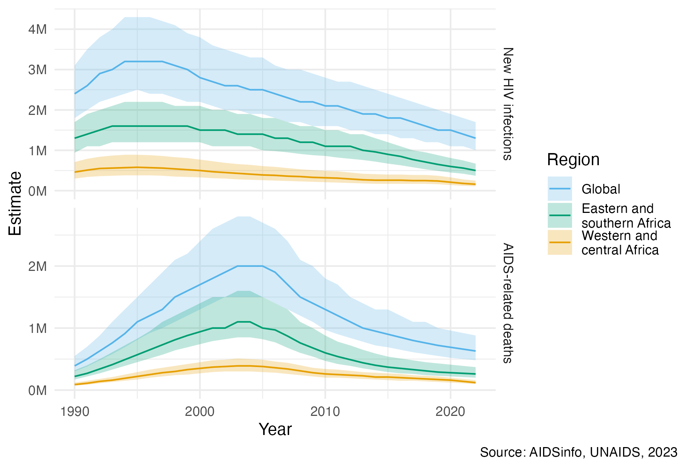

---
#########################################
# options for knitting a single chapter #
#########################################
output:
  bookdown::pdf_document2:
    template: templates/brief_template.tex
    citation_package: biblatex
  bookdown::html_document2: default
  bookdown::word_document2: default
documentclass: book
bibliography: references.bib
---

```{r echo = FALSE}
options(scipen = 100)

knitr::opts_chunk$set(
  echo = FALSE,
  warning = FALSE,
  message = FALSE,
  dpi = 320,
  cache = TRUE,
  out.width = "95%",
  fig.align = 'centre'
)
```

# The HIV/AIDS epidemic {#hiv-aids}
\adjustmtc
\markboth{The HIV/AIDS epidemic}{}
<!-- For PDF output, include these two LaTeX commands after unnumbered chapter headings, otherwise the mini table of contents and the running header will show the previous chapter -->

```{r}
deaths <- 40 * 1e6
infections <- 86 * 1e6

plhiv2022 <- 39 * 1e6
deaths2022 <- 630 * 1e3
infections2022 <- 1.3 * 1e6

coverage2022 <- 76
```

## Background {#background}

<!-- What is HIV -->
HIV is a retrovirus which infects humans.
If untreated, HIV can develop into a more advanced stage known as acquired immunodeficiency syndrome (AIDS).
HIV primarily attacks a type of white blood cell vital for the function of the immune system.
As a result, AIDS is characterised by increased risk of developing opportunistic infections such as tuberculosis or *Pneumocystis* pneumonias, which can result in death.

<!-- HIV is a big problem, plus how is it transmitted -->
The first AIDS cases were reported in Los Angeles in the early 1980s [@gottlieb1981pneumocystis; @barre1983isolation].
Since then, HIV has spread globally.
Transmission occurs by exposure to specific bodily fluids of an infected person.
The most common mode of transmission is via unprotected anal or vaginal sex, though transmission can also occur from a mother to her baby, or when drug injection equipment is shared.
Approximately `r custom_numbers_to_words(infections)` people have become infected with HIV, and of those `r custom_numbers_to_words(deaths)` have died of AIDS-related causes.

```{r}
pepfar <- 100 * 1e9
#' From https://www.theglobalfund.org/en/hivaids/
global_fund <- round((24.2 + 5)) * 1e9
```

<!-- A lot of effort going into it -->
An ongoing global and multifaceted effort has been made to respond to the epidemic.
The response has been shaped by local communities, civil society organisations, national governments, research institutions, pharmaceutical companies, international agencies like the Joint United Nations Programme
on HIV/AIDS (UNAIDS), and global health initiatives such like the President's Emergency Plan for AIDS Relief (PEPFAR) and the Global Fund to Fight AIDS, Tuberculosis, and Malaria (the Global Fund).
To give an indication as to the scale of the response, the investment of $`r custom_numbers_to_words(pepfar)` by PEPFAR constitutes the "largest commitment by a single nation to address a single disease in history" [@pepfar2022].

```{r}
#' From https://www.unaids.org/en/resources/presscentre/featurestories/2021/september/20210906_global-roll-out-hiv-treatment
art_deaths_averted <- 21 * 1e6
condom_infections_averted <- 117 * 1e6
vmmc_infections_averted <- 340 * 1e3
```

(ref:overall-picture) Globally, yearly new HIV infections peaked in 1995, and have since decreased by 59% and yearly AIDS-related deaths peaked in 2004, and have since decreased by 68% [@unaids2023aidsinfo]. Much of the disease burden is concentrated in eastern and southern Africa, as well as western and central Africa.

```{r overall-picture, fig.cap="(ref:overall-picture)"}

```

<!-- The effort has translated into progress -->
Implementation of HIV prevention and treatment has significantly reduced the number of new HIV infections and AIDS-related deaths per year since their peak (Figure \@ref(fig:overall-picture)).
The most significant evidence-based interventions, in chronological order of their introduction, are described below:

* Condoms are an inexpensive and effective method for prevention of HIV and other sexually transmitted infections (STIs) such as *Chlamydia trachomatis*, *Neisseria gonorrhoeae*, syphilis, and *Trichomonas vaginalis*.
Condom usage has increased significantly since 1990, which is estimated to have averted `r custom_numbers_to_words(condom_infections_averted)` new HIV infections [@stover2021impact].
There remain significant but difficult to close gaps in condom usage.

* Antiretroviral therapy (ART) is a combination of drugs which stop the virus from replicating in the body.
A person living with HIV who takes ART daily can live a full and healthy life, transforming what was once a terminal illness to a treatable chronic condition.
Of the `r custom_numbers_to_words(plhiv2022)` people living with HIV (PLHIV) in 2022, around `r coverage2022`% were accessing ART.
The number of AIDS-related deaths, `r custom_numbers_to_words(art_deaths_averted)`, estimated to have been averted by ART is staggering [@unaids2023global].

  ART reduces the amount of virus in the blood and genital secretions.
  If the virus is undetectable then there is significant evidence that it cannot be transmitted sexually [@cohen2011prevention; @broyles2023risk].
  For this reason, in addition to providing life saving treatment, ART also operates as prevention.
  Approaches to lowering risk of HIV transmission using treatment are referred to as treatment as prevention (TaSP).
  Particular efforts have been made to provide pregnant women with ART to reduce the chance of mother-to-child transmission (MTCT) [@siegfried2011antiretrovirals].

* Voluntary medical male circumcision (VMMC) partially protects against female-to-male HIV acquisition.
Three landmark randomised control trials [@auvert2005randomized; @gray2007male; @bailey2007male] found complete surgical removal of the foreskin to result a reduction of HIV acquisition in men by 50-60%.
Based on this evidence, VMMC has been recommended since 2007 by the World Health Organization (WHO) and UNAIDS as a key HIV intervention in high-prevalence settings.
Scale up of VMMC across 15 priority countries between 2008 and 2019 is estimated to have already averted `r custom_numbers_to_words(vmmc_infections_averted)` new HIV infections, though the future number of new HIV infections averted is likely to be much higher.

* Pre-exposure prophylaxis (PrEP) and post-exposure prophylaxis (PEP) are antiretroviral drugs which can be taken before and after exposure to prevent transmission.
PrEP and PEP are more costly than some other prevention options, so primarily useful in high risk settings.

Though important progress had been made, facilitated by the interventions above, there remains much more to do.
In 2022, `r custom_numbers_to_words(infections2022)` people were newly infected with HIV and there were `r custom_numbers_to_words(deaths2022)` AIDS-related deaths, more than one every minute [@unaids2022global].
Bold fast-track targets have been set to accelerate the end of AIDS as global public health threat by 2030.
To meet these targets in the context of disruption to HIV services caused by the COVID-19 pandemic and a potential shortfall in HIV funding, renewed commitments are required [@economist2023triple].

(ref:naomi-continent) Adult (15-49) HIV prevalence varies substantially both within and between countries in SSA. The estimates from 2023 were generated by country teams using the Naomi small-area estimation model in a process supported by UNAIDS, and are available from @unaids2023aidsinfo. White filled points are country-level estimates, and coloured points are district-level estimates. Results from Nigeria were not published. Data collection in the Cabo Delgado province of Mozambique was disrupted by conflict. Obtaining results for the Democratic Republic of the Congo required removing some districts from the model.

```{r naomi-continent, fig.cap="(ref:naomi-continent)"}
knitr::include_graphics("figures/hiv-aids/naomi-continent.png")
```

<!-- Prioritisation of interventions  -->
For available resources to have the greatest impact, it is important that the right HIV interventions to be prioritised to the right populations, in the right place, and at the right time.
By analogy to precision medicine, this paradigm has been termed precision public health [@khoury2016precision].
While precision medicine tailors treatments to the individual, precision public health tailors treatments to the population.
Differences in the cost-effectiveness of any given intervention can be vast, with some interventions orders of magnitude more impactful than others [@ord2013moral].

<!-- Uneven burden in space -->
Disease burden varies substantially across multiple spatial scales.
In some countries, the epidemic is concentrated in small populations, and national HIV prevalence is low.
In others, the epidemic is sustained by heterosexual transmission, and national HIV prevalence is higher (typically >1%)
These two epidemic settings are sometimes described as concentrated and generalised, respectively.
Most of the countries severely affected by HIV are in sub-Saharan Africa (SSA).
It is estimated that `r round(ssa_plhiv2022 / plhiv2022 * 100)`% of the `r custom_numbers_to_words(plhiv2022)` PLHIV worldwide live in SSA.
Adult HIV prevalence (ages 15-49) is above than 10% (Figure \@ref(fig:naomi-continent)) in some countries in southern Africa, with some districts even exceeding 20%.
Just as there is variation between countries, there is variation within countries.
For example, adult HIV prevalence at the district municipality level in South Africa ranges from `r 6`% in Namakwa to `r 30`% in uMkhanyakude.

<!-- Uneven burden across people -->
In all countries and contexts, some groups of people are at much higher risk than others.
Groups of people at increased risk of HIV infection are known as key populations (KPs).
Examples include men who have sex with men (MSM), female sex workers (FSW), people who inject drugs (PWID), and transgender people (TGP) [@stevens2022key].
KPs are often marginalised, and face legal and social barriers.
Concentrated settings are defined by the majority of new HIV infections occurring in KPs and their sexual partners.
In generalised settings like SSA, risk is more diffuse across the population.
For example, in SSA adolescent girls and young women (AGYW) are a large demographic group at increased risk of HIV infection [@risher2021age; @monod2023growing] but not typically considered a KP.
That said, concentrated subepidemics often occur within nominally generalised settings [@tanser2014concentrated].

<!-- Practical methods for prevention prioritisation: what is being done and is it working -->
Differentiated HIV treatment and prevention services can be practically implemented via a number of approaches.
These include geographic and demographic prioritisation, key population services, and risk screening based on individual-level risk characteristics [@eaton2022aids].

## HIV surveillance {#surveillance}

<!-- What is surveillance and how can it be used to meet these needs -->
HIV surveillance refers to the collection, analysis, interpretation and dissemination of data relating to HIV [@pisani2003hiv].
Surveillance can used to track epidemic indicators, identify at-risk populations, find drivers of transmission, and evaluate the impact of prevention and treatment programs.
Important indicators include:

* **HIV prevalence** is the proportion $\rho \in [0, 1]$ of a population who have HIV.
The number of PLHIV is given by $N\rho$, where $N$ is the (living) population size.
Increases in HIV prevalence, or the number of PLHIV, can be caused by either new HIV infections or more PLHIV remaining alive by taking treatment.
For this reason care must be taken in directly interpreting changes in HIV prevalence.
As a key measure of population disease burden, HIV prevalence is used to calculate all of the other indicators given below.

* **HIV incidence** is the rate $\lambda > 0$ of new HIV infections, often written as number of new infections per 1000 person years.
The number of new HIV infections that occur during a given time is the integral of HIV incidence multiplied by the size of the susceptible population.
Let $\rho_t$ be the HIV prevalence, and $N_t$ be the population size, at time $t$.
Then the number of new HIV infections which occur in a given period of time are given by
$$
I = \int \lambda_t \cdot (1 - \rho_t) \cdot N_t \text{d}t.
$$
Planning, delivery, and evaluation of prevention programming relies on estimates of HIV incidence and the number of new HIV infections.

* **ART coverage** is the proportion $\alpha \in [0, 1]$ of PLHIV who are on ART.
Estimates of ART coverage play a direct role in planning the provision of treatment services.
The number of people taking ART is given by $N \cdot \rho \cdot \alpha$.

* **Recent infection** is the proportion $\kappa \in [0, 1]$ of PLHIV who have been recently infected.
Recent infection can be used to help estimate HIV incidence.

* **Awareness of status** is the proportion $\xi \in [0, 1]$ of PLHIV who have been diagnosed with HIV.
Programming of HIV testing and diagnosis is informed by awareness of status.

### Data {#hiv-data}

Data are used to estimate the above HIV indicators, in conjunction with scientific knowledge.
Multiple sources of data are used:

* **Household surveys** are large, national cross-sectional studies.
The Demographic and Health Surveys (DHS) Program.
Population-based HIV Impact Assessments (PHIA).
Household surveys provide nationally-representative high quality standardised data about HIV.

* **Programmatic data** refer to data routinely collected during delivery of health services.
Examples include data from antenatal care (ANC) HIV testing and ART service delivery.
Programmatic data are more regularly available than other data sources.
However, the control that can be exercised over collection of programmatic data is limited.
As a result, issues of data quality and reliability, as well as bias, are common in working with programmatic data.

* **Cohort studies** follow a group of people over time.
Outcomes may be measured more systematically in a cohort study than in other study designs.
The data from cohort studies are used to inform otherwise difficult to estimate epidemiological parameters.
Examples of such parameters include disease progression and mortality rates, transmission dynamics, and treatment outcomes.
Population-based cohort studies relevant to the SSA setting include Manicaland, Zimbabwe [@gregson2006hiv]; Rakai, Uganda [@grabowski2017hiv].

<!-- Discuss methods for HIV testing -->

### Challenges

Obtaining reliable, timely estimates at an appropriate spatial resolution is challenging.
The most significant difficulties faced are:

1. **Data sparsity**:
Collection of data is costly and time consuming.
As a result, limited direct data might be available for the particular time, location, or population of interest.
For example, in many countries the last conducted household survey is several years out of date.

2. **Missing data**:
The sampling frame of a survey may not correspond to the target population.
For example, many KPs are difficult to reach, and may be omitted from sampling frames.
Individuals included on the sampling frame may choose not to respond.
All surveys are subject to sampling error, as only a subset of the target population are sampled.
Each of these issues can be characterised as being problems of missing data.
I characterise missing data as referring to the shortfalls of any given study, and data sparsity as referring to limited availability of studies. 

3. **Response and measurement biases**:
Individuals may be hesitant to disclose their HIV status, or report higher risk behaviours, due to social desirability bias or a fear of discrimination or stigma.
When available, biomarker data can be used to overcome under-reporting, but still may be subject to measurement errors.

4. **Denominators and demography**:
Many indicators are rates or proportions, which rely on estimates of the population at risk in the denominator.
Accurately estimating population denominators is itself a challenging task [@tatem2017worldpop].
Taking a ratio of uncertain quantities amplifies uncertainty, but is rarely properly accounted for.

5. **Inconsistent data collection and reporting**:
The types of data that are collected might vary across space and time.
Reporting protocols or definitions can also change.

6. **Reliance on epidemiological parameters**:
Indicators rely on estimates of epidemiological parameters such as rates of disease progression.
These parameters may not generalise to the setting of interest.
Further, they are typically applied coarsely, and without proper accounting for uncertainty.

### Statistical approaches

The challenges above make direct interpretation of the data often misleading or impossible.
Careful statistical modelling is required to overcome these limitations as best as possible.

1. **Borrowing information**:
When little direct data are available, data judged to be indirectly related can be used to help improve estimation.
For example, if limited data are available for individuals of a certain age, it is likely reasonable to make use of data for individuals of a similar age.
As well as over age groups, information can be borrowed between and within countries, and across times.

2. **Evidence synthesis**:
Multiple sources of evidence can be combined to overcome the limitations of any one data source.
For example, infrequently run household surveys can be complemented by more up-to-date programmatic data.

3. **Expert guidance**:
Expert epidemiological, demographic, and local stakeholder guidance can be used to improve estimates.
Ensuring the quality of any data used in the estimation process is essential.

4. **Uncertainty quantification**:
Conclusions drawn by synthesising multiple incomplete data sources are unlikely to be firm and unanimous.
It is therefore particularly that the uncertainties inherent to any statistical analysis are accurately and transparently presented.
