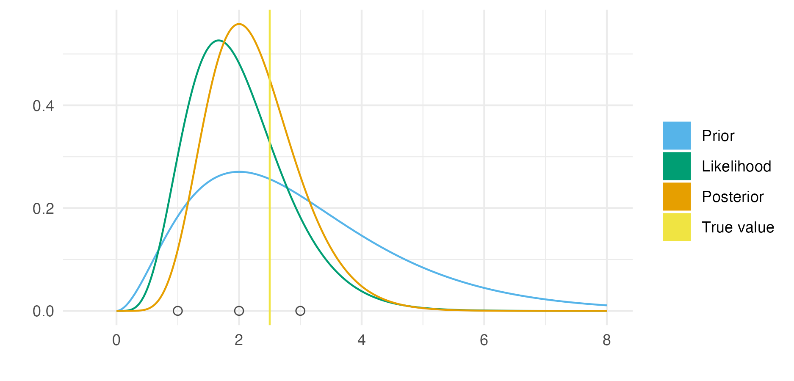

---
#########################################
# options for knitting a single chapter #
#########################################
output:
  bookdown::pdf_document2:
    template: templates/brief_template.tex
    citation_package: biblatex
  bookdown::html_document2: default
  bookdown::word_document2: default
documentclass: book
bibliography: references.bib
---

```{r echo = FALSE}
options(scipen = 100)

knitr::opts_chunk$set(
  echo = FALSE,
  warning = FALSE,
  message = FALSE,
  dpi = 320,
  cache = TRUE,
  out.width = "95%",
  fig.align = 'center'
)
```

# Bayesian spatio-temporal statistics {#bayes-st}
\adjustmtc
\markboth{Bayesian spatio-temporal statistics}{}
<!-- For PDF output, include these two LaTeX commands after unnumbered chapter headings, otherwise the mini table of contents and the running header will show the previous chapter -->

## Bayesian statistics

Bayesian statistics is a mathematical paradigm for learning from data.
Two reasons stand out as to why it is especially well suited to facing the challenges presented in Section \@ref(surveillance).
First, it allows for principled and flexible integration of prior domain knowledge.
Second, uncertainty over all unknown quantities is handled as an integral part of the Bayesian paradigm.
This section provides a brief, and at times opinionated, overview of Bayesian statistics.
For a more complete introduction, I recommend @gelman2013bayesian, @mcelreath2020statistical or @gelman2020bayesian.

### Bayesian modelling

The Bayesian approach to data analysis is based on construction of a probability model for the observed data $\mathbf{y} = (y_1, \ldots, y_n)$.
Parameters $\boldsymbol{\mathbf{\phi}} = (\phi_1, \ldots, \phi_d)$ are used to describe features of the data.
Both the data and parameters are assumed to be random variables, and their joint probability distribution is written as $p(\mathbf{y}, \boldsymbol{\mathbf{\phi}})$.
Subsequent calculations, and the conclusions which follow from them, are made based on manipulating the model using probability theory.

Models are most naturally constructed from two parts, known as the likelihood $p(\mathbf{y} \, | \, \boldsymbol{\mathbf{\phi}})$ and the prior distribution $p(\boldsymbol{\mathbf{\phi}})$.
The joint distribution is obtained by the product of these two parts
\begin{equation}
p(\mathbf{y}, \boldsymbol{\mathbf{\phi}}) = p(\mathbf{y} \, | \, \boldsymbol{\mathbf{\phi}}) p(\boldsymbol{\mathbf{\phi}}). (\#eq:joint)
\end{equation}
The likelihood, as a function of $\boldsymbol{\mathbf{\phi}}$ with $\mathbf{y}$ fixed, reflects the probability of observing the data when the value of the parameters is $\boldsymbol{\mathbf{\phi}}$.
The prior distribution encapsulates beliefs about the parameters $\boldsymbol{\mathbf{\phi}}$ before the data are observed.

Recommendations for specifying prior distributions vary.
The extent to which subjective information should be incorporated into the prior distribution is a central issue.
Proponents of the objective Bayesian paradigm [@berger2006case] put forward that the prior distribution should be non-informative, so as not to introduce subjectivity into the analysis.
Others see subjectivity as fundamental to scientific inquiry, with no viable alternative [@goldstein2006subjective].
Though subjectivity typically discussed with regard to the prior distribution, as we will in Section \@ref(model-structure), the distinction between prior distribution and likelihood is not always clear.
As such, it may be argued that issues of subjectivity are not unique to prior distribution specification, and ultimately that the challenge of specifying the data generating process -- that is, $p(\mathbf{y}, \boldsymbol{\mathbf{\phi}})$ -- is better thought of more holistically [@gelman2017prior].

The probability model can be simulated from to obtain samples $(\mathbf{y}, \boldsymbol{\mathbf{\phi}}) \sim p(\mathbf{y}, \boldsymbol{\mathbf{\phi}})$.
If samples of the data $\mathbf{y}$ differ too greatly from what the analyst would expect to see in reality, then the model fails to capture their prior scientific understanding.
Models which do not produce plausible data samples can be refined.
Checks of this kind [@gelman2013bayesian; Chapter 6] can be used to help iteratively build models, gradually adding complexity as required.

### Bayesian computation

(ref:conjugate) An example of Bayesian modelling and computation for a simple one parameter model. Here the likelihood is $y_i \sim \text{Poisson}(\phi)$ for $i = 1, 2, 3$ and the prior distribution on the rate parameter $\phi > 0$ is $\phi \sim \text{Gamma}(3, 1)$. Observed data $\mathbf{y} = (1, 2, 3)$ was simulated from the distribution $\text{Poisson}(2.5)$. As such, the true data generating process is within the space of models being considered. This situation is sometimes known [@bernardo2001bayesian] as the $\mathcal{M}$-closed world, in contrast to the $\mathcal{M}$-open world where the model is said to be misspecified. Further, the posterior distribution is available in closed form as $\text{Gamma}(9, 4)$. This is because the posterior distribution is in the same family of probability distributions as the prior distribution. Models of this kind are described as being conjugate. Conjugate models are often used because of their convenience. Though other models may be more suitable, Bayesian inference will typically be more computationally demanding than for conjugate models. The posterior distribution here is more tightly peaked than the prior distribution. Contraction of this kind is typical, but not always the case.

```{r conjugate, fig.cap="(ref:conjugate)"}

```

Having constructed a model (Equation \@ref(eq:joint)), the primary goal in a Bayesian analysis is to obtain the posterior distribution $p(\boldsymbol{\mathbf{\phi}} \, | \, \mathbf{y})$.
This distribution encapsulates probabilistic beliefs about the parameters given the observed data.
As such, the posterior distribution has a central role in use of the statistical analysis for decision making.

Using the eponymous Bayes' theorem, the posterior distribution is obtained by
\begin{equation}
p(\boldsymbol{\mathbf{\phi}} \, | \, \mathbf{y}) = \frac{p(\mathbf{y}, \boldsymbol{\mathbf{\phi}})}{p(\mathbf{y})} = \frac{p(\mathbf{y} \, | \, \boldsymbol{\mathbf{\phi}}) p(\boldsymbol{\mathbf{\phi}})}{p(\mathbf{y})}. (\#eq:posterior)
\end{equation}
Unfortunately, most of the time it is intractable to calculate the posterior distribution analytically.
This is because of the potentially high-dimensional integral
\begin{equation}
p(\mathbf{y}) = \int p(\mathbf{y}, \boldsymbol{\mathbf{\phi}}) \text{d}\boldsymbol{\mathbf{\phi}} (\#eq:evidence)
\end{equation}
in the denominator of Equation \@ref(eq:posterior).
The result of this integral is known as the evidence $p(\mathbf{y})$, and quantifies the probability of obtaining the data under the model.
Hence, although it is easy to evaluate a quantity proportional to the posterior distribution
\begin{equation}
p(\boldsymbol{\mathbf{\phi}} \, | \, \mathbf{y}) \propto p(\mathbf{y} \, | \, \boldsymbol{\mathbf{\phi}}) p(\boldsymbol{\mathbf{\phi}}),
\end{equation}
it is typically difficult to evaluate the posterior distribution itself.

The difficulty in performing Bayesian inference may be thought of as analogous to the difficulty in calculating integrals.
As with integration, in specific cases closed form analytic solutions are available.
Figure \@ref(fig:conjugate) illustrates one such case, where the prior distribution and posterior distribution are in the same family of probability distributions.
In the more general case, no analytic solution is available, and computational methods must be relied on.
Broadly, computational strategies for approximating the posterior distribution [@martin2023computing] may be divided into Monte Carlo algorithms and deterministic approximations.

#### Monte Carlo algorithms {#monte-carlo}

Monte Carlo algorithms [@robert2005monte] aim to generate samples from the posterior distribution 
\begin{equation}
\boldsymbol{\mathbf{\phi}}_s \sim p(\boldsymbol{\mathbf{\phi}} \, | \, \mathbf{y}), \quad s \in 1, \ldots S. (\#eq:posterior-samples)
\end{equation}
These samples may be used in any future computations involving the posterior distribution or functions of it.
For example, if $G = G(\boldsymbol{\mathbf{\phi}})$ is a function, then the expectation of $G$ with respect to the posterior distribution can be approximated by
\begin{equation}
\mathbb{E}(G \, | \, \mathbf{y}) = \int G(\boldsymbol{\mathbf{\phi}}) p(\boldsymbol{\mathbf{\phi}} \, | \, \mathbf{y}) \text{d} \boldsymbol{\mathbf{\phi}} \approx \frac{1}{S} \sum_{s = 1}^S G(\boldsymbol{\mathbf{\phi}}_s),
\end{equation}
using the samples from the posterior distribution in Equation \@ref(eq:posterior-samples).
Most quantities of interest can be cast as posterior expectations, which may then be approximated empirically using samples in this way.
Of course, it remains to discuss how the samples are obtained.

Markov chain Monte Carlo (MCMC) methods [@roberts2004general] are the most popular class of sampling algorithms.
Using MCMC, samples are generated from by simulating from an ergodic Markov chain with the posterior distribution as its stationary distribution.
The Metropolis-Hastings [MH; @metropolis1953equation; @hastings1970monte] algorithm uses a proposal distribution $q(\boldsymbol{\mathbf{\phi}}_{s + 1} \, | \, \boldsymbol{\mathbf{\phi}}_s)$ to generate candidate parameters for the next step in the Markov chain.
These candidate parameters are then accepted or rejected with some probability determined based on their log-posterior evaluation.
Many MCMC algorithms, including the Gibbs sampler [@geman1984stochastic], can be thought of as special cases of MH.

Other notable classes of sampling algorithms include importance sampling [IS; @tokdar2010importance] methods, which uses weighted samples, sequential Monte Carlo [SMC; @chopin2020introduction] methods, which are based on sampling from a sequence of distributions, and approximate Bayesian computation [ABC; @sisson2018handbook], which works by comparing simulated data to observed data, and does not require evaluation of the log-posterior.
Though these methods have found applications in specific domains, MCMC is currently more widely used.
The most important benefits of MCMC are its generality, theoretical reliability, and implementation in accessible software packages.

Illustrating the use of MCMC being supported by software, this thesis uses the No-U-Turn sampler [NUTS; @hoffman2014no], a Hamiltonian Monte Carlo [HMC; @duane1987hybrid; @neal2011mcmc] algorithm, as implemented in the `Stan` [@carpenter2017stan] probabilistic programming language (PPL).
HMC uses derivatives of the posterior distribution to generate efficient MH proposal distributions based on Hamiltonian dynamics.
Three tuning parameters control the behaviour of the HMC algorithm [Section 15.2; @stan2023reference].
NUTS automatically adapts these parameters based local properties of the posterior distribution.
Though not a one-size-fits-all solution, NUTS has been shown empirically to be a good choice for sampling from a range of posterior distributions.
Figure \@ref(fig:stan) shows an example of using the NUTS MCMC algorithm to sample from a posterior distribution.

After running an MCMC sampler, it is important that diagnostic checks are used to evaluate convergence and assess whether the results of the Markov chain can be used to compute posterior quantities.
It is never possible to be sure that results computed from MCMC will be accurate, though it is possible to know when they will be inaccurate.
Panel \@ref(fig:stan)B shows the traceplot for a Markov chain which has converged, and moves freely through the range of plausible parameter values.
A range of convergence diagnostics have been developed for MCMC [@roy2020convergence; @margossian2023many].
Two widely used examples are the potential scale reduction factor $\hat R$ [@gelman1992inference], which compares the variance between and within parallel Markov chains, and the effective sample size (ESS), which measures the efficiency of samples drawn from MCMC.

(ref:stan) NUTS can be used to sample from the posterior distribution described in Figure \@ref(fig:conjugate). Panel A shows a histogram of the NUTS samples as compared to the true posterior. The visual appearance of a histogram depends highly on the number of bins chosen, though it does not depend on tuning parameters like kernel density estimation. Other visualisations, such as empirical cumulative difference function plots, though less initially intuitive, are preferred for accurate distributional sample comparisons. Panel B is a traceplot showing the path of the Markov chain $\{\phi_s\}_{s = 1}^{1000}$ as it explores the posterior distribution. In this case, the Markov chain moves freely throughout the posterior distribution, without getting stuck in any one location for long, indicating good performance of the sampler. Panel C shows convergence of the empirical posterior mean $\frac{1}{s} \sum_{l \leq s} \phi_l$ to the true value of $\mathbb{E}(\phi)$ as more iterations of the Markov chain are included in the sum. In this case, the samples from NUTS are highly accurate in estimating this posterior expectation.

```{r stan, fig.cap="(ref:stan)"}
knitr::include_graphics("figures/bayesian/stan.png")
```

#### Deterministic approximations

The Monte Carlo methods discussed in Section \@ref(monte-carlo) make use of stochasticity to generate samples from the posterior distribution.
Deterministic approximations offer an alternative approach, often focused more directly on approximating the posterior distribution or posterior normalising constant.
These approaches can be faster than Monte Carlo methods, especially for large datasets or models.
That said, they lack strong theoretical guarantees of accuracy.

One prominent deterministic approximation is the Laplace approximation.
It involves approximating the posterior normalising constant using Laplace's method of integration.
This is equivalent to approximating the posterior distribution by a Gaussian distribution.
Numerical integration, or quadrature, is another deterministic approach in which the posterior normalising constant is approximated using a weighted sum of evaluations of the unnormalised posterior distribution.
The integrated nested Laplace approximation [INLA; @rue2009approximate] combines quadrature with the Laplace approximation.
These methods are used throughout this thesis.
In depth discussion is left to Chapter \@ref(naomi-aghq).

Variational inference [VI; @blei2017variational] is another important deterministic approximation.
The well-known expectation maximisation [EM; @dempster1977maximum] and expectation propagation [EP; @minka2001expectation] algorithms are closely related to VI.
In VI, the approximate posterior distribution is assumed to belong to a particular family of functions.
Optimisation algorithms are then used to choose the best member of that family, typically by minimising the Kullback-Leibler divergence to the posterior distribution.
VI lacks theoretical guarantees and is known to often inaccurately estimate posterior variances [@giordano2018covariances].
As such, statisticians tend to approach VI with caution, despite its relative widespread acceptance within the machine learning community.
Developing diagnostics to evaluate the accuracy of VI is an important area of ongoing research [@yao2018yes].

### Interplay between modelling and computation

Modern computational techniques and software like PPLs have succeeded in abstracting away calculation of the posterior distribution from the analyst for many models.
However, computation remains intractable in, depending on the measure used, what can be argued to be the majority of cases.
The analyst needs therefore not only to be concerned with choosing a model suitable for the data, but with choosing a model for which the posterior distribution may tractably be calculated in reasonable time.
As such, there is an important interplay between modelling and computation, wherein models are bound by the limits of computation.
As computational techniques and tools improve, the space of models available to the analyst expands.
Exactly the focus of Chapter \@ref(naomi-aghq) is on expanding the space of models practically available to analysts.

## Spatio-temporal statistics {#st-statistics}

Space and time are important features of infectious disease data, including those related to HIV.
The field of spatio-temporal statistics [@cressie2015statistics] is concerned with such observations, indexed by spatial and temporal location.
It unifies the fields of spatial statistics [@bivand2008applied], concerned with observations indexed by space, and time series analysis [@shumway2017time], concerned with observations indexed by time.
First, Section \@ref(properties) characterises the shared properties of spatio-temporal data.
Then, Section \@ref(small-area-estimation) describes how these properties facilitate the class of small-area estimation methods used in this thesis.

### Properties of spatio-temporal data {#properties}

Three important properties are discussed in this section: scale, correlation structure, and size.

#### Scale

(ref:st) In Panel A, the spatial location of Cape Town in South Africa can be considered a point, and the ZF Mgcawu District Municipality (DM) can be considered as an an area. In Panel B, World AIDS Day, designated on the 1st of December every year, can be considered a point in time, whereas the second fiscal quarter, running through April, May and June, and denoted by Q2 represents a period of time. In reality, both Cape Town and World AIDS Day are areas, rather than true point locations. Instances of infinitesimal point locations in everyday life, outside of mathematical abstraction, are rare.

```{r st, fig.cap="(ref:st)"}
knitr::include_graphics("figures/bayesian/st.png")
```

The scale of spatio-temporal data refers to its extent and resolution.
Its extent is the size of the spatial study region and length of time over which data was collected.
Its resolution is how fine-grained those observations were.

In this thesis, the spatial study region $\mathcal{S} \subseteq \mathbb{R}^2$ used is typically a country or collection of countries.
It is assumed to have two dimensions, corresponding to latitude and longitude.
Observations may be associated to a point $s \in \mathcal{S}$ or area $A \subseteq \mathcal{S}$ in the spatial study region, illustrated in Panel A\@ref(fig:st).
The temporal study period $\mathcal{T} \subseteq \mathbb{R}$ can more generally be assumed to be one-dimensional.
This feature, together with the fact that time only moves forward, is what distinguishes space and time. 
As with space, observations may be associated to a point $t \in \mathcal{T}$ or period of time $T \subseteq \mathcal{T}$, illustrated in Panel B\@ref(fig:st).

The change-of-support problem [@gelfand2001change] occurs when data is modelled at a scale different to the one it was observed at.
For example, in this thesis, particularly Chapter \@ref(beyond-borders), point data is modelled at an area-level.
Special cases of the change-of-support problem include downscaling, upscaling, and dealing with so-called misaligned data.
It is also possible that spatio-temporal observations of the same process are made at multiple scales.
Jointly modelling data at different scales simultaneously is another closely related challenge to the change-of-support problem.

#### Correlation structure {#correlation-structure}

In "The Design of Experiments" @fisher1936design observed that neighbouring crops were more likely to have similar yields than those far apart.
This observation was later termed Tobler's first law of geography: "everything is related to everything else, but near things are more related than distant things" [@tobler1970computer].
As well as space, Tobler's first law applies to time, in that observations made close together in time tend to be similar.

This law can be formalised using space-time covariance functions, measuring the dependence of observations across their spatial and temporal dimensions.
A space-time covariance structure [@porcu202130] is said to be separable when it can be factorised as a product of individual spatial and temporal covariances, and nonseparable when it can't.
A separable space-time covariance could have spatial and temporal components which are either independent and identically distributed (IID) or structured [@knorr2000bayesian].
Spatial covariance functions are called isotropic when they apply equally in all directions, and stationary when they are invariant over space.
Temporal covariance structures are often periodic, corresponding to daily, weekly, monthly, quarterly, or yearly cycles.

That spatio-temporal data are rarely IID is a statistically important point.
The consequence is that it is rare to have true replicates available.
Typically, only a single instance of a spatio-temporal can ever be realised.

#### Size

Data with both spatial and temporal dimensions are often large.
For example, observations collected every week across a number of sites in a country can easily number in the thousands.
Storage and mathematical operations with large spatio-temporal data can be challenging.

Further, models for spatio-temporal data typically require many parameters.
Whereas large IID data can be modelled using a small number of parameters, each observation in a spatio-temporal dataset may need to be characterised by its own parameters.
In combination, large data (big $n$) and models with a large number of parameters (big $d$) make Bayesian inference, and other complex mathematical operations, challenging for spatio-temporal data.

### Small-area estimation {#small-area-estimation}

(ref:zmb-maps) Simulation of a simple random sample $y_i \sim \text{Bin}(m, p_i)$ with varying sample size $m = 5, 25, 125$ in each of the $i = 1, \ldots, 156$ constituencies of Zambia. Direct estimates were obtained by the empirical ratio of data to sample size. Modelled estimates were obtained using a logistic regression with linear predictor given by an intercept and a spatial random effect. Estimates of HIV indicators for Zambia have previously been generated at the district-level, comprising 116 spatial units. Moving forward, there is interest in generating estimates at the higher-resolution constituency level, as program planning is devolved locally. The viridis colour palette, as implemented by the `viridis` R package [@viridis], was used in this figure. It is use often throughout this thesis because it is perceptually uniform and accessible to colourblind viewers [@smith2015better]. This figure was adapted from a presentation given for the Zambia HIV Estimates Technical Working Group, available from [`https://github.com/athowes/zambia-unaids`](https://github.com/athowes/zambia-unaids).

```{r zmb-maps, fig.cap="(ref:zmb-maps)"}
knitr::include_graphics("figures/bayesian/zmb-maps.png")
```

(ref:zmb-scatter) The setting of this figure matches that of Figure \@ref(fig:zmb-maps). Estimates from surveys with higher sample size have higher sample Pearson correlation coefficient $R$ with the underlying truth, illustrating the benefit of collecting more data. For a fixed sample size however, correlation can be improved by using modelled estimates to borrow information across spatial units, rather than using the higher variance direct estimates. Points along the dashed diagonal line correspond to agreement between the estimate obtained from the survey and the underlying truth used to generate the data. For each sample size, using a spatial model increases the correlation between the estimates and underlying truth. The effect is more pronounced for lower sample sizes.

```{r zmb-scatter, fig.cap="(ref:zmb-scatter)"}
knitr::include_graphics("figures/bayesian/zmb-scatter.png")
```

Data always has some cost to collect.
This cost can be significant and prohibitive.
Especially for data relating to people, where collection is difficult to automate.
In spatio-temporal statistics, there are a large number of possible locations in space and time.
Given the cost of data collection, often no or limited direct observations may be available for any given space-time location.
Direct estimates of indicators of interest are either impossible or inaccurate in this setting.

Small-area estimation [SAE; @pfeffermann2013new] methods aim to overcome the limitations of small data by sharing information.
In the spatio-temporal setting sharing of information occurs across space and time.
Prior knowledge that observations in one spatio-temporal location are correlated with those at another (Section \@ref(correlation-structure)) can be used to improve estimates.

Figures \@ref(fig:zmb-maps) and \@ref(fig:zmb-scatter) illustrate the unreliability of direct estimates from small sample sizes, and the benefit of using a spatial model to overcome this limitation.
The effect is most pronounced for the sample size of 5, where the only possible direct estimates are 0, 0.2, 0.4, 0.6, 0.8 and 1.
Using a spatial model to borrow information across space in this case results in improvement of the Pearson correlation coefficient between the estimates and the true underlying values from 0.34 to 0.53.

SAE methods are not only useful in the spatio-temporal setting.
More generally, they apply in any situation where data are limited for subpopulations of interest.
Just as these subpopulations can be generated by spatio-temporal variables, they can be generated by other variables.
One such example is demographic variables.
Analogous to spatio-temporal correlation structure, we also can often expect there to be demographic correlation structure.
For example, those of the same sex are more likely to be similar, as are those of similar ages or socio-economic strata.

## Model structure {#model-structure}

The spatio-temporal data used in this thesis is not IID (Section \@ref(correlation-structure)).
This section discusses ways to use statistical models to encode more complex relations between observations mathematically.
Simple structures are discussed first, beginning with the linear model.
Extensions are introduced one at a time, culminating in the model structures used throughout the thesis.

### Linear model

In a linear model, each observation $y_i$ with $i \in [n]$ is modelled using a Gaussian distribution
\begin{equation}
y_i \sim \mathcal{N}(\mu_i, \sigma).
\end{equation}
The conditional mean $\mu_i$ is assumed to be linearly related to a collection of $p$ covariates $z_{1i}, \ldots, z_{pi}$
\begin{align}
\mu_i &= \eta_i \\
\eta_i &= \beta_0 + \sum_{l = 1}^{p} \beta_l z_{li}. (\#eq:linear-model)
\end{align}
Priors may be placed on the regression coefficients, as well as the observation standard deviation
\begin{align}
\beta_l &\sim p(\beta_l), \quad l = 0, \ldots, p, \\
\sigma &\sim p(\sigma).
\end{align}
While the linear model provides a useful foundation, its strong assumptions and limited flexibility call for careful use.

### Generalised linear model

Generalised linear models (GLMs) extend the linear model by allowing the conditional mean $\mu_i$ to be connected to the linear predictor $\eta_i$ via a link function $g$ as follows
\begin{align}
y_i &\sim p(y_i \, | \, \eta_i), \\
\mu_i &= \mathbb{E}(y_i \, | \, \eta_i) = g(\eta_i). 
\end{align}
The logistic function $g(\eta) = \exp(\eta) / (1 + \exp(\eta))$ is commonly used as a link function to ensure that the conditional mean is in the range $[0, 1]$.
Similarly, the exponential function $g(\eta) = \exp(\eta)$ can be used to ensure the conditional mean is positive.
The linear model is a special case of a GLM where the link function $g$ is the identity.
As well, GLMs admit a wider range of likelihoods $p(y_i \, | \, \eta_i)$ than linear models, typically restricted to the so-called exponential family of distributions.
The equation for the linear predictor is the same as the linear model case in Equation \@ref(eq:linear-model).

### Generalised linear mixed effects model

In a generalised linear mixed effects model (GLMM) the linear predictor of the GLM is extended as follows
\begin{equation}
\eta_i = \beta_0 + \sum_{l = 1}^{p} \beta_l z_{li} + \sum_{k = 1}^{r} u_k(w_{ki}).
\end{equation}
The terms $\beta_l$ are referred to as fixed effects.
The terms $u_k$ are called random effects, of additional covariates $w_{ki}$.
The words fixed and random effects have notoriously many different and incompatible definitions which unfortunately can cause confusion [@gelman2005analysis].

Random effects allow for more complex sharing of information between observations.
To demonstrate this fact, first consider the model
\begin{equation}
\eta_i = \beta_0.
\end{equation}
In this model all observations are assumed to be equivalent, and as such information is said to be completely pooled together.
Second, consider the so-called no pooling model
\begin{equation}
\eta_i = \beta_0 + \beta_1 z_i,
\end{equation}
with $z_i \in \{0, 1\}$ a binary covariate.
Now, there are two groups of observations, each of which with its own mean: $\beta_0$ for the first group and $\beta_0 + \beta_1$ for the second.
No amount of information is shared between the two groups.
Finally, consider an intermediate between these two extremes, known as the partial pooling model.
In the partial pooling model, the extent to which information is shared between groups is learnt rather than fixed to either extreme at the outset, as with the complete or no pooling models.
The parameter $\beta_0$ applies to all groups, and each group is differentiated by a specific value of the random effects $u_i$.

Random effects can be structured to share information between some observations more than others.
In spatio-temporal statistics, structured spatial and temporal random effects are often used to encode smoothness in space or time.
In contrast, unstructured random effects treat groups of observations as being exchangeable.

Generalised additive models [GAMs; @wood2017generalized; @hastie1987generalized] are another class of models which extend GLMs.
Though GAMs place more of a focus on using $u_k$ to model non-linear relationships between covariates and the response variable, they can also be cast to fit into the GLMM framework.

### Latent Gaussian model {#lgm}

Latent Gaussian models [LGMs; @rue2009approximate] are a type of GLMMs in which Gaussian priors are used for many of the models parameters.
More specifically, these parameters are $\beta_0$, $\{\beta_j\}$, $\{u_k(\cdot)\}$, and can be collected into a vector $\mathbf{x} \in \mathbb{R}^N$ called the latent field.
The Gaussian prior distribution is then
\begin{equation}
\mathbf{x} \sim \mathcal{N}(\mathbf{0}, \mathbf{Q}(\boldsymbol{\mathbf{\theta}}_2)^{-1}),
\end{equation}
where $\boldsymbol{\mathbf{\theta}}_2 \in \mathbb{R}^{s_2}$ are hyperparameters, with $s_2$ assumed small.
The vector $\boldsymbol{\mathbf{\theta}}_1 \in \mathbb{R}^{s_1}$, with $s_1$ assumed small, are additional parameters of the likelihood.
Let $\boldsymbol{\mathbf{\theta}} = (\boldsymbol{\mathbf{\theta}}_1, \boldsymbol{\mathbf{\theta}}_2) \in \mathbb{R}^m$ with $m = s_1 + s_2$ be all hyperparameters, with prior distribution $p(\boldsymbol{\mathbf{\theta}})$.
The posterior distribution under an LGM in then
\begin{equation}
p(\mathbf{x}, \boldsymbol{\mathbf{\theta}} \, | \, \mathbf{y}) \propto p(\mathbf{y} \, | \, \mathbf{x}, \boldsymbol{\mathbf{\theta}}) p(\mathbf{x} \, | \, \boldsymbol{\mathbf{\theta}}) p(\boldsymbol{\mathbf{\theta}}),
\end{equation}
with the complete set of parameters $\boldsymbol{\mathbf{\phi}} = (\mathbf{x}, \boldsymbol{\mathbf{\theta}})$, and $N + m = d$.

### Extended latent Gaussian model {#elgm}

Extended latent Gaussian models [ELGMs; @stringer2022fast] facilitate modelling of data with greater non-linearities than an LGM.
In an ELGM, the structured additive predictor is redefined as
\begin{equation}
\boldsymbol{\mathbf{\eta}} = (\eta_1, \ldots \eta_{N_n}),
\end{equation}
where $N_n \in \mathbb{N}$ is a function of $n$.
Unlike in the LGM case, it is possible that $N_n \neq n$.
Each mean response $\mu_i$ now depends on some subset $\mathcal{J}_i \subseteq [N_n]$ of indices of $\boldsymbol{\mathbf{\eta}}$, with $\cup_{i = 1}^n \mathcal{J}_i = [N_n]$ and $1 \leq |\mathcal{J}_i| \leq N_n$, where $[N_n] = \{1, \ldots, N_n\}$.
The inverse link function $g(\cdot)$ is redefined for each observation to be a possibly many-to-one mapping $g_i: \mathbb{R}^{|\mathcal{J}_i|} \to \mathbb{R}$, such that $\mu_i = g_i(\boldsymbol{\mathbf{\eta}}_{\mathcal{J}_i})$.
Put together, ELGMs are of the form
\begin{align*}
y_i &\sim p(y_i \, | \, \boldsymbol{\mathbf{\eta}}_{\mathcal{J}_i}, \boldsymbol{\mathbf{\theta}}_1), \quad i = 1, \ldots, n, \\
\mu_i &= \mathbb{E}(y_i \, | \, \boldsymbol{\mathbf{\eta}}_{\mathcal{J}_i}) = g_i(\boldsymbol{\mathbf{\eta}}_{\mathcal{J}_i}), \\
\eta_j &= \beta_0 + \sum_{l = 1}^{p} \beta_l z_{li} + \sum_{k = 1}^{r} u_k(w_{ki}), \quad j \in [N_n].
\end{align*}
The latent field and hyperparameter prior distributions are equivalent to the LGM case.

Though the ELGM model class was only introduced recently, it connects much of the work done in this thesis.
While it can be transformed to an LGM using the Poisson-multinomial transformation [@baker1994multinomial], the multinomial logistic regression model used in Chapter \@ref(multi-agyw) is most naturally written as an ELGM, where each observation depends on the set of structured additive predictors corresponding to the set of multinomial observations.
In Chapter \@ref(naomi-aghq), the Naomi small-area estimation model used to produce estimates of HIV indicators is shown have ELGM-like features.

## Model comparison {#model-comparison}

Many models can be fit to the same data during the course of an analysis.
Model comparison methods are used to determine which is the most suitable for use.
This section focuses on measuring suitability via the model's predictive performance [@vehtari2012survey].

Ideally, new data $\tilde{\mathbf{y}} = (\tilde{y}_1, \ldots, \tilde{y}_n)$ drawn from the true data generating process would be available to test predictive performance.
The log predictive density for new data (LPD) [@gelman2014understanding] is one measure of out-of-sample predictive performance given by
\begin{equation}
\text{lpd} = \sum_{i = 1}^n \log p(\tilde y_i \, | \, \mathbf{y}) = \sum_{i = 1}^n \log p(\tilde y_i \, | \, \boldsymbol{\mathbf{\phi}}) p(\boldsymbol{\mathbf{\phi}} \, | \, \mathbf{y}) \text{d}\boldsymbol{\mathbf{\phi}}. (\#eq:lpd)
\end{equation}
The expected LPD (ELPD) integrates the LPD over the data generating process to give a measure of expected performance
\begin{equation}
\text{elpd} = \sum_{i = 1}^n \log \int p(\tilde y_i \, | \, \mathbf{y}) p(\tilde y_i) \text{d} \tilde y_i. (\#eq:elpd)
\end{equation}
In reality, such data are not usually available, and instead the ELPD must be approximated using the available data.

### Information criteria {#information-criteria}

Information criteria can be constructed to approximate the ELPD using adjusted within-sample predictive performance.
The Akaike [AIC; @akaike1973information] and deviance [DIC; @spiegelhalter2002bayesian] information criteria estimate ELPD by
\begin{equation}
\text{elpd}_\texttt{IC} = \log p(\mathbf{y} \, | \, \hat{\boldsymbol{\mathbf{\phi}}}), (\#eq:aic-elpd)
\end{equation}
where $\hat{\boldsymbol{\mathbf{\phi}}}$ is a maximum likelihood estimate (AIC) or Bayesian point estimate (DIC).
The widely applicable information criteria [WAIC; @watanabe2013widely] improves upon Equation \@ref(eq:aic-elpd) by instead using the predictive density of the data
\begin{align}
  \text{elpd}_\texttt{WAIC} = \sum_{i = 1}^n \log p(y_i \, | \, \mathbf{y}). (\#eq:waic-elpd)
\end{align}
As both Equations \@ref(eq:aic-elpd) and \@ref(eq:waic-elpd) are based on within-sample measures, they overestimate the ELPD.
As such, they are adjusted downward by a complexity penalty $p_{\texttt{IC}}$.
The particular penalty varies depending on the particular information criteria.

### Cross-validation {#cross-validation}

Cross-validation is an alternative way to estimate the ELPD.
Rather than use a complexity penalty, as in Section \@ref(information-criteria), to adjust a within-sample estimate, cross-validation (CV) partitions the data into training and held-out sets of data.
For example, in a leave-out-out (LOO) CV there are $n$ partitions, where each held-out set is a single observation.
The LOO-CV estimate of ELPD is
\begin{align}
  \text{elpd}_\texttt{LOO-CV} = \sum_{i = 1}^n \log p(y_i \, | \, \mathbf{y}_{-i}), (\#eq:loo-cv-elpd)
\end{align}
where the subscript $-i$ refers to all elements of the vector excluding $i$.
Naively, computing $\text{elpd}_\texttt{LOO-CV}$ requires refitting the model $n$ times.
This can be computationally costly, and so approximation strategies have been developed.
Importance sampling methods using the the full posterior as a proposal are a notable example, including Pareto-smoothed importance sampling [PSIS; @vehtari2017practical].

<!-- $K$-fold cross-validation, divide data into $K$ blocks. -->
<!-- Other cross-validation schemes for specific settings. -->
<!-- Importance sampling less likely to work in some settings, like the spatial. -->

### Scoring rules

Scoring rules [SR; @gneiting2007strictly] measure the quality of probabilistic forecasts.
The log score, used above in the ELPD, is one example of a scoring rule.
However, it is by no means the only possibility.
Any information criterion (Section \@ref(information-criteria)) or cross-validation strategy (Section \@ref(cross-validation)) can be redefined using a different scoring rule, or utility function more broadly.
Possible examples include the root mean square error (RMSE), variance explained ($R^2$) or classification accuracy.

The log score (LS) is popular, in par,t because it is an example of a strictly proper scoring rule (SPSR).
A scoring rule is strictly proper when the forecaster gains maximum expected reward by reporting their true probability distribution.
Any scoring rule which does not admit this property is susceptible to manipulation, in some sense.
The continuous ranked probability score [CRPS; @matheson1976scoring], which generalises the Brier score [@brier1950verification] beyond binary classification, is another example of a SPSR.
Ideally, the correct scoring rule to use in an analysis should be determined based upon the application setting.

### Bayes factors

Finally, the evidence $p(\mathbf{y})$, given in Equation \@ref(eq:evidence), can also be used as a measure of model performance.
If $\mathcal{M}_0$ and $\mathcal{M}_1$ are two competing models, then the Bayes factor comparing $\mathcal{M}_0$ to $\mathcal{M_1}$ is
\begin{equation}
B_{01} = \frac{p(\mathbf{y} \, | \, \ \mathcal{M}_0)}{p(\mathbf{y} \, | \, \ \mathcal{M}_1)},
\end{equation}
where $p(\mathbf{y} \, | \, \ \mathcal{M})$ denotes the evidence under model $\mathcal{M}$.
The Bayes factor can be interpreted as supporting the maximum a posteriori model.
If $B_{01} > 1$ then support is provided for $\mathcal{M}_0$ and if $B_{01} < 1$ then support is provided for $\mathcal{M}_1$.
Bayes factors can also be framed as predictive criteria according to the decomposition
\begin{equation}
p(\mathbf{y}) = p(y_1) p(y_2 \, | \, y_1) \cdots p(y_n \, | \, y_{n - 1}, \ldots, y_1).
\end{equation}

## Survey methods {#survey}

Large national household surveys (Section \@ref(hiv-data)) provide the highest quality population-level information about HIV indicators in SSA.
Demographic and Health Surveys [DHS; @measure2012sampling] are funded by the United States Agency for International Development (USAID) and run every three to five years in most countries.
Population-based HIV Impact Assessment (PHIA) surveys are funded by PEPFAR and run every four to five years in high HIV burden countries.

Analysis of responses from survey methods can require specific methods.
This section provides required background, before describing the survey design approach used by household surveys in SSA, and the methods used to analyse this data in this thesis.

### Background

Consider a population of $N$ individuals, indexed by $i$, with outcomes of interest $y_i$.
If a census were run, with all responses recorded, then any population quantities of interest could be directly calculated.
However, running a census is usually too expensive or otherwise impractical.
As such, in a survey only a subset of individuals are sampled: let $S_i$ be an indicator for whether or not individual $i$ is sampled.
Furthermore, only a subset of those sampled have their outcome recorded, due to nonresponse or otherwise: let $R_i$ be an indicator for whether or not $y_i$ is recorded.
If $S_i = 0$ then $R_i = 0$, and if $S_i = 1$ then individual $i$ may not respond such that $R_i = 0$.
Consider a function $G_i = G(y_i)$.
The population mean of $G$ is
\begin{equation}
\bar G = \frac{1}{N} \sum_{i = 1}^N G(y_i),
\end{equation}
and a direct estimate of $\bar G$ based on the recorded subset of the population is
\begin{equation}
\bar G_R = \frac{\sum_{i = 1}^N R_i G(y_i)}{\sum_{i = 1}^N R_i}, (\#eq:direct)
\end{equation}
where $m_R = \sum_{i = 1}^N R_i$ is the recorded sample size.

In a probability sample, individuals are selected to be included in the survey at random.
On the other hand, in a non-probability sample, inclusion or exclusion from the survey is deterministic.
A simple random sample (SRS) is a probability sample where the sampling probability for each individual is equal $\mathbb{P}(S_i = 1) = 1 / N$.
A survey design is called complex when the sampling probabilities for each individual vary, such that $\mathbb{P}(S_i = 1) = \pi_i$, with $\sum_{i = 1}^N \pi_i = 1$ and $\pi_i > 0$.
Complex survey designs can offer both greater practicality and statistical efficiency than a SRS.
However, care is required in analysing data collected using complex survey designs.
Under a complex design, not accounting for unequal sampling probabilities will result in bias.
That said, even under SRS, nonresponse analogous bias can be caused by non-response.

### Survey design

The DHS employs a two-stage sampling procedure, outlined here following @measure2012sampling.
In the first stage, ennumeration areas from a recently conducted census are typically used as the primary sampling unit, or cluster.
Each cluster is assigned to a strata $h$ by region, as well as by urban-rural status.
After appropriate strata sample sizes $n_h$ are determined, EAs are sampled with probability proportional to number of households
\begin{equation}
\pi_{1hj} = n_h \times \frac{N_{hj}}{\sum_j N_{hj}},
\end{equation}
where $N_{hj}$ is the number of households in strata $h$ and cluster $j$.
In the second stage, the secondary sampling units are households.
All households in the selected cluster are listed, before being sampled systematically at a regular interval, with equal probability
\begin{equation}
\pi_{1hj} = \frac{n_{hj}}{N_{hj}},
\end{equation}
where $n_{hj}$ is the number of households selected in cluster $j$ and stratum $h$.
All adults are interviewed in each selected household.
As a result, the probability an individual is sampled is equal to the probability their household is sampled $\pi_{hj} = \pi_{1hj} \times \pi_{2hj}$.

### Survey analysis

Suppose a survey is run with complex design, and sampling probabilities $\pi_i$.
Some individuals are more likely to be included in the survey than others.
By over-weighting the responses of those unlikely to be included, and under-weighting the responses of those likely to be included, this feature can be taken into account.
Design weights $\delta_i = 1 / \pi_i$ can be thought of as the number of individuals in the population represented by the $i$th sampled individual.
Let
\begin{equation}
\mathbb{P}(R_i = 1 \, | \, S_i = 1) = \upsilon_i
\end{equation}
be the probability of response for sampled individual $i$.
Nonresponse can be handled using nonresponse weights $\gamma_i = 1 / \upsilon_i$, which analogously can be thought of as the number of sampled individuals represented by the $i$th recorded individual.
Multiplying the design and nonresponse weights gives survey weights $\omega_i = \delta_i \times \gamma_i$.

Extending Equation \@ref(eq:direct), a weighted estimate [@hajek1971discussion] of the population mean using the survey weights $\omega_i$ is
\begin{equation}
\bar G_\omega = \frac{\sum_{i = 1}^N \omega_j R_i G(y_i)}{\sum_{i = 1}^N \omega_i R_i}. (\#eq:hajek)
\end{equation}
Following @meng2018statistical and @bradley2021unrepresentative, decomposing the additive error $\bar G_\omega - \bar G$ of Equation \@ref(eq:hajek) provides useful intuition as to the benefits of survey weighting [@bailey2023new].
Under SRS then, the error is a product of three terms
\begin{align}
\bar G_\omega - \bar G &= \frac{\mathbb{E}(\omega_i R_i G_i)}{\mathbb{E}(\omega_i R_i)} - \mathbb{E}(G_i) = \frac{\mathbb{C}(\omega_i R_i G_i)}{\mathbb{E}(\omega_i R_i)} \\ 
&= \rho_{R_\omega, G} \times \sqrt{\frac{N - m_{R_\omega}}{m_{R_\omega}}} \times \sigma_G,
\end{align}
where $R_\omega = \omega R$.
The first term is called the data defect correlation (DDC), and measures the correlation between the weighted recording mechanism and given function of the outcome of interest.
The DDC is minimised when $G \perp \!\!\! \perp R_\omega$.
The second term is the data scarcity, and measures the effective proportion of the population who have been recorded.
Finally, the third term is the problem difficultly, and measures the intrinsic difficulty of the estimation problem.
This term is independent of the sampling or analysis method used.

This thesis uses hierarchical Bayesian models defined using weighted direct survey estimates [@fay1979estimates].
Following @chen2014use, the sampling distribution of these direct estimates is arrived at using by estimating the variance of Equation \@ref(eq:hajek).
Although this approach acknowledges the complex survey design, it has some important limitations.
Importantly, it ignores clustering structure within the observations $i$.
Furthermore, as a two-step procedure, it fails to fully propagate uncertainty from a Bayesian perspective.
While progress has been made in dealing with survey data, the @gelman2007struggles claim that "survey weighting is a mess" still holds some weight.
