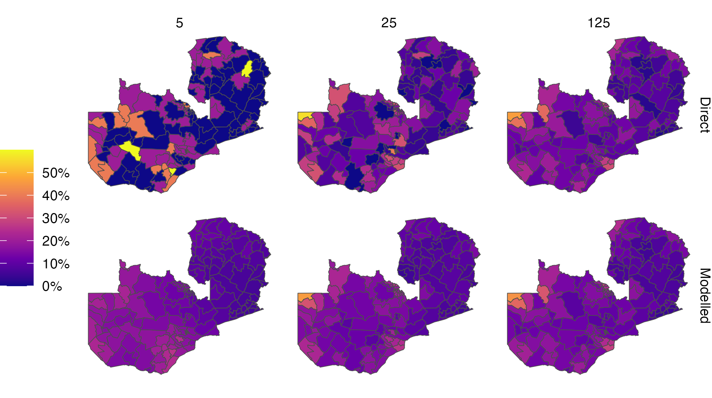

---
#########################################
# options for knitting a single chapter #
#########################################
output:
  bookdown::pdf_document2:
    template: templates/brief_template.tex
    citation_package: biblatex
  bookdown::html_document2: default
  bookdown::word_document2: default
documentclass: book
bibliography: references.bib
---

```{r echo = FALSE}
options(scipen = 100)

knitr::opts_chunk$set(
  echo = FALSE,
  warning = FALSE,
  message = FALSE,
  dpi = 320,
  cache = TRUE,
  out.width = "95%",
  fig.align = 'center'
)
```

# Bayesian spatio-temporal statistics {#bayes-st}
\adjustmtc
\markboth{Bayesian spatio-temporal statistics}{}
<!-- For PDF output, include these two LaTeX commands after unnumbered chapter headings, otherwise the mini table of contents and the running header will show the previous chapter -->

## Bayesian statistics

Bayesian statistics is a mathematical paradigm for learning information from data.
It is especially well suited to facing the challenges posed by Section \@ref(surveillance) because it allows for principled and flexible integration of prior domain knowledge.
Additionally, uncertainty over all unknown quantities is handled as an integral part of the Bayesian paradigm.
This section provides a brief and opinionated overview.
For a more complete introduction, I recommend @gelman2013bayesian, @mcelreath2020statistical or @gelman2020bayesian.

### Bayesian modelling

The Bayesian approach to data analysis is based on construction of a probability model for the observed data $\mathbf{y} = (y_1, \ldots, y_n)$ together with parameters $\boldsymbol{\mathbf{\phi}} = (\phi_1, \ldots, \phi_d)$.
Choice of the particular parameters used depends upon the requirements of the analysis.
All quantities are assumed to be random variables, and the model is written as $p(\mathbf{y}, \boldsymbol{\mathbf{\phi}})$, where $p(\cdot)$ denotes a probability distribution.
Subsequent calculations are based on manipulation of this model using probability theory.

Models can be most naturally constructed from two parts, known respectively as the likelihood $p(\mathbf{y} \, | \, \boldsymbol{\mathbf{\phi}})$ and the prior distribution $p(\boldsymbol{\mathbf{\phi}})$.
The joint distribution is obtained by the product $p(\mathbf{y}, \boldsymbol{\mathbf{\phi}}) = p(\mathbf{y} \, | \, \boldsymbol{\mathbf{\phi}}) p(\boldsymbol{\mathbf{\phi}})$.
The likelihood, as a function of $\boldsymbol{\mathbf{\phi}}$ with $\mathbf{y}$ fixed, reflects the probability of observing the data when the value of the parameters is $\boldsymbol{\mathbf{\phi}}$.
The prior distribution encapsulates beliefs about the parameters $\boldsymbol{\mathbf{\phi}}$ before the data are observed.

Recommendations for specifying prior distributions vary.
The extent to which subjective information should be incorporated into the prior distribution, and in doing so influence the posterior distribution, is a central topic of discussion.
Proponents of the objective Bayesian paradigm [@berger2006case] put forward that the prior distribution should be non-informative, so as not to introduce subjectivity into the analysis.
That said, we shall see in Section \@ref(hierarchical-lgm-elgm) that the distinction between likelihood and prior distribution can be unclear.
As such, it may be argued that issues of subjectivity are not unique to the prior distribution, and ultimately the challenge of specifying the data generating process is better thought of more holistically.

<!-- Could cite @gelman2017prior here. -->

The probability model can be simulated from to obtain samples $(\mathbf{y}, \boldsymbol{\mathbf{\phi}}) \sim p(\mathbf{y}, \boldsymbol{\mathbf{\phi}})$.
If the samples of $\mathbf{y}$ differ too greatly from what the analyst would expect, then the model does not capture their prior scientific understanding of the data.
Models which do not produce plausible samples can be refined.
Checks of this kind [@gelman2013bayesian; Chapter 6] can be used to help iteratively build models, adding complexity gradually as required.

### Bayesian computation

(ref:conjugate) An example of Bayesian modelling and computation for a simple one parameter model. Here the likelihood is $y_i \sim \text{Poisson}(\phi)$ for $i = 1, 2, 3$ and prior distribution on the rate parameter is $\phi \sim \text{Gamma}(3, 1)$. I simulated observed data $\mathbf{y} = (1, 2, 3)$ from the distribution $\text{Poisson}(2.5)$. As such, the true data generating process is within the space of models being considered (This situation is sometimes known [@bernardo2001bayesian] as the $\mathcal{M}$-closed world, in contrast to the $\mathcal{M}$-open world where the model is said to be misspecified .) Furthermore, the posterior distribution is available in closed form as $\text{Gamma}(9, 4)$. This is because the posterior distribution is in the same family of probability distributions as the prior distribution, and the model is described as being conjugate. Conjugate models are often used because of their convenience. Though other models may be more suitable, they will typically be more computationally demanding. In this situation, which is typical, the posterior distribution is more tightly peaked than the prior distribution.

```{r conjugate, fig.cap="(ref:conjugate)"}
knitr::include_graphics("figures/bayesian/conjugate.png")
```

The primary goal in a Bayesian analysis is to obtain the posterior distribution $p(\boldsymbol{\mathbf{\phi}} \, | \, \mathbf{y})$.
This distribution encapsulates probabilistic beliefs about the parameters given the observed data, and has a central to decisions made as a result of the analysis.
Using the eponymous Bayes' theorem, the posterior distribution is obtained by
\begin{equation}
p(\boldsymbol{\mathbf{\phi}} \, | \, \mathbf{y}) = = \frac{p(\mathbf{y}, \boldsymbol{\mathbf{\phi}})}{p(\mathbf{y})} = \frac{p(\mathbf{y} \, | \, \boldsymbol{\mathbf{\phi}}) p(\boldsymbol{\mathbf{\phi}})}{p(\mathbf{y})}. (\#eq:posterior)
\end{equation}

Unfortunately, most of the time it is intractable to calculate the posterior distribution analytically.
This is because of the potentially high-dimensional integral
\begin{equation}
p(\mathbf{y}) = \int p(\mathbf{y}, \boldsymbol{\mathbf{\phi}}) \text{d}\boldsymbol{\mathbf{\phi}}
\end{equation}
in the denominator of Equation \@ref(eq:posterior).
The evidence $p(\mathbf{y})$ quantifies the probability of obtaining the data under the model, and 
As such, although it is easy to evaluate a quantity proportional to the posterior distribution
\begin{equation}
p(\boldsymbol{\mathbf{\phi}} \, | \, \mathbf{y}) \propto p(\mathbf{y} \, | \, \boldsymbol{\mathbf{\phi}}) p(\boldsymbol{\mathbf{\phi}}),
\end{equation}
it is typically difficult to evaluate the posterior distribution itself.

The difficulty in performing Bayesian inference in general may be thought of as analogous to the difficulty in calculating integrals.
As with integration, in some cases closed form analytic solutions are available.
Figure \@ref(fig:conjugate) illustrates one such case, where the prior distribution and posterior distribution are in the same family of probability distributions.
For the more general case where no analytic solution is available, computational methods have been developed to approximate the posterior distribution [@martin2023computing].
These methods may broadly be divided into Monte Carlo algorithms, and deterministic approximations.

#### Monte Carlo algorithms

Monte Carlo algorithms [@robert2005monte] aim to generate samples from the posterior distribution 
\begin{equation}
\boldsymbol{\mathbf{\phi}}_i \sim p(\boldsymbol{\mathbf{\phi}} \, | \, \mathbf{y}), \quad i \in 1, \ldots M.
\end{equation}
These samples may be used in any future computations involving functions of the posterior distribution.
For example, if $G = G(\boldsymbol{\mathbf{\phi}})$ then the expectation of $G$ with respect to the posterior distribution can be approximated by
\begin{equation}
\mathbb{E}(G \, | \, \mathbf{y}) = \int G(\boldsymbol{\mathbf{\phi}}) p(\boldsymbol{\mathbf{\phi}} \, | \, \mathbf{y}) \text{d} \boldsymbol{\mathbf{\phi}} \approx \sum_{i = 1}^M G(\boldsymbol{\mathbf{\phi}}_i).
\end{equation}
Most quantities of interest can be cast as posterior expectations.

Markov chain Monte Carlo (MCMC) methods [@roberts2004general] are the most popular class of sampling algorithms.
Using MCMC, samples are generated from by simulating from an ergodic Markov chain with the posterior distribution as its stationary distribution.
The Metropolis-Hastings [MH; @metropolis1953equation; @hastings1970monte] algorithm uses a proposal distribution $q(\boldsymbol{\mathbf{\phi}}_{i + 1} \, | \, \boldsymbol{\mathbf{\phi}}_i)$ to generate candidate parameters for the next step in the Markov chain.
Many MCMC algorithms, including the Gibbs sampler, are special cases of MH.

Other notable classes of sampling algorithms include importance sampling (IS) methods, in which the samples are weighted, and sequential Monte Carlo [SMC; @chopin2020introduction] methods based on sampling from a sequence of distributions.
Though these methods have found applications in specific domains, MCMC is more widely used because of its generality and theoretical reliability.

In this thesis, I use the No-U-Turn sampler [NUTS; @hoffman2014no], a Hamiltonian Monte Carlo [HMC; @duane1987hybrid; @neal2011mcmc] algorithm, as implemented in the Stan [@carpenter2017stan] probabilistic programming language (PPL).
HMC uses derivatives of the posterior distribution to generate efficient Metropolis-Hastings proposal distributions based on Hamiltonian dynamics.
NUTS automatically adapts the tuning parameters of HMC based local properties of the posterior distribution.
Though not a one-size-fits-all solution, NUTS has been shown empirically to be a good choice for sampling from a range of posterior distributions.

After running a MCMC sampler, it is important to check diagnostics to assess accuracy and evaluate convergence.
Panel B of Figure \@ref(fig:stan) shows a traceplot for a Markov chain which has converged.

(ref:stan) NUTS can be used to sample from the posterior distribution in the example of Figure \@ref(fig:conjugate). Panel A shows a histogram of the NUTS samples as compared to the true posterior. Panel B shows a traceplot. Panel C shows the convergence of the empirical posterior mean to the true value.

```{r stan, fig.cap="(ref:stan)"}
knitr::include_graphics("figures/bayesian/stan.png")
```

#### Deterministic approximations

In variational inference [VI; @blei2017variational] the approximate posterior distribution is assumed to belong to a particular family of functions.
Optimisation algorithms are used to choose the best member of that family, typically by minimising the Kullback-Leibler divergence to the posterior distribution.
VI is typically faster than Monte Carlo methods, especially for large datasets or models.
However, it lacks theoretical guarantees and is known to often inaccurately estimate posterior variances [@giordano2018covariances].
Developing diagnostics to evaluate the accuracy of VI is an important area of ongoing research [@yao2018yes].
The expectation maximisation [EM; @dempster1977maximum] and expectation propagation [EP; @minka2001expectation] algorithms are closely related to VI.

Need to talk about:
Laplace approximation.
Quadrature.
Integrated nested Laplace approximation.
Unsure how much detail to go into here given that these approximations are the subject of Chapter \@ref(naomi-aghq).

### Interplay between modelling and computation

Modern computational techniques and software like PPLs have succeeded in abstracting away calculation of the posterior distribution from the analyst for many models.
However, computation remains intractable in the majority of cases.
As such, the analyst need not only to be concerned with choosing a model suitable for the data, but also choosing a model for which the posterior distribution is tractable in reasonable time.
As such, there is an important interplay between modelling and computation, wherein models are bound by the limits of computation.
As computation improves, the space of models available to the analyst expands.

## Spatio-temporal statistics 

Spatio-temporal statistics [@cressie2015statistics] concerns observations which are indexed by spatial or temporal location.
In doing so, it unites the fields of spatial statistics [@bivand2008applied] and time series analysis [@shumway2017time].

### Properties of spatio-temporal data

(ref:st) The spatial location of Cape Town in South Africa could be considered a point. The ZF Mgcawu District Municipality on the other hand is an example of an area. World AIDS Day, designated on the 1st of December every year, could be considered a point in time. The second fiscal quarter, running through April, May and June, and denoted by Q2 represents a period of time. (In reality, both Cape Town and World AIDS Day are areas, rather than true point locations. Instances of infinitesimal point locations in everyday life are rare.)

```{r st, fig.cap="(ref:st)"}
knitr::include_graphics("figures/bayesian/st.png")
```

Spatio-temporal data have some important properties:

1. **Covariance structure**:
According to Tobler's first law of geography "everything is related to everything else, but near things are more related than distant things" [@tobler1970computer].
In "The Design of Experiments" @fisher1936design observed that neighbouring crops were more likely to have similar yields than those far apart.
This law can be formalised using spatial covariance functions.
Spatial covariance functions are called isotropic when they apply equally in all directions, and stationary when they are invariant over space.

    As well as space, an Tobler's first law applies to time.
    Observations made close together in time tend to be similar.
    Temporal covariance structures are often periodic.

    The space-time covariance structure [@porcu202130] is said to be separable when it can be factorised as a product of individual spatial and temporal covariances, and nonseparable when it can't.
    A separable space-time covariance could have spatial and temporal components which are either independent and identically distributed (IID) or structured [@knorr2000bayesian].

    Because of their covariance structure, spatio-temporal data are not IID.
    Only one observation of a spatio-temporal process is realised.
    

2. **Scales**:
In this thesis I assume that the spatial study region $\mathcal{S} \subseteq \mathbb{R}^2$ has two dimensions, corresponding to latitude and longitude.
Observations may be associated to a point $s \in \mathcal{S}$ or area $A \subseteq \mathcal{S}$ in the study region.
The temporal study period $\mathcal{T} \subseteq \mathbb{R}$ can more generally be assumed to be one dimensional.
Together with time only moving forward, this feature is what distinguishes time from space.
As with space, observations may be associated to a point $t \in \mathcal{T}$ or period of time $T \subseteq \mathcal{T}$.
Figure \@ref(fig:st) illustrates both types of observation for space and time.

    As such, spatio-temporal observations can be made at various possible scales.
    Sometimes, we may want to model data at a scale it was not observed at.
    This is known as the change-of-support problem [@gelfand2001change] and includes as special cases the problems of downscaling, upscaling, and dealing with so-called misaligned data.
    Closely related is the problem of wanting to jointly model data at different scales simultaneously.

3. **Size**:
Data with both spatial and temporal dimensions are often large, making storage and operations on spatio-temporal data potentially difficult.
Furthermore, models for spatio-temporal data typically require many parameters.
Whereas large IID data can be modelled using a small number of parameters, each observation in a spatio-temporal dataset may need to be characterised by its own parameters.
Large data combined with large models make Bayesian inference challenging.

### Small-area estimation

Data always has a cost to collect.
This cost can be significant, especially for data relating to people where collection is difficult to automate.
As a result, given the large number of possible locations in space and time, often no or limited direct observations may be available for any given space-time location.
Direct estimates of indicators of interest are either impossible or inaccurate in this setting.

Small-area estimation [SAE; @pfeffermann2013new] methods aim to overcome the limitations of small data by sharing information.
In the spatio-temporal setting sharing of information occurs across space and time.
The fact that observations in one spatio-temporal location are correlated with those at another can be used to improve estimates.
Figures \@ref(fig:zmb-maps) and \@ref(fig:zmb-scatter) illustrate the unreliability of direct estimates from small sample sizes, and the way in which a spatial model may be used to overcome this limiation.

More generally, SAE methods are useful when data are limited for subpopulations of interest.
These subpopulations could be generated by spatio-temporal variables, as well as by other variables such as demographics.
Just as we expect there to be spatio-temporal correlation structure, we also can expect there to be demographic correlation structure.
Those of the same sex are more likely to be similar, as are those of similar ages or socioeconomic strata.

(ref:zmb-maps) Simulation of a simple random sample $y_i \sim \text{Bin}(m, p_i)$ with varying sample size ($m = 5, 25, 125$) in each of the $i = 1, \ldots, 156$ constituencies of Zambia. Direct estimates were obtained by the ratio $y_i / m$. Modelled estimates were obtained using a logistic regression with linear predictor given by an intercept and a spatial random effect. HIV estimates for Zambia have previously been generated at the district-level, comprising 116 spatial units. Moving forward, there is interest in generating estimates at the higher-resolution constituency level, as program planning is devolved locally. This figure is adapted from a presentation I gave for the Zambia HIV Estimates Technical Working Group, available from [`https://github.com/athowes/zambia-unaids`](https://github.com/athowes/zambia-unaids).

```{r zmb-maps, fig.cap="(ref:zmb-maps)"}

```

(ref:zmb-scatter) The setting of this figure matches that of Figure \@ref(fig:zmb-maps). Estimates from surveys with higher sample size have higher Pearson correlation coefficient $R$ with the underlying truth. For a fixed sample size, correlation can be improved by using modelled estimates to borrow information across spatial units, rather than using the higher variance direct estimates. Points along the dashed diagonal line correspond to agreement between the estimate obtained from the survey and the underlying truth used to generate the data. For each sample size, using a spatial model increases the correlation between the estimates and underlying truth.

```{r zmb-scatter, fig.cap="(ref:zmb-scatter)"}
knitr::include_graphics("figures/bayesian/zmb-scatter.png")
```

## Model structure {#hierarchical-lgm-elgm}

We have seen that in spatio-temporal statistics, observations are related to each other, and should not all be considered as IID.
In this section, I will discuss ways in which these relationships can be encoded mathematically via the model structure.

### Linear model

A linear model is given by
\begin{align*}
y_i &\sim \mathcal{N}(\mu_i, \sigma), \\
\mu_i &= \beta_0 + \sum_{l = 1}^{p} \beta_j z_{ji}, \\
\{\beta_j\} &\sim p(\{\beta_j\}), \\
\sigma &\sim p(\sigma).
\end{align*}

### Generalised linear model

A generalised linear model (GLM) is given by.
Things can then be removed from LGM, ELGM which are introduced here.

### Hierarchical models {#hierarchical}

(ref:hierarchical-structure) A simple example of group structure within data in which each individual $i = 1, \ldots, n$ is associated to $m_i$ observations $y_{i1}, \ldots, y_{im_i}$.

```{r hierarchical-structure, fig.cap="(ref:hierarchical-structure)"}

```

Group structure is a simple, binary way in which observations are related.
Figure \@ref(fig:hierarchical-structure) illustrates a case in which each individual in a study is observed some number of times, and observations of the same individual are grouped together.
Observations from the same indivudal are more likely to be similar than observations of different individuals.
Groups can also be nested within other groups, as well as crossed with each other.

Consider three models for this data, each of which with a Gaussian likelihood:

1. **Complete pooling**:
In the complete pooling model, group structure is ignored and all observations are treated as IID
\begin{align}
y_{ij} \sim \mathcal{N}(\mu, \sigma), \\
(\mu, \sigma) \sim p(\mu, \sigma).
\end{align}
2. **No pooling**:
Alternatively, the groups can be modelled entirely separately with group specific mean $\mu_i$ and standard deviation $\sigma_i$ parameters
\begin{align}
y_{ij} \sim \mathcal{N}(\mu_i, \sigma_i), \\
(\mu_i, \sigma_i) \sim p(\mu_i, \sigma_i).
\end{align}
3. **Partial pooling**:
In this model, some amount of information is shared between the groups
\begin{align}
y_{ij} &\sim \mathcal{N}(\mu_i, \sigma), \\
\mu_i &= \beta + u_i, \\
\beta &\sim p(\beta), \\
\mathbf{u} &\sim p(\mathbf{u}), \\
\sigma &\sim p(\sigma),
\end{align}
where the vector $\mathbf{u} = (u_1, \ldots, u_n)$.
The parameter $\beta$ applies to all groups, and each group is differentiated by a specific value of $u_i$.
When inference is performed for the partial pooling model, the extent to which information is shared between groups is learnt rather than fixed at the outset, as with the complete or no pooling models.

Bayesian hierarchical or multilevel models allow control over whether and how information is shared across groups.
In a three-stage hierarchical model, the parameters are partitioned such that $\boldsymbol{\mathbf{\phi}} = (\mathbf{x}, \boldsymbol{\mathbf{\theta}})$.
The model for data $\mathbf{y}$ is then
\begin{align}
\mathbf{y} &\sim p(\mathbf{y} \, | \, \mathbf{x}, \boldsymbol{\mathbf{\theta}}), \\
\mathbf{x} &\sim p(\mathbf{x} \, | \, \boldsymbol{\mathbf{\theta}}), \\
\boldsymbol{\mathbf{\theta}} &\sim p(\boldsymbol{\mathbf{\theta}}),
\end{align}
with posterior distribution proportional to $p(\mathbf{x}, \boldsymbol{\mathbf{\theta}} \, | \, \mathbf{y}) \propto p(\mathbf{y} \, | \, \mathbf{x}, \boldsymbol{\mathbf{\theta}}) p(\mathbf{x} \, | \, \boldsymbol{\mathbf{\theta}}) p(\boldsymbol{\mathbf{\theta}})$.
I refer to $\mathbf{x} = (x_1, \ldots, x_n)$ as the latent field, and $\boldsymbol{\mathbf{\theta}} = (\theta_1, \ldots, \theta_m)$ as the hyperparameters.

### Generalised linear mixed effects model

Fixed effects refer to those elements of the latent field which are constant across groups.
Random effects refer to those elements of the latent field which vary across groups.
These terms have notoriously many different, and incompatible, definitions which can cause confusion [@gelman2005analysis].
I nonetheless find them useful to introduce here.

For concreteness, in the partial pooling model above, the latent field is $\mathbf{x} = (\beta, u_1, \ldots, u_n)$.
The scalar $\beta$ is a fixed effect which applies to all $n$ groups.
The vector $\mathbf{u}$ are random effects which alter the mean differently for each group.
The only hyperparameter is the standard deviation $\theta = \sigma$.

Random effects can also be structured to share information between some groups more than others.
In spatio-temporal statistics, structured spatial and temporal random effects are often used to impose smoothness.
Spatial random effects are the subject of Chapter \@ref(beyond-borders).

Give equation for a generalised linear mixed model (GLMM) here.

### Latent Gaussian model

Latent Gaussian models [LGMs; @rue2009approximate] are a class of three-stage Bayesian hierarchical models in which the middle layer is Gaussian.
To be more precise, in an LGM, the likelihood is given by
\begin{align*}
y_i &\sim p(y_i \, | \, \eta_i, \boldsymbol{\mathbf{\theta}}_1), \quad i = 1, \ldots, n, \\
\mu_i &= \mathbb{E}(y_i \, | \, \eta_i) = g(\eta_i), \\
\eta_i &= \beta_0 + \sum_{l = 1}^{p} \beta_j z_{ji} + \sum_{k = 1}^{r} u_k(w_{ki}).
\end{align*}
Each response has conditional mean $\mu_i$ with inverse link function $g: \mathbb{R} \to \mathbb{R}$ such that $\mu_i = g(\eta_i)$.
The likelihood has a product structure given by $p(\mathbf{y} \, | \, \boldsymbol{\mathbf{\eta}}, \boldsymbol{\mathbf{\theta}}_1) = \prod_{i = 1}^n p(y_i \, | \, \eta_i, \boldsymbol{\mathbf{\theta}}_1)$, where $\boldsymbol{\mathbf{\eta}} = (\eta_1, \ldots, \eta_n)$.
The vector $\boldsymbol{\mathbf{\theta}}_1 \in \mathbb{R}^{s_1}$, with $s_1$ assumed small, are additional parameters of the likelihood.
The structured additive predictor $\eta_i$ may include an intercept $\beta_0$, fixed effects $\beta_j$ of the covariates $z_{ji}$, and random effects $u_k(\cdot)$ of the covariates $w_{ki}$.
The parameters $\beta_0$, $\{\beta_j\}$, $\{u_k(\cdot)\}$ are each assigned Gaussian prior distributions, and can be collected into a vector $\mathbf{x} \in \mathbb{R}^N$ such that $\mathbf{x} \sim \mathcal{N}(\mathbf{0}, \mathbf{Q}(\boldsymbol{\mathbf{\theta}}_2)^{-1})$ where $\boldsymbol{\mathbf{\theta}}_2 \in \mathbb{R}^{s_2}$ are further hyperparameters, again with $s_2$ assumed small.
Let $\boldsymbol{\mathbf{\theta}} = (\boldsymbol{\mathbf{\theta}}_1, \boldsymbol{\mathbf{\theta}}_2) \in \mathbb{R}^m$ with $m = s_1 + s_2$ be all hyperparameters, with prior distribution $p(\boldsymbol{\mathbf{\theta}})$.

### Extended latent Gaussian model

Extended latent Gaussian models [ELGMs; @stringer2021fast] facilitate modelling of data with greater non-linearities than an LGM.
In an ELGM, the structured additive predictor is redefined as $\boldsymbol{\mathbf{\eta}} = (\eta_1, \ldots \eta_{N_n})$, where $N_n \in \mathbb{N}$ is a function of $n$, and it is possible that $N_n \neq n$.
Each mean response $\mu_i$ now depends on some subset $\mathcal{J}_i \subseteq [N_n]$ of indices of $\boldsymbol{\mathbf{\eta}}$, with $\cup_{i = 1}^n \mathcal{J}_i = [N_n]$ and $1 \leq |\mathcal{J}_i| \leq N_n$, where $[N_n] = \{1, \ldots, N_n\}$.
The inverse link function $g(\cdot)$ is redefined for each observation to be a possibly many-to-one mapping $g_i: \mathbb{R}^{|\mathcal{J}_i|} \to \mathbb{R}$, such that $\mu_i = g_i(\boldsymbol{\mathbf{\eta}}_{\mathcal{J}_i})$.
Put together, ELGMs are of the form
\begin{align*}
y_i &\sim p(y_i \, | \, \boldsymbol{\mathbf{\eta}}_{\mathcal{J}_i}, \boldsymbol{\mathbf{\theta}}_1), \quad i = 1, \ldots, n, \\
\mu_i &= \mathbb{E}(y_i \, | \, \boldsymbol{\mathbf{\eta}}_{\mathcal{J}_i}) = g_i(\boldsymbol{\mathbf{\eta}}_{\mathcal{J}_i}), \\
\eta_j &= \beta_0 + \sum_{l = 1}^{p} \beta_j z_{ji} + \sum_{k = 1}^{r} u_k(w_{ki}), \quad j = 1, \ldots, N_n,
\end{align*}
with latent field and hyperparameter prior distributions as in the LGM case.

The ELGM class is well suited to small-area estimation of HIV indicators, and so used throughout the thesis.
While it can be transformed to an LGM using the Poisson-multinomial transformation [@baker1994multinomial] the multinomial logistic regression model used in Chapter \@ref(multi-agyw) is naturally written as an ELGM where each observation depends on the set of structured additive predictors corresponding to the set of multinomial observations.
In Chapter \@ref(naomi-aghq), the Naomi small-area estimation model used to produce estimates of HIV indicators is shown to have the features of an ELGM.

## Model comparison

Should this section be here?
Talk about: BF, AIC, BIC, WAIC, LOO, LOO-CV, connections, things used later in the thesis.

## Survey methods {#survey}

Large national household surveys provide the highest quality population-level information about HIV indicators in SSA.
Demographic and Health Surveys (DHS) are funded by the United States Agency for International Development (USAID) and run every three to five years in most countries.
Population-based HIV Impact Assessment (PHIA) surveys are funded by PEPFAR and run every four to five years in high HIV burden countries.

### Survey notation and key terms

Consider a population of individuals $i = 1, \ldots, N$ with outcomes of interest $y_i$.
A census is a type of survey where all individuals are selected.
Supposing responses from all individuals were recorded, then any population means can be calculated directly.
For example, if $G_i = G(y_i)$ then the population mean of $G$ is
\begin{equation}
\bar G = \frac{1}{N} \sum_{i = 1}^N G(y_i).
\end{equation}

In practice, it is usually too expensive to run a census.
Instead, only a subset of the individuals are sampled.
Furthermore, only a subset of those sampled have their outcome recorded, due to nonresponse or otherwise.
Let $S_i$ be an indicator for whether or not individual $i$ is sampled, and $R_i$ be an indicator for whether or not $y_i$ is recorded.
If $S_i = 0$ then $R_i = 0$.
If $S_i = 1$ then individual $i$ may not respond such that $R_i = 0$.
The population mean may be estimated directly based on the recorded subset of the population by
\begin{equation}
\bar G_R = \frac{\sum_{i = 1}^N R_i G(y_i)}{\sum_{i = 1}^N R_i}, \label{eq:direct}
\end{equation}
where $m_R = \sum_{i = 1}^N R_i$ is the recorded sample size.

A probability sample refers to the case when individuals are selected to be included in the survey at random.
In a non-probability sample, inclusion or exclusion from the survey is deterministic.
A simple random sample (SRS) is a probability sample where the sampling probability for each individual is equal, so that $P(S_i = 1) = 1 / N$.
The survey design is called complex when the sampling probabilities for each individual vary, such that $P(S_i = 1) = \pi_i$ with $\sum_{i = 1}^N \pi_i = 1$ and $\pi_i > 0$.

Complex survey designs can offer both greater practicality and statistical efficiency than a SRS.
However, particular care is required in analysing data collected using complex survey designs.
Under a complex design, not accounting for unequal sampling probabilities will result in bias.
That said, even for a SRS, nonresponse can cause analogous bias.

### Survey design

<!-- Add figure here to demonstrate sampling of DHS data -->

The DHS [@measure2012sampling] employs a two-stage sampling procedure.
In the first stage, ennumeration areas (EAs) from a recently conducted census are typically used as the primary sampling unit (PSU).
The EAs are then stratified by region, as well as urban-rural.
After appropriate sample sizes are determined, EAs sampled with probability proportional to size (PPS) measured 
In the second stage, the secondary sampling units (SSUs) are households.
All households in the selected EAs are listed, before being sampled systematically.
Finally, each selected household is visited, and all adults are interviewed.

The probability an individual is sampled is equal to the probability their household is sampled.
The first-stage sampling probability of the $j$th cluster in stratum $h$ given by
\begin{equation}
\pi_{1hj} = n_h \times \frac{N_{hj}}{\sum_j N_{hj}},
\end{equation}
where $N_{hj}$ is the number of households and $n_h$ be the number of clusters selected in stratum $h$.
The second-stage sampling probability each household within the $i$th cluster in stratum $h$ is
\begin{equation}
\pi_{1hj} = \frac{n_{hj}}{N_{hj}},
\end{equation}
where $n_{hj}$ is the number of households selected in cluster $j$ and stratum $h$.
That is, each household in the cluster has equal selection probability.
The overall selection probability of each household in cluster $j$ of stratum $h$ is $\pi_{hi} = \pi_{1hj} \times \pi_{2hj}$.

### Survey analysis

Suppose a complex survey is run with sampling probabilities $\pi_i$.
The standard method for taking into account that some individuals are more likely to be included in the survey than others is to overweight the responses of those unlikely to be included, and underweight the responses of those likely to be included.
This can be achieved using design weights $\delta_i = 1 / \pi_i$, which can be thought of as the number of individuals in the population represented by the $i$th sampled individual.
Let $P(R_i = 1 \, | \, S_i = 1) = \upsilon_i$ be the probability of response for sampled individual $i$.
The problem of nonresponse can be treated in the same way using nonresponse weights $\gamma_i = 1 / \upsilon_i$, which analogously can be thought of as the number of sampled individuals represented by the $i$th recorded individual.
Multiplying the design and nonresponse weights gives survey weights $\omega_i = \delta_i \times \gamma_i$.

A weighted estimate [@hajek1971discussion] of the population mean using the survey weights $\omega_i$ is given by
\begin{equation}
\bar G_\omega = \frac{\sum_{i = 1}^N \omega_j R_i G(y_i)}{\sum_{i = 1}^N \omega_i R_i}. \label{eq:hajek}
\end{equation}
Decomposing the additive error of this estimate provides useful intuition as to the potential benefits of survey weighting.
Following @meng2018statistical then under SRS
\begin{align}
\bar G_\omega - \bar G &= \frac{\mathbb{E}(\omega_i R_i G_i)}{\mathbb{E}(\omega_i R_i)} - \mathbb{E}(G_i) = \frac{\mathbb{C}(\omega_i R_i G_i)}{\mathbb{E}(\omega_i R_i)} \\ 
&= \rho_{R_\omega, G} \times \sqrt{\frac{N - m_{R_\omega}}{m_{R_\omega}}} \times \sigma_G,
\end{align}
where $R_\omega = \omega R$.
The data defect correlation (DDC) $\rho_{R_\omega, G}$ measures the correlation between the weighted recording mechanism and given function of the outcome of interest.
To minimise the DDC then $G \perp \!\!\! \perp R_\omega$.
The data scarcity $\sigma_{R_\omega} = \sqrt{(N - m_{R_\omega})/m_{R_\omega}}$ measures the effective proportion of the population who have been recorded.
The problem difficultly $\sigma_G$ measures the intrinsic difficulty of the estimation problem, and is independent of the sampling or analysis method.

For simplicity, let $G(y_i) = y_i$ and each $y_i \in \{0, 1\}$.
We weight then model following @chen2014use.
While this approach acknowledges the survey design, it has some important limitations.
We ignore clustering structure.
All of this isn't great and that someone should figure this out [@gelman2007struggles].
