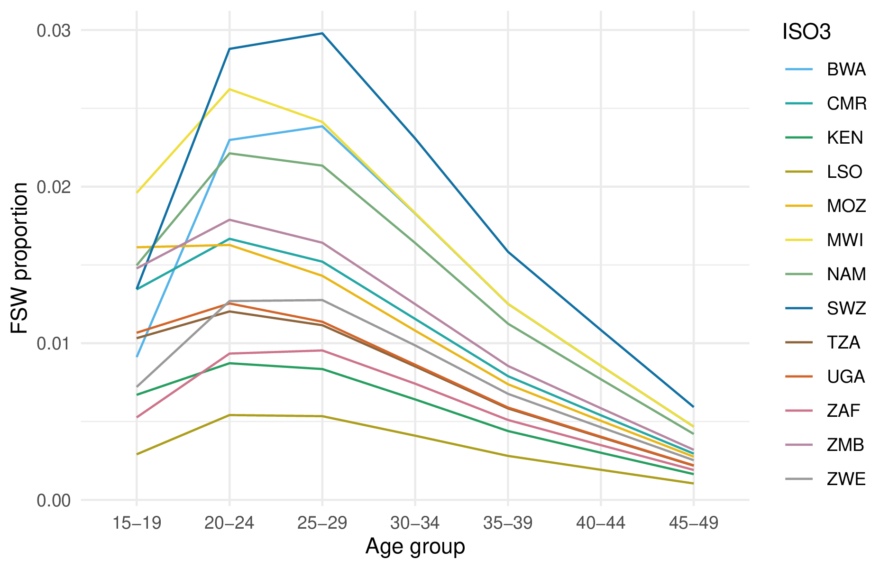

---
#########################################
# options for knitting a single chapter #
#########################################
output:
  bookdown::pdf_document2:
    template: templates/brief_template.tex
    citation_package: biblatex
  bookdown::html_document2: default
  bookdown::word_document2: default
documentclass: book
bibliography: references.bib
---

# A multinomial spatio-temporal model for risk group proportions {#multi-agyw}
\adjustmtc
\markboth{A multinomial spatio-temporal model for risk group proportions}{}
<!-- For PDF output, include these two LaTeX commands after unnumbered chapter headings, otherwise the mini table of contents and the running header will show the previous chapter -->

In this chapter I describe an application of Bayesian spatio-temporal statistics to small-area estimation of HIV risk group proportions.
This work was done in collaboration with colleagues from the MRC Centre for Global Infectious Disease Analysis and UNAIDS.
My role in the work was to develop the statistical model, building upon an earlier version of the analysis conducted by Kathryn Risher.
The results are described in @howes2023spatio, and are now beginning to be used by countries to guide policy via a spreadsheet tool created by Kathryn.
Code for the analysis in this chapter is available from [`athowes/multi-agyw`](https://github.com/athowes/multi-agyw) and supported by the R package [`multi.utils`](https://athowes.github.io/multi.utils).

## Background

The risk of acquiring HIV infection is not equal for all individuals.

## Data

I used the following household surveys.

## Model for risk group proportions

I found that it was not appropriate to use the surveys without a specific transactional sex question on an equal footing as the other surveys.
For this reason, I took a two-stage modelling approach to estimating the four risk group proportions.
In particular, let the four risk groups be $k \in \{1, 2, 3, 4\}$, and denote being in either the third or fourth risk group by $k = 3^{+}$.
First, using all the surveys, I used a multinomial logistic regression model to model the proportion of AGYW in the risk groups $k \in \{1, 2, 3^{+}\}$.
Then, using only those surveys with a specific transactional sex question, I fit a logistic regression model to estimate the proportion of those in the $k = 3^{+}$ risk group that were in the $k = 3$ and $k = 4$ risk groups respectively.

### Spatio-temporal multinomial logistic regression

As notation, let $i \in \{1, \ldots, n\}$ denote subnational units which partition the 13 studied AGYW priority countries $c[i] \in \{1, \ldots, 13\}$.
Consider the years 1999-2018 denoted as $t \in \{1, \ldots, T\}$, and age groups $a \in \{\text{15--19}, \text{20--24}, \text{25--29}\}$.

#### The multinomial-Poisson transformation

The multinomial-Poisson transformation reframes a given multinomial logisitic regression model as an equivalent Poisson log-linear model of the form
\begin{align}
    y_{itak} &\sim \text{Poisson}(\kappa_{itak}), \label{eq:poisson} \\
    \log(\kappa_{itak}) &= \eta_{itak},
\end{align}
for certain choice of the linear predictor $\eta_{itak}$.
The basis of the transformation is that, conditional on their sum, Poisson counts are jointly multinomially distributed [@mccullagh1989generalized] as follows
\begin{equation}
    \mathbf{y}_{ita} \, | \, m_{ita} \sim \text{Multinomial} \left( m_{ita}; \frac{\kappa_{ita1}}{\kappa_{ita}}, \ldots, \frac{\kappa_{ita3^{+}}}{\kappa_{ita}} \right),
\end{equation}
where $\kappa_{ita} = \sum_{k = 1}^{3^{+}} \kappa_{itak}$ such that category probabilities are obtained by the softmax function
\begin{equation}
    p_{itak} = \frac{\exp(\eta_{itak})}{\sum_{k = 1}^{3^{+}} \exp(\eta_{itak})} = \frac{\kappa_{itak}}{\sum_{k = 1}^{3^{+}} \kappa_{itak}} = \frac{\kappa_{itak}}{\kappa_{ita}}.
\end{equation}
In the equivalent model, the sample sizes $m_{ita} = \sum_k y_{itak}$ are treated as random, rather than fixed as they would be in the multinomial logistic regression model, taking a Poisson distribution
\begin{equation}
    m_{ita} \sim \text{Poisson} \left( \kappa_{ita} \right).
\end{equation}
In the equivalent model, the joint distribution of $p(\mathbf{y}_{ita}, m_{ita}) = p(\mathbf{y}_{ita} \, | \, m_{ita})p(m_{ita})$ is
\begin{align}
p(\mathbf{y}_{ita}, m_{ita}) &= \exp(-\kappa_{ita}) \frac{(\kappa_{ita})^{m_{ita}}}{m_{ita}!} \times \frac{m_{ita}!}{\prod_k y_{itak}!} \prod_k \left( \frac{\kappa_{itak}}{\kappa_{ita}} \right)^{y_{itak}} \\
&= \prod_k \left( \frac{\exp(-\kappa_{itak}) \left( \kappa_{itak} \right)^{y_{itak}}}{y_{itak}!} \right) \\
&= \prod_k \text{Poisson} \left( y_{itak} \, | \, \kappa_{itak} \right). \label{eq:prodpoisson}
\end{align}
corresponding to the product of independent Poisson likelihoods as in Equation \ref{eq:poisson}.
This model, including random sample sizes, is equivalent to the multinomial logistic regression only when these normalisation constants are recovered exactly.
To ensure that this is the case, one approach is to include observation-specific random effects $\theta_{ita}$ in the equation for the linear predictor.
Multiplying each of $\{\kappa_{itak}\}_{k = 1}^{3^+}$ by $\exp(\theta_{ita})$ has no effect on the category probabilities, but does provide the necessary flexibility for $\kappa_{ita}$ to recover $m_{ita}$ exactly.
Although in theory an improper prior $\theta_{ita} \propto 1$ should be used, in practise, by keeping $\eta_{ita}$ otherwise small using appropriate constraints, so that arbitrarily large values of $\theta_{ita}$ are not required, it is sufficient (and practically preferable for inference) to instead use a vague prior.

#### Model specifications

I considered four models for $\eta_{ita}$ of the form
$$
\eta_{ita} = \theta_{ita} + \beta_k + \zeta_{c[i]k} + \alpha_{ac[i]k} + \phi_{ik} + \gamma_{tk}.
$$
<!-- + \delta_{itk} -->
Observation random effects $\theta_{ita} \sim \mathcal{N}(0, 1000^2)$ were included in all models we considered.
To capture country-specific proportion estimates for each category, we included category random effects $\beta_k \sim \mathcal{N}(0, \tau_\beta^{-1})$ and country-category random effects $\zeta_{ck} \sim \mathcal{N}(0, \tau_\zeta^{-1})$.
Heterogeneity in risk group proportions by age was allowed by including age-country-category random effects $\alpha_{ack} \sim \mathcal{N}(0, \tau_\alpha^{-1})$.
I considered two specifications, independent and identically distributed (IID) and Besag [@besag1991bayesian], for the space-category $\phi_{ik}$ random effects (Section \ref{sec:spatial-random-effects}) and two specifications, IID and first order autoregressive (AR1), for the year-category $\gamma_{tk}$ random effects (Section \ref{sec:temporal-random-effects}).
All random effect precision parameters $\tau \in \{\tau_\beta, \tau_\zeta, \tau_\alpha, \tau_\phi, \tau_\gamma\}$ were given independent penalised complexity (PC) priors [@simpson2017penalising] with base model $\sigma = 0$ given by $p(\tau) = 0.5 \nu \tau^{-3/2} \exp \left( - \nu \tau^{-1/2} \right)$ where $\nu = - \ln(0.01) / 2.5$ such that  $\mathbb{P}(\sigma > 2.5) = 0.01$.

#### Spatial random effects

The specifications we considered were IID
$$
\phi_{ik} \sim \mathcal{N}(0, \tau_\phi^{-1}),
$$
and Besag grouped by category
$$
\bphi = (\phi_{11}, \ldots, \phi_{n1}, \ldots, \phi_{1{3^{+}}}, \ldots \phi_{n3^{+}})^\top \sim \mathcal{N}(\mathbf{0}, (\tau_\phi \mathbf{R}^\star_\phi)^{-}),
$$
where the scaled structure matrix $\mathbf{R}^\star_\phi = \mathbf{R}^\star_b \otimes \mathbf{I}$ is given by the Kronecker product of the scaled Besag structure matrix $\mathbf{R}^\star_b$ and the identity matrix $\mathbf{I}$, and ${-}$ denotes the generalised matrix inverse.
Scaling of the structure matrix to have generalised variance one ensures interpretable priors may be placed on the precision parameter [@sorbye2014scaling].
We followed the further recommendations of @freni2018note with regard to disconnected adjacency graphs, singletons and constraints.
The Besag structure matrix $\mathbf{R}_b$ is obtained by the precision matrix of the random effects $\mathbf{b} = (b_1, \ldots, b_n)^\top$ with full conditionals
\begin{equation}
b_i \, | \, \mathbf{b}_{-i} \sim \N\left(\frac{\sum_{j: j \sim i} b_j}{n_{\delta i}}, \frac{1}{n_{\delta i}}\right),
\end{equation}
where $j \sim i$ if the districts $A_i$ and $A_j$ are adjacent, and $n_{\delta i}$ is the number of districts adjacent to $A_i$.

In preliminary testing, we excluded spatial random effects from the model, but found that this negatively effected performance.
We also tested using the BYM2 model [@simpson2017penalising] in place of the Besag, but found that the proportion parameter posteriors tended to be highly peaked at the value one.
For simplicity and to avoid numerical issues, by using Besag random effects we decided to fix this proportion to one.

#### Temporal random effects

The specifications we considered were IID
$$
\phi_{tk} \sim \mathcal{N}(0, \tau_\phi^{-1}),
$$
and AR1 grouped by category
$$
\bm{\gamma} = (\gamma_{11}, \ldots, \gamma_{13^{+}}, \ldots, \gamma_{T1}, \ldots, \gamma_{T3^{+}})^\top \sim \mathcal{N}(\mathbf{0}, (\tau_\phi \mathbf{R}^\star_\gamma)^{-}),
$$
where the scaled structure matrix $\mathbf{R}^\star_\gamma = \mathbf{R}^\star_r \otimes \mathbf{I}$ is given by the Kronecker product of a scaled AR1 structure matrix $\mathbf{R}^\star_r$ and the identity matrix $\mathbf{I}$.
The AR1 structure matrix $\mathbf{R}_r$ is obtained by precision matrix of the random effects $\mathbf{r} = (r_1, \ldots, r_T)^\top$ specified by
\begin{align}
r_1 &\sim \left( 0, \frac{1}{1 - \rho^2} \right), \\
r_t &= \rho r_{t - 1} + \epsilon_t, \quad t = 2, \ldots, T, 
\end{align}
where $\epsilon_t \sim \mathcal{N}(0, 1)$ and $|\rho| < 1$.
For the lag-one correlation parameter $\rho$, we used the PC prior, as derived by @sorbye2017penalised, with base model $\rho = 1$ and condition $\mathbb{P}(\rho > 0 = 0.75)$.
We chose the base model $\rho = 1$ corresponding to no change in behaviour over time, rather than the alternative $\rho = 0$ corresponding to no correlation in behaviour over time, as we judged the former to be more plausible a priori.

#### Constraints

To ensure interpretable posterior inferences of random effect contribution, we applied sum-to-zero constraints such that none of the category interaction random effects altered overall category probabilities.
For the space-year-category random effects, we applied analogous sum-to-zero constraints to maintain roles of the space-category and year-category random effects.
Together, these were:

1. Category $\sum_k \beta_k = 0$
2. Country $\sum_c \zeta_{ck} = 0, \, \forall \, k$
3. Age-country $\sum_a \alpha_{ack} = 0, \, \forall \, c, k$,
4. Spatial $\sum_i \phi_{ik} = 0, \, \forall \, k$
5. Temporal $\sum_t \gamma_{tk} = 0, \, \forall \, k$

#### Survey weighted likelihood

We included surveys which use a complex design, in which each individual has an unequal probability of being included in the sample.
For example the DHS often employs a two-stage cluster design, first taking an urban rural stratified sample of ennumeration areas, before selecting households from each ennumeration area using systematic sampling [@measure2012sampling].

To account for this aspect of survey design, we use a weighted pseudo-likelihood where the observed counts $y$ are replaced by effective counts $y^\star$ calculated using the survey weights $w_j$ of all individuals $j$ in the corresponding strata.
We multiplied direct estimates produced using the `survey` package [@JSSv009i08] by the Kish effective sample size [@kish1965survey]
\begin{equation}
    m^\star = \frac{\left(\sum_j w_j \right)^2}{\sum_j {w_j}^2}
\end{equation}
to obtain $y^\star$.
These counts may not be integers, and as such the Poisson likelihood we used in Equation \ref{eq:poisson} is not appropriate.
Instead, we used a generalised Poisson pseudo-likelihood $y^\star \sim \text{xPoisson}(\kappa)$, given by
\begin{equation}
    p(y^\star) = \frac{\kappa^{y^\star}}{\left \lfloor{y^\star!}\right \rfloor } \exp \left(- \kappa \right),
\end{equation}
as implemented by `family = "xPoisson"` in `R-INLA`, which accepts non-integer input.

#### Model selection

### Spatial logistic regression

#### Model specifications

#### Survey weighted likelihood

#### Model selection

### Coverage assessment

### Female sex worker population size adjustment

Responding "yes" to the survey question "have you had sex in return for gifts, cash or anything else in the past 12 months" is not considered sufficient to constitute sex work.
In recognition of this, I adjusted the estimates obtained based on the survey to match FSW population size estimates obtained via alternative methods.

@stevens2022estimating used a Bayesian meta-analysis of key population specific data sources to estimate adult (15-49) FSW population size by country.
I disaggregated these estimates by age according to the following method.
First, I calculated the total sexually debuted population in each age group, in each country.
To describe the distribution of age at first sex, I used skew logistic distributions [@nguyen2022trends] with cumulative distribution function given by
\begin{equation}
F(x) = \left(1 + \exp(\kappa_c (\mu_c - x)) \right)^{- \gamma_c},
\end{equation}
where $\kappa_c, \mu_c, \gamma_c > 0$ are country-specific shape, shape and skewness parameters respectively.
Next, I used the assumed $\text{Gamma}(\alpha = 10.4, \beta = 0.36)$ FSW age distribution in South Africa from the Thembisa model [@johnson2020thembisa] to calculate the implied ratio between the number of FSW and the sexually debuted population in each age group.
I assumed these ratios in South Africa were applicable to every country, allowing calculation of the number of FSW by age group in all 13 countries.
The results obtained are shown in Figure \@ref(fig:age-disagg-fsw-line).

```{r age-disagg-fsw-line, out.width = "90%", echo=FALSE, fig.cap="Proportion of FSW by age group (including the age groups 30-34, 35-39, 40-44 and 45-49) as produced by the disaggregation procedure."}

```

### Results

#### Coverage assessment

#### Variance decomposition

#### Estimates

## Calculation of prevalence and incidence stratified by risk group

### Disaggregation of Naomi estimates

I calculated HIV incidence $\lambda_{iak}$ and number of new HIV infections $I_{iak}$ stratified according to district, age group and risk group by linear disaggregation
\begin{align}
    I_{ia} &= \sum_k I_{iak} = \sum_k \lambda_{iak}N_{iak} \\
    &= 0 + \lambda_{ia2} N_{ia2} + \lambda_{ia3} N_{ia3} + \lambda_{ia4} N_{ia4} \\
    &= \lambda_{ia2} \left(N_{ia2}  + \text{RR}_{3} N_{ia3} + \text{RR}_4(\lambda_{ia}) N_{ia4}  \right).
\end{align}
Risk group specific HIV incidence estimates are then given by
\begin{align}
    \lambda_{ia1} &= 0, \\
    \lambda_{ia2} &= I_{ia} / \left(N_{ia2} + \text{RR}_{3} N_{ia3} + \text{RR}_4(\lambda_{ia}) N_{ia4}\right), \\
    \lambda_{ia3} &= \text{RR}_{3} \lambda_{ia2}, \\
    \lambda_{ia4} &= \text{RR}_4(\lambda_{ia}) \lambda_{ia2}.
\end{align}
which we evaluated using Naomi model estimates of the number of new HIV infections $I_{ia} = \lambda_{ia} N_{ia}$, HIV infection risk ratios $\{\text{RR}_3, \text{RR}_4(\lambda_{ia})\}$, and risk group population sizes as above.
The risk ratio $\text{RR}_4(\lambda_{ia})$ was defined as a function of general population incidence.
The number of new HIV infections are then $I_{iak} = \lambda_{iak} N_{iak}$.

### Expected new infections reached

I calculated the number of new infections that would be reached prioritising according to each possible stratification of the population--that is for all $2^3 = 8$ possible combinations of stratification by location, age, and risk group. 
As an illustration, for stratification just by age, we aggregated the number of new HIV infections and HIV incidence as such 
\begin{align}
    I_a &= \sum_{ik} I_{iak}, \\
    \lambda_a &= I_a / \sum_{ik} N_{iak}.
\end{align}
Under this stratification, individuals in each age group $a$ are prioritised according to the highest HIV incidence $\lambda_a$.
By cumulatively summing the expected infections, for each fraction of the total population reached we calculated the fraction of total expected new infections that would be reached.

This analysis was relatively simple.
More involved analyses might consider prioritisation of a hypothetical intervention which has some, possibly varying, probability of preventing HIV acquisition, as well as the costs associated to its roll-out.

## Discussion

#### Distribution of risk

* Connection to phylogenetic results from BDI
* About transmission rather than incidence
* Only age-sex structured not age-sex-behaviour
* Does not undermine my work

#### Community engagement

* CSO engagement
* Problem in Malawi with FSW

### Limitations

### Conclusion
