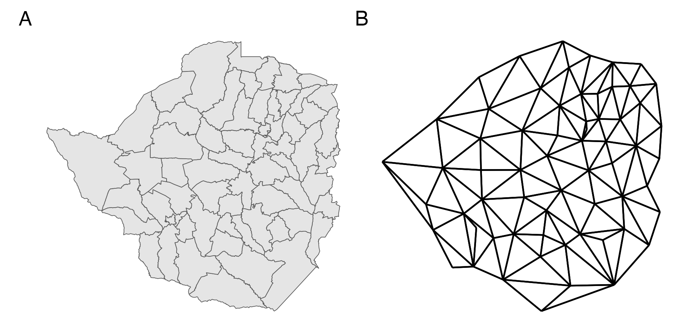
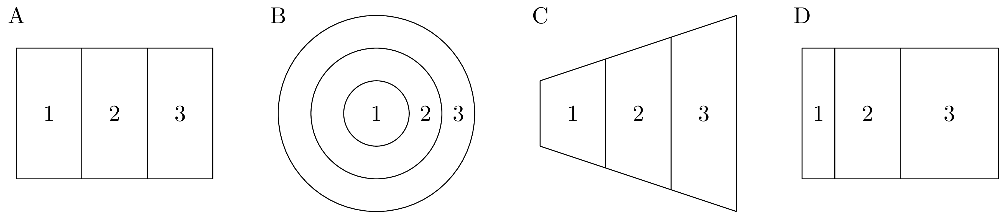
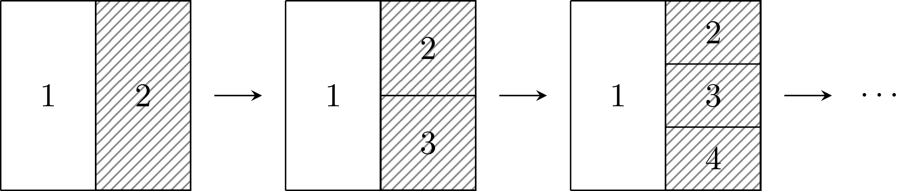
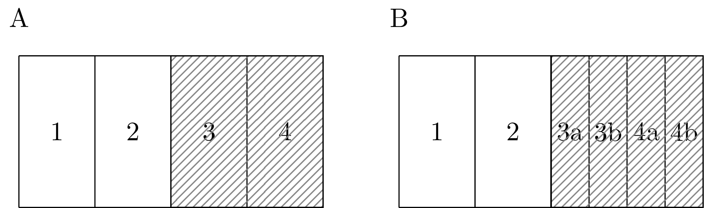
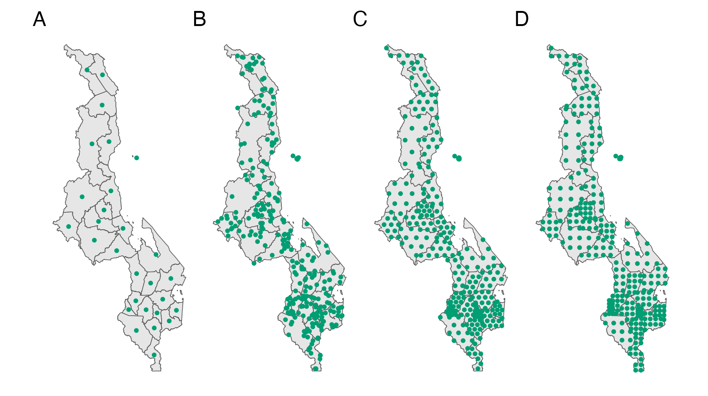
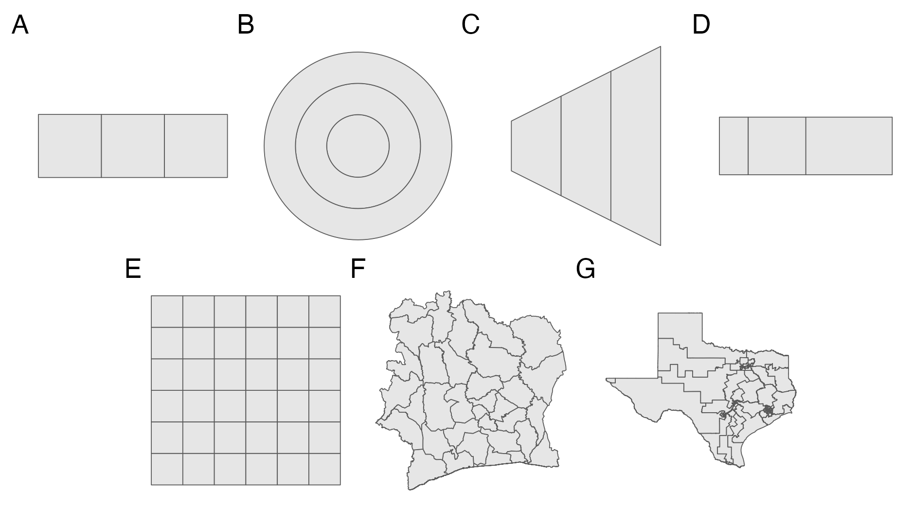
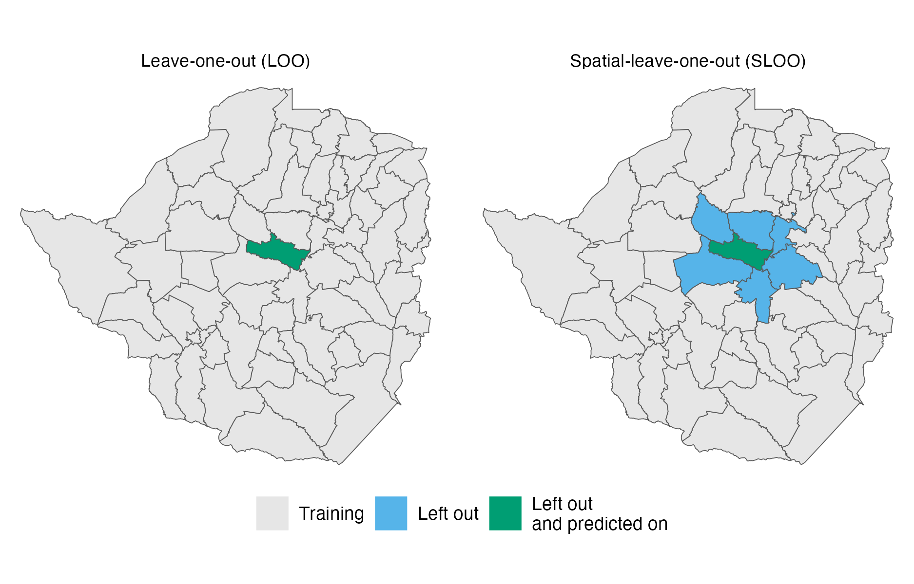

---
#########################################
# options for knitting a single chapter #
#########################################
output:
  bookdown::pdf_document2:
    template: templates/brief_template.tex
    citation_package: biblatex
  bookdown::html_document2: default
  bookdown::word_document2: default
documentclass: book
bibliography: references.bib
---

```{r}
resource_version <- list.files("resources/beyond-borders")
```

# Models for areal spatial structure {#beyond-borders}
\adjustmtc
\markboth{Models for spatial structure}{}
<!-- For PDF output, include these two LaTeX commands after unnumbered chapter headings, otherwise the mini table of contents and the running header will show the previous chapter -->

This chapter is about spatial random effect model specifications for areal data.
A simple model based on the adjacency structure between areas is popular in HIV small-area estimation and beyond.
The analysis aimed to determine if using a more complex model would result in more accurate predictions.

Modelling spatial correlation is particularly important for the small-area estimation of HIV.
This is because the covariates which are most strongly associated with HIV, such as sexual behaviour and STI status [@mayala2020predicting], are themselves difficult to measure.
As a result, previous small-area models of HIV have found including covariates only modestly improve predictive performance [Supplementary Figure 20, @dwyer2019mapping].
The lack of predictive covariates emphasises the role of modelling spatial variation.
For mapping of other infectious diseases, such as Malaria where transmission is driven by more predictive and easily-measurable environmental factors, explanatory covariates are more easily available and directly modelling spatial correlation is less important [@weiss2015re; @bhatt2015effect].

Spatial variation in areal data is often modelled using spatial random effects [@haining2003spatial; @cramb2018investigation].
The most common class of models used to specify spatial random effects are Gaussian Markov random fields [GMRFs; @rue2005gaussian].
These models combine a Gaussian distribution with Markov conditional independence assumptions between areas.
Observations in areas close together are assumed to be related, with more distant relationships not directly accounted for.
Perhaps the simplest GMRF model is that of @besag1991bayesian in which information is borrowed equally from each adjacent area, based on a binary relationship.
The Besag model is attractive as it requires minimal additional modelling choices and is accessibly implemented in software such as `R-INLA` [@blangiardo2013spatial], `rstan` [@morris2019bayesian; @conegan2022geostan], `NIMBLE` [Chapter 9; @nimblemanual] and `PyMC` [@saunders2023pymc], among others.
As a result, it has been widely used, including to model bird population dynamics from capture-recapture data [@saracco2010modeling]; for the analysis of magnetic resonance images [@gossl2001bayesian; @schmid2006bayesian]; to map mortality from cancers [@rashid2023inequalities], injuries [@parks2020anomalously], and air pollution [@bennett2019particulate]; and to model alcohol use patterns [@dwyer2015drinking].

The Besag model was designed for image analysis, on a regular grid.
However, for more irregular geometries, the assumptions made are unrealistic and appear to be violated.
The administrative divisions of a country used in small-area estimation are one example of a more irregular geometry.
This chapter tests the hypothesis that using more realistic assumptions about spatial structure improves the performance of small-area estimation models.
Performance in this context refers to accurate forecasts of parameters as measured by scoring rules.
In doing so, practical recommendations for modelling areal spatial structure are offered.
Code for the analysis in this chapter is available from [`https://github.com/athowes/beyond-borders`](https://github.com/athowes/beyond-borders), and supported by the `arealutils` R package [@howes2023arealutils].

## Models based on adjacency {#adjacency-models}
 
This section discusses spatial random effect models based on a symmetric adjacency relation $i \sim j$ between areas $A_i$ and $A_j$.
Adjacency is typically defined by a shared border, though other choices are possible [@paciorek2013spatial].

### The Besag model {#besag}

(ref:geometry-graph) Panel A shows the districts of Zimbabwe. Panel B shows the corresponding adjacency graph $\mathcal{G}$ with vertices positioned at the centre of the area they correspond to, and edges between adjacent areas.

```{r geometry-graph, fig.cap="(ref:geometry-graph)"}

```

The Besag model [@besag1991bayesian] is an improper conditional auto-regressive (ICAR) model where the conditional mean of the random effect $u_i$ is the average of its neighbours $\{u_j\}_{j \sim i}$ and the precision is proportional to the number of neighbours.
The full conditional distribution of the $i$th spatial random effect is given by
\begin{equation}
    u_i \, | \, \mathbf{u}_{-i} \sim \mathcal{N} \left(\frac{1}{n_{\delta i}} \sum_{j: j \sim i} u_j, \frac{1}{n_{\delta i}\tau_u}\right), (\#eq:besag)
\end{equation}
where $\delta i$ is the set of neighbours of $A_i$ with cardinality $n_{\delta i} = |\delta i|$ and $\mathbf{u}_{-i}$ is the vector of spatial random effects with the $i$th entry removed.
By Brook's lemma [@rue2005gaussian] the set of full conditionals of the Besag model are equivalent to the Gaussian Markov random field (GMRF) given by
\begin{equation}
    \mathbf{u} \sim \mathcal{N}(\mathbf{0}, \tau_u^{-1} \mathbf{R}^{-}). (\#eq:gmrf)
\end{equation}
The matrix $\mathbf{R}^{-}$ is the generalised inverse of the rank-deficient structure matrix $\mathbf{R}$ with entries
\begin{equation}
    R_{ij} =
    \begin{cases}
        n_{\delta i}, & i = j \\
        -1, & i \sim j \\
        0, & \text{otherwise.}
    \end{cases}
\end{equation}
The Markov property arises due to the conditional independence structure $p(u_i \, | \, \mathbf{u}_{-i}) = p(u_i \, | \, \mathbf{u}_{\delta i})$ whereby each area only depends on its neighbours.
This is reflected in the sparsity of $\mathbf{R}$ such that $u_i \perp u_j \, | \, \mathbf{u}_{-ij}$ if and only if $R_{ij} = 0$.
The structure matrix $\mathbf{R}$ may also be expressed as the Laplacian matrix of the adjacency graph $\mathcal{G} = (\mathcal{V}, \mathcal{E})$ with vertices $v \in \mathcal{V}$ corresponding to each area and edges $e \in \mathcal{E}$ between vertices $i$ and $j$ when $i \sim j$.
Figure \@ref(fig:geometry-graph) shows the districts of Zimbabwe with corresponding adjacency graph.

Rewriting Equation \@ref(eq:gmrf), the probability density function of $\mathbf{u}$ is
\begin{equation}
    p(\mathbf{u})
    \propto \exp \left( -\frac{\tau_u}{2} \mathbf{u}^\top \mathbf{R} \mathbf{u} \right)
    \propto \exp \left( -\frac{\tau_u}{2} \sum_{i \sim j} (u_i - u_j)^2 \right). (\#eq:pdfu)
\end{equation}
This density is a function of the pairwise differences $u_i - u_j$ and so is invariant to the addition of a constant $c$ to each entry $p(\mathbf{u}) = p(\mathbf{u} + c\mathbf{1})$.
As a result, there is an improper uniform distribution on the average of the $u_i$.
If $\mathcal{G}$ is connected, in that by traversing the edges, any vertex can be reached from any other vertex, then there is only one impropriety in the model and $\text{rank}(\mathbf{R}) = n - 1$, while if $\mathcal{G}$ is disconnected, and composed of $n_c \geq 2$ connected components with index sets $I_1, \ldots, I_{n_c}$, then the corresponding structure matrix $\mathbf{R}$ has rank $n - n_c$ and the density is invariant to the addition of a constant to each of the connected components $p(\mathbf{u}_{I}) = p(\mathbf{u}_{I} + c\mathbf{1})$ where $I = I_1, \ldots, I_{n_c}$.

### Best practises for the Besag model

Directly implementing the Besag model as described in Section \@ref(besag) in recommended against.
@freni2018note provide three best practices:

1. The structure matrix $\mathbf{R}$ should be rescaled to have generalised variance equal to one.
The generalised variance of a matrix is defined by the geometric mean of the diagonal elements of its generalised inverse.
For the structure matrix that is
\begin{equation}
    \sigma^2_{\text{GV}}(\mathbf{R}) = \prod_{i = 1}^n (\mathbf{R}^-_{ii})^{1/n} = \exp \left( \frac{1}{n} \sum_{i = 1}^n \log (R^-_{ii}) \right).
\end{equation}
The scaled structure matrix $\mathbf{R}^\star$ is given by
\begin{equation}
\mathbf{R}^\star = \mathbf{R} / \sigma^2_{\text{GV}}(\mathbf{R}).
\end{equation}
As the diagonal elements $R^-_{ii}$ correspond to marginal variances, the generalised variance gives a measure of the average marginal variance.
This measure, introduced by @sorbye2014scaling, ignores off-diagonal entries.
More broadly, other measures of typical variance could be used.

    Scaling mitigates the influence of the adjacency graph on the variance of $\mathbf{u}$.
    For consistent and interpretable prior distribution selection, it is important to allow the variance to be controlled by $\tau_u$ alone.

    When the adjacency graph is disconnected it is not appropriate to scale the structure matrix $\mathbf{R}$ uniformly.
    This is because, given the precision $\tau_u$, local smoothing operates on each connected component independently.
    As such, each connected component $I = I_1, \ldots, I_{n_c}$ should be scaled independently to have generalised variance one
    \begin{equation}
      \mathbf{R}^\star_I = \mathbf{R}_I / \sigma^2_{\text{GV}}(\mathbf{R}_I)
    \end{equation}
    where $\mathbf{R}_I$ is the sub-matrix of the structure matrix corresponding to index set $I$.

2. When one of the connected components is a single area, known either as a singleton or an island, the probability density
\begin{equation}
  p(u_i) \propto  \exp \left( -\frac{\tau_u}{2} \sum_{i \sim j} (u_i - u_j)^2 \right) \propto 1
\end{equation}
has no dependence on $u_i$.
This is equivalent to using an improper prior.
To avoid this, each singleton should be set to have independent Gaussian noise $p(u_i) \sim \mathcal{N}(0, 1)$.

3. To avoid confounding of the spatial random effects with the intercept, it is recommended to place a sum-to-zero constraint on each non-singleton connected component.
In other words,
\begin{equation}
  \sum_{i \in I} u_i = 0, \quad |I| > 1.
\end{equation}
As such, in total the number of sum-to-zero constraints equals to the number of non-singleton connected components.

### Concerns about the Besag model {#concerns}

The Besag model was originally proposed by @besag1991bayesian for use in image analysis.
In this setting, areas correspond to pixels arranged in a regular lattice structure.
Since then, it has seen wider use.
In some situations, like small-area estimation of HIV, the spatial structure is less regular than a lattice.
This raises concerns about the Besag model's applicability to this broader setting.
The discussion in this section is closely linked to:

* the modifiable areal unit problem [@openshow1979million], whereby statistical conclusions change as a result of seemingly arbitrary changes in data aggregation;
* the challenge of ecological inference and the ecological fallacy [@wakefield2010aggregation].

#### Compression to adjacency 

(ref:maup1) Though they are quite different, the geometries shown in panels A, B, C, and D each have the same adjacency graph. Therefore, each geometries would have the same distribution under the Besag model.

```{r maup1, fig.cap="(ref:maup1)"}

```

A fundamental objection is that summarising a geometry by an adjacency graph represents a loss of information.
Many geometries share the same adjacency graph, and as such are isomorphic under the Besag model (Figure \@ref(fig:maup1)).
Though not in itself a problem, this fact prompts consideration as to whether the class of geometries with the same adjacency graph is sufficiently similar to merit identical models.

Intuitively, the more regular the spatial structure, the less information is lost in compression to an adjacency graph.
In image analysis, very little spatial information is lost in compression of a lattice structure to an adjacency graph.
On the other hand, the regions of a country, determined by political and geographic forces, tend to display greater irregularity.
The appropriateness of adjacency compression therefore varies by the type of geometry common to the application setting.

The regularity of realistic geometries may help to constrain each class to be similar.
In other words, although pathological geometries can be constructed, they might be implausible in statistical practice and so of limited concern.

#### Mean structure

In the Besag model all adjacent areas count equally in the equation for the conditional mean.
This assumption is unsatisfying: for most geometries, we expect different amounts of correlation between neighbouring areas.
Figure \@ref(fig:maup1) illustrates a number of heuristic features for neighbour importance.
In Panel \@ref(fig:maup1)C, the area with a longer shared border would be expected to be more highly correlated.
In Panel \@ref(fig:maup1)D, the area with a closer centre would be expected to be more highly correlated.

#### Variance structure

(ref:maup2) A sequence of geometries where the number of neighbours of area one grows by one at each iteration, as the shaded area is split into more areas. In the limit, the precision of the spatial random effect in the first area tends to infinity. This is not reasonable behaviour if the amount of information being shared is not also increasing.

```{r maup2, fig.cap="(ref:maup2)"}

```

In Equation \@ref(eq:besag) the precision of $u_i$ is proportional to its number of neighbours $n_{\delta i}$.
It follow that as $n_{\delta i} \to \infty$ then $\text{Var}(u_i) \to 0$.
This is illustrated by Figure \@ref(fig:maup2) where the area on the right is repeatedly divided such that its number of neighbours increases.
This property is a consequence of averaging the conditional mean over a greater number of areas, which, in certain situations, can correspond to a greater amount of information.
However, if the amount of information in the shaded area remains fixed, it is inappropriate that $\text{Var}(u_1)$ should tend to zero as a result of drawing additional, arbitrary, boundaries.
In the image analysis setting this modelling assumption is reasonable: each pixel represents a fixed amount of information and a higher pixel density represents a greater amount of information.
On the other hand, in public health and epidemiology, drawing boundaries to create additional areas is not expected to correspond to a greater amount of information.

(ref:maup3) Each of the shaded areas are split into two moving from Panel A to Panel B.

```{r maup3, fig.cap="(ref:maup3)", fig.height=3.5}

```

As a second example of undesirable behaviour, suppose we fit a Besag model upon identical data using each of the two geometries in Figure \@ref(fig:maup3).
If the spatial variation is relatively smooth, dividing the shaded areas into two will result in a lower estimated variance $\sigma^2_u$ in Panel \@ref(fig:maup3)B as compared with Panel \@ref(fig:maup3)A because there will appear to be less variation between neighbouring areas.
This problem does not only apply locally: since the effect of $\sigma^2_u$ applies everywhere, the smoothing will change even in unaltered parts of the study region.

### Weighted ICAR models

The Besag model is a special case of a more general class of (zero-mean) weighted ICAR models.
These models can be specified in terms of scaled weights $\{b_{ij}\}_{j \sim i}$ and a precision vector $\boldsymbol{\mathbf{\kappa}} = (\kappa_i)_{i \in [n]}$.
The full conditionals are then
\begin{equation}
  u_i \, | \, \mathbf{u}_{-i} \sim \mathcal{N} \left( \sum_{j: j \sim i} b_{ij} u_j, \frac{1}{\kappa_i \tau_u} \right). (\#eq:weighted-icar-fc)
\end{equation}
Setting $b_{ij} = 1 / n_{\delta i}$ and $\kappa_i = n_{\delta i}$ recovers the Besag model in Equation \@ref(eq:besag).
The structure matrix $\mathbf{R}$ corresponding to the more general full conditionals in Equation \@ref(eq:weighted-icar-fc) is
\begin{equation}
  \mathbf{R} = \mathbf{D}_\kappa(\mathbf{I} - \mathbf{B}),
\end{equation}
where the unscaled weights matrix $\mathbf{B}$ has elements
\begin{equation}
  \mathbf{B}_{ij} =
  \begin{cases}
  b_{ij}, & \text{for } i \sim j, \\
  0, & \text{for } i = j, i \nsim j.
  \end{cases},
\end{equation}
and the matrix $\mathbf{D}_\kappa$ is given by $\text{diag}(\kappa_1, \ldots, \kappa_n)$.
Ensuring that the structure matrix is symmetric requires that for all $i, j \in [n]$
\begin{equation}
- b_{ij} \kappa_i = - b_{ji} \kappa_j.
\end{equation}
To meet this condition, it can be simpler to directly consider symmetry of the unscaled weights matrix
\begin{equation}
  \mathbf{W} = \mathbf{D}_\kappa \mathbf{B},
\end{equation}
such that $\mathbf{R} = \mathbf{D}_\kappa - \mathbf{W}$.
For the Besag model the unscaled weights matrix $\mathbf{W}$ corresponds to the adjacency matrix.
Scaled weights can be recovered by $b_{ij} = w_{ij} / \kappa_i$ where $\kappa_i = \sum_{k: k \sim i} w_{ik}$.
@duncan2017spatial provide discussion of methods for specifying $\mathbf{W}$, including
\begin{align}
w_{ij} &= \left( \frac{1}{d_{ij}} \right), \\
w_{ij} &= \exp (-d_{ij}).
\end{align}
Weighted ICAR models appear to overcome some of the limitations discussed in Section \@ref(concerns).

### The reparameterised Besag-York-Mollié model {#bym2}

Often, as well as spatial correlation, there exists IID over-dispersion in the residuals and it is inappropriate to use purely spatially structured random effects in the model.
The Besag-York-Mollié (BYM) model of @besag1991bayesian accounts for this in a natural way by decomposing the spatial random effect $\mathbf{u} = \mathbf{v} + \mathbf{w}$ into a sum of an unstructured IID component $\mathbf{v}$ and a spatially structured Besag component $\mathbf{w}$.
Each component has its own respective precision parameter $\tau_v$ and $\tau_w$.
The resulting distribution is
\begin{equation}
  \mathbf{u} \sim \mathcal{N}(0, \tau_v^{-1} \mathbf{I} + \tau_w^{-1} \mathbf{R}^{-}) (\#eq:bym).
\end{equation}
Including both $\mathbf{v}$ and $\mathbf{w}$ is intended to enable the model to learn the relative extent of the unstructured and structured components via $\tau_v$ and $\tau_w$.

However, in the BYM model, scaling of the Besag precision matrix $\mathbf{Q}$ is not taken into account despite this issue being particularly pertinent when dealing with multiple sources of noise.
In particular, placing a joint prior distribution
\begin{equation}
(\tau_v, \tau_w) \sim p(\tau_v, \tau_w)
\end{equation}
which does not privilege either component is more easily accomplished if $\mathbf{Q}$ and $\mathbf{I}$ have the same scale.
Additionally, supposing one has a prior belief that the over-dispersion is primarily IID and $\mathbf{v}$ accounts for the majority of the dispersion, then it is not immediately obvious how to represent this belief, without inadvertently altering the prior distribution on the amount of overall variation.
This highlights identifiability issues of the parameters $(\tau_v, \tau_w)$ resulting from them being non-orthogonal.

Building on the models of @leroux2000estimation and @dean2001detecting which tackle this identifiability problem, but do not scale the spatially structured noise, @simpson2017penalising propose a reparameterisation $(\tau_v, \tau_w) \mapsto (\tau_u, \phi)$ of the BYM model.
This is known as the BYM2 model and given by
\begin{align}
  \mathbf{u} = \frac{1}{\tau_u} \left( \sqrt{1- \phi} \, \mathbf{v} + \sqrt{\phi} \, \mathbf{w}^\star \right), (\#eq:bym2)
\end{align}
where $\tau_u$ is the marginal precision of $\mathbf{u}$, $\phi \in [0, 1]$ gives the proportion of the marginal variance explained by each component, and $\mathbf{w}^\star$ is a scaled version of $\mathbf{w}$ with precision matrix given by the scaled structure matrix $\mathbf{R}^\star$.
When $\phi = 0$ the random effects are IID, and when $\phi = 1$ the random effects follow the Besag model.
To borrow an analogy [@rue2020comment] the parameterisation $(\tau_v, \tau_w)$ is like having one hot water and one cold water tap, whereas the parameterisation $(\tau_u, \phi)$ is like a mixer tap where the amount of water and its temperature can be adjusted separately.

Although the BYM and BYM2 models were originally proposed using the Besag model as spatially structured component, this need not be the case.
Indeed, more broadly it is reasonable to consider convolution random effects (of a form analogous to that in Equation \@ref(eq:bym) or \@ref(eq:bym2)) with any model for spatially structured noise.
Any limitations of the model for spatially structured random effects are inherited by the convolution random effects.

## Models using kernels {#kernel-models}

Section \@ref(adjacency-models) reviewed ways to construct spatial random effect precision matrices using an adjacency relation.
An alternate approach is to define the covariance matrix using an areal kernel function which gives a measure of similarity between two areas.
Such a function may be specified as
\begin{equation}
K: \mathcal{P}(\mathcal{S}) \times \mathcal{P}(\mathcal{S}) \to \mathbb{R}, (\#eq:areal-kernel-function)
\end{equation}
where $\mathcal{P}$ denotes the power set such that $\mathcal{P}(\mathcal{S})$ is the space of subsets of the study region.
If the function $K$ is positive semi-definite, then define areal kernel spatial random effects by
\begin{equation}
    \mathbf{u} \sim \mathcal{N} \left( 0, \frac{1}{\tau_u} \mathbf{K} \right), (\#eq:areal-kernel-sre)
\end{equation}
where the $n \times n$ Gram matrix $\mathbf{K}$ with entries $K_{ij} = K(A_i, A_j)$ is a valid covariance matrix.
The precision parameter $\tau_u$ is placed outside of the Gram matrix, analogous to the relation of the precision and structure matrices, but could be omitted.
Areal kernels may be thought of as a type of kernels on sets [@gartner2002multi].

It is challenging to think directly about the correlation structure between areas.
Instead, most well-known spatial process models define the correlation structure between points using a kernel function
\begin{equation}
k: \mathcal{S} \times \mathcal{S} \to \mathbb{R}. (\#eq:kernel-function)
\end{equation}
A simple method, and the one considered here henceforth, is to construct $K$ (Equation \@ref(eq:areal-kernel-function)) from $k$ (Equation \@ref(eq:kernel-function)) by averaging the kernel $k$ computed on some number of points representing each area.
In Section \@ref(centroid-kernel) one point is used, and in Section \@ref(integrated-kernel) multiple points are used.

### Centroid kernel {#centroid-kernel}

The simplest approach is to use a single point to represent each area such that
\begin{equation}
  K(A_i, A_j) = k(p_i, p_j).
\end{equation}
A natural choice is the centroid $p_i = c_i$, given by the arithmetic mean of the latitude and longitude.
(Note that it is not guaranteed for the centroid to lie within the area i.e. it is possible $c_i \notin A_i$, and more generally points representing an area may not be contained by that area.)
This choice results in the centroid kernel
\begin{equation}
    K(A_i, A_j) = k(c_i, c_j). (\#eq:ck)
\end{equation}
The centroid kernel has been used:

* in environmental epidemiology [@wakefield1999spatial];
* for US election modelling [@flaxman2015supported];
* to model the reproduction number of COVID-19 [@teh2021efficient].

In a model comparison study @best2005comparison (Section 3) simulated data representing heterogeneous exposure to air pollution, including elevated rates of exposure near two hypothetical point source locations, and found that the centroid kernel tended to over-smooth the high-risk areas.
That said, it unsurprising that a stationary covariance function would struggle to recover non-stationary structure.

### Integrated kernel {#integrated-kernel}

Rather than choosing a single representative point, an alternative is to more completely represent the area by integrating the kernel over the areas of interest.
This results in the integrated kernel
\begin{equation}
  K(A_i, A_j) = \frac{1}{|A_i||A_j|} \int_{A_i} \int_{A_j} k(s, s') \text{d} s \text{d} s'. (\#eq:ik1)
\end{equation}
Unlike for the centroid kernel where $K_{ii} = 1$ for all $i$, the marginal variance of the $i$th spatial random effect $K_{ii} = K(A_i, A_i)$ varies depending on the area: becoming smaller for more compact areas and larger for areas which are of greater extent or more spread out.

This covariance structure is equivalent to that obtained by aggregating a spatially continuous Gaussian process with kernel $k$ over the areal partition.
In the machine learning literature, models of this kind have been studied under the name aggregated Gaussian processes [@law2018variational; @tanaka2019spatially; @yousefi2019multi; @hamelijnck2019multi; @chau2021deconditional].
Examples of use of this model in statistical practice are rare.

#### Accounting for heterogeneity

Additional information accounting for heterogeneity over $A_i$ may be incorporated into the integrated kernel.
This can be accomplished using weighting distributions $\{w_i\}$ which represent an unequal contribution of each point to the similarity measure.
The weighted integrated kernel is given by
\begin{equation}
  K(A_i, A_j) = \frac{1}{|A_i||A_j|}\int_{A_i} \int_{A_j} w_i(s) w_j(s') k(s, s') \text{d} s \text{d} s', (\#eq:ik2)
\end{equation}
This areal kernel may be useful in disease mapping.
For example, areas with populations who live close to a shared border are likely to be more strongly correlated than areas whose populations live far apart.
This detail could be accounted for by weighting according to a high resolution measure of population density.
Though e.g. weighted centroids may also be used in Equation \@ref(eq:ck), accounting for heterogeneity over an area is more natural within the integrated kernel than the centroid kernel.

#### Computation

(ref:integration-strategy) The $n = 33$ districts of Malawi. Panel A shows the centroids as in Section \@ref(centroid-kernel). Panel B shows $L_i = 10$ randomly chosen points, Panel C hexagonal points, and Panel D grid points in each area, each generated using the `sf::st_sample` function [@pebesma2018sf].

```{r integration-strategy, fig.cap="(ref:integration-strategy)"}

```

Most of the time it is not possible to calculate Equation \@ref(eq:ik2) analytically.
<!-- Exceptions include @rasmussen2003bayesian. -->
Instead, consider $n$ collections of $L_i$ samples $\{s^{(i)}_l \}_{l = 1}^{L_i} \sim \mathcal{U}(A_i)$ drawn uniformly from each area.
Then the integral may be approximated using Monte Carlo by the double sum
\begin{equation}
  K(A_i, A_j) \approx \frac{1}{L_i L_j} \sum_{l = 1}^{L_i} \sum_{m = 1}^{L_j}
  w_i \left( s^{(i)}_l \right) w_j \left( s^{(j)}_m \right)
  k \left( s^{(i)}_l, s^{(j)}_m \right). (\#eq:mcintegratedkernel)
\end{equation}
Equivalently, samples drawn from $W_i$ may be used without weighting by $w_i(s)$.
Nodes may also be selected deterministically to give a numerical quadrature estimate of the kernel.
Figure \@ref(fig:integration-strategy) shows three possible ways of choosing points $s^{(i)}_l$, together with the centroids approach.

Computing the $n \times n$ Gram matrix $K$ requires
\begin{equation}
\mathcal{O}(\sum_{i = 1}^n \sum_{j = 1}^n L_i L_j)
\end{equation}
evaluations of the kernel $k$.
This imposes a significant computational cost if the Gram matrix is often recomputed during inference.
For example, during MCMC when the kernel has hyperparameters which are learnt then the Gram matrix is recomputed for each proposed set of hyperparameters.
As such, there is a limit on the size of $L_i$ which it is feasible to use.
@kelsall2002modeling encounter this challenge, and take the approach of using a discrete hyperparameter prior to reduce the number of Gram matrix constructions and inversions required.

#### Connection to log-Gaussian Cox processes

The log-Gaussian Cox Process framework [@diggle2013spatial] arrives naturally at the integrated kernel formulation.
A Cox process is an inhomogeneous Poisson process with a continuous stochastic intensity function $\{ x(s), s \in \mathcal{S} \}$ such that conditional on the realisation of $x(s)$ the number of points in any area $A_i$ follows a Poisson distribution.
The rate parameter of this Poisson distribution is explicitly aggregated as follows
\begin{equation}
  y_i \, | \, x(s) \sim \text{Poisson} \left(\int_{s \in A_i} x(s) \text{d}s \right).
\end{equation}
In a LGCP the log intensity $\log x(s) = \eta(s)$ is modelled using a Gaussian process prior $\eta(s) \sim \mathcal{GP}(\mu(s), k(s, s'))$.
@johnson2019spatially obtain Equation \@ref(eq:ik2) by considering a discrete Poisson log-linear mixed model approximation to a continuous LGCP, whereby $\eta(s)$ is approximated by a piecewise constant $\eta_i = \mu_i + u_i$ in each area $A_i$.
The $i$th discrete spatial random effect is then $u_i = \int_{A_i} w_i(s) u(s) \text{d}s$,
with covariance structure
\begin{equation}
  \text{Cov} \left( \int_{A_i} w_i(s) u(s) \text{d}s, \int_{A_j} w_j(s') u(s') \text{d}s' \right)
  = \int_{A_i} \int_{A_j} w_i(s) w_j(s') k(s, s') \text{d}s\text{d}s',
\end{equation}
corresponding to an areal integrated kernel with a logarithmic link function and Poisson likelihood.

#### Connection to disaggregation regression

Disaggregation regression, also known as downscaling or interpolation, is another closely related approach.
Rather than focusing on the aggregate nature of areal observations as a route towards better area-level estimates, disaggregation regression aims to produce high-resolution or point-level estimates from areal observations [@utazi2019spatial; @arambepola2022simulation; @nandi2023disaggregation]
These two tasks are similar, and indeed it could be argued that accurate point-level estimates are a necessary intermediate step towards accurate area-level estimates.
However, disaggregation regression is challenging without auxiliary covariate information, and therefore unlikely to be applicable to small-area estimation of HIV.

## Simulation study {#simulation-study}

This simulation study tests the ability of inferential models with varying spatial random effect specifications to accurately recover small-area quantities.
The data and modelling choices were designed with a spatial epidemiology application in mind.

### Synthetic data

| Model | Details       |
|-------|---------------|
| IID   | $\mathbf{u} \sim \mathcal{N}(0, \mathbf{I}_n)$ |
| Besag | $\mathbf{u} \sim \mathcal{N}(0, {\mathbf{R}^\star}^{-})$ as in Section \@ref(besag) |
| Integrated kernel (IK) | $\mathbf{u} \sim \mathcal{N}(0, \mathbf{K}^\star)$ as in Section \@ref(integrated-kernel) with Matérn kernel, $\nu = 3/2, l = 2.5$ and $L_i = 100$ points per area |

Table: (\#tab:simulation-models) The three spatial random effect models used to create synthetic data for the simulation study.

Data $\mathbf{y} = (y_i)_{i \in [n]}$ were simulated from a binomial likelihood $y_i \sim \text{Bin}(m_i, \rho_i)$.
The probabilities $\rho_i \in [0, 1]$ were linked to linear predictors $\eta_i \in \mathbb{R}$ via
\begin{equation}
\log \left( \frac{\rho_i}{1 - \rho_i} \right) = \eta_i = \beta_0 + u_i, \quad i \in [n].
\end{equation}
Spatial random effects were generated according to three different models (Table \@ref(tab:simulation-models)).
Sample sizes were fixed as $m_i = 25$ for all $i \in [n]$, the intercept parameter as $\beta_0 = -2$ and the spatial random effect precision parameter as $\tau_u = 1$.

(ref:geometries) Seven geometries were considered in the simulation study. These were the four geometries from Figure \@ref(fig:maup1) shown in Panel A, B, C and D, and three more realistic geometries shown in Panel E, F and G.

```{r geometries, fig.cap="(ref:geometries)"}

```

Seven geometries were considered (Figure \@ref(fig:geometries)).
These included the four vignette geometries from Figure \@ref(fig:maup1) which share an adjacency graph.
Three more realistic geometries were included to represent plausible variation over spatial regularity for the small-area estimation setting.
From the most to the least spatially regular, these geometries were:

* a $6 \times 6$ lattice grid;
* the 33 districts of Côte d'Ivoire;
* the 36 congressional districts of Texas.

For each of the three spatial random effect models and seven geometries 250 synthetic data were generated, resulting in a total of `r 3 * 7 * 250` synthetic data.

### Inferential models

| Model | Details       |
|-------|---------------|
| Constant | Without spatial random effects $\mathbf{u} = \mathbf{0}$ |
| IID   | $\mathbf{u} \sim \mathcal{N}(0, \tau_u^{-1} \mathbf{I}_n)$ |
| Besag | $\mathbf{u} \sim \mathcal{N}(0, \tau_u^{-1} {\mathbf{R}^\star}^{-})$ as in Section \@ref(besag) |
| BYM2  | $\mathbf{u} = \tau_u^{-1} ( \sqrt{1 - \pi} \, \mathbf{v} + \sqrt{\pi} \, \mathbf{w}^\star)$ as in Section \@ref(bym2) with $\pi \sim \text{Beta}(0.5, 0.5)$ |
| FCK   | $\mathbf{u} \sim \mathcal{N}(0, \tau_u^{-1} \mathbf{K})$ with $K_{ij} = k(c_i, c_j)$ as in Section \@ref(centroid-kernel) with fixed length-scale $l$ |
| CK    | $\mathbf{u} \sim \mathcal{N}(0, \tau_u^{-1} \mathbf{K})$ with $K_{ij} = k(c_i, c_j)$ as in Section \@ref(centroid-kernel) with length-scale prior distribution $l \sim \mathrm{Inv{\text-}Gamma}(a, b)$ with $a, b$ set based on the geometry |
| FIK   | $\mathbf{u} \sim \mathcal{N}(0, \tau_u^{-1} \mathbf{K})$ with $K_{ij} = K(A_i, A_j)$ as in Section \@ref(integrated-kernel) with hexagonal points (Panel \@ref(fig:integration-strategy)C), $L_i = 10$, and fixed length-scale $l$ |
| IK    | $\mathbf{u} \sim \mathcal{N}(0, \tau_u^{-1} \mathbf{K})$ with $K_{ij} = K(A_i, A_j)$ as in Section \@ref(integrated-kernel) with hexagonal points (Panel \@ref(fig:integration-strategy)C), $L_i = 10$, and length-scale prior distribution $l \sim \mathrm{Inv{\text-}Gamma}(a, b)$ with $a, b$ set based on the geometry |

Table: (\#tab:inferential-models) The spatial random effect models used for inference. Each model is implemented in the `arealutils` package. The BYM2 model was implemented using the sparsity preserving parameterisation described in Section 3.2 of @riebler2016intuitive.

Eight inferential models were fit to the synthetic data (Table \@ref(tab:inferential-models)).
Apart from the spatial random effect specification, each inferential model corresponded exactly to the simulation model.

#### Kernels

Gram matrices were computed using the Matérn kernel $k: \mathcal{S} \times \mathcal{S} \to \mathbb{R}$ [@stein1999interpolation] given by
\begin{equation}
k(s, s') =
\frac{1}{2^{\nu - 1}\Gamma(\nu)} \left(\frac{\sqrt{2\nu}\lvert s - s' \rvert}{l}\right)^\nu
B_\nu\left(\frac{\sqrt{2\nu}\lvert s - s' \rvert}{l}\right). (\#eq:matern)
\end{equation}
In Equation \@ref(eq:matern):

* $B_\nu$ is the modified Bessel function of the second kind;
* $|s - s'|$ is the Euclidean distance between the point locations $s$ and $s'$;
* $\nu$ is the smoothness hyperparameter;
* $l$ is the length-scale hyperparameter on the latitude-longitude scale.

The smoothness parameter $\nu$ is difficult to identify from data and so was fixed at $3/2$.
This value matches that used to simulate data, and simplifies Equation \@ref(eq:matern) as follows
\begin{equation}
k(s, s') = \left(1 + \frac{\sqrt{3} \lvert s - s' \rvert}{l} \right) \exp \left(- \frac{\sqrt{3} \lvert s - s' \rvert}{l} \right).
\end{equation}

The number of points per area $L_i$ was set to 10 with a hexagonal spacing structure (Panel \@ref(fig:integration-strategy)C).
The actual values of $L_i$ sometimes differed from 10 because `sf::st_sample` with `type = "hexagonal"` does not guarantee exactly the specified number of samples are returned [@pebesma2018sf].

#### Priors

A weakly informative half-Gaussian prior was placed on the standard deviation such that $\sigma_u \sim \mathcal{N}_+(0, 2.5^2)$ [@gelman2006prior].
The value 2.5 avoids placing significant prior density on the region $\sigma_u > 5$, which after logistic transformation would facilitate undesirable variation on the probability scale very close to zero or one.
A weakly informative $\mathcal{N}(-2, 1)$ prior was placed on $\beta_0$, setting most of the prior probability density for $\text{logit}^{-1}(\beta_0)$ within a range typical for a disease prevalence.

In cases where the length-scale $l$ was fixed, it was set based on the geometry such that points an average distance apart had 1\% correlation [@best1999bayesian].
In cases where a prior distribution was set on the length-scale it was $l \sim \mathrm{Inv{\text-}Gamma}(a, b)$, with $a$ and $b$ chosen for each geometry such that 5\% of the prior mass was below the 5% quantile for distance between points and 5\% of the prior mass was above the 95% quantile [@betancourt2017robust].
The sensitivity analysis in Appendix \@ref(lengthscale-prior) illustrates the extent to which six possible lengthscale prior distributions (Figure \@ref(fig:lengthscale-prior)) effect the lengthscale posterior distribution (Figure \@ref(fig:lengthscale-posterior)).

#### Inference

Approximate Bayesian inference was conducted using adaptive Gauss-Hermite quadrature [AGHQ; @stringer2022fast] with $k = 3$ quadrature points over a marginal Laplace approximation via the `aghq` package [@stringer2021implementing].
Models were implemented using a Template Model Builder C++ template for the log-posterior via the `TMB` package [@kristensen2016tmb].
Appendix \@ref(aghq-nuts) compares posterior mean and standard deviations from AGHQ to those obtained using the No-U-Turn Sampling (NUTS) Hamiltonian Monte Carlo (HMC) algorithm run using `Stan` [@carpenter2017stan] via the `tmbstan` package [@monnahan2018no].

### Model assessment {#model-assessment}

Let the parameter $\phi$ have posterior marginal $f(\phi) = p(\phi \, | \, \mathbf{y})$ with cumulative distribution function $F$.
Let $\phi_s$ be samples $s \in [S]$ from $f$.
Here, the number of samples per posterior marginal was $S = 200$.
Let $\omega$ be the true value of $\phi$ used in the simulation.

The accuracy of latent field parameter and hyperparameter posterior marginals from each model were assessed using three methods.
These were the mean squared error (MSE), the continuous ranked probability score [CRPS; @matheson1976scoring], and the calibration.

The MSE is a simple and popular measure given by
\begin{equation}
\text{MSE}(f, \omega) \approx \frac{1}{S} \sum_{s = 1}^S (\phi_s - \omega)^2.
\end{equation}

The CRPS is a strictly proper scoring rule (SPSR) which has favourable properties and is regarded as a default choice [@gneiting2007strictly].
Any scoring rule which is not strictly proper rewards a misrepresentation of beliefs.
The CRPS is
\begin{equation}
\text{CRPS}(f, \omega) = \int_{-\infty}^{\infty} (F(\phi) - \mathbb{I} \{\phi \geq \omega \} )^2 \text{d}\phi. (\#eq:crps)
\end{equation}
The CRPS may be estimated using samples by
\begin{equation}
\text{CRPS}(f, \omega) \approx \frac{1}{S} \sum_{s = 1}^S | \phi_s - \omega | - \frac{1}{2S^2} \sum_{s = 1}^S \sum_{l = 1}^S | \phi_s - \phi_l |. (\#eq:crps-approx)
\end{equation}

A posterior marginal is calibrated if over repeated simulations the quantile of the true value is uniformly distributed such that
\begin{equation}
F(\omega) \approx \frac{1}{S} \sum_{s = 1}^S \mathbb{I} \{\phi_i \geq \omega \} = q \sim \mathcal{U}[0, 1]. (\#eq:unif)
\end{equation}
If Equation \@ref(eq:unif) holds then at any given nominal coverage $1 - \alpha$ the proportion of quantile-based credible intervals containing $\omega$ is also $1 - \alpha$.
Uniformity was assessed using probability integral transform (PIT) histograms [@dawid1984present] and empirical cumulative distribution function (ECDF) difference plots [@aldor2013power] with simultaneous confidence bands as described in @sailynoja2022graphical.

### Results

#### Vignette geometries

As each geometry only had three areas, the sample size of 250 synthetic data was insufficient to distinguish between inferential models for the vignette geometries.
Figures \@ref(fig:crps-mean-se-1), \@ref(fig:crps-mean-se-2), \@ref(fig:crps-mean-se-3) and \@ref(fig:crps-mean-se-4) show that almost all 95% credible intervals for the mean CRPS overlap.
Additionally for the vignette geometries, both the heuristic method for fixing a lengthscale, and lengthscale prior distribution, were misspecified.
Three points was insufficient to learn the lengthscale, and as such misspecification of the prior distribution propagated to the posterior distribution (Figure \@ref(fig:lengthscale-recovery)).
Hence, to produce higher resolution and more meaningful results, the simulation study for the vignette geometries should be rerun.
Two changes should be made.
First, an increase to the sample size.
Second, more careful specification of study with regard to the lengthscale.

#### Realistic geometries

(ref:crps-mean-se-grid) The mean CRPS and its standard error for each inferential model and simulation model on the grid geometry (Panel \@ref(fig:geometries)E).

```{r crps-mean-se-grid, fig.cap="(ref:crps-mean-se-grid)"}
path <- paste0("resources/beyond-borders/", resource_version, "/depends/crps-mean-se-grid.png")
knitr::include_graphics(path)
```

(ref:crps-mean-se-civ) The mean CRPS and its standard error for each inferential model and simulation model on the Côte d’Ivoire geometry (Panel \@ref(fig:geometries)F).

```{r crps-mean-se-civ, fig.cap="(ref:crps-mean-se-civ)"}
path <- paste0("resources/beyond-borders/", resource_version, "/depends/crps-mean-se-civ.png")
knitr::include_graphics(path)
```

(ref:crps-mean-se-tex) The mean CRPS and its standard error for each inferential model and simulation model on the Texas geometry (Panel \@ref(fig:geometries)G).

```{r crps-mean-se-tex, fig.cap="(ref:crps-mean-se-tex)"}
path <- paste0("resources/beyond-borders/", resource_version, "/depends/crps-mean-se-tex.png")
knitr::include_graphics(path)
```

The two problems with the vignette geometry study did not apply to the more realistic geometries.
Figures \@ref(fig:crps-mean-se-grid), \@ref(fig:crps-mean-se-civ) and \@ref(fig:crps-mean-se-tex) show mean CRPS values with 90% credible intervals that often do not overlap.

The difficulty of the forecasting problem varied by spatial random effect model used to simulate synthetic data (Table \@ref(tab:simulation-models)).
IID structure is harder to predict than spatial structure.
To a lesser extent, Besag structure is harder to predict than IK.
This is explained by forecasting being made easier by additional correlation structure.

For IID synthetic data, the IID and BYM2 models performed well.
The BYM2 model also performed almost as well as the Besag model on the spatially structured synthetic data (Besag or IK).
Meanwhile, the IID model performed poorly on spatially structured synthetic data.
Appendix \@ref(bym2-proportion) shows that the BYM2 proportion parameter successfully recovers either IID or spatial structure.

The performance of kernel models on Besag synthetic data diminished with increasingly spatially irregular geometry.

For the most part, differences between the centroid and integrated versions of the kernel models were small.

## HIV prevalence study {#hiv-study}

Simulation studies are a valuable tool for experimenting on models in controlled environments.
However, it is difficult to capture the complexity of a realistic applied scenario using simulation.
Therefore, it is important to complement simulation studies with studies conducted on real data.
To this end, model performance was compared in estimating district-level HIV prevalence $\rho_i \in [0, 1]$ in adults aged 15-49.
Household survey data was used from across four countries in sub-Saharan Africa (Table \@ref(tab:hiv-surveys), Figure \@ref(fig:hiv-surveys)).

| Country        | Survey    | Number of areas | Analysis level |
|----------------|---------- |-----------------|-----------------|
| Côte d'Ivoire  | PHIA 2017 | 33              | Regions          |
| Malawi         | PHIA 2016 | 31              | Health districts and cities, with islands removed |
| Tanzania       | PHIA 2017 | 26              | Regions, with islands removed          |
| Zimbabwe       | PHIA 2016 | 60              | Districts       |

Table: (\#tab:hiv-surveys) The four PHIA household surveys included in the HIV prevalence study.

### Household survey data

(ref:hiv-surveys) Adult (15-49) HIV prevalence from the most recent PHIA survey in Côte d'Ivoire (Panel A), Malawi (Panel B), Tanzania (Panel C), and Zimbabwe (Panel D).

```{r hiv-surveys, fig.cap="(ref:hiv-surveys)"}
path <- paste0("resources/beyond-borders/", resource_version, "/depends/hiv-surveys.png")
knitr::include_graphics(path)
```

Data from the most recent publicly available Population Health Impact Assessment (PHIA) survey were used in each country.
Let $y_{ij} \in \{0, 1\}$ be the survey response for individual $j$ in area $i$.
The survey designs used were complex in that each individual had potentially unequal probabilities $\pi_{ij}$ of being included in the survey.
Sampling weights
\begin{equation}
w_{ij} = \frac{1}{\pi_{ij}}
\end{equation}
were used to account for the complex survey design.
The survey weighted prevalence in area $i$ is
\begin{equation}
\rho_i^\star = \frac{\sum_{j} w_{ij} y_{ij}}{\sum_{j} w_{ij}}.
\end{equation}
The effective number of cases $y_i^\star = \rho_i^\star \cdot m_i^\star$ is given by the product of the weighted prevalence, and the Kish effective sample size [@kish1965survey]
\begin{equation}
m_i^\star = \frac{(\sum_j w_{ij})^2}{\sum_j w_{ij}^2},
\end{equation}
and may be intuitively thought of as what would have been observed had the survey been a simple random sample.

### Inferential models

The inferential models used correspond to those in Section \@ref(simulation-study) with a small modification.
As before, prevalences $\rho_i$ were modelled via $\text{logit}(\rho_i) = \beta_0 + u_i$ with spatial random effect specification varied according to Table \@ref(tab:inferential-models).
Due to survey weighting, the effective number of cases $y_i^\star \in \mathbb{R}$ and effective sample size $m_i^\star \in \mathbb{R}$ may not be integers.
Following @chen2014use a generalised binomial distribution $y_i^\star \sim \text{xBin}(m_i^\star, \rho_i)$ was used, with working likelihood for $m^\star_i \geq y^\star_i$ given by
\begin{equation}
p(y_i^\star \, | \, m_i^\star, \rho_i) =
\frac{\Gamma(m_i^\star + 1)}{\Gamma(y_i^\star + 1) \Gamma(m_i^\star - y_i^\star + 1)}  \rho_i ^{y_i^\star}  (1 - \rho_i)^{(m_i^\star - y_i^\star)}. \label{eq:xbinomial}
\end{equation}

### Model comparison

(ref:cv) In leave-one-out (LOO) cross-validation, in each fold one observation is left out of the training data and predicted upon. In spatial-leave-one-out (SLOO) cross-validation, observations corresponding to adjacent areas are also left out of the training data.

```{r cv, fig.cap="(ref:cv)"}

```

Each model was assessed using (Figure \@ref(fig:cv)):

1. a regular leave-one-out cross-validation (LOO-CV);
2. a spatial leave-one-out cross-validation (SLOO-CV).

At each fold the CRPS, MSE and quantile (as in Section \@ref(model-assessment)) of posterior predictive samples as compared with the observed data were computed.
In this section, the number of samples per posterior marginal was $S = 1000$.

<!-- To contrast approaches to model comparison, the DIC and WAIC measures of model fit were also computed. -->
<!-- Given pointwise log-likelihood evaluations, these measures were obtained via the `loo` R package [@loo]. -->

### Results

(ref:crps-mean-se-surveys) The mean pointwise leave-one-out and spatial leave-one-out CRPS in estimating $\rho$ using each inferential model for the four PHIA surveys described in Table \@ref(tab:hiv-surveys). The 95% credible intervals shown are generated using 1.96 times the standard error. 

```{r crps-mean-se-surveys, fig.cap="(ref:crps-mean-se-surveys)"}
path <- paste0("resources/beyond-borders/", resource_version, "/depends/crps-mean-se-surveys.png")
knitr::include_graphics(path)
```

```{r cv-crps}
gt_cv_crps <- readRDS(paste0("resources/beyond-borders/", resource_version, "/depends/gt_cv-crps.rds"))

gt_cv_crps <- gt_cv_crps %>%
  gt::tab_caption(caption = 'The mean pointwise leave-one-out and spatial leave-one-out CRPS, with standard errors, for each inferential model across the four considered PHIA surveys. The units used in this table are thousandths.')

if(knitr::is_html_output()) {
  gt_cv_crps
}

if(knitr::is_latex_output()) {
  gt_cv_crps %>%
    gt::as_latex()
}
```

The results (Figure \@ref(fig:crps-mean-se-surveys) and Table \@ref(tab:cv-crps)) for each survey were as follows:

1. For the 2017 PHIA survey in Côte d'Ivoire, all of the models performed similarly, using both LOO and SLOO cross-validation (Figure \@ref(fig:crps-mean-se-civ2017phia))
The pointwise CRPS for all models was high at one outlying district in the survey, Grand-Ponts.
It is difficult to see how any spatial random model would perform well in this situation, without additional covariates or using a distribution with heavier tails than the Gaussian.

    The CK and IK models had lengthscale posterior distributions largely unchanged from their prior distribution (Figure \@ref(fig:lengthscale-posteriors)).
    This uncertainty in lengthscale resulted wide prevalence 90% credible intervals for the CK and IK models in Figure \@ref(fig:ladder-civ2017phia).
    This example shows the importance of being careful using kernel models, and the prior distributions set on their hyperparameters.
    It is suprisingly that this behaviour appears not to have resulted in poor LOO or SLOO performance.

    For this survey the BYM2 proportion posterior distribution was also similar to its prior distribution, in contrast to each of the other surveys which had BYM2 proportion posteriors peaked at one, corresponding to spatially structured noise (Figure \@ref(fig:proportion-posteriors)).

2. For the 2017 PHIA survey in Malawi the Besag and BYM2 models performed the best, followed by the kernel models, and then the IID model (Figure \@ref(fig:crps-mean-se-mwi2016phia)).
While the LOO and SLOO CRPS values for IID, Besag and BYM2 models were similar, for the kernel models forecasting performance was substantially reduced by leaving out adjacent districts.
This finding is suprising, as the kernel models make use of more distant correlations, and it is the adjacency-based models that one would intuitively expect to be hampered more by the SLOO cross-validation.
For the IID model, that LOO and SLOO performance are similar is no surprise as in all cases the IID model should be predicting the mean.
Though less data is available in the SLOO case, this should be of little consequence.

3. For the 2017 PHIA survey in Tanzania (Figure \@ref(fig:crps-mean-se-tza2017phia)), under LOO cross-validation the kernel models performed better, but under SLOO cross-validation there was a significant drop in performance.

4. Finally, for the 2016 PHIA survey in Zimbabwe, performance for each of the spatially structured models was similar (Figure \@ref(fig:crps-mean-se-zwe2016phia)).
Again, under SLOO cross-validation, performance of the BYM2 and kernel-based models dropped.
Differences within the kernel-based models for this survey, and throughout this study, were limited.

## Discussion

### Modelling

Though there are situations were other models perform better, on the whole this study supports the use of adjacency-based spatial random effect models.
For the study on HIV survey data, adjacency-based models performed well, if not the best, in all cases.

Under data truly generated from a kernel model, there is a significant benefit to using a corresponding kernel model for inference.
However, the transferability of this finding to applied settings is limited by the following factors.
First and foremost, it is usually impossible to know that real data was generated from any particular process.
Second, the synthetic data study used the same kernel, Matérn with $\nu = 3/2$ (Equation), for both simulation and inference, and as such represents a best-case.
Third, specification of the lengthscale prior distribution is challenging, and easy to do badly.

In the simulation study, aggregation via the integrated kernel occured at the level of the latent field.
However, most of the time we expect aggregation to occur at the level of the data.
If the link function $g$ is the identity or linear then the two are equivalent, but for non-linear link functions there is a discrepancy.
<!-- Add equations for mean $\mathbb{E}(y_i)$ and variance $\mathbb{V}(y_i)$ of under this model, as a function of $g$. -->
<!-- Explain under what circumstances we believe this approximation to be acceptable. -->

<!-- * What are my suggestions for new models to develop on the basis of this work -->
<!-- * GMRFs perform smoothing more locally -->
<!-- * Related work to discuss includes @follestad2003modelling and @konstantinoudis2020discrete. -->
<!-- * Discussion of the overall area versus point question. Papers of Sam using point level. -->
<!-- * @li2012spatial and @li2012lgcp. -->
<!-- * Discussion of non-stationarity [@paciorek2006spatial]. -->
<!-- * The stochastic partial differential equation approximation as a more computationally efficient way to implement integrated kernels [@wilson2018pointless]. -->
<!-- * BYM2 proportion parameter in the case where there is an outlier ends up too IID. Urban rural or other covariates. Heavier tail than Gaussian. -->
<!-- * How does the weighted GMRF connect? -->
<!-- * Lengthscale and noise. I wonder if kernel models might be defined where there hyperparameters are orthogonal. -->

### Model comparison

Previous spatial random effect comparison studies [@best2005comparison; @lee2011comparison] were limited to the DIC measure of model performance.
Use of the DIC is strongly discouraged by @vehtari2017practical.
This study used less flawed measures of model performance, such as the cross-validated CRPS.
It would be beneficial to compute the DIC and WAIC in Section \@ref(hiv-study) as a comparison.
Additionally, the measures presented in this work are disaggregated by area.
With refinements to the sample sizes used, these disaggregated measures could enable nuanced findings about spatial random effect models.

Cross-validation was performed using $\phi$ as the forecasting target, rather than $y$ as is typical.
I made this decision because applied interest is in forecasting HIV prevlance at a district level, not in the outcome of a household survey.
It could be argued that a district does not become more important to forecast well by virtue of surveying a larger sample size in that district.
That said, an alternative viewpoint is that forecast accuracy should be incentivised more for districts with large populations, such that PLHIV is accurately estimated.
If sample size corresponds to population size, then forecasting $y$ could be a useful proxy.
In general, choice of the particular paramter, or transformation of that parameter, to score is an ongoing topic of research [@bosse2023scoring].

The CRPS was used in preference to the log-score primarily because of computational difficulties with the log-score.
Whereas  the log-score requires a kernel density estimate of the posterior distribution, and is therefore sensitive to tuning parameters, the CRPS can be estimated from samples alone.

One downside of use of the CRPS and MSE is their relative lack of interpretability.
For example, it is difficult to determine whether a forecast is good, or suitable for practical use, on the basis of its CRPS or MSE.
Measures such as the skill score have been used to contrast forecast performance with some baseline.
A constant model, with no random effects, could be used as such a baseline.

### Inference

All of the inferential models (Table \@ref(tab:inferential-models)) in this chapter were implemented in `TMB`.
Inference was then conducted using AGHQ over the marginal Laplace approximation using the `aghq` package.
The accuracy of inferences was compared to gold-standard results from NUTS obtained using the `tmbstan` package.
An earlier version of this study used `R-INLA`.
Not all of the inferential models were compatible with `R-INLA`, so `rstan` was used in some cases.
However, due to the difference in inference algorithm, this study design did not allow for direct model comparison.
Consistent use of `TMB`, a fast and flexible tool for spatial modelling [@osgood2023statistical], overcame this limitation.
Chapter \@ref(naomi-aghq) extends `TMB` to implement the INLA algorithm of `R-INLA`.
