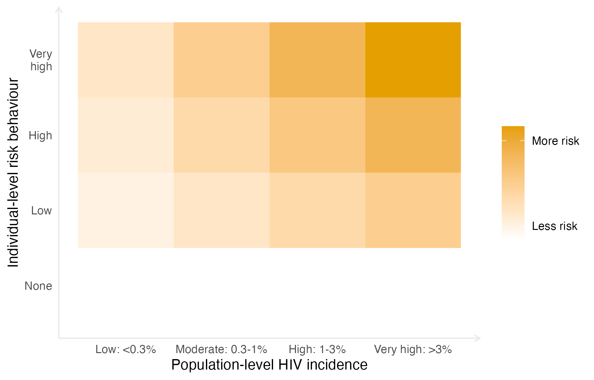

---
output:
  bookdown::html_document2: default
  bookdown::pdf_document2:
    template: templates/brief_template.tex
    citation_package: biblatex
  bookdown::word_document2: default
documentclass: book
bibliography: references.bib
---

```{r echo = FALSE}
options(scipen = 100)

knitr::opts_chunk$set(
  echo = FALSE,
  warning = FALSE,
  message = FALSE,
  dpi = 320,
  cache = TRUE,
  out.width = "95%",
  fig.align = 'center'
)
```

# A model for risk group proportions {#multi-agyw}
\adjustmtc
\markboth{A model for risk group proportions}{}
<!-- For PDF output, include these two LaTeX commands after unnumbered chapter headings, otherwise the mini table of contents and the running header will show the previous chapter -->

In this chapter I describe an application of Bayesian spatio-temporal statistics to small-area estimation of HIV risk group proportions.
This work was conducted in collaboration with colleagues from the MRC Centre for Global Infectious Disease Analysis and UNAIDS.
My primary role was to develop the statistical model.
I built on an earlier version of the analysis conducted by Kathryn Risher.
The results are presented in @howes2023spatio.
Kathryn has also created a spreadsheet tool using the estimates which is now being used by countries to guide policy.
Code for the analysis in this chapter is available from [`athowes/multi-agyw`](https://github.com/athowes/multi-agyw) and supported by the R package [`multi.utils`](https://athowes.github.io/multi.utils) [@multiutils].

## Background

Adolescent girls and young women (AGYW, defined here as females aged 15-29) are a demographic group at increased risk of HIV infection.
Though AGHYW are only 28% of the population, they comprise 44% of new infections [@unaids2021update].
HIV incidence for AGYW is 2.4 times higher than for similarly aged males.
The social and biological reasons for this disparity are given in Table \@ref(tab:agyw-reasons).

| Reason      | Description |
| ----------- | ----------- |
| Structural vulnerability and power imbalances | Gender inequality, lack of agency, economic factors, limited healthcare access, stigma and discrimination |
| Age patterns of sexual mixing | Older male partners have higher prevalence of HIV |
| Younger age at first sex   | Text |
| Increased susceptibility to HIV infection | Immature reproductive tract, including a thinner cervical lining and higher levels of immune cells |

Table: (\#tab:agyw-reasons) AYGW are at higher risk of HIV infection for interacting social and biological reasons.

On this basis, AGYW have been identified as a priority population for HIV prevention services [@saul2018dreams; @global2018measurement].
The Global AIDS Strategy 2021-2026 [@unaids2021global] proposed stratifying HIV prevention packages to AGYW based on 1) local population-level HIV incidence and 2) individual-level sexual risk behaviour.
As risk depends on both factors, prioritisation of prevention services would be more efficient if both are taken into account (Figure \@ref(fig:risk-grid)).
The strategy encourages programmes to define targets for the proportion of AGYW to be reached with a range of interventions.
Estimates of the size of each risk group are required.

```{r risk-grid, fig.cap="Risk depends on both individual-level risk behaviour and population-level HIV incidence."}

```

| Risk group | Description | Local HIV incidence | Incidence ratio |
| ---------- | ----------- | ------------------- | --------------- |
| None       | Not sexually active | -- | 0.0 |
| Low        | One cohabiting partner | -- | 1.0 (Baseline) |
| High       | Non-regular or multiple partner(s) | -- | 1.72 |
| Very High  | Transactional sex (adjusted to correspond to female sex workers) | 0.1-0.3% | 13.0 |
| | | 0.3-1.0% | 9.0 |
| | | 1.0-3.0% | 6.0 |
| | | >3.0% | 3.0 |

Table: (\#tab:risk-groups) Behavioural risk groups.

## Data

I used household survey data from 13 designated AGYW priority countries.: Botswana, Cameroon, Kenya, Lesotho, Malawi, Mozambique, Namibia, South Africa, Eswatini, Tanzania, Uganda, Zambia and Zimbabwe.

For each survey, I classified respondents into one of four behavioural risk groups according to reported sexual risk behaviour in the past 12 months.
These risk groups were:

1. Not sexually active
2. One cohabiting sexual partner
3. Non-regular or multiple sexual partner(s), and
4. AGYW who report transactional sex.

In the case of inconsistent responses, women were categorised according to the highest risk group they fell into, ensuring that the categories were mutually exclusive.
Exact survey questions varied slightly across survey types and between survey phases.
Questions captured information about whether the respondent had been sexually active in the past twelve months, and if so how with many partners.
For their three most recent partners, respondents were also asked about the type of partnership.
Possible partnership types included spouse, cohabiting partner, partner not cohabiting with respondent, friend, sex worker, sex work client, and other.

Some surveys included a specific question asking if the respondent had received or given money or gifts for sex in the past twelve months.
In these surveys, 2.64\% of women reported transactional sex.
In surveys without such a question, women almost never (0.01\%) answered that one of their three most recent partners was a sex work client.
Due to this incomparability across surveys, I did not include surveys without a specific transactional sex question when estimating the proportion of the population who engaged in transactional sex.
I instead focused on estimating the proportion of women who reported transactional sex at a district level, and subsequently adjusted these proportions to align to national estimates for the number of female sex workers.

I used estimates of population, PLHIV and new HIV infections stratified by district and age group from HIV estimates published by UNAIDS that were developed using the Naomi model [@eaton2021naomi].
The administrative area hierarchy and geographic boundaries I used correspond to those used for health service planning by countries.
Exceptions are Cameroon and Kenya, where I conducted analysis one level higher at the department and county levels, respectively.
I used the most recent 2022 estimates for all countries, apart from Mozambique where, due to data accuracy concerns, I used the 2021 estimates (in which the Cabo Delgado province is excluded due to disruption by conflict).

## Model for risk group proportions

I took a two-stage modelling approach to estimate the four risk group proportions.
Index the four risk groups as $k \in \{1, 2, 3, 4\}$, and denote being in either the third or fourth risk group by $k = 3^{+}$.
First, using all the surveys, I used a spatio-temporal multinomial logistic regression model (Section \@ref(st-multinomial)) to estimate the proportion of AGYW in the risk groups $k \in \{1, 2, 3^{+}\}$.
Then, using only those surveys with a specific transactional sex question, I fit a spatial logistic regression model (Section \@ref(s-logistic)) to estimate the proportion of those in the $k = 3^{+}$ risk group that were in the $k = 3$ and $k = 4$ risk groups respectively.

### Spatio-temporal multinomial logistic regression {#st-multinomial}

Let $i \in \{1, \ldots, n\}$ denote districts partitioning the 13 studied AGYW priority countries $c[i] \in \{1, \ldots, 13\}$.
Consider the years 1999-2018 denoted as $t \in \{1, \ldots, T\}$, and age groups $a \in \{\text{15--19}, \text{20--24}, \text{25--29}\}$.
Let $p_{itak} > 0$ with $\sum_{k = 1}^{3^{+}} p_{itak} = 1$, be the probabilities of membership of risk group $k$.

#### Multinomial logistic regression

A baseline category multinomial logistic regression model is specified by
\begin{align}
    \y_{ita} &= (y_{ita1}, \ldots, y_{ita3^{+}})^\top \sim \text{Multinomial}(m_{ita}; \, p_{ita1}, \ldots, p_{ita3^{+}}), \\
    \log \left( \frac{p_{itak}}{p_{ita1}} \right) &= \eta_{itak}, \quad k = 2, 3^{+},
\end{align}
where the number in risk group $k$ is $y_{itak}$, the fixed sample size is $m_{ita} = \sum_{k = 1}^{3^{+}} y_{itak}$, and $k = 1$ is chosen as the baseline category.
This model is not an LGM, and is not possible to fit in `R-INLA`.

#### The multinomial-Poisson transformation

I use the multinomial-Poisson transformation to enable inference with `R-INLA`.
The transformation reframes a given multinomial logisitic regression model as an equivalent Poisson log-linear model of the form
\begin{align}
    y_{itak} &\sim \text{Poisson}(\kappa_{itak}), \label{eq:poisson1} \\
    \log(\kappa_{itak}) &= \eta_{itak}. \label{eq:poisson2}
\end{align}
The basis of the transformation is that, conditional on their sum, Poisson counts are jointly multinomially distributed [@mccullagh1989generalized] as follows
\begin{equation}
    \mathbf{y}_{ita} \, | \, m_{ita} \sim \text{Multinomial} \left( m_{ita}; \frac{\kappa_{ita1}}{\kappa_{ita}}, \ldots, \frac{\kappa_{ita3^{+}}}{\kappa_{ita}} \right),
\end{equation}
where $\kappa_{ita} = \sum_{k = 1}^{3^{+}} \kappa_{itak}$.
Category probabilities are then obtained by the softmax function
\begin{equation}
    p_{itak} = \frac{\exp(\eta_{itak})}{\sum_{k = 1}^{3^{+}} \exp(\eta_{itak})} = \frac{\kappa_{itak}}{\sum_{k = 1}^{3^{+}} \kappa_{itak}} = \frac{\kappa_{itak}}{\kappa_{ita}}.
\end{equation}
Under the equivalent model, the sample sizes $m_{ita} = \sum_k y_{itak}$ are treated as random $m_{ita} \sim \text{Poisson} \left( \kappa_{ita} \right)$ rather than fixed.
The joint distribution of $p(\mathbf{y}_{ita}, m_{ita}) = p(\mathbf{y}_{ita} \, | \, m_{ita})p(m_{ita})$ is then
\begin{align}
p(\mathbf{y}_{ita}, m_{ita}) &= \exp(-\kappa_{ita}) \frac{(\kappa_{ita})^{m_{ita}}}{m_{ita}!} \times \frac{m_{ita}!}{\prod_k y_{itak}!} \prod_k \left( \frac{\kappa_{itak}}{\kappa_{ita}} \right)^{y_{itak}} \\
&= \prod_k \left( \frac{\exp(-\kappa_{itak}) \left( \kappa_{itak} \right)^{y_{itak}}}{y_{itak}!} \right) \\
&= \prod_k \text{Poisson} \left( y_{itak} \, | \, \kappa_{itak} \right). \label{eq:prodpoisson}
\end{align}
corresponding to the product of independent Poisson likelihoods as in Equation \ref{eq:poisson1}.

This model, including random sample sizes, is equivalent to the multinomial logistic regression only when the normalisation constants $m_{ita}$ are recovered exactly.
To ensure that this is the case, one approach is to include observation-specific random effects $\theta_{ita}$ in the equation for the linear predictor.
Multiplying each of $\{\kappa_{itak}\}_{k = 1}^{3^+}$ by $\exp(\theta_{ita})$ has no effect on the category probabilities, but does provide the necessary flexibility for $\kappa_{ita}$ to recover $m_{ita}$ exactly.
Although in theory an improper prior $\theta_{ita} \propto 1$ should be used, I found that in practise, by keeping $\eta_{ita}$ otherwise small using appropriate constraints, so that arbitrarily large values of $\theta_{ita}$ are not required, it is sufficient (and practically preferable for inference) to instead use a vague prior.

#### Model specifications

I considered four models for $\eta_{ita}$ in Equation \ref{eq:poisson2} of the form
\begin{equation}
\eta_{ita} = \theta_{ita} + \beta_k + \zeta_{c[i]k} + \alpha_{ac[i]k} + \phi_{ik} + \gamma_{tk}.
\end{equation}
<!-- + \delta_{itk} -->
Observation random effects $\theta_{ita} \sim \mathcal{N}(0, 1000^2)$ were included in all models I considered, and are required for the multinomial-Poisson transformation to be valid.
To capture country-specific proportion estimates for each category, I included category random effects $\beta_k \sim \mathcal{N}(0, \tau_\beta^{-1})$ and country-category random effects $\zeta_{ck} \sim \mathcal{N}(0, \tau_\zeta^{-1})$.
Heterogeneity in risk group proportions by age was allowed by including age-country-category random effects $\alpha_{ack} \sim \mathcal{N}(0, \tau_\alpha^{-1})$.

##### Spatial random effects

For the space-category $\phi_{ik}$ random effects I considered two specifications:

1. Independent and identically distributed (IID) $\phi_{ik} \sim \mathcal{N}(0, \tau_\phi^{-1})$,
2. Besag [@besag1991bayesian] grouped by category
$$
\bphi = (\phi_{11}, \ldots, \phi_{n1}, \ldots, \phi_{1{3^{+}}}, \ldots \phi_{n3^{+}})^\top \sim \mathcal{N}(\mathbf{0}, (\tau_\phi \mathbf{R}^\star_\phi)^{-}).
$$
The scaled structure matrix $\mathbf{R}^\star_\phi = \mathbf{R}^\star_b \otimes \mathbf{I}$ is given by the Kronecker product of the scaled Besag structure matrix $\mathbf{R}^\star_b$ and the identity matrix $\mathbf{I}$, and ${-}$ denotes the generalised matrix inverse.
Scaling of the structure matrix to have generalised variance one ensures interpretable priors may be placed on the precision parameter [@sorbye2014scaling].
I followed the further recommendations of @freni2018note with regard to disconnected adjacency graphs, singletons and constraints.
The Besag structure matrix $\mathbf{R}_b$ was obtained by the precision matrix of the random effects $\mathbf{b} = (b_1, \ldots, b_n)^\top$ with full conditionals
\begin{equation}
b_i \, | \, \mathbf{b}_{-i} \sim \N\left(\frac{\sum_{j: j \sim i} b_j}{n_{\delta i}}, \frac{1}{n_{\delta i}}\right),
\end{equation}
where $j \sim i$ if the districts $A_i$ and $A_j$ are adjacent, and $n_{\delta i}$ is the number of districts adjacent to $A_i$.

In preliminary testing, I excluded spatial random effects from the model, but found that this negatively effected performance.
I also tested using the BYM2 model [@simpson2017penalising] in place of the Besag, but found that the proportion parameter posteriors tended to be highly peaked at the value one.
For simplicity and to avoid numerical issues, by using Besag random effects I effectively decided to fix this proportion to one.

##### Temporal random effects

For the year-category $\gamma_{tk}$ random effects I considered two specifications:

1. IID $\phi_{tk} \sim \mathcal{N}(0, \tau_\phi^{-1})$,
2. First order autoregressive (AR1) grouped by category
$$
\bm{\gamma} = (\gamma_{11}, \ldots, \gamma_{13^{+}}, \ldots, \gamma_{T1}, \ldots, \gamma_{T3^{+}})^\top \sim \mathcal{N}(\mathbf{0}, (\tau_\phi \mathbf{R}^\star_\gamma)^{-}).
$$
The scaled structure matrix $\mathbf{R}^\star_\gamma = \mathbf{R}^\star_r \otimes \mathbf{I}$ is given by the Kronecker product of a scaled AR1 structure matrix $\mathbf{R}^\star_r$ and the identity matrix $\mathbf{I}$.
The AR1 structure matrix $\mathbf{R}_r$ is obtained by precision matrix of the random effects $\mathbf{r} = (r_1, \ldots, r_T)^\top$ specified by
\begin{align}
r_1 &\sim \left( 0, \frac{1}{1 - \rho^2} \right), \\
r_t &= \rho r_{t - 1} + \epsilon_t, \quad t = 2, \ldots, T, 
\end{align}
where $\epsilon_t \sim \mathcal{N}(0, 1)$ and $|\rho| < 1$.

##### Priors

All random effect precision parameters $\tau \in \{\tau_\beta, \tau_\zeta, \tau_\alpha, \tau_\phi, \tau_\gamma\}$ were given independent penalised complexity (PC) priors [@simpson2017penalising] with base model $\sigma = 0$ given by $p(\tau) = 0.5 \nu \tau^{-3/2} \exp \left( - \nu \tau^{-1/2} \right)$ where $\nu = - \ln(0.01) / 2.5$ such that  $\mathbb{P}(\sigma > 2.5) = 0.01$.
For the lag-one correlation parameter $\rho$, I used the PC prior, as derived by @sorbye2017penalised, with base model $\rho = 1$ and condition $\mathbb{P}(\rho > 0 = 0.75)$.
I chose the base model $\rho = 1$ corresponding to no change in behaviour over time, rather than the alternative $\rho = 0$ corresponding to no correlation in behaviour over time, as I judged the former to be more plausible a priori.

#### Constraints

To ensure interpretable posterior inferences relating to the random effects, I applied sum-to-zero constraints such that none of the category interaction random effects altered overall category probabilities.
For the space-year-category random effects, I applied analogous sum-to-zero constraints to maintain roles of the space-category and year-category random effects.
Together, these were:

1. Category $\sum_k \beta_k = 0$,
2. Country $\sum_c \zeta_{ck} = 0, \, \forall \, k$,
3. Age-country $\sum_a \alpha_{ack} = 0, \, \forall \, c, k$,
4. Spatial $\sum_i \phi_{ik} = 0, \, \forall \, k$,
5. Temporal $\sum_t \gamma_{tk} = 0, \, \forall \, k$.

#### Survey weighted likelihood

I included surveys which use a complex design, in which each individual has an unequal probability of being included in the sample.
For example the DHS often employs a two-stage cluster design, first taking an urban rural stratified sample of ennumeration areas, before selecting households from each ennumeration area using systematic sampling [@measure2012sampling].

To account for this aspect of survey design, I use a weighted pseudo-likelihood where the observed counts $y$ are replaced by effective counts $y^\star$ calculated using the survey weights $w_j$ of all individuals $j$ in the corresponding strata.
I multiplied direct estimates produced using the `survey` package [@JSSv009i08] by the Kish effective sample size [@kish1965survey]
\begin{equation}
    m^\star = \frac{\left(\sum_j w_j \right)^2}{\sum_j {w_j}^2}
\end{equation}
to obtain $y^\star$.
These counts may not be integers, and as such the Poisson likelihood I used in Equation \ref{eq:poisson1} is not appropriate.
Instead, I used a generalised Poisson pseudo-likelihood $y^\star \sim \text{xPoisson}(\kappa)$, given by
\begin{equation}
    p(y^\star) = \frac{\kappa^{y^\star}}{\left \lfloor{y^\star!}\right \rfloor } \exp \left(- \kappa \right),
\end{equation}
as implemented by `family = "xPoisson"` in `R-INLA`, which accepts non-integer input.

### Spatial logistic regression {#s-logistic}

To estimate the proportion of those in the $k = 3^{+}$ risk group that were in the $k = 3$ and $k = 4$ risk groups respectively, I fit logistic regression models of the form
\begin{align}
    y_{ia4} &\sim \text{Binomial} \left( y_{ia3} + y_{ia4}, q_{ia} \right), \label{eq:logistic-regression} \\
    q_{ia} &= \text{logit}^{-1} \left( \eta_{ia} \right), 
\end{align}
where $q_{ia} = p_{ia4} / (p_{ia3} + p_{ia4}) = p_{ia4} / p_{ia{3^+}}$.
Taking this two-step approach allowed me to include all surveys in the multinomial regression model, but only those surveys with a specific transactional sex question in Equation \ref{eq:logistic-regression}.
As all such surveys occurred in 2013-2018, in the logistic regression model I assumed $q_{ia}$ to be constant over time.

#### Model specifications

I considered six logistic regression models.
Each included a constant $\beta_0 \sim \mathcal{N}(-2, 1^2)$, country random effects $\zeta_{c} \sim \mathcal{N}(0, \tau_\zeta^{-1})$, and age-country random effects $\alpha_{ac} \sim \mathcal{N}(0, \tau_\alpha^{-1})$.
The prior on $\beta_0$ placed 95\% prior probability on the range `r 100 * round(plogis(-4), 2)`-`r 100 * round(plogis(0), 2)`\% for the percentage of those with non-regular or multiple partners who report transactional sex.
I considered two specifications (IID, Besag) for the spatial random effects $\phi_i$.
To aid estimation with sparse data, I also considered national-level covariates for the proportion of men who have paid for sex ever \texttt{cfswever} or in the last twelve months \texttt{cfswrecent}, available from @hodgins2022population.
For both random effect precision parameters $\tau \in \{\tau_\alpha, \tau_\zeta\}$ I used the PC prior with base model $\sigma = 0$ and $\mathbb{P}(\sigma > 2.5 = 0.01)$.
For the regression parameters $\beta \in \{\beta_\texttt{cfswever}, \beta_\texttt{cfswrecent}\}$ I used the prior $\beta \sim \mathcal{N}(0, 2.5^2)$.

#### Survey weighted likelihood

As with the multinomial regression model, I used survey weighted counts $\{y_{itak}^\star\}$ and sample sizes $\{m_{itak}^\star\}$.
I used a generalised binomial pseudo-likelihood $y^\star \sim \text{xBinomial}(m^\star, q)$, as implemented by \texttt{family = "xBinomial"} in \texttt{R-INLA}, given by
\begin{equation}
    p(y^\star \, | \, m^\star, q) =  \binom{\lfloor m^\star \rfloor}{\lfloor y^\star \rfloor} q^{y^\star} (1 - q)^{m^\star - y^\star}.
\end{equation}
to extend the binomial distribution to non-integer weighted counts and sample sizes.

### Female sex worker population size adjustment

Responding "yes" to the question "have you had sex in return for gifts, cash or anything else in the past 12 months" is not considered sufficient to constitute sex work.
Recognising this, I adjusted the estimates obtained based on the survey to match FSW population size estimates obtained via alternative methods.

@stevens2022estimating used a Bayesian meta-analysis of key population specific data sources to estimate adult (15-49) FSW population size by country.
I disaggregated these estimates by age as follows.
First, I calculated the total sexually debuted population in each age group, in each country.
To describe the distribution of age at first sex, I used skew logistic distributions [@nguyen2022trends] with cumulative distribution function given by
\begin{equation}
F(x) = \left(1 + \exp(\kappa_c (\mu_c - x)) \right)^{- \gamma_c},
\end{equation}
where $\kappa_c, \mu_c, \gamma_c > 0$ are country-specific shape, shape and skewness parameters respectively.
Next, I used the assumed $\text{Gamma}(\alpha = 10.4, \beta = 0.36)$ FSW age distribution in South Africa from the Thembisa model [@johnson2020thembisa] to calculate the implied ratio between the number of FSW and the sexually debuted population in each age group.
I assumed these ratios in South Africa were applicable to every country, allowing calculation of the number of FSW by age group in all 13 countries.
The results obtained are shown in Figure \@ref(fig:age-disagg-fsw-line).

```{r age-disagg-fsw-line, out.width = "90%", echo=FALSE, fig.cap="The disaggregation procedure I used produces a plausible age distirbution of FSW by country."}
knitr::include_graphics("resources/multi-agyw/20230627-144735-3da88508/depends/age-disagg-fsw-line.png")
```

### Results

#### Coverage assessment

To assess the calibration of the fitted model, I calculated the quantile $q$ of each observation within the posterior predictive distribution.
For calibrated models, these quantiles, known as probability integral transform (PIT) values [@dawid1984present; @bosse2022scoringutils], should follow a uniform distribution $q \sim \mathcal{U}[0, 1]$.
To generate samples from the posterior predictive distribution, I applied the multinomial likelihood to samples from the latent field, setting the sample size to be the floor of the Kish effective sample size.

Using the PIT values, it is possible to calculate the empirical coverage of all $(1 - \alpha)100$\% (equal-tailed) posterior predictive credible intervals.
These empirical coverages can be compared to the nominal coverage $(1 - \alpha)$ for each value of $\alpha \in [0, 1]$ to give empirical cumulative distribution function (ECDF) difference values.
This approach has the advantage of considering all possible confidence values at once.
@sailynoja2021graphical develop binomial distribution-based simultaneous confidence bands for ECDF difference values which test uniformity.

#### Variance decomposition

#### Estimates

## Prevalence and incidence by risk group

### Disaggregation of Naomi estimates

I calculated HIV incidence $\lambda_{iak}$ and number of new HIV infections $I_{iak}$ stratified according to district, age group and risk group by linear disaggregation
\begin{align}
    I_{ia} &= \sum_k I_{iak} = \sum_k \lambda_{iak}N_{iak} \\
    &= 0 + \lambda_{ia2} N_{ia2} + \lambda_{ia3} N_{ia3} + \lambda_{ia4} N_{ia4} \\
    &= \lambda_{ia2} \left(N_{ia2}  + \text{RR}_{3} N_{ia3} + \text{RR}_4(\lambda_{ia}) N_{ia4}  \right).
\end{align}
Risk group specific HIV incidence estimates are then given by
\begin{align}
    \lambda_{ia1} &= 0, \\
    \lambda_{ia2} &= I_{ia} / \left(N_{ia2} + \text{RR}_{3} N_{ia3} + \text{RR}_4(\lambda_{ia}) N_{ia4}\right), \\
    \lambda_{ia3} &= \text{RR}_{3} \lambda_{ia2}, \\
    \lambda_{ia4} &= \text{RR}_4(\lambda_{ia}) \lambda_{ia2}.
\end{align}
which I evaluated using Naomi model estimates of the number of new HIV infections $I_{ia} = \lambda_{ia} N_{ia}$, HIV infection risk ratios $\{\text{RR}_3, \text{RR}_4(\lambda_{ia})\}$, and risk group population sizes as above.
The risk ratio $\text{RR}_4(\lambda_{ia})$ was defined as a function of general population incidence.
The number of new HIV infections are then $I_{iak} = \lambda_{iak} N_{iak}$.

### Expected new infections reached

I calculated the number of new infections that would be reached prioritising according to each possible stratification of the population--that is for all $2^3 = 8$ possible combinations of stratification by location, age, and risk group. 
As an illustration, for stratification just by age, I aggregated the number of new HIV infections and HIV incidence as such 
\begin{align}
    I_a &= \sum_{ik} I_{iak}, \\
    \lambda_a &= I_a / \sum_{ik} N_{iak}.
\end{align}
Under this stratification, individuals in each age group $a$ are prioritised according to the highest HIV incidence $\lambda_a$.
By cumulatively summing the expected infections, for each fraction of the total population reached I calculated the fraction of total expected new infections that would be reached.

### Results

## Discussion

I estimated the proportion of AGYW who fall into different risk groups at a district level in 13 sub-Saharan African countries.
These estimates support consideration of differentiated prevention programming according to geographic locations and risk behaviour, as outlined in the Global AIDS Strategy.
Systematic differences in risk by age groups, and variation within and between countries, explained the large majority of variation in risk group proportions.
Changes over time were negligible in the overall variation in risk group proportions.
The proportion of 15-19 year olds who are sexually active, and among women aged 20-29 years, norms around cohabitation especially varied across districts and countries.
This variation underscores the need for these granular data to implement HIV prevention options aligned to local norms and risk behaviours.

I considered four risk groups based on sexual behaviour, the most proximal determinant of risk.
Other factors, such as condom usage or type of sexual act, may account for additional heterogeneity in risk from sexual behaviour.
However, I did not include these factors in view of measurement difficulties, concerns about consistency across contexts, and the operational benefits of describing risk parsimoniously.
Sexual behaviour confers risk only when AGYW reside in geographic locations where there is unsuppressed viral load among their potential partners.
I did not include more distal determinants, such as school attendance, orphanhood, or gender empowerment, as I expect their effects on risk to largely be mediated by more proximal determinants.
However, to effectively implement programming, it is crucial to understand these factors, as well as the broader structural barriers and limits to personal agency faced by AGYW.
Importantly, programs must ensure that intervention prioritisation occurs without stigmatising or blaming AGYW.

Brugh et al. [@brugh2021characterizing] previously geographically mapped AGYW HIV risk groups using biomarker and behavioural data from the most recent surveys in Eswatini, Haiti and Mozambique to define and subsequently map risk groups with a range of machine learning techniques.
My work builds on Brugh et al. [@brugh2021characterizing] by including more countries, integrating a greater number of surveys, and connecting risk group proportions with HIV epidemic indicators to help inform programming.

By considering a range of possible risk stratification strategies, I showed that successful implementation of a risk-stratified approach would allow substantially more of those at risk for infections to be identified before infection occurs.
A considerable proportion of estimated new infections were among FSW, supporting the case for HIV programming efforts focused on key population groups [@baral2012burden].
There is substantial variation in the importance of prioritisation by age, location and behaviour within each country.
This highlights the importance of understanding and tailoring HIV prevention efforts to country-specific contexts.
By standardising our analysis across all 13 countries, I showed the additional efficiency benefits of resource allocation between countries.

I found a geographic delineation in the proportion of women cohabiting between southern and eastern Africa, calling attention to a divide attributable to many cultural, social, and economic factors.
The delineation does not represent a boundary between predominately Christian and Muslim populations, which is further north.
I also note that the high numbers of adolescent girls aged 15-19 cohabiting in Mozambique is markedly different from the other countries [@unicef].

My modelled estimates of risk group proportions improve upon direct survey results for three reasons.
First, by taking a modular modelling approach, I integrated all relevant survey information from multiple years, allowing estimation of the FSW proportion for surveys without a specific transactional sex question.
Second, whereas direct estimates exhibit large sampling variability at a district level, I alleviated this issue using spatio-temporal smoothing.
Third, I provided estimates in all district-years, including those not directly sampled by surveys, allowing estimates to be consistently fed into further analysis and planning pipelines (such as our analysis of risk group specific prevalence and incidence).

The final surveys included in our risk model model were conducted in 2018.
The analysis may be updated with more surveys as they become available.
I do not anticipate that the risk group proportions will change substantially, as I found that they did not change significantly over time.

My analysis focused on females aged 15-29 years, and could be extended to consider optimisation of prevention more broadly, accounting for the `r 100 - 100`\% of new infections among adults 15-49 which occur in women 30-49 and men 15-49.
Estimating sexual risk behaviour in adults 15-49 would be a crucial step toward greater understanding of the dynamics of the HIV epidemic in sub-Saharan Africa, and would allow incidence models to include stratification of individuals by sexual risk.

Phylogenetic results from BDI are about transmission rather than incidence.
Only age-sex structured not age-sex-behaviour.
Does not undermine my work.

### Limitations

My analysis was subject to challenges shared by most approaches to monitoring sexual behaviour in the general population [@cleland2004monitoring].
In particular, under-reporting of higher risk sexual behaviours among AGYW could affect the validity of my risk group proportion estimates.
Due to social stigma or disapproval, respondents may be reluctant to report non-marital partners [@nnko2004secretive, @helleringer2011reliability] or may bias their reporting of sexual debut [@zaba2004age; @wringe2009comparative; @nguyen2022trends].
For guidance of resource allocation, differing rates of under-reporting by country, district, year or age group are particularly concerning to the applicability of my results; and, while it may be reasonable to assume a constant rate over space-time, the same cannot be said for age, where aspects of under-reporting have been shown to decline as respondents age [@glynn2011assessing], suggesting that the elevated risks I found faced by younger women are likely a conservative estimate.
If present, these reporting biases will also have distorted the estimates of infection risk ratios and prevalence ratios I used in my analysis, likely over-attributing risk to higher risk groups.

I have the least confidence in my estimates for the FSW risk group.
As well as having the smallest sample sizes, my transactional sex estimates do not overcome the difficulties of sampling hard to reach groups.
I inherent any limitations of the national FSW estimates [@stevens2022estimating] which I adjust my estimates of transactional sex to match.
Furthermore, I do not consider seasonal migration patterns, which may particularly affect FSW size.
More generally, I did not consider covariates potentially predictive of risk group proportions (such as sociodemographic characteristics, education, local economic activity, cultural and religious norms and attitudes), which are typically difficult to measure spatially.
Identifying measurable correlates of risk, or particular settings in which time-concentrated HIV risk occurs, is an important area for further research to improve risk prioritisation and precision HIV programme delivery.

The efficiency of each stratified prevention strategy depends on the ability of programmes to identify and effectively reach those in each strata.
My analysis of new infections potentially averted assumed a "best-case" scenario where AGYW of every strata can be reached perfectly, and should therefore be interpreted as illustrating the potentially obtainable benefits rather than benefits which would be obtained from any specific intervention strategy.
In practice, stratified prevention strategies are likely to be substantially less efficient than this best-case scenario.
Factors I did not consider include the greater administrative burden of more complex strategies, variation in difficulty or feasibility of reaching individuals in each strata, variation in the range or effectiveness of interventions by strata, and changes in strata membership that may occur during the course of a year.
Identifying and reaching behavioural strata may be particularly challenging.
Empirical evaluations of behavioural risk screening tools have found only moderate discriminatory ability [@jia2022risk], and risk behaviour may change rapidly among young populations, increasing the challenge to effectively deliver appropriately timed prevention packages.
This consideration may motivate selecting risk groups based on easily observable attributes, such as attendance of a particular service or facility, rather than sexual behaviour.

I did not engage with country experts or civil society organisations.
This led to problems, including in Malawi.
Future work should be better.

<!-- RE notes that it could be worth talking about the age patterns of sexual mixing, that I didn't consider them, and how they might effect intervention planning. -->

### Conclusion

I estimated the proportion of AGYW aged 15-19, 20-24 and 25-29 years in four sexual risk groups at a district-level in 13 priority countries and analyzed the number of infections that could be reached by prioritisation based upon location, age and behaviour.
Though subject to limitations, these estimates provide data that national HIV programmes can use to set targets and implement differentiated HIV prevention strategies as outlined in the Global AIDS Strategy.
Successfully implementing this approach would result in more efficiently reaching a greater number of those at risk of infection.

Among AGYW, there was systematic variation in sexual behaviour by age and location, but not over time.
Age group variation was primarily attributable to age of sexual debut (ages 15-24).
Spatial variation was particularly present between those who reported one cohabiting partner versus non-regular or multiple partners.
Risk group proportions did not change substantially over time, indicating that norms relating to sexual behaviour are relatively static.
These findings underscore the importance of providing effective HIV prevention options tailored to the needs of particular age groups, as well as local norms around sexual partnerships.
