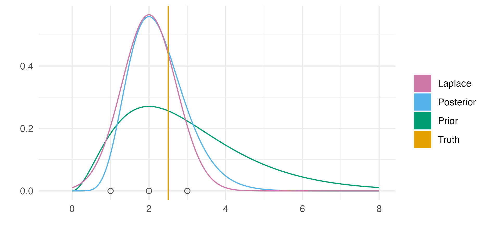
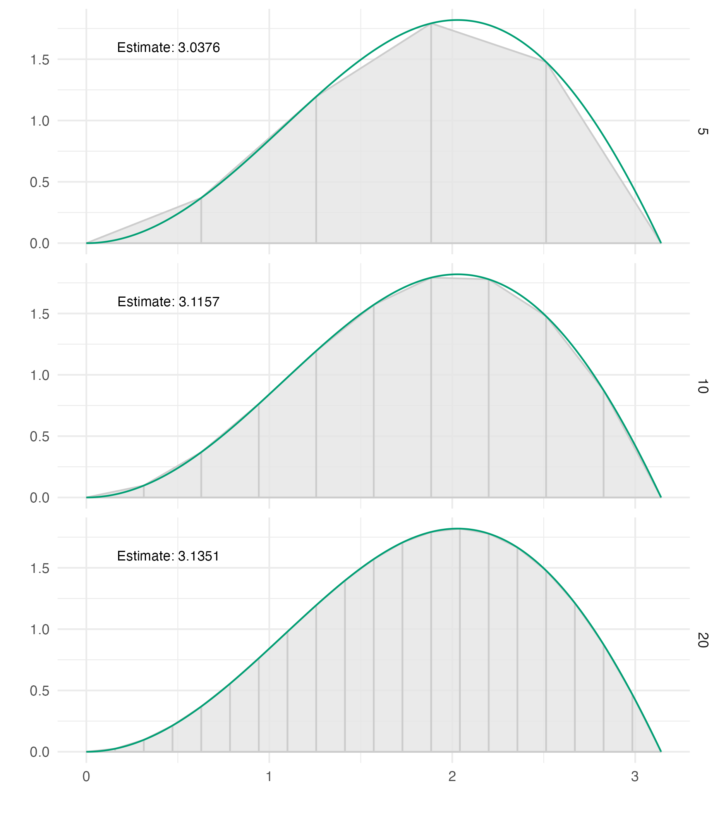
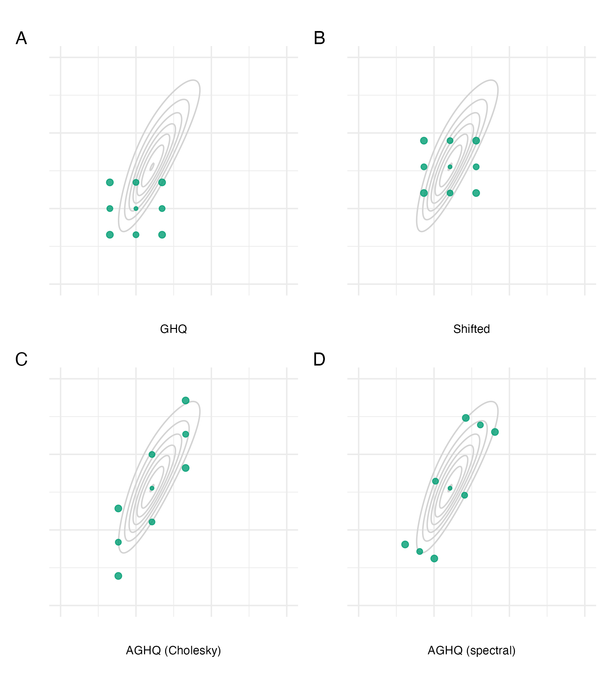
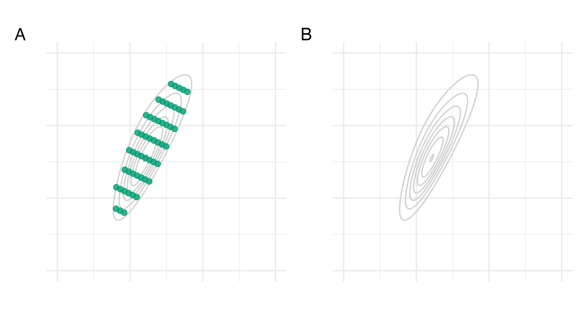
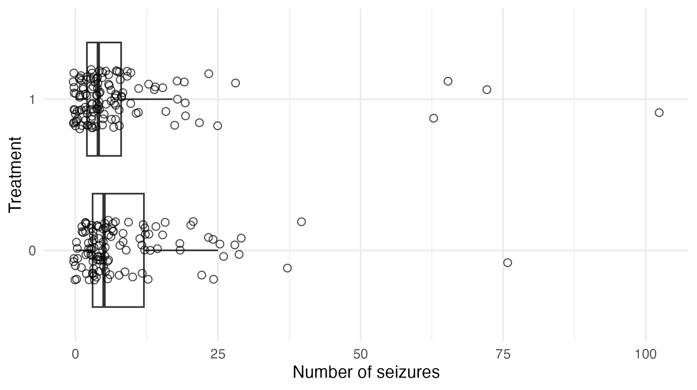
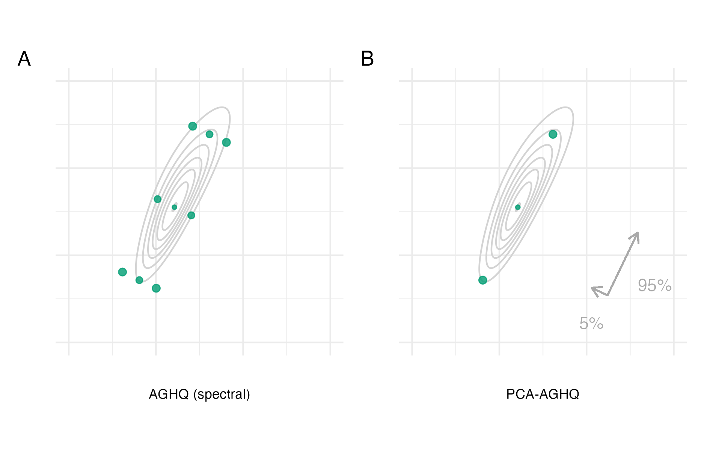
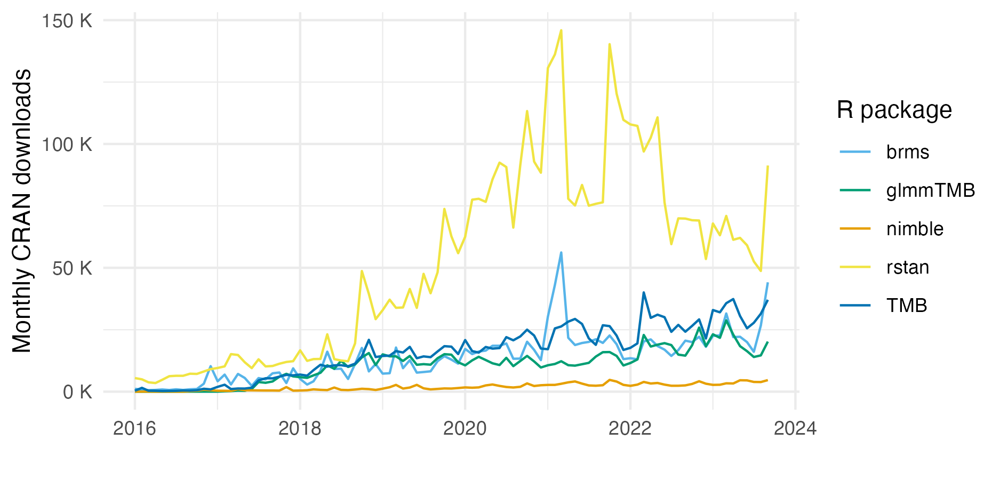

---
#########################################
# options for knitting a single chapter #
#########################################
output:
  bookdown::pdf_document2:
    template: templates/brief_template.tex
    citation_package: biblatex
  bookdown::html_document2: default
  bookdown::word_document2: default
documentclass: book
bibliography: references.bib
---

```{r}
resource_version <- "20230811-095752-5b8181d8"
```

# Fast approximate Bayesian inference {#naomi-aghq}
\adjustmtc
\minitoc
\markboth{Fast approximate Bayesian inference}{}
<!-- For PDF output, include these two LaTeX commands after unnumbered chapter headings, otherwise the mini table of contents and the running header will show the previous chapter -->

This chapter describes development of a novel Bayesian inference method, motivated by the Naomi small-area estimation model [@eaton2021naomi].
Over 35 countries [@unaids2023global] have used the Naomi model web interface ([`https://naomi.unaids.org`](https://naomi.unaids.org) to produce subnational estimates of HIV indicators.
Evidence is synthesised from household surveys and routinely collected health data to generate estimates of HIV indicators by district, age, and sex.
The complexity and size of the model makes obtaining fast and accurate Bayesian inferences challenging.

The methods developed in this chapter combine Laplace approximations with adaptive quadrature, and are descended from the integrated nested Laplace approximation (INLA) method pioneered by @rue2009approximate.
The INLA method has enabled fast and accurate Bayesian inferences for a vast array of models, across a large number of scientific fields [@rue2017bayesian].
The success of INLA is in large part due to its accessible implementation in the `R-INLA` software.
Use of the INLA method and `R-INLA` software are close to ubiquitous in applied settings.
However, the Naomi model is not compatible with `R-INLA`, largely because it is too complex to be expressed using a formula interface.
As a result, inference for the Naomi model have previously been obtained using an empirical Bayes [EB; @casella1985introduction] approximation to full Bayesian inference, with the Laplace approximation implemented by the more flexible Template Model Builder [`TMB`; @kristensen2016tmb] R package.
In the EB approximation hyperparameters are fixed by optimisation of the marginal posterior.
This is undesirable as it results in underestimation of uncertainty, which may ultimately lead to worse policy decisions which stem from overconfidence.

Most methodological work on INLA has taken place using the `R-INLA` software package.
There are two notable exceptions.
First, the simplified INLA approach of @wood2020simplified, implemented in the `mgcv` R package, proposed an fast Laplace approximation appoach which does not rely on Markov structure of the latent field.
Second, @stringer2022fast extended the scope and scalability of INLA by avoiding augmenting the latent field with the noisy additive linear predictors, enabling application of INLA to a wider class of extended latent Gaussian models (ELGMs), which includes Naomi.
This approach is referred to by @van2023new as the "modern" formulation of the INLA method, as opposed to the "classic" formulation of @rue2009approximate, and is included in `R-INLA` using `inla.mode = "experimental"`.
Along with removing the noisy structured additive predictor, @stringer2022fast propose use of the adaptive Gauss-Hermite quadrature [AGHQ; @naylor1982applications] rule to integrate with respect to the hyperparameters.
The methodological contributions of this chapter extend @stringer2022fast in two directions:

1. The first direction is a universally applicable implementation of INLA with Laplace marginals, where automatic differentiation via `TMB` is is used to obtain the derivatives required for the Laplace approximation.
Section \@ref(universal) demonstrates the implementation using two examples, one compatible with `R-INLA` and one incompatible.
2. The second direction is a quadrature rule which combines AGHQ with principal components analysis to enable integration over moderate-dimensional spaces, described in Section \@ref(pca-aghq).
This quadrature rule is used to perform inference for the Naomi model by integrating the marginal Laplace approximation with respect to the moderate-dimensional hyperparameters within an INLA algorithm implemented in `TMB` in Section \@ref(malawi).

This work was conducted in collaboration with Prof. Alex Stringer, who I visited at the University of Waterloo in the fall term of 2022.
The results are presented in @howes2023fast.
Code for the analysis in this chapter is available from [`https://github.com/athowes/naomi-aghq`](https://github.com/athowes/naomi-aghq).

## Inference methods and software

This section reviews existing deterministic Bayesian inference methods (Sections \@ref(la), \@ref(quadrature), \@ref(inla)) and software (Section \@ref(software)).
Inference comprises obtaining the posterior distribution
\begin{equation}
p(\boldsymbol{\mathbf{\phi}} \, | \, \mathbf{y}) = \frac{p(\boldsymbol{\mathbf{\phi}}, \mathbf{y})}{p(\mathbf{y})}, (\#eq:bayes)
\end{equation}
or some way to compute relevant functions of it.
The posterior distribution encapsulates beliefs about the parameters $\boldsymbol{\mathbf{\phi}} = (\phi_1, \ldots, \phi_d)$ having observed data $\mathbf{y} = (y_1, \ldots, y_n)$, which here I assume to be expressible as vectors.

Inference is a sensible goal because the posterior distribution is sufficient for use in decision making.
That is, given a loss function $l(a, \boldsymbol{\mathbf{\phi}})$, the expected posterior loss of a decision $a$ depends on the data only via the posterior distribution
\begin{equation}
\mathbb{E}(l(a, \boldsymbol{\mathbf{\phi}}) \, | \, \mathbf{y}) = \int_{\mathbb{R}^d} l(a, \boldsymbol{\mathbf{\phi}}) p(\boldsymbol{\mathbf{\phi}} \, | \, \mathbf{y}) \text{d}\boldsymbol{\mathbf{\phi}}.
\end{equation}
For example, given the posterior distribution of the current demand for HIV treatment at a particular facility, historic data about treatment demand are not required for planning of service provision.
As such, the information provided for strategic response to the HIV epidemic can be thought of as functions of the posterior distribution.

It is usually intractable to obtain the posterior distribution.
This is because the denominator in Equation \@ref(eq:bayes) contains a potentially high-dimensional integral over the $d \in \mathbb{Z}^+$ -dimensional parameters
\begin{equation}
p(\mathbf{y}) = \int_{\mathbb{R}^d} p(\mathbf{y}, \boldsymbol{\mathbf{\phi}}) \text{d}\boldsymbol{\mathbf{\phi}}, (\#eq:evidence)
\end{equation}
sometimes called the evidence or posterior normalising constant.
For this reason, approximations to the posterior distribution $\tilde p(\boldsymbol{\mathbf{\phi}} \, | \, \mathbf{y})$ are typically used in place of the exact posterior distribution.

Some approximate Bayesian inference methods, like Markov chain Monte Carlo (MCMC), avoid directly calculating the posterior normalising constant, instead finding ways to work with the unnormalised posterior distribution
\begin{equation}
p(\boldsymbol{\mathbf{\phi}} \, | \, \mathbf{y}) \propto p(\boldsymbol{\mathbf{\phi}}, \mathbf{y}),
\end{equation}
where $p(\mathbf{y})$ is not a function of $\boldsymbol{\mathbf{\phi}}$ and so can be removed as a constant.
Other approximate Bayesian inference methods can more directly be thought of as ways to estimate the posterior normalising constant.
The methods in this chapter fall into this latter category, and are sometimes described as deterministic Bayesian inference methods.

### The Laplace approximation {#la}

Laplace's method [@laplace1774memoire] is a technique used to approximate integrals of the form
\begin{equation}
\int \exp(C h(\mathbf{z})) \text{d}\mathbf{z},
\end{equation}
where $C > 0$ is a constant, $h$ is a function which is twice-differentiable, and $\mathbf{z}$ are generic variables.
The Laplace approximation [@tierney1986accurate] is obtained by application of Laplace's method to calculate the posterior normalising constant (Equation \@ref(eq:evidence)).
Let $h(\boldsymbol{\mathbf{\phi}}) = \log p(\boldsymbol{\mathbf{\phi}}, \mathbf{y})$ such that
\begin{equation}
p(\mathbf{y}) = \int_{\mathbb{R}^d} p(\mathbf{y}, \boldsymbol{\mathbf{\phi}}) \text{d}\boldsymbol{\mathbf{\phi}} = \int_{\mathbb{R}^d} \exp(h(\boldsymbol{\mathbf{\phi}})) \text{d}\boldsymbol{\mathbf{\phi}}.
\end{equation}
Laplace's method involves approximating the function $h$ by its second order Taylor expansion.
This expansion is then evaluated at a maxima of $h$ to eliminate the first order term.
Let
\begin{equation}
\hat{\boldsymbol{\mathbf{\phi}}} = \arg\max_{\boldsymbol{\mathbf{\phi}}} h(\boldsymbol{\mathbf{\phi}}) (\#eq:posterior-mode)
\end{equation}
be the posterior mode, and
\begin{equation}
\hat {\mathbf{H}} = - \frac{\partial^2}{\partial \boldsymbol{\mathbf{\phi}} \partial \boldsymbol{\mathbf{\phi}}^\top} h(\boldsymbol{\mathbf{\phi}}) \rvert_{\boldsymbol{\mathbf{\phi}} = \hat{\boldsymbol{\mathbf{\phi}}}} (\#eq:hessian)
\end{equation}
be the Hessian matrix evaluated at the posterior mode.
The Laplace approximation is then
\begin{align}
\tilde p_{\texttt{LA}}(\mathbf{y}) &= \int_{\mathbb{R}^d} \exp \left( h(\hat{\boldsymbol{\mathbf{\phi}}}) - \frac{1}{2} (\boldsymbol{\mathbf{\phi}} - \hat{\boldsymbol{\mathbf{\phi}}})^\top \hat {\mathbf{H}} (\boldsymbol{\mathbf{\phi}} - \hat{\boldsymbol{\mathbf{\phi}}}) \right) \text{d}\boldsymbol{\mathbf{\phi}} (\#eq:la) \\
&= p(\hat{\boldsymbol{\mathbf{\phi}}}, \mathbf{y}) \cdot \frac{(2 \pi)^{d/2}}{| \hat {\mathbf{H}} |^{1/2}}. (\#eq:la2)
\end{align}
The result above is calculated using the known normalising constant of the Gaussian distribution
\begin{equation}
p_\texttt{G}(\boldsymbol{\mathbf{\phi}} \, | \, \mathbf{y}) = \mathcal{N}(\boldsymbol{\mathbf{\phi}} \, | \, \hat{\boldsymbol{\mathbf{\phi}}}, \hat {\mathbf{H}}^{-1}) = \frac{| \hat {\mathbf{H}} |^{1/2}}{(2 \pi)^{d/2}} \exp \left( - \frac{1}{2} (\boldsymbol{\mathbf{\phi}} - \hat{\boldsymbol{\mathbf{\phi}}})^\top \hat {\mathbf{H}} (\boldsymbol{\mathbf{\phi}} - \hat{\boldsymbol{\mathbf{\phi}}}) \right).
\end{equation}
The Laplace approximation may be thought of as approximating the posterior distribution by a Gaussian distribution $p(\boldsymbol{\mathbf{\phi}} \, | \, \mathbf{y}) \approx p_\texttt{G}(\boldsymbol{\mathbf{\phi}} \, | \, \mathbf{y})$ such that
\begin{equation}
\tilde p_{\texttt{LA}}(\mathbf{y}) = \frac{p(\boldsymbol{\mathbf{\phi}}, \mathbf{y})}{p_\texttt{G}(\boldsymbol{\mathbf{\phi}} \, | \, \mathbf{y})} \Big\rvert_{\boldsymbol{\mathbf{\phi}} = \hat{\boldsymbol{\mathbf{\phi}}}}.
\end{equation}

Calculation of the Laplace approximation requires obtaining the second derivative of $h$ with respect to $\boldsymbol{\mathbf{\phi}}$ (Equation \@ref(eq:hessian)).
Derivatives may also be used to improve the performance of the optimisation algorithm used to obtain the maxima of $h$ (Equation \@ref(eq:posterior-mode)) by providing access to the gradient of $h$ with respect to $\boldsymbol{\mathbf{\phi}}$.

(ref:laplace) Demonstration of the Laplace approximation for the simple Bayesian inference example of Figure \@ref(fig:conjugate). The unnormalised posterior is $p(\phi, \mathbf{y}) = \phi^8 \exp(-4 \phi)$, and can be recognised as the unnormalised gamma distribution $\text{Gamma}(9, 4)$. The true log normalising constant is $\log p(\mathbf{y}) = \log\Gamma(9) - 9 \log(4) = -1.872046$, whereas the Laplace approximate log normalising constant is $\log \tilde p_{\texttt{LA}}(\mathbf{y}) = -1.882458$, resulting from the Gaussian approximation $p_\texttt{G}(\phi \, | \, \mathbf{y}) = \mathcal{N}(\phi \, | \,\mu = 2, \tau = 2)$.

```{r laplace, fig.cap="(ref:laplace)"}

```

#### The marginal Laplace approximation {#marginal-la}

Approximating the full joint posterior distribution using a Gaussian distribution may be inaccurate.
An alternative is to approximate the marginal posterior distribution of some subset of the parameters, referred to as the marginal Laplace approximation.
It remains to integrate out the remaining parameters, using another more suitable method.
This approach is the basis of the INLA method.

Let $\boldsymbol{\mathbf{\phi}} = (\mathbf{x}, \boldsymbol{\mathbf{\theta}})$ and consider a three-stage hierarchical model
\begin{equation}
p(\mathbf{y}, \mathbf{x}, \boldsymbol{\mathbf{\theta}}) = p(\mathbf{y} \, | \, \mathbf{x}, \boldsymbol{\mathbf{\theta}}) p(\mathbf{x} \, | \, \boldsymbol{\mathbf{\theta}}) p(\boldsymbol{\mathbf{\theta}}),
\end{equation}
where $\mathbf{x} = (x_1, \ldots, x_N)$ is the latent field, and $\boldsymbol{\mathbf{\theta}} = (\theta_1, \ldots, \theta_m)$ are the hyperparameters.
Applying a Gaussian approximation to the latent field, we have $h(\mathbf{x}, \boldsymbol{\mathbf{\theta}}) = \log p(\mathbf{y}, \mathbf{x}, \boldsymbol{\mathbf{\theta}})$ with $N$-dimensional posterior mode
\begin{equation}
\hat{\mathbf{x}}(\boldsymbol{\mathbf{\theta}}) = \arg\max_{\mathbf{x}} h(\mathbf{x}, \boldsymbol{\mathbf{\theta}}) (\#eq:marginal-posterior-mode)
\end{equation}
and $N \times N$-dimensional Hessian matrix evaluated at the posterior mode
\begin{equation}
\hat {\mathbf{H}}(\boldsymbol{\mathbf{\theta}}) = - \frac{\partial^2}{\partial \mathbf{x} \partial \mathbf{x}^\top} h(\mathbf{x}, \boldsymbol{\mathbf{\theta}}) \rvert_{\mathbf{x} = \hat{\mathbf{x}}(\boldsymbol{\mathbf{\theta}})}. (\#eq:marginal-hessian)
\end{equation}
Dependence on the hyperparameters $\boldsymbol{\mathbf{\theta}}$ is made explicit in both Equation \@ref(eq:marginal-posterior-mode) and \@ref(eq:marginal-hessian) such that there is a a Gaussian approximation to the marginal posterior of the latent field $\tilde p_\texttt{G}(\mathbf{x} \, | \, \boldsymbol{\mathbf{\theta}}, \mathbf{y}) = \mathcal{N}(\mathbf{x} \, | \, \hat{\mathbf{x}}(\boldsymbol{\mathbf{\theta}}), \hat{\mathbf{H}}(\boldsymbol{\mathbf{\theta}})^{-1})$ at each value $\boldsymbol{\mathbf{\theta}}$ in the space $\mathbb{R}^m$.
The resulting marginal Laplace approximation, for a particular value of the hyperparameters, is then
\begin{align}
\tilde p_{\texttt{LA}}(\boldsymbol{\mathbf{\theta}}, \mathbf{y}) &= \int_{\mathbb{R}^N} \exp \left( h(\hat{\mathbf{x}}(\boldsymbol{\mathbf{\theta}}), \boldsymbol{\mathbf{\theta}}) - \frac{1}{2} (\mathbf{x} - \hat{\mathbf{x}}(\boldsymbol{\mathbf{\theta}}))^\top \hat {\mathbf{H}}(\boldsymbol{\mathbf{\theta}}) (\mathbf{x} - \hat{\mathbf{x}}(\boldsymbol{\mathbf{\theta}})) \right) \text{d}\mathbf{x} (\#eq:marginalla) \\
&= \exp(h(\hat{\mathbf{x}}(\boldsymbol{\mathbf{\theta}}), \mathbf{y})) \cdot \frac{(2 \pi)^{d/2}}{| \hat {\mathbf{H}}(\boldsymbol{\mathbf{\theta}}) |^{1/2}} \\
&= \frac{p(\mathbf{y}, \mathbf{x}, \boldsymbol{\mathbf{\theta}})}{\tilde p_\texttt{G}(\mathbf{x} \, | \, \boldsymbol{\mathbf{\theta}}, \mathbf{y})} \Big\rvert_{\mathbf{x} = \hat{\mathbf{x}}(\boldsymbol{\mathbf{\theta}})}.
\end{align}

The marginal Laplace approximation is most accurate when the marginal posterior $p(\mathbf{x} \, | \, \boldsymbol{\mathbf{\theta}}, \mathbf{y})$ is accurately approximated by a Gaussian 
distribution.
For the class of latent Gaussian models [@rue2009approximate] the prior distribution on the latent field is Gaussian
\begin{equation}
\mathbf{x} \sim \mathcal{N}(\mathbf{x} \, | \, \boldsymbol{\mathbf{\theta}}) = \mathcal{N}(\mathbf{x} \, | \, \mathbf{0}, \mathbf{Q}(\boldsymbol{\mathbf{\theta}})),
\end{equation}
with assumed zero mean $\mathbf{0}$, and precision matrix $\mathbf{Q}(\boldsymbol{\mathbf{\theta}})$.
Although the marginal posterior distribution
\begin{align}
p(\mathbf{x} \, | \, \boldsymbol{\mathbf{\theta}}, \mathbf{y}) &\propto \mathcal{N}(\mathbf{x} \, | \, \boldsymbol{\mathbf{\theta}}) p(\mathbf{y}  \, | \, \mathbf{x}, \boldsymbol{\mathbf{\theta}}) \\
&\propto \exp \left( - \frac{1}{2} \mathbf{x}^\top \mathbf{Q}(\boldsymbol{\mathbf{\theta}}) \mathbf{x} + \log p(\mathbf{y} \, | \, \mathbf{x}, \boldsymbol{\mathbf{\theta}}) \right)
\end{align}
is not Gaussian, its deviation from Gaussianity can be expected to be small if $\log p(\mathbf{y} \, | \, \mathbf{x}, \boldsymbol{\mathbf{\theta}})$ is small.

### Quadrature {#quadrature}

Quadrature is a method used to approximate integrals using a weighted sum of function evaluations.
As with the Laplace approximation, it is deterministic in that the computational procedure is not intrinsically random.
Let $\mathcal{Q}$ be a set of quadrature nodes $\mathbf{z} \in \mathcal{Q}$ and $\omega: \mathbb{R}^d \to \mathbb{R}$ be a weighting function.
Then, quadrature can be used to estimate the posterior normalising constant (Equation \@ref(eq:evidence)) by
\begin{equation}
\tilde p_{\mathcal{Q}}(\mathbf{y}) = \sum_{\mathbf{z} \in \mathcal{Q}} p(\mathbf{y}, \mathbf{z}) \omega(\mathbf{z}).
\end{equation}

To illustrate quadrature for a simple example, consider integrating the univariate function $f(z) = z \sin(z)$ between $z = 0$ and $z = \pi$.
This integral can be calculated analytically using integration by parts and evaluates to $\pi$.
A quadrature approximation of this integral is
\begin{equation}
\pi = \sin(z) - z \cos(z) \bigg|_0^\pi = \int_{0}^\pi z \sin(z) \text{d} z \approx \sum_{z \in \mathcal{Q}} z \sin(z) \omega(z), (\#eq:zsinz)
\end{equation}
where $\mathcal{Q} = \{z_1, \ldots z_k\}$ are a set of $k$ quadrature nodes and $\omega: \mathbb{R} \to \mathbb{R}$ is a weighting function.

The trapezoid rule is an example of a quadrature rule, in which quadrature nodes are spaced throughout the domain with $\epsilon_i = z_i - z_{i - 1} > 0$ for $1 < i < k$.
The weighting function is
\begin{equation}
\omega(z_i) = 
\begin{cases}
  \epsilon_i & 1 < i < k, \\
  \epsilon_i / 2 & i \in \{1, k\}.
\end{cases}
\end{equation}
Figure \@ref(fig:trapezoid) shows application of the trapezoid rule to integration of $z \sin(z)$ as described in Equation \@ref(eq:zsinz).
The more quadrature nodes are used, the more accurate the estimate of the integrand is.
Under some regularity conditions on $f$, as the spacing between quadrature nodes $\epsilon \to 0$ the estimate obtained using the trapezoid rule converges to the true value of the integral.
Indeed, this approach was used by Riemann to provide the first rigorous definition of the integral.

(ref:trapezoid) The trapezoid rule with $k = 5, 10, 20$ equally-spaced ($\epsilon_i = \epsilon > 0$) quadrature nodes can be used to integrate the function $f(z) = z \sin(z)$, shown in green, in the domain $[0, \pi]$. Here, the exact solution is $\pi \approx 3.1416$. As $k$ increases and more nodes are used in the computation, the quadrature estimate becomes closer to the exact solution. The trapezoid rule estimate is given by the sum of the areas of the grey trapezoids.

```{r trapezoid, fig.cap="(ref:trapezoid)"}

```

Quadrature methods are most effective when integrating over small dimensions, say three or less.
This is because the number of quadrature nodes at which the function is required to be evaluated in the computation grows exponentially with the dimension.
For even moderate dimension, this quickly makes computation intractable.
For example, using 5, 10, or 20 quadrature nodes per dimension, as in Figure \@ref(fig:trapezoid), in five-dimensions (rather than one, as shown) would require 3125, 100000 or 3200000 quadrature nodes respectively.
Though quadrature is embarrassingly parallel, in that function evaluation at each node is entirely independent, solutions requiring the evaluation of millions quadrature nodes are unlikely to be tractable.

#### Gauss-Hermite quadrature

It is possible to construct quadrature rules which use relatively few nodes and are highly accurate when the integrand adheres to certain assumptions [Chapter 4; @press2007numerical].
Gauss-Hermite quadrature [GHQ; @davis1975methods] is a quadrature rule designed to integrate functions of the form $f(\mathbf{z}) = \varphi(\mathbf{z}) P_\alpha(\mathbf{z})$ exactly, that is with no error, such that
\begin{equation}
\int \varphi(\mathbf{z}) P_\alpha(\mathbf{z}) \text{d} \mathbf{z} = \sum_{\mathbf{z} \in \mathcal{Q}}  \varphi(\mathbf{z}) P_\alpha(\mathbf{z}) \omega(\mathbf{z}). (\#eq:ghqexact)
\end{equation}
In this equation, the term $\varphi(\cdot)$ is a standard multivariate normal density $\mathcal{N}(\cdot \, | \, \mathbf{0}, \mathbf{I})$, where $\mathbf{0}$ and $\mathbf{I}$ are the zero-vector and identify matrix of relevant dimension, and the term $P_\alpha(\cdot)$ is a polynomial with highest degree monomial $\alpha \leq 2k - 1$, where $k$ is the number of quadrature nodes per dimension.
GHQ is attractive for Bayesian inference problems because posterior distributions are typically well approximated by functions of this form.
Support for this statement is provided by the Bernstein–von Mises theorem, which states that, under some regularity conditions, as the number of data points increases the posterior distribution convergences to a Gaussian.

I follow the notation for GHQ established by @bilodeau2022stochastic.
First, to construct the univariate GHQ rule for $z \in \mathbb{R}$, let $H_k(z)$ be the $k$th (probabilist's) Hermite polynomial
\begin{equation}
H_k(z) = (-1)^k \exp(z^2 / 2) \frac{\text{d}}{\text{d}z^k} \exp(-z^2 / 2)
\end{equation}
The Hermite polynomials are defined to be orthogonal with respect to the standard Gaussian probability density function
\begin{equation}
\int H_k(z) H_l(z) \varphi(z) \text{d} z = \delta_{kl},
\end{equation}
where $\delta_{kl} = 1$ if $k = l$ and $\delta_{kl} = 0$ otherwise.
<!-- The relevance of the above equation is that... -->
The GHQ nodes $z \in \mathcal{Q}(1, k)$ are given by the $k$ zeroes of the $k$th Hermite polynomial.
For $k = 1, 2, 3$ these zeros, up to three decimal places, are
\begin{align}
H_1(z) = z = 0 \implies \mathcal{Q}(1, 1) &= \{0\}, \\
H_2(z) = z^2 - 1 = 0 \implies \mathcal{Q}(1, 2) &= \{-0.707, 0.707\}, \\
H_3(z) = z^3 - 3z = 0 \implies \mathcal{Q}(1, 3) &= \{-1.225, 0, 1.225\}.
\end{align}
The quadrature nodes are symmetric about zero, and include zero when $k$ is odd.
The corresponding weighting function $\omega: \mathcal{Q}(1, k) \to \mathbb{R}$ chosen to satisfy Equation \@ref(eq:ghqexact) is given by
\begin{equation}
\omega(z) = \frac{k!}{\varphi(z) \cdot [H_{k + 1}(z)]^2}.
\end{equation}

Multivariate GHQ rules are usually constructed using the product rule with identical univariate GHQ rules in each dimension.
As such, in $d$ dimensions, the multivariate GHQ nodes $\mathbf{z} \in \mathcal{Q}(d, k)$ are defined by
\begin{equation}
\mathcal{Q}(d, k) = \mathcal{Q}(1, k)^d = \mathcal{Q}(1, k) \times \cdots \times \mathcal{Q}(1, k).
\end{equation}
The corresponding weighting function $\omega: \mathcal{Q}(d, k) \to \mathbb{R}$ is given by a product of the univariate weighting functions $\omega(\mathbf{z}) = \prod_{j = 1}^d \omega(z_j)$.

#### Adaptive quadrature

In adaptive quadrature, the quadrature nodes and weights selected depend on the specific integrand being considered.
For example, adaptive use of the trapezoid rule requires specifying a rule for the start point, end point, and spacing between quadrature nodes.
It is particularly important to use an adaptive quadrature rule for Bayesian inference problems because the posterior normalising constant $p(\mathbf{y})$ is a function of the data.
No fixed quadrature rule can be expected to effectively integrate all possible posterior distributions.

In adaptive GHQ [AGHQ; @naylor1982applications] the quadrature nodes are shifted by the mode of the integrand, and rotated based on a matrix decomposition of the inverse curvature at the mode.
To demonstrate AGHQ, consider its application to calculation of the posterior normalising constant.
The relevant transformation of the GHQ nodes $\mathcal{Q}(d, k)$ is
\begin{equation}
\boldsymbol{\mathbf{\phi}}(\mathbf{z}) = \hat{\mathbf{P}} \mathbf{z} + \hat{\boldsymbol{\mathbf{\phi}}},
\end{equation}
where $\hat{\mathbf{P}}$ is a matrix decomposition of $\hat{\boldsymbol{\mathbf{H}}}^{-1} = \hat{\mathbf{P}} \hat{\mathbf{P}}^\top$.
To account for the transformation, the weighting function may be redefined to include a matrix determinant, analogous to the Jacobian determinant, or more simply the matrix determinant may be written outside the integral.
Taking the later approach, the resulting adaptive quadrature estimate of the posterior normalising constant is
\begin{align}
\tilde p_{\texttt{AQ}}(\mathbf{y})
&= | \hat{\mathbf{P}} | \sum_{\mathbf{z} \in \mathcal{Q}(d, k)} p(\mathbf{y}, \boldsymbol{\mathbf{\phi}}(\mathbf{z})) \omega(\mathbf{z}) \\
&=  | \hat{\mathbf{P}} | \sum_{\mathbf{z} \in \mathcal{Q}(d, k)} p(\mathbf{y}, \hat{\mathbf{P}} \mathbf{z} + \hat{\boldsymbol{\mathbf{\phi}}}) \omega(\mathbf{z}).
\end{align}

The quantities $\hat{\boldsymbol{\mathbf{\phi}}}$ and $\hat{\boldsymbol{\mathbf{H}}}$ are exactly those given in Equations \@ref(eq:posterior-mode) and \@ref(eq:hessian) and used in the Laplace approximation.
Indeed, when $k = 1$ then AGHQ corresponds to the Laplace approximation.
To see this, we have $H_1(z)$ with univariate zero $z = 0$ such that the adapted node is given by the mode $\boldsymbol{\mathbf{\phi}}(\mathbf{z} = \mathbf{0} = 0 \times \cdots \times 0) = \hat{\boldsymbol{\mathbf{\phi}}}$.
The weighting function is given by 
\begin{equation}
\omega(0)^d = \left( \frac{1!}{\varphi(0) \cdot H_{2}(0)^2} \right)^d = \left( \frac{1}{\varphi(0)} \right)^d = \left(2 \pi\right)^{d / 2}.
\end{equation}
The AGHQ estimate of the normalising constant for $k = 1$ is then given by
\begin{equation}
\tilde p_{\texttt{AQ}}(\mathbf{y}) = p(\mathbf{y}, \hat{\boldsymbol{\mathbf{\phi}}}) \cdot | \hat{\mathbf{P}} | \cdot (2 \pi)^{d / 2} = p(\mathbf{y}, \hat{\boldsymbol{\mathbf{\phi}}}) \cdot \frac{(2 \pi)^{d / 2}}{| \hat{\mathbf{H}} | ^{1/2}},
\end{equation}
which corresponds to the Laplace approximation $\tilde p_{\texttt{LA}}(\mathbf{y})$ given in Equation \@ref(eq:la2).
This connection supports AGHQ being a natural extension of the Laplace approximation when greater accuracy than $k = 1$ is required.

(ref:aghq-demo) The Gauss-Hermite quadrature nodes $\mathbf{z} \in \mathcal{Q}(2, 3)$ for a two-dimensional integral with three nodes per dimension (Panel A). Adaption occurs based on the mode (Panel B) and covariance of the integrand via either the Cholesky (Panel C) or spectral (Panel D) decomposition of the inverse curvature at the mode. Here, the integrand is $f(z_1, z_2) = \text{sn}(0.5 z_1, \alpha = 2) \cdot \text{sn}(0.8 z_1 - 0.5 z_2, \alpha = -2)$, where $\text{sn}(\cdot)$ is the standard skewnormal probability density function with shape parameter $\alpha \in \mathbb{R}$. For each quadrature rule, the estimate of the integral is given by...

```{r aghq-demo, fig.cap="(ref:aghq-demo)"}

```

Two alternatives for the matrix decomposition $\hat{\boldsymbol{\mathbf{H}}}^{-1} = \hat{\mathbf{P}} \hat{\mathbf{P}}^\top$ are the Cholesky and spectral decomposition [@jackel2005note].
For the Cholesky decomposition $\hat{\mathbf{P}} = \hat{\mathbf{L}}$, where
\begin{equation}
\hat{\mathbf{L}} =
\begin{pmatrix}
L_{11} & 0 & \cdots & 0 \\
\hat{L}_{12} & \hat{L}_{22} & \ddots & \vdots \\
\vdots & \ddots& \ddots& 0 \\
\hat{L}_{1d} & \ldots& \hat{L}_{(d-1)d} & \hat{L}_{dd}\\
\end{pmatrix}
\end{equation}
is a lower triangular matrix.
For the spectral decomposition $\hat{\mathbf{P}} = \hat{\mathbf{E}} \hat{\mathbf{\Lambda}}^{1/2}$, where $\hat{\mathbf{E}} = (\hat{\mathbf{e}}_{1}, \ldots \hat{\mathbf{e}}_{d})$ contains the eigenvectors of $\hat{\mathbf{H}}^{-1}$ and $\hat{\mathbf{\Lambda}}$ is a diagonal matrix containing its eigenvalues $(\hat \lambda_{1}, \ldots, \hat \lambda_{d})$.
Figure \@ref(fig:aghq-demo) demonstrates GHQ and AGHQ for a two-dimensional example, using both decomposition approaches.
Using the Cholesky decomposition results in adapted quadrature nodes which collapse along one of the dimensions, as a result of the matrix $\hat{\mathbf{L}}$ being lower triangular.
On the other hand, using the spectral decomposition results in adapted quadrature nodes which lie along the orthogonal eigenvectors of $\hat{\mathbf{H}}^{-1}$.

### Integrated nested Laplace approximation {#inla}

The integrated nested Laplace approximation (INLA) method [@rue2009approximate] combines marginal Laplace approximations with quadrature to enable approximation of posterior marginal distributions.
Consider the marginal Laplace approximation of Section \@ref(marginal-la) for a three-stage hierarchical model given by
\begin{equation}
\tilde p_{\texttt{LA}}(\boldsymbol{\mathbf{\theta}}, \mathbf{y}) = \frac{p(\mathbf{y}, \mathbf{x}, \boldsymbol{\mathbf{\theta}})}{\tilde p_\texttt{G}(\mathbf{x} \, | \, \boldsymbol{\mathbf{\theta}}, \mathbf{y})} \Big\rvert_{\mathbf{x} = \hat{\mathbf{x}}(\boldsymbol{\mathbf{\theta}})}.
\end{equation}
To complete approximation of the posterior normalising constant, the marginal Laplace approximation can be integrated over the hyperparameters using a quadrature rule
\begin{equation}
\tilde p(\mathbf{y}) = \sum_{\mathbf{z} \in \mathcal{Q}} \tilde p_\texttt{LA}(\mathbf{z}, \mathbf{y}) \omega(\mathbf{z}). (\#eq:inlanormconst)
\end{equation}
Following @stringer2022fast I consider use of AGHQ as the particular quadrature rule.
Let $\mathbf{z} \in \mathcal{Q}(m, k)$ be the $m$-dimensional GHQ nodes constructed using the product rule with $k$ nodes per dimension, and $\omega: \mathbb{R}^m \to \mathbb{R}$ the corresponding weighting function.
These nodes are adapted by $\boldsymbol{\mathbf{\theta}}(\mathbf{z}) = \hat{\mathbf{P}}_\texttt{LA} \mathbf{z} + \hat{\boldsymbol{\mathbf{\theta}}}_\texttt{LA}$ where
\begin{align}
\hat{\boldsymbol{\mathbf{\theta}}}_\texttt{LA} &= \arg\max_{\boldsymbol{\mathbf{\theta}}} \log \tilde p_{\texttt{LA}}(\boldsymbol{\mathbf{\theta}}, \mathbf{y}), \\
\hat{\boldsymbol{\mathbf{H}}}_\texttt{LA} &= - \frac{\partial^2}{\partial \boldsymbol{\mathbf{\theta}} \partial \boldsymbol{\mathbf{\theta}}^\top} \log \tilde p_{\texttt{LA}}(\boldsymbol{\mathbf{\theta}}, \mathbf{y}) \rvert_{\boldsymbol{\mathbf{\theta}} = \hat{\boldsymbol{\mathbf{\theta}}}_\texttt{LA}}, \\
\hat{\boldsymbol{\mathbf{H}}}_\texttt{LA}^{-1} &= \hat{\mathbf{P}}_\texttt{LA} \hat{\mathbf{P}}_\texttt{LA}^\top.
\end{align}
The nested AGHQ estimate of the posterior normalising constant is then
\begin{equation}
\tilde p_{\texttt{AQ}}(\mathbf{y}) = | \hat{\mathbf{P}}_\texttt{LA} | \sum_{\mathbf{z} \in \mathcal{Q}(m, k)} \tilde p_\texttt{LA}(\boldsymbol{\mathbf{\theta}}(\mathbf{z}), \mathbf{y}) \omega(\mathbf{z}). (\#eq:aghqnormconst)
\end{equation}
This estimate can be used to normalise the marginal Laplace approximation as follows
\begin{equation}
\tilde p_{\texttt{LA}}(\boldsymbol{\mathbf{\theta}} \, | \, \mathbf{y}) = \frac{\tilde p_{\texttt{LA}}(\boldsymbol{\mathbf{\theta}}, \mathbf{y})}{\tilde p_{\texttt{AQ}}(\mathbf{y})}.
\end{equation}
The posterior marginals $\tilde p(\theta_j \, | \, \mathbf{y})$ may be obtained by...

Multiple methods have been proposed for obtaining the $\tilde p(\mathbf{x} \, | \, \mathbf{y})$ or individual marginals $\tilde p(x_i \, | \, \mathbf{y})$
The methods trade-off vary accuracy with computational expense.

#### Gaussian marginals {#gaussian-marginals}

Inferences for the latent field can be obtained by approximation of $p(\mathbf{x} \, | \, \mathbf{y})$ using another application of the quadrature rule [@rue2007approximate]
\begin{align}
p(\mathbf{x} \, | \, \mathbf{y}) &= \int p(\mathbf{x}, \boldsymbol{\mathbf{\theta}} \, | \, \mathbf{y}) \text{d} \boldsymbol{\mathbf{\theta}} = \int p(\mathbf{x} \, | \, \boldsymbol{\mathbf{\theta}}, \mathbf{y}) p(\boldsymbol{\mathbf{\theta}} \, | \, \mathbf{y}) \text{d} \boldsymbol{\mathbf{\theta}} \\
&\approx |\hat{\mathbf{P}}_\texttt{LA}| \sum_{\mathbf{z} \in \mathcal{Q}(m, k)} \tilde p_\texttt{G}(\mathbf{x} \, | \, \boldsymbol{\mathbf{\theta}}(\mathbf{z}), \mathbf{y}) \tilde p_\texttt{LA}(\boldsymbol{\mathbf{\theta}}(\mathbf{z}) \, | \, \mathbf{y}) \omega(\mathbf{z}). (\#eq:mixgaussian)
\end{align}
The quadrature rule $\mathbf{z} \in \mathcal{Q}(m, k)$ is used both internally to normalise the marginal Laplace approximation, and externally to perform integration with respect to the hyperparameters.
Equation \@ref(eq:mixgaussian) is a mixture of Gaussian distributions $p_\texttt{G}(\mathbf{x} \, | \, \boldsymbol{\mathbf{\theta}}(\mathbf{z}), \mathbf{y})$ with multinomial probabilities 
\begin{equation}
\lambda(\mathbf{z}) = |\hat{\mathbf{P}}_\texttt{LA}| \tilde p_\texttt{LA}(\boldsymbol{\mathbf{\theta}}(\mathbf{z}) \, | \, \mathbf{y}) \omega(\mathbf{z}),
\end{equation}
where $\sum \lambda(\mathbf{z}) = 1$ and $\lambda(\mathbf{z}) > 0$.
Samples may therefore be obtained for the complete vector $\mathbf{x}$ jointly by first drawing a node $\mathbf{z} \in \mathcal{Q}(m, k)$ with multinomial probabilities $\lambda(\mathbf{z})$ then drawing a sample from the corresponding Gaussian distribution.
Algorithms for fast and exact simulation from a Gaussian distribution have been developed by @rue2001fast.
The posterior marginals for any subset of the complete vector can be obtained by keeping the relevant entries of $\mathbf{x}$.

#### Laplace marginals {#laplace-marginals}

An alternative more accurate, but more computationally expensive, approach is to calculate a Laplace approximation to the marginal posterior
\begin{equation}
\tilde p_\texttt{LA}(x_i, \boldsymbol{\mathbf{\theta}}, \mathbf{y}) = \frac{p(x_i, \mathbf{x}_{-i}, \boldsymbol{\mathbf{\theta}}, \mathbf{y})}{\tilde p_\texttt{G}(\mathbf{x}_{-i} \, | \, x_i, \boldsymbol{\mathbf{\theta}}, \mathbf{y})} \Big\rvert_{\mathbf{x}_{-i} = \hat{\mathbf{x}}_{-i}(x_i, \boldsymbol{\mathbf{\theta}})}. (\#eq:lamarginaljoint)
\end{equation}
The variable $x_i$ is excluded from the Gaussian approximation such that
\begin{equation}
p_\texttt{G}(\mathbf{x}_{-i} \, | \, x_i, \boldsymbol{\mathbf{\theta}}, \mathbf{y}) = \mathcal{N}(\mathbf{x}_{-i} \, | \, \hat{\mathbf{x}}_{-i}(x_i, \boldsymbol{\mathbf{\theta}}), \hat{\mathbf{H}}_{-i, -i}(x_i, \boldsymbol{\mathbf{\theta}})),
\end{equation}
with $(N - 1)$-dimensional posterior mode
\begin{equation}
\hat{\mathbf{x}}_{-i}(x_i, \boldsymbol{\mathbf{\theta}}) = \arg\max_{\mathbf{x}_{-i}} \log p(\mathbf{y}, x_i, \mathbf{x}_{-i}, \boldsymbol{\mathbf{\theta}}),
\end{equation}
and $(N - 1) \times (N - 1)$-dimensional Hessian matrix evaluated at the posterior mode
\begin{equation}
\hat{\mathbf{H}}_{-i, -i}(x_i, \boldsymbol{\mathbf{\theta}}) = - \frac{\partial^2}{\partial \mathbf{x}_{-i} \partial \mathbf{x}_{-i}^\top} \log p(\mathbf{y}, x_i, \mathbf{x}_{-i}, \boldsymbol{\mathbf{\theta}}) \rvert_{\mathbf{x}_{-i} = \hat{\mathbf{x}}_{-i}(x_i, \boldsymbol{\mathbf{\theta}})}.
\end{equation}
The approximate posterior marginal $\tilde p(x_i \, | \, \mathbf{y})$ can be obtained by normalisation of the marginal Laplace approximation, and integration with respect to the hyperparameters, similarly to Equation \@ref(eq:mixgaussian)
\begin{align}
p(x_i \, | \, \mathbf{y}) &= \int p(x_i, \boldsymbol{\mathbf{\theta}} \, | \, \mathbf{y}) \text{d} \boldsymbol{\mathbf{\theta}} = \int p(x_i \, | \, \boldsymbol{\mathbf{\theta}}, \mathbf{y}) p(\boldsymbol{\mathbf{\theta}} \, | \, \mathbf{y}) \text{d} \boldsymbol{\mathbf{\theta}} \\
&\approx |\hat{\mathbf{P}}_\texttt{LA}| \sum_{\mathbf{z} \in \mathcal{Q}(m, k)} \tilde p_\texttt{LA}(x_i \, | \, \boldsymbol{\mathbf{\theta}}(\mathbf{z}), \mathbf{y}) \tilde p_\texttt{LA}(\boldsymbol{\mathbf{\theta}}(\mathbf{z}) \, | \, \mathbf{y}) \omega(\mathbf{z}). (\#eq:lamarginal)
\end{align}

The term $\tilde p_\texttt{LA}(x_i, \boldsymbol{\mathbf{\theta}} \, | \, \mathbf{y})$ is obtained by normalising Equation \@ref(eq:lamarginaljoint)
\begin{equation}
\tilde p_\texttt{LA}(x_i, \boldsymbol{\mathbf{\theta}} \, | \, \mathbf{y}) = \frac{\tilde p_\texttt{LA}(x_i, \boldsymbol{\mathbf{\theta}}, \mathbf{y})}{\tilde p(\mathbf{y})}
\end{equation}
In the denominator, the previously obtained estimate of the evidence in Equation \@ref(eq:aghqnormconst) may be reused.
Alternatively, a new estimate may be computed.
Equation \@ref(eq:lamarginal) is a mixture of the Laplace approximations $\tilde p_\texttt{LA}(x_i, \boldsymbol{\mathbf{\theta}} \, | \, \mathbf{y})$ over the hyperparameter quadrature nodes.
However, unlike the Gaussian case (Section \@ref(gaussian-marginals)) it is not easy to directly sample each Laplace approximation.
As such, Equation \@ref(eq:lamarginal) may be represented by its evaluation at a number of nodes, such as those from a AGHQ rule. 

#### Simplified Laplace marginals {#simplified-laplace-marginals}

When the latent field $\mathbf{x}$ is a Gauss-Markov random fields [GMRF; @rue2005gaussian] it is possible to efficiently approximate the Laplace marginals in Section \@ref(laplace-marginals).
The simplified approximation [@rue2009approximate] is achieved by a Taylor expansion on the numerator and denominator of Equation \@ref(eq:lamarginaljoint) up to third order.
The approach is analogous to correcting the Gaussian approximation in Section \@ref(gaussian-marginals) for location and skewness.

#### Simplified INLA {#simplified-inla}

@wood2020simplified approximates the Laplace marginals without relying so heavily on sparsity via GMRFs and still achieves good performance.
For splines, as with extended latent Gaussian models [ELGMs; @stringer2022fast], the precision matrix is not as sparse.

#### Inclusion of the structured additive predictor in the latent field

In @rue2009approximate...
In @stringer2022fast...
Discussed in @van2023new.

### Software {#software}

#### `R-INLA` {#r-inla}

The `R-INLA` software [@martins2013bayesian] implements the INLA method, as well as the stochastic partial differential equation (SPDE) approach of @lindgren2011explicit.
`R-INLA` is the R interface to the core `inla` program, which is written in C [@martino2009implementing] and uses algorithms from the `GMRFLib` C library [@rue2001gmrflib].
For a review recent computational features of `R-INLA`, including parallelism via `OpenMP` [@diaz2018openmp] and use of the PARDISO sparse linear equation solver [@bollhofer2020state], see @gaedke2023parallelized.
Further information about `R-INLA`, including recent developments, can be found at [`https://r-inla.org`](https://r-inla.org).

A formula interface of the form `y ~ ...`, similar to that used in the `lm` function in the core `stats` R package, is used to specify the connection between the latent field $\mathbf{x}$ and the structured additive predictor $\boldsymbol{\mathbf{\eta}}$.
For a model with one fixed effect `a` and one IID random effect `b`, the formula would be written as `y ~ a + f(b, model = "iid")`.
This interface is easy to engage with for new users, but can be limiting for more advanced users.

The approach used to compute the marginals $\tilde p(x_i \, | \, \mathbf{y})$ can chosen by setting `method` to `"gaussian"` (Section \@ref(gaussian-marginals)), `"laplace"` (Section \@ref(laplace-marginals)) or `simplified.laplace` (Section \@ref(simplified-laplace-marginals)).
The quadrature grid used can be chosen by setting `int.strategy` to `"eb"` (empirical Bayes, one quadrature node), `"grid"` (a dense grid), or `"ccd"` [Box-Wilson central composite design; @box1992experimental].
Figure \@ref(fig:inla-grid-demo) demonstrates the latter two integration strategies.
By default, the `"grid"` strategy is used for $m \leq 2$ and the `"ccd"` strategy is used for $m > 2$.

Various software packages have been built using `R-INLA`.
Perhaps the most substantial of which is the `inlabru` R package [@bachl2019inlabru], which provides a simplified syntax, and capabilities for fitting more general non-linear structured additive predictor expressions via linearisation and repeat use of `R-INLA`.

(ref:inla-grid-demo) Consider the function $f(z_1, z_2) = \text{sn}(0.5 z_1, \alpha = 2) \cdot \text{sn}(0.8 z_1 - 0.5 z_2, \alpha = -2)$ as described in Figure \@ref(fig:aghq-demo). Panel A shows the grid method as used in `R-INLA` and detailed in Section 3.1 of @rue2009approximate. Briefly, equally-weighted quadrature points are generated by starting at the mode and taking steps of size $\delta_z$ along each eigenvector of the inverse curvature at the mode, scaled by the eigenvalues, until the difference in log-scale function evaluations (compared to the mode) is below a threshold $\delta_\pi$. Intermediate values are included if they have sufficient log-scale function evaluation. Here, I set $\delta_z = 0.75$ and $\delta_\pi = 2$. Panel B shows a CCD as used in `R-INLA` and detailed in Section 6.5 of @rue2009approximate. I generated the CCD using the `rsm` R package [@lenth2009rsm].

```{r inla-grid-demo, fig.cap="(ref:inla-grid-demo)"}

```

#### `TMB`

Template Model Builder [`TMB`; @kristensen2016tmb] is an R package which implements the Laplace approximation.
In `TMB` derivatives are obtained using automatic differentiation, also known as algorithmic differentiation [AD; @baydin2017automatic].
The approach of AD is to decompose any function into a sequence of elementary operations with known derivatives.
These derivates may then be composed by repeat use of the chain rule to obtain the function's derivative.
`TMB` uses the C++ package `CppAD` [@cppaddocumentation] for AD, and `Eigen` for linear algebra.

Models can be specified in `TMB` using a C++ template file.
`TMB` C++ templates are compatible with other software.
The `tmbstan` R package [@monnahan2018no] allows running the Hamiltonian Monte Carlo (HMC) algorithm via `Stan`.
The `aghq` R package [@stringer2021implementing] allows use of AGHQ, and AGHQ over the marginal Laplace approximation, via the `mvQuad` R package [@weiser2016mvquad].
The `glmmTMB` R package [@brooks2017glmmtmb] allows specification of common GLMM models via a formula interface.
It is possible to extract the `TMB` objective function used by `glmmTMB`, which may then be passed into `aghq` or `tmbstan`.

#### Other software

The `mgcv` [Mixed GAM computation vehicle; @wood2017generalized] R package estimates generalised additive models (GAMs) specified using a formula interface.
This package is briefly mentioned here because the function `mgcv::ginla` implements the simplified INLA approach of @wood2020simplified as described in Section \@ref(simplified-inla).

## A universal INLA implementation {#universal}

This section is about implementation of the INLA method using the `TMB` package, with both Gaussian and Laplace marginals.
The implementation can be described as "universal" in that it is compatible with any model with a `TMB` C++ template, rather than being based on a formula interface like `R-INLA` [@vstrumbelj2023past].
<!-- A probabilistic programming language can be said to be universal when it is Turing complete. -->

@martino2019integrated note that "implementing INLA from scratch is a complex task" and as a result "applications of INLA are limited to the (large class of) models implemented [in `R-INLA`]".
A universal INLA implementation facilitates application of the method to models which are not compatible with `R-INLA`, including Naomi as one among many examples.
The potential benefits of a more flexible INLA implementation based on AD were noted by @skaug2009approximate (a coauthor of TMB) in discussion of @rue2009approximate, who noted that such a system would be "fast, flexible, and easy-to-use", as well as "automatic from a user's perspective".
As this suggestion was made close to 15 years ago, it is surprising that its potential remains unrealised.

I demonstrate the universal implementation with two examples:

1. Section \@ref(epil) considers a generalised linear mixed model (GLMM) of an epilepsy drug.
This example was used in Section 5.2 of @rue2009approximate, and the model is compatible with `R-INLA`.
For some parameters there is a notable difference in approximation error depending on use of Gaussian (Section) or Laplace (Section) marginals.
This example is therefore used to demonstrate the correspondence between my Laplace marginal implementation, and that of `R-INLA` with `method` set to `"laplace"`.
2. Section \@ref(unknown) considers a model which is not is not compatible with `R-INLA`.
This example is used as a demonstration of the benefit of a more generally applicable INLA implementation.

### Epilepsy GLMM {#epil}

Consider a GLMM for an epilepsy drug double-blind clinical trial [@leppik1985double].
The original model of @thall1990some was modified by @breslow1993approximate and widely disseminated as a part of the BUGS [Bayesian inference using Gibbs sampling; @spiegelhalter1996bugs] manual.
Patients $i = 1, \ldots, 59$ were each assigned either a new drug $\texttt{Trt}_i = 1$ or a placebo $\texttt{Trt}_i = 0$.
Each patient made four visits the clinic $j = 1, \ldots, 4$, and the observations $y_{ij}$ are the number of seizures of the $i$th person in the two weeks preceding their $j$th clinic visit.
The covariates used in the model were baseline seizure counts $\texttt{Base}_i$, treatment $\texttt{Trt}_i$, age $\texttt{Age}_i$, and an indicator for the final clinic visit ${\texttt{V}_4}_j$.
Each of the covariates were centred.
The observations were modelled using a Poisson distribution
\begin{equation}
y_{ij} \sim \text{Poisson}(e^{\eta_{ij}}),
\end{equation}
with structured additive predictor 
\begin{align}
\eta_{ij}
&= \beta_0 + \beta_\texttt{Base} \log(\texttt{Base}_i / 4) + \beta_\texttt{Trt} \texttt{Trt}_i +
   \beta_{\texttt{Trt} \times \texttt{Base}} (\texttt{Trt}_i \times \log(\texttt{Base}_i / 4)) \\ 
&+ \beta_\texttt{Age} \log(\texttt{Age}_i) + \beta_{\texttt{V}_4} {\texttt{V}_4}_j +
   \epsilon_i + \nu_{ij}, \quad i \in [59], \quad j \in [4]. (\#eq:epil)
\end{align}
The prior distribution on each of the regression parameters, including the intercept $\beta_0$, was $\mathcal{N}(0, 100^2)$.
The patient $\epsilon_i \sim \mathcal{N}(0, 1/\tau_\epsilon)$ and patient-visit $\nu_{ij} \sim \mathcal{N}(0, 1/\tau_\nu)$ random effects were IID with gamma precision prior distributions $\tau_\epsilon, \tau_\nu \sim \Gamma(0.001, 0.001)$.

(ref:epil) The number of seizures in the treatment group was fewer, on average, than the number of seizures in the control group. This is not sufficient to conclude that the treatment was effective. The GLMM accounts for differences between between the treatment and control group, including in baseline seizures and age, and so can be used to help estimate a causal treatment effect.

```{r epil, fig.cap="(ref:epil)"}

```

I consider inference for the epilespy GLMM using a range of approaches:

1. INLA with `R-INLA` (Section \@ref(epil-inla)).
2. Gaussian marginals and EB with `TMB` (Section \@ref(epil-gauss-eb-tmb)).
3. Gaussian marginals and AGHQ with `aghq` (Section \@ref(epil-gauss-aghq-tmb)).
4. Laplace marginals and EB with `TMB` (Section \@ref(epil-laplace-eb-tmb)).
5. Laplace marginals and AGHQ with `TMB` (Section \@ref(epil-laplace-aghq-tmb)).
6. NUTS with `tmbstan` (Section \@ref(epil-nuts)).

These approaches are compared in Section \@ref(epil-comparison).
The foremost objective is to demonstrate correspondence between inferences obtained from `R-INLA` and those from `TMB`.
In this section, though not in future sections, I use illustrative code.

#### INLA with `R-INLA` {#epil-inla}

The epilepsy data are available from the `R-INLA` package.
The covariates may be obtained by:

```r
center <- function(x) (x - mean(x))

Epil <- Epil %>%
  mutate(CTrt    = center(Trt),
         ClBase4 = center(log(Base/4)),
         CV4     = center(V4),
         ClAge   = center(log(Age)),
         CBT     = center(Trt * log(Base/4)))
```

The structured additive predictor (Equation \@ref(eq:epil)) is then specified by:

```r
formula <- y ~ 1 + CTrt + ClBase4 + CV4 + ClAge + CBT +
  f(rand, model = "iid", hyper = tau_prior) +  
  f(Ind,  model = "iid", hyper = tau_prior)
```  

The object `tau_prior` specifies the $\Gamma(0.001, 0.001)$ precision prior:

```r
tau_prior <- list(prec = list(
  prior = "loggamma",
  param = c(0.001, 0.001),
  initial = 1,
  fixed = FALSE)
)
```

Inference may then be performed, specifying the latent field posterior marginals approach `strat` and quadrature approach `int_strat`:

```r
beta_prior <- list(mean = 0, prec = 1 / 100^2)

epil_inla <- function(strat, int_strat) {
  inla(
    formula,
    control.fixed = beta_prior,
    family = "poisson",
    data = Epil,
    control.inla = list(strategy = strat, int.strategy = int_strat),
    control.predictor = list(compute = TRUE)
  )
}
```

The object `beta_prior` specifies the $\mathcal{N}(0, 100^2)$ regression coefficient prior.
The Poisson likelihood is specified via the `family` argument.
Inferences may be then obtained via the `fit` object:

```r
fit <- epil_inla(strat = "gaussian", int_strat = "grid")
```

As described in Section \@ref(r-inla), `strat` may be set to one of `"gaussian"`, `"laplace"`, or `"simplified.laplace"` and `int_strat` may be set to one of `"eb"`, `"grid"`, or `"ccd"`.

#### Gaussian marginals and EB with `TMB` {#epil-gauss-eb-tmb}

A C++ template for the log-posterior of the model is required to obtain inferences with `TMB`.
Writing this template is usually a more involved task then specifying a formula in `R-INLA`.
The `TMB` C++ template `epil.cpp` for the epilepsy GLMM is in Appendix \@ref(tmb-epil).
This template has been written to specify exactly the same model as `R-INLA` in Section \@ref(epil-inla).

Lines of code in a `TMB` template are divided as follows.
The lines with a `DATA_` prefix specify the fixed data inputs to be passed to `TMB`.
Examples of data inputs include the data $\mathbf{y}$ and the covariate design matrix.
The lines with a `PARAMETER_` prefix specify the parameters $\boldsymbol{\mathbf{\phi}} = (\mathbf{x}, \boldsymbol{\mathbf{\theta}})$ to be estimated.
It is recommended to specify all parameters on the real scale to help performance of the optimisation procedure.
More familiar versions of parameters, such as the precision rather than log precision, may be created outside the `PARAMETER_` section.
Finally, an object `nlp` is created representing the negative log-posterior, which is then incremented using statements of the form `nlp -= ddist(...)` where `dist` is the name of a distribution.

First, the `TMB` template is compiled:

```r
compile("epil.cpp")
dyn.load(dynlib("epil"))
```

The objective function `obj` may then be created:

```r
obj <- TMB::MakeADFun(
  data = dat,
  parameters = param,
  random = c("beta", "epsilon", "nu"),
  DLL = "epil",
  silent = TRUE
)
```

The object `dat` is a list of data inputs passed to `TMB`.
The object `param` is a list of parameter starting values passed to `TMB`.
The argument `random` determines which parameters are integrated out with a Laplace approximation.
Here, the parameters $(\beta, \epsilon, \nu) = \mathbf{x}$ are selected.

```r
its <- 1000

opt <- nlminb(
  start = obj$par,
  objective = obj$fn,
  gradient = obj$gr,
  control = list(iter.max = its, trace = 0)
)

sd_out <- TMB::sdreport(
  obj,
  par.fixed = opt$par,
  getJointPrecision = TRUE
)
```

A similar model, with different priors, can more sufficiently be fit using a formula interface in `glmmTMB`:

```r
formula <- y ~ 1 + CTrt + ClBase4 + CV4 + ClAge + CBT + (1 | rand)
                 + (1 | Ind)
fit <- glmmTMB(formula, data = Epil, family = poisson(link = "log"))
```

#### Gaussian marginals and AGHQ with `aghq` {#epil-gauss-aghq-tmb}

```r
fit <- aghq::marginal_laplace_tmb(
  obj,
  k = 3, 
  startingvalue = c(param$l_tau_epsilon, param$l_tau_nu)
)
```

The argument `k` specifies the number of quadrature nodes to be used per dimension.
For more information about the `aghq` R package see the software paper.

#### Laplace marginals and EB with `TMB` {#epil-laplace-eb-tmb}

```r
# code here
```

#### Laplace marginals and AGHQ with `TMB` {#epil-laplace-aghq-tmb}

```r
# code here
```

#### NUTS with `tmbstan` {#epil-nuts}

Running NUTS with `tmbstan` using the objective function `obj` is also easy to do:

```r
fit <- tmbstan::tmbstan(obj = obj, chains = 4, refresh = 0)
```

#### Comparison {#epil-comparison}

### An example that `R-INLA` doesn't work for {#unknown}

An example of a model that `R-INLA` can't fit but INLA with `TMB` can.
Demonstrate Laplace marginals making a difference to accuracy as compared with Gaussian marginals.

## The Naomi model {#naomi}

This section provides a description of the Naomi model [@eaton2021naomi].
Here, a version of Naomi defined only at the time of the most recent household survey with HIV testing is considered.
The nowcasting and temporal projection are omitted as these time points are not involved in inference.
Although the most relevant features of Naomi are included in this section, a complete description is left to Appendix \@ref(naomi-math).

### Model structure

Naomi synthesises data from multiple sources to estimate HIV indicators at a district-level, by age and sex.
The model can be described as having three components, corresponding to the three data sources used.
These components are the household survey component, the ANC testing component, and the ART attendance component.
After specifying common notation used throughout the model, each of these components is described in turn.

#### Notation

Consider a country in sub-Saharan Africa where a household survey with complex design has taken place.
Let $x \in \mathcal{X}$ index district, $a \in \mathcal{A}$ index five-year age group, and $s \in \mathcal{S}$ index sex.
For ease of notation, let $i$ index the finest district-age-sex division included in the model.
A district-age-sex specific quantity $z_{ias}$ may then be written as $z_i$.
Let $N_i \in \mathbb{N}$ be the known, fixed population size, $\rho_i \in [0, 1]$ be the HIV prevalence, $\alpha_i \in [0, 1]$ be the antiretroviral therapy (ART) coverage, $\kappa_i \in [0, 1]$ be the proportion recently infected among HIV positive persons, and $\lambda_i > 0$ be the annual HIV incidence rate.
It is possible that observations are made at an aggregate level.
Let $I \subseteq \mathcal{X} \times \mathcal{A} \times \mathcal{S}$ be a set of indices $i$ for which an aggregate observation is reported.
The set of all $I$ is denoted $\mathcal{I}$ such that $I \in \mathcal{I}$.

#### Household survey component {#household}

Independent logistic regression models are specified for HIV prevalence and ART coverage in the general population.
Without specifying the linear predictors in detail, these models are given by
\begin{equation}
\text{logit}(\rho_i) = \eta^\rho_i,
\end{equation}
and
\begin{equation}
\text{logit}(\alpha_i) = \eta^\alpha_i.
\end{equation}
HIV incidence rate is modelled on the log scale as
\begin{equation}
\log(\lambda_i) = \eta^\lambda_i.
\end{equation}
The structured additive predictor $\eta^\lambda_i$ includes terms for adult HIV prevalence and adult ART coverage.
The proportion recently infected among HIV positive persons is linked to HIV incidence via
\begin{equation}
\kappa_i = 1- \exp \left( - \lambda_i \cdot \frac{1 - \rho_i}{\rho_i} \cdot (\Omega_T - \beta_T) - \beta_T \right), (\#eq:kappa)
\end{equation}
where the mean duration of recent infection $\Omega_T$ and the proportion of long-term HIV infections misclassified as recent $\beta_T$ are strongly informed by prior distributions for the particular survey.

These processes are each primarily informed by household survey data.
Weighted aggregate survey observations are calculated as
\begin{equation}
\hat \theta_I = \frac{\sum_j w_j \cdot\theta_j}{\sum_j w_j}, (\#eq:surveyobs)
\end{equation}
with individual responses $\theta_j \in \{0, 1\}$ and survey weights $w_j$ for each of $\theta \in \{\rho, \alpha, \kappa\}$.
The survey weights are supplied by the survey provider and aim to reduce bias by decreasing possible correlation between response and recording mechanism [@meng2018statistical].
Equation \@ref(eq:surveyobs) is imprecise about the set over which index $j$ runs, which comprises all individuals in strata $i \in I$ within the relevant denominator i.e. for ART coverage, only those individuals who are HIV positive.
The weighted observed number of outcomes are
\begin{equation}
y^{\theta}_{I} = m^{\theta}_{I} \cdot \hat \theta_{I},
\end{equation}
where
\begin{equation}
m^{\theta}_I = \frac{\left(\sum_j w_j\right)^2}{\sum_j w_j^2},
\end{equation}
is the Kish effective sample size [ESS; @kish1965survey].
As the Kish ESS is maximised by constant survey weights, in exchange for reducing bias, the variance is increased.
The weighted observed number of outcomes are modelled using a binomial working likelihood [@chen2014use] defined to operate on the reals
\begin{equation}
y^{\theta}_{I} \sim \text{xBin}(m^{\theta}_{I}, \theta_{I}).
\end{equation}
The terms $\theta_{I}$ are the following weighted aggregates
\begin{equation}
\rho_{I} = \frac{\sum_{i \in I} N_i \rho_i}{\sum_{i \in I} N_i}, \quad
\alpha_{I} = \frac{\sum_{i \in I} N_i \rho_i \alpha_i}{\sum_{i \in I} N_i \rho_i}, \quad
\kappa_{I} = \frac{\sum_{i \in I} N_i \rho_i \kappa_i}{\sum_{i \in I} N_i \rho_i}.
\end{equation}

#### ANC testing component {#abc}

HIV prevalence $\rho^\text{ANC}_i \in [0, 1]$ and ART coverage $\alpha^\text{ANC}_i \in [0, 1]$ among pregnant women are modelled as offset from the general population indicators.
Again not detailing the linear predictors, the model is of the form
\begin{align}
\text{logit}(\rho^\text{ANC}_i) &= \text{logit}(\rho_i) + \eta^{\rho^\text{ANC}}_i, \\
\text{logit}(\alpha^\text{ANC}_i) &= \text{logit}(\alpha_i) + \eta^{\alpha^\text{ANC}}_i.
\end{align}
The terms $\eta^{\rho^\text{ANC}}_i$ and $\eta^{\alpha^\text{ANC}}_i$ can be interpreted as the differences in HIV prevalence and ART coverage between pregnant women attending ART, and the general population.

These two processes are informed by likelihoods specified for aggregate ANC clinic data from the year of the most recent survey.
Let the number of ANC clients with ascertained status be fixed as $m^{\rho^\text{ANC}}_I$. 
The number of those with positive status are $y^{\rho^\text{ANC}}_I \leq m^{\rho^\text{ANC}}_I$ and the number of those already on ART prior to their first ANC visit are $y^{\alpha^\text{ANC}}_I \leq y^{\rho^\text{ANC}}_I$.
These data are modelled using nested binomial likelihoods
\begin{align*}
y^{\rho^\text{ANC}}_I &\sim \text{Bin}(m^{\rho^\text{ANC}}_I, \rho^\text{ANC}_{I}), \\
y^{\alpha^\text{ANC}}_I &\sim \text{Bin}(y^{\rho^\text{ANC}}_I, \alpha^\text{ANC}_{I}).
\end{align*}
Similarly to the household survey component, the weighted aggregates used are
\begin{equation*}
\rho^\text{ANC}_{I} = \frac{\sum_{i \in I} \Psi_i \rho_i^\text{ANC}}{\sum_{i \in I} \Psi_i}, \quad
\alpha^\text{ANC}_{I} = \frac{\sum_{i \in I} \Psi_i \rho_i^\text{ANC} \alpha^\text{ANC}_i}{\sum_{i \in I} \Psi_i \rho_i^\text{ANC}},
\end{equation*}
with $\Psi_i$ the number of pregnant women, which we assume to be fixed.

#### ART attendance component {#art}

People living with HIV sometimes choose to access ART services outside of the district that they reside in.
To account for this fact, the probabilities of accessing services outside the home district are modelled using multinomial logistic regressions.
Briefly, let $\gamma_{x, x'}$ be the probability that a person on ART residing in district $x$ receives ART in district $x'$, and assume $\gamma_{x, x'} = 0$ unless $x = x'$ or the two districts are neighbouring such that $x \sim x'$.
The log-odds are modelled using a structured additive predictor which only depends on the home district $x$
\begin{equation}
\tilde \gamma_{x, x'} = \text{logit}(\gamma_{x, x'}) = \eta_x^{\tilde \gamma}.
\end{equation}
As such, it is assumed that travel to each neighbouring district, for all age-sex strata, is equally likely.
Each aggregate ART attendance observation $y^{N^\text{ART}}_I$ is modelled using a Gaussian approximation to a sum of binomials.
This sum is over both strata $i \in I$ and the number of ART clients travelling from district $x'$ to $x$.

### Summary and connection to ELGMs

In all, Naomi is a joint model on the observations
\begin{equation}
\mathbf{y} = (y^{\theta}_I) \quad \theta \in \{\rho, \alpha, \kappa, \rho^\text{ANC}, \alpha^\text{ANC}, N^\text{ART}\}, I \in \mathcal{I}.
\end{equation}
The structured additive predictor $\boldsymbol{\mathbf{\eta}}$ includes intercept effects, age random effects, and spatial random effects which we collectively describe as the latent field $\mathbf{x}$.
The latent field is controlled by hyperparamters $\boldsymbol{\mathbf{\theta}}$ which include standard deviations, first-order autoregressive model correlation parameters, and reparameterised Besag-York-Mollie model [BYM2; @simpson2017penalising] proportion parameters.

Although Naomi is a spatio-temporal model with a large Gaussian latent field, governed by a smaller number of hyperparameters, it is not an LGM.
The list below ennumerates the reasons why Naomi is an ELGM rather than LGM.
Note that in the items, when dependence on a specific number of structured additive predictors is given, it is for that item in isolation, rather than when each item is considered together.

1. In the household survey component (Section \@ref(household)) HIV incidence depends on district-level adult HIV prevalence and ART coverage. This reflects basic HIV epidemiology: HIV incidence is proportional to unsuppressed viral load
\begin{equation}
\lambda \propto \rho (1 - \omega \cdot \alpha),
\end{equation}
with $\omega = 0.7$ a fixed constant. Each $\log(\lambda_i)$ depends on 28 structured additive predictors where 28 arises by the product of 2 sexes (male and female), 7 age groups ($\{\text{15-19}, \ldots, \text{45-49}\}$), and 2 indicators (HIV prevalence and ART coverage).
2. In the household survey component (Section \@ref(household)) HIV incidence and HIV prevalence are linked to the proportion recently infected via Equation \@ref(eq:kappa).
3. In the ANC testing component, HIV prevalence and ART coverage depend upon the respective indicators in the household survey component. Though $\text{logit}(\rho_i)$ and $\text{logit}(\alpha_i)$ are Gaussian, this nonetheless introduces dependence of each mean response on two structured additive predictors.
4. Throughout the model components, processes are modelled at the finest district-age-sex division $i$, but likelihoods are defined for observations aggregated over sets of indices $i \in I$. As such, all observations are related to $|I|$ structured additive predictors.
5. Individuals taking ART, or who have been recently infected, must be HIV positive.
6. The ART attendance component uses a multinomial model with softmax link function which takes as input $|\{x': x' \sim x\}| + 1$ structured additive predictors, one for each neighbouring district plus one for remaining in the home district. -->
7. Multiple link functions are used throughout the model, such that there is no one inverse link function $g$.

## AGHQ in moderate dimensions {#pca-aghq}

Inference for the Naomi model has previously been conducted using a marginal Laplace approximation, and optimisation over the hyperparameters.
This approach is illustrated for the epilepsy example in Section \@ref(gauss-eb-tmb).
It would be more desirable to integrate with respect to the hyperparameters, taking an INLA-like approach as described in Section \@ref(inla).

Section \@ref(universal) attends to the first part of the challenge, by developing methods which are compatible with the Naomi model as implemented in `TMB`.
However, the Naomi model has $m = 24$ hyperparameters, making use of many quadrature rules infeasible.
For example, naive use of AGHQ with the product rule requires evaluation of $|\mathcal{Q}(m, k)| = k^m$ quadrature points.
This would be intractable for $m = 24$ and any $k > 1$.
As a result, integrating out the hyperparameters for Naomi requires a quadrature rule which does not scale exponentially.

This section focuses on the development of an AGHQ rule for moderate dimension, for use within an inference procedure for the Naomi model.
Though the rule is to be applied within a nested Laplace approximation approach, it is not limited to this setting and could be applied as a general purpose quadrature rule.

### AGHQ with variable levels

Rather than having the same number of quadrature nodes for each dimension of $\boldsymbol{\mathbf{\theta}}$, it is possible to use a variable number of nodes per dimension.
In line with the terminology used in the `mvQuad` package, I refer to the number of nodes per dimension as levels.
Let $\mathbf{k} = (k_1, \ldots, k_m)$ be a vector of levels, where each $k_j \in \mathbb{Z}^+$.
A GHQ grid with (potentially) variable levels is then given by 
\begin{equation}
\mathcal{Q}(m, \mathbf{k}) = \mathcal{Q}(1, k_1) \times \cdots \times \mathcal{Q}(1, k_m).
\end{equation}
The size of this grid is given by the product of the levels $|\mathcal{Q}(m, \mathbf{k})| = \prod_{j = 1}^m k_j$.
The corresponding weighting function is given by
\begin{equation}
\omega(\mathbf{z}) = \prod_{j = 1}^m \omega_k(z_j).
\end{equation}

### Principal components analysis

A special case of variable levels approach is to set the first $s \leq m$ levels to be $k$ and the remaining $m - s \geq 0$ levels to be one.
Denote $\mathcal{Q}(m, s, k)$ to be $\mathcal{Q}(m, \mathbf{k})$ with levels $k_j = k, j \leq s$ and $k_j = 1, j > s$ for some $s \leq m$.
For example, for $m = 2$ and $s = 1$ then $\mathbf{k} = (k, 1)$.

When the spectral decomposition is used to adapt the quadrature nodes, this choice of levels is analogous to a principal components analysis (PCA) approach.
Figure \@ref(fig:aghq-demo) illustrates PCA-AGHQ for a case when $m = 2$ and $s = 1$.
Since AGHQ with $k = 1$ corresponds to the Laplace approximation, PCA-AGHQ can be interpreted as performing AGHQ on the first $s$ principal components of the inverse curvature, and a Laplace approximation on the remaining $m - s$ principal components.
As such, it may be argued that PCA-AGHQ provides a natural compromise between the EB and AGHQ integration strategies.

For concreteness, the normalising constant obtained by application of PCA-AGHQ to integration of the marginal Laplace approximation (Equation \@ref(eq:inlanormconst)) is given by
\begin{equation}
\tilde p_\texttt{PCA}(\mathbf{y}) = |\hat{\mathbf{E}}_{\texttt{LA}} \hat{\mathbf{\Lambda}}_{\texttt{LA}}^{1/2}|\sum_{\mathbf{z} \in \mathcal{Q}(m, s, k)} \tilde p_\texttt{LA}(\hat{\mathbf{E}}_{\texttt{LA}, s} \hat{\mathbf{\Lambda}}_{\texttt{LA}, s}^{1/2} \mathbf{z} + \hat{\boldsymbol{\mathbf{\theta}}}_\texttt{LA}, \mathbf{y}) \omega(\mathbf{z}),
\end{equation}
where $\hat{\mathbf{E}}_{\texttt{LA}, s}$ is an $m \times s$ matrix containing the first $s$ eigenvectors, $\hat{\mathbf{\Lambda}}_{\texttt{LA}, s}$ is the $s \times s$ diagonal matrix containing the first $s$ eigenvalues, and
\begin{equation}
\omega(\mathbf{z}) = \prod_{j = 1}^s \omega_s(z_j) \times \prod_{j = s + 1}^d \omega_1(z_j).
\end{equation}

(ref:pca-demo) Consider the function $f(z_1, z_2) = \text{sn}(0.5 z_1, \alpha = 2) \cdot \text{sn}(0.8 z_1 - 0.5 z_2, \alpha = -2)$ as described in Figure \@ref(fig:aghq-demo).

```{r pca-demo, fig.cap="(ref:pca-demo)"}

```

## Malawi case-study {#malawi}

(ref:naomi-output) District-level HIV prevalence, ART coverage, and new HIV cases and HIV incidence for adults 15-49 in Malawi. Inference conducted using `TMB`.

```{r naomi-output, fig.cap="(ref:naomi-output)"}
knitr::include_graphics(paste0("resources/naomi-aghq/", resource_version, "/depends/figB.png"))
```

This section presents a case study of Bayesian inference methods applied to the Naomi model in Malawi.
Data from Malawi has previously been used to demonstrate the Naomi model, including as a part of the `naomi` R package vignette available from [`https://github.com/mrc-ide/naomi`](https://github.com/mrc-ide/naomi).
Malawi was chosen in part because it has a small number of districts, reducing the computational demand of the model.

Three Bayesian inference approaches were considered:

1. Gaussian marginals and EB with `TMB`.
This is the method that has previously been used for Naomi.
As short-hand, I will refer to it as EB.
2. Gaussian marginals and PCA-AGHQ with `aghq` and `TMB`.
This is a novel method.
As short-hand, I will refer to it as PCA-AGHQ.
3. NUTS with `tmbstan`.
This represents a gold-standard.

The `TMB` C++ user-template used to specify the log-posterior was the same for each approach.
The dimension of the latent field was $N = 467$ and the dimension of the hyperparameters was $m = 24$.
For EB and PCA-AGHQ, following inference hyperparameter and latent field samples were simulated.
For all methods, age-sex-district specific HIV prevalence, ART coverage and HIV incidence were simulated from the latent field and hyperparameter posteriors.
These model outputs are illustrated in Figure \@ref(fig:naomi-output).

### NUTS convergence

The effective sample size ratios generated sampling from the Naomi model with NUTS were low.
Obtaining acceptable NUTS diagnostics required four chains run in parallel for 100000 iterations.
For ease-of-storage, these samples were thinned by a factor of 20 .
There were no divergent transitions, and the largest potential scale reduction factor [@gelman1992inference; @vehtari2021rank] was $\hat R = 1.021$.
Though inaccuracies remain possible, these diagnostics are sufficient to treat results from NUTS as a gold-standard.

### Use of PCA-AGHQ

### Model assessment

### Inference comparison

### Exceedance probabilities

## Discussion

This chapter made two main contributions.
First, the universal INLA implementation of Section \@ref(universal).
Second, the PCA-AGHQ rule (Sections \@ref(pca-aghq)) with application to INLA for Naomi (Section \@ref(malawi)).
This section discusses these contributions in turn, before outlining suggestions for future related work.

### A universal INLA implementation

### PCA-AGHQ with application to INLA for Naomi

For the simplified Naomi model in Malawi INLA with Gaussian marginals and the PCA-AGHQ quadrature rule was more accurate at inferring latent field posterior marginal distributions than with an EB quadrature rule.
However, model output posterior marginals were not improved in the same way.
The approximate posterior exceedance probabilities from both EB and PCA-AGHQ had systematic inaccuracies as compared with NUTS.
EB and PCA-AGHQ were substantially faster than NUTS, which took over two days to reach convergence.

The inaccuracies in model outputs from EB and PCA-AGHQ have the potential to meaningfully mislead policy.
As such, where possible gold-standard NUTS results should be computed.
Though NUTS is to slow too run during a workshop, it could be run afterwards.
That said, Malawi is one of the countries with the fewest number of districts.
As NUTS took days to run in Malawi, for larger countries, with hundreds of districts, it may not be possible to run NUTS to convergence.

PCA-AGHQ and NUTS could be added to the Naomi web interface ([`https://naomi.unaids.org`](https://naomi.unaids.org)) as an alternative to EB.
Analysts would be able to quickly iterate over model options using EB, before switching to a more accurate approach once they are happy with the results.

PCA-AGHQ can be adjusted to suit the computational budget available by choice of the number of dimensions kept in the PCA $s$ and the number of points per dimension $k$.
The scree plot is a well established heuristic for choosing $s$.
Heuristics for choosing $k$ are less well established.
Whether it is preferable for a given computational budget to increase $s$ or increase $k$ is an open question.
Further strategies, such as gradually lowering $k$ over the principal components, could also be considered.

### Suggestions for future work

Though some relate more to one contribution than the other, suggestions for future work relating to this chapter are presented here together.

#### Further comparisons

Comparison to additional Bayesian inference methods could be included in Section \@ref(malawi). 
Three further comparisons might be particularly valuable:

1. There exist other quadrature rules for moderate dimension, such as the CCD.
It would be of interest to compare INLA with a PCA-AGHQ rule to INLA with other such quadrature rules.
2. NUTS is not especially well suited to sampling from Gaussian latent field models like Naomi.
Other MCMC algorithms, such as blocked Gibbs sampling [@geman1984stochastic] or slice sampling [@neal2003slice], could be considered.
Both of these MCMC algorithms are implemented and can be customised, including the choice of block structure, within the `NIMBLE` probabilistic programming language [@de2017programming].
3. Rather than use quadrature to integrate the marginal Laplace approximation, an alternative approach, implemented in `tmbstan` by setting `laplace = TRUE`, is to run HMC [@monnahan2018no; @margossian2020hamiltonian].
Wen run to convergence, inferential error of this method would solely be due to the Laplace approximation, helping to clarify the extent to which the inferential error of INLA is attributable to the quadrature grid.

<!-- Finn Lindgren is working on a method for non-linear predictors, called the [iterative INLA method](https://github.com/inlabru-org/inlabru/blob/55896f10d563c14e34cab577b29b733aac051f86/vignettes/method.Rmd). -->
<!-- More [slides](https://informatique-mia.inrae.fr/reseau-resste/sites/default/files/2020-09/slides-Lindgren_Avignon2018.pdf) here -->

#### Investigation of quadrature grid

Gaussian times polynomial kernel fit to the 24 dimensional NUTS hyperparameter samples.
Assess whether PCA-AGHQ is suitable.
Or whether AGHQ is suitable.
Could be generalised.

#### Better quadrature grids

PCA-AGHQ is a sensible approach to allocating more computational to dimensions which contribute more to the integral in question.
However, its application to Naomi surfaced instances where it overlooked potential benefits, or otherwise did not behave as one might wish:

1. The amount of variation explained in the Hessian matrix may not be of direct interest.
For the Naomi model, interest is in the effect of including each dimension on the relevant model outputs.
As such, using alternative measures of importance from sensitivity analysis, such as Shapley values [@shapley1953value] or Sobol indicies, could be preferable.
2. Use of PCA is challenging when the dimensions have different scales. 
For the Naomi model, logit-scale hyperparameters were systematically favoured over those on the log-scale.
3. When the quadrature rule is used within an INLA algorithm, it is more important to allocate quadrature nodes to those hyperparameter marginals which are non-Gaussian.
This is because the Laplace approximation is exact when the integrand is Gaussian, so a single quadrature node is sufficient.
The difficulty is, of course, knowing in advance which marginals will be non-Gaussian.
This could be done if there were a cheap way to obtain posterior means, which could then be compared to posterior modes obtained using optimisation.
Another approach would be to measure the fit of marginal samples from a cheap approximation, like EB.
The measures of fit would have to be for marginals, ruling out approaches like PSIS [@yao2018yes] which operate on joint distributions.

#### Computational speed-ups

Integration over a moderate number of hyperparameters resulted in use of quadrature grids with a large number of nodes.
Computation at each node is independent, so algorithm run-time could potentially be significantly improved using parallel computing.
Further computational speed-ups might be obtained using graphics processing units (GPUs) specialised for the relevant matrix operations.

#### Statistical theory

The class of functions which are integrated exactly by PCA-AGHQ remains to be shown.
Theorem 1 of @stringer2022fast bounds the total variation error of AGHQ, establishing convergence in probability of coverage probabilities under the approximate posterior distribution to those under the true posterior distribution.
Similar theory could be established for PCA-AGHQ, or more generally AGHQ with varying levels.
The challenge of connecting this theory to nested use of any quadrature rule, like that in the INLA algorithm, remains an important open question.
<!-- Perhaps my clear formulation of the INLA algorithm with AGHQ rules helps -->

#### Exploration of the accuracy of INLA for complex models

The universal INLA implementation could be used to assess the accuracy of INLA for as of yet untested models.
Among the ELGM-type structures of particular interest are aggregated Gaussian process models [@nandi2023disaggregation] and evidence synthesis models [@amoah2020geostatistical].

#### Methods dissemination

(ref:package-downloads) Monthly R package downloads from the Comprehensive R Archive Network (CRAN) for `brms`, `glmmTMB`, `nimble`, `rstan` and `TMB`, obtained using the @cranlogs R package. Unfortunately, `R-INLA` is not available from CRAN, and so could not be included in this figure.

```{r package-downloads, fig.cap="(ref:package-downloads)"}

```

Though gaining in popularity, the user-base of `TMB` is relatively small, and driven in large part by use of the more easy-to-use `glmmTMB` (Figure \@ref(fig:package-downloads)).
For users unfamiliar with C++, it can be challenging to use `TMB` directly.
Rather than disseminating methods via `glmmTMB`, methods could be implemented in other probabilistic programming languages, such as `Stan` or `NIMBLE`.
Implementation in `Stan` is made possible by the `bridgestan` package [@bridgestan], which provides access to the methods of a `Stan` model, and could be combined with the prototyping of an adjoint-differentiated Laplace approximation done in `Stan` by @margossian2020hamiltonian.
The ratio of downloads of `rstan` as compared with `brms` suggests a larger proportion of `Stan` users are interested in specifying their own model.
Implementation in `NIMBLE` is also possible as of version >1.0.0 which includes functionality for automatic differentiation and Laplace approximation [Part V; @nimblemanual] built using `CppAD` like `TMB`, as of  .
Both the `NIMBLE` and `Stan` developers are actively looking into implementation algorithms combining the Laplace approximation and quadrature.
