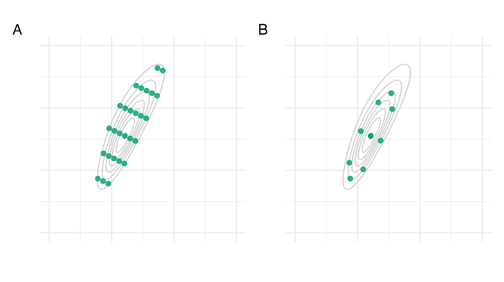
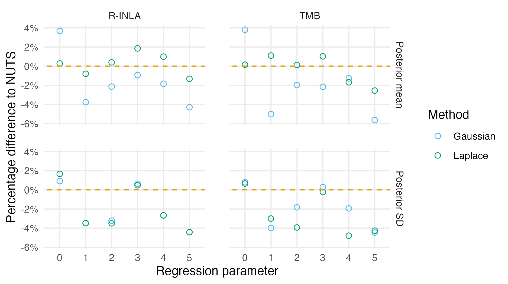
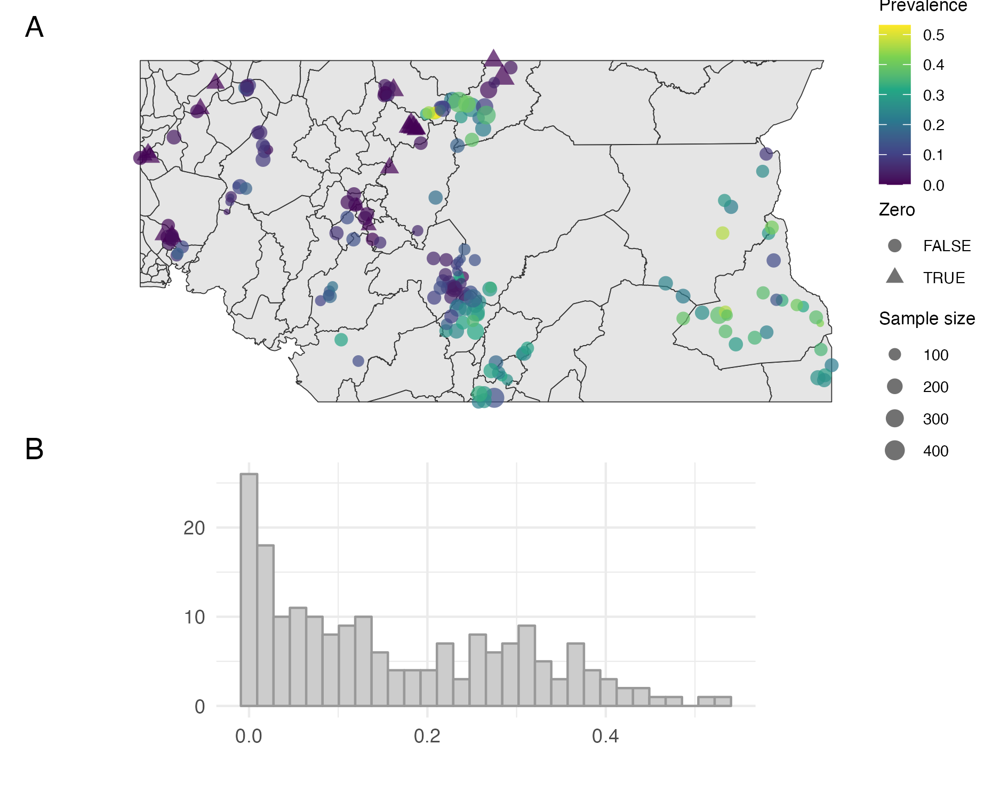
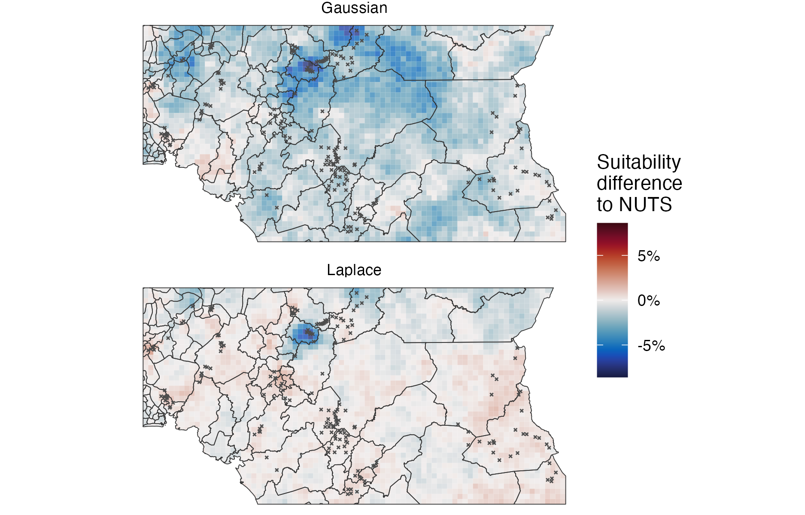
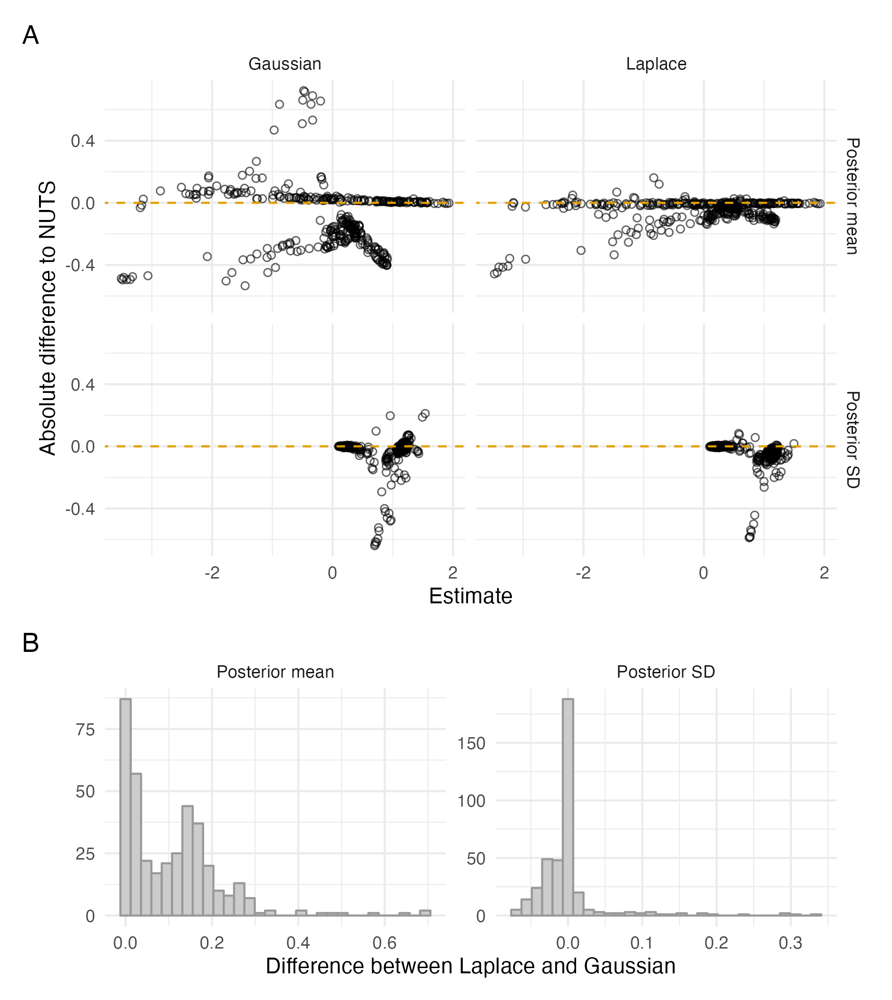
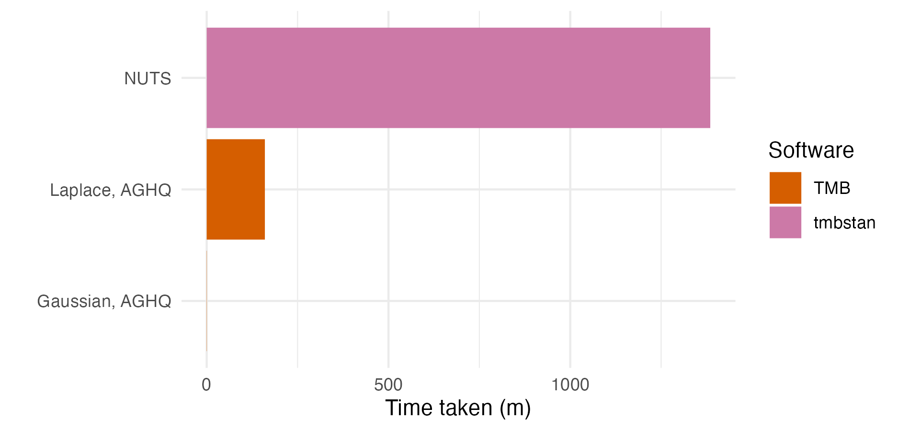

---
#########################################
# options for knitting a single chapter #
#########################################
output:
  bookdown::pdf_document2:
    template: templates/brief_template.tex
    citation_package: biblatex
  bookdown::html_document2: default
  bookdown::word_document2: default
documentclass: book
bibliography: references.bib
---

```{r}
resource_version <- list.files("resources/naomi-aghq")

custom_numbers_to_words <- function(number) {
  powers <- c(3, 6, 9, 12)
  
  if (number == 0) {
    return("0")
  }
  
  sign <- ifelse(number < 0, -1, 1)
  number <- abs(number)
  
  for (power in powers) {
    scaled_number <- number / 10^power
    if (scaled_number >= 1 && scaled_number < 1000) {
      suffix <- gsub("^one\\s", "", xfun::numbers_to_words(10^power))
      return(paste0(sign * scaled_number, " ", suffix))
    }
  }
  
  return("Number out of range.")
}
```

# Fast approximate Bayesian inference {#naomi-aghq}
\adjustmtc
\markboth{Fast approximate Bayesian inference}{}
<!-- For PDF output, include these two LaTeX commands after unnumbered chapter headings, otherwise the mini table of contents and the running header will show the previous chapter -->

This chapter describes the development of a novel deterministic Bayesian inference approach, motivated by the Naomi small-area estimation model [@eaton2021naomi].
Development of the approach required meeting both methodological challenges and implementation difficulties.
Over 35 countries [@unaids2023global] have used the Naomi model web interface ([`https://naomi.unaids.org`](https://naomi.unaids.org) to produce subnational estimates of HIV indicators.
Evidence is synthesised from household surveys and routinely collected health data to generate estimates of HIV indicators by district, age, and sex.
The complexity and size of the model makes obtaining fast and accurate Bayesian inferences challenging.

The methods developed in this chapter combine Laplace approximations with adaptive quadrature, and are descended from the integrated nested Laplace approximation (INLA) method pioneered by @rue2009approximate.
The INLA method has enabled fast and accurate Bayesian inferences for a vast array of models, across a large number of scientific fields [@rue2017bayesian].
The success of INLA is in large part due to its accessible implementation in the `R-INLA` software.
Use of the INLA method and the `R-INLA` software are nearly ubiquitous in applied settings.
However, the Naomi model is not compatible with `R-INLA`.
The foremost reason is that Naomi is too complex to be expressed using a formula interface (of the form `y ~ ...`).
Additionally, Naomi has more hyperparameters (moderate-dimensional, >20) than can typically be handled using INLA (low-dimensional, certainly below 10).
As a result, inferences for the Naomi model have previously been obtained using an empirical Bayes [EB; @casella1985introduction] approximation to full Bayesian inference, with Laplace approximation implemented by the more flexible Template Model Builder [`TMB`; @kristensen2016tmb] R package.
Under the EB approximation, the hyperparameters are fixed by optimising an approximation to the marginal posterior.
This is undesirable as fixing the hyperparameters underestimates their uncertainty.
Ultimately, the resulting overconfidence may lead to worse HIV prevention policy decisions.

Most methodological work relating to INLA has taken place using the `R-INLA` software package.
There are two notable exceptions.
First, the simplified INLA approach of @wood2020simplified, implemented in the `mgcv` R package, proposed a fast Laplace approximation approach which does not rely on Markov structure of the latent field in the same way as @rue2009approximate.
Second, @stringer2022fast extended the scope and scalability of INLA by avoiding augmenting the latent field with the noisy structured additive predictors.
This enables the application of INLA to a wider class of extended latent Gaussian models, which includes Naomi.
@van2023new refer to this as the "modern" formulation of the INLA method, as opposed to the "classic" formulation of @rue2009approximate, and it is now included in `R-INLA` using `inla.mode = "experimental"`.
@stringer2022fast also propose use of the adaptive Gauss-Hermite quadrature [AGHQ; @naylor1982applications] rule to perform integration with respect to the hyperparameters.
The methodological contributions of this chapter extend @stringer2022fast in two directions:

1. First, a universally applicable implementation of INLA with Laplace marginals, where automatic differentiation via `TMB` is used to obtain the derivatives required for the Laplace approximation.
Section \@ref(universal) demonstrates the implementation using two examples, one compatible with `R-INLA` and one incompatible.
2. Second, a quadrature rule which combines AGHQ with principal components analysis to enable integration over moderate-dimensional spaces, described in Section \@ref(pca-aghq).
This quadrature rule is used to perform inference for the Naomi model by integrating the marginal Laplace approximation with respect to the moderate-dimensional hyperparameters within an INLA algorithm implemented in `TMB` in Section \@ref(malawi).

This work was conducted in collaboration with Prof. Alex Stringer, whom I visited at the University of Waterloo during the fall term of 2022.
Code for the analysis in this chapter is available from [`https://github.com/athowes/naomi-aghq`](https://github.com/athowes/naomi-aghq).

## Inference methods and software {#naomi-inference}

This section reviews existing deterministic Bayesian inference methods (Sections \@ref(la), \@ref(quadrature), \@ref(inla)) and the software implementing them (Section \@ref(software)).
Inference comprises obtaining the posterior distribution
\begin{equation}
p(\boldsymbol{\mathbf{\phi}} \, | \, \mathbf{y}) = \frac{p(\boldsymbol{\mathbf{\phi}}, \mathbf{y})}{p(\mathbf{y})}, (\#eq:bayes)
\end{equation}
or some way to compute relevant functions of it.
The posterior distribution encapsulates beliefs about the parameters $\boldsymbol{\mathbf{\phi}} = (\phi_1, \ldots, \phi_d)$ having observed data $\mathbf{y} = (y_1, \ldots, y_n)$.
Here I assume these quantities are expressible as vectors.

Inference is a sensible goal because (under Bayesian decision theory) the posterior distribution is sufficient for use in decision making.
More specifically, given a loss function $l(a, \boldsymbol{\mathbf{\phi}})$, the expected posterior loss of a decision $a$ depends on the data only via the posterior distribution
\begin{equation}
\mathbb{E}(l(a, \boldsymbol{\mathbf{\phi}}) \, | \, \mathbf{y}) = \int_{\mathbb{R}^d} l(a, \boldsymbol{\mathbf{\phi}}) p(\boldsymbol{\mathbf{\phi}} \, | \, \mathbf{y}) \text{d}\boldsymbol{\mathbf{\phi}}.
\end{equation}
For example, historic data about treatment demand are only required for planning of HIV treatment service provision in so far as they alter the posterior distribution of current demand.
The information provided for strategic response to the HIV epidemic may therefore be thought of as functions of some posterior distribution.

It is usually intractable to obtain the posterior distribution.
This is because the denominator in Equation \@ref(eq:bayes) contains a potentially high-dimensional integral over the $d \in \mathbb{Z}^+$ -dimensional parameters
\begin{equation}
p(\mathbf{y}) = \int_{\mathbb{R}^d} p(\mathbf{y}, \boldsymbol{\mathbf{\phi}}) \text{d}\boldsymbol{\mathbf{\phi}}. (\#eq:evidence2)
\end{equation}
This quantity is sometimes called the evidence or posterior normalising constant.
As a result, approximations to the posterior distribution $\tilde p(\boldsymbol{\mathbf{\phi}} \, | \, \mathbf{y})$ are typically used in place of the exact posterior distribution.

Some approximate Bayesian inference methods, like Markov chain Monte Carlo (MCMC), avoid directly calculating the posterior normalising constant.
Instead they find ways to work with the unnormalised posterior distribution
\begin{equation}
p(\boldsymbol{\mathbf{\phi}} \, | \, \mathbf{y}) \propto p(\boldsymbol{\mathbf{\phi}}, \mathbf{y}),
\end{equation}
where $p(\mathbf{y})$ is not a function of $\boldsymbol{\mathbf{\phi}}$ and so can be removed as a constant.
Other approximate Bayesian inference methods can more directly be thought of as ways to estimate the posterior normalising constant (Equation \@ref(eq:evidence2)).
The methods in this chapter fall into this latter category, and are sometimes described as deterministic Bayesian inference methods because they do not make fundamental use of randomness.

### The Laplace approximation {#la}

Laplace's method [@laplace1774memoire] is a technique used to approximate integrals of the form
\begin{equation}
\int \exp(C h(\mathbf{z})) \text{d}\mathbf{z},
\end{equation}
where $C > 0$ is a constant, $h$ is a function which is twice-differentiable, and $\mathbf{z}$ are generic variables.
The Laplace approximation [@tierney1986accurate] is obtained by application of Laplace's method to calculate the posterior normalising constant (Equation \@ref(eq:evidence2)).
Let $h(\boldsymbol{\mathbf{\phi}}) = \log p(\boldsymbol{\mathbf{\phi}}, \mathbf{y})$ such that
\begin{equation}
p(\mathbf{y}) = \int_{\mathbb{R}^d} p(\mathbf{y}, \boldsymbol{\mathbf{\phi}}) \text{d}\boldsymbol{\mathbf{\phi}} = \int_{\mathbb{R}^d} \exp(h(\boldsymbol{\mathbf{\phi}})) \text{d}\boldsymbol{\mathbf{\phi}}.
\end{equation}
Laplace's method involves approximating the function $h$ by its second order Taylor expansion.
This expansion is then evaluated at a maxima of $h$ to eliminate the first order term.
Let
\begin{equation}
\hat{\boldsymbol{\mathbf{\phi}}} = \arg\max_{\boldsymbol{\mathbf{\phi}}} h(\boldsymbol{\mathbf{\phi}}) (\#eq:posterior-mode)
\end{equation}
be the posterior mode, and
\begin{equation}
\hat {\mathbf{H}} = - \frac{\partial^2}{\partial \boldsymbol{\mathbf{\phi}} \partial \boldsymbol{\mathbf{\phi}}^\top} h(\boldsymbol{\mathbf{\phi}}) \rvert_{\boldsymbol{\mathbf{\phi}} = \hat{\boldsymbol{\mathbf{\phi}}}} (\#eq:hessian)
\end{equation}
be the Hessian matrix evaluated at the posterior mode.
The Laplace approximation to the posterior normalising constant (Equation \@ref(eq:evidence2)) is then
\begin{align}
\tilde p_{\texttt{LA}}(\mathbf{y}) &= \int_{\mathbb{R}^d} \exp \left( h(\hat{\boldsymbol{\mathbf{\phi}}}) - \frac{1}{2} (\boldsymbol{\mathbf{\phi}} - \hat{\boldsymbol{\mathbf{\phi}}})^\top \hat {\mathbf{H}} (\boldsymbol{\mathbf{\phi}} - \hat{\boldsymbol{\mathbf{\phi}}}) \right) \text{d}\boldsymbol{\mathbf{\phi}} (\#eq:la) \\
&= p(\hat{\boldsymbol{\mathbf{\phi}}}, \mathbf{y}) \cdot \frac{(2 \pi)^{d/2}}{| \hat {\mathbf{H}} |^{1/2}}. (\#eq:la2)
\end{align}
The result above is calculated using the known normalising constant of the Gaussian distribution
\begin{equation}
p_\texttt{G}(\boldsymbol{\mathbf{\phi}} \, | \, \mathbf{y}) = \mathcal{N}(\boldsymbol{\mathbf{\phi}} \, | \, \hat{\boldsymbol{\mathbf{\phi}}}, \hat {\mathbf{H}}^{-1}) = \frac{| \hat {\mathbf{H}} |^{1/2}}{(2 \pi)^{d/2}} \exp \left( - \frac{1}{2} (\boldsymbol{\mathbf{\phi}} - \hat{\boldsymbol{\mathbf{\phi}}})^\top \hat {\mathbf{H}} (\boldsymbol{\mathbf{\phi}} - \hat{\boldsymbol{\mathbf{\phi}}}) \right).
\end{equation}
The Laplace approximation may be thought of as approximating the posterior distribution by a Gaussian distribution $p(\boldsymbol{\mathbf{\phi}} \, | \, \mathbf{y}) \approx p_\texttt{G}(\boldsymbol{\mathbf{\phi}} \, | \, \mathbf{y})$ such that
\begin{equation}
\tilde p_{\texttt{LA}}(\mathbf{y}) = \frac{p(\boldsymbol{\mathbf{\phi}}, \mathbf{y})}{p_\texttt{G}(\boldsymbol{\mathbf{\phi}} \, | \, \mathbf{y})} \Big\rvert_{\boldsymbol{\mathbf{\phi}} = \hat{\boldsymbol{\mathbf{\phi}}}}.
\end{equation}

Calculation of the Laplace approximation requires obtaining the second derivative of $h$ with respect to $\boldsymbol{\mathbf{\phi}}$ (Equation \@ref(eq:hessian)).
Derivatives may also be used to improve the performance of the optimisation algorithm used to obtain the maxima of $h$ (Equation \@ref(eq:posterior-mode)) by providing access to the gradient of $h$ with respect to $\boldsymbol{\mathbf{\phi}}$.

(ref:laplace) Demonstration of the Laplace approximation for the simple Bayesian inference example of Figure \@ref(fig:conjugate). The unnormalised posterior is $p(\phi, \mathbf{y}) = \phi^8 \exp(-4 \phi)$, and can be recognised as the unnormalised gamma distribution $\text{Gamma}(9, 4)$. The true log normalising constant is $\log p(\mathbf{y}) = \log\Gamma(9) - 9 \log(4) = -1.872046$, whereas the Laplace approximate log normalising constant is $\log \tilde p_{\texttt{LA}}(\mathbf{y}) = -1.882458$, resulting from the Gaussian approximation $p_\texttt{G}(\phi \, | \, \mathbf{y}) = \mathcal{N}(\phi \, | \,\mu = 2, \tau = 2)$.

```{r laplace, fig.cap="(ref:laplace)"}
knitr::include_graphics("figures/naomi-aghq/laplace.png")
```

#### The marginal Laplace approximation {#marginal-la}

Approximating the full joint posterior distribution using a Gaussian distribution may be inaccurate.
An alternative is to approximate the marginal posterior distribution of some subset of the parameters, referred to as the marginal Laplace approximation.
It remains to integrate out the remaining parameters, using another more suitable method.
This approach is the basis of the INLA method.

Let $\boldsymbol{\mathbf{\phi}} = (\mathbf{x}, \boldsymbol{\mathbf{\theta}})$ and consider a three-stage hierarchical model
\begin{equation}
p(\mathbf{y}, \mathbf{x}, \boldsymbol{\mathbf{\theta}}) = p(\mathbf{y} \, | \, \mathbf{x}, \boldsymbol{\mathbf{\theta}}) p(\mathbf{x} \, | \, \boldsymbol{\mathbf{\theta}}) p(\boldsymbol{\mathbf{\theta}}),
\end{equation}
where $\mathbf{x} = (x_1, \ldots, x_N)$ is the latent field, and $\boldsymbol{\mathbf{\theta}} = (\theta_1, \ldots, \theta_m)$ are the hyperparameters.
Applying a Gaussian approximation to the latent field, we have $h(\mathbf{x}, \boldsymbol{\mathbf{\theta}}) = \log p(\mathbf{y}, \mathbf{x}, \boldsymbol{\mathbf{\theta}})$ with $N$-dimensional posterior mode
\begin{equation}
\hat{\mathbf{x}}(\boldsymbol{\mathbf{\theta}}) = \arg\max_{\mathbf{x}} h(\mathbf{x}, \boldsymbol{\mathbf{\theta}}) (\#eq:marginal-posterior-mode)
\end{equation}
and $(N \times N)$-dimensional Hessian matrix evaluated at the posterior mode
\begin{equation}
\hat {\mathbf{H}}(\boldsymbol{\mathbf{\theta}}) = - \frac{\partial^2}{\partial \mathbf{x} \partial \mathbf{x}^\top} h(\mathbf{x}, \boldsymbol{\mathbf{\theta}}) \rvert_{\mathbf{x} = \hat{\mathbf{x}}(\boldsymbol{\mathbf{\theta}})}. (\#eq:marginal-hessian)
\end{equation}
Dependence on the hyperparameters $\boldsymbol{\mathbf{\theta}}$ is made explicit in both Equation \@ref(eq:marginal-posterior-mode) and \@ref(eq:marginal-hessian) such that there is a Gaussian approximation to the marginal posterior of the latent field $\tilde p_\texttt{G}(\mathbf{x} \, | \, \boldsymbol{\mathbf{\theta}}, \mathbf{y}) = \mathcal{N}(\mathbf{x} \, | \, \hat{\mathbf{x}}(\boldsymbol{\mathbf{\theta}}), \hat{\mathbf{H}}(\boldsymbol{\mathbf{\theta}})^{-1})$ at each value $\boldsymbol{\mathbf{\theta}}$ in the space $\mathbb{R}^m$.
The resulting marginal Laplace approximation, for a particular value of the hyperparameters, is then
\begin{align}
\tilde p_{\texttt{LA}}(\boldsymbol{\mathbf{\theta}}, \mathbf{y}) &= \int_{\mathbb{R}^N} \exp \left( h(\hat{\mathbf{x}}(\boldsymbol{\mathbf{\theta}}), \boldsymbol{\mathbf{\theta}}) - \frac{1}{2} (\mathbf{x} - \hat{\mathbf{x}}(\boldsymbol{\mathbf{\theta}}))^\top \hat {\mathbf{H}}(\boldsymbol{\mathbf{\theta}}) (\mathbf{x} - \hat{\mathbf{x}}(\boldsymbol{\mathbf{\theta}})) \right) \text{d}\mathbf{x} (\#eq:marginalla) \\
&= \exp(h(\hat{\mathbf{x}}(\boldsymbol{\mathbf{\theta}}), \mathbf{y})) \cdot \frac{(2 \pi)^{d/2}}{| \hat {\mathbf{H}}(\boldsymbol{\mathbf{\theta}}) |^{1/2}} \\
&= \frac{p(\mathbf{y}, \mathbf{x}, \boldsymbol{\mathbf{\theta}})}{\tilde p_\texttt{G}(\mathbf{x} \, | \, \boldsymbol{\mathbf{\theta}}, \mathbf{y})} \Big\rvert_{\mathbf{x} = \hat{\mathbf{x}}(\boldsymbol{\mathbf{\theta}})}.
\end{align}

The marginal Laplace approximation is most accurate when the marginal posterior $p(\mathbf{x} \, | \, \boldsymbol{\mathbf{\theta}}, \mathbf{y})$ is accurately approximated by a Gaussian 
distribution.
For the class of latent Gaussian models [@rue2009approximate] the prior distribution on the latent field is Gaussian
\begin{equation}
\mathbf{x} \sim \mathcal{N}(\mathbf{x} \, | \, \boldsymbol{\mathbf{\theta}}) = \mathcal{N}(\mathbf{x} \, | \, \mathbf{0}, \mathbf{Q}(\boldsymbol{\mathbf{\theta}})),
\end{equation}
with assumed zero mean $\mathbf{0}$, and precision matrix $\mathbf{Q}(\boldsymbol{\mathbf{\theta}})$.
The resulting marginal posterior distribution
\begin{align}
p(\mathbf{x} \, | \, \boldsymbol{\mathbf{\theta}}, \mathbf{y}) &\propto \mathcal{N}(\mathbf{x} \, | \, \boldsymbol{\mathbf{\theta}}) p(\mathbf{y}  \, | \, \mathbf{x}, \boldsymbol{\mathbf{\theta}}) \\
&\propto \exp \left( - \frac{1}{2} \mathbf{x}^\top \mathbf{Q}(\boldsymbol{\mathbf{\theta}}) \mathbf{x} + \log p(\mathbf{y} \, | \, \mathbf{x}, \boldsymbol{\mathbf{\theta}}) \right)
\end{align}
is not exactly Gaussian.
However, its deviation can be expected to be small if $\log p(\mathbf{y} \, | \, \mathbf{x}, \boldsymbol{\mathbf{\theta}})$ is small.

### Quadrature {#quadrature}

Quadrature is a method used to approximate integrals using a weighted sum of function evaluations.
As with the Laplace approximation, it is deterministic in that the computational procedure is not intrinsically random.
Let $\mathcal{Q}$ be a set of quadrature nodes $\mathbf{z} \in \mathcal{Q}$ and $\omega: \mathbb{R}^d \to \mathbb{R}$ be a weighting function.
Then, quadrature can be used to estimate the posterior normalising constant (Equation \@ref(eq:evidence2)) by
\begin{equation}
\tilde p_{\mathcal{Q}}(\mathbf{y}) = \sum_{\mathbf{z} \in \mathcal{Q}} p(\mathbf{y}, \mathbf{z}) \omega(\mathbf{z}).
\end{equation}

To illustrate quadrature for a simple example, consider integrating the univariate function $f(z) = z \sin(z)$ between $z = 0$ and $z = \pi$.
This integral can be calculated analytically using integration by parts and evaluates to $\pi$.
A quadrature approximation of this integral is
\begin{equation}
\pi = \sin(z) - z \cos(z) \bigg|_0^\pi = \int_{0}^\pi z \sin(z) \text{d} z \approx \sum_{z \in \mathcal{Q}} z \sin(z) \omega(z), (\#eq:zsinz)
\end{equation}
where $\mathcal{Q} = \{z_1, \ldots z_k\}$ are a set of $k$ quadrature nodes and $\omega: \mathbb{R} \to \mathbb{R}$ is a weighting function.

The trapezoid rule is an example of a quadrature rule, in which quadrature nodes are spaced throughout the domain with $\epsilon_i = z_i - z_{i - 1} > 0$ for $1 < i < k$.
The weighting function is
\begin{equation}
\omega(z_i) = 
\begin{cases}
  \epsilon_i & 1 < i < k, \\
  \epsilon_i / 2 & i \in \{1, k\}.
\end{cases}
\end{equation}
Figure \@ref(fig:trapezoid) shows application of the trapezoid rule to integration of $z \sin(z)$ as described in Equation \@ref(eq:zsinz).
The more quadrature nodes are used, the more accurate the estimate of the integrand is.
Under some regularity conditions on $f$, as the spacing between quadrature nodes $\epsilon \to 0$ the estimate obtained using the trapezoid rule converges to the true value of the integral.
Indeed, this approach was used by Riemann to provide the first rigorous definition of the integral.

(ref:trapezoid) The trapezoid rule with $k = 5, 10, 20$ equally-spaced ($\epsilon_i = \epsilon > 0$) quadrature nodes can be used to integrate the function $f(z) = z \sin(z)$, shown in green, in the domain $[0, \pi]$. Here, the exact solution is $\pi \approx 3.1416$. As $k$ increases and more nodes are used in the computation, the quadrature estimate becomes closer to the exact solution. The trapezoid rule estimate is given by the sum of the areas of the grey trapezoids.

```{r trapezoid, fig.cap="(ref:trapezoid)"}
knitr::include_graphics("figures/naomi-aghq/trapezoid.png")
```

Quadrature methods are most effective when integrating over small dimensions, say three or less.
This is because the number of quadrature nodes at which the function is required to be evaluated in the computation grows exponentially with the dimension.
For even moderate dimension, this quickly makes computation intractable.
For example, using 5, 10, or 20 quadrature nodes per dimension, as in Figure \@ref(fig:trapezoid), in five-dimensions (rather than one, as shown) would require 3125, 100000 or 3200000 quadrature nodes respectively.
Though quadrature is embarrassingly parallel, in that function evaluation at each node is entirely independent, solutions requiring the evaluation of millions quadrature nodes are unlikely to be tractable.

#### Gauss-Hermite quadrature

It is possible to construct quadrature rules which use relatively few nodes and are highly accurate when the integrand adheres to certain assumptions [Chapter 4; @press2007numerical].
Gauss-Hermite quadrature [GHQ; @davis1975methods] is a quadrature rule designed to integrate functions of the form $f(\mathbf{z}) = \varphi(\mathbf{z}) P_\alpha(\mathbf{z})$ exactly, that is with no error, such that
\begin{equation}
\int \varphi(\mathbf{z}) P_\alpha(\mathbf{z}) \text{d} \mathbf{z} = \sum_{\mathbf{z} \in \mathcal{Q}}  \varphi(\mathbf{z}) P_\alpha(\mathbf{z}) \omega(\mathbf{z}). (\#eq:ghqexact)
\end{equation}
In this equation, the term $\varphi(\cdot)$ is a standard multivariate normal density $\mathcal{N}(\cdot \, | \, \mathbf{0}, \mathbf{I})$, where $\mathbf{0}$ and $\mathbf{I}$ are the zero-vector and identify matrix of relevant dimension, and the term $P_\alpha(\cdot)$ is a polynomial with highest degree monomial $\alpha \leq 2k - 1$, where $k$ is the number of quadrature nodes per dimension.
GHQ is attractive for Bayesian inference problems because posterior distributions are typically well approximated by functions of this form.
Support for this statement is provided by the Bernstein–von Mises theorem, which states that, under some regularity conditions, as the number of data points increases the posterior distribution convergences to a Gaussian.

I follow the notation for GHQ established by @bilodeau2022stochastic.
First, to construct the univariate GHQ rule for $z \in \mathbb{R}$, let $H_k(z)$ be the $k$th (probabilist's) Hermite polynomial
\begin{equation}
H_k(z) = (-1)^k \exp(z^2 / 2) \frac{\text{d}}{\text{d}z^k} \exp(-z^2 / 2)
\end{equation}
The Hermite polynomials are defined to be orthogonal with respect to the standard Gaussian probability density function
\begin{equation}
\int H_k(z) H_l(z) \varphi(z) \text{d} z = \delta_{kl},
\end{equation}
where $\delta_{kl} = 1$ if $k = l$ and $\delta_{kl} = 0$ otherwise.
<!-- The relevance of the above equation is that... -->
The GHQ nodes $z \in \mathcal{Q}(1, k)$ are given by the $k$ zeroes of the $k$th Hermite polynomial.
For $k = 1, 2, 3$ these zeros, up to three decimal places, are
\begin{align}
H_1(z) = z = 0 \implies \mathcal{Q}(1, 1) &= \{0\}, \\
H_2(z) = z^2 - 1 = 0 \implies \mathcal{Q}(1, 2) &= \{-0.707, 0.707\}, \\
H_3(z) = z^3 - 3z = 0 \implies \mathcal{Q}(1, 3) &= \{-1.225, 0, 1.225\}.
\end{align}
The quadrature nodes are symmetric about zero, and include zero when $k$ is odd.
The corresponding weighting function $\omega: \mathcal{Q}(1, k) \to \mathbb{R}$ chosen to satisfy Equation \@ref(eq:ghqexact) is given by
\begin{equation}
\omega(z) = \frac{k!}{\varphi(z) [H_{k + 1}(z)]^2}.
\end{equation}

Multivariate GHQ rules are usually constructed using the product rule with identical univariate GHQ rules in each dimension.
As such, in $d$ dimensions, the multivariate GHQ nodes $\mathbf{z} \in \mathcal{Q}(d, k)$ are defined by
\begin{equation}
\mathcal{Q}(d, k) = \mathcal{Q}(1, k)^d = \mathcal{Q}(1, k) \times \cdots \times \mathcal{Q}(1, k).
\end{equation}
The corresponding weighting function $\omega: \mathcal{Q}(d, k) \to \mathbb{R}$ is given by a product of the univariate weighting functions $\omega(\mathbf{z}) = \prod_{j = 1}^d \omega(z_j)$.

#### Adaptive quadrature

In adaptive quadrature, the quadrature nodes and weights selected depend on the specific integrand being considered.
For example, adaptive use of the trapezoid rule requires specifying a rule for the start point, end point, and spacing between quadrature nodes.
It is particularly important to use an adaptive quadrature rule for Bayesian inference problems because the posterior normalising constant $p(\mathbf{y})$ is a function of the data.
No fixed quadrature rule can be expected to effectively integrate all possible posterior distributions.

In adaptive GHQ [AGHQ; @naylor1982applications] the quadrature nodes are shifted by the mode of the integrand, and rotated based on a matrix decomposition of the inverse curvature at the mode.
To demonstrate AGHQ, consider its application to calculation of the posterior normalising constant.
The relevant transformation of the GHQ nodes $\mathcal{Q}(d, k)$ is
\begin{equation}
\boldsymbol{\mathbf{\phi}}(\mathbf{z}) = \hat{\mathbf{P}} \mathbf{z} + \hat{\boldsymbol{\mathbf{\phi}}},
\end{equation}
where $\hat{\mathbf{P}}$ is a matrix decomposition of $\hat{\boldsymbol{\mathbf{H}}}^{-1} = \hat{\mathbf{P}} \hat{\mathbf{P}}^\top$.
To account for the transformation, the weighting function may be redefined to include a matrix determinant, analogous to the Jacobian determinant, or more simply the matrix determinant may be written outside the integral.
Taking the later approach, the resulting adaptive quadrature estimate of the posterior normalising constant is
\begin{align}
\tilde p_{\texttt{AQ}}(\mathbf{y})
&= | \hat{\mathbf{P}} | \sum_{\mathbf{z} \in \mathcal{Q}(d, k)} p(\mathbf{y}, \boldsymbol{\mathbf{\phi}}(\mathbf{z})) \omega(\mathbf{z}) \\
&=  | \hat{\mathbf{P}} | \sum_{\mathbf{z} \in \mathcal{Q}(d, k)} p(\mathbf{y}, \hat{\mathbf{P}} \mathbf{z} + \hat{\boldsymbol{\mathbf{\phi}}}) \omega(\mathbf{z}).
\end{align}

The quantities $\hat{\boldsymbol{\mathbf{\phi}}}$ and $\hat{\boldsymbol{\mathbf{H}}}$ are exactly those given in Equations \@ref(eq:posterior-mode) and \@ref(eq:hessian) and used in the Laplace approximation.
Indeed, when $k = 1$ then AGHQ corresponds to the Laplace approximation.
To see this, we have $H_1(z)$ with univariate zero $z = 0$ such that the adapted node is given by the mode $\boldsymbol{\mathbf{\phi}}(\mathbf{z} = \mathbf{0} = 0 \times \cdots \times 0) = \hat{\boldsymbol{\mathbf{\phi}}}$.
The weighting function is given by 
\begin{equation}
\omega(0)^d = \left( \frac{1!}{\varphi(0) H_{2}(0)^2} \right)^d = \left( \frac{1}{\varphi(0)} \right)^d = \left(2 \pi\right)^{d / 2}.
\end{equation}
The AGHQ estimate of the normalising constant for $k = 1$ is then given by
\begin{equation}
\tilde p_{\texttt{AQ}}(\mathbf{y}) = p(\mathbf{y}, \hat{\boldsymbol{\mathbf{\phi}}}) \cdot | \hat{\mathbf{P}} | \cdot (2 \pi)^{d / 2} = p(\mathbf{y}, \hat{\boldsymbol{\mathbf{\phi}}}) \cdot \frac{(2 \pi)^{d / 2}}{| \hat{\mathbf{H}} | ^{1/2}},
\end{equation}
which corresponds to the Laplace approximation $\tilde p_{\texttt{LA}}(\mathbf{y})$ given in Equation \@ref(eq:la2).
This connection supports AGHQ being a natural extension of the Laplace approximation when greater accuracy than $k = 1$ is required.

(ref:aghq-demo) The Gauss-Hermite quadrature nodes $\mathbf{z} \in \mathcal{Q}(2, 3)$ for a two-dimensional integral with three nodes per dimension (Panel A). Adaption occurs based on the mode (Panel B) and covariance of the integrand via either the Cholesky (Panel C) or spectral (Panel D) decomposition of the inverse curvature at the mode. Here, the integrand is $f(z_1, z_2) = \text{sn}(0.5 z_1, \alpha = 2) \cdot \text{sn}(0.8 z_1 - 0.5 z_2, \alpha = -2)$, where $\text{sn}(\cdot)$ is the standard skewnormal probability density function with shape parameter $\alpha \in \mathbb{R}$.

```{r aghq-demo, fig.cap="(ref:aghq-demo)"}
knitr::include_graphics("figures/naomi-aghq/aghq-demo.png")
# The integral approximation $I \approx \int \int f(z_1, z_2) \text{d} z_1 \text{d} z_2$ obtained by the quadrature rule in each panel are given.
```

Two alternatives for the matrix decomposition $\hat{\boldsymbol{\mathbf{H}}}^{-1} = \hat{\mathbf{P}} \hat{\mathbf{P}}^\top$ are the Cholesky and spectral decomposition [@jackel2005note].
For the Cholesky decomposition $\hat{\mathbf{P}} = \hat{\mathbf{L}}$, where
\begin{equation}
\hat{\mathbf{L}} =
\begin{pmatrix}
L_{11} & 0 & \cdots & 0 \\
\hat{L}_{12} & \hat{L}_{22} & \ddots & \vdots \\
\vdots & \ddots& \ddots& 0 \\
\hat{L}_{1d} & \ldots& \hat{L}_{(d-1)d} & \hat{L}_{dd}\\
\end{pmatrix}
\end{equation}
is a lower triangular matrix.
For the spectral decomposition $\hat{\mathbf{P}} = \hat{\mathbf{E}} \hat{\mathbf{\Lambda}}^{1/2}$, where $\hat{\mathbf{E}} = (\hat{\mathbf{e}}_{1}, \ldots \hat{\mathbf{e}}_{d})$ contains the eigenvectors of $\hat{\mathbf{H}}^{-1}$ and $\hat{\mathbf{\Lambda}}$ is a diagonal matrix containing its eigenvalues $(\hat \lambda_{1}, \ldots, \hat \lambda_{d})$.
Figure \@ref(fig:aghq-demo) demonstrates GHQ and AGHQ for a two-dimensional example, using both decomposition approaches.
Using the Cholesky decomposition results in adapted quadrature nodes which collapse along one of the dimensions, as a result of the matrix $\hat{\mathbf{L}}$ being lower triangular.
On the other hand, using the spectral decomposition results in adapted quadrature nodes which lie along the orthogonal eigenvectors of $\hat{\mathbf{H}}^{-1}$.

Using AGHQ, @bilodeau2022stochastic provide the first stochastic convergence rate for adaptive quadrature applied to Bayesian inference.

### Integrated nested Laplace approximation {#inla}

The integrated nested Laplace approximation (INLA) method [@rue2009approximate] combines marginal Laplace approximations with quadrature to enable approximation of posterior marginal distributions.

Consider the marginal Laplace approximation (Section \@ref(marginal-la)) for a three-stage hierarchical model given by
\begin{equation}
\tilde p_{\texttt{LA}}(\boldsymbol{\mathbf{\theta}}, \mathbf{y}) = \frac{p(\mathbf{y}, \mathbf{x}, \boldsymbol{\mathbf{\theta}})}{\tilde p_\texttt{G}(\mathbf{x} \, | \, \boldsymbol{\mathbf{\theta}}, \mathbf{y})} \Big\rvert_{\mathbf{x} = \hat{\mathbf{x}}(\boldsymbol{\mathbf{\theta}})}.
\end{equation}
To complete approximation of the posterior normalising constant, the marginal Laplace approximation can be integrated over the hyperparameters using a quadrature rule (Section \@ref(quadrature))
\begin{equation}
\tilde p(\mathbf{y}) = \sum_{\mathbf{z} \in \mathcal{Q}} \tilde p_\texttt{LA}(\mathbf{z}, \mathbf{y}) \omega(\mathbf{z}). (\#eq:inlanormconst)
\end{equation}
Though any choice of quadrature rule is possible, following @stringer2022fast here I consider use of AGHQ.
Let $\mathbf{z} \in \mathcal{Q}(m, k)$ be the $m$-dimensional GHQ nodes constructed using the product rule with $k$ nodes per dimension, and $\omega: \mathbb{R}^m \to \mathbb{R}$ the corresponding weighting function.
These nodes are adapted by $\boldsymbol{\mathbf{\theta}}(\mathbf{z}) = \hat{\mathbf{P}}_\texttt{LA} \mathbf{z} + \hat{\boldsymbol{\mathbf{\theta}}}_\texttt{LA}$ where
\begin{align}
\hat{\boldsymbol{\mathbf{\theta}}}_\texttt{LA} &= \arg\max_{\boldsymbol{\mathbf{\theta}}} \log \tilde p_{\texttt{LA}}(\boldsymbol{\mathbf{\theta}}, \mathbf{y}), \\
\hat{\boldsymbol{\mathbf{H}}}_\texttt{LA} &= - \frac{\partial^2}{\partial \boldsymbol{\mathbf{\theta}} \partial \boldsymbol{\mathbf{\theta}}^\top} \log \tilde p_{\texttt{LA}}(\boldsymbol{\mathbf{\theta}}, \mathbf{y}) \rvert_{\boldsymbol{\mathbf{\theta}} = \hat{\boldsymbol{\mathbf{\theta}}}_\texttt{LA}}, \\
\hat{\boldsymbol{\mathbf{H}}}_\texttt{LA}^{-1} &= \hat{\mathbf{P}}_\texttt{LA} \hat{\mathbf{P}}_\texttt{LA}^\top.
\end{align}
The nested AGHQ estimate of the posterior normalising constant is then
\begin{equation}
\tilde p_{\texttt{AQ}}(\mathbf{y}) = | \hat{\mathbf{P}}_\texttt{LA} | \sum_{\mathbf{z} \in \mathcal{Q}(m, k)} \tilde p_\texttt{LA}(\boldsymbol{\mathbf{\theta}}(\mathbf{z}), \mathbf{y}) \omega(\mathbf{z}). (\#eq:aghqnormconst)
\end{equation}
This estimate can be used to normalise the marginal Laplace approximation as follows
\begin{equation}
\tilde p_{\texttt{LA}}(\boldsymbol{\mathbf{\theta}} \, | \, \mathbf{y}) = \frac{\tilde p_{\texttt{LA}}(\boldsymbol{\mathbf{\theta}}, \mathbf{y})}{\tilde p_{\texttt{AQ}}(\mathbf{y})}.
\end{equation}

The posterior marginals $\tilde p(\theta_j \, | \, \mathbf{y})$ may be obtained by
\begin{align}
\tilde p(\theta_j \, | \, \mathbf{y}) = \int \tilde p(\theta_j \, | \, \mathbf{y}) \text{d} \boldsymbol{\mathbf{\theta}}_{-j}.
\end{align}
These integrals may be computed by reusing the AGHQ rule.
More recent methods are discussed in Section 3.2 of @martins2013bayesian.

Multiple methods have been proposed for obtaining the $\tilde p(\mathbf{x} \, | \, \mathbf{y})$ or individual marginals $\tilde p(x_i \, | \, \mathbf{y})$
Four methods are presented below, trading-off accuracy with computational expense.

#### Gaussian marginals {#gaussian-marginals}

Most easily, inferences for the latent field can be obtained by approximation of $p(\mathbf{x} \, | \, \mathbf{y})$ using another application of the quadrature rule [@rue2007approximate]
\begin{align}
p(\mathbf{x} \, | \, \mathbf{y}) &= \int p(\mathbf{x}, \boldsymbol{\mathbf{\theta}} \, | \, \mathbf{y}) \text{d} \boldsymbol{\mathbf{\theta}} = \int p(\mathbf{x} \, | \, \boldsymbol{\mathbf{\theta}}, \mathbf{y}) p(\boldsymbol{\mathbf{\theta}} \, | \, \mathbf{y}) \text{d} \boldsymbol{\mathbf{\theta}} \\
&\approx |\hat{\mathbf{P}}_\texttt{LA}| \sum_{\mathbf{z} \in \mathcal{Q}(m, k)} \tilde p_\texttt{G}(\mathbf{x} \, | \, \boldsymbol{\mathbf{\theta}}(\mathbf{z}), \mathbf{y}) \tilde p_\texttt{LA}(\boldsymbol{\mathbf{\theta}}(\mathbf{z}) \, | \, \mathbf{y}) \omega(\mathbf{z}). (\#eq:mixgaussian)
\end{align}
The quadrature rule $\mathbf{z} \in \mathcal{Q}(m, k)$ is used both internally to normalise the marginal Laplace approximation, and externally to perform integration with respect to the hyperparameters.
Equation \@ref(eq:mixgaussian) is a mixture of Gaussian distributions
\begin{equation}
p_\texttt{G}(\mathbf{x} \, | \, \boldsymbol{\mathbf{\theta}}(\mathbf{z}), \mathbf{y}), (\#eq:mixgaussian-individual)
\end{equation}
each with multinomial probabilities 
\begin{equation}
\lambda(\mathbf{z}) = |\hat{\mathbf{P}}_\texttt{LA}| \tilde p_\texttt{LA}(\boldsymbol{\mathbf{\theta}}(\mathbf{z}) \, | \, \mathbf{y}) \omega(\mathbf{z}),
\end{equation}
where $\sum \lambda(\mathbf{z}) = 1$ and $\lambda(\mathbf{z}) > 0$.
Samples may therefore be naturally obtained for the complete vector $\mathbf{x}$ jointly by first drawing a node $\mathbf{z} \in \mathcal{Q}(m, k)$ with multinomial probabilities $\lambda(\mathbf{z})$ then drawing a sample from the corresponding Gaussian distribution in Equation \@ref(eq:mixgaussian-individual).
Algorithms for fast and exact simulation from a Gaussian distribution have been developed, including by @rue2001fast.
The posterior marginals for any subset of the complete vector can simply be obtained by keeping the relevant entries of $\mathbf{x}$.

#### Laplace marginals {#laplace-marginals}

An alternative higher accuracy, but more computationally expensive, approach is to calculate a Laplace approximation to the marginal posterior
\begin{equation}
\tilde p_\texttt{LA}(x_i, \boldsymbol{\mathbf{\theta}}, \mathbf{y}) = \frac{p(x_i, \mathbf{x}_{-i}, \boldsymbol{\mathbf{\theta}}, \mathbf{y})}{\tilde p_\texttt{G}(\mathbf{x}_{-i} \, | \, x_i, \boldsymbol{\mathbf{\theta}}, \mathbf{y})} \Big\rvert_{\mathbf{x}_{-i} = \hat{\mathbf{x}}_{-i}(x_i, \boldsymbol{\mathbf{\theta}})}. (\#eq:lamarginaljoint)
\end{equation}
Here, the variable $x_i$ is excluded from the Gaussian approximation such that
\begin{equation}
p_\texttt{G}(\mathbf{x}_{-i} \, | \, x_i, \boldsymbol{\mathbf{\theta}}, \mathbf{y}) = \mathcal{N}(\mathbf{x}_{-i} \, | \, \hat{\mathbf{x}}_{-i}(x_i, \boldsymbol{\mathbf{\theta}}), \hat{\mathbf{H}}_{-i, -i}(x_i, \boldsymbol{\mathbf{\theta}})),
\end{equation}
with $(N - 1)$-dimensional posterior mode
\begin{equation}
\hat{\mathbf{x}}_{-i}(x_i, \boldsymbol{\mathbf{\theta}}) = \arg\max_{\mathbf{x}_{-i}} \log p(\mathbf{y}, x_i, \mathbf{x}_{-i}, \boldsymbol{\mathbf{\theta}}),
\end{equation}
and $[(N - 1) \times (N - 1)]$-dimensional Hessian matrix evaluated at the posterior mode
\begin{equation}
\hat{\mathbf{H}}_{-i, -i}(x_i, \boldsymbol{\mathbf{\theta}}) = - \frac{\partial^2}{\partial \mathbf{x}_{-i} \partial \mathbf{x}_{-i}^\top} \log p(\mathbf{y}, x_i, \mathbf{x}_{-i}, \boldsymbol{\mathbf{\theta}}) \rvert_{\mathbf{x}_{-i} = \hat{\mathbf{x}}_{-i}(x_i, \boldsymbol{\mathbf{\theta}})}.
\end{equation}
The approximate posterior marginal $\tilde p(x_i \, | \, \mathbf{y})$ may be obtained by normalising the marginal Laplace approximation (Equation \@ref(eq:lamarginaljoint)) before performing integration with respect to the hyperparameters (as in Equation \@ref(eq:mixgaussian)).
The normalised Laplace approximation is
\begin{equation}
\tilde p_\texttt{LA}(x_i, \boldsymbol{\mathbf{\theta}} \, | \, \mathbf{y}) = \frac{\tilde p_\texttt{LA}(x_i, \boldsymbol{\mathbf{\theta}}, \mathbf{y})}{\tilde p(\mathbf{y})}.
\end{equation}
where either the estimate of the evidence in Equation \@ref(eq:aghqnormconst) may be reused or a de novo estimate can be computed.
Integration with respect to the hyperparameters is performed via
\begin{align}
p(x_i \, | \, \mathbf{y}) &= \int p(x_i, \boldsymbol{\mathbf{\theta}} \, | \, \mathbf{y}) \text{d} \boldsymbol{\mathbf{\theta}} \\
&\approx |\hat{\mathbf{P}}_\texttt{LA}| \sum_{\mathbf{z} \in \mathcal{Q}(m, k)} \tilde p_\texttt{LA}(x_i, \boldsymbol{\mathbf{\theta}}(\mathbf{z}) \, | \, \mathbf{y}) \tilde \omega(\mathbf{z}). (\#eq:lamarginal)
\end{align}

Equation \@ref(eq:lamarginal) is a mixture of the normalised Laplace approximations $\tilde p_\texttt{LA}(x_i, \boldsymbol{\mathbf{\theta}} \, | \, \mathbf{y})$ over the hyperparameter quadrature nodes.
However, unlike the Gaussian case (Section \@ref(gaussian-marginals)) it is not easy to directly sample each Laplace approximation.
As such, Equation \@ref(eq:lamarginal) may instead be represented by its evaluation at a number of nodes.
One approach is to chose these nodes based on a one-dimensional AGHQ rule, using the mode and standard deviation of the Gaussian approximation to avoid unnecessary computation of the Laplace marginal mode and standard deviation.
The probability density function of the marginal posterior may then be recovered using a Lagrange polynomial or spline interpolant to the log probabilities.

#### Simplified Laplace marginals {#simplified-laplace-marginals}

When the latent field $\mathbf{x}$ is a Gauss-Markov random fields [GMRF; @rue2005gaussian] it is possible to efficiently approximate the Laplace marginals in Section \@ref(laplace-marginals).
The simplified approximation is achieved by a Taylor expansion on the numerator and denominator of Equation \@ref(eq:lamarginaljoint) up to third order.
The approach is analogous to correcting the Gaussian approximation in Section \@ref(gaussian-marginals) for location and skewness.
Details are left to Section 3.2.3 of @rue2009approximate.

#### Simplified INLA {#simplified-inla}

@wood2020simplified describe a method for approximating the Laplace marginals without depending on the Markov structure, while still achieving equivalent efficiency.
This work was motivated by a setting in which, which similar to extended latent Gaussian models [ELGMs; @stringer2022fast], precision matrices are not typically as sparse as GMRFs.
Details are left to @wood2020simplified.

#### Augmenting a noisy structured additive predictor to the latent field

Discussion of INLA is concluded by briefly mentioning a difference in implementation between @rue2009approximate and @stringer2022fast.
Specifically, @rue2009approximate augment the latent field to include a noisy structured additive predictor as follows
\begin{align}
\boldsymbol{\mathbf{\eta}}^\star &= \boldsymbol{\mathbf{\eta}} + \boldsymbol{\mathbf{\epsilon}}, \\
\boldsymbol{\mathbf{\epsilon}} &\sim \mathcal{N}(\mathbf{0}, \tau^{-1} \mathbf{I}_n), \\
\mathbf{x}^\star &= (\boldsymbol{\mathbf{\eta}}^\star, \mathbf{x}).
\end{align}
@stringer2022fast (Section 3.2) omit this augmentation, highlighting several drawbacks including: fitting ELGMs, fitting LGMs to large datasets, and theoretical study of the approximation error.
Similarly, in what @van2023new (Section 2.1) refer to as the "modern" formula of INLA, the latent field is not augmented.
The crux of the issue regards the dimensions and sparsity structure of the Hessian matrix $\hat {\mathbf{H}}(\boldsymbol{\mathbf{\theta}})$.
Details are left to @stringer2022fast.
This thesis, as such, does not augment the latent field.

### Software {#software}

#### `R-INLA` {#r-inla}

The `R-INLA` software [@martins2013bayesian] implements the INLA method, as well as the stochastic partial differential equation (SPDE) approach of @lindgren2011explicit.
`R-INLA` is the R interface to the core `inla` program, which is written in C [@martino2009implementing].
Algorithms for sampling from GMRFs are used from the `GMRFLib` C library [@rue2001gmrflib].
First and second derivatives are either hard coded, or computed numerically using central finite differences [@fattah2022smart].
For a review recent computational features of `R-INLA`, including parallelism via `OpenMP` [@diaz2018openmp] and use of the PARDISO sparse linear equation solver [@bollhofer2020state], see @gaedke2023parallelized.
Further information about `R-INLA`, including recent developments, can be found at [`https://r-inla.org`](https://r-inla.org).

The connection between the latent field $\mathbf{x}$ and structured additive predictor $\boldsymbol{\mathbf{\eta}}$ is specified in `R-INLA` using a formula interface of the form `y ~ ...`.
The interface is similar to that used in the `lm` function in the core `stats` R package.
For example, a model with one fixed effect `a` and one IID random effect `b`, has the formula `y ~ a + f(b, model = "iid")`.
This interface is easy to engage with for new users, but can be limiting for more advanced users.

The approach used to compute the marginals $\tilde p(x_i \, | \, \mathbf{y})$ can chosen by setting `method` to `"gaussian"` (Section \@ref(gaussian-marginals)), `"laplace"` (Section \@ref(laplace-marginals)) or `simplified.laplace` (Section \@ref(simplified-laplace-marginals)).
The quadrature grid used can be chosen by setting `int.strategy` to `"eb"` (empirical Bayes, one quadrature node), `"grid"` (a dense grid), or `"ccd"` [Box-Wilson central composite design; @box1992experimental].
Figure \@ref(fig:inla-grid-demo) demonstrates the latter two integration strategies.
By default, the `"grid"` strategy is used for $m \leq 2$ and the `"ccd"` strategy is used for $m > 2$.

Various software packages have been built using `R-INLA`.
Perhaps the most substantial of which is the `inlabru` R package [@bachl2019inlabru].
As well as a simplified syntax, `inlabru` provides capabilities for fitting more general non-linear structured additive predictor expressions via linearisation and repeat use of `R-INLA`.
These complex model components are specified in `inlabru` using the `bru_mapper` system.

<!-- Note: does the CCD need to have weights added? -->

(ref:inla-grid-demo) Consider the function $f(z_1, z_2) = \text{sn}(0.5 z_1, \alpha = 2) \cdot \text{sn}(0.8 z_1 - 0.5 z_2, \alpha = -2)$ as described in Figure \@ref(fig:aghq-demo). Panel A shows the grid method as used in `R-INLA` and detailed in Section 3.1 of @rue2009approximate. Briefly, equally-weighted quadrature points are generated by starting at the mode and taking steps of size $\delta_z$ along each eigenvector of the inverse curvature at the mode, scaled by the eigenvalues, until the difference in log-scale function evaluations (compared to the mode) is below a threshold $\delta_\pi$. Intermediate values are included if they have sufficient log-scale function evaluation. Here, I set $\delta_z = 0.75$ and $\delta_\pi = 2$. Panel B shows a CCD as used in `R-INLA` and detailed in Section 6.5 of @rue2009approximate. The CCD was generated using the `rsm` R package [@lenth2009rsm], and is comprised of: one centre point; four factorial points, used to help estimate linear effects; and four star points, used to help estimate the curvature.

```{r inla-grid-demo, fig.cap="(ref:inla-grid-demo)"}

```

#### `TMB`

Template Model Builder [`TMB`; @kristensen2016tmb] is an R package which implements the Laplace approximation.
In `TMB` derivatives are obtained using automatic differentiation, also known as algorithmic differentiation [AD; @baydin2017automatic].
The approach of AD is to decompose any function into a sequence of elementary operations with known derivatives.
The known derivatives of the elementary operations may then be composed by repeat use of the chain rule to obtain the function's derivative.
A review of AD and how it can be efficiently implemented is provided by @margossian2019review.
`TMB` uses the C++ package `CppAD` [@cppaddocumentation] for AD [Section 3; @kristensen2016tmb].
The development of `TMB` was strongly inspired by the Automatic Differentiation Model Builder [ADMB; @fournier2012ad; @bolker2013strategies] project.
An algorithm is used in `TMB` to automatically determine matrix sparsity structure [Section 4.2; @kristensen2016tmb].
The R package `Matrix` and C++ package `Eigen` are then used for sparse and dense matrix calculations.
@kristensen2016tmb highlight the modular design philosophy of `TMB`.

Models are specified in `TMB` using a C++ template file which evaluates $\log p(\mathbf{y}, \mathbf{x}, \boldsymbol{\mathbf{\theta}})$ in a Bayesian context or $\log p(\mathbf{y} \, | \, \mathbf{x}, \boldsymbol{\mathbf{\theta}})$ in a frequentist setting.
Other software packages have been developed which also use `TMB` C++ templates.
The `tmbstan` R package [@monnahan2018no] allows running the Hamiltonian Monte Carlo (HMC) algorithm via `Stan`.
The `aghq` R package [@stringer2021implementing] allows use of AGHQ, and AGHQ over the marginal Laplace approximation, via the `mvQuad` R package [@weiser2016mvquad].
The `glmmTMB` R package [@brooks2017glmmtmb] allows specification of common GLMM models via a formula interface.
It is also possible to extract the `TMB` objective function used by `glmmTMB`, which may then be passed into `aghq` or `tmbstan`.

A review of the use of `TMB` for spatial modelling, including comparison to `R-INLA`, is provided by @osgood2023statistical.

#### Other software

The `mgcv` [Mixed GAM computation vehicle; @wood2017generalized] R package estimates generalised additive models (GAMs) specified using a formula interface.
This package is briefly mentioned so as to note that the function `mgcv::ginla` implements the simplified INLA approach of @wood2020simplified (Section \@ref(simplified-inla)).

## A universal INLA implementation {#universal}

This section is about implementation of the INLA method using AD via the `TMB` package.
Both the Gaussian and Laplace latent field marginal approximations are implemented.
The implementation is universal in that it is compatible with any model with a `TMB` C++ template, rather than being based on a restrictive formula interface.
The `TMB` probabilistic programming language is described as "universal" in that it is an extension of the Turing-complete general purpose language C++.

@martino2020integrated note that "implementing INLA from scratch is a complex task" and as a result "applications of INLA are limited to the (large class of) models implemented [in `R-INLA`]".
A universal INLA implementation facilitates application of the method to models which are not compatible with `R-INLA`.
The Naomi model is one among many examples.
Section 5 of @osgood2023statistical notes that "`R-INLA` is capable of using higher-quality approximations than `TMB`" (hyperparameter integration and latent field Laplace marginals) and "in return `TMB` is applicable to a wider class of models".
Yet there is no inherent reason for these capabilities to be in conflict: it is possible to have both high-quality approximations and flexibility.
The potential benefits of a more flexible INLA implementation based on AD were noted by @skaug2009approximate (a coauthor of `TMB`) in discussion of @rue2009approximate, who noted that such a system would be "fast, flexible, and easy-to-use", as well as "automatic from a user's perspective".
As this suggestion was made close to 15 years ago, it is surprising that its potential remains unrealised. 

I demonstrate the universal implementation with two examples:

1. Section \@ref(epil) considers a generalised linear mixed model (GLMM) of an epilepsy drug.
The model was used in Section 5.2 of @rue2009approximate, and is compatible with `R-INLA`.
For some parameters there is a notable difference in approximation error depending on use of Gaussian or Laplace marginals.
This example demonstrates the correspondence between the Laplace marginal implementation developed in `TMB`, and that of `R-INLA` with `method` set to `"laplace"`.
2. Section \@ref(loaloa) considers an extended latent Gaussian model (ELGM) of a tropical parasitic infection.
The model was used in Section 5.2 of @bilodeau2022stochastic, and is not compatible with `R-INLA`.
This example demonstrates the benefit of a more widely applicable INLA implementation.

### Epilepsy GLMM {#epil}

@thall1990some considered a GLMM for an epilepsy drug double-blind clinical trial [@leppik1985double].
This model was modified by @breslow1993approximate and widely disseminated as a part of the BUGS [Bayesian inference using Gibbs sampling; @spiegelhalter1996bugs] manual.

Patients $i = 1, \ldots, 59$ were each assigned either a new drug $\texttt{Trt}_i = 1$ or a placebo $\texttt{Trt}_i = 0$.
Each patient made four visits the clinic $j = 1, \ldots, 4$, and the observations $y_{ij}$ are the number of seizures of the $i$th person in the two weeks preceding their $j$th clinic visit (Figure \@ref(fig:epil)).
The covariates used in the model were baseline seizure counts $\texttt{Base}_i$, treatment $\texttt{Trt}_i$, age $\texttt{Age}_i$, and an indicator for the final clinic visit ${\texttt{V}_4}_j$.
Each of the covariates were centred.
The observations were modelled using a Poisson distribution
\begin{equation}
y_{ij} \sim \text{Poisson}(e^{\eta_{ij}}),
\end{equation}
with structured additive predictor 
\begin{align}
\eta_{ij}
&= \beta_0 + \beta_\texttt{Base} \log(\texttt{Base}_i / 4) + \beta_\texttt{Trt} \texttt{Trt}_i +
   \beta_{\texttt{Trt} \times \texttt{Base}} (\texttt{Trt}_i \times \log(\texttt{Base}_i / 4)) \\ 
&+ \beta_\texttt{Age} \log(\texttt{Age}_i) + \beta_{\texttt{V}_4} {\texttt{V}_4}_j +
   \epsilon_i + \nu_{ij}, \quad i \in [59], \quad j \in [4]. (\#eq:epil)
\end{align}
The prior distribution on each of the regression parameters, including the intercept $\beta_0$, was $\mathcal{N}(0, 100^2)$.
The patient $\epsilon_i \sim \mathcal{N}(0, 1/\tau_\epsilon)$ and patient-visit $\nu_{ij} \sim \mathcal{N}(0, 1/\tau_\nu)$ random effects were IID with gamma precision prior distributions $\tau_\epsilon, \tau_\nu \sim \Gamma(0.001, 0.001)$.

(ref:epil) The number of seizures in the treatment group was fewer, on average, than the number of seizures in the control group. This is not sufficient to conclude that the treatment was effective. The GLMM accounts for differences between the treatment and control group, including in baseline seizures and age, and so can be used to help estimate a causal treatment effect.

```{r epil, fig.cap="(ref:epil)"}
knitr::include_graphics("figures/naomi-aghq/epil.png")
```

|             | Method         | Software      |
| ------------|----------------|---------------|
| Section \@ref(epil-inla)             | Gaussian, EB   | `R-INLA`      | 
| Section \@ref(epil-inla)             | Gaussian, grid | `R-INLA`      |
| Section \@ref(epil-inla)             | Laplace, EB    | `R-INLA`      | 
| Section \@ref(epil-inla)             | Laplace, grid  | `R-INLA`      |
| Section \@ref(epil-gauss-eb-tmb)     | Gaussian, EB   | `TMB`         | 
| Section \@ref(epil-gauss-aghq-tmb)   | Gaussian, AGHQ | `TMB` and `aghq` |
| Section \@ref(epil-laplace-eb-tmb)   | Laplace, EB    | `TMB`         |
| Section \@ref(epil-laplace-aghq-tmb) | Laplace, AGHQ  | `TMB` and `aghq` |
| Section \@ref(epil-nuts)             | NUTS           | `tmbstan`     |
| Section \@ref(epil-nuts-rstan)       | NUTS           | `rstan`       |

Table: (\#tab:epil-approaches) The inference methods and software considered to fit the epilepsy GLMM.

Inference for the epilepsy GLMM was conducted using a range of approaches (Table \@ref(tab:epil-approaches)).
Section \@ref(epil-comparison) compares the results.
The foremost objective of this exercise is to demonstrate correspondence between inferences obtained from `R-INLA` and those from `TMB`.
Furthermore, illustrative code is used throughout this section to enhance understanding of the methods and software used.
As such, this section is more verbose than future sections.

#### INLA with `R-INLA` {#epil-inla}

The epilepsy data are available from the `R-INLA` package.
The covariates may be obtained and their transformations centred by:

```r
centre <- function(x) (x - mean(x))

Epil <- Epil %>%
  mutate(CTrt    = centre(Trt),
         ClBase4 = centre(log(Base/4)),
         CV4     = centre(V4),
         ClAge   = centre(log(Age)),
         CBT     = centre(Trt * log(Base/4)))
```

The structured additive predictor in Equation \@ref(eq:epil) is then specified by:

```r
formula <- y ~ 1 + CTrt + ClBase4 + CV4 + ClAge + CBT +
  f(rand, model = "iid", hyper = tau_prior) +  
  f(Ind,  model = "iid", hyper = tau_prior)
```  

The object `tau_prior` specifies the $\Gamma(0.001, 0.001)$ precision prior:

```r
tau_prior <- list(prec = list(
  prior = "loggamma",
  param = c(0.001, 0.001),
  initial = 1,
  fixed = FALSE)
)
```

The prior is specified as `loggamma` because `R-INLA` represents the precision internally on the log scale, to avoid any $\tau > 0$ constraints.
Inference may then be performed, specifying the latent field posterior marginals approach `strat` and quadrature approach `int_strat`:

```r
beta_prior <- list(mean = 0, prec = 1 / 100^2)

epil_inla <- function(strat, int_strat) {
  inla(
    formula,
    control.fixed = beta_prior,
    family = "poisson",
    data = Epil,
    control.inla = list(strategy = strat, int.strategy = int_strat),
    control.predictor = list(compute = TRUE),
    control.compute = list(config = TRUE)
  )
}
```

The object `beta_prior` specifies the $\mathcal{N}(0, 100^2)$ regression coefficient prior.
The Poisson likelihood is specified via the `family` argument.
Inferences may be then obtained via the `fit` object:

```r
fit <- epil_inla(strat = "gaussian", int_strat = "grid")
```

As described in Section \@ref(r-inla), `strat` may be set to one of `"gaussian"`, `"laplace"`, or `"simplified.laplace"` and `int_strat` may be set to one of `"eb"`, `"grid"`, or `"ccd"`.

#### Gaussian marginals and EB with `TMB` {#epil-gauss-eb-tmb}

With `TMB`, the log-posterior of the model is specified using a C++ template.
For simple models, writing this template is usually a more involved task then specifying the formula object required for `R-INLA`.
The `TMB` C++ template `epil.cpp` for the epilepsy GLMM is in Appendix \@ref(tmb-epil).
This template specifies exactly the same model as `R-INLA` in Section \@ref(epil-inla).
It is not trivial to do this, because each detail of the model must match.

Lines with a `DATA` prefix specify the fixed data inputs to be passed to `TMB`.
For example, the data $\mathbf{y}$ are passed via:

```C++
DATA_VECTOR(y);
```

Lines with a `PARAMETER` prefix specify the parameters $\boldsymbol{\mathbf{\phi}} = (\mathbf{x}, \boldsymbol{\mathbf{\theta}})$ to be estimated.
For example, the regression coefficients $\boldsymbol{\mathbf{\beta}}$ are specified by:

```C++
PARAMETER_VECTOR(beta);
```

It is recommended to specify all parameters on the real scale to help performance of the optimisation procedure.
More familiar versions of parameters, such as the precision rather than log precision, may be created outside the `PARAMETER` section.
Lines of the form `nll -= ddist(...)` increment the negative log-posterior, where `dist` is the name of a distribution.
For example, the Gaussian prior distributions on $\boldsymbol{\mathbf{\beta}}$ are implemented by:

```C++
nll -= dnorm(beta, Type(0), Type(100), true).sum();
```

In R, the `TMB` user template may now be compiled and linked:

```r
compile("epil.cpp")
dyn.load(dynlib("epil"))
```

An objective function `obj` implementing $\tilde p_{\texttt{LA}}(\boldsymbol{\mathbf{\theta}}, \mathbf{y})$ and its first and second derivatives may then be created:

```r
obj <- TMB::MakeADFun(
  data = dat,
  parameters = param,
  random = c("beta", "epsilon", "nu"),
  DLL = "epil"
)
```

The object `dat` is a list of data inputs passed to `TMB`.
The object `param` is a list of parameter starting values passed to `TMB`.
The argument `random` determines which parameters are to be integrated out with a Gaussian approximation, here set to `c("beta", "epsilon", "nu")`.
Mathematically, these parameters correspond to the latent field
\begin{equation}
(\beta_0, \beta_\texttt{Base}, \beta_\texttt{Trt}, \beta_{\texttt{Trt} \times \texttt{Base}}, \beta_\texttt{Age}, \beta_{\texttt{V}_4}, \epsilon_1, \ldots, \epsilon_{59}, \nu_{1,1}, \ldots, \nu_{59,4}) = (\boldsymbol{\mathbf{\beta}}, \boldsymbol{\mathbf{\epsilon}}, \boldsymbol{\mathbf{\nu}}) = \mathbf{x}.
\end{equation}

The objective function `obj` may then be optimised using a gradient based optimiser to obtain $\hat{\boldsymbol{\mathbf{\theta}}}_\texttt{LA}$.
Here I use a quasi-Newton method [@dennis1981adaptive] as implemented by `nlminb` from the `stats` R package, making use of the first derivative `obj$gr` of the objective function:

```r
opt <- nlminb(
  start = obj$par,
  objective = obj$fn,
  gradient = obj$gr,
  control = list(iter.max = 1000, trace = 0)
)
```

The `sdreport` function is used to evaluate the Hessian matrix of the parameters at a particular value.
Typically, these Hessian matrices are for the hyperparameters, and based on the marginal Laplace approximation.
Setting `par.fixed` to the previously obtained `opt$par` returns $\hat{\boldsymbol{\mathbf{H}}}_\texttt{LA}$.
However, by setting `getJointPrecision = TRUE` the the full Hessian matrix for the hyperparameters and latent field together is returned:

```r
sd_out <- TMB::sdreport(
  obj,
  par.fixed = opt$par,
  getJointPrecision = TRUE
)
```

(ref:hessian-matrix) A submatrix of the full parameter Hessian obtained from `TMB::sdreport` with `getJointPrecision = TRUE` on the log scale. Entries for the latent field parameters $\boldsymbol{\mathbf{\epsilon}}$ and $\boldsymbol{\mathbf{\nu}}$ are omitted due to their respective lengths of 56 and 236. Light grey entries correspond to zeros on the real scale, which cannot be log transformed.

```{r hessian-matrix, fig.cap="(ref:hessian-matrix)"}
knitr::include_graphics("figures/naomi-aghq/hessian-matrix.png")
```

Note that the epilepsy GLMM may also be succinctly fit in a frequentist setting (that is, using improper hyperparameter priors $p(\boldsymbol{\mathbf{\theta}}) \propto 1$) using the formula interface provided by `glmmTMB`:

```r
fit <- glmmTMB(
  y ~ 1 + CTrt + ClBase4 + CV4 + ClAge + CBT + (1 | rand) + (1 | Ind),
  data = Epil,
  family = poisson(link = "log")
)
```

#### Gaussian marginals and AGHQ with `TMB` {#epil-gauss-aghq-tmb}

The objective function `obj` created in Section \@ref(epil-gauss-eb-tmb) may be directly passed to `aghq` to perform inference by integrating the marginal Laplace approximation over the hyperparameters using AGHQ.
The argument `k` specifies the number of quadrature nodes to be used per hyperparameter dimension.
Here there are two hyperparameters $\boldsymbol{\mathbf{\theta}} = (\tau_\epsilon, \tau_\nu)$, and `k` is set to three, such that in total there are $3^2 = 9$ quadrature nodes:

```r
init <- c(param$l_tau_epsilon, param$l_tau_nu)
fit <- aghq::marginal_laplace_tmb(obj, k = 3, startingvalue = init)
```

Draws from the mixture of Gaussians approximating the latent field posterior distribution (Equation \@ref(eq:mixgaussian)) can be obtained by:

```r
samples <- aghq::sample_marginal(aghq, M = 1000)$samps
```

For a more complete `aghq` vignette, see @stringer2021implementing.

#### Laplace marginals and EB with `TMB` {#epil-laplace-eb-tmb}

The Laplace latent field marginal $\tilde p_\texttt{LA}(x_i, \boldsymbol{\mathbf{\theta}}, \mathbf{y})$ may be obtained using `TMB` by setting `random` to $\mathbf{x}_{-i}$ in the `MakeADFun` function call to approximate $p(\mathbf{x}_{-i} \, | \,x_i, \boldsymbol{\mathbf{\theta}}, \mathbf{y})$ with a Gaussian distribution.
However, it is not directly possible to do this, because the `random` argument takes a vector of strings as input (e.g. `c("beta", "epsilon", "nu")`) and does not have a native method for indexing.
Instead, I took the following steps to modify the `TMB` C++ template and enable the desired indexing:

1. Include `DATA_INTEGER(i)` to pass the index $i$ to `TMB` via the `data` argument of `MakeADFun`.
2. Concatenate the latent field to `PARAMETER_VECTOR(x_minus_i)` and `PARAMETER(x_i)` such that `random` can be set to `x_minus_i` in the call to `MakeADFun`.
3. Include `DATA_IVECTOR(x_lengths)` and `DATA_IVECTOR(x_starts)` to pass the (integer) start point and lengths of each subvector of $\mathbf{x}$ via the `data` argument of `MakeADFun`.
The $j$th subvector may then be obtained from within the `TMB` template via `x.segment(x_starts(j), x_lengths(j))`.

The modified `TMB` C++ template `epil_modified.cpp` for the epilepsy GLMM is in Appendix \@ref(tmb-modified-epil), and may be compared to the unmodified version to provide an example of implementing the above steps.
After suitable alterations are made to `dat` and `param`, it is then possible to obtain the desired objective function in `TMB` via:

```r
compile("epil_modified.cpp")
dyn.load(dynlib("epil_modified.cpp"))

obj_i <- MakeADFun(
  data = dat,
  parameters = param,
  random = "x_minus_i",
  DLL = "epil_modified",
  silent = TRUE,
)
```

This section takes an EB approach, fixing the hyperparameters to their modal value $\boldsymbol{\mathbf{\theta}} = \hat{\boldsymbol{\mathbf{\theta}}}_\texttt{LA}$ obtained previously in `opt`.
The latent field marginals approximation is then directly proportional to the unnormalised Laplace approximation obtained above as `obj_i`, evaluated at $(x_i, \hat{\boldsymbol{\mathbf{\theta}}}_\texttt{LA})$
\begin{align}
\tilde p(x_i \, | \, \mathbf{y}) &\approx \tilde p_\texttt{LA}(x_i \, | \, \hat{\boldsymbol{\mathbf{\theta}}}_\texttt{LA}, \mathbf{y}) \tilde p_\texttt{LA}(\hat{\boldsymbol{\mathbf{\theta}}}_\texttt{LA} \, | \, \mathbf{y}) \\
&\propto \tilde p_\texttt{LA}(x_i, \hat{\boldsymbol{\mathbf{\theta}}}_\texttt{LA}, \mathbf{y}).
\end{align}
This expression may be evaluated at a set of GHQ nodes $z \in \mathcal{Q}(1, l)$ adapted $z \mapsto x_i(z)$ based on the mode and standard deviation of the Gaussian marginal.
Here, $l = 5$ quadrature nodes were chosen to allow spline interpolation of the resulting log-posterior.
Each evaluation of `obj_i`, which involves an inner optimisation loop to compute the Laplace approximation, can be initialised by $\mathbf{x}_{-i}$ set to the mode of the full $N$-dimensional Gaussian approximation $p_\texttt{G}(\mathbf{x} \, | \, \hat{\boldsymbol{\mathbf{\theta}}}_\texttt{LA}, \mathbf{y})$ with the $i$th entry removed $\hat{\mathbf{x}}(\boldsymbol{\mathbf{\theta}})_{-i}$.
This is an efficient approach because the $(N - 1)$-dimensional posterior mode, with $x_i$ fixed, is likely to be similar to the $N$-dimensional posterior mode with the $i$th entry removed.
A normalised posterior can be obtained by computing a de novo posterior normalising constant based on the set of evaluated $l$ quadrature nodes.

This approach requires creation of the objective function `obj_i` for $i = 1, \ldots, N$.
Each of these functions are then evaluated at a set of $l$ quadrature nodes.
It is inefficient to run `MakeADFun` from scratch for each $i$, when only one data input `i` is changing.
`TMB` does have a `DATA_UPDATE` macro, which would allow changing of data "on the R side" without retaping via:

```r
obj_i$env$data$i <- i
```

Although this approach would be more efficient, if else statements on data items which can be updated (as used in `epil_modified.cpp`) are not supported, so this is not yet possible.

#### Laplace marginals and AGHQ with `TMB` {#epil-laplace-aghq-tmb}

The approach taken in Section \@ref(epil-laplace-eb-tmb) may be extended by integrating the marginal Laplace approximation with respect to the hyperparameters.
To perform this integration, the quadrature nodes used to integrate $p_\texttt{LA}({\boldsymbol{\mathbf{\theta}}}, \mathbf{y})$ may be reused.
The latent field marginal approximation is then
\begin{equation}
\tilde p(x_i \, | \, \mathbf{y}) \propto \sum_{\mathbf{z} \in \mathcal{Q}(m, k)} \tilde p_\texttt{LA}(x_i, \boldsymbol{\mathbf{\theta}}(\mathbf{z}), \mathbf{y}) \omega(\mathbf{z}).
\end{equation}
As in Section \@ref(epil-laplace-eb-tmb) this expression may be evaluated at a set of $l$ quadrature nodes, and normalised de novo.
Each objective function inner optimisation can be initialised using the mode $\hat{\mathbf{x}}(\boldsymbol{\mathbf{\theta}}(\mathbf{z}))_{-i}$ of $p_\texttt{G}(\mathbf{x} \, | \, \boldsymbol{\mathbf{\theta}}(\mathbf{z}), \mathbf{y})$.
Integration over the hyperparameters requires each of the $N$ objective functions to be evaluated at $k \times l$ points, rather than the $1 \times l$ points required in the EB approach.

#### NUTS with `tmbstan` {#epil-nuts}

Running NUTS with `tmbstan` using the objective function `obj` is easy to do:

```r
fit <- tmbstan::tmbstan(obj = obj, chains = 4, laplace = FALSE)
```

As specified above, the objective function with no marginal Laplace approximation is used.
To instead use the marginal Laplace approximation, set `laplace = TRUE`.
Four chains of 2000 iterations, with the first 1000 iterations from each chain discarded as warm-up, were run.
Convergence diagnostics are in Appendix \@ref(tmbstan-epil).

#### NUTS with `rstan` {#epil-nuts-rstan}

For interest in the relative inefficiency of `tmbstan`, the epilepsy model was also implemented in `Stan`.
The `Stan` C++ template `epil.stan` for the epilepsy GLMM is in Appendix \@ref(stan-epil).
This may be of interest to users familiar with `Stan` syntax, to help provide context for `TMB`.
The `Stan` template was validated as be equivalent to the `TMB` template up to a constant of proportionality.
Inferences from `Stan` may be obtained by

```r
fit <- rstan::stan(file = "epil.stan", data = dat, chains = 4)
```

Like for `tmbstan`, four chains of 2000 iterations, with 1000 iterations of burn-in, were run.
Convergence diagnostics are in Appendix \@ref(rstan-epil).

#### Comparison {#epil-comparison}

Posterior means and standard deviations for the the six regression parameters $\boldsymbol{\mathbf{\beta}}$ from the inference methods implemented in `TMB` (Section \@ref(epil-gauss-eb-tmb), \@ref(epil-gauss-aghq-tmb), \@ref(epil-gauss-aghq-tmb), \@ref(epil-laplace-aghq-tmb)) were highly similar to their `R-INLA` analogues in Section \@ref(epil-inla) (Figure \@ref(fig:beta-mean-sd)).
Posterior distributions obtained were also similar.
Figure \@ref(fig:intercept-comparison) shows ECDF difference plots for Gaussian or Laplace marginals from `TMB` and `R-INLA` (as compared with results from NUTS implemented in `tmbstan`) for $\beta_0$.
These results provide evidence that the implementation of INLA in `TMB` is correct.

(ref:beta-mean-sd) Percentage difference in posterior summary estimate obtained from NUTS as compared to that obtained from a Gaussian or Laplace marginal with quadrature over the hyperparameters. NUTS results were obtained with `tmbstan`. Results from `R-INLA` and `TMB` are similar, especially for the posterior mean, but do differ in places. Differences could be attributable to bias corrections used in `R-INLA`.

```{r beta-mean-sd, fig.cap="(ref:beta-mean-sd)"}

```

(ref:intercept-comparison) The ECDF and ECDF difference for the $\beta_0$ latent field parameter. For this parameter, the Gaussian marginal results are inaccurate, and are corrected almost entirely by the Laplace marginal. An ECDF difference of zero corresponds to obtaining exactly the same results as NUTS, taken to be the gold-standard. Crucially, results obtained using `R-INLA` and `TMB` implementations are similar.

```{r intercept-comparison, fig.cap="(ref:intercept-comparison)"}
knitr::include_graphics("figures/naomi-aghq/intercept-comparison.png")
```

```{r}
epil_time <- read_csv("figures/naomi-aghq/epil-time.csv")
epil_time_laplace_eb <- filter(epil_time, method == "Laplace, EB", software == "TMB")
epil_time_laplace_aghq <- filter(epil_time, method == "Laplace, AGHQ", software == "TMB")
epil_eb_aghq_multiplier <- round(epil_time_laplace_aghq$time / epil_time_laplace_eb$time, digits = 1)

epil_time_tmbstan <- filter(epil_time, method == "NUTS", software == "tmbstan")
epil_time_rstan <- filter(epil_time, method == "NUTS", software == "rstan")
epil_nuts_multiplier <- 100 * round(epil_time_tmbstan$time / epil_time_rstan$time, digits = 3)
```

Figures \@ref(fig:epil-time) shows the number of seconds taken to fit the epilepsy GLMM model for each approach.
Gaussian marginals with either EB or AGHQ via `TMB` were the fastest approach.
All of the approaches using `R-INLA` took a similar amount of time.
The approaches using `TMB` to implement Laplace marginals were slower than their equivalent in `R-INLA`.
The `TMB` implementation is relatively naive, based on a simple for loop, and does not use the more advanced approximations of `R-INLA`.
Laplace marginals in `TMB` with AGHQ ($k^2 = 3^2 = 9$ quadrature nodes) took `r epil_eb_aghq_multiplier` times as long as Laplace marginals in `TMB` with EB ($k^2 = 1^2 = 1$ quadrature node).

For this problem, the `tmbstan` implementation of NUTS took `r epil_nuts_multiplier`% of time of the `rstan` implementation.
Diagnostics (Figures \@ref(fig:tmbstan-epil) and \@ref(fig:stan-epil)) show that both implementations converged.
@monnahan2018no (Supporting information) found runtime with `rstan` and `tmbstan` to be comparable, so the relatively large difference in this case is surprising.

(ref:epil-time) The number of seconds taken to perform inference for the epilepsy GLMM using each method and software implementation given in Table \@ref(tab:epil-approaches).

```{r epil-time, fig.cap="(ref:epil-time)"}
knitr::include_graphics("figures/naomi-aghq/epil-time.png")
```

### Loa loa ELGM {#loaloa}

(ref:loa-loa-data) Empirical prevalence of Loa loa in 190 sampled villages in Cameroon and Nigeria. The map in Panel A shows the village locations, empirical prevalences, presence of zeros, and sample sizes. The zeros are typically located in close proximity to each other. The histogram in Panel B shows the empirical prevalences, and high number of zeros.

```{r loa-loa-data, fig.cap="(ref:loa-loa-data)"}

```

@bilodeau2022stochastic considered a ELGM for the prevalence of the parasitic worm Loa loa.
Counts of cases $y_i \in \mathbb{N}^{+}$ from a sample of size $n_i \in \mathbb{N}^{+}$ were obtained from field studies in $n = 190$ villages in Cameroon and Nigeria [@schluter2016using; Figure \@ref(fig:loa-loa-data)].
Some areas are thought to be unsuitable for disease transmission, and possibly as a result there are relatively high number of villages with zero prevalence. 
To account for the possibility of structural zeros, following @diggle2016model, a zero-inflated binomial likelihood was used
\begin{equation}
p(y_i) = (1 - \phi(s_i)) \mathbb{I}(y_i = 0) + \phi(s_i) \text{Bin}(y_i \, | \, n_i, \rho(s_i)) (\#eq:loaloa-likelihood)
\end{equation}
where $s_i \in \mathbb{R}^2$ is the village location, $\phi(s_i) \in [0, 1]$ is the suitability probability, and $\rho(s_i) \in [0, 1]$ is the disease prevalence.
The prevalence and suitability were modelled jointly using logistic regressions
\begin{align}
  \text{logit}[\phi(s)] &= \beta_\phi + u(s), \\
  \text{logit}[\rho(s)] &= \beta_\rho + v(s).
\end{align}
The two regression coefficients $\beta_\phi$ and $\beta_\rho$ were given diffuse Gaussian prior distributions
\begin{equation}
\beta_\phi, \beta_\rho \sim \mathcal{N}(0, 1000).
\end{equation}
Independent Gaussian processes $u(s)$ and $v(s)$ were specified by a Matérn kernel [@stein1999interpolation] with shared hyperparameters.
Gamma penalised complexity [@simpson2017penalising; @fuglstad2019constructing] prior distributions were used for the standard deviation $\sigma$ and range $\rho$ hyperparameters such that [@brown2015model]
\begin{align}
\mathbb{P}(\sigma < 4) &= 0.975, \\
\mathbb{P}(\rho < 200\text{km}) &= 0.975.
\end{align}
The smoothness parameter $\nu$ was fixed to 1.

The zero-inflated likelihood in Equation \@ref(eq:loaloa-likelihood) is not compatible with `R-INLA`.
Section 2.2 of @brown2015model demonstrates use of `R-INLA` to fit a simpler LGM model which includes covariates.
Instead, @bilodeau2022stochastic implemented this model in `TMB`.
Inference was then performed using Gaussian marginals and AGHQ via `aghq` and NUTS via `tmbstan`.
This section considers inference using three approaches (Table \@ref(tab:loaloa-approaches)), extending @bilodeau2022stochastic by including AGHQ with Laplace marginals.

| Method         | Software      | Details |
|----------------|---------------|---------------
| Gaussian, AGHQ | `TMB` and `aghq` | $k = 3$ |
| Laplace, AGHQ  | `TMB` and `aghq` | $k = 3$ |
| NUTS           | `tmbstan`     | 4 chains of 5000 iterations, default NUTS settings [@carpenter2017stan] |

Table: (\#tab:loaloa-approaches) The inference methods and software considered to fit the Loa loa ELGM.

@bilodeau2022stochastic found that NUTS did not converge for the full model, but did converge when the values of $\beta_\phi$ and $\beta_\rho$ were fixed at their posterior mode (obtained using AGHQ with Gaussian marginals).
To allow for comparison between Gaussian and Laplace marginals, the same approach was taken here.

After obtaining posterior inferences at each $s_i$, the `gstat::krige` function [@pebesma2004gstat] was used to implement conditional Gaussian field simulation [@sds; Chapter 12] over a fine grid.
In each conditional simulation independent latent field and hyperparameter samples were used.
For each method, 500 conditional Gaussian field simulations were obtained.

#### Results

(ref:conditional-simulation-adam-fixed) Posterior mean of the suitability $\mathbb{E}[\phi_\texttt{LA}(s)]$ (Panel A) and prevalence $\mathbb{E}[\rho_\texttt{LA}(s)]$ (Panel B) random fields computed using Laplace marginals.

```{r conditional-simulation-adam-fixed, fig.cap="(ref:conditional-simulation-adam-fixed)"}

```

Figure \@ref(fig:conditional-simulation-adam-fixed) shows the suitability and prevalence posterior means across the fine grid obtained using AGHQ with Laplace marginals.

(ref:conditional-simulation-phi-diff-fixed) Difference between the suitability posterior means with Gaussian marginals $\mathbb{E}[\phi_\texttt{G}(s)]$ and Laplace marginals $\mathbb{E}[\phi_\texttt{LA}(s)]$ to NUTS results. As $\beta_\phi$ was fixed this difference is as a result in differences in estimation of $u(s)$. The diverging colour palette used in this figure is from @thyng2016true.

```{r conditional-simulation-phi-diff-fixed, fig.cap="(ref:conditional-simulation-phi-diff-fixed)"}

```

(ref:conditional-simulation-rho-diff-fixed) Difference between the prevalence posterior means with Gaussian marginals $\mathbb{E}[\rho_\texttt{G}(s)]$ and Laplace marginals $\mathbb{E}[\rho_\texttt{LA}(s)]$ to NUTS results. As $\beta_\rho$ was fixed this difference is as a result in differences in estimation of $v(s)$. The diverging colour palette used in this figure is from @thyng2016true.

```{r conditional-simulation-rho-diff-fixed, fig.cap="(ref:conditional-simulation-rho-diff-fixed)"}

```

(ref:loa-loa-mean-sd-abs) Absolute difference between the Gaussian and Laplace marginal posterior means and standard deviations to NUTS results at each $u(s_i), v(s_i): i \in [190]$. Relative differences are in Figure \@ref(fig:loa-loa-mean-sd-pct).

```{r loa-loa-mean-sd-abs, fig.cap="(ref:loa-loa-mean-sd-abs)"}

```

(ref:loa-loa-worst-node) The element of the latent field with maximum difference in absolute difference to NUTS for the posterior mean was $u_{184}$.

```{r loa-loa-worst-node, fig.cap="(ref:loa-loa-worst-node)"}

```

For both the suitability (Figures \@ref(fig:conditional-simulation-phi-diff-fixed)) and prevalence (Figure \@ref(fig:conditional-simulation-rho-diff-fixed)) posterior mean, using Laplace marginals rather than Gaussian marginals substantially reduces the extent of error with respect to NUTS.
As the hyperparameter posteriors for each approach were the same, differences in Gaussian field simulation results were due to differences in latent field posterior marginals at each of the 190 sites, shown in Figure \@ref(fig:loa-loa-mean-sd-abs).

(ref:loa-loa-time) The number of minutes taken to perform inference for the Loa loa ELGM using each approach given in Table \@ref(tab:loaloa-approaches).

```{r loa-loa-time, fig.cap="(ref:loa-loa-time)"}

```

Comment about the time taken (Figure \@ref(fig:loa-loa-time)).

## The Naomi model {#naomi}

The work in this chapter was conducted in search of a fast and accurate Bayesian inference method for the Naomi model [@eaton2021naomi].
This section begins (Section \@ref(naomi-model)) by describing a simplified version of Naomi.
The model is simplified in that it is defined only at the time of the most recent household survey with HIV testing is considered.
The nowcasting and temporal projection components of the complete model are omitted.
These time points play a limited role in inference as they correspond to a small proportion of the total data.
As such, findings about inference for the simplified model are likely transferable to the complete model.
Description of some features of the simplified model is left to the more exhaustive Appendix \@ref(naomi-math).
After outlining the model, Section \@ref(naomi-elgm) explains why it is an ELGM [@stringer2022fast] rather than an LGM [@rue2009approximate].

### Model structure {#naomi-model}

Naomi synthesises data from three different sources to estimate HIV indicators at a district-level, by age and sex.
It may be described as having three components, corresponding to these three data sources.
The model components are:

* the household survey component (Section \@ref(household));
* the antenatal care (ANC) clinic testing component (Section \@ref(art));
* the antiretroviral therapy (ART) attendance component (Section \@ref(art)).

After specifying common notation used throughout the model (Section \@ref(notation)) each of these components is described in turn.

#### Notation {#notation}

Consider a country in sub-Saharan Africa where a household survey with complex design has taken place.
Let $x \in \mathcal{X}$ index district, $a \in \mathcal{A}$ index five-year age group, and $s \in \mathcal{S}$ index sex.
For ease of notation, let $i$ index the finest district-age-sex division included in the model.
(A district-age-sex specific quantity $z_{x,a,s}$ may then be written as $z_i$.
When required the district, age, and sex corresponding to the index $i$ may be recovered by $x(i) = x$, $a(i) = a$, and $s(i) = s$.)

Let:

* $N_i \in \mathbb{N}$ be the known, fixed population size;
* $\rho_i \in [0, 1]$ be the HIV prevalence;
* $\alpha_i \in [0, 1]$ be the ART coverage;
* $\kappa_i \in [0, 1]$ be the proportion recently infected among HIV positive persons;
* $\lambda_i > 0$ be the annual HIV incidence rate.

Some observations are made at an aggregate level over a collection of strata $i$ rather than for a single $i$.
Let $I \subseteq \mathcal{X} \times \mathcal{A} \times \mathcal{S}$ be a set of indices $i$ for which an aggregate observation is reported.
The set of all $I$ is denoted $\mathcal{I}$ such that $I \in \mathcal{I}$.

#### Household survey component {#household}

Independent logistic regression models are specified for HIV prevalence and ART coverage in the general population.
Without giving the linear predictors in detail, these models are specified by
\begin{equation}
\text{logit}(\rho_i) = \eta^\rho_i, (\#eq:rho)
\end{equation}
and
\begin{equation}
\text{logit}(\alpha_i) = \eta^\alpha_i. (\#eq:alpha)
\end{equation}
HIV incidence rate is modelled on the log scale as
\begin{equation}
\log(\lambda_i) = \eta^\lambda_i. (\#eq:lambda)
\end{equation}
The structured additive predictor $\eta^\lambda_i$ includes terms for adult HIV prevalence and adult ART coverage.
The proportion recently infected among HIV positive persons is linked to HIV incidence via
\begin{equation}
\kappa_i = 1- \exp \left( - \lambda_i \cdot \frac{1 - \rho_i}{\rho_i} \cdot (\Omega_T - \beta_T) - \beta_T \right), (\#eq:kappa)
\end{equation}
where the mean duration of recent infection $\Omega_T$ and the proportion of long-term HIV infections misclassified as recent $\beta_T$ are set based on informative priors for the particular HIV test used.

The three processes in Equations \@ref(eq:rho), \@ref(eq:alpha), and \@ref(eq:lambda) are each primarily informed by household survey data.
Let $j$ denote a surveyed individual, in district-age-sex strata $i(j)$.
Weighted aggregate survey observations are calculated based on individual responses $\theta_j \in \{0, 1\}$ as
\begin{equation}
\hat \theta_I = \frac{\sum_{i(j) \in I} w_j \cdot\theta_j}{\sum_{i(j) \in I} w_j}, (\#eq:survey-obs)
\end{equation}
Survey weights $w_j$ for each of $\theta \in \{\rho, \alpha, \kappa\}$ are supplied by the survey provider.
These weights aim to reduce bias by decreasing possible correlation between response and recording mechanism [@meng2018statistical].
The weighted aggregate number of outcomes are obtained by multiplying Equation \@ref(eq:survey-obs) by the Kish effective sample size [ESS; @kish1965survey]
\begin{equation}
y^{\theta}_{I} = m^{\theta}_{I} \hat \theta_{I}, (\#eq:weighted-aggregate)
\end{equation}
where
\begin{equation}
m^{\theta}_I = \frac{\left(\sum_{i(j) \in I} w_j\right)^2}{\sum_{i(j) \in I} w_j^2}. (\#eq:kish-ess)
\end{equation}
As the Kish ESS is maximised by constant survey weights, in exchange for reducing bias, survey weighting increases variance.
Equations \@ref(eq:survey-obs) and \@ref(eq:kish-ess) are slightly imprecise in the notation used does not reflect the fact that $j$ only runs over individuals within the relevant denominator.
In particular, for ART coverage $\alpha$ and the proportion recently infected among HIV positive persons $\kappa$, only those individuals who are HIV positive are included in the set.
The denominator for HIV prevalence $\rho$ includes all individuals.

The weighted aggregate number of outcomes are modelled using a binomial working likelihood [@chen2014use] defined to operate on the reals
\begin{equation}
y^{\theta}_{I} \sim \text{xBin}(m^{\theta}_{I}, \theta_{I}). (\#eq:xbin)
\end{equation}
The terms $\theta_{I}$ are the following weighted aggregates
\begin{equation}
\rho_{I} = \frac{\sum_{i \in I} N_i \rho_i}{\sum_{i \in I} N_i}, \quad
\alpha_{I} = \frac{\sum_{i \in I} N_i \rho_i \alpha_i}{\sum_{i \in I} N_i \rho_i}, \quad
\kappa_{I} = \frac{\sum_{i \in I} N_i \rho_i \kappa_i}{\sum_{i \in I} N_i \rho_i}, (\#eq:weighted-aggregates)
\end{equation}
where the denominators of $\alpha_{I}$ and $\kappa_{I}$ reflect their restriction to HIV positive persons.

#### ANC testing component {#anc}

Women attending ANC clinics are routinely tested for HIV, to help prevent mother-to-child transmission.

HIV prevalence $\rho^\text{ANC}_i \in [0, 1]$ and ART coverage $\alpha^\text{ANC}_i \in [0, 1]$ among pregnant women are modelled as offset from the general population indicators.
(For $s(i)$ male, these quantities are not defined.)
Again not detailing the linear predictors, the model is of the form
\begin{align}
\text{logit}(\rho^\text{ANC}_i) &= \text{logit}(\rho_i) + \eta^{\rho^\text{ANC}}_i, \\
\text{logit}(\alpha^\text{ANC}_i) &= \text{logit}(\alpha_i) + \eta^{\alpha^\text{ANC}}_i.
\end{align}
The terms $\eta^{\rho^\text{ANC}}_i$ and $\eta^{\alpha^\text{ANC}}_i$ can be interpreted as the differences in HIV prevalence and ART coverage between pregnant women attending ANC, and the general population.
As such, both the household survey data informs ANC indicators, and the ANC indicator informs general population indicators.

These two processes are informed by likelihoods specified for aggregate ANC clinic data from the year of the most recent survey.
Let:

* the number of ANC clients with ascertained status be fixed as $m^{\rho^\text{ANC}}_I$;
* the number of those with positive status are $y^{\rho^\text{ANC}}_I \leq m^{\rho^\text{ANC}}_I$;
* the number of those already on ART prior to their first ANC visit are $y^{\alpha^\text{ANC}}_I \leq y^{\rho^\text{ANC}}_I$.

These data are modelled using nested binomial likelihoods
\begin{align*}
y^{\rho^\text{ANC}}_I &\sim \text{Bin}(m^{\rho^\text{ANC}}_I, \rho^\text{ANC}_{I}), \\
y^{\alpha^\text{ANC}}_I &\sim \text{Bin}(y^{\rho^\text{ANC}}_I, \alpha^\text{ANC}_{I}).
\end{align*}
It is not necessary to use an extended binomial working likelihood, as in Section \@ref(survey), because the ANC data are not survey weighted and therefore are integer valued.
Analogous to Equation \@ref(eq:weighted-aggregates) in the household survey component, the weighted aggregates used here are
\begin{equation*}
\rho^\text{ANC}_{I} = \frac{\sum_{i \in I} \Psi_i \rho_i^\text{ANC}}{\sum_{i \in I} \Psi_i}, \quad
\alpha^\text{ANC}_{I} = \frac{\sum_{i \in I} \Psi_i \rho_i^\text{ANC} \alpha^\text{ANC}_i}{\sum_{i \in I} \Psi_i \rho_i^\text{ANC}},
\end{equation*}
where $\Psi_i$ are the number of pregnant women, which are assume to be fixed.

#### ART attendance component {#art}

Data on attendance of ART clinics are routinely collected.
These data provide helpful information about HIV prevalence and coverage of ART, but are challenging to use because people living with HIV sometimes choose to access ART services outside of the district that they reside in.
(Indeed, this section of the model remains a challenge, and is under active development [@esra2023improved].)

Multinomial logistic regression equations are used to model the probabilities of individuals accessing treatment outside their home district.
Briefly, let $\gamma_{x, x'}$ be the probability that a person on ART residing in district $x$ receives ART in district $x'$.
These probabilities are set to $\gamma_{x, x'} = 0$ unless $x = x'$ or the two districts are neighbouring such that $x \sim x'$.
As such, it is assumed that no one travels beyond their district or its immediate neighbours to receive ART services.
(Of course, in reality this assumption is violated.)
The log-odds are modelled using a structured additive predictor which only depends on the home district $x$
\begin{equation}
\tilde \gamma_{x, x'} = \text{logit}(\gamma_{x, x'}) = \eta_{x}^{\tilde \gamma}.
\end{equation}
As a result, it is assumed that travel to each neighbouring district, for all age-sex strata, is equally likely.

Let the number of people observed receiving ART in strata $i$ be $y^{A}_i$ with corresponding aggregate
\begin{equation}
y^{A}_I = \sum_{i \in I} y^{A}_i. (\#eq:art-aggregate)
\end{equation}
Let the probability of a person in strata $i$ travelling from district $x(i) = x$ to $x'$ to receive ART be
\begin{equation}
\pi_{i, x(i) = x, x'} = \rho_{i} \alpha_{i} \gamma_{x(i) = x, x'}. (\#eq:recieve-art)
\end{equation}
These probabilities are the product of three probabilities, each for a person in strata $i$:

1. the probability of a having HIV $\rho_{i}$,
2. the probability of taking ART $\alpha_{i}$,
3. the probability of travelling from district $x(i) = x$ to district $x'$ to receive ART $\gamma_{x(i) = x, x'}$.

Let the unobserved count of people in strata $i$ who travel to $x'$ to receive ART be $A_{i, x(i) = x, x'}$, such that
\begin{equation}
A_i = \sum_{x' \sim x, x' = x} A_{i, x(i) = x', x}.
\end{equation}
Each unobserved count can be considered as arising from a binomial distribution, with sample size given by the population in strata $i$, here with $x(i) = x'$ such that
\begin{equation}
A_{i, x(i) = x', x} \sim \text{Bin}(N_{i, x(i) = x'}, \pi_{i, x(i) = x', x}).
\end{equation}

Each aggregate attendance observation (Equation \@ref(eq:art-aggregate)) is modelled using a Gaussian approximation to a sum of binomials.
This sum is over both the strata $i \in I$ and the number of ART clients travelling from district $x(i) = x'$ to $x$ to receive treatment.
The Gaussian approximation is
\begin{equation}
y^{A}_I \sim \mathcal{N}(\mu^A_I, {\sigma^A_I}^2),
\end{equation}
where the mean is
\begin{equation}
\mu^A_I = \sum_{i \in I} \sum_{x' \sim x, x' = x} N_{i, x(i) = x'} \cdot \pi_{i, x(i) = x', x}, (\#eq:art-aggregate-mean)
\end{equation}
and the variance is
\begin{equation}
{\sigma^A_I}^2 = \sum_{i \in I} \sum_{x' \sim x, x' = x} N_{i, x(i) = x'} \cdot \pi_{i, x(i) = x', x} \cdot (1 -  \pi_{i, x(i) = x', x}). (\#eq:art-aggregate-var)
\end{equation}
Equations \@ref(eq:art-aggregate-mean) and \@ref(eq:art-aggregate-var) are based on a Gaussian approximation to the binomial distribution $\text{Bin}(n, p)$ with mean $np$ and variance $np(1 - p)$, together with the equations for a linear combination of Gaussian random variables.

### Naomi as an ELGM {#naomi-elgm}

In all, Naomi is a joint model on the observations
\begin{equation}
\mathbf{y} = (y^{\theta}_I), \quad \theta \in \{\rho, \alpha, \kappa, \rho^\text{ANC}, \alpha^\text{ANC}, A\}, \quad I \in \mathcal{I}.
\end{equation}
The observations are modelled using the structured additive predictor $\boldsymbol{\mathbf{\eta}}$, which includes intercept effects, age random effects, and spatial random effects which may be concatenated into the latent field $\mathbf{x}$.
The latent field is controlled by hyperparameters $\boldsymbol{\mathbf{\theta}}$ which include standard deviations, first-order autoregressive model correlation parameters, and reparameterised Besag-York-Mollie model [BYM2; @simpson2017penalising] proportion parameters.
These features are described in more detail in Appendix \@ref(naomi-math).

Naomi has a large Gaussian latent field, governed by a smaller number of hyperparameters $m < N$.
However, it has complexities which place it outside the class of LGMs, as defined in Section \@ref(lgm).
Instead, it is an ELGM, as defined in Section \@ref(elgm).
In an ELGM, each mean response is allowed to depend non-linearly upon more than one structured additive predictor.
The departures of Naomi from the LGM framework are enumerated below.
When dependence on a specific number of structured additive predictors is given, it is in isolation, rather than in conjunction.

1. Throughout Naomi, processes are modelled at the finest district-age-sex division $i$, but likelihoods are defined for observations aggregated over sets of indices $i \in I$.
As such, these aggregate observations are related to $|I|$ structured additive predictors, rather than just one.

2. Multiple link functions are used in Naomi, such that there is no one inverse link function $g$ as specified in definition of an LGM.
This is a relatively minor point, and it is possible to specify models with several likelihoods in `R-INLA` by setting `family` to be vector valued [Section 6.4; @gomez2020bayesian].

3. In Section \@ref(household), HIV incidence depends on district-level adult HIV prevalence and ART coverage (Equation \@ref(eq:inc))).
Each $\log(\lambda_i)$ therefore depends on 28 structured additive predictors, where 28 arises by the product of 2 sexes (male and female), 7 age groups ($\{\text{15-19}, \ldots, \text{45-49}\}$), and 2 indicators, HIV prevalence and ART coverage.
This reflects basic HIV epidemiology: incidence of sexually transmitted HIV is proportional to unsuppressed viral load among an individual's potential sexual partners.
The district-level adult averages are used as a proxy.

4. In Section \@ref(household), the proportion recently infected $\kappa_i$ is given by a non-linear function (Equation \@ref(eq:kappa)) of HIV incidence $\lambda_i$, HIV prevalence $\rho_i$, mean duration of recent infection $\Omega_T$ and proportion of long-term HIV infections misclassified as recent $\beta_T$.
Though arguably a contorting of the ELGM framework, by considering $\Omega_T$ and $\beta_T$ as (Gaussian) linear predictors, then each $\kappa_i$ depends on four structured additive predictors.

5. In Section \@ref(anc), HIV prevalence and ART coverage among pregnant women are modelled as offset from their respective indicators in the general population.
Thus each mean response depends on two structured additive predictors.
The `copy` feature in `R-INLA` [Section 6.5; @gomez2020bayesian] allows for this type of model structure.

6. In Section \@ref(anc), nested binomial likelihoods are used. 

7. In Section \@ref(art) a multinomial model with softmax link function is used.
The multinomial likelihood takes as input $|\{x': x' \sim x\}| + 1$ structured additive predictors, one for each neighbouring district plus one for remaining in the home district.

8. In Section \@ref(art) the probability of an individual receiving ART in a given district is the product of three probabilities.

Though intended for use with LGMs, the advanced features of `R-INLA` [Chapter 6; @gomez2020bayesian] allow for fitting of some ELGMs as described above.
In some sense then, the above exercise is mostly academic rather than practical.
The crux is that Naomi cannot be fit using `R-INLA` because it is not possible to specify such a complex model using a formula interface.
The limitations of modelling with formula interfaces are not unique to `R-INLA`.
Indeed, any such statistical software will see requests for users for additional features.
The practical impossibility of meeting all feature requests motivates a more universal INLA implementation (Section \@ref(universal)) for advanced users.

## AGHQ in moderate dimensions {#pca-aghq}

Inference for the Naomi model was previously conducted using a marginal Laplace approximation, and optimisation over the hyperparameters, implemented using `TMB`.
This approach was illustrated for the epilepsy example in Section \@ref(epil-gauss-eb-tmb) and is analogous for Naomi.
It would be desirable to instead integrate with respect to the hyperparameters, taking an INLA-like approach as described in Section \@ref(inla).

Section \@ref(universal) attends to part of the challenge, by developing INLA methods which compatible with the Naomi model log-posterior as implemented in `TMB`.
However, naive quadrature methods are not directly applicable to Naomi.
This is because Naomi has $m = 24$ hyperparameters.
Although $m = 24$ cannot be described as high-dimensional, it is certainly more than the $m < 4$ or so hyperparameters typical for use of INLA.
Hence here the term moderate-dimensional is used.
Naive use of AGHQ with the product rule requires evaluation of $|\mathcal{Q}(m, k)| = k^m$ quadrature points.
This would be intractable for $m = 24$ and any $k > 1$.
As a result, integrating out the hyperparameters for Naomi requires a quadrature rule which does not scale exponentially.

This section focuses on the development of an AGHQ rule for moderate dimension, for use within an inference procedure for the Naomi model.
Though the rule is to be applied within a nested Laplace approximation approach, it is not limited to this setting.

### AGHQ with variable levels

Rather than having the same number of quadrature nodes for each dimension of $\boldsymbol{\mathbf{\theta}}$, it is possible to use a variable number of nodes per dimension.
In line with the terminology used in the `mvQuad` package, the number of nodes per dimension are referred to as levels.
Let $\mathbf{k} = (k_1, \ldots, k_m)$ be a vector of levels, where each $k_j \in \mathbb{Z}^+$.
A GHQ grid with (potentially) variable levels is then given by 
\begin{equation}
\mathcal{Q}(m, \mathbf{k}) = \mathcal{Q}(1, k_1) \times \cdots \times \mathcal{Q}(1, k_m).
\end{equation}
The size of this grid is given by the product of the levels $|\mathcal{Q}(m, \mathbf{k})| = \prod_{j = 1}^m k_j$.
The corresponding weighting function is given by
\begin{equation}
\omega(\mathbf{z}) = \prod_{j = 1}^m \omega_{k_j}(z_j).
\end{equation}
This expression is a product of the univariate weighting functions for the relevant GHQ rule with $k_j$ nodes.

### Principal components analysis

A special case of the variable levels approach above is to set the first $s \leq m$ levels to be $k$ and the remaining $m - s \geq 0$ levels to be one.
Denote $\mathcal{Q}(m, s, k)$ to be $\mathcal{Q}(m, \mathbf{k})$ with levels $k_j = k, j \leq s$ and $k_j = 1, j > s$ for some $s \leq m$.
For example, for $m = 2$ and $s = 1$ then $\mathbf{k} = (k, 1)$.

When the spectral decomposition is used to adapt the quadrature nodes, this choice of levels is analogous to principal components analysis (PCA).
Figure \@ref(fig:pca-demo) illustrates PCA-AGHQ for a case when $m = 2$ and $s = 1$.
Since AGHQ with $k = 1$ corresponds to the Laplace approximation, PCA-AGHQ can be interpreted as performing AGHQ on the first $s$ principal components of the inverse curvature, and a Laplace approximation on the remaining $m - s$ principal components.
As such, it may be argued that PCA-AGHQ provides a natural compromise between the EB and AGHQ integration strategies.

For concreteness, the normalising constant obtained by application of PCA-AGHQ to integration of the marginal Laplace approximation (Equation \@ref(eq:inlanormconst)) is given by
\begin{equation}
\tilde p_\texttt{PCA}(\mathbf{y}) = |\hat{\mathbf{E}}_{\texttt{LA}} \hat{\mathbf{\Lambda}}_{\texttt{LA}}^{1/2}|\sum_{\mathbf{z} \in \mathcal{Q}(m, s, k)} \tilde p_\texttt{LA}(\hat{\mathbf{E}}_{\texttt{LA}, s} \hat{\mathbf{\Lambda}}_{\texttt{LA}, s}^{1/2} \mathbf{z} + \hat{\boldsymbol{\mathbf{\theta}}}_\texttt{LA}, \mathbf{y}) \omega(\mathbf{z}),
\end{equation}
where $\hat{\mathbf{E}}_{\texttt{LA}, s}$ is an $m \times s$ matrix containing the first $s$ eigenvectors, $\hat{\mathbf{\Lambda}}_{\texttt{LA}, s}$ is the $s \times s$ diagonal matrix containing the first $s$ eigenvalues, and
\begin{equation}
\omega(\mathbf{z}) = \prod_{j = 1}^s \omega_s(z_j) \times \prod_{j = s + 1}^d \omega_1(z_j).
\end{equation}

(ref:pca-demo) Consider the function $f(z_1, z_2) = \text{sn}(0.5 z_1, \alpha = 2) \cdot \text{sn}(0.8 z_1 - 0.5 z_2, \alpha = -2)$ as described in Figure \@ref(fig:aghq-demo). Panel A shows the usual AGHQ nodes with a spectral matrix decomposition. Panel B shows the adapted PCA-AGHQ nodes $\mathcal{Q}(2, 1, 3)$. These nodes correspond exactly to those in Panel A along the first eigenvector. The proportion of variation explained by this direction is around 95%, with the remaining 5% explained by the second eigenvector.

```{r pca-demo, fig.cap="(ref:pca-demo)"}
knitr::include_graphics("figures/naomi-aghq/pca-demo.png")
```

## Malawi case-study {#malawi}

(ref:naomi-output) District-level HIV prevalence, ART coverage, and new HIV cases and HIV incidence for adults 15-49 in Malawi. Inference here was conducted using a Gaussian approximation and EB via `TMB`.

```{r naomi-output, fig.cap="(ref:naomi-output)"}
knitr::include_graphics(paste0("resources/naomi-aghq/", resource_version, "/depends/figB.png"))
```

This section presents a case-study of approximate Bayesian inference methods applied to the Naomi model in Malawi.
Data from Malawi has previously been used to demonstrate the Naomi model, including as a part of the `naomi` R package vignette available from [`https://github.com/mrc-ide/naomi`](https://github.com/mrc-ide/naomi).
Malawi was chosen for the vignette and this case-study in part because it has a small number of districts, $n = 30$, limiting the computational demand of the model.

Four Bayesian inference approaches were considered:

1. Gaussian marginals and EB with `TMB`.
This approach was previously used in production for Naomi.
As short-hand, this approach is referred to as GEB.
2. Laplace marginals and EB with `TMB`.
This is a novel approach, enabled by the implementation work of Section \@ref(universal).
As short-hand, this approach is referred to as LEB.
3. Gaussian marginals and PCA-AGHQ with `TMB`
This is a novel approach, enabled by the methodological work of Section \@ref(pca-aghq).
As short-hand, this approach is referred to as GPCA-AGHQ.
4. NUTS with `tmbstan`.
Conditional on assessing chain convergence and suitability, to be discussed in Section \@ref(naomi-nuts), inferences from NUTS represent a gold-standard.

The `TMB` C++ user-template used to specify the log-posterior, described in Appendix \@ref(naomi-implementation), was the same for each approach.
The dimension of the latent field was $N = 467$ and the dimension of the hyperparameters was $m = 24$.
For GEB, LEB and GPCA-AGHQ, hyperparameter and latent field samples were simulated following deterministic inference.
For all methods, age-sex-district specific HIV prevalence, ART coverage and HIV incidence were simulated from the latent field and hyperparameter posterior samples.
Model outputs from GEB are illustrated in Figure \@ref(fig:naomi-output).

### NUTS convergence and suitability {#naomi-nuts}

```{r}
naomi_nuts <- readRDS(paste0("resources/naomi-aghq/", resource_version, "/depends/mcmc-out.rds"))
```

The Naomi model was difficult to efficiently sample from using NUTS via `tmbstan`.
Four chains run in parallel for `r custom_numbers_to_words(100000)` iterations each were required to obtain acceptable NUTS diagnostics.
For ease-of-storage, the samples were thinned by a factor of 20, resulting in 5000 iterations kept per chain, with the first 2500 removed as burn-in.
The effective sample size ratios were typically low (Figure \@ref(fig:ess)).
The lowest effective sample size was `r round(naomi_nuts$ess_min, 0)` (2.5% quantile `r round(naomi_nuts$ess_lower, 0)`, 50% quantile `r round(naomi_nuts$ess_median, 0)`, and 97.5% quantile `r round(naomi_nuts$ess_upper, 0)`; Panel \@ref(fig:worst-trace)A).
The largest potential scale reduction factor was `r round(naomi_nuts$rhat_max, 3)` (2.5% quantile `r round(naomi_nuts$rhat_lower, 3)`, 50% quantile `r round(naomi_nuts$rhat_median, 3)`, and 97.5% quantile `r round(naomi_nuts$rhat_upper, 3)`; Panel \@ref(fig:worst-trace)B).
Though inaccuracies remain possible, these diagnostics are sufficient to treat inferences obtained from NUTS as a gold-standard.

```{r}
ar1_bym2_cor <- readr::read_csv(paste0("resources/naomi-aghq/", resource_version, "/depends/ar1-bym2-cor.csv"))

ar1_bym2_cor_grouped <- ar1_bym2_cor %>%
  dplyr::group_by(type) %>%
  dplyr::summarise(cor_mean = mean(abs(cor)))
```

Correlation structure in the posterior can result in sampler inefficiency.
The each of the four pairs of AR1 log standard deviation $\log(\sigma)$ and logit lag-one autocorrelation parameter $\text{logit}(\phi)$ posteriors were positively correlated (mean absolute correlation `r round(ar1_bym2_cor_grouped$cor_mean[1], 2)`, Figure \@ref(fig:rho-a)).
These parameters are partially identifiable as variation can either be explained by high standard deviation and high autocorrelation or low standard deviation and low autocorrelation.
On the other hand, the BYM2 log standard deviation $\log(\sigma)$ and logit proportion parameter $\text{logit}(\phi)$ were, as designed, more orthogonal (mean absolute correlation `r round(ar1_bym2_cor_grouped$cor_mean[2], 2)`, Figure \@ref(fig:alpha-x)).

<!-- Which parameters had the lowest ESS? -->
<!-- Other unidentifiables in the model -->

The informativeness of data about a parameter can be summarised by the posterior contraction [@schad2021toward] which compares the prior variance $\mathbb{V}_\text{prior}(\psi)$ to posterior variance $\mathbb{V}_\text{post}(\psi)$ via
\begin{equation}
c(\psi) = 1 - \frac{\mathbb{V}_\text{prior}}{\mathbb{V}_\text{post}(\psi)}.
\end{equation}
Posterior variances can be extracted from NUTS results, and prior variances obtained by simulating from a model with the likelihood component removed.

### Use of PCA-AGHQ

```{r}
tv_df <- readr::read_csv(paste0("resources/naomi-aghq/", resource_version, "/depends/total-variation.csv"))
```

For the PCA-AGHQ quadrature grid, a Scree plot based on the spectral decomposition of $\hat {\mathbf{H}}_\texttt{LA}(\boldsymbol{\mathbf{\theta}}_\texttt{LA})^{-1}$ was used to select the number of principal components to keep (Figure \@ref(fig:total-variation)).
Keeping $s = 8$ principal components was sufficient to explain `r round(100 * tv_df$tv[8])`% of total variation.
The reduced rank approximation to the inverse curvature with this choice of $s$ was visually similar to the full rank matrix (Figure \@ref(fig:reduced-rank)).

(ref:total-variation) Under PCA, the proportion of total variation explained is given by the sum of the first $s$ eigenvalues over the sum of all eigenvalues. A typical rule-of-thumb is to include dimensions sufficient to explain 90% of total variation. In this case, for computational reasons, `r round(100 * tv_df$tv[8])`% was considered sufficient.

```{r total-variation, fig.cap="(ref:total-variation)"}
knitr::include_graphics(paste0("resources/naomi-aghq/", resource_version, "/depends/total-variation.png"))
```

(ref:reduced-rank) With $s = 8$, the reduced rank matrix approximation (Panel B) to the covariance matrix was visually similar to the full rank original matrix (Panel A).

```{r reduced-rank, fig.cap="(ref:reduced-rank)"}
knitr::include_graphics(paste0("resources/naomi-aghq/", resource_version, "/depends/reduced-rank.png"))
```

(ref:pc-loadings) Each principal component loading, obtained by the eigendecomposition of the inverse curvature, gives the direction of maximum variation conditional on inclusion of each previous principal component loading. For example, the first principal component loading is a sum of `log_sigma_alpha_as` and `logit_phi_alpha_as`.

```{r pc-loadings, fig.cap="(ref:pc-loadings)"}
knitr::include_graphics(paste0("resources/naomi-aghq/", resource_version, "/depends/pc-loadings.png"))
```

(ref:nodes-samples-comparison) The $k^s = 3^8$ PCA-AGHQ nodes projected onto the 24 hyperparameter marginal distributions obtained with NUTS.

```{r nodes-samples-comparison, fig.cap="(ref:nodes-samples-comparison)"}
knitr::include_graphics(paste0("resources/naomi-aghq/", resource_version, "/depends/nodes-samples-comparison.png"))
```

(ref:marginal-sd) The estimated posterior marginal standard deviation of each hyperparameter varied substantially based on its scale, either logarithmic or logistic.

```{r marginal-sd, fig.cap="(ref:marginal-sd)"}
knitr::include_graphics(paste0("resources/naomi-aghq/", resource_version, "/depends/marginal-sd.png"))
```

### Inference comparison

(ref:naomi-time) The number of hours taken to perform inference for the Naomi ELGM using each approach.

```{r naomi-time, fig.height = 3, fig.width = 6.25, fig.cap="(ref:naomi-time)"}
time_taken <- readr::read_csv(paste0("resources/naomi-aghq/", resource_version, "/depends/time-taken.csv"))

#' Should have used consistent units here but didn't: lesson learned for future
#' To be fair, I used the R way to measure time? Why does it have this default, seems bad eh

#' Measured in minutes (convert to seconds)
time_taken$aghq <- time_taken$aghq * 60 * 60 

#' Measured in days (convert to seconds)
time_taken$tmbstan <- time_taken$tmbstan * 60 * 60 * 24

as.data.frame(t(time_taken)) %>%
  tibble::rownames_to_column("method") %>%
  mutate(
    mins = V1 / 60,
    hours = mins / 60,
    method = case_when(
      method == "TMB" ~ "GEB",
      method == "aghq" ~ "GPCA-AGHQ",
      method == "tmbstan" ~ "NUTS"
    ),
    software = case_when(
      method == "NUTS" ~ "tmbstan",
      TRUE ~ "TMB"
    )
  ) %>%
  ggplot(aes(x = method, y = hours, fill = software)) +
  geom_col() +
  theme_minimal() +
  scale_fill_manual(values = c("#D55E00", "#CC79A7")) +
  labs(x = "", y = "Time taken (h)", fill = "Software") +
  coord_flip()
```

#### Point estimates

(ref:mean-sd-alt-latent) The latent field posterior mean and posterior standard deviation point estimates from each inference method as compared with those from NUTS. The root mean square error (RMSE) and mean absolute error (MAE) are displayed in the top left. For both the posterior mean and posterior standard deviation, GPCA-AGHQ reduces RMSE and MAE as compared with GEB.

```{r mean-sd-alt-latent, fig.cap="(ref:mean-sd-alt-latent)"}
knitr::include_graphics(paste0("resources/naomi-aghq/", resource_version, "/depends/mean-sd-alt-latent.png"))
```

#### Distributional quantities

(ref:ks-summary) Figure caption.

```{r ks-summary, fig.cap="(ref:ks-summary)"}
knitr::include_graphics(paste0("resources/naomi-aghq/", resource_version, "/depends/ks-summary.png"))
```

### Exceedance probabilities

#### Meeting the second 90

(ref:exceedance-second90) The probability each strata has met the second 90 (ART coverage above 81\%) calculated using each inference method, as compared with NUTS. The root mean square error (RMSE) and mean absolute error (MAE) are displayed in the top left.

```{r exceedance-second90, fig.cap="(ref:exceedance-second90)"}
knitr::include_graphics(paste0("resources/naomi-aghq/", resource_version, "/depends/exceedance-second90.png"))
```

Ambitious targets for scaling up ART treatment have been developed by UNAIDS, with the goal of ending the AIDS epidemic by 2030 [@unaids2014target].
Meeting the 90-90-90 fast-track target requires that 90% of people living with HIV know their status, 90% of those are on ART, and 90% of those have a suppressed viral load.
Inferences from Naomi can be used to identify treatment gaps by calculating the probability that the second 90 target has been met, that is $\mathbb{P}(\alpha_i > 0.9^2 = 0.81)$ for each strata $i$.
 
#### Finding strata with high incidence

(ref:exceedance-1inc) The probability each strata has high HIV incidence (above 1\% per year) calculated using each inference method, as compared with NUTS. The root mean square error (RMSE) and mean absolute error (MAE) are displayed in the top left.

```{r exceedance-1inc, fig.cap="(ref:exceedance-1inc)"}
knitr::include_graphics(paste0("resources/naomi-aghq/", resource_version, "/depends/exceedance-1inc.png"))
```

Some HIV interventions are cost-effective only within high HIV incidence settings, typically defined as higher than 1% incidence per year.
Inferences from Naomi can be used to calculate the probability of a strata having high incidence by evaluating $\mathbb{P}(\lambda_i > 0.01)$.

## Discussion

This chapter made two main contributions.
First, the universal INLA implementation of Section \@ref(universal).
Second, the PCA-AGHQ rule (Sections \@ref(pca-aghq)).
Both were applied to the Naomi model in Malawi in Section \@ref(malawi).
These contributions are discussed in turn, before outlining suggestions for future work.

### A universal INLA implementation

@monnahan2018no write that "to our knowledge, `TMB` is the only software platform capable of toggling between integration tools [the Laplace approximation and NUTS] so effortlessly".
This chapter made important progress towards adding INLA to the integration tools easily accessible using `TMB`.

Developers of formula-based statistical tools do have incentives to engage with the needs of their users.
For example, after requesting for the generalised binomial distribution used in Equation \@ref(eq:xbin) to be included in `R-INLA`, a prototype version was shortly made available.
That said, it is ultimately more sustainable to enable users to implement their own distributions and models.

### PCA-AGHQ with application to INLA for Naomi

For the simplified Naomi model applied to data from Malawi, GPCA-AGHQ more accurately inferring latent field posterior marginal distributions than GEB.
However, model output posterior marginals did not see the same improvements.
The approximate posterior exceedance probabilities from both GEB and GPCA-AGHQ had systematic inaccuracies as compared with NUTS.
GEB and GPCA-AGHQ were substantially faster than NUTS, which took over two days to reach convergence.

The inaccuracies in model outputs from GEB and GPCA-AGHQ have the potential to meaningfully mislead policy.
As such, where possible, gold-standard NUTS results should be computed.
Though NUTS is to slow too run during a workshop, it could be run afterwards.
Given that the UNAIDS HIV estimates process is ultimately annual, requiring days to compute more accurate estimates is viable.
That said, Malawi is one of the countries with the fewest number of districts.
As NUTS took days to run in Malawi, for larger countries, with hundreds of districts, it may be impossible to run NUTS to convergence, and approximate methods may be required.
GPCA-AGHQ and NUTS could be added to the Naomi web interface ([`https://naomi.unaids.org`](https://naomi.unaids.org)) as an alternative to GEB.
Analysts would be able to quickly iterate over model options using EB, before switching to a more accurate approach once they are happy with the results.

PCA-AGHQ can be adjusted to suit the computational budget available by choice of the number of dimensions kept in the PCA $s$ and the number of points per dimension $k$.
The scree plot is a well established heuristic for choosing $s$.
Heuristics for choosing $k$ are less well established.
Whether it is preferable for a given computational budget to increase $s$ or increase $k$ is an open question.
Further strategies, such as gradually lowering $k$ over the principal components, could also be considered.

### Suggestions for future work

Finally, this section presents suggestions for future work based on this chapter.
Some suggestions relate more to individual contributions, others take a broader view, or relate to multiple contributions.

#### Further comparisons {#further-comparisons}

Comparison to further Bayesian inference methods could be included in Section \@ref(malawi). 
Three possibilities stand out as being particularly valuable:

1. There exist other quadrature rules for moderate dimension, such as the CCD.
It would be of interest to compare INLA with a PCA-AGHQ rule to INLA with other such quadrature rules.
2. Rather than use quadrature to integrate the marginal Laplace approximation, an alternative approach is to run HMC [@monnahan2018no; @margossian2020hamiltonian].
When run to convergence, inferential error of this method would solely be due to the Laplace approximation, helping to clarify the extent to which the inferential error of INLA is attributable to the quadrature grid.
Preliminary testing of this approach, using `tmbstan` and setting `laplace = TRUE`, did not show immediate success but likely could be worked on.
3. NUTS is not especially well suited to sampling from Gaussian latent field models like Naomi.
Other MCMC algorithms, such as blocked Gibbs sampling [@geman1984stochastic] or slice sampling [@neal2003slice], could be considered.
It may be difficult to implement such algorithms using `TMB`.
Many MCMC algorithms are implemented and customisable (including, for example, the choice of block structure) within the `NIMBLE` probabilistic programming language [@de2017programming].
Requiring rewriting the Naomi model log-posterior outside of `TMB` would be a substantial downside.

<!-- Finn Lindgren is working on a method for non-linear predictors, called the [iterative INLA method](https://github.com/inlabru-org/inlabru/blob/55896f10d563c14e34cab577b29b733aac051f86/vignettes/method.Rmd). -->
<!-- More [slides](https://informatique-mia.inrae.fr/reseau-resste/sites/default/files/2020-09/slides-Lindgren_Avignon2018.pdf) here -->

#### Investigation of quadrature grid

It may be possible to test the assumptions made by use of AGHQ grids. 
This would allow assessment of their suitability.
Specifically, AGHQ assumes that the integrand is closely approximated by a polynomial multiplied by a Gaussian density.
Given NUTS hyperparameter samples (or better yet, hyperparameter samples from the Laplace NUTS hybrid discussed in Section \@ref(further-comparisons)) this assumption could be tested by fitting a model using a polynomial times Gaussian kernel.
Furthermore, assess whether PCA-AGHQ is suitable.
Could be generalised?

#### Better quadrature grids

PCA-AGHQ is a sensible approach to allocating more computational to dimensions which contribute more to the integral in question.
However, its application to Naomi surfaced instances where it overlooked potential benefits, or otherwise did not behave as one might wish:

1. Prerotation and pruning.
2. The amount of variation explained in the Hessian matrix may not be of direct interest.
For the Naomi model, interest is in the effect of including each dimension on the relevant model outputs.
As such, using alternative measures of importance from sensitivity analysis, such as Shapley values [@shapley1953value] or Sobol indicies, could be preferable.
3. Use of PCA is challenging when the dimensions have different scales. 
For the Naomi model, logit-scale hyperparameters were systematically favoured over those on the log-scale.
4. When the quadrature rule is used within an INLA algorithm, it is more important to allocate quadrature nodes to those hyperparameter marginals which are non-Gaussian.
This is because the Laplace approximation is exact when the integrand is Gaussian, so a single quadrature node is sufficient.
The difficulty is, of course, knowing in advance which marginals will be non-Gaussian.
This could be done if there were a cheap way to obtain posterior means, which could then be compared to posterior modes obtained using optimisation.
Another approach would be to measure the fit of marginal samples from a cheap approximation, like EB.
The measures of fit would have to be for marginals, ruling out approaches like PSIS [@yao2018yes] which operate on joint distributions.

#### Computational improvements

1. Approximation: Implement the simplified Laplace marginals of @wood2020simplified (Section \@ref(simplified-inla)).
2. Parallelisation: Integration over a moderate number of hyperparameters resulted in use of quadrature grids with a large number of nodes.
Computation at each node is independent, so algorithm run-time could potentially be significantly improved using parallel computing.
This point is discussed by @kristensen2016tmb who highlight that `TMB` could applied to perform function evaluations in parallel, for example using the `parallel` R package.
3. Hardware: Further computational speed-ups might be obtained using graphics processing units (GPUs) specialised for the relevant matrix operations.

#### Statistical theory

The class of functions which are integrated exactly by PCA-AGHQ remains to be shown.
Theorem 1 of @stringer2022fast bounds the total variation error of AGHQ, establishing convergence in probability of coverage probabilities under the approximate posterior distribution to those under the true posterior distribution.
Similar theory could be established for PCA-AGHQ, or more generally AGHQ with varying levels.
The challenge of connecting this theory to nested use of any quadrature rule, like that in the INLA algorithm, remains an important open question.
<!-- Perhaps my clear formulation of the INLA algorithm with AGHQ rules helps -->

#### Exploration of the accuracy of INLA for complex models

The universal INLA implementation can be used to measure the accuracy of INLA for a wider range of models than were previously possible.
An important benefit of using `TMB` is that comparisons to NUTS can easily be made using exactly the same model template.
Among the ELGM-type structures of particular interest for spatial epidemiology are aggregated likelihood models and evidence synthesis models.

#### Methods dissemination

The approach used to implement Laplace marginals with `TMB` was relatively ad-hoc, and involved modification of the `TMB` C++ template (Section \@ref(epil-laplace-eb-tmb)).
For wider dissemination of this method, it is important that the user is not burdened with making these modifications.
One possibility would be to change the `random` argument in `TMB::MakeADFun` to allow for indexing.
Another (less desirable) option would be to algorithmically generate the modified `TMB` C++ template based on the original template.

(ref:package-downloads) Monthly R package downloads from the Comprehensive R Archive Network (CRAN) for `brms`, `glmmTMB`, `nimble`, `rstan` and `TMB`, obtained using the @cranlogs R package. Unfortunately, `R-INLA` is not available from CRAN, and so could not be included in this figure. The official `rstan` documentation recommends installation of a development version hosted outside CRAN.

```{r package-downloads, fig.cap="(ref:package-downloads)"}
knitr::include_graphics("figures/naomi-aghq/package-downloads.png")
```

Though gaining in popularity, the user-base of `TMB` is relatively small, and package downloads are in large part driven by use of the more easy-to-use `glmmTMB` package (Figure \@ref(fig:package-downloads)).
For users unfamiliar with C++, it can be challenging to use `TMB` directly.
One possibility is to look to disseminate methods via the users of `glmmTMB`.
Another approach would be to implement methods in other probabilistic programming languages, such as `Stan` or `NIMBLE`.
Implementation in `Stan` is made possible by the `bridgestan` package [@bridgestan], which provides access to the methods of a `Stan` model, and could be combined with the prototyping of an adjoint-differentiated Laplace approximation done in `Stan` by @margossian2020hamiltonian.
The ratio of downloads of `rstan` as compared with `brms` suggests a larger proportion of `Stan` users are interested in specifying their own model.
Implementation in `NIMBLE` is also possible as of version >1.0.0 which includes functionality for automatic differentiation and Laplace approximation [Part V; @nimblemanual] like `TMB` built using `CppAD`.
Both `NIMBLE` and `Stan` developers are actively looking into implementation of algorithms combining the Laplace approximation and quadrature.
