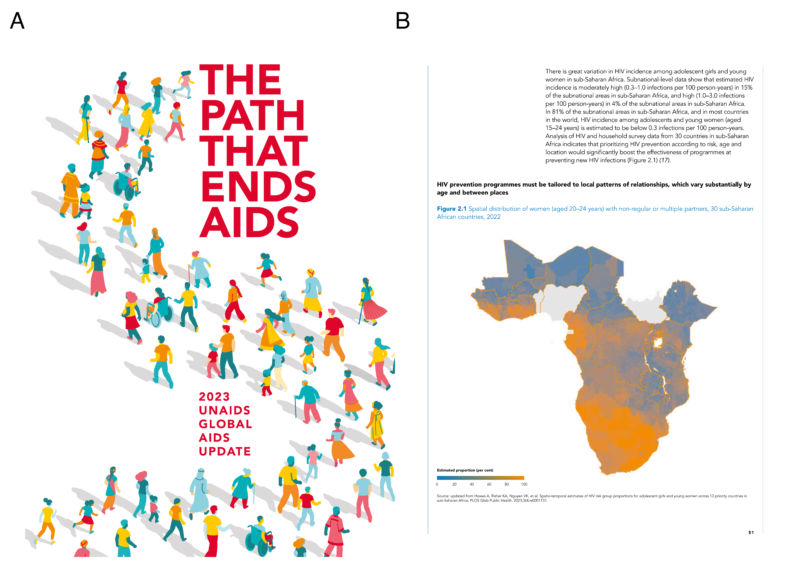
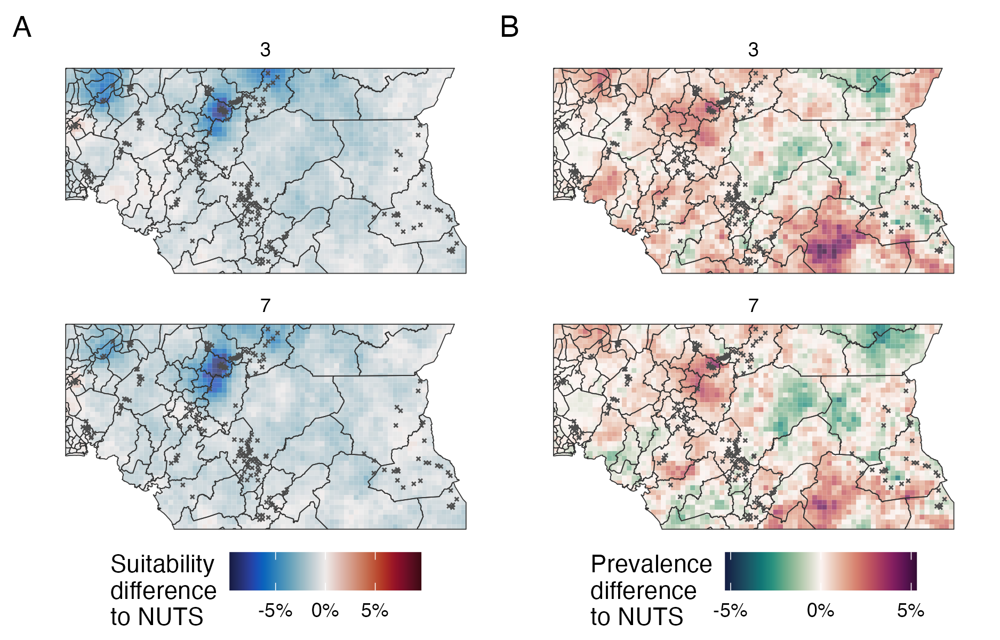

---
#########################################
# options for knitting a single chapter #
#########################################
output:
  bookdown::pdf_document2:
    template: templates/brief_template.tex
    citation_package: biblatex
  bookdown::html_document2: default
  bookdown::word_document2: default
documentclass: book
bibliography: references.bib
---

# Conclusions {#conclusions}
\adjustmtc
\markboth{Conclusions}{}
<!-- For PDF output, include these two LaTeX commands after unnumbered chapter headings, otherwise the mini table of contents and the running header will show the previous chapter -->

<!-- JWE: Minor corrections often involve (1) fixing typos, (2) clarifying things, (3) elaborating on the contributions to science and implications of the PhD in the conclusions chapter [by far the most common point of examiner feedback] -->

This chapter concludes the thesis by discussing its most important contributions, limitations, some promising avenues for future work, and broader reflections about the work.

## Contributions

Chapter \@ref(beyond-borders) used tools for model assessment such as proper scoring rules and posterior predictive checks to comprehensively compare adjacency- and kernel-based models for spatial structure.
The experiments conducted provide useful data to guide the use of spatial random effect models by applied practitioners, as well as to base methodological developments on.
The most important findings were as follows (remains to write).

(ref:global-update-conclusion) Panel A shows the front page of @unaids2023global. Panel B shows the page containing text and a figure based on the work done in Chapter \@ref(multi-agyw). In this figure, 30 countries are included.

```{r global-update-conclusion, fig.cap="(ref:global-update-conclusion)"}

```

Chapter \@ref(multi-agyw) estimated HIV risk group proportions for AGYW to enable implementation of the Global AIDS strategy [@unaids2021global].
Risk group proportion estimates were used to behaviourally disaggregate HIV prevalence and incidence, and assess the benefits of a variety of risk stratification strategies.
This work is the basis for a tool used to prioritise delivery of HIV prevention services by countries in SSA.
The tool now encompasses at least 30 countries, expanding from the initial 13 included [Figure \@ref(fig:global-update); @unaids2023global].
Models will be rerun each year to populate the tool with updated information as a part of the UNAIDS annual HIV estimates process.
Alongside these applied contributions, Chapter \@ref(multi-agyw) exemplified specification of complex multinomial spatio-temporal models in `R-INLA` using the Poisson-multinomial transformation, including using two- and three-way Kronecker product interactions.


The Naomi model has been used in over 35 countries in SSA to produce district-level estimates of HIV indicators by synthesising evidence from multiple sources.
Chapter \@ref(naomi-aghq) developed deterministic Bayesian inference methods, motivated by enabling more accurate inferences for this challenging and practically important model.
Its most important methods contributions are two-fold.
First, an implementation of INLA which is compatible with models specified using a `TMB` C++ template.
For the first time, practitioners can now fit essentially any model using the INLA method.
Second, a quadrature rule which combines PCA and AGHQ to naturally extend the applicability of INLA methods to moderate hyperparameter dimension, allowing more complex models to be fit.
Additionally, Chapter \@ref(naomi-aghq) provides detailed description and analysis of the Naomi model.
Indeed, @esra2023improved used tables and text from Appendix \@ref(naomi-aghq-appendix) in an update to @eaton2021naomi.

## Limitations

The work done in this thesis, particularly Chapters \@ref(beyond-borders) and \@ref(naomi-aghq), focused on producing experimental, empirical evidence. 
This approach reflects the complexity of the models and methods used in this thesis.
Understanding complex systems from a theoretical perspective can be challenging.
That said, the work in this thesis would benefit from closer integration with statistical theory.
While obtaining comprehensive theoretical understanding of models or algorithms may be too optimistic, there may be significant value in better understanding simplified examples, limiting cases, or constituent parts.

In working most tangibly with real world data, Chapter \@ref(multi-agyw) inherits a wide range of limitations.
To highlight a few:
the external validity of risk ratios derived from cohort studies, difficulties defining and measuring key population sizes, and under-reporting of high-risk sexual behaviour.

## Future work

Promising avenues for future work, that I might prioritise, include:

1. It would be valuable to extend the risk group model developed in Chapter \@ref(multi-agyw), and the resulting tool, to include all adults 15-49.
Although AGYW are disproportionately at risk of HIV infection, 56% of new infections in SSA occur in other demographic groups.
Modelling of age-stratified sexual partnerships [@wolock2021evaluating] may help to overcome reporting biases by harmonising male and female reporting.
This model would likely fall out of the scope of `R-INLA`, but would be possible to write with `TMB` and therefore amenable to the inference methods advanced in Chapter \@ref(naomi-aghq).

2. Although suitable for early stage research, wider adoption of the INLA implementation developed in Chapter \@ref(naomi-aghq) would be enhanced greatly by improvements to its speed and usability.
The most important speed enhancement would come from using the simplified approximation to the Laplace marginals developed by @wood2020simplified.
Although the naive implementation used in this thesis is viable for integrating Laplace marginals over a small number of hyperparameter quadrature nodes, such as the $3^2 = 9$ nodes used Sections \@ref(loaloa) and \@ref(epil), it becomes prohibitively slow for larger numbers.
Usability would be improved by providing the method as a part of statistical software, likely via the `aghq` package.
The primary difficulty which would have to be overcome to do so is that the `random` argument of `TMB::MakeADFun` does not allow indexing.

(ref:conditional-simulation-diff-k-fixed) For the Loa loa ELGM, increasing the number of quadrature nodes per hyperparameter dimension from $k = 3$ to $k = 7$ did little to improve accuracy. On the other hand, using Laplace marginals rather than Gaussian marginals did have a substantial effect (Figures \@ref(fig:conditional-simulation-phi-diff-fixed) and \@ref(fig:conditional-simulation-rho-diff-fixed)). More broadly, it would be valuable to better understand, and aspirationally have diagnostics for, the circumstances under which more accurate approximations are required.

```{r conditional-simulation-diff-k-fixed, fig.cap="(ref:conditional-simulation-diff-k-fixed)"}

```

3. The universal INLA implementation developed in Chapter \@ref(naomi-aghq) enables empirical and methodological research that was previously not possible, or prohibitively difficult.

    INLA-like methods can now be tested for a broader class of models, such as the Loa loa and Naomi ELGMs (Sections \@ref(loaloa) and \@ref(malawi)).
    That a single `TMB` C++ template for the log-posterior supports inference using multiple methods, including gold-standard NUTS via `tmbstan`, is a substantial asset in conducting this type of research.
    
    As an example research question, within this class of models, what is the best way to obtain accurate inferences within a fixed computational budget.
    Is it better to use additional hyperparameter grid points, or more accurate latent field approximations?
    For the Loa loa ELGM, the benefit of Laplace marginals was greater than a denser AGHQ grid (Figure \@ref(fig:conditional-simulation-diff-k-fixed)).

    Additionally, it is relatively easy to make alterations to the implementaiton, facilitating possible innovation in the design of INLA-like algorithms.
    Previously, it has been difficult for researchers not involved in development of `R-INLA` to engage in methodological work about the INLA method.

    Theoretical research could be conducted to complement the work described above, extending the findings of @bilodeau2022stochastic.
    This work is benefited by the exhaustive specification of the INLA-like algorithms used in this thesis.

## Broader reflections

Conducting the work in this thesis involved testing the boundaries of available statistical software.
For example, I found it challenging, if not impossible, to implement a common model using different inferential software.
As the frequently asked questions section of the `R-INLA` website [@rinla2023faq] notes: "the devil is in the details".
Similarly, I encountered issues implementing a desired collection of different models in a common inferential software.
From personal experience, my colleagues have also encountered similar problems.
Needless to say, conflation of statistical models and inference methodologies limits the validity of any findings.
To avoid this issue, I implemented all models in Chapters \@ref(beyond-borders) and \@ref(naomi-aghq) using `TMB` model templates.
(Additionally, I would recommend implementing the model used in Chapter \@ref(multi-agyw) in `TMB` for future development.)
Alongside being sufficiently flexible to meet my model specification requirements, `TMB` is compatible with a range of inference methodologies, including those advanced in this thesis.
As such, `TMB` remains [@osgood2023statistical] an under-rated statistical tool.
In demonstrating some of its capabilities, I hope this thesis contributes to its wider adoption.

There are both direct and indirect paths to impact for the work in this thesis.
Directly, the methodological contributions of Chapters \@ref(beyond-borders) and \@ref(naomi-aghq) may eventually lead to marginally more accurate indicator estimates, contributing to a broadly more effective response.
However, these improvements in accuracy seem of minor consequence within the broader context of the HIV response, and factors limiting its effectiveness.
The applied contributions of Chapter \@ref(multi-agyw) have a more promising case for direct impact.
Indeed, I have seen evidence of engagement with this work by decision makers.

To the best of my abilities, this thesis, and the work described within it, was written in keeping with the principles of open science.
I hope that having done so facilitates my work to be scrutinised, and more optimistically, built upon.
In part this hope has already been realised, as with limited input from me, Dr. Kathryn Risher was able to extend my code for Chapter \@ref(multi-agyw) to include additional countries (Panel \@ref(fig:global-update)B).
This would not have been possible without tools from the R ecosystem such as `rmarkdown` and `rticles` for reporting, `devtools` for R package development, as well as those written by software engineers within the MRC Centre for Global Infectious Disease Analysis such as `orderly` and `didehpc`.
It is crucial that academia adjusts to appropriately incentivises software contributions, and encourages adaption of open science best practices.
Work done to inform public health decision making should be held to high standards of transparency, reproducibility and collaboration.
Especially so in an outbreak response scenario [@grieve2023importance], where time is limited and decisions may be of significant consequence.

<!-- Aims for HIV response going forward, and the surveillance capabilities needed to meet them. -->
<!-- Greater reliance on routine health system data. -->
<!-- It is not recommended to include HIV testing in nationally representative household surveys in low (<2%) HIV prevalence settings [@world2005guidelines]. -->
<!-- Patient-level HIV data systems [@world2017consolidated] and case-based surveillance (CBS). -->
<!-- Integration of HIV services with other health programs and strengthening of health systems. -->
