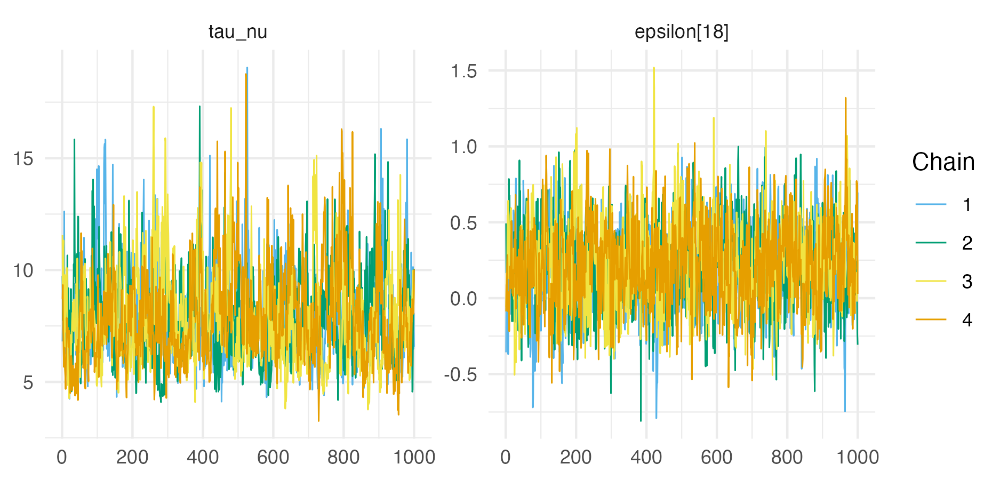

# Fast approximate Bayesian inference {#naomi-aghq-appendix}

```{r}
resource_version <-  list.files("resources/naomi-aghq")
```

## Epilepsy example

### `TMB` C++ template {#tmb-epil}

```{cpp, echo=TRUE, eval=FALSE, output.var="epil", code=readLines("figures/naomi-aghq/TMB/epil.cpp")}
```

### Modified `TMB` C++ template {#tmb-modified-epil}

```{cpp, echo=TRUE, eval=FALSE, output.var="epil", code=readLines("figures/naomi-aghq/TMB/epil_modified.cpp")}
```

### `Stan` C++ template {#stan-epil}

```{cpp, echo=TRUE, eval=FALSE, output.var="epil", code=readLines("figures/naomi-aghq/epil.stan")}
```

### NUTS convergence and suitability

#### `tmbstan` {#tmbstan-epil}

(ref:tmbstan-epil) Traceplots for the `tmbstan` parameters with the lowest ESS and highest potential scale reduction factor. These were `l_tau_nu` (an $\text{ESS}$ of 377) and `beta[3]` (an $\hat R$ of 1.006).

```{r tmbstan-epil, fig.cap="(ref:tmbstan-epil)"}
knitr::include_graphics("figures/naomi-aghq/tmbstan-epil.png")
```

#### `rstan` {#rstan-epil}

(ref:stan-epil) Traceplots for the `rstan` parameters with the lowest ESS and highest potential scale reduction factor. These were `tau_nu` (an $\text{ESS}$ of 437) and `tau_nu` (an $\hat R$ of 1.009). Rather than plotting the traceplot for `tau_nu` twice, the parameter `epsilon[18]` is included, which had the second highest $\hat R$ of 1.008.

```{r stan-epil, fig.cap="(ref:stan-epil)"}

```

## Loa loa example

### NUTS convergence and suitability

(ref:nuts-loa-loa) Traceplots for the parameters with the lowest ESS and highest potential scale reduction factor.

```{r nuts-loa-loa, fig.cap="(ref:nuts-loa-loa)"}
knitr::include_graphics("figures/naomi-aghq/nuts-loa-loa.png")
```

### Inference comparison

(ref:loa-loa-mean-sd-pct) Relative difference between the Gaussian and Laplace marginal posterior means and standard deviations to NUTS results at each $u(s_i), v(s_i): i \in [190]$. Absolute differences are in Figure \@ref(fig:loa-loa-mean-sd-abs).

```{r loa-loa-mean-sd-pct, fig.cap="(ref:loa-loa-mean-sd-pct)"}
knitr::include_graphics("figures/naomi-aghq/loa-loa-mean-sd-pct.png")
```

\newpage

## Simplified Naomi model description {#naomi-math}

This section describes the simplified version of the Naomi model [@eaton2021naomi] in more detail.
The concise $i$ indexing used in Section \@ref(naomi) is replaced by a more complete $x, s, a$ indexing.
There are four sections:

1. Section \@ref(naomi-process) gives the process specifications, giving the terms in each structured additive predictor, along with their distributions.
2. Section \@ref(naomi-likelihood) gives additional details about the likelihood terms not provided in Section \@ref(naomi).
3. Section \@ref(naomi-identifiability) gives identifiability constraints used in circumstances where incomplete data is available for the country.
4. Section \@ref(naomi-implementation) provides details of the `TMB` implementation.

### Process specification {#naomi-process}

|                   | Model component    | Latent field | Hyperparameter |
| ----------------- | ------------------ | ------------ | -------------- |
| Section \@ref(hiv-prev)   | HIV prevalence     | $22 + 5n$    | 9              |
| Section \@ref(art-cov)    | ART coverage       | $25 + 5n$    | 9              |
| Section \@ref(hiv-inc)    | HIV incidence rate | $2 + n$      | 3              |
| Section \@ref(anc-test)   | ANC testing        | $2 + 2n$     | 2              |
| Section \@ref(art-attend) | ART attendance     | $n$          | 1              |
|                   | Total              | $51 + 14n$   | 24             |

Table: (\#tab:process) The Naomi model can be conceptualised as having five processes. This table gives the number of latent field parameters and hyperparameters in each process, where $n$ is the number of districts in the country.

#### HIV prevalence {#hiv-prev}

HIV prevalence $\rho_{x, s, a} \in [0, 1]$ was modelled on the logit scale using the structured additive predictor
\begin{equation}
\text{logit}(\rho_{x, s, a}) = \beta^\rho_0 + \beta_{S}^{\rho, s = \text{M}} + \mathbf{u}^\rho_a + \mathbf{u}_a^{\rho, s = \text{M}} + \mathbf{u}^\rho_x + \mathbf{u}_x^{\rho, s = \text{M}} + \mathbf{u}_x^{\rho, a < 15} + \boldsymbol{\mathbf{\eta}}^\rho_{R_x, s, a}. (\#eq:prev)
\end{equation}
Table \@ref(tab:prev) provides a description of the terms included in Equation \@ref(eq:prev).
Independent half-normal prior distributions were chosen for the five standard deviation terms
\begin{equation}
\{\sigma_A^\rho, \sigma_{AS}^\rho, \sigma_X^\rho, \sigma_{XS}^\rho, \sigma_{XA}^\rho\} \sim \mathcal{N}^{+}(0, 2.5),
\end{equation}
independent uniform prior distributions for the two AR1 correlation parameters
\begin{equation}
\{\phi_A^\rho, \phi_{AS}^\rho\} \sim \mathcal{U}(-1, 1),
\end{equation}
and independent beta prior distributions for the two BYM2 proportion parameters
\begin{equation}
\{\phi_X^\rho, \phi_{XS}^\rho\} \sim \text{Beta}(0.5, 0.5).
\end{equation}

| Term                             | Distribution                                    | Description                                                                                                     |
|----------------------------------|-------------------------------------------------|-----------------------------------------------------------------------------------------------------------------|
| $\beta^\rho_0$                   | $\mathcal{N}(0, 5)$                             | Intercept                                                                                                       |
| $\beta_{s}^{\rho, s = \text{M}}$ | $\mathcal{N}(0, 5)$                             | The difference in logit prevalence for men compared to women                                                    |
| $\mathbf{u}^\rho_a$              | $\text{AR}1(\sigma_A^\rho, \phi_A^\rho)$        | Age random effects for women                                                                                    |
| $\mathbf{u}_a^{\rho, s = \text{M}}$ | $\text{AR}1(\sigma_{AS}^\rho, \phi_{AS}^\rho)$  | Age random effects for the difference in logit prevalence for men compared to women age $a$                  |
| $\mathbf{u}^\rho_x$              | $\text{BYM}2(\sigma_X^\rho, \phi_X^\rho)$       | Spatial random effects for women                                                                                |
| $\mathbf{u}_x^{\rho, s = \text{M}}$ | $\text{BYM}2(\sigma_{XS}^\rho, \phi_{XS}^\rho)$ | Spatial random effects for the difference in logit prevalence for men compared to women in district $x$      |
| $\mathbf{u}_x^{\rho, a < 15}$    | $\text{ICAR}(\sigma_{XA}^\rho)$                 | Spatial random effects for the difference in logit paediatric prevalence to adult women prevalence in district $x$ |
| $\boldsymbol{\mathbf{\eta}}^\rho_{R_x, s, a}$ | $-$                                | Fixed offsets specifying assumed odds ratios for prevalence outside the age ranges for which data were available. Calculated from Spectrum model [@stover2019updates] outputs for region $R_x$ |

Table: (\#tab:prev) Each term in Equation \@ref(eq:prev) together with, where applicable, its prior distribution and a written description of its role.

#### ART coverage {#art-cov}

ART coverage $\alpha_{x, s, a} \in [0, 1]$ was modelled on the logit scale using the structured additive predictor
\begin{equation}
\text{logit}(\alpha_{x, s, a}) = \beta^\alpha_0 + \beta_{S}^{\alpha, s = \text{M}} + \mathbf{u}^\alpha_a + \mathbf{u}_a^{\alpha, s = \text{M}} + \mathbf{u}^\alpha_x + \mathbf{u}_x^{\alpha, s = \text{M}} + \mathbf{u}_x^{\alpha, a < 15} + \boldsymbol{\mathbf{\eta}}^\alpha_{R_x, s, a} 
\end{equation}
with terms and prior distributions analogous to the HIV prevalence process model in Section \@ref(hiv-prev) above.

#### HIV incidence rate {#hiv-inc}

HIV incidence rate $\lambda_{x, s, a} > 0$ was modelled on the log scale using the structured additive predictor
\begin{equation}
\log(\lambda_{x, s, a}) = \beta_0^\lambda + \beta_S^{\lambda, s = \text{M}} + \log(\rho_{x}^{\text{15-49}}) + \log(1 - \omega \cdot \alpha_{x}^{\text{15-49}}) + \mathbf{u}_x^\lambda + \boldsymbol{\mathbf{\eta}}_{R_x, s, a}^\lambda. (\#eq:inc)
\end{equation}
Table \@ref(tab:inc) provides a description of the terms included in Equation \@ref(eq:inc).

| Term                              | Distribution                     | Description                                                                                                                                                   |
|-----------------------------------|----------------------------------|---------------------------------------------------------------------------------------------------------------------------------------------------------------|
| $\beta^\lambda_0$                 | $\mathcal{N}(0, 5)$              | Intercept term proportional to the average HIV transmission rate for untreated HIV positive adults                                                            |
| $\beta_S^{\lambda, s = \text{M}}$ | $\mathcal{N}(0, 5)$              | The log incidence rate ratio for men compared to women                                                                                                        |
| $\rho_{x}^{\text{15-49}}$         | $-$                              | The HIV prevalence among adults 15-49 in district $x$ calculated by aggregating age-specific HIV prevalences                                                                  |
| $\alpha_{x}^{\text{15-49}}$       | $-$                              | The ART coverage among adults 15-49 in district $x$ calculated by aggregating age-specific ART coverages                                                                      |
| $\omega = 0.7$                    | $-$                              | Average reduction in HIV transmission rate per increase in population ART coverage fixed based on inputs to the Estimation and Projection Package (EPP) model |
| $\mathbf{u}_x^\lambda$                   | $\mathcal{N}(0, \sigma^\lambda)$ | IID spatial random effects with $\sigma^\lambda \sim \mathcal{N}^+(0, 1)$                                                                              |
| $\boldsymbol{\mathbf{\eta}}^\lambda_{R_x, s, a}$      | $-$          | Fixed log incidence rate ratios by sex and age group calculated from Spectrum model outputs for region $R_x$                                                                    |

Table: (\#tab:inc) Each term in Equation \@ref(eq:inc) together with, where applicable, its prior distribution and a written description of its role.

The proportion recently infected among HIV positive persons $\kappa_{x, s, a} \in [0, 1]$ was modelled as
\begin{equation}
\kappa_{x, s, a} = 1 - \exp \left(- \lambda_{x, s, a} \cdot \frac{1 - \rho_{x, s, a}}{\rho_{x, s, a}} \cdot (\Omega_T - \beta_T ) - \beta_T \right),
\end{equation}
where $\Omega_T \sim \mathcal{N}(\Omega_{T_0}, \sigma^{\Omega_T})$ is the mean duration of recent infection, and $\beta_T \sim \mathcal{N}^{+}(\beta_{T_0}, \sigma^{\beta_T})$ is the false recent ratio.
The prior distribution for $\Omega_T$ was informed by the characteristics of the recent infection testing algorithm.
For PHIA surveys this was $\Omega_{T_0} = 130 \text{ days}$ and $\sigma^{\Omega_T} = 6.12 \text{ days}$.
For PHIA surveys there was assumed to be no false recency, such that $\beta_{T_0} = 0.0$, $\sigma^{\beta_T} = 0.0$, and $\beta_T = 0$.

#### ANC testing {#anc-test}

HIV prevalence $\rho_{x, a}^\text{ANC}$ and ART coverage $\alpha_{x, a}^\text{ANC}$ among pregnant women were modelled as being offset on the logit scale from the corresponding district-age indicators $\rho_{x, F, a}$ and $\alpha_{x, F, a}$ according to
\begin{align}
\text{logit}(\rho_{x, a}^{\text{ANC}}) &= \text{logit}(\rho_{x, F, a}) + \beta^{\rho^{\text{ANC}}} + \mathbf{u}_x^{\rho^{\text{ANC}}} + \boldsymbol{\mathbf{\eta}}_{R_x, a}^{\rho^{\text{ANC}}}, (\#eq:anc1) \\
\text{logit}(\alpha_{x, a}^{\text{ANC}}) &= \text{logit}(\alpha_{x, F, a}) + \beta^{\alpha^{\text{ANC}}} + \mathbf{u}_x^{\alpha^{\text{ANC}}} + \boldsymbol{\mathbf{\eta}}_{R_x, a}^{\alpha^{\text{ANC}}} (\#eq:anc2).
\end{align}
Table \@ref(tab:anc) provides a description of the terms included in Equation \@ref(eq:anc1) and Equation \@ref(eq:anc2).

| Term                                    | Distribution                                     | Description                                                                                                                                                                                                    |
|-----------------------------------------|--------------------------------------------------|----------------------------------------------------------------------------------------------------------------------------------------------------------------------------------------------------------------|
| $\beta^{\theta^{\text{ANC}}}$           | $\mathcal{N}(0, 5)$                              | Intercept giving the average difference between population and ANC outcomes                                                                                                                                    |
| $\mathbf{u}_x^{\theta^{\text{ANC}}}$    | $\mathcal{N}(0, \sigma_X^{\theta^{\text{ANC}}})$ | IID district random effects with $\sigma_X^{\theta^{\text{ANC}}} \sim \mathcal{N}^+(0, 1)$                                                                                                                     |
| $\boldsymbol{\mathbf{\eta}}_{R_x, a}^{\theta^{\text{ANC}}}$ | $-$                          | Offsets for the log fertility rate ratios for HIV positive women compared to HIV negative women and for women on ART to HIV positive women not on ART, calculated from Spectrum model outputs for region $R_x$ |

Table: (\#tab:anc) Each term in Equations \@ref(eq:anc1) and \@ref(eq:anc2) together with (where applicable) its prior distribution and a written description of its role. The notation $\theta$ is used as stand in for $\theta \in \{\rho, \alpha\}$.

In the full Naomi model, for adult women 15-49 the number of ANC clients $\Psi_{x, a} > 0$ were modelled as
\begin{equation}
\log (\Psi_{x, a}) = \log (N_{x, \text{F}, a}) + \psi_{R_x, a} + \beta^\psi + \mathbf{u}_x^\psi,
\end{equation}
where $N_{x, \text{F}, a}$ are the female population sizes, $\psi_{R_x, a}$ are fixed age-sex fertility ratios in Spectrum region $R_x$, $\beta^\psi$ are log rate ratios for the number of ANC clients relative to the predicted fertility, and $\mathbf{u}_x^\psi \sim \mathcal{N}(0, \sigma^\psi)$ are district random effects.
Here these terms are fixed to $\beta^\psi = 0$ and $\mathbf{u}_x^\psi = \mathbf{0}$ such that $\Psi_{x, a}$ are simply constants.

#### ART attendance {#art-attend}

```{r}
log_odds <- function(p) log(p / (1 - p))
logistic <- function(x) 1 / (1 + exp(-x))
# 100 * round(logistic(-4), 3)
```

Let $\gamma_{x, x'} \in [0, 1]$ be the probability that a person on ART residing in district $x$ receives ART in district $x'$.
Assume that $\gamma_{x, x'} = 0$ for $x \notin \{x, \text{ne}(x)\}$ such that individuals seek treatment only in their residing district or its neighbours $\text{ne}(x) = \{x': x' \sim x\}$, where $\sim$ is an adjacency relation, and $\sum_{x' \in \{x, \text{ne}(x)\}} \gamma_{x, x'} = 1$.

The probabilities $\gamma_{x, x'}$ for $x \sim x'$ were modelled using multinomial logistic regression model, based on the log-odds ratios
\begin{equation}
\tilde \gamma_{x, x'} = \log \left( \frac{\gamma_{x, x'}}{1 - \gamma_{x, x'}} \right) = \tilde \gamma_0 + \mathbf{u}_x^{\tilde \gamma}. (\#eq:log-or)
\end{equation}
Table \@ref(tab:log-or) provides a description of the terms included in Equation \@ref(eq:log-or).
Fixing $\tilde \gamma_{x, x} = 0$ then the multinomial probabilities may be recovered using the softmax
\begin{equation}
\gamma_{x, x'} = \frac{\exp(\tilde \gamma_{x, x'})}{\sum_{x^\star \in \{x, \text{ne}(x)\}} \exp(\tilde \gamma_{x, x^\star})}.
\end{equation}

| Term                           | Distribution                               | Description                                                                         |
|--------------------------------|--------------------------------------------|-------------------------------------------------------------------------------------|
| $\tilde \gamma_0$              | $-$                                        | Fixed intercept $\tilde \gamma_0 = -4$. Implies a prior mean on $\gamma_{x, x'}$ of 1.8%, such that a-priori $(100 - 1.8 \times \text{ne}(x))\%$ of ART clients in district $x$ obtain treatment in their home district |
| $\mathbf{u}_x^{\tilde \gamma}$ | $\mathcal{N}(0, \sigma_X^{\tilde \gamma})$ | District random effects, with $\sigma_X^{\tilde \gamma} \sim \mathcal{N}^+(0, 2.5)$ |

Table: (\#tab:log-or) Each term in Equation \@ref(eq:log-or) together with, where applicable, its prior distribution and a written description of its role.
As no terms include $x'$, $\gamma_{x, x'}$ is only a function of $x$.

### Additional likelihood specification {#naomi-likelihood}

Though Section \@ref(naomi) provides a complete description of Naomi's likelihood specification, any additional useful details are provided here.

#### Household survey data

The generalised binomial $y \sim \text{xBin}(m, p)$ is defined for $y, m \in \mathbb{R}^+$ with $y \leq m$ such that
\begin{align}
\log p(y) = &\log \Gamma(m + 1) - \log \Gamma(y + 1) \\
            &- \log \Gamma(m - y + 1) + y \log p + (m - y) \log(1 - p),
\end{align}
where the gamma function $\Gamma$ is such that $\forall n \in \mathbb{N}$, $\Gamma(n) = (n - 1)!$.

### Identifiability constraints {#naomi-identifiability}

If data are missing, some parameters are fixed to default values to help with identifiability.
In particular:

1. If survey data on HIV prevalence or ART coverage by age and sex are not available then $\mathbf{u}_a^\theta = 0$ and $\mathbf{u}_{a, s = \text{M}}^\theta = 0$.
In this case, the average age-sex pattern from the Spectrum is used.
For the Malawi case-study (Section \@ref(malawi)), HIV prevalence and ART coverage data are not available for those aged 65+.
As a result, there are $|\{\text{0-4}, \ldots, \text{50-54}\}| = 13$ age groups included for the age random effects.
2. If no ART data, either survey or ART programme, are available but data on ART coverage among ANC clients are available, the level of ART coverage is not identifiable, but spatial variation is identifiable.
In this instance, overall ART coverage is determined by the Spectrum offset, and only area random effects are estimated such that
\begin{equation}
\text{logit} \left(\alpha_{x, s, a} \right) = \mathbf{u}_x^\alpha + \boldsymbol{\mathbf{\eta}}_{R_x, s, a}^\alpha.
\end{equation}
3. If survey data on recent HIV infection are not included in the model, then $\beta_0^\lambda = \beta_S^{\lambda, s = \text{M}} = 0$ and $\mathbf{u}_x^\lambda = \mathbf{0}$.
The sex ratio for HIV incidence is determined by the sex incidence rate ratio from Spectrum, and the incidence rate in all districts is modelled assuming the same average HIV transmission rate for untreated adults, but varies according to district-level estimates of HIV prevalence and ART coverage.

### Implementation {#naomi-implementation}

The `TMB` C++ code for the negative log-posterior of the simplified Naomi model is available from [`https://github.com/athowes/naomi-aghq`](https://github.com/athowes/naomi-aghq).
For ease of understanding, Table \@ref(tab:tmb-lookup) provides correspondence between the mathematical notation used in Section \@ref(naomi-math) and the variable names used in the `TMB` code, for all hyperparameters and latent field parameters.
For further reference on the `TMB` software see @tmbdocumentation.

| Variable name            | Notation          | Type   | Domain  | $\rho$ | $\alpha$ | $\lambda$ |
|--------------------------|------------------ |--------|---------|--------|----------|-----------|
| `logit_phi_rho_x`      | $\text{logit}(\phi_X^\rho)$                          | Hyper  | $\mathbb{R}$      | Yes |     |     |
| `log_sigma_rho_x`      | $\log(\sigma_X^\rho)$                                | Hyper  | $\mathbb{R}$      | Yes |     |     |
| `logit_phi_rho_xs`     | $\text{logit}(\phi_{XS}^\rho)$                       | Hyper  | $\mathbb{R}$      | Yes |     |     |
| `log_sigma_rho_xs`     | $\log(\sigma_{XS}^\rho)$                             | Hyper  | $\mathbb{R}$      | Yes |     |     |
| `logit_phi_rho_a`      | $\text{logit}(\phi_A^\rho)$                          | Hyper  | $\mathbb{R}$      | Yes |     |     |
| `log_sigma_rho_a`      | $\log(\sigma_A^\rho)$                                | Hyper  | $\mathbb{R}$      | Yes |     |     |
| `logit_phi_rho_as`     | $\text{logit}(\phi_{AS}^\rho)$                       | Hyper  | $\mathbb{R}$      | Yes |     |     |
| `log_sigma_rho_as`     | $\log(\sigma_{AS}^\rho)$                             | Hyper  | $\mathbb{R}$      | Yes |     |     |
| `log_sigma_rho_xa`     | $\log(\sigma_{XA}^\rho)$                             | Hyper  | $\mathbb{R}$      | Yes |     |     |
| `logit_phi_alpha_x`    | $\text{logit}(\phi_X^\alpha)$                        | Hyper  | $\mathbb{R}$      |     | Yes |     |
| `log_sigma_alpha_x`    | $\log(\sigma_X^\alpha)$                              | Hyper  | $\mathbb{R}$      |     | Yes |     |
| `logit_phi_alpha_xs`   | $\text{logit}(\phi_{XS}^\alpha)$                     | Hyper  | $\mathbb{R}$      |     | Yes |     |
| `log_sigma_alpha_xs`   | $\log(\sigma_{XS}^\alpha)$                           | Hyper  | $\mathbb{R}$      |     | Yes |     |
| `logit_phi_alpha_a`    | $\text{logit}(\phi_A^\alpha)$                        | Hyper  | $\mathbb{R}$      |     | Yes |     |
| `log_sigma_alpha_a`    | $\log(\sigma_A^\alpha)$                              | Hyper  | $\mathbb{R}$      |     | Yes |     |
| `logit_phi_alpha_as`   | $\text{logit}(\phi_{AS}^\alpha)$                     | Hyper  | $\mathbb{R}$      |     | Yes |     |
| `log_sigma_alpha_as`   | $\log(\sigma_{AS}^\alpha)$                           | Hyper  | $\mathbb{R}$      |     | Yes |     |
| `log_sigma_alpha_xa`   | $\log(\sigma_{XA}^\alpha)$                           | Hyper  | $\mathbb{R}$      |     | Yes |     |
| `OmegaT_raw`           | $\Omega_T$                                           | Hyper  | $\mathbb{R}$      |     |     | Yes |
| `log_betaT`            | $\log(\beta_T)$                                      | Hyper  | $\mathbb{R}$      |     |     | Yes |
| `log_sigma_lambda_x`   | $\log(\sigma^\lambda)$                               | Hyper  | $\mathbb{R}$      |     |     | Yes |
| `log_sigma_ancrho_x`   | $\log(\sigma_X^{\rho^{\text{ANC}}})$                 | Hyper  | $\mathbb{R}$      |     | Yes |     |
| `log_sigma_ancalpha_x` | $\log(\sigma_X^{\alpha^{\text{ANC}}})$               | Hyper  | $\mathbb{R}$      |     | Yes |     |
| `log_sigma_or_gamma`   | $\log(\sigma_X^{\tilde \gamma})$                     | Hyper  | $\mathbb{R}$      |     |     |     |
| `beta_rho`             | $(\beta^\rho_0, \beta_{s}^{\rho, s = \text{M}})$     | Latent | $\mathbb{R}^2$    | Yes |     |     |
| `beta_alpha`           | $(\beta^\alpha_0, \beta_{S}^{\alpha, s = \text{M}})$ | Latent | $\mathbb{R}^2$    |     | Yes |     |
| `beta_lambda`          | $(\beta_0^\lambda, \beta_S^{\lambda, s = \text{M}})$ | Latent | $\mathbb{R}^2$    |     |     | Yes |
| `beta_anc_rho`         | $\beta^{\rho^{\text{ANC}}}$                          | Latent | $\mathbb{R}$      |     | Yes |     |
| `beta_anc_alpha`       | $\beta^{\alpha^{\text{ANC}}}$                        | Latent | $\mathbb{R}$      |     | Yes |     |
| `u_rho_x`              | $\mathbf{w}^\rho_x$                                  | Latent | $\mathbb{R}^{n}$  | Yes |     |     |
| `us_rho_x`             | $\mathbf{v}^\rho_x$                                  | Latent | $\mathbb{R}^{n}$  | Yes |     |     |
| `u_rho_xs`             | $\mathbf{w}_x^{\rho, s = \text{M}}$                  | Latent | $\mathbb{R}^{n}$  | Yes |     |     |
| `us_rho_xs`            | $\mathbf{v}_x^{\rho, s = \text{M}}$                  | Latent | $\mathbb{R}^{n}$  | Yes |     |     |
| `u_rho_a`              | $\mathbf{u}^\rho_a$                                  | Latent | $\mathbb{R}^{10}$ | Yes |     |     |
| `u_rho_as`             | $\mathbf{u}_a^{\rho, s = \text{M}}$                  | Latent | $\mathbb{R}^{10}$ | Yes |     |     |
| `u_rho_xa`             | $\mathbf{u}_x^{\rho, a < 15}$                        | Latent | $\mathbb{R}^{n}$  | Yes |     |     |
| `u_alpha_x`            | $\mathbf{w}^\alpha_x$                                | Latent | $\mathbb{R}^{n}$  |     | Yes |     |
| `us_alpha_x`           | $\mathbf{v}^\alpha_x$                                | Latent | $\mathbb{R}^{n}$  |     | Yes |     |
| `u_alpha_xs`           | $\mathbf{w}_x^{\alpha, s = \text{M}}$                | Latent | $\mathbb{R}^{n}$  |     | Yes |     |
| `us_alpha_xs`          | $\mathbf{v}_x^{\alpha, s = \text{M}}$                | Latent | $\mathbb{R}^{n}$  |     | Yes |     |
| `u_alpha_a`            | $\mathbf{u}^\alpha_a$                                | Latent | $\mathbb{R}^{13}$ |     | Yes |     |
| `u_alpha_as`           | $\mathbf{u}_a^{\alpha, s = \text{M}}$                | Latent | $\mathbb{R}^{10}$ |     | Yes |     |
| `u_alpha_xa`           | $\mathbf{u}_x^{\alpha, a < 15}$                      | Latent | $\mathbb{R}^{n}$  |     | Yes |     |
| `ui_lambda_x`          | $\mathbf{u}_x^\lambda$                               | Latent | $\mathbb{R}^{n}$  |     |     | Yes |
| `ui_anc_rho_x`         | $\mathbf{u}_x^{\rho^{\text{ANC}}}$                   | Latent | $\mathbb{R}^{n}$  |     | Yes |     |
| `ui_anc_alpha_x`       | $\mathbf{u}_x^{\alpha^{\text{ANC}}}$                 | Latent | $\mathbb{R}^{n}$  |     | Yes |     |
| `log_or_gamma`         | $\mathbf{u}_x^{\tilde \gamma}$                       | Latent | $\mathbb{R}^{n}$  |     |     |      

Table: (\#tab:tmb-lookup) Correspondence between the variable name used in the Naomi `TMB` template and the mathematical notation used in Appendix \@ref(naomi-math). The parameter type, either a hyperparameter or element of the latent field, is also given. All of the parameters are defined on the real-scale in some dimension. In the final three columns ($\rho$, $\alpha$, and $\lambda$) indication is given as to which component of the model the parameter is primarily used in.

## NUTS convergence and suitability

```{r}
naomi_nuts <- readRDS(paste0("resources/naomi-aghq/", resource_version, "/depends/mcmc-out.rds"))
```

(ref:rhat) For NUTS run on the Naomi ELGM, the maximum potential scale reduction factor was `r round(naomi_nuts$rhat_max, 3)`, below the value of 1.05 typically used as a cutoff for acceptable chain mixing, indicating that the results are acceptable to use. Additionally, the vast majority (`r round(100 * naomi_nuts$rhat_above_threshold, 1)`%) of $\hat R$ values were less than 1.1.

```{r rhat, fig.cap="(ref:rhat)"}
knitr::include_graphics(paste0("resources/naomi-aghq/", resource_version, "/depends/rhat.png"))
```

(ref:ess) The efficiency of the NUTS, as measured by the ratio of effective sample size to total number of iterations run, was low for most parameters (Panel A). As a result, the number of iterations required for the the effective number of samples (mean `r round(naomi_nuts$ess_mean)`) to be satisfactory was high (Panel B). 

```{r ess, fig.cap="(ref:ess)"}
knitr::include_graphics(paste0("resources/naomi-aghq/", resource_version, "/depends/ess.png"))
```

(ref:worst-trace) Traceplots for the parameter with the lowest ESS which was `log_sigma_alpha_xs` (an $\text{ESS}$ of `r round(naomi_nuts$ess_min)`, Panel A) and highest potential scale reduction factor which was `ui_lambda_x[10]` (an $\hat R$ of `r round(naomi_nuts$rhat_max, 3)`, Panel B).

```{r worst-trace, fig.cap="(ref:worst-trace)"}
knitr::include_graphics(paste0("resources/naomi-aghq/", resource_version, "/depends/worst-trace.png"))
```

(ref:rho-a) NUTS pairs plots for the parameters $\log(\sigma_{A}^\rho)$ and $\text{logit}(\phi_{A}^\rho)$, or as written `log_sigma_rho_a` and `logit_phi_rho_a`.

```{r rho-a, fig.cap="(ref:rho-a)"}
knitr::include_graphics(paste0("resources/naomi-aghq/", resource_version, "/depends/rho_a.png"))
```

(ref:alpha-x) NUTS pairs plots for the parameters $\log(\sigma_X^\alpha)$ and $\text{logit}(\phi_X^\alpha)$, or as written `log_sigma_alpha_x` and `logit_phi_alpha_x`.

```{r alpha-x, fig.cap="(ref:alpha-x)"}
knitr::include_graphics(paste0("resources/naomi-aghq/", resource_version, "/depends/alpha_x.png"))
```

(ref:posterior-contraction) The posterior contraction for each parameter in the model. Values are averaged for parameters of length greater than one. The posterior contraction is zero when the prior distribution and posterior distribution have the same standard deviation. This could indicate that the data is not informative about the parameter. The closer the posterior contraction is to one, the more than the marginal posterior distribution has concentrated about a single point.

```{r posterior-contraction, fig.cap="(ref:posterior-contraction)"}
knitr::include_graphics(paste0("resources/naomi-aghq/", resource_version, "/depends/posterior-contraction.png"))
```

(ref:nuts-hand-comparison) Prior standard deviations were calculated by using NUTS to simulate from the prior distribution. This approach is more convenient than simulating directly from the model, but can lead to inaccuracies.

```{r nuts-hand-comparison, fig.cap="(ref:nuts-hand-comparison)"}
knitr::include_graphics(paste0("resources/naomi-aghq/", resource_version, "/depends/nuts-hand-comparison.png"))
```

## Use of PCA-AGHQ

```{r}
u <- runif(10000)
```

(ref:nodes-quantiles-sd) The standard deviation of the quadrature nodes can be used as a measure of coverage of the posterior marginal distribution. Nodes spaced evenly within the marginal distribution would be expected to uniformly distributed quantile, corresponding to a standard deviation of `r signif(sd(u), 4)`, shown as a dashed line.

```{r nodes-quantiles-sd, fig.cap="(ref:nodes-quantiles-sd)"}
knitr::include_graphics(paste0("resources/naomi-aghq/", resource_version, "/depends/nodes-quantiles-sd.png"))
```

## Normalising constant estimation

## Inference comparison

### Point estimates

(ref:mean-alt-output) Figure caption.

```{r mean-alt-output, fig.cap="(ref:mean-alt-output)"}
knitr::include_graphics(paste0("resources/naomi-aghq/", resource_version, "/depends/mean-alt-output.png"))
```

(ref:sd-alt-output) Figure caption.

```{r sd-alt-output, fig.cap="(ref:sd-alt-output)"}
knitr::include_graphics(paste0("resources/naomi-aghq/", resource_version, "/depends/sd-alt-output.png"))
```

### Distributional quantities

(ref:ks-ess) Figure caption.

```{r ks-ess, fig.cap="(ref:ks-ess)"}
knitr::include_graphics(paste0("resources/naomi-aghq/", resource_version, "/depends/ks-ess.png"))
```
