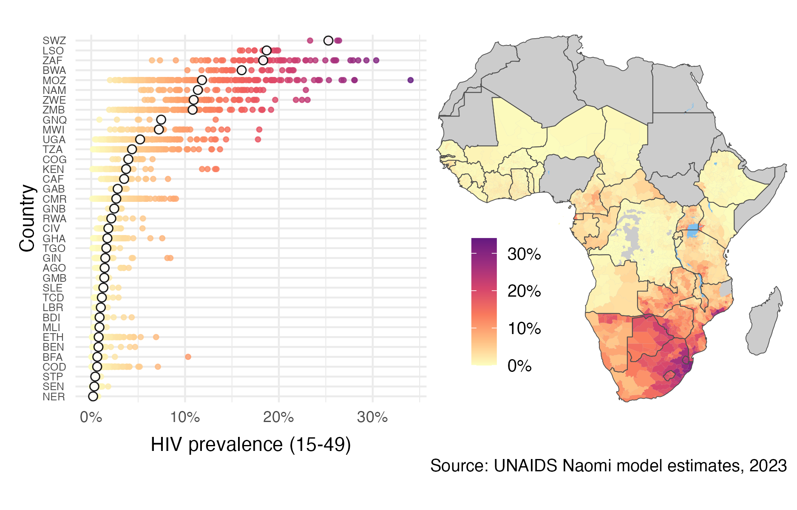

# Bayesian spatio-temporal methods for small-area estimation of HIV indicators

PhD in [Modern Statistics and Statistical Machine Learning](https://statml.io/) at Imperial College London.

Supervised by: [Seth Flaxman](https://sethrf.com/) and [Jeff Eaton](https://www.imperial.ac.uk/people/jeffrey.eaton).



## Chapters

|            | Title      | GitHub repository | Journal |
| ---------- | ---------- | -------------------- | --- |
| 1 | [Introduction](https://athowes.github.io/thesis/introduction.html) | | |
| 2 | [The HIV/AIDS epidemic](https://athowes.github.io/thesis/hiv-aids.html) | | |
| 3 | [Bayesian spatio-temporal statistics](https://athowes.github.io/thesis/bayes-st.html) | | |
| 4 | [Spatial structure](https://athowes.github.io/thesis/beyond-borders.html)  | [`beyond-borders`](https://github.com/athowes/beyond-borders) | In preparation! | 
| 5 | [A model for risk group proportions](https://athowes.github.io/thesis/multi-agyw.html)  | [`multi-agyw`](https://github.com/athowes/multi-agyw) | [PLOS Global Public Health](https://journals.plos.org/globalpublichealth/article?id=10.1371/journal.pgph.0001731) |
| 6 | [Fast approximate Bayesian inference](https://athowes.github.io/thesis/naomi-aghq.html) | [`naomi-aghq`](https://github.com/athowes/naomi-aghq) | In preparation! |
| 7 | [Future work and conclusions](https://athowes.github.io/thesis/conclusions.html) | |

## Citation

If you would like to cite this work, please use:

```
@phdthesis{howes23,
  author = {Howes, Adam},
  school = {Imperial College London},
  title = {Bayesian spatio-temporal methods for small-area estimation of HIV indicators},
  year = {2023}
}
```

## Frequently asked questions

<!--- How can I read the thesis? --->

> How did you format this thesis?

I used the R package [`thesisdown`](https://github.com/ismayc/thesisdown), inspired by [`bookdown`](https://github.com/rstudio/bookdown).

<!--- Are there any resources you'd recommend for an introduction to this area of research? --->
<!--- I'm a statistician: which parts of the thesis might interest me? --->
<!--- I'm a HIV epidemiologist: which parts of the thesis might interest me? --->
