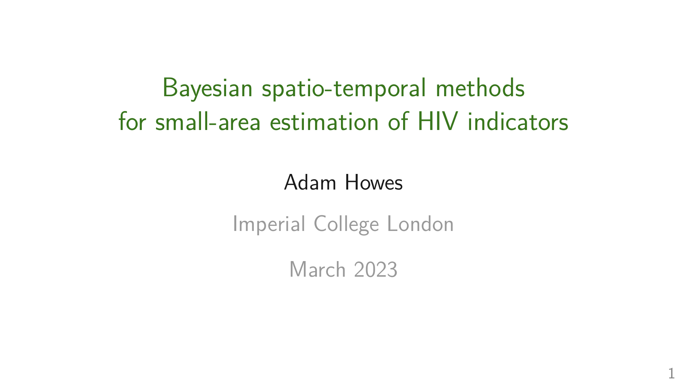

# Bayesian spatio-temporal methods for small-area estimation of HIV indicators

<!-- -->

> \[!WARNING\]  
> Thesis under construction! Currently 280 pages. There are various
> [enhancements](#enhancements) I would ideally like to make, but as
> they say “a good thesis is a done thesis”.

PhD in [Modern Statistics and Statistical Machine
Learning](https://statml.io/) at [Imperial College
London](https://www.imperial.ac.uk/).

Supervised by: [Seth Flaxman](https://sethrf.com/) and [Jeff
Eaton](https://www.imperial.ac.uk/people/jeffrey.eaton).

Progress towards ending AIDS as a public health threat by 2030 is not
being made fast enough. Effective public health response requires
accurate, timely, high-resolution estimates of epidemic and demographic
indicators. Limitations of available data and statistical methodology
make obtaining these estimates difficult. I developed and applied
Bayesian spatio-temporal methods to meet this challenge. First, I used
scoring rules to compare models for area-level spatial structure with
both simulated and real data. Second, I estimated district-level HIV
risk group proportions, enabling behavioural prioritisation of
prevention services, as put forward in the Global AIDS Strategy. Third,
I developed a novel deterministic Bayesian inference method, combining
adaptive Gauss-Hermite quadrature with principal component analysis,
motivated by the Naomi district-level model of HIV indicators. In
developing this method, I implemented integrated nested Laplace
approximations using automatic differentiation, enabling use of this
algorithm for a wider class of models. Together, the contributions in
this thesis help to guide precision HIV policy in sub-Saharan Africa, as
well as advancing Bayesian methods for spatio-temporal data.

## Chapters

|     | Title                                                                                                                        | GitHub repository                                             | Journal                                                                                                           |
|-----|------------------------------------------------------------------------------------------------------------------------------|---------------------------------------------------------------|-------------------------------------------------------------------------------------------------------------------|
| 1   | [Introduction](https://athowes.github.io/thesis/introduction.html)                                                           |                                                               |                                                                                                                   |
| 2   | [The HIV/AIDS epidemic](https://athowes.github.io/thesis/hiv-aids.html)                                                      |                                                               |                                                                                                                   |
| 3   | [Bayesian spatio-temporal statistics](https://athowes.github.io/thesis/bayes-st.html)                                        |                                                               |                                                                                                                   |
| 4   | [Models for areal spatial structure](https://athowes.github.io/thesis/beyond-borders.html)                                   | [`beyond-borders`](https://github.com/athowes/beyond-borders) | In preparation!                                                                                                   |
| 5   | [A model for risk group proportions](https://athowes.github.io/thesis/multi-agyw.html)                                       | [`multi-agyw`](https://github.com/athowes/multi-agyw)         | [PLOS Global Public Health](https://journals.plos.org/globalpublichealth/article?id=10.1371/journal.pgph.0001731) |
| 6   | [Fast approximate Bayesian inference](https://athowes.github.io/thesis/naomi-aghq.html)                                      | [`naomi-aghq`](https://github.com/athowes/naomi-aghq)         | In preparation!                                                                                                   |
| 7   | [Conclusions](https://athowes.github.io/thesis/conclusions.html)                                                             |                                                               |                                                                                                                   |
| A   | [Appendix to models for areal spatial structure](https://athowes.github.io/thesis/models-for-areal-spatial-structure.html)   |                                                               |                                                                                                                   |
| B   | [Appendix to a model for risk group proportions](https://athowes.github.io/thesis/a-model-for-risk-group-proportions.html)   |                                                               |                                                                                                                   |
| C   | [Appendix to fast approximate Bayesian inference](https://athowes.github.io/thesis/fast-approximate-bayesian-inference.html) |                                                               |                                                                                                                   |

## Slides

Slides for my thesis defense are available
[here](https://athowes.github.io/thesis/slides.pdf). They may be useful
to provide a brief overview of the research.

## Citation

If you would like to cite this work, please use:

    @phdthesis{howes23,
      author = {Howes, Adam},
      school = {Imperial College London},
      title = {Bayesian spatio-temporal methods for small-area estimation of HIV indicators},
      year = {2023}
    }

## Frequently asked questions

> How can I read the thesis?

Thanks for being interested! You can read either the
[HTML](https://athowes.github.io/thesis/) or
[PDF](https://athowes.github.io/thesis/main.pdf) version. I know, an
overwhelming choice. It’s still a work in progress at the moment though,
so I’d recommend checking back in January 2024 (post-submission) or
March 2024 (post-defense) unless you love non-sequiturs.

> How did you format this thesis?

I used the R package
[`thesisdown`](https://github.com/ismayc/thesisdown), inspired by
[`bookdown`](https://github.com/rstudio/bookdown). So far it has been
working relatively seamlessly, so I’d recommend it! I’ve found `gt`
together with `knitr::is_html_output` and `knitr::is_latex_output` works
well to present tables nicely in multiple formats.

> Are there any resources you’d recommend for an introduction to this
> area of research?

I’d recommend something like [Spatial and Spatio-temporal Bayesian
models with `R-INLA`](https://sites.google.com/a/r-inla.org/stbook/) by
Marta Blangiardo and Michela Cameletti. I have a repository with further
miscellaneous recommended
[resources](https://github.com/athowes/resources), if you are
interested.

> I’m a statistician: which parts of the thesis might interest me?

If you use spatial random effects to model areal spatial structure,
[Chapter 4](https://athowes.github.io/thesis/beyond-borders.html). This
chapter uses a variety of model comparison techniques (scoring rules,
coverage assessments, information criteria) that may also be of
interest. If you’re interested in modelling multinomial data using the
multinomial-Poisson transformation and structured random effects,
[Chapter 5](https://athowes.github.io/thesis/multi-agyw.html). If you
have a complicated model which is not compatible with `R-INLA`, but
would still like to use INLA-like methods, [Chapter
6](https://athowes.github.io/thesis/naomi-aghq.html). If you have such a
model, get in touch! All of the methods are compatible with any model
written in the (very general) [Template Model
Builder](https://kaskr.github.io/adcomp/Introduction.html) R package
(`TMB`).

> I’m a HIV epidemiologist: which parts of the thesis might interest me?

Primarily [Chapter 5](https://athowes.github.io/thesis/multi-agyw.html)
will be of interest to you. The [Global AIDS
Strategy](https://www.unaids.org/en/Global-AIDS-Strategy-2021-2026) sets
out goals for prioritisation of prevention programming for adolescent
girls and young women according to risk behaviour and epidemic setting.
To enable implementation of the strategy, I estimated risk group
specific population sizes, prevalence and incidences at a
district-level. I also used these estimates to evaluate the extent to
which risk varies by age, behaviour, and geographic area. You might also
be interested in the analysis in [Chapter
6](https://athowes.github.io/thesis/naomi-aghq.html) applying the Naomi
small-area estimation model to data from Malawi.

## Enhancements

Here are some enhancements I think could improve the thesis, given more
time to work on it:

- In Chapter 2, the sections about challenges and statistical approaches
  used to overcome those challenges could be 1) better connected to the
  work done in the thesis, and 2) better integrated with existing
  literature. Doing so is relatively challenging 1) because this chapter
  precedes proper introduction of the methods used in this thesis, and
  is instead meant to provide a high-level overview, and 2) because the
  statistical approaches described e.g. “borrowing information” are
  relatively general and would be difficult, though not impossible, to
  credit to any particular works.
- A more thorough description of the approximations to the Laplace
  approximation used by [Rue, Martino, and Chopin
  (2009)](https://rss.onlinelibrary.wiley.com/doi/10.1111/j.1467-9868.2008.00700.x)
  and [Wood
  (2020)](https://academic.oup.com/biomet/article-abstract/107/1/223/5572662).
  It would be instructive to implement these approximations for a simple
  example.
- For all figures showing the use of a quadrature rule, it could be
  informative to compute and display the resulting integral estimate.
  When compared to a known truth, this would make demonstrate the value
  of e.g. adaption.
- Inclusion of some broader discussion of the value of automatic
  differentiation for INLA-like inference strategies. See the
  conversation I began
  [here](https://groups.google.com/g/r-inla-discussion-group/c/avPWD5ED0NM/m/b94kaaUVAgAJ)
  on the `R-INLA` Google group.
- Further detail about how automatic differentation works might be
  helpful. This could include a simple example. See this nice blog post
  [“symbolic differentaition in a few lines of
  code”](https://reside-ic.github.io/blog/symbolic-differentiation-in-a-few-lines-of-code/)
  by Rich FitzJohn.
- The simulation study in Chapter 4 was run using 250 replicates. As you
  can see from the plots showing the mean and standard errors, this
  sample size was insufficient to distinguish between models in some
  cases. All the more so zooming into single areas. It would be
  relatively simple to increase the sample size here, but this wasn’t
  done in the interests of time.
- For the simulation study on the four vignette geometries, the
  lengthscale priors are mis-specified with respect to the true
  lengthscale. This seems like an odd choice. Likely these experiments
  should be rerun simulating data from a more suitable lengthscale than
  the value 2.5 used currently.
- In Chapter 5, too little emphasis is placed on the HIV prevalence and
  HIV incidence results as compared to the HIV risk group results. For
  example, continental chloropleths could be produced for the these
  epidemiological quantities as well.
- Although the epilepsy example shows that the INLA results from `TMB`
  are highly comparable to `R-INLA`, they are not exactly the same. As
  such it would be valuable to provide an explanation for the possible
  causes. The best source of information about this is [Osgood-Zimmerman
  and Wakefield
  (2022)](https://onlinelibrary.wiley.com/doi/abs/10.1111/insr.12534).
- In Chapter 4, it would be useful to frame the Besag model (and BYM2,
  if possible) in terms of an equivalent kernel. I believe that the
  technical vignette [Paciorek
  (2008)](https://www.stat.berkeley.edu/users/paciorek/research/techVignettes/techVignette2.pdf)
  does this.
