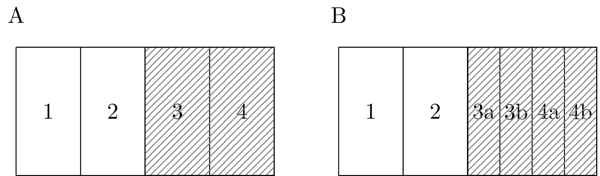
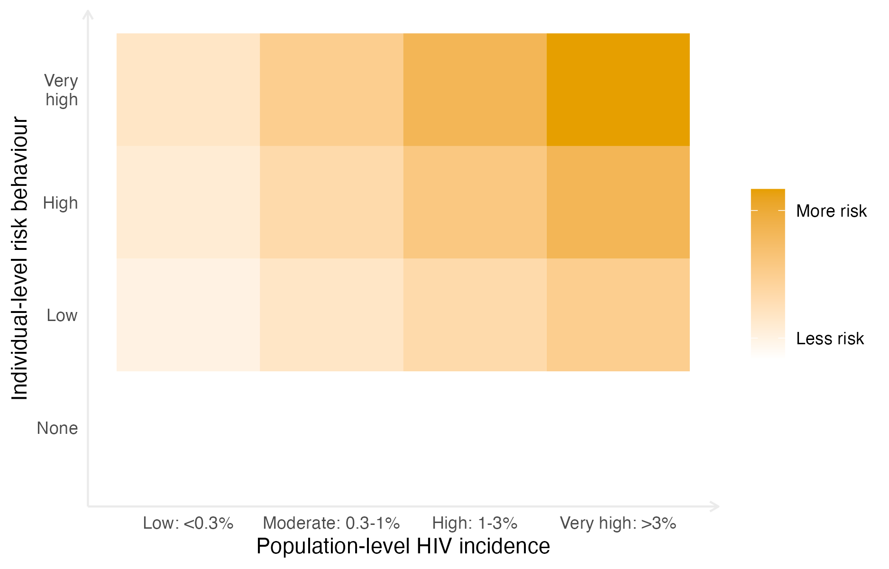
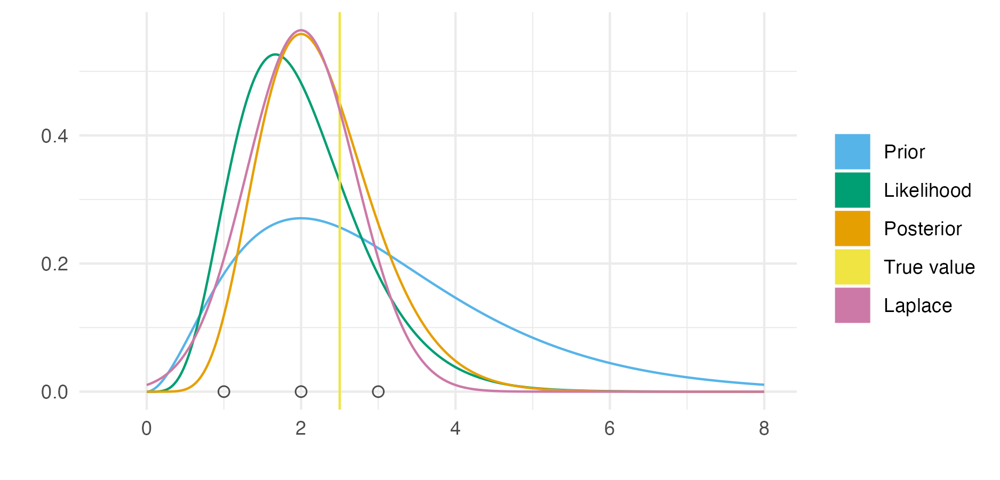
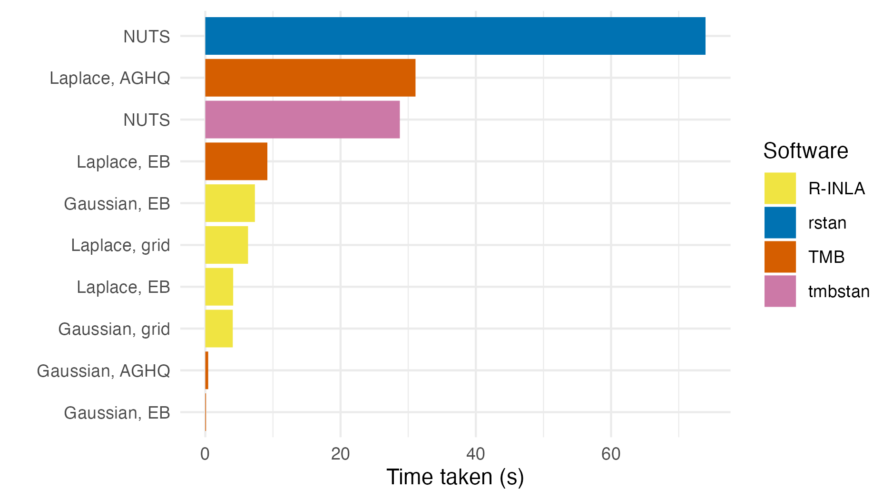

---
#####################
## thesis metadata ##
#####################
title: |
  Bayesian spatio-temporal methods for small-area estimation of HIV indicators
author: Adam Howes
college: Department of Mathematics
university: |
  Imperial College London
university-logo: templates/ic-small.pdf
submitted-text: In partial fulfillment of the requirements for the degree of
degree: Doctor of Philosophy
degreedate: December 2023
copyright: |
  `r paste(readLines("front-and-back-matter/_copyright.Rmd"), collapse = '\n  ')`
originality: |
  `r paste(readLines("front-and-back-matter/_originality.Rmd"), collapse = '\n  ')`
abstract: |
  `r paste(readLines("front-and-back-matter/_abstract.Rmd"), collapse = '\n  ')`
acknowledgements: |
  `r paste(readLines("front-and-back-matter/_acknowledgements.Rmd"), collapse = '\n  ')`
dedication: \textit{For someone, or something.}
abbreviations: "front-and-back-matter/abbreviations" # path to .tex file with abbreviations
notations: "front-and-back-matter/notations"

#######################
## bibliography path ##
#######################
bibliography: references.bib

########################
## PDF layout options ###
#########################
## submitting a master's thesis ##
# set masters-submission: true for an alternative, anonymous title page with 
# candidate number and word count
masters-submission: false
candidate-number: 1
word-count: 0

# if you want to use a different title page altogether, provide a path to a 
# .tex file here and it will override the default Oxford one
# alternative-title-page: front-and-back-matter/alt-title-page-example.tex

## correction highlighting ##
corrections: true

## binding / margins ##
page-layout: nobind # 'nobind' for equal margins (PDF output), 'twoside' for two-sided binding (mirror margins and blank pages), leave blank for one-sided binding (left margin > right margin)

## position of page numbers ##
ordinary-page-number-foot-or-head: foot # 'foot' puts page number in footer, 'head' in header
ordinary-page-number-position: C  # C = center, R = right, L = left. If page layout is 'twoside', O = odd pages and E = even pages. E.g. RO,LE puts the page number to the right on odd pages and left on even pages
chapter-page-number-foot-or-head: foot # you may want it to be different on the chapter pages
chapter-page-number-position: C

## position of running header ##
running-header: true # indicate current chapter/section in header?
running-header-foot-or-head: head
running-header-position-leftmark: LO # marks the chapter. If layout is 'nobind', only this is used.
running-header-position-rightmark: RE  # marks the section.

draft-mark: false # add a DRAFT mark?
draft-mark-foot-or-head: foot ##'foot' = in footer, 'head' = in header
draft-mark-position: C

## section numbering ##
section-numbering-depth: 2 # to which depth should headings be numbered?

## tables of content ##
toc-depth: 1 # to which depth should headings be included in table of contents?
lof: true # include list of figures in front matter?
lot: true # include list of tables in front matter?
mini-toc: true  # include mini-table of contents at start of each chapter? (this just prepares it; you must also add \minitoc after the chapter titles)
mini-lot: false  # include mini-list of tables by start of each chapter?
mini-lof: false  # include mini-list of figures by start of each chapter?

## code block spacing ##
space-before-code-block: 10pt
space-after-code-block: 8pt

## linespacing ##
linespacing: 22pt plus2pt # 22pt is official for submission & library copies
frontmatter-linespacing: 17pt plus1pt minus1pt #spacing in roman-numbered pages (acknowledgments, table of contents, etc.)

### other stuff ###
abstractseparate: false  # include front page w/ abstract for examination schools?
hidelinks: true # false to highlight clickable links with a colored border

### citation and bibliography style ###
bibliography-heading-in-pdf: Works Cited

# biblatex options #
# unless you run into 'biber' error messages, use natbib as it lets you customise your bibliography directly
use-biblatex: true
bib-latex-options: "style=authoryear, sorting=nyt, backend=biber, maxcitenames=2, useprefix, doi=true, isbn=false, uniquename=false" #for science, you might want style=numeric-comp, sorting=none for numerical in-text citation with references in order of appearance

# natbib options #
# natbib runs into fewer errors than biblatex, but to customise your bibliography you need to fiddle with .bst files
use-natbib: false # to use natbib, set this to true, and change "output:bookdown::pdf_book:citation_package:" to "natbib"
natbib-citation-style: authoryear #for science, you might want numbers,square
natbib-bibliography-style: ACM-Reference-Format #or plainnat or some .bst file you download

#####################
## output options  ##
#####################
output:
  bookdown::pdf_book:
    citation_package: biblatex
    template: templates/template.tex
    keep_tex: true
    pandoc_args: "--lua-filter=scripts_and_filters/colour_and_highlight.lua"
  bookdown::bs4_book: 
    css: 
      - templates/bs4_style.css
      - templates/corrections.css # remove to stop highlighting corrections
    theme:
      primary: "#6D1919"
    repo: https://github.com/ulyngs/oxforddown
    pandoc_args: "--lua-filter=scripts_and_filters/colour_and_highlight.lua"
  bookdown::gitbook:
    css: templates/style.css
    config:
      sharing:
        facebook: false
        twitter: yes
        all: false
  bookdown::word_document2:
    toc: true   
link-citations: true
documentclass: book
always_allow_html: true #this allows html stuff in word (.docx) output
# The lines below make the 'knit' button render the whole thesis to PDF, HTML, or Word
# When outputting to PDF, you can clean up the files LaTeX generates by running 
# 'file.remove(list.files(pattern = "*.(log|mtc|maf|aux|bbl|blg|xml)"))' in the R console
#knit: (function(input, ...) {bookdown::render_book(input, output_format = "bookdown::pdf_book")})
#knit: (function(input, ...) {bookdown::render_book(input, output_format = "bookdown::bs4_book")})
knit: (function(input, ...) {bookdown::render_book(input, output_format = "bookdown::gitbook")})
#knit: (function(input, ...) {bookdown::render_book(input, output_format = "bookdown::word_document2")})
---


```{r install_packages, include=FALSE}
source('scripts_and_filters/install_packages_if_missing.R')
```

```{r create_chunk_options, include=FALSE, eval=knitr::is_latex_output()}
source('scripts_and_filters/create_chunk_options.R')
source('scripts_and_filters/wrap_lines.R')
```

<!--
Include the create_chunk_options chunk above at the top of your index.Rmd file
This will include code to create additional chunk options (e.g. for adding author references to savequotes)
and to make sure lines in code soft wrap
If you need to create your own additional chunk options, edit the file scripts/create_chunk_options.R
-->

<!-- This chunk includes the front page content in HTML output -->
```{r ebook-welcome, child = 'front-and-back-matter/_welcome-ebook.Rmd', eval=knitr::is_html_output()}
```

<!--chapter:end:index.Rmd-->

---
#########################################
# options for knitting a single chapter #
#########################################
output:
  bookdown::pdf_document2:
    template: templates/brief_template.tex
    citation_package: biblatex
  bookdown::html_document2: default
  bookdown::word_document2: default
documentclass: book
bibliography: references.bib
---

```{r echo = FALSE}
options(scipen = 100)

knitr::opts_chunk$set(
  echo = FALSE,
  warning = FALSE,
  message = FALSE,
  dpi = 320,
  cache = TRUE,
  out.width = "95%",
  fig.align = 'centre'
)
```

# Introduction
\adjustmtc
\markboth{Introduction}{}
<!-- For PDF output, include these two LaTeX commands after unnumbered chapter headings, otherwise the mini table of contents and the running header will show the previous chapter -->

```{r}
custom_numbers_to_words <- function(number) {
  powers <- c(3, 6, 9, 12)
  
  if (number == 0) {
    return("0")
  }
  
  sign <- ifelse(number < 0, -1, 1)
  number <- abs(number)
  
  for (power in powers) {
    scaled_number <- number / 10^power
    if (scaled_number >= 1 && scaled_number < 1000) {
      suffix <- gsub("^one\\s", "", xfun::numbers_to_words(10^power))
      return(paste0(sign * scaled_number, " ", suffix))
    }
  }
  
  return("Number out of range.")
}

esa_plhiv2022 <- 20.8 * 1e6
wca_plhiv2022 <- 4.8 * 1e6
ssa_plhiv2022 <- esa_plhiv2022 + wca_plhiv2022

plhiv2022 <- 39 * 1e6

ssa_pop2022 <- 1.2 * 1e9 #' From the world bank
```

This thesis is about applied and methodological Bayesian statistics.
It is applied and methodological in that I am concerned with real world questions and the means to answer them.
The statistical approach is Bayesian because I use probability theory to arrive at conclusions based on models for observed data.

(ref:gbd) HIV/AIDS is the largest cause of annual DALYs among individuals aged >1 year in SSA [@ihme2019]. One DALY represents the loss of the equivalent of one year of full health, and is calculated by the sum of years of life lost and years lost due to disability. Weights used to account for disability vary between 0 (full health) and 1 (death) depending on severity of the condition.

```{r gbd, fig.cap="(ref:gbd)"}
knitr::include_graphics("figures/introduction/gbd.png")
```

The applied focus of this thesis is in obtaining the strategic information needed to plan the response to the human immunodeficiency virus (HIV) epidemic in sub-Saharan Africa (SSA).
Over 40 years since the beginning of the epidemic, HIV is the largest annual cause of disability adjusted life years (DALYs) in SSA among non-infants [@ihme2019; Figure \@ref(fig:gbd)].
Quantification of the epidemic using statistics is an important part of the public health response.
Effective implementation of HIV prevention and treatment requires strategic information.
However, producing suitable estimates of relevant indicators is made difficult by a range of statistical challenges.

The data I use were gathered in national household surveys or routinely collected from healthcare facilities providing HIV services.
An important feature of these data are the location and time at which each observation was recorded.
Spatio-temporal data occur across a range of application settings.
While diverse in setting, they have distinctive recurring commonalities which make their collective study worthwhile.
The work conducted in this thesis makes use of, and aspires to contribute to, techniques from spatio-temporal statistics.

Computation is an essential part of modern statistical practice.
Each project in this thesis, and the thesis itself, is accompanied by R [@r] code, hosted on GitHub at [`https://github.com/athowes`](https://github.com/athowes).

## Chapter overview

This thesis is structured as follows:

* Chapter \@ref(hiv-aids) provides an overview of the HIV/AIDS epidemic, and describing the challenges faced by disease surveillance efforts.
* Chapter \@ref(bayes-st) introduces the statistical concepts and notation used throughout the thesis, focusing on Bayesian modelling and computation, spatio-temporal statistics, and survey methods.
* Chapter \@ref(beyond-borders): The prevailing model for spatial structure used in small-area estimation [@besag1991bayesian] was intended to analyse a grid of pixels.
In disease mapping, we work using the districts of a country, which are typically not a grid.
I evaluated the practical consequences of this concern [@howes2023beyond].
* Chapter \@ref(multi-agyw): Adolescent girls and young women are a demographic group at disproportionate risk of acquiring HIV infection.
The Global AIDS Strategy recommends prioritising interventions on the basis of behaviour to prevent the most new infections using available resources.
I estimated the size of behavioural risk groups across priority countries to enable implementation of this strategy, and assessed the potential benefits in terms of numbers of new infections prevented [@howes2023spatio].
This work was included in the UNAIDS Global AIDS Update 2022 and 2023.
* Chapter \@ref(naomi-aghq): The Naomi small-area estimation model [@eaton2021naomi] is used by countries to estimate district-level HIV indicators.
First, I implemented the integrated nested Laplace approximations using automatic differentiation, such that the method is compatible with Naomi, opening the door to a new class of fast, flexible, and accurate Bayesian inference algorithms.
Second, I developed an approximate Bayesian inference method combining adaptive Gauss-Hermite quadrature with principal components analysis [@howes2023fast].
I applied these method to data from Malawi, and analysed the consequences of inference method choice for policy relevant outcomes.
* Chapter \@ref(conclusions): Finally, I discuss avenues for future work, and my conclusions regarding the research, as well as its strengths and weaknesses.

Though chronological order is recommended, Chapters \@ref(beyond-borders), \@ref(multi-agyw) and \@ref(naomi-aghq) may be read in any order.

<!--chapter:end:01-introduction.Rmd-->

---
#########################################
# options for knitting a single chapter #
#########################################
output:
  bookdown::pdf_document2:
    template: templates/brief_template.tex
    citation_package: biblatex
  bookdown::html_document2: default
  bookdown::word_document2: default
documentclass: book
bibliography: references.bib
---

```{r echo = FALSE}
options(scipen = 100)

knitr::opts_chunk$set(
  echo = FALSE,
  warning = FALSE,
  message = FALSE,
  dpi = 320,
  cache = TRUE,
  out.width = "95%",
  fig.align = 'centre'
)
```

# The HIV/AIDS epidemic {#hiv-aids}
\adjustmtc
\markboth{The HIV/AIDS epidemic}{}
<!-- For PDF output, include these two LaTeX commands after unnumbered chapter headings, otherwise the mini table of contents and the running header will show the previous chapter -->

```{r}
deaths <- 40 * 1e6
infections <- 86 * 1e6

plhiv2022 <- 39 * 1e6
deaths2022 <- 630 * 1e3
infections2022 <- 1.3 * 1e6

coverage2022 <- 76
```

## Background {#background}

<!-- What is HIV -->
HIV is a retrovirus which infects humans.
If untreated, HIV can develop into a more advanced stage known as acquired immunodeficiency syndrome (AIDS).
HIV primarily attacks a type of white blood cell vital for the function of the immune system.
As a result, AIDS is characterised by increased risk of developing opportunistic infections such as tuberculosis or *Pneumocystis* pneumonias, which can result in death.

<!-- HIV is a big problem, plus how is it transmitted -->
The first AIDS cases were reported in Los Angeles in the early 1980s [@gottlieb1981pneumocystis; @barre1983isolation].
Since then, HIV has spread globally.
Transmission occurs by exposure to specific bodily fluids of an infected person.
The most common mode of transmission is via unprotected anal or vaginal sex, though transmission can also occur from a mother to her baby, or when drug injection equipment is shared.
Approximately `r custom_numbers_to_words(infections)` people have become infected with HIV, and of those `r custom_numbers_to_words(deaths)` have died of AIDS-related causes.

```{r}
pepfar <- 100 * 1e9
#' From https://www.theglobalfund.org/en/hivaids/
global_fund <- round((24.2 + 5)) * 1e9
```

<!-- A lot of effort going into it -->
An ongoing global and multifaceted effort has been made to respond to the epidemic.
The response has been shaped by local communities, civil society organisations, national governments, research institutions, pharmaceutical companies, international agencies like the Joint United Nations Programme
on HIV/AIDS (UNAIDS), and global health initiatives such like the President's Emergency Plan for AIDS Relief (PEPFAR) and the Global Fund to Fight AIDS, Tuberculosis, and Malaria (the Global Fund).
To give an indication as to the scale of the response, the investment of $`r custom_numbers_to_words(pepfar)` by PEPFAR constitutes the "largest commitment by a single nation to address a single disease in history" [@pepfar2022].

```{r}
#' From https://www.unaids.org/en/resources/presscentre/featurestories/2021/september/20210906_global-roll-out-hiv-treatment
art_deaths_averted <- 21 * 1e6
condom_infections_averted <- 117 * 1e6
vmmc_infections_averted <- 340 * 1e3
```

(ref:overall-picture) Globally, yearly new HIV infections peaked in 1995, and have since decreased by 59% and yearly AIDS-related deaths peaked in 2004, and have since decreased by 68% [@unaids2023aidsinfo]. Much of the disease burden is concentrated in eastern and southern Africa, as well as western and central Africa.

```{r overall-picture, fig.cap="(ref:overall-picture)"}
knitr::include_graphics("figures/hiv-aids/overall-picture.png")
```

<!-- The effort has translated into progress -->
Implementation of HIV prevention and treatment has significantly reduced the number of new HIV infections and AIDS-related deaths per year since their peak (Figure \@ref(fig:overall-picture)).
The most significant evidence-based interventions, in chronological order of their introduction, are described below:

* Condoms are an inexpensive and effective method for prevention of HIV and other sexually transmitted infections (STIs) such as *Chlamydia trachomatis*, *Neisseria gonorrhoeae*, syphilis, and *Trichomonas vaginalis*.
Condom usage has increased significantly since 1990, which is estimated to have averted `r custom_numbers_to_words(condom_infections_averted)` new HIV infections [@stover2021impact].
There remain significant but difficult to close gaps in condom usage.

* Antiretroviral therapy (ART) is a combination of drugs which stop the virus from replicating in the body.
A person living with HIV who takes ART daily can live a full and healthy life, transforming what was once a terminal illness to a treatable chronic condition.
Of the `r custom_numbers_to_words(plhiv2022)` people living with HIV (PLHIV) in 2022, around `r coverage2022`% were accessing ART.
The number of AIDS-related deaths, `r custom_numbers_to_words(art_deaths_averted)`, estimated to have been averted by ART is staggering [@unaids2023global].

  ART reduces the amount of virus in the blood and genital secretions.
  If the virus is undetectable then there is significant evidence that it cannot be transmitted sexually [@cohen2011prevention; @broyles2023risk].
  For this reason, in addition to providing life saving treatment, ART also operates as prevention.
  Approaches to lowering risk of HIV transmission using treatment are referred to as treatment as prevention (TaSP).
  Particular efforts have been made to provide pregnant women with ART to reduce the chance of mother-to-child transmission (MTCT) [@siegfried2011antiretrovirals].

* Voluntary medical male circumcision (VMMC) partially protects against female-to-male HIV acquisition.
Three landmark randomised control trials [@auvert2005randomized; @gray2007male; @bailey2007male] found complete surgical removal of the foreskin to result a reduction of HIV acquisition in men by 50-60%.
Based on this evidence, VMMC has been recommended since 2007 by the World Health Organization (WHO) and UNAIDS as a key HIV intervention in high-prevalence settings.
Scale up of VMMC across 15 priority countries between 2008 and 2019 is estimated to have already averted `r custom_numbers_to_words(vmmc_infections_averted)` new HIV infections, though the future number of new HIV infections averted is likely to be much higher.

* Pre-exposure prophylaxis (PrEP) and post-exposure prophylaxis (PEP) are antiretrovial drugs which can be taken before and after exposure to prevent transmission.
PrEP and PEP are more costly than some other prevention options, so primarily useful in high risk settings.

Though important progress had been made, facilitated by the interventions above, there remains much more to do.
In 2022, `r custom_numbers_to_words(infections2022)` people were newly infected with HIV and there were `r custom_numbers_to_words(deaths2022)` AIDS-related deaths, more than one every minute [@unaids2022global].
Bold fast-track targets have been set to accelerate the end of AIDS as global public health threat by 2030.
To meet these targets in the context of disruption to HIV services caused by the COVID-19 pandemic and a potential shortfall in HIV funding, renewed commitments are required [@economist2023triple].

(ref:naomi-continent) Adult (15-49) HIV prevalence varies substantially both within and between countries in SSA. The estimates from 2023 were generated by country teams using the Naomi small-area estimation model in a process supported by UNAIDS, and are available from @unaids2023aidsinfo. White filled points are country-level estimates, and coloured points are district-level estimates. Results from Nigeria were not published. Data collection in the Cabo Delgado province of Mozambique was disrupted by conflict. Obtaining results for the Democratic Republic of the Congo required removing some districts from the model.

```{r naomi-continent, fig.cap="(ref:naomi-continent)"}
knitr::include_graphics("figures/hiv-aids/naomi-continent.png")
```

<!-- Prioritisation of interventions  -->
For available resources to have the greatest impact, it is important that the right HIV interventions to be prioritised to the right populations, in the right place, and at the right time.
This paradigm has been termed precision public health [@khoury2016precision], by analogy to precision medicine.
While precision medicine tailors treatment to the individual, precision public health tailors treatment to the population.
Differences in the cost-effectiveness of any given intervention can be vast, with some interventions orders of magnitude more impactful than others [@ord2013moral].

<!-- Uneven burden in space -->
Disease burden varies substantially across multiple spatial scales.
In some countries, the epidemic is concentrated in small populations, and national HIV prevalence is low.
In others, the epidemic is sustained by heterosexual transmission, and national HIV prevalence is higher (typically >1%)
These two epidemic settings are sometimes described as concentrated and generalised, respectively.
Most of the countries severely affected by HIV are in sub-Saharan Africa (SSA).
It is estimated that `r round(ssa_plhiv2022 / plhiv2022 * 100)`% of the `r custom_numbers_to_words(plhiv2022)` PLHIV worldwide live in SSA.
Adult HIV prevalence (ages 15-49) is above than 10% (Figure \@ref(fig:naomi-continent)) in some countries in southern Africa, with some districts even exceeding 20%.
Just as there is variation between countries, there is variation within countries.
For example, adult HIV prevalence at the district municipality level in South Africa ranges from `r 6`% in Namakwa to `r 30`% in uMkhanyakude.

<!-- Uneven burden across people -->
In all countries and contexts, some groups of people are at much higher risk than others.
Groups of people at increased risk of HIV infection are known as key populations (KPs).
Examples include men who have sex with men (MSM), female sex workers (FSW), people who inject drugs (PWID), and transgender people (TGP) [@stevens2022key].
KPs are often marginalised, and face legal and social barriers.
Concentrated settings are defined by the majority of new HIV infections occurring in KPs and their sexual partners.
In generalised settings like SSA, risk is more diffuse across the population.
For example, in SSA adolescent girls and young women (AGYW) are a large demographic group at increased risk of HIV infection [@risher2021age; @monod2023growing] but not typically considered a KP.
That said, concentrated subepidemics often occur within what are nominally generalised settings [@tanser2014concentrated].

<!-- Practical methods for prevention prioritisation: what is being done and is it working -->
Various methods can be used to implement differentiatated HIV treatment and prevention services.
These include geographic and demographic prioritisation, key population services, and risk screening based on individual-level risk characteristics.

## HIV surveillance {#surveillance}

<!-- What is surveillance and how can it be used to meet these needs -->
HIV surveillance refers to the collection, analysis, interpretation and dissemination of data relating to HIV [@pisani2003hiv].
Surveillance can used to track epidemic indicators, identify at-risk populations, find drivers of transmission, and evaluate the impact of prevention and treatment programs.
Important indicators include:

* **HIV prevalence** is the proportion $\rho \in [0, 1]$ of a population who have HIV.
The number of PLHIV is given by $N\rho$, where $N$ is the (living) population size.
Increases in HIV prevalence, or the number of PLHIV, can be caused by either new HIV infections or more PLHIV remaining alive by taking treatment.
For this reason care must be taken in directly interpreting changes in HIV prevalence.
As a key measure of population disease burden, HIV prevalence is used to calculate all of the other indicators given below.

* **HIV incidence** is the rate $\lambda > 0$ of new HIV infections, often written as number of new infections per 1000 person years.
The number of new HIV infections that occur during a given time is the integral of HIV incidence multiplied by the size of the susceptible population.
Let $\rho_t$ be the HIV prevalence, and $N_t$ be the population size, at time $t$.
Then the number of new HIV infections which occur in a given period of time are given by
$$
I = \int \lambda_t \cdot (1 - \rho_t) \cdot N_t \text{d}t.
$$
Planning, delivery, and evaluation of prevention programming relies on estimates of HIV incidence and the number of new HIV infections.

* **ART coverage** is the proportion $\alpha \in [0, 1]$ of PLHIV who are on ART.
Estimates of ART coverage play a direct role in planning the provision of treatment services.
The number of people taking ART is given by $N \cdot \rho \cdot \alpha$.

* **Recent infection** is the proportion $\kappa \in [0, 1]$ of PLHIV who have been recently infected.
Recent infection can be used to help estimate HIV incidence.

* **Awareness of status** is the proportion $\xi \in [0, 1]$ of PLHIV who have been diagnosed with HIV.
Programming of HIV testing and diagnosis is informed by awareness of status.

### Data

Data are used to estimate the above HIV indicators, in conjunction with scientific knowledge.
Multiple sources of data are used:

* **Household surveys** are large, national cross-sectional studies.
The Demographic and Health Surveys (DHS) Program.
Population-based HIV Impact Assessments (PHIA).
Household surveys provide nationally-representative high quality standardised data about HIV.

* **Programmatic data** refer to data routinely collected during delivery of health services.
Examples include data from antenatal care (ANC) HIV testing and ART service delivery.
Programmatic data are more regularly available than other data sources.
However, the control that can be exercised over collection of programmatic data is limited.
As a result, issues of data quality and reliability, as well as bias, are common in working with programmatic data.

* **Cohort studies** follow a group of people over time.
Outcomes may be measured more systematically in a cohort study than in other study designs.
The data from cohort studies are used to inform otherwise difficult to estimate epidemiological parameters.
Examples of such parameters include disease progression and mortality rates, transmission dynamics, and treatment outcomes.
Population-based cohort studies relevant to the SSA setting include Manicaland, Zimbabwe [@gregson2006hiv]; Rakai, Uganda [@grabowski2017hiv].

<!-- Discuss methods for HIV testing -->

### Challenges

Obtaining reliable, timely estimates at an appropriate spatial resolution is challenging.
The most significant difficulties faced are:

1. **Data sparsity**:
Collection of data is costly and time consuming.
As a result, limited direct data might be available for the particular time, location, or population of interest.
For example, in many countries the last conducted household survey is several years out of date.

2. **Missing data**:
The sampling frame of a survey may not correspond to the target population.
For example, many KPs are difficult to reach, and may be omitted from sampling frames.
Individuals included on the sampling frame may choose not to respond.
All surveys are subject to sampling error, as only a subset of the target population are sampled.
Each of these issues can be characterised as being problems of missing data.
I characterise missing data as referring to the shortfalls of any given study, and data sparsity as referring to limited availability of studies. 

3. **Response and measurement biases**:
Individuals may be hesitant to disclose their HIV status, or report higher risk behaviours, due to social desirability bias or a fear of discrimination or stigma.
When available, biomarker data can be used to overcome under-reporting, but still may be subject to measurement errors.

4. **Denominators and demography**:
Many indicators are rates or proportions, which rely on estimates of the population at risk in the denominator.
Accurately estimating population denominators is itself a challenging task [@tatem2017worldpop].
Taking a ratio of uncertain quantities amplifies uncertainty, but is rarely properly accounted for.

5. **Inconsistent data collection and reporting**:
The types of data that are collected might vary across space and time.
Reporting protocols or definitions can also change.

6. **Reliance on epidemiological parameters**:
Indicators rely on estimates of epidemiological parameters such as rates of disease progression.
These parameters may not generalise to the setting of interest.
Further, they are typically applied coarsely, and without proper accounting for uncertainty.

### Statistical approaches

The challenges above make direct interpretation of the data often misleading or impossible.
Careful statistical modelling is required to overcome these limitations as best as possible.

1. **Borrowing information**:
When little direct data are available, data judged to be indirectly related can be used to help improve estimation.
For example, if limited data are available for individuals of a certain age, it is likely reasonable to make use of data for individuals of a similar age.
As well as over age groups, information can be borrowed between and within countries, and across times.

2. **Evidence synthesis**:
Multiple sources of evidence can be combined to overcome the limitations of any one data source.
For example, infrequently run household surveys can be complemented by more up-to-date programmatic data.

3. **Expert guidance**:
Expert epidemiological, demographic, and local stakeholder guidance can be used to improve estimates.
Ensuring the quality of any data used in the estimation process is essential.

4. **Uncertainty quantification**:
Conclusions drawn by synthesising multiple incomplete data sources are unlikely to be firm and unanimous.
It is therefore particularly that the uncertainties inherent to any statistical analysis are accurately and transparently presented.

<!--chapter:end:02-hiv-aids.Rmd-->

---
#########################################
# options for knitting a single chapter #
#########################################
output:
  bookdown::pdf_document2:
    template: templates/brief_template.tex
    citation_package: biblatex
  bookdown::html_document2: default
  bookdown::word_document2: default
documentclass: book
bibliography: references.bib
---

```{r echo = FALSE}
options(scipen = 100)

knitr::opts_chunk$set(
  echo = FALSE,
  warning = FALSE,
  message = FALSE,
  dpi = 320,
  cache = TRUE,
  out.width = "95%",
  fig.align = 'center'
)
```

# Bayesian spatio-temporal statistics {#bayes-st}
\adjustmtc
\markboth{Bayesian spatio-temporal statistics}{}
<!-- For PDF output, include these two LaTeX commands after unnumbered chapter headings, otherwise the mini table of contents and the running header will show the previous chapter -->

## Bayesian statistics

Bayesian statistics is a mathematical paradigm for learning from data.
It is especially well suited to facing the challenges presented in Section \@ref(surveillance) for the following reasons.
First, because it allows for principled and flexible integration of prior domain knowledge.
Second, because uncertainty over all unknown quantities is handled as an integral part of the Bayesian paradigm.
This section provides a brief and at times opinionated overview of Bayesian statistics.
For a more complete introduction, I recommend @gelman2013bayesian, @mcelreath2020statistical or @gelman2020bayesian.

### Bayesian modelling

The Bayesian approach to data analysis is based on construction of a probability model for the observed data $\mathbf{y} = (y_1, \ldots, y_n)$.
Parameters $\boldsymbol{\mathbf{\phi}} = (\phi_1, \ldots, \phi_d)$ are used to describe features of the data.
Both the data and parameters are assumed to be random variables, with joint probability distribution written as $p(\mathbf{y}, \boldsymbol{\mathbf{\phi}})$.
Subsequent calculations, and the conclusions to follow, are made by manipulating the model using probability theory.

Models are most naturally constructed from two parts known as the likelihood $p(\mathbf{y} \, | \, \boldsymbol{\mathbf{\phi}})$ and the prior distribution $p(\boldsymbol{\mathbf{\phi}})$.
The joint distribution is obtained by the product of these two parts
\begin{equation}
p(\mathbf{y}, \boldsymbol{\mathbf{\phi}}) = p(\mathbf{y} \, | \, \boldsymbol{\mathbf{\phi}}) p(\boldsymbol{\mathbf{\phi}}). (\#eq:joint)
\end{equation}
The likelihood, as a function of $\boldsymbol{\mathbf{\phi}}$ with $\mathbf{y}$ fixed, reflects the probability of observing the data when the value of the parameters is $\boldsymbol{\mathbf{\phi}}$.
The prior distribution encapsulates beliefs about the parameters $\boldsymbol{\mathbf{\phi}}$ before the data are observed.

Recommendations for specifying prior distributions vary.
A central issue is the extent to which subjective information should be incorporated into the prior distribution.
Proponents of the objective Bayesian paradigm [@berger2006case] put forward that the prior distribution should be non-informative, so as not to introduce subjectivity into the analysis.
Others see subjectivity as fundamental to scientific inquiry, with no viable alternative [@goldstein2006subjective].
Though subjectivity typically discussed with regard to the prior distribution, we shall see in Section \@ref(hierarchical-lgm-elgm) that the distinction between prior distribution and likelihood is not always clear.
As such, it may be argued that issues of subjectivity are not unique to prior distribution specification, and ultimately that the challenge of specifying the data generating process is better thought of more holistically [@gelman2017prior].

The probability model can be simulated from to obtain samples $(\mathbf{y}, \boldsymbol{\mathbf{\phi}}) \sim p(\mathbf{y}, \boldsymbol{\mathbf{\phi}})$.
If the samples of the data $\mathbf{y}$ differ too greatly from what the analyst would expect to see in reality, then the model does not capture their prior scientific understanding.
Models which do not produce plausible data samples can be refined.
Checks of this kind [@gelman2013bayesian; Chapter 6] can be used to help iteratively build models, gradually adding complexity as required.

### Bayesian computation

(ref:conjugate) An example of Bayesian modelling and computation for a simple one parameter model. Here the likelihood is $y_i \sim \text{Poisson}(\phi)$ for $i = 1, 2, 3$ and prior distribution on the rate parameter $\phi > 0$ is $\phi \sim \text{Gamma}(3, 1)$. Observed data $\mathbf{y} = (1, 2, 3)$ was simulated from the distribution $\text{Poisson}(2.5)$. The true data generating process is within the space of models being considered. (This situation is sometimes known [@bernardo2001bayesian] as the $\mathcal{M}$-closed world, in contrast to the $\mathcal{M}$-open world where the model is said to be misspecified.) Furthermore, the posterior distribution is available in closed form as $\text{Gamma}(9, 4)$. This is because the posterior distribution is in the same family of probability distributions as the prior distribution. Models of this kind are described as being conjugate. Conjugate models are often used because of their convenience. Though other models may be more suitable, they will typically be more computationally demanding. The posterior distribution here is more tightly peaked than the prior distribution. This contraction is typically, but not always, the case.

```{r conjugate, fig.cap="(ref:conjugate)"}
knitr::include_graphics("figures/bayesian/conjugate.png")
```

Having constructed a model (Equation \@ref(eq:joint)), the primary goal in a Bayesian analysis is to obtain the posterior distribution $p(\boldsymbol{\mathbf{\phi}} \, | \, \mathbf{y})$.
This distribution encapsulates probabilistic beliefs about the parameters given the observed data.
As such, the posterior distribution has a central role in use of the statistical analysis for decision making.

Using the eponymous Bayes' theorem, the posterior distribution is obtained by
\begin{equation}
p(\boldsymbol{\mathbf{\phi}} \, | \, \mathbf{y}) = \frac{p(\mathbf{y}, \boldsymbol{\mathbf{\phi}})}{p(\mathbf{y})} = \frac{p(\mathbf{y} \, | \, \boldsymbol{\mathbf{\phi}}) p(\boldsymbol{\mathbf{\phi}})}{p(\mathbf{y})}. (\#eq:posterior)
\end{equation}
Unfortunately, most of the time it is intractable to calculate the posterior distribution analytically.
This is because of the potentially high-dimensional integral
\begin{equation}
p(\mathbf{y}) = \int p(\mathbf{y}, \boldsymbol{\mathbf{\phi}}) \text{d}\boldsymbol{\mathbf{\phi}}
\end{equation}
in the denominator of Equation \@ref(eq:posterior).
The result of this integral is known as the evidence $p(\mathbf{y})$, and quantifies the probability of obtaining the data under the model.
Hence, although it is easy to evaluate a quantity proportional to the posterior distribution
\begin{equation}
p(\boldsymbol{\mathbf{\phi}} \, | \, \mathbf{y}) \propto p(\mathbf{y} \, | \, \boldsymbol{\mathbf{\phi}}) p(\boldsymbol{\mathbf{\phi}}),
\end{equation}
it is typically difficult to evaluate the posterior distribution itself.

The difficulty in performing Bayesian inference may be thought of as analogous to the difficulty in calculating integrals.
As with integration, in specific cases closed form analytic solutions are available.
Figure \@ref(fig:conjugate) illustrates one such case, where the prior distribution and posterior distribution are in the same family of probability distributions.
In the more general case no analytic solution is available, and computational methods must be relied on.
Computational strategies for approximating the posterior distribution [@martin2023computing] may broadly be divided into Monte Carlo algorithms and deterministic approximations.

#### Monte Carlo algorithms {#monte-carlo}

Monte Carlo algorithms [@robert2005monte] aim to generate samples from the posterior distribution 
\begin{equation}
\boldsymbol{\mathbf{\phi}}_i \sim p(\boldsymbol{\mathbf{\phi}} \, | \, \mathbf{y}), \quad i \in 1, \ldots M.
\end{equation}
These samples may be used in any future computations involving functions of the posterior distribution.
For example, if $G = G(\boldsymbol{\mathbf{\phi}})$ then the expectation of $G$ with respect to the posterior distribution can be approximated by
\begin{equation}
\mathbb{E}(G \, | \, \mathbf{y}) = \int G(\boldsymbol{\mathbf{\phi}}) p(\boldsymbol{\mathbf{\phi}} \, | \, \mathbf{y}) \text{d} \boldsymbol{\mathbf{\phi}} \approx \frac{1}{M} \sum_{i = 1}^M G(\boldsymbol{\mathbf{\phi}}_i).
\end{equation}
Most quantities of interest can be cast as posterior expectations which can then be approximated empirically using samples in this way.

Markov chain Monte Carlo (MCMC) methods [@roberts2004general] are the most popular class of sampling algorithms.
Using MCMC, samples are generated from by simulating from an ergodic Markov chain with the posterior distribution as its stationary distribution.
The Metropolis-Hastings [MH; @metropolis1953equation; @hastings1970monte] algorithm uses a proposal distribution $q(\boldsymbol{\mathbf{\phi}}_{i + 1} \, | \, \boldsymbol{\mathbf{\phi}}_i)$ to generate candidate parameters for the next step in the Markov chain.
Many MCMC algorithms, including the Gibbs sampler [@geman1984stochastic], are special cases of MH.

Other notable classes of sampling algorithms include importance sampling [IS; @tokdar2010importance] methods in which the samples are weighted, sequential Monte Carlo [SMC; @chopin2020introduction] methods based on sampling from a sequence of distributions, and approximate Bayesian computation [ABC; @sisson2018handbook]
Though these methods have found applications in specific domains, MCMC is currently more widely used because of its generality, theoretical reliability, as well as benefiting from more accessible software implementations.

This thesis makes use of the No-U-Turn sampler [NUTS; @hoffman2014no], a Hamiltonian Monte Carlo [HMC; @duane1987hybrid; @neal2011mcmc] algorithm, as implemented in the `Stan` [@carpenter2017stan] probabilistic programming language (PPL).
HMC uses derivatives of the posterior distribution to generate efficient MH proposal distributions based on Hamiltonian dynamics.
NUTS automatically adapts the tuning parameters of HMC based local properties of the posterior distribution.
Though not a one-size-fits-all solution, NUTS has been shown empirically to be a good choice for sampling from a range of posterior distributions.
Figure \@ref(fig:stan) shows an example of using the NUTS MCMC algorithm to sample from a posterior distribution.

After running an MCMC sampler, it is important to check diagnostics to evaluate convergence and assess whether the results of the Markov chain can be used to accurately compute posterior quantities.
Panel B of Figure \@ref(fig:stan) shows a traceplot for a Markov chain which has converged.
A wide range of convergence diagnostics have been developed for MCMC [@roy2020convergence].

(ref:stan) NUTS can be used to sample from the posterior distribution in the example of Figure \@ref(fig:conjugate). Panel A shows a histogram of the NUTS samples as compared to the true posterior. The visual appearance of a histogram depends highly on the number of bins chosen. Other visualisations, such as empirical cumulative difference function plots, though less initially intuitive, are preferred for accurate distributinal sample comparisons. Panel B is a traceplot showing the path of the Markov chain $\{\phi_i\}_{i = 1}^{1000}$ as it explores the posterior distribution. In this case, the Markov chain moves freely throughout the posterior distribution, without getting stuck in any one location for long, indicating good performance of the sampler. Panel C shows the convergence of the empirical posterior mean $\frac{1}{i} \sum_{j \leq i} \phi_j$ to the true value of $\mathbb{E}(\phi)$ as more iterations of the Markov chain are included in the calculation.

```{r stan, fig.cap="(ref:stan)"}
knitr::include_graphics("figures/bayesian/stan.png")
```

#### Deterministic approximations

The Monte Carlo algorithms discussed in Section \@ref(monte-carlo) make use of stochasticity to generate samples from the posterior distribution.
Deterministic approximations are as follows.

The Laplace approximation involves approximating the posterior distribution by a Gaussian distribution.
The integrated nested Laplace approximation [INLA; @rue2009approximate] combines quadrature with the Laplace approximation.
The Laplace approximation and INLA are used extensively throughout this thesis.
A complete introduction is provided in Section \@ref(naomi-inference).

Another prominent determinisitc approach is variational inference [VI; @blei2017variational], in which the approximate posterior distribution is assumed to belong to a particular family of functions.
Optimisation algorithms are then used to choose the best member of that family, typically by minimising the Kullback-Leibler divergence to the posterior distribution.
VI is often faster than Monte Carlo methods, especially for large datasets or models.
However, it lacks theoretical guarantees and is known to often inaccurately estimate posterior variances [@giordano2018covariances].
Developing diagnostics to evaluate the accuracy of VI is an important area of ongoing research [@yao2018yes].
The well-known expectation maximisation [EM; @dempster1977maximum] and expectation propagation [EP; @minka2001expectation] algorithms are closely related to VI.

### Interplay between modelling and computation

Modern computational techniques and software like PPLs have succeeded in abstracting away calculation of the posterior distribution from the analyst for many models.
However, computation remains intractable in arguably the majority of cases.
The analyst need therefore not only to be concerned with choosing a model suitable for the data, but also choosing a model for which the posterior distribution is tractable in reasonable time.
As such, there is an important interplay between modelling and computation, wherein models are bound by the limits of computation.
As computation improves, the space of models available to the analyst expands.

## Spatio-temporal statistics {st-statistics}

Spatio-temporal statistics [@cressie2015statistics] concerns observations which are indexed by spatial or temporal location.
In doing so, it unites the fields of spatial statistics [@bivand2008applied] and time series analysis [@shumway2017time].

### Properties of spatio-temporal data

(ref:st) The spatial location of Cape Town in South Africa could be considered a point. The ZF Mgcawu District Municipality on the other hand is an example of an area. World AIDS Day, designated on the 1st of December every year, could be considered a point in time. The second fiscal quarter, running through April, May and June, and denoted by Q2 represents a period of time. (In reality, both Cape Town and World AIDS Day are areas, rather than true point locations. Instances of infinitesimal point locations in everyday life are rare.)

```{r st, fig.cap="(ref:st)"}
knitr::include_graphics("figures/bayesian/st.png")
```

Spatio-temporal data have some important properties:

1. **Covariance structure**:
According to Tobler's first law of geography "everything is related to everything else, but near things are more related than distant things" [@tobler1970computer].
In "The Design of Experiments" @fisher1936design observed that neighbouring crops were more likely to have similar yields than those far apart.
This law can be formalised using spatial covariance functions.
Spatial covariance functions are called isotropic when they apply equally in all directions, and stationary when they are invariant over space.

    As well as space, Tobler's first law applies to time.
    Observations made close together in time tend to be similar.
    Temporal covariance structures are often periodic.

    The space-time covariance structure [@porcu202130] is said to be separable when it can be factorised as a product of individual spatial and temporal covariances, and nonseparable when it can't.
    A separable space-time covariance could have spatial and temporal components which are either independent and identically distributed (IID) or structured [@knorr2000bayesian].

    Because of their covariance structure, spatio-temporal data are not IID.
    Only one observation of a spatio-temporal process is realised.
    

2. **Scales**:
In this thesis the spatial study region $\mathcal{S} \subseteq \mathbb{R}^2$ is assumed to have two dimensions, corresponding to latitude and longitude.
Observations may be associated to a point $s \in \mathcal{S}$ or area $A \subseteq \mathcal{S}$ in the study region.
The temporal study period $\mathcal{T} \subseteq \mathbb{R}$ can more generally be assumed to be on-dimensional.
Together with time moving only in the forward direction, this feature is what distinguishes time from space.
As with space, observations may be associated to a point $t \in \mathcal{T}$ or period of time $T \subseteq \mathcal{T}$.
Figure \@ref(fig:st) illustrates both types of observation for space and time.

    Spatio-temporal observations can be made at various possible scales.
    Sometimes, we may want to model data at a scale it was not observed at.
    This is known as the change-of-support problem [@gelfand2001change] and includes as special cases the problems of downscaling, upscaling, and dealing with so-called misaligned data.
    Closely related is the problem of jointly modelling data at different scales simultaneously.

3. **Size**:
Data with both spatial and temporal dimensions are often large, making storage and operations on spatio-temporal data potentially difficult.
Furthermore, models for spatio-temporal data typically require many parameters.
Whereas large IID data can be modelled using a small number of parameters, each observation in a spatio-temporal dataset may need to be characterised by its own parameters.
Large data combined with large models make Bayesian inference challenging.

### Small-area estimation

Data always has some cost to collect.
This cost can be significant and prohibitive, especially for data relating to people where collection is difficult to automate.
As a result, given the large number of possible locations in space and time, often no or limited direct observations may be available for any given space-time location.
Direct estimates of indicators of interest are either impossible or inaccurate in this setting.

Small-area estimation [SAE; @pfeffermann2013new] methods aim to overcome the limitations of small data by sharing information.
In the spatio-temporal setting sharing of information occurs across space and time.
The knowledge that observations in one spatio-temporal location are correlated with those at another can be used to improve estimates.
Figures \@ref(fig:zmb-maps) and \@ref(fig:zmb-scatter) illustrate the unreliability of direct estimates from small sample sizes, as well as the way in which a spatial model may be used to overcome this limitation in part.

(ref:zmb-maps) Simulation of a simple random sample $y_i \sim \text{Bin}(m, p_i)$ with varying sample size $m = 5, 25, 125$ in each of the $i = 1, \ldots, 156$ constituencies of Zambia. Direct estimates were obtained by the empirical ratio of data to sample size. Modelled estimates were obtained using a logistic regression with linear predictor given by an intercept and a spatial random effect. The colour palette used in this figure is called viridis, as implemented by the `viridis` R package [@viridis], and was designed to be perceptually uniform and accessible to colourblind viewers [@smith2015better]. This figure was adapted from a presentation given for the Zambia HIV Estimates Technical Working Group, available from [`https://github.com/athowes/zambia-unaids`](https://github.com/athowes/zambia-unaids). Estimates of HIV indicators for Zambia have previously been generated at the district-level, comprising 116 spatial units. Moving forward, there is interest in generating estimates at the higher-resolution constituency level, as program planning is devolved locally.

```{r zmb-maps, fig.cap="(ref:zmb-maps)"}
knitr::include_graphics("figures/bayesian/zmb-maps.png")
```

(ref:zmb-scatter) The setting of this figure matches that of Figure \@ref(fig:zmb-maps). Estimates from surveys with higher sample size have higher Pearson correlation coefficient $R$ with the underlying truth, illustrating the benefit of collecting more data. For a fixed sample size however, correlation can be improved by using modelled estimates to borrow information across spatial units, rather than using the higher variance direct estimates. Points along the dashed diagonal line correspond to agreement between the estimate obtained from the survey and the underlying truth used to generate the data. For each sample size, using a spatial model increases the correlation between the estimates and underlying truth. The effect is more pronounced for lower sample sizes.

```{r zmb-scatter, fig.cap="(ref:zmb-scatter)"}
knitr::include_graphics("figures/bayesian/zmb-scatter.png")
```

More generally, SAE methods are useful when data are limited for subpopulations of interest.
These subpopulations could be generated by spatio-temporal variables, as well as by other variables such as demographics.
Just as we expect there to be spatio-temporal correlation structure, we also can expect there to be demographic correlation structure.
For example, those of the same sex are more likely to be similar, as are those of similar ages or socioeconomic strata.

## Model structure {#model-structure}

Section \@ref(st-statistics) showed that in spatio-temporal statistics observations are related to each other, and should not all be considered as IID.
This section discuss ways in which the relations between observations can be encoded mathematically.
Beginning with simple approaches, the expressiveness required to model the data in this thesis is built up in stages.

### Linear model

In a linear model, each observation $i = 1, \ldots, n$ is modelled using a Gaussian distribution
\begin{equation}
y_i \sim \mathcal{N}(\mu_i, \sigma).
\end{equation}
The conditional mean $\mu_i$ is assumed to be linearly related to a collection of $l$ covariates
\begin{equation}
\mu_i = \beta_0 + \sum_{l = 1}^{p} \beta_l z_{li}.
\end{equation}
Priors may be placed on the regression coefficients $\beta_l \sim p(\beta_l)$ for $l = 0, \ldots, p$ as well as the observation standard deviation $\sigma \sim p(\sigma)$

### Generalised linear model

A generalised linear model (GLM) extends the linear model by allowing the conditional mean to be connected to the linear predictor via a link function
\begin{align}
y_i &\sim p(y_i \, | \, \eta_i), \\
\mu_i &= \mathbb{E}(y_i \, | \, \eta_i) = g(\eta_i).
\end{align}

### Generalised linear mixed effects model

In a generalised linear mixed effects model (GLMM) the linear predictor is extended as follows
\begin{equation}
\eta_i = \beta_0 + \sum_{l = 1}^{p} \beta_l z_{li} + \sum_{k = 1}^{r} u_k(w_{ki}).
\end{equation}
The terms $u_k$ are called random effects, of additional covariates $w_{ki}$.
The terms $\beta_l$ are then referred to as fixed effects.
Unfortunately these terms have notoriously many different and incompatible definitions which can cause confusion [@gelman2005analysis].

Random effects allow for more complex sharing of information between observations.
Complete pooling, no pooling, partial pooling.
Random effects can be structured to share information between some observations more than others.
In spatio-temporal statistics, structured spatial and temporal random effects are often used to impose smoothness.
Spatial random effects are the subject of Chapter \@ref(beyond-borders).

A generalised additive model [GAMs; @wood2017generalized; @hastie1987generalized] is a type of GLMM in which such and such.

<!-- Group structure is a simple, binary way in which observations are related. -->
<!-- Figure \@ref(fig:hierarchical-structure) illustrates a case in which each individual in a study is observed some number of times, and observations of the same individual are grouped together. -->
<!-- Observations from the same individual are more likely to be similar than observations of different individuals. -->
<!-- Groups can also be nested within other groups, as well as crossed with each other. -->

<!-- Consider three models for this data. -->
<!-- In each case, the observations are assumed to be Gaussian. -->

<!-- 1. **Complete pooling**: -->
<!-- In the complete pooling model, group structure is ignored and all observations are treated as IID -->
<!-- \begin{align} -->
<!-- y_{ij} \sim \mathcal{N}(\mu, \sigma), \\ -->
<!-- (\mu, \sigma) \sim p(\mu, \sigma). -->
<!-- \end{align} -->
<!-- 2. **No pooling**: -->
<!-- Alternatively, the groups can be modelled entirely separately with group specific mean $\mu_i$ and standard deviation $\sigma_i$ parameters -->
<!-- \begin{align} -->
<!-- y_{ij} \sim \mathcal{N}(\mu_i, \sigma_i), \\ -->
<!-- (\mu_i, \sigma_i) \sim p(\mu_i, \sigma_i). -->
<!-- \end{align} -->
<!-- 3. **Partial pooling**: -->
<!-- In this model, some amount of information is shared between the groups -->
<!-- \begin{align} -->
<!-- y_{ij} &\sim \mathcal{N}(\mu_i, \sigma), \\ -->
<!-- \mu_i &= \beta + u_i, \\ -->
<!-- \beta &\sim p(\beta), \\ -->
<!-- \mathbf{u} &\sim p(\mathbf{u}), \\ -->
<!-- \sigma &\sim p(\sigma), -->
<!-- \end{align} -->
<!-- where the vector $\mathbf{u} = (u_1, \ldots, u_n)$. -->
<!-- The parameter $\beta$ applies to all groups, and each group is differentiated by a specific value of $u_i$. -->
<!-- When inference is performed for the partial pooling model, the extent to which information is shared between groups is learnt rather than fixed at the outset, as with the complete or no pooling models. -->

### Latent Gaussian model {#lgm}

Latent Gaussian models [LGMs; @rue2009approximate] are a type of GLMMs in which Gaussian priors are used for certain parameters of the model.
In particular, the parameters $\beta_0$, $\{\beta_j\}$, $\{u_k(\cdot)\}$ are assigned Gaussian prior distributions.
These parameters can be collected into a vector $\mathbf{x} \in \mathbb{R}^N$ called the latent field such that
\begin{equation}
\mathbf{x} \sim \mathcal{N}(\mathbf{0}, \mathbf{Q}(\boldsymbol{\mathbf{\theta}}_2)^{-1}),
\end{equation}
where $\boldsymbol{\mathbf{\theta}}_2 \in \mathbb{R}^{s_2}$ are hyperparameters, with $s_2$ assumed small.
The vector $\boldsymbol{\mathbf{\theta}}_1 \in \mathbb{R}^{s_1}$, with $s_1$ assumed small, are additional parameters of the likelihood.
Let $\boldsymbol{\mathbf{\theta}} = (\boldsymbol{\mathbf{\theta}}_1, \boldsymbol{\mathbf{\theta}}_2) \in \mathbb{R}^m$ with $m = s_1 + s_2$ be all hyperparameters, with prior distribution $p(\boldsymbol{\mathbf{\theta}})$.
Such that $\boldsymbol{\mathbf{\phi}} = (\mathbf{x}, \boldsymbol{\mathbf{\theta}})$ with posterior distribution
\begin{equation}
p(\mathbf{x}, \boldsymbol{\mathbf{\theta}} \, | \, \mathbf{y}) \propto p(\mathbf{y} \, | \, \mathbf{x}, \boldsymbol{\mathbf{\theta}}) p(\mathbf{x} \, | \, \boldsymbol{\mathbf{\theta}}) p(\boldsymbol{\mathbf{\theta}})
\end{equation}

### Extended latent Gaussian model {#elgm}

Extended latent Gaussian models [ELGMs; @stringer2022fast] facilitate modelling of data with greater non-linearities than an LGM.
In an ELGM, the structured additive predictor is redefined as $\boldsymbol{\mathbf{\eta}} = (\eta_1, \ldots \eta_{N_n})$, where $N_n \in \mathbb{N}$ is a function of $n$, and it is possible that $N_n \neq n$.
Each mean response $\mu_i$ now depends on some subset $\mathcal{J}_i \subseteq [N_n]$ of indices of $\boldsymbol{\mathbf{\eta}}$, with $\cup_{i = 1}^n \mathcal{J}_i = [N_n]$ and $1 \leq |\mathcal{J}_i| \leq N_n$, where $[N_n] = \{1, \ldots, N_n\}$.
The inverse link function $g(\cdot)$ is redefined for each observation to be a possibly many-to-one mapping $g_i: \mathbb{R}^{|\mathcal{J}_i|} \to \mathbb{R}$, such that $\mu_i = g_i(\boldsymbol{\mathbf{\eta}}_{\mathcal{J}_i})$.
Put together, ELGMs are of the form
\begin{align*}
y_i &\sim p(y_i \, | \, \boldsymbol{\mathbf{\eta}}_{\mathcal{J}_i}, \boldsymbol{\mathbf{\theta}}_1), \quad i = 1, \ldots, n, \\
\mu_i &= \mathbb{E}(y_i \, | \, \boldsymbol{\mathbf{\eta}}_{\mathcal{J}_i}) = g_i(\boldsymbol{\mathbf{\eta}}_{\mathcal{J}_i}), \\
\eta_j &= \beta_0 + \sum_{l = 1}^{p} \beta_l z_{li} + \sum_{k = 1}^{r} u_k(w_{ki}), \quad j = 1, \ldots, N_n,
\end{align*}
with latent field and hyperparameter prior distributions as in the LGM case.

The ELGM class is well suited to small-area estimation of HIV indicators, and used throughout the thesis.
While it can be transformed to an LGM using the Poisson-multinomial transformation [@baker1994multinomial] the multinomial logistic regression model used in Chapter \@ref(multi-agyw) is most naturally written as an ELGM where each observation depends on the set of structured additive predictors corresponding to the set of multinomial observations.
In Chapter \@ref(naomi-aghq), the Naomi small-area estimation model used to produce estimates of HIV indicators is shown to have the features of an ELGM.

## Model comparison

<!-- Talk about: BF, AIC, BIC, WAIC, LOO, LOO-CV, connections. --> 

The deviance information criterion [DIC; @spiegelhalter2002bayesian] is
$$
\begin{equation}
  \text{DIC} = -2 \times \text{elpd}_\text{DIC} = -2 \times \left( \log p(\mathbf{y} \, | \, \hat{\boldsymbol{\mathbf{\phi}}}) - p_{\text{DIC}} \right).
\end{equation}
$$
where $\hat{\boldsymbol{\mathbf{\phi}}}$ is a point estimate of the parameters, and the effective number of parameters is
$$
p_\text{DIC} = 2 \left( \log p(\mathbf{y} \, | \,\hat{\boldsymbol{\mathbf{\phi}}}) - \mathbb{E}_{{\boldsymbol{\mathbf{\phi}}} \, | \, \mathbf{y}}[\log p(\mathbf{y} \, | \, \boldsymbol{\mathbf{\phi}})] \right)
$$
A weakness of the DIC is that it is based on a point estimate [@spiegelhalter2014deviance; @gelman2014understanding]

The widely applicable information criterion [WAIC; @watanabe2013widely] improves upon the DIC by using the predictive density of the data and is given by
$$
\begin{equation}
\text{WAIC} = -2 \times \text{elpd}_\text{WAIC} = -2 \times \left( \sum_{i = 1}^n \log p(y_i \, | \, \mathbf{y}) - p_\text{WAIC} \right),
\end{equation}
$$

## Survey methods {#survey}

Large national household surveys provide the highest quality population-level information about HIV indicators in SSA.
Demographic and Health Surveys (DHS) are funded by the United States Agency for International Development (USAID) and run every three to five years in most countries.
Population-based HIV Impact Assessment (PHIA) surveys are funded by PEPFAR and run every four to five years in high HIV burden countries.

### Survey notation and key terms

Consider a population of individuals $i = 1, \ldots, N$ with outcomes of interest $y_i$.
A census is a type of survey where all individuals are selected.
Supposing responses from all individuals were recorded, then all population quantities can be calculated directly.
For example, if $G_i = G(y_i)$ then the population mean of $G$ is
\begin{equation}
\bar G = \frac{1}{N} \sum_{i = 1}^N G(y_i).
\end{equation}

In practice, it is usually too expensive to run a census.
Instead, only a subset of the individuals are sampled.
Furthermore, only a subset of those sampled have their outcome recorded, due to nonresponse or otherwise.
Let $S_i$ be an indicator for whether or not individual $i$ is sampled, and $R_i$ be an indicator for whether or not $y_i$ is recorded.
If $S_i = 0$ then $R_i = 0$.
If $S_i = 1$ then individual $i$ may not respond such that $R_i = 0$.
The population mean may be estimated directly based on the recorded subset of the population by
\begin{equation}
\bar G_R = \frac{\sum_{i = 1}^N R_i G(y_i)}{\sum_{i = 1}^N R_i}, \label{eq:direct}
\end{equation}
where $m_R = \sum_{i = 1}^N R_i$ is the recorded sample size.

A probability sample refers to the case when individuals are selected to be included in the survey at random.
In a non-probability sample, inclusion or exclusion from the survey is deterministic.
A simple random sample (SRS) is a probability sample where the sampling probability for each individual is equal, so that $P(S_i = 1) = 1 / N$.
The survey design is called complex when the sampling probabilities for each individual vary, such that $P(S_i = 1) = \pi_i$ with $\sum_{i = 1}^N \pi_i = 1$ and $\pi_i > 0$.

Complex survey designs can offer both greater practicality and statistical efficiency than a SRS.
However, particular care is required in analysing data collected using complex survey designs.
Under a complex design, not accounting for unequal sampling probabilities will result in bias.
That said, even for a SRS, nonresponse can cause analogous bias.

### Survey design

<!-- Add figure here to demonstrate sampling of DHS data -->

The DHS [@measure2012sampling] employs a two-stage sampling procedure.
In the first stage, ennumeration areas (EAs) from a recently conducted census are typically used as the primary sampling unit (PSU).
The EAs are then stratified by region, as well as urban-rural.
After appropriate sample sizes are determined, EAs sampled with probability proportional to size (PPS) measured 
In the second stage, the secondary sampling units (SSUs) are households.
All households in the selected EAs are listed, before being sampled systematically.
Finally, each selected household is visited, and all adults are interviewed.

The probability an individual is sampled is equal to the probability their household is sampled.
The first-stage sampling probability of the $j$th cluster in stratum $h$ given by
\begin{equation}
\pi_{1hj} = n_h \times \frac{N_{hj}}{\sum_j N_{hj}},
\end{equation}
where $N_{hj}$ is the number of households and $n_h$ be the number of clusters selected in stratum $h$.
The second-stage sampling probability each household within the $i$th cluster in stratum $h$ is
\begin{equation}
\pi_{1hj} = \frac{n_{hj}}{N_{hj}},
\end{equation}
where $n_{hj}$ is the number of households selected in cluster $j$ and stratum $h$.
That is, each household in the cluster has equal selection probability.
The overall selection probability of each household in cluster $j$ of stratum $h$ is $\pi_{hi} = \pi_{1hj} \times \pi_{2hj}$.

### Survey analysis

Suppose a complex survey is run with sampling probabilities $\pi_i$.
The standard method for taking into account that some individuals are more likely to be included in the survey than others is to overweight the responses of those unlikely to be included, and underweight the responses of those likely to be included.
This can be achieved using design weights $\delta_i = 1 / \pi_i$, which can be thought of as the number of individuals in the population represented by the $i$th sampled individual.
Let $P(R_i = 1 \, | \, S_i = 1) = \upsilon_i$ be the probability of response for sampled individual $i$.
The problem of nonresponse can be treated in the same way using nonresponse weights $\gamma_i = 1 / \upsilon_i$, which analogously can be thought of as the number of sampled individuals represented by the $i$th recorded individual.
Multiplying the design and nonresponse weights gives survey weights $\omega_i = \delta_i \times \gamma_i$.

A weighted estimate [@hajek1971discussion] of the population mean using the survey weights $\omega_i$ is given by
\begin{equation}
\bar G_\omega = \frac{\sum_{i = 1}^N \omega_j R_i G(y_i)}{\sum_{i = 1}^N \omega_i R_i}. \label{eq:hajek}
\end{equation}
Decomposing the additive error of this estimate provides useful intuition as to the potential benefits of survey weighting.
Following @meng2018statistical then under SRS
\begin{align}
\bar G_\omega - \bar G &= \frac{\mathbb{E}(\omega_i R_i G_i)}{\mathbb{E}(\omega_i R_i)} - \mathbb{E}(G_i) = \frac{\mathbb{C}(\omega_i R_i G_i)}{\mathbb{E}(\omega_i R_i)} \\ 
&= \rho_{R_\omega, G} \times \sqrt{\frac{N - m_{R_\omega}}{m_{R_\omega}}} \times \sigma_G,
\end{align}
where $R_\omega = \omega R$.
The data defect correlation (DDC) $\rho_{R_\omega, G}$ measures the correlation between the weighted recording mechanism and given function of the outcome of interest.
To minimise the DDC then $G \perp \!\!\! \perp R_\omega$.
The data scarcity $\sigma_{R_\omega} = \sqrt{(N - m_{R_\omega})/m_{R_\omega}}$ measures the effective proportion of the population who have been recorded.
The problem difficultly $\sigma_G$ measures the intrinsic difficulty of the estimation problem, and is independent of the sampling or analysis method.

For simplicity, let $G(y_i) = y_i$ and each $y_i \in \{0, 1\}$.
We weight then model following @chen2014use.
While this approach acknowledges the survey design, it has some important limitations.
We ignore clustering structure.
All of this isn't great and that someone should figure this out [@gelman2007struggles].

<!--chapter:end:03-bayesian.Rmd-->

---
#########################################
# options for knitting a single chapter #
#########################################
output:
  bookdown::pdf_document2:
    template: templates/brief_template.tex
    citation_package: biblatex
  bookdown::html_document2: default
  bookdown::word_document2: default
documentclass: book
bibliography: references.bib
---

```{r}
resource_version <- "temp"
```

# Models for spatial structure {#beyond-borders}
\adjustmtc
\markboth{Models for spatial structure}{}
<!-- For PDF output, include these two LaTeX commands after unnumbered chapter headings, otherwise the mini table of contents and the running header will show the previous chapter -->

This chapter presents an investigation of spatial random effects specifications for areal data.
The investigation was motivated by a question that often occurs during model construction.
Namely, should the model be expanded to capture a sensible, albeit hypothetical, feature of the data?

The hypothesised feature in this case pertains to the spatial correlation structure between areas.
Modelling of spatial variation is particularly important for the small-area estimation of HIV.
This is because the covariates which are most strongly associated with HIV are difficult to measure.
Examples include sexual risk behaviour.
As a result, in previous small-area models of HIV have found including including covariates to only result in a modest improvement in predictive performance [Supplementary Figure 20, @dwyer2019mapping].
The lack of predictive covariates foregrounds the role of modelling spatial variation.
For mapping of other infectious diseases, such as Malaria where transmission is driven by more predictive and easily-measurable environmental factors, explanatory covariates are more easily available and modelling spatial variation is less pertinent [@weiss2015re].

Spatial variation in areal data are often modelled using spatial random effects [@haining2003spatial; @cramb2018investigation].
The most common class of models used to specify spatial random effects are Gaussian Markov random fields [GMRFs; @rue2005gaussian].
These models combine a Gaussian distribution with Markov conditional independence assumptions between areas.
Observations made in areas close together are assumed to be correlated, and more distant relationships are ignored.
Perhaps the simplest GMRF model is that of @besag1991bayesian in which information is borrowed equally from each adjacent area, based on a binary relationship.
The Besag model is attractive as it requires minimal additional modelling choices and is accessibly implemented.
It has been widely used, including:

* to model bird population dynamics from capute-recapture data [@saracco2010modeling];
* for the analysis of magnetic resonance images [@gossl2001bayesian; @schmid2006bayesian];
* to model alcohol use patterns [@dwyer2015drinking].

The Besag model was designed for use in image analysis, on a regular grid.
However, for more irregular geometries, the assumptions made are unrealistic and appear to be violated.
The administrative divisions of a country used in small-area estimation are one example of a more irregular geometry.
This chapter tests the hypothesis that using more realistic assumptions about spatial structure would improve the performance of small-area estimation models.
In doing so, it offers practical recommendations for modelling areal spatial structure.
The results are presented in @howes2023beyond.
Code for the analysis in this chapter is available from [`https://github.com/athowes/beyond-borders`](https://github.com/athowes/beyond-borders).

## Models based on adjacency {#adjacency}

This section discusses spatial random effect models based on an symmetric adjacency relation $i \sim j$ between areas $A_i$ and $A_j$.
Adjacency is typically defined by a shared border, though other choices are possible [@paciorek2013spatial].

### The Besag model {#besag}

(ref:geometry-graph) Panel A shows the districts of Zimbabwe. Panel B shows the corresponding adjacency graph structure $\mathcal{G}$, with nodes positioned in alignment with the district that they correspond to.

```{r geometry-graph, fig.cap="(ref:geometry-graph)"}
knitr::include_graphics("figures/beyond-borders/geometry-graph.png")
```

The Besag model [@besag1991bayesian] is an improper conditional auto-regressive (ICAR) model where the full conditional distribution of the $i$th spatial random effect is given by
\begin{equation}
    u_i \, | \, \mathbf{u}_{-i} \sim \mathcal{N} \left(\frac{1}{n_{\delta i}} \sum_{j: j \sim i} u_j, \frac{1}{n_{\delta i}\tau_u}\right), (\#eq:besag)
\end{equation}
where $\delta i$ is the set of neighbours of $A_i$ with cardinality $n_{\delta i} = |\delta i|$ and $\mathbf{u}_{-i}$ is the vector of spatial random effects with the $i$th entry removed.
The conditional mean of the random effect $u_i$ is the average of its neighbours $\{u_j\}_{j \sim i}$ and the precision $n_{\delta i}\tau_u$ is proportional to the number of neighbours $n_{\delta i}$.
By Brook's lemma [@rue2005gaussian] the set of full conditionals of the Besag model are equivalent to the Gaussian Markov random field (GMRF) given by
\begin{equation}
    \mathbf{u} \sim \mathcal{N}(\mathbf{0}, \tau_u^{-1} \mathbf{R}^{-}). (\#eq:gmrf)
\end{equation}
The matrix $\mathbf{R}^{-}$ is the generalised inverse of the rank-deficient structure matrix $\mathbf{R}$ with entries
\begin{equation}
    R_{ij} =
    \begin{cases}
        n_{\delta i}, & i = j \\
        -1, & i \sim j \\
        0, & \text{otherwise.}
    \end{cases}
\end{equation}
The Markov property arises due to the conditional independence structure $p(u_i \, | \, \mathbf{u}_{-i}) = p(u_i \, | \, \mathbf{u}_{\delta i})$ whereby each area only depends on its neighbours.
This is reflected in the sparsity of $\mathbf{R}$ such that $u_i \perp u_j \, | \, \mathbf{u}_{-ij}$ if and only if $R_{ij} = 0$.
The structure matrix $\mathbf{R}$ may also be expressed as the Laplacian matrix of the adjacency graph $\mathcal{G} = (\mathcal{V}, \mathcal{E})$ with vertices $v \in \mathcal{V}$ corresponding to each area and edges $e \in \mathcal{E}$ between vertices $i$ and $j$ when $i \sim j$.
Figure \@ref(fig:geometry-graph) shows the adjacency graph for the districts of Zimbabwe.

Rewriting Equation \@ref(eq:gmrf), the probability density function of $\mathbf{u}$ is
\begin{equation}
    p(\mathbf{u})
    \propto \exp \left( -\frac{\tau_u}{2} \mathbf{u}^\top \mathbf{R} \mathbf{u} \right)
    \propto \exp \left( -\frac{\tau_u}{2} \sum_{i \sim j} (u_i - u_j)^2 \right). (\#eq:pdfu)
\end{equation}
This density is a function of the pairwise differences $u_i - u_j$ and so is invariant to the addition of a constant $c$ to each entry $p(\mathbf{u}) = p(\mathbf{u} + c\mathbf{1})$.
As a result, there is an improper uniform distribution on the average of the $u_i$.
If $\mathcal{G}$ is connected, in that by traversing the edges, any vertex can be reached from any other vertex, then there is only one impropriety in the model and $\text{rank}(\mathbf{R}) = n - 1$, while if $\mathcal{G}$ is disconnected, and composed of $n_c \geq 2$ connected components with index sets $I_1, \ldots, I_{n_c}$, then the corresponding structure matrix $\mathbf{R}$ has rank $n - n_c$ and the density is invariant to the addition of a constant to each of the connected components $p(\mathbf{u}_{I}) = p(\mathbf{u}_{I} + c\mathbf{1})$ where $I = I_1, \ldots, I_{n_c}$.

### Best practises for the Besag model

@freni2018note recommended three best practices:

1. The structure matrix $\mathbf{R}$ should be rescaled to have generalised variance equal to one. 
The generalised variance is defined by the geometric mean of the diagonal elements of its generalised inverse
\begin{equation}
    \sigma^2_{\text{GV}}(\mathbf{R}) = \prod_{i = 1}^n (\mathbf{R}^-_{ii})^{1/n} = \exp \left( \frac{1}{n} \sum_{i = 1}^n \log (R^-_{ii}) \right).
\end{equation}
The structure matrix $\mathbf{R}$ may be replaced by
\begin{equation}
\mathbf{R}^\star = \mathbf{R} / \sigma^2_{\text{GV}}(\mathbf{R}).
\end{equation}
As the diagonal elements $R^-_{ii}$ correspond to marginal variances, the generalised variance gives a measure of the average marginal variance.
This measure, introduced by @sorbye2014scaling, ignores off-diagonal entries and more broadly any measure of typical variance could be used.
Scaling mitigates the influence of the adjacency graph on the variance of $\mathbf{u}$.
Allowing the variance to be controlled by $\tau_u$ alone is important as it allows for consistent, interpretable prior selection.

    When the adjacency graph is disconnected it is not appropriate to scale the structure matrix $\mathbf{R}$ uniformly for the reason that given the precision $\tau_u$, local smoothing operates on each connected component independently.
    As such, each connected component should be scaled independently to have generalised variance one giving
    \begin{equation}
      \mathbf{R}^\star_I = \mathbf{R}_I / \sigma^2_{\text{GV}}(\mathbf{R}_I)
    \end{equation}
    where $\mathbf{R}_I$ is the sub-matrix of the structure matrix corresponding to index set $I$.

2. When one of the connected components is a single area (known either as a singleton or an island) the probability density
\begin{equation}
  p(u_i) \propto  \exp \left( -\frac{\tau_u}{2} \sum_{i \sim j} (u_i - u_j)^2 \right)
\end{equation}
has no dependence on $u_i$.
This is equivalent to using an improper prior $p(u_i) \propto 1$.
To avoid this, each singleton can be set to have independent Gaussian noise $p(u_i) \sim \mathcal{N}(0, 1)$.

3. To avoid confounding of the spatial random effects with the intercept, it is recommended to place a sum-to-zero constraint on each non-singleton connected component.
In other words,
\begin{equation}
  \sum_{i \in I} u_i = 0, \quad |I| > 1.
\end{equation}

### The reparameterised Besag-York-Molli model

Often, as well as spatial structure, there exists IID over-dispersion in the residuals and it is inappropriate to use purely spatially structured random effects in the model.
The Besag-York-Molli (BYM) model of @besag1991bayesian accounts for this in a natural way by decomposing the spatial random effect $\mathbf{u} = \mathbf{v} + \mathbf{w}$ into a sum of an unstructured IID component $\mathbf{v}$ and a spatially structured Besag component $\mathbf{w}$, each of which with their own respective precision parameters $\tau_v$ and $\tau_w$.
The resulting distribution is
\begin{equation}
  \mathbf{u} \sim \mathcal{N}(0, \tau_v^{-1} \mathbf{I} + \tau_w^{-1} \mathbf{R}^{-}) (\#eq:bym).
\end{equation}
Including both $\mathbf{v}$ and $\mathbf{w}$ is intended to enable the model to learn the relative extent of the unstructured and structured components via $\tau_v$ and $\tau_w$.
However, in this specification scaling of the Besag precision matrix $\mathbf{Q}$ is not taken into account despite this issue being particularly pertinent when dealing with multiple sources of noise.
In particular, placing a joint prior $(\tau_v, \tau_w) \sim p(\tau_v, \tau_w)$ which doesn't privilege either component is more easily accomplished if $\mathbf{Q}$ and $\mathbf{I}$ have the same scale.
Additionally, supposing we have a prior belief that the over-dispersion is primarily IID and $\mathbf{v}$ accounts for the majority of the dispersion, then it is not immediately obvious how to represent this belief using $p(\tau_v, \tau_w)$, without inadvertently altering the prior about the overall variation.
This highlights identifiability issues of the parameters $(\tau_v, \tau_w)$ resulting from them not being orthogonal.
Building on the models of @leroux2000estimation and @dean2001detecting which tackle this identifiability problem, but do not scale the spatially structured noise, @simpson2017penalising propose a reparameterisation $(\tau_v, \tau_w) \mapsto (\tau_u, \phi)$ of the BYM model known as the BYM2 model and given by
\begin{align}
  \mathbf{u} = \frac{1}{\tau_u} \left( \sqrt{1- \phi} \, \mathbf{v} + \sqrt{\phi} \, \mathbf{w}^\star \right), (\#eq:bym2)
\end{align}
where $\tau_u$ is the marginal precision of $\mathbf{u}$, $\phi \in [0, 1]$ gives the proportion of the marginal variance explained by each component, and $\mathbf{w}^\star$ is a scaled version of $\mathbf{w}$ with precision matrix given by the scaled structure matrix $\mathbf{R}^\star$.
When $\phi = 0$ the random effects are IID, and when $\phi = 1$ the random effects follow the Besag model.
To borrow an analogy [@rue2020comment] the parameterisation $(\tau_v, \tau_w)$ is like having one hot water and one cold water tap, whereas the parameterisation $(\tau_u, \phi)$ is like a mixer tap where the amount of water and its temperature can be adjusted separately.

### Concerns about the Besag model's spatial representation

The Besag model was originally proposed for use in image analysis, where areas correspond to pixels arranged in a regular lattice structure.
Since then, it has seen wider use, including in situations, like small-area estimation of HIV, where the spatial structure is less regular.
As such, I have a number of concerns about the model's applicability to this broader setting.
This discussion is closely linked to the modifiable areal unit problem [@openshow1979million], whereby statistical conclusions change as a result of seemingly arbitrary changes in data aggregation, as well as the challenge of ecological inference and the ecological fallacy [@wakefield2010aggregation].

#### Adjacency compression

(ref:maup1) Though they are quite different, the geometries shown in panels A, B, C, and D each have the same adjacency graph.

```{r maup1, fig.cap="(ref:maup1)"}
knitr::include_graphics("figures/beyond-borders/maup1.png")
```

Summarising a geometry by an adjacency graph represents a loss of information.
Many geometries share the same adjacency graph, and are as such isomorphic identical under the Besag model (Figure \@ref(fig:maup1)).
This is not in itself a problem, but does prompt consideration as to whether the class of geometries with the same adjacency graph is sufficiently similar to merit identical models.
The regularity of realistic geometries may help to constrain each class to be similar.
In other words, although pathological geometries can be constructed, they might be implausible in statistical practice and so of limited concern.

Intuitively, the more regular the spatial structure, the less information is lost in compression to an adjacency graph.
In image analysis, very little spatial information is lost in compression of a lattice structure to an adjacency graph.
On the other hand, the regions of a country, determined by political and geographic forces, tend to display greater irregularity.
The appropriateness of adjacency compression therefore varies by the type of geometry common to the application setting.

#### Mean structure

In the Besag model is all adjacent areas count equally.
This assumption is unsatisfying: for most geometries, we expect different amounts of correlation between neighbours.
Figure \@ref(fig:maup1) illustrates a number of heuristic features for neighbour importance, including length of shared border (Panel C), and the proximity of centers of mass (Panel D).

#### Variance structure

(ref:maup2) A sequence of geometries where the number of neighbours of area one grows by one at each iteration.

```{r maup2, fig.cap="(ref:maup2)"}
knitr::include_graphics("figures/beyond-borders/maup2.png")
```

In Equation \@ref(eq:besag) the precision of $u_i$ is proportional to its number of neighbours $n_{\delta i}$.
It follow that as $n_{\delta i} \to \infty$ then $\text{Var}(u_i) \to 0$.
This is illustrated by Figure \@ref(fig:maup2) where the area on the right is repeatedly divided such that its number of neighbours increases.
This property is a consequence of averaging the conditional mean over a greater number of areas, which, in certain situations, can correspond to a greater amount of information.
However, if the amount of information in the shaded area remains fixed, it is inappropriate that $\text{Var}(u_1)$ should tend to zero as a result of drawing additional, arbitrary, boundaries.
In the image analysis setting this modelling assumption is reasonable: each pixel represents a fixed amount of information and a higher pixel density represents a greater amount of information.
On the other hand, in public health and epidemiology, drawing boundaries to create additional areas is not expected to correspond to a greater amount of information.

(ref:maup3) Each of the shaded areas are split into two moving from Panel A to Panel B.

```{r maup3, fig.cap="(ref:maup3)", fig.height=3.5}

```

Suppose we fit a Besag model upon identical data using each of the two geometries in Figure \@ref(fig:maup3).
If the spatial variation is relatively smooth, dividing the shaded areas into two will result in a lower estimated variance $\sigma^2_u$ in Panel B as compared with Panel A because there will appear to be less variation between neighbouring areas.
This problem does not only apply locally: since the effect of $\sigma^2_u$ applies everywhere, the smoothing will change even in unaltered parts of the study region.

## Models using kernels

Section \@ref(adjacency) reviewed ways to construct spatial random effect precision matrices using an adjacency relation.
An alternate approach is to define the covariance matrix using an areal kernel function which gives a measure of similarity between two areas $K: \mathcal{P}(\mathcal{S}) \times \mathcal{P}(\mathcal{S}) \to \mathbb{R}$, where $\mathcal{P}$ denotes the power set such that $\mathcal{P}(\mathcal{S})$ is the space of subsets of the study region.
If $K$ is positive semi-definite, then define areal kernel spatial random effects by
\begin{equation}
    \phi \sim \mathcal{N} \left( 0, \frac{1}{\tau_\phi} \mathbf{K} \right), (\#eq:arealkernel)
\end{equation}
where the $n \times n$ Gram matrix $\mathbf{K}$ with entries $K_{ij} = K(A_i, A_j)$ is a valid covariance matrix.
Here, the precision parameter $\tau_\phi$ is placed outside of the Gram matrix, analogous to the relation of the precision and structure matrices.
Most well-known spatial process models define the correlation structure between a pair of points using a kernel $k: \mathcal{S} \times \mathcal{S} \to \mathbb{R}$.
A simple method to construct $K$ from $k$ is to average the kernel $k$ computed on some collection of points from within each area.

### Centroid kernel {#centroid-kernel}

The simplest approach is to use a single point such that $K(A_i, A_j) = k(p_i, p_j)$.
A natural choice is the centroid $p_i = c_i$, given by the arithmetic mean of the latitude and longitude, which may be representative of the area.
That said, it is not guaranteed for the centroid to lie within the area i.e. it is possible $c_i \notin A_i$.
This results in the centroid kernel
\begin{equation}
    K(A_i, A_j) = k(c_i, c_j).
\end{equation}
The centroid kernel has been used in environmental epidemiology [@wakefield1999spatial] and to model the reproduction number of COVID-19 [@teh2021efficient].
A model comparison study [Section 3; @best2005comparison] simulated data representing heterogeneous exposure to air pollution, including elevated rates of exposure near two hypothetical point source locations, and found that the centroid kernel tended to over-smooth the high-risk areas.
That said, it is unsuprising that a stationary covariance would struggle to recover non-stationary structure.

### Integrated kernel {#integrated-kernel}

(ref:integration-strategy) Figure caption.

```{r integration-strategy, fig.cap="(ref:integration-strategy)"}
knitr::include_graphics("figures/beyond-borders/integration-strategy.png")
```

Rather than choosing a single representative point, an alternative is to represent the whole area by integrating the kernel over the areas of interest.
This results in the integrated kernel
\begin{equation}
  K(A_i, A_j) = \frac{1}{|A_i||A_j|} \int_{A_i} \int_{A_j} k(s, s') \text{d} s \text{d} s'. (\#eq:ik1)
\end{equation}
This covariance structure is equivalent to that obtained by aggregating a spatially continuous Gaussian process with kernel $k$ over the areal partition, and has been studied in the machine learning literature under the name aggregated Gaussian processes [@law2018variational; @tanaka2019spatially; @yousefi2019multi; @hamelijnck2019multi].
Unlike for the centroid kernel where $K_{ii} = 1$ for all $i$, the marginal variance of the $i$th spatial random effect $K_{ii} = K(A_i, A_i)$ varies depending on the area: becoming smaller for more compact areas and larger for areas which are of greater extent or more spread out.

#### Accounting for heterogeneity

Additional information accounting for heterogeneity over $A_i$ may be incorporated into the integrated kernel.
This can be accomplished using weighting distributions $\{W_i\}$ which represent an unequal contribution of each point to the similarity measure, to give a weighted integrated kernel
\begin{equation}
  K(A_i, A_j) = \frac{1}{|A_i||A_j|}\int_{A_i} \int_{A_j} w_i(s) w_j(s') k(s, s') \text{d} s \text{d} s', (\#eq:ik2)
\end{equation}
This may be useful in disease mapping, where we expect regions with populations who live close to their shared border to be more strongly correlated than regions whose populations live far apart, which could be accounted for by weighting according to a high resolution measure of population density.
Analogously, weighted centroids could also be used in the centroid kernel.

#### Computation

Most of the time we do not expect to be able to calculate Equation \@ref(eq:ik2) analytically.
Instead, given $n$ collections of $L_i$ samples $\{s^{(i)}_l \}_{l = 1}^{L_i} \sim \mathcal{U}(A_i)$ drawn uniformly from each area then the integral may be approximated using Monte Carlo by the double sum
\begin{equation}
  K(A_i, A_j) \approx \frac{1}{L_i L_j} \sum_{l = 1}^{L_i} \sum_{m = 1}^{L_j}
  w_i \left( s^{(i)}_l \right) w_j \left( s^{(j)}_m \right)
  k \left( s^{(i)}_l, s^{(j)}_m \right). (\#eq:mcintegratedkernel)
\end{equation}
Equivalently, samples drawn from $W_i$ may be used without weighting by $w_i(s)$.
Nodes may also be selected deterministically to give a numerical quadrature estimate of the kernel.
These approaches require $\mathcal{O}(\sum_{i = 1}^n \sum_{j = 1}^n L_i L_j)$ evaluations of the kernel $k$ to compute the $n \times n$ Gram matrix $K$.
This imposes a significant computational cost if the Gram matrix is often recomputed during inference, as is the case in MCMC when any of the kernel hyperparameters are learnt, placing a limit on the number of samples or nodes it is feasible to use.
@kelsall2002modeling make inference more feasible by using a discrete hyperparameter prior to reduce the number of Gram matrix constructions and inversions required.

#### Mismatch to data generating process

Aggregation via the integrated kernel occurs at the level of the latent field rather than at the level of the data.
<!-- This corresponds to a generative model of the form $y_i \sim p(y_i \, | \,  g^{-1}(x_i))$, with $x_i = |A_i|^{-1}\int_{A_i} x(s) \text{d} s$. -->
If the link function $g$ is the identity or linear then aggregation at the level of the latent field is equivalent to aggregation at the level of the data.
On the other hand, for non-linear link functions $g$ such as the commonly used exponential or logistic, the generative model does not match the proposed data generating process.
<!-- Add equations for mean $\mathbb{E}(y_i)$ and variance $\mathbb{V}(y_i)$ of under this model, as a function of $g$. -->
<!-- Explain under what circumstances we believe this approximation to be acceptable. -->

#### Log-Gaussian Cox processes

The log-Gaussian Cox Process framework [@diggle2013spatial] arrives naturally at the integrated kernel formulation.
A Cox process is an inhomogeneous Poisson process with a continuous stochastic intensity function $\{ x(s), s \in \mathcal{S} \}$ such that conditional on the realisation of $x(s)$ the number of points in any area $A_i$ follows a Poisson distribution.
The rate parameter of this Poisson distribution is explicitly aggregated as follows
\begin{equation}
  y_i \, | \, x(s) \sim \text{Poisson} \left(\int_{s \in A_i} x(s) \text{d}s \right).
\end{equation}
In a LGCP the log intensity $\log x(s) = \eta(s)$ is modelled using a Gaussian process prior $\eta(s) \sim \mathcal{GP}(\mu(s), k(s, s'))$.
@johnson2019spatially obtain Equation \@ref(eq:ik2) by considering a discrete Poisson log-linear mixed model approximation to a continuous LGCP, whereby $\eta(s)$ is approximated by a piecewise constant $\eta_i = \mu_i + \phi_i$ in each area $A_i$.
The $i$th discrete spatial random effect is then $\phi_i = \int_{A_i} w_i(s) \phi(s) \text{d}s$,
with covariance structure
\begin{equation}
  \text{Cov} \left( \int_{A_i} w_i(s) \phi(s) \text{d}s, \int_{A_j} w_j(s') \phi(s') \text{d}s' \right)
  = \int_{A_i} \int_{A_j} w_i(s) w_j(s') k(s, s') \text{d}s\text{d}s',
\end{equation}
corresponding to an areal integrated kernel with a logarithmic link function and Poisson likelihood.

<!-- Discuss Gary's paper here? [@konstantinoudis2020discrete] -->

#### Disaggregation regression

Disaggregation regression, also known as downscaling or interpolation, is another closely related approach.
Rather than focusing on the aggregate nature of areal observations as primarily a route towards better area-level estimates, disaggregation regression aims to produce high-resolution or point-level estimates from areal observations [@utazi2019spatial; @nandi2023disaggregation].
<!-- Accurate point-level estimates are close to being a necessary intermediate goal towards obtaining accurate area-level estimates. -->
<!-- Disaggregation is challenging without auxiliary information. -->
<!-- A unified view on Bayesian varying coefficient models by Franco-Villoria et al. -->

### The stochastic partial differential equation approximation

This is a more computationally efficient way to implement integrated kernels.

## Simulation study

We tested the ability of inferential models with varying spatial random effect specifications to accurately recover small-area quantities.
The data and modelling choices were designed with a spatial epidemiology setting in mind.

### Synthetic data

| Model | Details       |
|-------|---------------|
| IID   | $\mathbf{u} \sim \mathcal{N}(0, \mathbf{I}_n)$ |
| Besag | $\mathbf{u} \sim \mathcal{N}(0, {\mathbf{R}^\star}^{-})$ as in Section \@ref(besag) |
| IK    | $\mathbf{u} \sim \mathcal{N}(0, \mathbf{K}^\star)$ as in Section \@ref(integrated-kernel) with Matern kernel, $\nu = 3/2, l = 2.5$ and $L_i = 100$ points per area |

Table: (\#tab:simulation-models) The models used to create synthetic data.

Data $\mathbf{y} = (y_i)_{i \in [n]}$ were simulated from a binomial likelihood $y_i \sim \text{Bin}(m_i, \rho_i)$.
The probabilities $\rho_i \in [0, 1]$ were linked to linear predictors $\eta_i \in \mathbb{R}$ via
\begin{equation}
\log \left( \frac{\rho_i}{1 - \rho_i} \right) = \eta_i = \beta_0 + u_i, \quad i \in [n].
\end{equation}
Spatial random effects were generated according to three different models (Table \@ref(tab:simulation-models)).
Sample sizes were fixed as $m_i = 25$ for all $i \in [n]$, the intercept parameter as $\beta_0 = -2$ and the spatial random effect precision parameter as $\tau_\phi = 1$.

(ref:geometries) Figure caption.

```{r geometries, fig.cap="(ref:geometries)"}
knitr::include_graphics("figures/beyond-borders/geometries.png")
```

Seven geometries were considered (Figure \@ref(fig:geometries)).
These include the four vignette geometries from Figure \@ref(fig:maup1) which share an adjacency graph.
Three more realistic geometries chosen to represent plausible variation over spatial regularity for the small-area estimation setting were also considered.
These were a $6 \times 6$ lattice grid, the 33 districts of Cte d'Ivoire and the 36 congressional districts of Texas.
For each of the three spatial random effect models and seven geometries 200 simulations were generated, resulting in 4200 total synthetic data.

### Inferential models

| Model | Details       |
|-------|---------------|
| Constant |            |
| IID   |               |
| Besag |               |
| BYM2  |               |
| FCK   |               |
| CK    |               |
| FIK   |               |
| IK    |               |

Table: (\#tab:inferential-models) The models used for inference.

A weakly informative half-Gaussian prior was placed on the standard deviation [@gelman2006prior] such that $\sigma_\phi \sim \mathcal{N}_+(0, 2.5^2)$.
The value 2.5 was chosen to avoid placing significant prior density on the region $\sigma_\phi > 5$, which after a logistic transformation facilitates variation on the probability scale very close to either zero or one.
A weakly informative $\mathcal{N}(-2, 1)$ prior was placed on $\beta_0$, setting most of the prior probability density for $\rho_i$ within a range $[0, 0.25]$ typical for a disease prevalence.

## HIV prevalence study

## Discussion

Previous comparisons of spatial random effects such as @best2005comparison and @lee2011comparison used the DIC measure of model fit.
Use of the DIC is not generally recommended.
<!-- @follestad2003modelling -->

<!--chapter:end:04-beyond-borders.Rmd-->

---
output:
  bookdown::html_document2: default
  bookdown::pdf_document2:
    template: templates/brief_template.tex
    citation_package: biblatex
  bookdown::word_document2: default
documentclass: book
bibliography: references.bib
---

```{r echo = FALSE}
options(scipen = 100)

knitr::opts_chunk$set(
  echo = FALSE,
  warning = FALSE,
  message = FALSE,
  dpi = 320,
  cache = TRUE,
  out.width = "95%",
  fig.align = 'center'
)

library(tidyverse)
comma <- function(x) formatC(x, format = "d", big.mark = ",")
```

```{r}
resource_version <- "20230627-144735-3da88508"
```

# A model for risk group proportions {#multi-agyw}
\adjustmtc
\markboth{A model for risk group proportions}{}
<!-- For PDF output, include these two LaTeX commands after unnumbered chapter headings, otherwise the mini table of contents and the running header will show the previous chapter -->

This chapter describes an application of Bayesian spatio-temporal statistics to small-area estimation of HIV risk group proportions.
This work was conducted in collaboration with colleagues from the MRC Centre for Global Infectious Disease Analysis and UNAIDS.
I developed the statistical model, building upon an earlier version of the analysis conducted by Dr. Kathryn Risher.
The model and results for 13 countries are presented in @howes2023spatio, and implemented in a spreadsheet tool ([`https://hivtools.unaids.org/pse/`](https://hivtools.unaids.org/pse/)) for use in national HIV response planning.
The tool is being updated by inclusion of more countries to the analysis, and extension of the methodology, including to additional risk groups.
Code for the analysis in this chapter is available from [`https://github.com/athowes/multi-agyw`](https://github.com/athowes/multi-agyw).

## Background

In SSA, adolescent girls and young women (AGYW) aged 15-29 are at increased risk of HIV infection.
Though AGYW are only 28% of the population, they comprise 44% of new infections [@unaids2021update].
HIV incidence for AGYW is 2.4 times higher than for similarly aged (15-29) males.
The social and biological reasons for this disparity include structural vulnerabilities and power imbalances, age patterns of sexual mixing, a younger age at first sex, and increased susceptibility to HIV infection.
On this basis, AGYW have been identified as a priority population for HIV prevention services.
Significant investments, such as the DREAMS partnership [@saul2018dreams] and by the Global Fund [@global2018measurement], have been made to support prevention programming.

The Global AIDS Strategy 2021-2026 [@unaids2021global] was adopted by the United Nations (UN) General Assembly in June 2021, and "outlines the strategic priorities and actions to be implemented by global, regional, country and community partners to get on-track to ending AIDS".
It proposed stratifying HIV prevention packages to AGYW based on two factors

1. local population-level HIV incidence, and
2. individual-level sexual risk behaviour.

Risk of acquiring HIV depends on both factors.
As such, prioritisation of prevention services is more efficient if both factors are taken into account.
I illustrate this stylistically in Figure \@ref(fig:risk-grid).
The strategy encourages programmes to define targets for the proportion of AGYW to be reached with a range of interventions.
Implementation of the strategy by national HIV programmes and stakeholders requires data on the population size and HIV incidence in each risk group by location.

(ref:risk-grid) Risk of acquiring HIV is depends on both individual-level risk behaviour and population-level HIV incidence. I assume that with no individual-level risk behaviour, there is no risk of acquiring HIV, independent of the population-level HIV incidence. The risk scale is intended to be illustrative, rather than interpreted quantitatively.

```{r risk-grid, fig.cap="(ref:risk-grid)"}

```

## Data

### Behavioural data from household surveys

```{r results='hide', warning=FALSE, message=FALSE}
available_surveys <- readr::read_csv(paste0("resources/multi-agyw/", resource_version, "/depends/available-surveys.csv"))

#' What was the total number of surveys?
total_surveys <- available_surveys %>%
  pull(survey_id) %>%
  unique() %>%
  length()

#' How many AGYW, in total, were surveyed?
agyw_surveyed <- available_surveys %>%
  pull(Y015_029) %>%
  sum()

#' What about disaggregating these AGYW by age?
agyw_surveyed_age <- available_surveys %>%
  summarise(
    Y015_019 = sum(Y015_019),
    Y020_024 = sum(Y020_024),
    Y025_029 = sum(Y025_029)
  )

#' What was the total number of surveys including a transactional question?
giftsvar_surveys <- available_surveys %>%
  filter(giftsvar == 1) %>%
  pull(survey_id)

length(giftsvar_surveys)

#' How many AGYW were sampled in these surveys?
agyw_surveyed_giftsvar <- available_surveys %>%
  filter(survey_id %in% giftsvar_surveys) %>%
  pull(Y015_029) %>%
  sum()

#' Disaggregated by age
#' This isn't quite right because some 25-29 are not asked FSW question in DHS surveys, which I fix below
agyw_surveyed_giftsvar_age <- available_surveys %>%
  filter(survey_id %in% giftsvar_surveys) %>%
  summarise(
    Y015_019 = sum(Y015_019),
    Y020_024 = sum(Y020_024),
    Y025_029 = sum(Y025_029)
  )

#' These surveys excluded AGYW 25-29 for the transactional sex question
#' I've quickly hard-coded this by looking at data-check.pdf from fit_fsw-logit-sae
#' In future it could be automatically updated based on that report instead
giftsvar_exclude_Y025_029 <- c("CMR2018DHS", "MWI2015DHS", "UGA2016DHS", "ZAF2016DHS", "ZMB2018DHS", "ZWE2015DHS")

giftsvar_Y025_029_overcount <- available_surveys %>%
  filter(
    survey_id %in% giftsvar_exclude_Y025_029,
  ) %>%
  pull(Y025_029) %>%
  sum()
  
#' What was the median number of surveys by country, and the range?
number_of_surveys <- available_surveys %>%
  group_by(iso3) %>%
  summarise(
    count = length(unique(survey_id))
  )

number_of_surveys %>%
  summarise(
    min = min(count),
    median = median(count),
    max = max(count)
  )
```

| Risk group | Description | Incidence rate ratio |
| ---------- | ----------- | --------------- |
| None       | Not sexually active | 0.0 |
| Low        | One cohabiting sexual partner | 1.0 (baseline) |
| High       | Non-regular or multiple partner(s) | 1.72 |
| Very High  | Reporting transactional sex (later adjusted to correspond to FSW) | 3.0-25.0 (varied depending on local HIV incidence) |

Table: (\#tab:risk-groups) HIV risk groups and HIV incidence rate ratios relative to AGYW with one cohabiting sexual partner.
The incidence rate ratio for women with non-regular or multiple sexual partner(s) was derived from analysis of longitudinal data by @slaymaker2020croi.
Among FSW, the incidence rate ratio (25.0, 13.0, 9.0, 6.0, 3.0) depended on the level of HIV incidence among the general population (<0.1\%, 0.1-0.3\%, 0.3-1.0\%, 1.0-3.0\%, >3.0\%), such that higher local HIV incidence in the general population corresponded to a lower incidence rate ratio for FSW.
Estimates of HIV incidence rate ratios for FSW were derived by UNAIDS based on patterns of relative HIV prevalence among FSW compared to general population prevalence.

I used household survey data from 13 countries identified by the Global Fund [@global2018measurement] as priority countries for implementation of AGYW HIV prevention.
These countries were Botswana, Cameroon, Kenya, Lesotho, Malawi, Mozambique, Namibia, South Africa, Eswatini, Tanzania, Uganda, Zambia and Zimbabwe.
Surveys conducted in these countries between 1999 and 2018 were included in which both women were interviewed about their sexual behaviour, and sufficient geographic information was available to locate survey clusters to health districts.
There were `r total_surveys` suitable surveys (Figure \@ref(fig:available-surveys)), with a total sample size of `r comma(agyw_surveyed)` women aged 15-29 years.
Of the respondents, `r comma(agyw_surveyed_age$Y015_019)` were aged 15-19 years, `r comma(agyw_surveyed_age$Y020_024)` were aged 20-24 years, and `r comma(agyw_surveyed_age$Y025_029)` were aged 25-29 years.
The median number of surveys per country was four, ranging from one in Botswana and South Africa to six in Uganda.

(ref:available-surveys) Surveys conducted 1999-2018 that were used in the analysis by year, survey type, sample size, and whether the survey included a specific question about transactional sex. Survey type included AIDS Indicator Surveys (AIS), Demographic and Health Surveys (DHS), the Botswana AIDS Impact Survey 2013 (BAIS), and Population-based HIV Impact Assessment (PHIA) surveys.

```{r available-surveys, fig.cap="(ref:available-surveys)"}
knitr::include_graphics(paste0("resources/multi-agyw/", resource_version, "/depends/available-surveys.png"))
```

For each survey, I classified respondents into one of four behavioural risk groups $k = 1, 2, 3, 4$ according to reported sexual risk behaviour in the past 12 months (Figure \@ref(fig:category-flowchart)).
In increasing order of HIV acquisition risk, these risk groups were:

* $k = 1$: Not sexually active
* $k = 2$: One cohabiting sexual partner
* $k = 3$: Non-regular or multiple sexual partner(s), and
* $k = 4$: Reporting transactional sex.

The HIV incidence rate ratio $\text{RR}_k$ was assumed to vary by risk group (Table \@ref(tab:risk-groups)), with the one cohabiting partner risk group as baseline.

Exact survey questions varied slightly across survey types and between survey phases.
Questions captured information about whether the respondent had been sexually active in the past twelve months, and if so with how many partners.
For their three most recent partners, respondents were also asked about the type of partnership.
Possible partnership types included spouse, cohabiting partner, partner not cohabiting with respondent, friend, sex worker, sex work client, and other.
Full survey questions used are in Appendix \@ref(survey-questions).
In the case of inconsistent responses, women were categorised according to the highest risk group they fell into, ensuring that the categories were mutually exclusive.

Some surveys included a specific question asking if the respondent had received or given money or gifts for sex in the past twelve months.
In these surveys, 2.64\% of women reported transactional sex.
In surveys without such a question, women almost never (0.01\%) answered that one of their three most recent partners was a sex work client.
This incomparability made it inappropriate to include surveys without a specific transactional sex question when estimating the proportion of the population who engaged in transactional sex.
Of the total `r total_surveys` surveys included in the analysis, `r length(giftsvar_surveys)` had a specific transactional sex question, with a total sample size of `r comma(agyw_surveyed_giftsvar - giftsvar_Y025_029_overcount)` (`r comma(agyw_surveyed_giftsvar_age$Y015_019)` aged 15-19 years, `r comma(agyw_surveyed_giftsvar_age$Y020_024)` aged 20-24 years, and `r comma(agyw_surveyed_giftsvar_age$Y025_029 - giftsvar_Y025_029_overcount)` aged 25-29 years).
The sample size for women aged 25-29 is smaller because there were `r length(giftsvar_exclude_Y025_029)` DHS surveys which excluded women 25-29 from the transactional sex survey question.

(ref:category-flowchart) Flowchart giving classification of survey respondents to HIV risk groups.

```{r category-flowchart, fig.cap="(ref:category-flowchart)"}
knitr::include_graphics(paste0("figures/multi-agyw/category-flowchart.png"))
```

### Other data

In addition to the household survey behavioural data, I used estimates of population, PLHIV and new HIV infections stratified by district and age group from HIV estimates published by UNAIDS that were developed using the Naomi model [@eaton2021naomi].
I used the most recent 2022 estimates for all countries, apart from Mozambique where, due to data accuracy concerns, I used the 2021 estimates (in which the Cabo Delgado province is excluded due to disruption by conflict).
I used administrative area hierarchy and geographic boundaries corresponding to those used for health service planning by countries.
Exceptions were Cameroon and Kenya, where I conducted analyses one level higher at the department and county levels, respectively.

## Model for risk group proportions

Owing to the incomparability in estimating the $k = 4$ risk gorup across surveys, I took a two-stage modelling approach to estimate the four risk group proportions.
Denote being in either the third or fourth risk group as $k = 3^{+}$.
First, using all the surveys, I used a spatio-temporal multinomial logistic regression model to estimate the proportion of AGYW in the risk groups $k \in \{1, 2, 3^{+}\}$.
This model is described in Section \@ref(st-multinomial).
Then, using only those surveys with a specific transactional sex question, I fit a spatial logistic regression model to estimate the proportion of those in the $k = 3^{+}$ risk group that were in the $k = 3$ and $k = 4$ risk groups respectively.
This model is described in Section \@ref(s-logistic).

### Spatio-temporal multinomial logistic regression {#st-multinomial}

Let $i \in \{1, \ldots, n\}$ denote districts partitioning the 13 studied AGYW priority countries $c[i] \in \{1, \ldots, 13\}$.
Consider the years 1999-2018 denoted as $t \in \{1, \ldots, T\}$, and age groups $a \in \{\text{15-19}, \text{20-24}, \text{25-29}\}$.
Let $p_{itak} > 0$ with $\sum_{k = 1}^{3^{+}} p_{itak} = 1$, be the probabilities of membership of risk group $k$.

#### Multinomial logistic regression

```{r}
df_3p1_subnational <- readr::read_csv(paste0("resources/multi-agyw/", resource_version, "/depends/df_3p1_subnational.csv"))

#' For justifying how big the model is!
n_district <- length(unique(df_3p1_subnational$area_id))
n_year <- length(1999:2018)
n_age <- length(unique(df_3p1_subnational$age_group))
n_group <- length(unique(df_3p1_subnational$indicator)) - 1
```

A standard multinomial logistic regression model [e.g. @gelman2013bayesian] is specified by
\begin{align}
    \mathbf{y}_{ita} &= (y_{ita1}, \ldots, y_{ita3^{+}})^\top \sim \text{Multinomial}(m_{ita}; \, p_{ita1}, \ldots, p_{ita3^{+}}), (\#eq:mlr1) \\
    \log \left( \frac{p_{itak}}{p_{ita1}} \right) &= \eta_{itak}, \quad k = 2, 3^{+}, (\#eq:mlr2)
\end{align}
where the number in risk group $k$ is $y_{itak}$, the fixed sample size is $m_{ita} = \sum_{k = 1}^{3^{+}} y_{itak}$, and $k = 1$ is chosen as the baseline category.
This model is not an latent Gaussian model [LGM; @rue2009approximate] because each observation $y_{itak}$ for $k \in \{1, 2, 3^{+}\}$ depends non-linearly on multiple structured additive predictors $\{\eta_{itak}, k = 1, 2, 3^{+}\}$.

The model, defined over `r n_district` districts, `r n_year` years, `r n_age` age groups, and `r n_group` risk groups, is too large for MCMC to be tractable in reasonable time.
To recast this model as an LGM, I used the multinomial-Poisson transformation (detailed in Section \@ref(mp-transformation)).
This modification allowed inference to be performed using the INLA [@rue2009approximate] algorithm via the `R-INLA` package [@martins2013bayesian].
Inferences from INLA in the LGM setting are accurate and substantially faster than MCMC.

#### The multinomial-Poisson transformation {#mp-transformation}

The multinomial-Poisson transformation [@baker1994multinomial] reframes a given multinomial logistic regression model, like that described in Equations \@ref(eq:mlr1) and \@ref(eq:mlr2), as an equivalent Poisson log-linear model.
The equivalent model is of the form
\begin{align}
    y_{itak} &\sim \text{Poisson}(\kappa_{itak}), (\#eq:poisson1) \\
    \log(\kappa_{itak}) &= \eta_{itak}. (\#eq:poisson2)
\end{align}
The basis of the transformation is that conditional on their sum Poisson counts are jointly multinomially distributed [@mccullagh1989generalized] as follows
\begin{equation}
    \mathbf{y}_{ita} \, | \, m_{ita} \sim \text{Multinomial} \left( m_{ita}; \frac{\kappa_{ita1}}{\kappa_{ita}}, \ldots, \frac{\kappa_{ita3^{+}}}{\kappa_{ita}} \right), (\#eq:multi)
\end{equation}
where $\kappa_{ita} = \sum_{k = 1}^{3^{+}} \kappa_{itak}$.
The probabilities $p_{itak}$ may then be obtained using the softmax function
\begin{equation}
    p_{itak} = \frac{\exp(\eta_{itak})}{\sum_{k = 1}^{3^{+}} \exp(\eta_{itak})} = \frac{\kappa_{itak}}{\sum_{k = 1}^{3^{+}} \kappa_{itak}} = \frac{\kappa_{itak}}{\kappa_{ita}}.
\end{equation}
Under the equivalent model, in Equation \@ref(eq:poisson1) the sample sizes $m_{ita}$ are treated as random rather than fixed such that
\begin{equation}
m_{ita} = \sum_k y_{itak} \sim \text{Poisson} \left( \sum_k \kappa_{itak} \right) = \text{Poisson} \left( \kappa_{ita} \right). (\#eq:mpoisson)
\end{equation}
Using Equations \@ref(eq:multi) for $p(\mathbf{y}_{ita} \, | \, m_{ita})$ and Equation \@ref(eq:mpoisson) for $p(m_{ita})$, the joint distribution is given by
\begin{align}
p(\mathbf{y}_{ita}, m_{ita}) &= \exp(-\kappa_{ita}) \frac{(\kappa_{ita})^{m_{ita}}}{m_{ita}!} \times \frac{m_{ita}!}{\prod_k y_{itak}!} \prod_k \left( \frac{\kappa_{itak}}{\kappa_{ita}} \right)^{y_{itak}} \\
&= \prod_k \left( \frac{\exp(-\kappa_{itak}) \left( \kappa_{itak} \right)^{y_{itak}}}{y_{itak}!} \right) \\
&= \prod_k \text{Poisson} \left( y_{itak} \, | \, \kappa_{itak} \right). (\#eq:prodpoisson)
\end{align}
As expected, Equation \@ref(eq:prodpoisson) corresponds to the product of independent Poisson likelihoods defined in Equation \@ref(eq:poisson1).
This exercise demonstrates that the Poisson log-linear model contains within it a multinomial likelihood, with a Poission prior on the sample size.

For this model to be equivalent to a multinomial logistic regression model, the normalisation constants $m_{ita}$ must be recovered exactly.
That is to say, their posterior distributions should be as close as possible to a Dirac delta distribution with value zero everywhere but the known value of the sample size.
To ensure that this is the case, observation-specific random effects $\theta_{ita}$ can be included in the equation for the linear predictor.
Multiplying each of $\{\kappa_{itak}\}_{k = 1}^{3^+}$ by $\exp(\theta_{ita})$ has no effect on the category probabilities, but does provide the necessary flexibility for $\kappa_{ita}$ to recover $m_{ita}$ exactly.
Although in theory an improper prior distribution $\theta_{ita} \propto 1$ should be used, I found that in practice, by keeping $\eta_{ita}$ otherwise small using appropriate constraints, so that arbitrarily large values of $\theta_{ita}$ are not required, it is sufficient (and practically preferable for inference) to instead use a vague prior distribution.

#### Model specifications

|    | Category $\beta_k$ | Country $\zeta_{ck}$ | Age $\alpha_{ack}$ | Spatial $\phi_{ik}$ | Temporal $\gamma_{tk}$ |
| -- | ------------------ | -------------------- | ------------------ | ------------------- | ---------------------- |
| M1 | IID | IID | IID | IID   | IID |
| M2 | IID | IID | IID | Besag | IID |
| M3 | IID | IID | IID | IID   | AR1 |
| M4 | IID | IID | IID | Besag | AR1 |

Table: (\#tab:multinomial-models) Four multinomial regression models were considered. Observation random effects $\theta_{ita}$, included in all models, are omitted from this table.

I considered four models (Table \@ref(tab:multinomial-models)) for $\eta_{ita}$ in the equivalent Poisson log-linear model of the form
\begin{equation}
\eta_{ita} = \theta_{ita} + \beta_k + \zeta_{c[i]k} + \alpha_{ac[i]k} + u_{ik} + \gamma_{tk}.
\end{equation}
<!-- + \delta_{itk} -->
Observation random effects $\theta_{ita} \sim \mathcal{N}(0, 1000^2)$ with a vague prior distribution were included in all models to ensure the multinomial-Poisson transformation was valid.
To capture country-specific proportion estimates for each category, I included category random effects $\beta_k \sim \mathcal{N}(0, \tau_\beta^{-1})$ and country-category random effects $\zeta_{ck} \sim \mathcal{N}(0, \tau_\zeta^{-1})$.
Heterogeneity in risk group proportions by age was allowed by including age-country-category random effects $\alpha_{ack} \sim \mathcal{N}(0, \tau_\alpha^{-1})$.
I considered several specifications for the space-cateogry $u_{ik}$ and time-cateogry effects $\gamma_{tk}$, described in Sections \@ref(spatial-re) and \@ref(temporal-re).

Use of the multinomial-Poisson transformation required all random effects to include interaction with category $k$, because any random effects which did not include interaction with category would give no change in category probabilities.
The only exception were the observation random effects, which were included as a device to ensure the transformation is valid, rather than to model the data.

##### Spatial random effects {#spatial-re}

For the space-category random effects $u_{ik}$ I considered two specifications:

1. Independent and identically distributed (IID) $u_{ik} \sim \mathcal{N}(0, \tau_u^{-1})$,
2. The Besag improper conditional autoregressive (ICAR) model [@besag1991bayesian] grouped by category
$$
\mathbf{u} = (u_{11}, \ldots, u_{n1}, \ldots, u_{1{3^{+}}}, \ldots u_{n3^{+}})^\top \sim \mathcal{N}(\mathbf{0}, (\tau_u \mathbf{R}^\star_u)^{-}).
$$
The scaled structure matrix $\mathbf{R}^\star_u = \mathbf{R}^\star_b \otimes \mathbf{I}$ is given by the Kronecker product of the scaled Besag structure matrix $\mathbf{R}^\star_b$ and the identity matrix $\mathbf{I}$, and ${-}$ denotes the generalised matrix inverse.
I followed best practices for the Besag model as described in Chapter \@ref(beyond-borders).
To implement the Kronecker product I used the `group` option in `R-INLA` [Section 3.5.5; @gomez2020bayesian] setting the random effect to be `f(area_idx, model = "besag", group = cat_idx, control.group = list(model = "iid"), ...)`.
Though the Kronecker product is symmetric, performance is better in `R-INLA` when the more complicated effect is written as the first variable rather than the grouping variable.

In preliminary testing I used the BYM2 model [@simpson2017penalising] in place of the Besag.
I found that the proportion parameter posteriors tended to be highly peaked at the value one.
For simplicity and to avoid numerical issues, by using Besag random effects I effectively decided to fix this proportion to one.

##### Temporal random effects {#temporal-re}

For the time-category random effects $\gamma_{tk}$ I considered two specifications:

1. IID $\gamma_{tk} \sim \mathcal{N}(0, \tau_\gamma^{-1})$,
2. First order autoregressive (AR1) grouped by category
$$
\boldsymbol{\mathbf{\gamma}} = (\gamma_{11}, \ldots, \gamma_{13^{+}}, \ldots, \gamma_{T1}, \ldots, \gamma_{T3^{+}})^\top \sim \mathcal{N}(\mathbf{0}, (\tau_\gamma \mathbf{R}^\star_\gamma)^{-}).
$$
The scaled structure matrix $\mathbf{R}^\star_\gamma = \mathbf{R}^\star_r \otimes \mathbf{I}$ is given by the Kronecker product of a scaled AR1 structure matrix $\mathbf{R}^\star_r$ and the identity matrix $\mathbf{I}$.
The AR1 structure matrix $\mathbf{R}_r$ is obtained by precision matrix of the random effects $\mathbf{r} = (r_1, \ldots, r_T)^\top$ specified by
\begin{align}
r_1 &\sim \left( 0, \frac{1}{1 - \rho^2} \right), \\
r_t &= \rho r_{t - 1} + \epsilon_t, \quad t = 2, \ldots, T, 
\end{align}
where $\epsilon_t \sim \mathcal{N}(0, 1)$ and $|\rho| < 1$.
As with the structured spatial random effects, I implemented this Kronecker product using the `group` option via `f(year_idx, model = "ar1", group = cat_idx, control.group = list(model = "iid"), ...)`.
Again the more complicated variable was written first.

##### A note on spatio-temporal interaction random effects

I also considered including separable space-time-category random effects $\delta_{itk}$ in the model, using the specification
\begin{equation}
    \boldsymbol{\mathbf{\delta}} = (\delta_{111}, \ldots, \delta_{nT3^{+}})^\top \sim \mathcal{N}(\mathbf{0}, (\tau_\delta \mathbf{R}^\star_\delta)^{-}),
\end{equation}
where $\mathbf{R}^\star_\delta$ is a Kronecker product of the relevant space, time and category structure matrices.
These specifications were:

1. IID spatial and IID temporal (Type I) $\mathbf{R}^\star_\delta = \mathbf{I} \otimes \mathbf{I} \otimes \mathbf{I}$,
2. Besag spatial and IID temporal (Type II) $\mathbf{R}^\star_\delta = \mathbf{R}^\star_b \otimes \mathbf{I} \otimes \mathbf{I}$,
3. IID spatial and AR1 temporal (Type III) $\mathbf{R}^\star_\delta = \mathbf{I} \otimes \mathbf{R}^\star_a \otimes \mathbf{I}$,
4. Besag spatial and AR1 (Type IV) $\mathbf{R}^\star_\delta = \mathbf{R}^\star_b \otimes \mathbf{R}^\star_a \otimes \mathbf{I}$,

where the first, second and third elements of the Kronecker product represent space, time and category (always IID) structure matrices respectively.
The interaction type in brackets (e.g. Type I) is given according to the @knorr2000bayesian framework.

Though three-way Kronecker products are not directly supported in `R-INLA`, I implemented each specification using a combination of the `group` and `replicate` options [Section 6.5.2; @gomez2020bayesian].
For example, for the Type IV effects the random effects were specified by `f(area_idx_copy, model = "besag", group = year_idx, replicate = cat_idx, control.group = list(model = "ar1"))`.
I was able to run these models for single countries, keeping only years at which surveys occurred in those countries. 
However, when fitting all countries jointly I found inclusion of the space-time-category random effects to be intractable, and as such decided not to include them in the model. 

##### Prior distributions

All random effect precision parameters $\tau \in \{\tau_\beta, \tau_\zeta, \tau_\alpha, \tau_u, \tau_\gamma, \tau_\delta\}$ were given independent penalised complexity (PC) prior distributions [@simpson2017penalising] with base model $\sigma = 0$ given by
\begin{equation}
p(\tau) = 0.5 \nu \tau^{-3/2} \exp \left( - \nu \tau^{-1/2} \right)
\end{equation}
where $\nu = - \ln(0.01) / 2.5$ such that  $\mathbb{P}(\sigma > 2.5) = 0.01$.
For the lag-one correlation parameter $\rho$, I used the PC prior distribution, as derived by @sorbye2017penalised, with base model $\rho = 1$ and condition $\mathbb{P}(\rho > 0 = 0.75)$.
I chose the base model $\rho = 1$ corresponding to no change in behaviour over time, rather than the alternative $\rho = 0$ corresponding to no correlation in behaviour over time, as I judged the former to be more plausible a priori.

#### Identifiability constraints

To facilitate interpretability of the posterior inferences, I applied sum-to-zero constraints (Table \@ref(tab:constraints)) such that none of the category interaction random effects altered overall category probabilities.
In testing of the space-time-category random effects, I applied analogous sum-to-zero constraints to maintain roles of the space-category and time-category random effects.
In some cases it was not possible to implement all three sets of constraints for the three-way interactions in `R-INLA`.

| Random effects | Constraints |
| -------------- | ----------- |
| Category       | $\sum_k \beta_k = 0$ |
| Country        | $\sum_c \zeta_{ck} = 0, \, \forall \, k$ |
| Age-country    | $\sum_a \alpha_{ack} = 0, \, \forall \, c, k$ |
| Spatial        | $\sum_i u_{ik} = 0, \, \forall \, k$ |
| Temporal       | $\sum_t \gamma_{tk} = 0, \, \forall \, k$ |
| Spatio-temporal | $\sum_i \delta_{itk} = 0, \, \forall \, t, k; \sum_t \delta_{itk} = 0, \, \forall \, i, k; \sum_k \delta_{itk} = 0, \, \forall \, i, t$ |

Table: (\#tab:constraints) Applying sum-to-zero constraints to interaction effects ensures that the main effect is not interfered with. 

#### Survey weighted likelihood

I accounted for the survey design using a weighted pseudo-likelihood where the observed counts $y$ are replaced by effective counts $y^\star$, as described in Section \@ref(survey).
These counts may not be integers, and as such the Poisson likelihood given in Equation \@ref(eq:poisson1) is not appropriate.
Instead, I used a generalised Poisson pseudo-likelihood $y^\star \sim \text{xPoisson}(\kappa)$ given by
\begin{equation}
    p(y^\star) = \frac{\kappa^{y^\star}}{\left \lfloor{y^\star!}\right \rfloor } \exp \left(- \kappa \right),
\end{equation}
to extend the Poisson distribution to non-integer weighted counts.
This working likelihood is implemented by `family = "xPoisson"` in `R-INLA`.

#### Model selection

I selected the model including Besag spatial random effects and IID temporal random effects based on the conditional predictive ordinate (CPO) criterion [@pettit1990conditional].
For comparison, I also computed the deviance information criterion (DIC) [@spiegelhalter2002bayesian] and widely applicable information criterion (WAIC) [@watanabe2013widely].
Each of these criterion can be calculated in `R-INLA` without requiring model refitting.
The results are presented in Figure \@ref(fig:model-comparison).

(ref:model-comparison) For the multinomial logistic regression model, under the CPO criterion, including Besag spatial random effects rather than IID spatial random effects improved model performance. On the other hand, under the DIC and WAIC, where smaller values are preferred, the opposite was true. Though IID temporal random effects are preferred by all criteria AR1 temporal random effects performed very similarly, likely as there is a limited amount of temporal variation in the data to describe.

```{r model-comparison, fig.cap="(ref:model-comparison)"}
knitr::include_graphics(paste0("resources/multi-agyw/", resource_version, "/depends/model-comparison.png"))
```

|      | M1           | M2           | M3           | M4           |
|------|--------------|--------------|--------------|--------------|
| CPO  | 5573 (36)    | 5772 (36)    | 5574 (36)    | 5771 (36)    |
| DIC  | 100780 (300) | 101588 (317) | 100781 (300) | 101589 (317) |
| WAIC | 103763 (358) | 105008 (383) | 103763 (358) | 105009 (383) |

Table: (\#tab:model-comparison) CPO, DIC, and WAIC values for the multinomial logistic regression model with corresponding standard errors.

### Spatial logistic regression {#s-logistic}

To estimate the proportion of those in the $k = 3^{+}$ risk group that were in the $k = 3$ and $k = 4$ risk groups respectively, I fit logistic regression models of the form
\begin{align}
    y_{ia4} &\sim \text{Binomial} \left( y_{ia3} + y_{ia4}, q_{ia} \right), (\#eq:logistic-regression) \\
    q_{ia} &= \text{logit}^{-1} \left( \eta_{ia} \right), 
\end{align}
where
\begin{equation}
q_{ia} = \frac{p_{ia4}}{p_{ia3} + p_{ia4}} = \frac{p_{ia4}}{p_{ia{3^+}}}.
\end{equation}
This two-step approach allowed all surveys to be included in the multinomial regression model, but only those surveys with a specific transactional sex question to be included in the logistic regression model.
As all such surveys occurred in the years 2013-2018 (Figure \@ref(fig:available-surveys)), I assumed $q_{ia}$ to be constant with respect to time.

#### Model specifications

|    | Intercept $\beta_0$ | Country $\zeta_{c}$ | Age $\alpha_{ac}$ | Spatial $u_{i}$ | Covariates |
| -- | ------------------- | ------------------- | ----------------- | ---------------- | ---------- |
| L1 | Constant | IID | IID | IID   | None |
| L2 | Constant | IID | IID | Besag | None |
| L3 | Constant | IID | IID | IID   | `cfswever`   |
| L4 | Constant | IID | IID | Besag | `cfswever`   |
| L5 | Constant | IID | IID | IID   | `cfswrecent` |
| L6 | Constant | IID | IID | Besag | `cfswrecent` |

Table: (\#tab:logistic-models) Six logistic regression models were considered. The covariate `cfswever` denotes the proportion of men who have ever paid for sex and `cfswrecent` denotes the proportion of men who have paid for sex in the past 12 months.

I considered six logistic regression models (Table \@ref(tab:logistic-models)).
Each included a constant intercept $\beta_0 \sim \mathcal{N}(-2, 1^2)$, country random effects $\zeta_{c} \sim \mathcal{N}(0, \tau_\zeta^{-1})$, and age-country random effects $\alpha_{ac} \sim \mathcal{N}(0, \tau_\alpha^{-1})$.
The Gaussian prior distribution on $\beta_0$ placed 95\% prior probability on the range `r 100 * round(plogis(-4), 2)`-`r 100 * round(plogis(0), 2)`\% for the percentage of those with non-regular or multiple partners who report transactional sex.
I considered two specifications (IID, Besag) for the spatial random effects $u_i$.
To aid estimation with sparse data, I also considered national-level covariates for the proportion of men who have paid for sex ever \texttt{cfswever} or in the last twelve months \texttt{cfswrecent} [@hodgins2022population].
For both random effect precision parameters $\tau \in \{\tau_\alpha, \tau_\zeta\}$ I used the PC prior distribution with base model $\sigma = 0$ and $\mathbb{P}(\sigma > 2.5 = 0.01)$.
For both regression parameters $\beta \in \{\beta_\texttt{cfswever}, \beta_\texttt{cfswrecent}\}$ I used the prior distribution $\beta \sim \mathcal{N}(0, 2.5^2)$.

#### Survey weighted likelihood

As with the multinomial regression model, I used survey weighted counts $y^\star$ and sample sizes $m^\star$.
I used a generalised binomial pseudo-likelihood $y^\star \sim \text{xBinomial}(m^\star, q)$ given by
\begin{equation}
    p(y^\star \, | \, m^\star, q) =  \binom{\lfloor m^\star \rfloor}{\lfloor y^\star \rfloor} q^{y^\star} (1 - q)^{m^\star - y^\star}
\end{equation}
to extend the binomial distribution to non-integer weighted counts and sample sizes.
This working likelihood is implemented by `family = "xBinomial"` in `R-INLA`.

#### Model selection

I selected the model including Besag spatial effects and `cfswrecent` covariates according to the CPO criterion.
All results, including DIC and WAIC, are presented in Table and Figure \@ref(fig:fsw-logit-model-comparison).
Inclusion of Besag spatial random effects, rather than IID, consistently improved performance.
Benefits from inclusion of covariates were more marginal.
As some countries had no suitable surveys, I nonetheless preferred to include covariate information so that estimates in these countries would be based on some country-specific data.

(ref:fsw-logit-model-comparison) For the logistic regression model, the CPO, DIC, and WAIC each agreed that the model containing Besag spatial random effects and the `cfswrecent` covariates was best. Inclusion of Besag spatial random effects consistently improved each criterion, whereas improvements from inclusion of any covariates were marginal.

```{r fsw-logit-model-comparison, fig.cap="(ref:fsw-logit-model-comparison)"}
knitr::include_graphics(paste0("resources/multi-agyw/", resource_version, "/depends/fsw-logit-model-comparison.png"))
```

|      | L1         | L2         | L3         | L4         | L5         | L6         |
|------|------------|------------|------------|------------|------------|------------|
| DIC  | 4662 (110) | 4605 (111) | 4662 (110) | 4605 (111) | 4662 (110) | 4605 (111) |
| WAIC | 4692 (115) | 4624 (115) | 4692 (115) | 4624 (115) | 4692 (115) | 4624 (115) |
| CPO  | 950 (15)   | 969 (15)   | 951 (15)   | 970 (15)   | 950 (15)   | 970 (15)   |

Table: (\#tab:model-comparison) CPO, DIC, and WAIC values for the logistic regression model with corresponding standard errors.

### Model combination

How were the models combined?
Using samples.

### Female sex worker population size adjustment

Having had sex "in return for gifts, cash or anything else in the past 12 months" is not considered sufficient to constitute sex work.
As such, I adjusted the estimates obtained based on the transactional sex survey question to match FSW population size estimates obtained using an alternative method, which I describe below.
The estimates of the non-regular or multiple sexual partner(s) population size were changed to facilitate changing of the FSW population size.
This approach retained subnational variation informed by the transactional sex survey question.

I used the estimates adult (15-49) FSW population size by country from a Bayesian meta-analysis of key population specific data sources [@stevens2022estimating].
To disaggregate these estimates by age, I took the following steps.
First, I calculated the total sexually debuted population in each age group, by country.
To describe the distribution of age at first sex, I used skew logistic distributions [@nguyen2022trends] with cumulative distribution function given by
\begin{equation}
F(x) = \left(1 + \exp(\kappa_c (\mu_c - x)) \right)^{- \gamma_c},
\end{equation}
where $\kappa_c, \mu_c, \gamma_c > 0$ are country-specific shape, shape and skewness parameters respectively.
Next, I used the assumed $\text{Gamma}(\alpha = 10.4, \beta = 0.36)$ FSW age distribution in South Africa from the Thembisa model [@johnson2020thembisa] to calculate the implied ratio between the number of FSW and the sexually debuted population in each age group.
I assumed the South African ratios were applicable to every country, allowing calculation of the number of FSW by age group in all 13 countries.
The resulting age trends obtained (Figure \@ref(fig:age-disagg-fsw-line)) reflect country-level variation in demographics and age-at-first-sex.

(ref:age-disagg-fsw-line) The disaggregation procedure I used produces an age distribution for FSW peaking in the 20-24 and 25-29 age groups, and declining for older age groups.

```{r age-disagg-fsw-line, fig.cap="(ref:age-disagg-fsw-line)"}
knitr::include_graphics(paste0("resources/multi-agyw/", resource_version, "/depends/age-disagg-fsw-line.png"))
```

### Results

#### Coverage assessment

To assess the calibration of the fitted model, I calculated the quantile $q$ of each observation within the posterior predictive distribution.
For calibrated models, these quantiles, known as probability integral transform (PIT) values [@dawid1984present; @bosse2022scoringutils], should follow a uniform distribution $q \sim \mathcal{U}[0, 1]$.
To generate samples from the posterior predictive distribution, I applied the multinomial likelihood to samples from the latent field, setting the sample size to be the floor of the Kish effective sample size.
Using the PIT values, it is possible to calculate the empirical coverage of all $(1 - \alpha)100$\% equal-tailed posterior predictive credible intervals.
These empirical coverages can be compared to the nominal coverage $(1 - \alpha)$ for each value of $\alpha \in [0, 1]$ to give empirical cumulative distribution function (ECDF) difference values.
This approach has the advantage of considering all possible confidence values at once.
To test for uniformity, I used the binomial distribution based simultaneous confidence bands for ECDF difference values developed by @sailynoja2021graphical.
I found the only significant deviation from uniformity occurred in the right-hand tail of the one cohabiting partner risk group.
That is to say, the proportion of the PIT values which were greater than 0.95 was significantly more than would be expected under a calibrated model.

(ref:coverage) Probability integral transform (PIT) histograms (top row) and empirical cumulative distribution function (ECDF) difference plots (bottom row) for the final selected model.

```{r coverage, fig.cap="(ref:coverage)"}
knitr::include_graphics(paste0("resources/multi-agyw/", resource_version, "/depends/coverage.png"))
```

#### Estimates

```{r results=FALSE}
df_3p1_national <- readr::read_csv(paste0("resources/multi-agyw/", resource_version, "/depends/df_3p1_national.csv"))

#' Quantification of points discussed
#' District level quantile information (age disaggregated)
district_age_quantiles <- df_3p1_subnational %>%
  select(iso3, indicator, age_group, estimate_smoothed) %>%
  group_by(indicator, age_group) %>%
  summarise(
    lower = 100 * quantile(estimate_smoothed, probs = 0.025, na.rm = TRUE),
    median = 100 * median(estimate_smoothed, na.rm = TRUE),
    upper = 100 * quantile(estimate_smoothed, probs = 0.975, na.rm = TRUE)
  )

district_Y015_019_nosex12m_quantiles <- filter(district_age_quantiles, indicator == "Not sexually active", age_group == "15-19")

#' District level quantile information aggregated by age (population weighted)
district_quantiles <- df_3p1_subnational %>%
  select(iso3, area_id, indicator, age_group, estimate_smoothed, population_mean) %>%
  group_by(area_id, indicator) %>%
  summarise(
    estimate_smoothed = sum(estimate_smoothed * population_mean) / sum(population_mean)
  ) %>%
  ungroup() %>%
  group_by(indicator) %>%
  summarise(
    lower = 100 * quantile(estimate_smoothed, probs = 0.025, na.rm = TRUE),
    median = 100 * median(estimate_smoothed, na.rm = TRUE),
    upper = 100 * quantile(estimate_smoothed, probs = 0.975, na.rm = TRUE)
  )

#' What proportion of 15-19 year-olds are cohabiting (or other indicators) in MOZ?
moz_Y015_019 <- df_3p1_national %>%
  filter(
    age_group == "15-19",
    iso3 == "Mozambique"
  ) %>%
  mutate(estimate_smoothed = 100 * estimate_smoothed)

moz_Y015_019_nosex12m <- filter(moz_Y015_019, indicator == "Not sexually active")
moz_Y015_019_sexcohab <- filter(moz_Y015_019, indicator == "One cohabiting partner")
moz_Y015_019_sexnonreg <- filter(moz_Y015_019, indicator == "Non-regular or multiple partner(s)")

#' In which countries are the majority of 15-19 year-olds not sexually active?
#' (Just MOZ!)
majority_claim_moz <- df_3p1_national %>%
  filter(
    age_group == "15-19",
    indicator == "No sex"
  ) %>%
  mutate(estimate_smoothed = 100 * estimate_smoothed) %>%
  filter(estimate_smoothed < 50)
 
#' What proportion of 20-29 year-olds are cohabiting versus with non-regular partner(s),
#' above and below the south / east dividing border (UN geoscheme)?
dividing_border <- df_3p1_subnational %>%
  mutate(
    border = ifelse(region %in% c("Eastern", "Central"), "Above", "Below")
  ) %>%
  select(iso3, area_id, indicator, age_group, border, estimate_smoothed, population_mean) %>%
  filter(
    indicator %in% c("One cohabiting partner", "Non-regular or multiple partner(s)"),
    age_group %in% c("20-24", "25-29")
  ) %>%
  group_by(area_id, indicator) %>%
  summarise(
    estimate_smoothed = sum(estimate_smoothed * population_mean) / sum(population_mean),
    border = max(border) #' Should just be a way to keep border column
  ) %>%
  ungroup() %>%
  group_by(border, indicator) %>%
  summarise(
    lower = 100 * quantile(estimate_smoothed, probs = 0.025, na.rm = TRUE),
    median = 100 * median(estimate_smoothed, na.rm = TRUE),
    upper = 100 * quantile(estimate_smoothed, probs = 0.975, na.rm = TRUE)
  ) %>%
  ungroup() %>%
  mutate(across(lower:upper, ~round(.x, digits = 1)))

dividing_border_above_sexcohab <- filter(dividing_border, border == "Above", indicator == "One cohabiting partner")
dividing_border_above_sexnonreg <- filter(dividing_border, border == "Above", indicator == "Non-regular or multiple partner(s)")
dividing_border_below_sexcohab <- filter(dividing_border, border == "Below", indicator == "One cohabiting partner")
dividing_border_below_sexnonreg <- filter(dividing_border, border == "Below", indicator == "Non-regular or multiple partner(s)")

#' What's the average FSW proportion by age?
fsw_age <- df_3p1_subnational %>%
  filter(indicator == "FSW") %>%
  group_by(iso3, age_group) %>%
  summarise(estimate_smoothed = sum(estimate_smoothed * population_mean, na.rm = TRUE) / sum(population_mean, na.rm = TRUE)) %>%
  group_by(age_group) %>%
  summarise(
    lower = 100 * quantile(estimate_smoothed, probs = 0.025, na.rm = TRUE),
    median = 100 * median(estimate_smoothed, na.rm = TRUE),
    upper = 100 * quantile(estimate_smoothed, probs = 0.975, na.rm = TRUE)
  ) %>%
  mutate(across(lower:upper, ~ round(.x, digits = 1)))

fsw_age_Y015_019 <- filter(fsw_age, age_group == "15-19")
fsw_age_Y020_024 <- filter(fsw_age, age_group == "20-24")
fsw_age_Y025_029 <- filter(fsw_age, age_group == "25-29")

#' What about by country?
fsw_iso3 <- df_3p1_subnational %>%
  filter(indicator == "FSW") %>%
  group_by(iso3) %>%
  summarise(estimate_smoothed = sum(estimate_smoothed * population_mean, na.rm = TRUE) / sum(population_mean, na.rm = TRUE))
```

Figure \@ref(fig:aaa-variance-proportions) and Figure \@ref(fig:3p1-within-between-country-variation) show posterior mean estimates for the proportion in each risk group for the final model in 2018, the most recent year included in our analysis.
I focused on the most recent estimates because they are the most relevant to inform ongoing HIV policy.
In subsequent results, all estimates refer to 2018, unless otherwise indicated.

(ref:3p1-continental-map) The spatial distribution (posterior mean) of the AGYW risk group proportions in 2018. Estimates are stratified by risk group (columns) and five-year age group (rows). Countries in grey were not included in the analysis. A limitation of this figure is that using a common colour scale, desirable for other reasons, makes it challenging to see spatial variation in the FSW risk group.

```{r 3p1-continental-map, fig.cap="(ref:3p1-continental-map)"}
knitr::include_graphics(paste0("resources/multi-agyw/", resource_version, "/depends/3p1-continental-map.png"))
```

(ref:3p1-within-between-country-variation) National (in white) and subnational (in color) posterior means of the risk group proportions. Estimates are stratified by risk group (columns) and five-year age group (rows). Though the information presented is similar to that of Figure \@ref(fig:3p1-continental-map), this figure presents a clear view of within- and between-country variation in risk group proportions.

```{r 3p1-within-between-country-variation, fig.cap="(ref:3p1-within-between-country-variation)"}
knitr::include_graphics(paste0("resources/multi-agyw/", resource_version, "/depends/3p1-within-between-country-variation.png"))
```

The median national FSW proportion was `r fsw_age_Y015_019$median`\% (95\% CI `r fsw_age_Y015_019$lower`--`r fsw_age_Y015_019$upper`) for the 15-19 age group, `r fsw_age_Y020_024$median`\% (95\% CI `r fsw_age_Y020_024$lower`--`r fsw_age_Y020_024$upper`) for the 20-24 age group and `r fsw_age_Y025_029$median`\% (95\% CI `r fsw_age_Y025_029$lower`--`r fsw_age_Y025_029$upper`) for the 25-29 age group, in line with the results displayed in Figure \@ref(fig:age-disagg-fsw-line).

(ref:age-variation) Figure caption.

```{r age-variation, fig.cap="(ref:age-variation)"}
knitr::include_graphics(paste0("resources/multi-agyw/", resource_version, "/depends/age-variation.png"))
```

In the 20-24 and 25-29 year age groups, the majority of women were either cohabiting or had non-regular or multiple partner(s).
Countries in eastern and central Africa (Cameroon, Kenya, Malawi, Mozambique, Tanzania, Uganda, Zambia and Zimbabwe) had a higher proportion of women in these age groups cohabiting (`r dividing_border_above_sexcohab$median`\% [95\% CI `r dividing_border_above_sexcohab$lower`--`r dividing_border_above_sexcohab$upper`\%] compared with `r dividing_border_above_sexnonreg$median`\% [95\% CI `r dividing_border_above_sexnonreg$lower`--`r dividing_border_above_sexnonreg$upper`\%] with non-regular partner[s]).
In contrast, countries in southern Africa (Botswana, Eswatini, Lesotho, Namibia and South Africa) had a higher proportion with non-regular or multiple partner(s) (`r dividing_border_below_sexnonreg$median`\% [95\% CI `r dividing_border_below_sexnonreg$lower`--`r dividing_border_below_sexnonreg$upper`\%], compared with `r dividing_border_below_sexcohab$median`\% [95\% CI `r dividing_border_below_sexcohab$lower`--`r dividing_border_below_sexcohab$upper`\%] cohabiting).
This finding is the most notable feature of between-country variation shown in Figure \@ref(fig:3p1-within-between-country-variation).
Figure \@ref(fig:3p1-continental-map) shows the geographic delineation to pass along the border of Mozambique, through the interior of Zimbabwe and along the border of Zambia.

In most districts (`r round(district_Y015_019_nosex12m_quantiles$median, 1)`\%; 95\% credible interval [CI] `r round(district_Y015_019_nosex12m_quantiles$lower, 1)`--`r round(district_Y015_019_nosex12m_quantiles$upper, 1)`) adolescent girls aged 15-19 were not sexually active.
The exception was Mozambique, where the majority (`r 100 - round(moz_Y015_019_nosex12m$estimate_smoothed, 2)`\%) were sexually active in the past year and close to a third (`r round(moz_Y015_019_sexcohab$estimate_smoothed, 2)`\%) were cohabiting with a partner.

#### Variance decomposition {#variance-decomposition}

(ref:aaa-variance-proportions) Figure caption.

```{r aaa-variance-proportions, fig.cap="(ref:aaa-variance-proportions)"}
knitr::include_graphics(paste0("resources/multi-agyw/", resource_version, "/depends/aaa-variance-proportions.png"))
```

```{r}
variance_proportions <- readr::read_csv(paste0("resources/multi-agyw/", resource_version, "/depends/variance-proportions-uncertainty.csv"))
variance_proportions_age <- 100 * filter(variance_proportions, variable == "age") %>% select(-variable) %>% round(digits = 3)
variance_proportions_iso3 <- 100 * filter(variance_proportions, variable == "iso3") %>% select(-variable) %>% round(digits = 3)
variance_proportions_area <- 100 * filter(variance_proportions, variable == "area") %>% select(-variable) %>% round(digits = 3)
variance_proportions_year <- 100 * filter(variance_proportions, variable == "year") %>% select(-variable) %>% round(digits = 3)
variance_proportions_cat <- 100 * filter(variance_proportions, variable == "cat") %>% select(-variable) %>% round(digits = 3)
```

Age group was the most important factor explaining variation in risk group proportions, accounting for `r variance_proportions_age$mean`\% (95\% CI `r variance_proportions_age$lower`--`r variance_proportions_age$upper`\%) of total variation.
The primary change in risk group proportions by age group occurs between the 15-19 age group and 20-29 age group (Figure \@ref(fig:3p1-continental-map)).
The next most important factor was location.
Country-level differences explained `r variance_proportions_iso3$mean`\% (95\% CI `r variance_proportions_iso3$lower`--`r variance_proportions_iso3$upper`\%) of variation, while district-level variation within countries explained `r variance_proportions_area$mean`\% (95\% CI `r variance_proportions_area$lower`--`r variance_proportions_area$upper`\%).
<!-- Can I plot the country-level and district-level random effects to visualise this? -->
Temporal changes only explained `r variance_proportions_year$mean`\% (95\% CI `r variance_proportions_year$lower`--`r variance_proportions_year$upper`\%) of variation, indicating very little change in risk group proportions over time.
I found similar variance decomposition results fitting each country individually (Figure \@ref(fig:aaa-variance-proportions)) and using other model specifications.

## Prevalence and incidence by risk group

Using the most recent risk group proportion estimates, I calculated the following indicators stratified according to district, age group and risk group:

1. HIV prevalence $\rho_{iak}$,
2. the number of people living with HIV (PLHIV) $H_{iak}$,
3. HIV incidence $\lambda_{iak}$, and
4. the number of new HIV infections $I_{iak}$.

To do so, I disaggregated district, age group specific Naomi estimates by risk group.

### Disaggregation of Naomi prevalence estimates

To disaggregate HIV prevalence, I began by estimating HIV prevalence log odds ratios $\log(\text{OR}_k)$ relative to the general population.
To do so, I fit a logistic regression model using age, country and risk group specific HIV prevalence bio-marker survey data.
I also included general population HIV prevalence data.
The logistic regression model included an indicator function for each risk group, and an indicator for being in the general population, such that the regression coefficients in this model correspond to log odds.
The log odds ratios may then be easily obtained by taking the difference in odds ratios.

To allow the log odds ratio for the highest risk group to vary based on general population prevalence I fit a linear regression of the FSW log odds against the general population log odds.
I ensured that log odds ratios for the FSW risk group were at least as large as those for the multiple or non-regular partner(s) risk group.

Given the fitted log odds ratios, I disaggregated Naomi estimates of PLHIV $H_{ia}$ on the logit scale using numerical optimisation.
I did this by by finding the values of $\theta_{ia}$ which minimise the equation
\begin{equation}
f(\theta_{ia}) = \sum_{k = 1}^4 \left( \text{logistic}(\theta_{ia} + \log(\text{OR}_k)) \cdot N_{iak} \right) - H_{ia},
\end{equation}
where
\begin{equation}
\text{logistic}(x) = \exp(x) / (1 + \exp(x)),
\end{equation}
such that
\begin{equation}
\text{logistic}(\hat \theta_{ia} + \log(\text{OR}_k)) = \rho_{iak}.
\end{equation}
These values are given by
\begin{equation}
\hat \theta_{ia} = \arg\min_{\theta_{ia} \in [-10, 10]} f(\theta_{ia})^2.
\end{equation}
The number of PLHIV were obtained by $H_{iak} = \rho_{iak} N_{iak}$, where $N_{iak}$ is the risk group population size.

### Disaggregation of Naomi incidence estimates

I calculated the number of new HIV infections by risk group using linear disaggregation
\begin{align}
    I_{ia} &= \sum_k I_{iak} = \sum_k \lambda_{iak} (1 - \rho_{iak}) N_{iak} \\
    &= 0 + \lambda_{ia2} (1 - \rho_{ia2}) N_{ia2} + \lambda_{ia3} (1 - \rho_{ia3}) {ia3} + \lambda_{ia4} (1 - \rho_{ia4}) N_{ia4} \\
    &= \lambda_{ia2} \left((1 - \rho_{ia2}) N_{ia2}  + \text{RR}_{3} (1 - \rho_{ia3}) N_{ia3} + \text{RR}_4(\lambda_{ia}) (1 - \rho_{i4}) N_{ia4}  \right),
\end{align}
where $\text{RR}_{2}$, $\text{RR}_{3}$ and $\text{RR}_{4}(\cdot)$ are the HIV risk ratios given in Table \@ref(tab:risk-groups), and $(1 - \rho_{iak}) N_{iak}$ are the susceptible population sizes in each risk group.
The risk ratio for FSW was defined as a function of district-level incidence in the general population $\lambda_{ia}$.

Risk group specific HIV incidence estimates were then given by
\begin{align}
    \lambda_{ia1} &= 0, \\
    \lambda_{ia2} &= I_{ia} / \left((1 - \rho_{ia2}) N_{ia2} + \text{RR}_{3} (1 - \rho_{ia3}) N_{ia3} + \text{RR}_4(\lambda_{ia}) (1 - \rho_{ia4}) N_{ia4}\right), \\
    \lambda_{ia3} &= \text{RR}_{3} \lambda_{ia2}, \\
    \lambda_{ia4} &= \text{RR}_4(\lambda_{ia}) \lambda_{ia2}.
\end{align}
I evaluated these equations using Naomi model estimates of the number of new HIV infections $I_{ia} = \lambda_{ia} N_{ia}$.
The number of new HIV infections were $I_{iak} = \lambda_{iak} N_{iak}$.

### Expected new infections reached

I calculated the number of new infections that would be reached prioritising according to each possible stratification of the population.
That is, for all $2^3 = 8$ possible combinations of stratification by location, age, and risk group. 

To illustrate this approach, consider stratification by age.
I first aggregated the number of new HIV infections and HIV incidence such that
\begin{align}
    I_a &= \sum_{ik} I_{iak}, \\
    \lambda_a &= I_a / \sum_{ik} (1 - \rho_{iak}) N_{iak}.
\end{align}
I then considered prioritisation individuals by age group $a$ according to the highest HIV incidence $\lambda_a$.
By cumulatively summing the expected infections, for each fraction of the total population reached I calculated the fraction of total expected new infections that would be reached.
As there are three age groups, the resulting function was piecewise linear with three segments.

### Results

```{r results=FALSE}
inf <- readr::read_csv(paste0("resources/multi-agyw/", resource_version, "/depends/infections-reached.csv"))
inf_country <- readRDS(paste0("resources/multi-agyw/", resource_version, "/depends/infections-reached-country.rds"))

#' What is the minimum proportion of the population to reach in order to
#' achieve reaching over q \in [0, 1] proportion of the new infections?
min_pop_reached <- function(inf, q) {
  inf %>%
    filter(prop_infections_averted_cumulative > q) %>%
    group_by(stratification) %>%
    filter(prop_population_cumulative == min(prop_population_cumulative)) %>%
    select(stratification, prop_infections_averted_cumulative, prop_population_cumulative)
}

inf_quarter <- min_pop_reached(inf, 0.25)
inf_half <- min_pop_reached(inf, 0.5)

inf_half_with_behaviour <- round(100 * filter(inf_half, stratification == "Area, age, behaviour")$prop_population_cumulative, 1)
inf_half_without_behaviour <- round(100 * filter(inf_half, stratification == "Area, age")$prop_population_cumulative, 1)

#' At a national level
country_min_pop <- lapply(inf_country, function(x) min_pop_reached(x, q = 0.25)) %>%
  bind_rows(.id = "country") %>%
  filter(stratification %in% c("Area, age, behaviour", "Area, age"))

inf_country_half <- country_min_pop %>%
  group_by(stratification) %>%
  summarise(
    max = round(100 * max(prop_population_cumulative), 1),
    median = round(100 * median(prop_population_cumulative), 1),
    min = round(100 * min(prop_population_cumulative), 1)
  )

inf_country_half_with_behaviour <- filter(inf_country_half, stratification == "Area, age, behaviour")
inf_country_half_without_behaviour <- filter(inf_country_half, stratification == "Area, age")

#' What proportion of new infections are among FSW as compared with the proportion the population that are FSW?
inf_fsw <- inf %>%
  filter(
    stratification == "Behaviour",
    category == "sexpaid12m"
  ) %>%
  select(prop_infections_averted_cumulative, prop_population_cumulative) %>%
  mutate(across(everything(), ~ round(100 * .x, digits = 1)))

#' What about by country?
inf_fsw_country <- lapply(inf_country, function(x)
  x %>%
    filter(stratification == "Behaviour", category == "sexpaid12m") %>%
    select(prop_infections_averted_cumulative, prop_population_cumulative) %>%
      mutate(across(prop_infections_averted_cumulative:prop_population_cumulative, ~ 100 * round(.x, 3)))
) %>%
  bind_rows(.id = "country")
```

(ref:infections-reached) Percentage of new infections reached across all 13 countries, taking a variety of risk stratification approaches, against the percentage of at risk population required to be reached.

```{r infections-reached, fig.cap="(ref:infections-reached)"}
knitr::include_graphics(paste0("resources/multi-agyw/", resource_version, "/depends/infections-reached.png"))
```

For any given fraction of AGYW prioritised, substantially more new infections were reached by strategies that included behavioural risk stratification.
Reaching half of all expected new infections required reaching `r inf_half_without_behaviour`\% of the population when stratifying by subnational area and age, but only `r inf_half_with_behaviour`\% when behavioural stratification was included (Figure \@ref(fig:infections-reached)).
The majority of this benefit came from reaching FSW, who were `r inf_fsw$prop_population_cumulative`\% of the population but `r inf_fsw$prop_infections_averted_cumulative`\% of all new infections.

<!-- Possible TODO: How does this vary by country / region?  Maybe worth calling out result for West Africa vs. East Africa vs. Southern Africa here to highlight the difference. Also how does this compare with other estimates? And what does Oli think about this? I recognize that comparison is not straightforward because age group difference! -->

Considering each country separately, on average, reaching half of new infections in each country required reaching `r inf_country_half_without_behaviour$median`\% (range `r inf_country_half_without_behaviour$min`-`r inf_country_half_without_behaviour$max`\%) of the population when stratifying by area and age, reducing to `r inf_country_half_with_behaviour$median`\% (range `r inf_country_half_with_behaviour$min`-`r inf_country_half_with_behaviour$max`\%) when behaviour was included.
The relative importance of stratifying by age, location and behaviour varied between countries, analogous to the varying contribution of each to the total variance (Section \@ref(variance-decomposition)).

## Discussion

In this chapter, I estimated the proportion of AGYW who fall into different risk groups at a district level in 13 sub-Saharan African countries.
These estimates support consideration of differentiated prevention programming according to geographic locations and risk behaviour, as outlined in the Global AIDS Strategy.
Systematic differences in risk by age groups, and variation within and between countries, explained the large majority of variation in risk group proportions.
Changes over time were negligible in the overall variation in risk group proportions.
The proportion of 15-19 year olds who are sexually active, and among women aged 20-29 years, norms around cohabitation especially varied across districts and countries.
This variation underscores the need for these granular data to implement HIV prevention options aligned to local norms and risk behaviours.

I considered four risk groups based on sexual behaviour, the most proximal determinant of risk.
Other factors, such as condom usage or type of sexual act, may account for additional heterogeneity in risk from sexual behaviour.
However, I did not include these factors in view of measurement difficulties, concerns about consistency across contexts, and the operational benefits of describing risk parsimoniously.

Sexual behaviour confers risk only when AGYW reside in geographic locations where there is unsuppressed viral load among their potential partners.
I did not include more distal determinants, such as school attendance, orphanhood, or gender empowerment, as I expect their effects on risk to largely be mediated by more proximal determinants.
However, to effectively implement programming, it is crucial to understand these factors, as well as the broader structural barriers and limits to personal agency faced by AGYW.
Importantly, programs must ensure that intervention prioritisation occurs without stigmatising or blaming AGYW.

By considering a range of possible risk stratification strategies, I showed that successful implementation of a risk-stratified approach would allow substantially more of those at risk for infections to be identified before infection occurs.
A considerable proportion of estimated new infections were among FSW, supporting the case for HIV programming efforts focused on key population groups [@baral2012burden].
There is substantial variation in the importance of prioritisation by age, location and behaviour within each country.
This highlights the importance of understanding and tailoring HIV prevention efforts to country-specific contexts.
By standardising the analysis across all 13 countries, I showed the additional efficiency benefits of resource allocation between countries.

I found a geographic delineation in the proportion of women cohabiting between southern and eastern Africa, calling attention to a divide attributable to many cultural, social, and economic factors.
The delineation does not represent a boundary between predominately Christian and Muslim populations, which is further north.
I also note that the high numbers of adolescent girls aged 15-19 cohabiting in Mozambique is markedly different from the other countries [@unicef].

@brugh2021characterizing previously geographically mapped AGYW HIV risk groups using biomarker and behavioural data from the most recent surveys in Eswatini, Haiti and Mozambique to define and subsequently map risk groups with a range of machine learning techniques.
My work builds on @brugh2021characterizing by including more countries, integrating a greater number of surveys, and connecting risk group proportions with HIV epidemic indicators to help inform programming.

My modelled estimates of risk group proportions improve upon direct survey results for three reasons.
First, by taking a modular modelling approach, I integrated all relevant survey information from multiple years, allowing estimation of the FSW proportion for surveys without a specific transactional sex question.
Second, whereas direct estimates exhibit large sampling variability at a district level, I alleviated this issue using spatio-temporal smoothing (Figure \@ref(fig:model-direct-benefits)).
Third, I provided estimates in all district-years, including those not directly sampled by surveys, allowing estimates to be consistently fed into further analysis and planning pipelines such as my analysis of risk group specific prevalence and incidence (Figure \@ref(fig:model-direct-benefits)).

(ref:model-direct-benefits) Figure caption.

```{r model-direct-benefits, fig.cap="(ref:model-direct-benefits)"}
knitr::include_graphics(paste0("resources/multi-agyw/", resource_version, "/depends/model-direct-benefits.png"))
```

The final surveys included in the risk model model were conducted in 2018.
The analysis may be updated with more surveys as they become available.
I do not anticipate that the risk group proportions will change substantially, as I found that they did not change significantly over time.

My analysis focused on females aged 15-29 years, and could be extended to consider optimisation of prevention more broadly, accounting for the `r 100 - 100`\% of new infections among adults 15-49 which occur in women 30-49 and men 15-49.
Estimating sexual risk behaviour in adults 15-49 would be a crucial step toward greater understanding of the dynamics of the HIV epidemic in sub-Saharan Africa, and would allow incidence models to include stratification of individuals by sexual risk.

<!-- Phylogenetic results from BDI are about transmission rather than incidence. -->
<!-- Only age-sex structured not age-sex-behaviour. -->
<!-- Does not undermine my work. -->

### Limitations

This analysis was subject to challenges shared by most approaches to monitoring sexual behaviour in the general population [@cleland2004monitoring].
In particular, under-reporting of higher risk sexual behaviours among AGYW could affect the validity of my risk group proportion estimates.
Due to social stigma or disapproval, respondents may be reluctant to report non-marital partners [@nnko2004secretive; @helleringer2011reliability] or may bias their reporting of sexual debut [@zaba2004age; @wringe2009comparative; @nguyen2022trends].
For guidance of resource allocation, differing rates of under-reporting by country, district, year or age group are particularly concerning to the applicability of my results; and, while it may be reasonable to assume a constant rate over space-time, the same cannot be said for age, where aspects of under-reporting have been shown to decline as respondents age [@glynn2011assessing], suggesting that the elevated risks I found faced by younger women are likely a conservative estimate.
If present, these reporting biases will also have distorted the estimates of infection risk ratios and prevalence ratios I used in my analysis, likely over-attributing risk to higher risk groups.

I have the least confidence in my estimates for the FSW risk group.
As well as having the smallest sample sizes, my transactional sex estimates do not overcome the difficulties of sampling hard to reach groups.
I inherent any limitations of the national FSW estimates [@stevens2022estimating] which I adjust my estimates of transactional sex to match.
Furthermore, I do not consider seasonal migration patterns, which may particularly affect FSW population size.
More generally, I did not consider covariates potentially predictive of risk group proportions (such as sociodemographic characteristics, education, local economic activity, cultural and religious norms and attitudes), which are typically difficult to measure spatially.
Identifying measurable correlates of risk, or particular settings in which time-concentrated HIV risk occurs, is an important area for further research to improve risk prioritisation and precision HIV programme delivery.

The efficiency of each stratified prevention strategy depends on the ability of programmes to identify and effectively reach those in each strata.
My analysis of new infections potentially averted assumed a "best-case" scenario where AGYW of every strata can be reached perfectly, and should therefore be interpreted as illustrating the potentially obtainable benefits rather than benefits which would be obtained from any specific intervention strategy.
In practice, stratified prevention strategies are likely to be substantially less efficient than this best-case scenario.
Factors I did not consider include the greater administrative burden of more complex strategies, variation in difficulty or feasibility of reaching individuals in each strata, variation in the range or effectiveness of interventions by strata, and changes in strata membership that may occur during the course of a year.
Identifying and reaching behavioural strata may be particularly challenging.
Empirical evaluations of behavioural risk screening tools have found only moderate discriminatory ability [@jia2022risk], and risk behaviour may change rapidly among young populations, increasing the challenge to effectively deliver appropriately timed prevention packages.
This consideration may motivate selecting risk groups based on easily observable attributes, such as attendance of a particular service or facility, rather than sexual behaviour.

In conducting this work, there was insufficient engagement with country experts or civil society organisations.
As a result, in early use of the risk group tool the FSW population size estimates were met with some disagreement in Malawi.
In that instance, the cause of the disagreement was external model inputs used.
In future, estimates should be generated and reviewed by country teams.

<!-- RE notes that it could be worth talking about the age patterns of sexual mixing, that I did not consider them, and how they might effect intervention planning. -->

### Conclusion

I estimated HIV risk group proportions, HIV prevalences and HIV incidences for AGYW aged 15-19, 20-24 and 25-29 years at a district-level in 13 priority countries.
Using these estimates, I analysed the number of infections that could be reached by prioritisation based upon location, age and behaviour.
Though subject to limitations, these estimates provide data that national HIV programmes can use to set targets and implement differentiated HIV prevention strategies as outlined in the Global AIDS Strategy.
Successfully implementing this approach would result in more efficiently reaching a greater number of those at risk of infection.

Among AGYW, there was systematic variation in sexual behaviour by age and location, but not over time.
Age group variation was primarily attributable to age of sexual debut (ages 15-24).
Spatial variation was particularly present between those who reported one cohabiting partner versus non-regular or multiple partners.
Risk group proportions did not change substantially over time, indicating that norms relating to sexual behaviour are relatively static.
These findings underscore the importance of providing effective HIV prevention options tailored to the needs of particular age groups, as well as local norms around sexual partnerships.

<!--chapter:end:05-multi-agyw.Rmd-->

---
#########################################
# options for knitting a single chapter #
#########################################
output:
  bookdown::pdf_document2:
    template: templates/brief_template.tex
    citation_package: biblatex
  bookdown::html_document2: default
  bookdown::word_document2: default
documentclass: book
bibliography: references.bib
---

```{r}
resource_version <- "20230811-095752-5b8181d8"
```

# Fast approximate Bayesian inference {#naomi-aghq}
\adjustmtc
\minitoc
\markboth{Fast approximate Bayesian inference}{}
<!-- For PDF output, include these two LaTeX commands after unnumbered chapter headings, otherwise the mini table of contents and the running header will show the previous chapter -->

This chapter describes the development of a novel Bayesian inference method, motivated by the Naomi small-area estimation model [@eaton2021naomi], tackling both implementation and methological challenges.
Over 35 countries [@unaids2023global] have used the Naomi model web interface ([`https://naomi.unaids.org`](https://naomi.unaids.org) to produce subnational estimates of HIV indicators.
Evidence is synthesised from household surveys and routinely collected health data to generate estimates of HIV indicators by district, age, and sex.
The complexity and size of the model makes obtaining fast and accurate Bayesian inferences challenging.

The methods developed in this chapter combine Laplace approximations with adaptive quadrature, and are descended from the integrated nested Laplace approximation (INLA) method pioneered by @rue2009approximate.
The INLA method has enabled fast and accurate Bayesian inferences for a vast array of models, across a large number of scientific fields [@rue2017bayesian].
The success of INLA is in large part due to its accessible implementation in the `R-INLA` software.
Use of the INLA method and the `R-INLA` software are close to ubiquitous in applied settings.
However, the Naomi model is not compatible with `R-INLA`, foremost because it is too complex to be expressed using a formula interface.
As a result, inferences for the Naomi model have previously been obtained using an empirical Bayes [EB; @casella1985introduction] approximation to full Bayesian inference, using a Laplace approximation implemented by the more flexible Template Model Builder [`TMB`; @kristensen2016tmb] R package.
In the EB approximation hyperparameters are fixed by optimisation of the marginal posterior.
This is undesirable as it results in underestimation of uncertainty, which may ultimately lead to worse policy decisions which stem from overconfidence.

Most methodological work relating to INLA has taken place using the `R-INLA` software package.
There are two notable exceptions.
First, the simplified INLA approach of @wood2020simplified, implemented in the `mgcv` R package, proposed an fast Laplace approximation approach which does not rely on Markov structure of the latent field.
Second, @stringer2022fast extended the scope and scalability of INLA by avoiding augmenting the latent field with the noisy structured additive predictors.
This enables the application of INLA to a wider class of extended latent Gaussian models, which includes Naomi.
@van2023new refer to this as the "modern" formulation of the INLA method, as opposed to the "classic" formulation of @rue2009approximate, and it is now included in `R-INLA` using `inla.mode = "experimental"`.
@stringer2022fast also propose use of the adaptive Gauss-Hermite quadrature [AGHQ; @naylor1982applications] rule to perform integration with respect to the hyperparameters.

The methodological contributions of this chapter extend @stringer2022fast in two directions:

1. First, a universally applicable implementation of INLA with Laplace marginals, where automatic differentiation via `TMB` is used to obtain the derivatives required for the Laplace approximation.
Section \@ref(universal) demonstrates the implementation using two examples, one compatible with `R-INLA` and one incompatible.
2. Second, a quadrature rule which combines AGHQ with principal components analysis to enable integration over moderate-dimensional spaces, described in Section \@ref(pca-aghq).
This quadrature rule is used to perform inference for the Naomi model by integrating the marginal Laplace approximation with respect to the moderate-dimensional hyperparameters within an INLA algorithm implemented in `TMB` in Section \@ref(malawi).

This work was conducted in collaboration with Prof. Alex Stringer, whom I visited at the University of Waterloo during the fall term of 2022.
The results are presented in @howes2023fast.
Code for the analysis in this chapter is available from [`https://github.com/athowes/naomi-aghq`](https://github.com/athowes/naomi-aghq).

## Inference methods and software {#naomi-inference}

This section reviews existing deterministic Bayesian inference methods (Sections \@ref(la), \@ref(quadrature), \@ref(inla)) and the software implementing them (Section \@ref(software)).
Inference comprises obtaining the posterior distribution
\begin{equation}
p(\boldsymbol{\mathbf{\phi}} \, | \, \mathbf{y}) = \frac{p(\boldsymbol{\mathbf{\phi}}, \mathbf{y})}{p(\mathbf{y})}, (\#eq:bayes)
\end{equation}
or some way to compute relevant functions of it.
The posterior distribution encapsulates beliefs about the parameters $\boldsymbol{\mathbf{\phi}} = (\phi_1, \ldots, \phi_d)$ having observed data $\mathbf{y} = (y_1, \ldots, y_n)$.
Here I assume these quantities are expressible as vectors.

Inference is a sensible goal because (under Bayesian decision theory) the posterior distribution is sufficient for use in decision making.
More specifically, given a loss function $l(a, \boldsymbol{\mathbf{\phi}})$, the expected posterior loss of a decision $a$ depends on the data only via the posterior distribution
\begin{equation}
\mathbb{E}(l(a, \boldsymbol{\mathbf{\phi}}) \, | \, \mathbf{y}) = \int_{\mathbb{R}^d} l(a, \boldsymbol{\mathbf{\phi}}) p(\boldsymbol{\mathbf{\phi}} \, | \, \mathbf{y}) \text{d}\boldsymbol{\mathbf{\phi}}.
\end{equation}
For example, historic data about treatment demand are only required for planning of HIV treatment service provision in so far as they alter the posterior distribution of current demand.
The information provided for strategic response to the HIV epidemic may therefore be thought of as functions of some posterior distribution.

It is usually intractable to obtain the posterior distribution.
This is because the denominator in Equation \@ref(eq:bayes) contains a potentially high-dimensional integral over the $d \in \mathbb{Z}^+$ -dimensional parameters
\begin{equation}
p(\mathbf{y}) = \int_{\mathbb{R}^d} p(\mathbf{y}, \boldsymbol{\mathbf{\phi}}) \text{d}\boldsymbol{\mathbf{\phi}}. (\#eq:evidence)
\end{equation}
This quantity is sometimes called the evidence or posterior normalising constant.
As a result, approximations to the posterior distribution $\tilde p(\boldsymbol{\mathbf{\phi}} \, | \, \mathbf{y})$ are typically used in place of the exact posterior distribution.

Some approximate Bayesian inference methods, like Markov chain Monte Carlo (MCMC), avoid directly calculating the posterior normalising constant.
Instead they find ways to work with the unnormalised posterior distribution
\begin{equation}
p(\boldsymbol{\mathbf{\phi}} \, | \, \mathbf{y}) \propto p(\boldsymbol{\mathbf{\phi}}, \mathbf{y}),
\end{equation}
where $p(\mathbf{y})$ is not a function of $\boldsymbol{\mathbf{\phi}}$ and so can be removed as a constant.
Other approximate Bayesian inference methods can more directly be thought of as ways to estimate the posterior normalising constant (Equation \@ref(eq:evidence)).
The methods in this chapter fall into this latter category, and are sometimes described as deterministic Bayesian inference methods because they do not make fundamental use of randomness.

### The Laplace approximation {#la}

Laplace's method [@laplace1774memoire] is a technique used to approximate integrals of the form
\begin{equation}
\int \exp(C h(\mathbf{z})) \text{d}\mathbf{z},
\end{equation}
where $C > 0$ is a constant, $h$ is a function which is twice-differentiable, and $\mathbf{z}$ are generic variables.
The Laplace approximation [@tierney1986accurate] is obtained by application of Laplace's method to calculate the posterior normalising constant (Equation \@ref(eq:evidence)).
Let $h(\boldsymbol{\mathbf{\phi}}) = \log p(\boldsymbol{\mathbf{\phi}}, \mathbf{y})$ such that
\begin{equation}
p(\mathbf{y}) = \int_{\mathbb{R}^d} p(\mathbf{y}, \boldsymbol{\mathbf{\phi}}) \text{d}\boldsymbol{\mathbf{\phi}} = \int_{\mathbb{R}^d} \exp(h(\boldsymbol{\mathbf{\phi}})) \text{d}\boldsymbol{\mathbf{\phi}}.
\end{equation}
Laplace's method involves approximating the function $h$ by its second order Taylor expansion.
This expansion is then evaluated at a maxima of $h$ to eliminate the first order term.
Let
\begin{equation}
\hat{\boldsymbol{\mathbf{\phi}}} = \arg\max_{\boldsymbol{\mathbf{\phi}}} h(\boldsymbol{\mathbf{\phi}}) (\#eq:posterior-mode)
\end{equation}
be the posterior mode, and
\begin{equation}
\hat {\mathbf{H}} = - \frac{\partial^2}{\partial \boldsymbol{\mathbf{\phi}} \partial \boldsymbol{\mathbf{\phi}}^\top} h(\boldsymbol{\mathbf{\phi}}) \rvert_{\boldsymbol{\mathbf{\phi}} = \hat{\boldsymbol{\mathbf{\phi}}}} (\#eq:hessian)
\end{equation}
be the Hessian matrix evaluated at the posterior mode.
The Laplace approximation to the posterior normalising constant (Equation \@ref(eq:evidence)) is then
\begin{align}
\tilde p_{\texttt{LA}}(\mathbf{y}) &= \int_{\mathbb{R}^d} \exp \left( h(\hat{\boldsymbol{\mathbf{\phi}}}) - \frac{1}{2} (\boldsymbol{\mathbf{\phi}} - \hat{\boldsymbol{\mathbf{\phi}}})^\top \hat {\mathbf{H}} (\boldsymbol{\mathbf{\phi}} - \hat{\boldsymbol{\mathbf{\phi}}}) \right) \text{d}\boldsymbol{\mathbf{\phi}} (\#eq:la) \\
&= p(\hat{\boldsymbol{\mathbf{\phi}}}, \mathbf{y}) \cdot \frac{(2 \pi)^{d/2}}{| \hat {\mathbf{H}} |^{1/2}}. (\#eq:la2)
\end{align}
The result above is calculated using the known normalising constant of the Gaussian distribution
\begin{equation}
p_\texttt{G}(\boldsymbol{\mathbf{\phi}} \, | \, \mathbf{y}) = \mathcal{N}(\boldsymbol{\mathbf{\phi}} \, | \, \hat{\boldsymbol{\mathbf{\phi}}}, \hat {\mathbf{H}}^{-1}) = \frac{| \hat {\mathbf{H}} |^{1/2}}{(2 \pi)^{d/2}} \exp \left( - \frac{1}{2} (\boldsymbol{\mathbf{\phi}} - \hat{\boldsymbol{\mathbf{\phi}}})^\top \hat {\mathbf{H}} (\boldsymbol{\mathbf{\phi}} - \hat{\boldsymbol{\mathbf{\phi}}}) \right).
\end{equation}
The Laplace approximation may be thought of as approximating the posterior distribution by a Gaussian distribution $p(\boldsymbol{\mathbf{\phi}} \, | \, \mathbf{y}) \approx p_\texttt{G}(\boldsymbol{\mathbf{\phi}} \, | \, \mathbf{y})$ such that
\begin{equation}
\tilde p_{\texttt{LA}}(\mathbf{y}) = \frac{p(\boldsymbol{\mathbf{\phi}}, \mathbf{y})}{p_\texttt{G}(\boldsymbol{\mathbf{\phi}} \, | \, \mathbf{y})} \Big\rvert_{\boldsymbol{\mathbf{\phi}} = \hat{\boldsymbol{\mathbf{\phi}}}}.
\end{equation}

Calculation of the Laplace approximation requires obtaining the second derivative of $h$ with respect to $\boldsymbol{\mathbf{\phi}}$ (Equation \@ref(eq:hessian)).
Derivatives may also be used to improve the performance of the optimisation algorithm used to obtain the maxima of $h$ (Equation \@ref(eq:posterior-mode)) by providing access to the gradient of $h$ with respect to $\boldsymbol{\mathbf{\phi}}$.

(ref:laplace) Demonstration of the Laplace approximation for the simple Bayesian inference example of Figure \@ref(fig:conjugate). The unnormalised posterior is $p(\phi, \mathbf{y}) = \phi^8 \exp(-4 \phi)$, and can be recognised as the unnormalised gamma distribution $\text{Gamma}(9, 4)$. The true log normalising constant is $\log p(\mathbf{y}) = \log\Gamma(9) - 9 \log(4) = -1.872046$, whereas the Laplace approximate log normalising constant is $\log \tilde p_{\texttt{LA}}(\mathbf{y}) = -1.882458$, resulting from the Gaussian approximation $p_\texttt{G}(\phi \, | \, \mathbf{y}) = \mathcal{N}(\phi \, | \,\mu = 2, \tau = 2)$.

```{r laplace, fig.cap="(ref:laplace)"}

```

#### The marginal Laplace approximation {#marginal-la}

Approximating the full joint posterior distribution using a Gaussian distribution may be inaccurate.
An alternative is to approximate the marginal posterior distribution of some subset of the parameters, referred to as the marginal Laplace approximation.
It remains to integrate out the remaining parameters, using another more suitable method.
This approach is the basis of the INLA method.

Let $\boldsymbol{\mathbf{\phi}} = (\mathbf{x}, \boldsymbol{\mathbf{\theta}})$ and consider a three-stage hierarchical model
\begin{equation}
p(\mathbf{y}, \mathbf{x}, \boldsymbol{\mathbf{\theta}}) = p(\mathbf{y} \, | \, \mathbf{x}, \boldsymbol{\mathbf{\theta}}) p(\mathbf{x} \, | \, \boldsymbol{\mathbf{\theta}}) p(\boldsymbol{\mathbf{\theta}}),
\end{equation}
where $\mathbf{x} = (x_1, \ldots, x_N)$ is the latent field, and $\boldsymbol{\mathbf{\theta}} = (\theta_1, \ldots, \theta_m)$ are the hyperparameters.
Applying a Gaussian approximation to the latent field, we have $h(\mathbf{x}, \boldsymbol{\mathbf{\theta}}) = \log p(\mathbf{y}, \mathbf{x}, \boldsymbol{\mathbf{\theta}})$ with $N$-dimensional posterior mode
\begin{equation}
\hat{\mathbf{x}}(\boldsymbol{\mathbf{\theta}}) = \arg\max_{\mathbf{x}} h(\mathbf{x}, \boldsymbol{\mathbf{\theta}}) (\#eq:marginal-posterior-mode)
\end{equation}
and $(N \times N)$-dimensional Hessian matrix evaluated at the posterior mode
\begin{equation}
\hat {\mathbf{H}}(\boldsymbol{\mathbf{\theta}}) = - \frac{\partial^2}{\partial \mathbf{x} \partial \mathbf{x}^\top} h(\mathbf{x}, \boldsymbol{\mathbf{\theta}}) \rvert_{\mathbf{x} = \hat{\mathbf{x}}(\boldsymbol{\mathbf{\theta}})}. (\#eq:marginal-hessian)
\end{equation}
Dependence on the hyperparameters $\boldsymbol{\mathbf{\theta}}$ is made explicit in both Equation \@ref(eq:marginal-posterior-mode) and \@ref(eq:marginal-hessian) such that there is a Gaussian approximation to the marginal posterior of the latent field $\tilde p_\texttt{G}(\mathbf{x} \, | \, \boldsymbol{\mathbf{\theta}}, \mathbf{y}) = \mathcal{N}(\mathbf{x} \, | \, \hat{\mathbf{x}}(\boldsymbol{\mathbf{\theta}}), \hat{\mathbf{H}}(\boldsymbol{\mathbf{\theta}})^{-1})$ at each value $\boldsymbol{\mathbf{\theta}}$ in the space $\mathbb{R}^m$.
The resulting marginal Laplace approximation, for a particular value of the hyperparameters, is then
\begin{align}
\tilde p_{\texttt{LA}}(\boldsymbol{\mathbf{\theta}}, \mathbf{y}) &= \int_{\mathbb{R}^N} \exp \left( h(\hat{\mathbf{x}}(\boldsymbol{\mathbf{\theta}}), \boldsymbol{\mathbf{\theta}}) - \frac{1}{2} (\mathbf{x} - \hat{\mathbf{x}}(\boldsymbol{\mathbf{\theta}}))^\top \hat {\mathbf{H}}(\boldsymbol{\mathbf{\theta}}) (\mathbf{x} - \hat{\mathbf{x}}(\boldsymbol{\mathbf{\theta}})) \right) \text{d}\mathbf{x} (\#eq:marginalla) \\
&= \exp(h(\hat{\mathbf{x}}(\boldsymbol{\mathbf{\theta}}), \mathbf{y})) \cdot \frac{(2 \pi)^{d/2}}{| \hat {\mathbf{H}}(\boldsymbol{\mathbf{\theta}}) |^{1/2}} \\
&= \frac{p(\mathbf{y}, \mathbf{x}, \boldsymbol{\mathbf{\theta}})}{\tilde p_\texttt{G}(\mathbf{x} \, | \, \boldsymbol{\mathbf{\theta}}, \mathbf{y})} \Big\rvert_{\mathbf{x} = \hat{\mathbf{x}}(\boldsymbol{\mathbf{\theta}})}.
\end{align}

The marginal Laplace approximation is most accurate when the marginal posterior $p(\mathbf{x} \, | \, \boldsymbol{\mathbf{\theta}}, \mathbf{y})$ is accurately approximated by a Gaussian 
distribution.
For the class of latent Gaussian models [@rue2009approximate] the prior distribution on the latent field is Gaussian
\begin{equation}
\mathbf{x} \sim \mathcal{N}(\mathbf{x} \, | \, \boldsymbol{\mathbf{\theta}}) = \mathcal{N}(\mathbf{x} \, | \, \mathbf{0}, \mathbf{Q}(\boldsymbol{\mathbf{\theta}})),
\end{equation}
with assumed zero mean $\mathbf{0}$, and precision matrix $\mathbf{Q}(\boldsymbol{\mathbf{\theta}})$.
The resulting marginal posterior distribution
\begin{align}
p(\mathbf{x} \, | \, \boldsymbol{\mathbf{\theta}}, \mathbf{y}) &\propto \mathcal{N}(\mathbf{x} \, | \, \boldsymbol{\mathbf{\theta}}) p(\mathbf{y}  \, | \, \mathbf{x}, \boldsymbol{\mathbf{\theta}}) \\
&\propto \exp \left( - \frac{1}{2} \mathbf{x}^\top \mathbf{Q}(\boldsymbol{\mathbf{\theta}}) \mathbf{x} + \log p(\mathbf{y} \, | \, \mathbf{x}, \boldsymbol{\mathbf{\theta}}) \right)
\end{align}
is not exactly Gaussian.
However, its deviation can be expected to be small if $\log p(\mathbf{y} \, | \, \mathbf{x}, \boldsymbol{\mathbf{\theta}})$ is small.

### Quadrature {#quadrature}

Quadrature is a method used to approximate integrals using a weighted sum of function evaluations.
As with the Laplace approximation, it is deterministic in that the computational procedure is not intrinsically random.
Let $\mathcal{Q}$ be a set of quadrature nodes $\mathbf{z} \in \mathcal{Q}$ and $\omega: \mathbb{R}^d \to \mathbb{R}$ be a weighting function.
Then, quadrature can be used to estimate the posterior normalising constant (Equation \@ref(eq:evidence)) by
\begin{equation}
\tilde p_{\mathcal{Q}}(\mathbf{y}) = \sum_{\mathbf{z} \in \mathcal{Q}} p(\mathbf{y}, \mathbf{z}) \omega(\mathbf{z}).
\end{equation}

To illustrate quadrature for a simple example, consider integrating the univariate function $f(z) = z \sin(z)$ between $z = 0$ and $z = \pi$.
This integral can be calculated analytically using integration by parts and evaluates to $\pi$.
A quadrature approximation of this integral is
\begin{equation}
\pi = \sin(z) - z \cos(z) \bigg|_0^\pi = \int_{0}^\pi z \sin(z) \text{d} z \approx \sum_{z \in \mathcal{Q}} z \sin(z) \omega(z), (\#eq:zsinz)
\end{equation}
where $\mathcal{Q} = \{z_1, \ldots z_k\}$ are a set of $k$ quadrature nodes and $\omega: \mathbb{R} \to \mathbb{R}$ is a weighting function.

The trapezoid rule is an example of a quadrature rule, in which quadrature nodes are spaced throughout the domain with $\epsilon_i = z_i - z_{i - 1} > 0$ for $1 < i < k$.
The weighting function is
\begin{equation}
\omega(z_i) = 
\begin{cases}
  \epsilon_i & 1 < i < k, \\
  \epsilon_i / 2 & i \in \{1, k\}.
\end{cases}
\end{equation}
Figure \@ref(fig:trapezoid) shows application of the trapezoid rule to integration of $z \sin(z)$ as described in Equation \@ref(eq:zsinz).
The more quadrature nodes are used, the more accurate the estimate of the integrand is.
Under some regularity conditions on $f$, as the spacing between quadrature nodes $\epsilon \to 0$ the estimate obtained using the trapezoid rule converges to the true value of the integral.
Indeed, this approach was used by Riemann to provide the first rigorous definition of the integral.

(ref:trapezoid) The trapezoid rule with $k = 5, 10, 20$ equally-spaced ($\epsilon_i = \epsilon > 0$) quadrature nodes can be used to integrate the function $f(z) = z \sin(z)$, shown in green, in the domain $[0, \pi]$. Here, the exact solution is $\pi \approx 3.1416$. As $k$ increases and more nodes are used in the computation, the quadrature estimate becomes closer to the exact solution. The trapezoid rule estimate is given by the sum of the areas of the grey trapezoids.

```{r trapezoid, fig.cap="(ref:trapezoid)"}
knitr::include_graphics("figures/naomi-aghq/trapezoid.png")
```

Quadrature methods are most effective when integrating over small dimensions, say three or less.
This is because the number of quadrature nodes at which the function is required to be evaluated in the computation grows exponentially with the dimension.
For even moderate dimension, this quickly makes computation intractable.
For example, using 5, 10, or 20 quadrature nodes per dimension, as in Figure \@ref(fig:trapezoid), in five-dimensions (rather than one, as shown) would require 3125, 100000 or 3200000 quadrature nodes respectively.
Though quadrature is embarrassingly parallel, in that function evaluation at each node is entirely independent, solutions requiring the evaluation of millions quadrature nodes are unlikely to be tractable.

#### Gauss-Hermite quadrature

It is possible to construct quadrature rules which use relatively few nodes and are highly accurate when the integrand adheres to certain assumptions [Chapter 4; @press2007numerical].
Gauss-Hermite quadrature [GHQ; @davis1975methods] is a quadrature rule designed to integrate functions of the form $f(\mathbf{z}) = \varphi(\mathbf{z}) P_\alpha(\mathbf{z})$ exactly, that is with no error, such that
\begin{equation}
\int \varphi(\mathbf{z}) P_\alpha(\mathbf{z}) \text{d} \mathbf{z} = \sum_{\mathbf{z} \in \mathcal{Q}}  \varphi(\mathbf{z}) P_\alpha(\mathbf{z}) \omega(\mathbf{z}). (\#eq:ghqexact)
\end{equation}
In this equation, the term $\varphi(\cdot)$ is a standard multivariate normal density $\mathcal{N}(\cdot \, | \, \mathbf{0}, \mathbf{I})$, where $\mathbf{0}$ and $\mathbf{I}$ are the zero-vector and identify matrix of relevant dimension, and the term $P_\alpha(\cdot)$ is a polynomial with highest degree monomial $\alpha \leq 2k - 1$, where $k$ is the number of quadrature nodes per dimension.
GHQ is attractive for Bayesian inference problems because posterior distributions are typically well approximated by functions of this form.
Support for this statement is provided by the Bernsteinvon Mises theorem, which states that, under some regularity conditions, as the number of data points increases the posterior distribution convergences to a Gaussian.

I follow the notation for GHQ established by @bilodeau2022stochastic.
First, to construct the univariate GHQ rule for $z \in \mathbb{R}$, let $H_k(z)$ be the $k$th (probabilist's) Hermite polynomial
\begin{equation}
H_k(z) = (-1)^k \exp(z^2 / 2) \frac{\text{d}}{\text{d}z^k} \exp(-z^2 / 2)
\end{equation}
The Hermite polynomials are defined to be orthogonal with respect to the standard Gaussian probability density function
\begin{equation}
\int H_k(z) H_l(z) \varphi(z) \text{d} z = \delta_{kl},
\end{equation}
where $\delta_{kl} = 1$ if $k = l$ and $\delta_{kl} = 0$ otherwise.
<!-- The relevance of the above equation is that... -->
The GHQ nodes $z \in \mathcal{Q}(1, k)$ are given by the $k$ zeroes of the $k$th Hermite polynomial.
For $k = 1, 2, 3$ these zeros, up to three decimal places, are
\begin{align}
H_1(z) = z = 0 \implies \mathcal{Q}(1, 1) &= \{0\}, \\
H_2(z) = z^2 - 1 = 0 \implies \mathcal{Q}(1, 2) &= \{-0.707, 0.707\}, \\
H_3(z) = z^3 - 3z = 0 \implies \mathcal{Q}(1, 3) &= \{-1.225, 0, 1.225\}.
\end{align}
The quadrature nodes are symmetric about zero, and include zero when $k$ is odd.
The corresponding weighting function $\omega: \mathcal{Q}(1, k) \to \mathbb{R}$ chosen to satisfy Equation \@ref(eq:ghqexact) is given by
\begin{equation}
\omega(z) = \frac{k!}{\varphi(z) [H_{k + 1}(z)]^2}.
\end{equation}

Multivariate GHQ rules are usually constructed using the product rule with identical univariate GHQ rules in each dimension.
As such, in $d$ dimensions, the multivariate GHQ nodes $\mathbf{z} \in \mathcal{Q}(d, k)$ are defined by
\begin{equation}
\mathcal{Q}(d, k) = \mathcal{Q}(1, k)^d = \mathcal{Q}(1, k) \times \cdots \times \mathcal{Q}(1, k).
\end{equation}
The corresponding weighting function $\omega: \mathcal{Q}(d, k) \to \mathbb{R}$ is given by a product of the univariate weighting functions $\omega(\mathbf{z}) = \prod_{j = 1}^d \omega(z_j)$.

#### Adaptive quadrature

In adaptive quadrature, the quadrature nodes and weights selected depend on the specific integrand being considered.
For example, adaptive use of the trapezoid rule requires specifying a rule for the start point, end point, and spacing between quadrature nodes.
It is particularly important to use an adaptive quadrature rule for Bayesian inference problems because the posterior normalising constant $p(\mathbf{y})$ is a function of the data.
No fixed quadrature rule can be expected to effectively integrate all possible posterior distributions.

In adaptive GHQ [AGHQ; @naylor1982applications] the quadrature nodes are shifted by the mode of the integrand, and rotated based on a matrix decomposition of the inverse curvature at the mode.
To demonstrate AGHQ, consider its application to calculation of the posterior normalising constant.
The relevant transformation of the GHQ nodes $\mathcal{Q}(d, k)$ is
\begin{equation}
\boldsymbol{\mathbf{\phi}}(\mathbf{z}) = \hat{\mathbf{P}} \mathbf{z} + \hat{\boldsymbol{\mathbf{\phi}}},
\end{equation}
where $\hat{\mathbf{P}}$ is a matrix decomposition of $\hat{\boldsymbol{\mathbf{H}}}^{-1} = \hat{\mathbf{P}} \hat{\mathbf{P}}^\top$.
To account for the transformation, the weighting function may be redefined to include a matrix determinant, analogous to the Jacobian determinant, or more simply the matrix determinant may be written outside the integral.
Taking the later approach, the resulting adaptive quadrature estimate of the posterior normalising constant is
\begin{align}
\tilde p_{\texttt{AQ}}(\mathbf{y})
&= | \hat{\mathbf{P}} | \sum_{\mathbf{z} \in \mathcal{Q}(d, k)} p(\mathbf{y}, \boldsymbol{\mathbf{\phi}}(\mathbf{z})) \omega(\mathbf{z}) \\
&=  | \hat{\mathbf{P}} | \sum_{\mathbf{z} \in \mathcal{Q}(d, k)} p(\mathbf{y}, \hat{\mathbf{P}} \mathbf{z} + \hat{\boldsymbol{\mathbf{\phi}}}) \omega(\mathbf{z}).
\end{align}

The quantities $\hat{\boldsymbol{\mathbf{\phi}}}$ and $\hat{\boldsymbol{\mathbf{H}}}$ are exactly those given in Equations \@ref(eq:posterior-mode) and \@ref(eq:hessian) and used in the Laplace approximation.
Indeed, when $k = 1$ then AGHQ corresponds to the Laplace approximation.
To see this, we have $H_1(z)$ with univariate zero $z = 0$ such that the adapted node is given by the mode $\boldsymbol{\mathbf{\phi}}(\mathbf{z} = \mathbf{0} = 0 \times \cdots \times 0) = \hat{\boldsymbol{\mathbf{\phi}}}$.
The weighting function is given by 
\begin{equation}
\omega(0)^d = \left( \frac{1!}{\varphi(0) H_{2}(0)^2} \right)^d = \left( \frac{1}{\varphi(0)} \right)^d = \left(2 \pi\right)^{d / 2}.
\end{equation}
The AGHQ estimate of the normalising constant for $k = 1$ is then given by
\begin{equation}
\tilde p_{\texttt{AQ}}(\mathbf{y}) = p(\mathbf{y}, \hat{\boldsymbol{\mathbf{\phi}}}) \cdot | \hat{\mathbf{P}} | \cdot (2 \pi)^{d / 2} = p(\mathbf{y}, \hat{\boldsymbol{\mathbf{\phi}}}) \cdot \frac{(2 \pi)^{d / 2}}{| \hat{\mathbf{H}} | ^{1/2}},
\end{equation}
which corresponds to the Laplace approximation $\tilde p_{\texttt{LA}}(\mathbf{y})$ given in Equation \@ref(eq:la2).
This connection supports AGHQ being a natural extension of the Laplace approximation when greater accuracy than $k = 1$ is required.

<!-- For each quadrature rule, the estimate of the integral is given by... -->

(ref:aghq-demo) The Gauss-Hermite quadrature nodes $\mathbf{z} \in \mathcal{Q}(2, 3)$ for a two-dimensional integral with three nodes per dimension (Panel A). Adaption occurs based on the mode (Panel B) and covariance of the integrand via either the Cholesky (Panel C) or spectral (Panel D) decomposition of the inverse curvature at the mode. Here, the integrand is $f(z_1, z_2) = \text{sn}(0.5 z_1, \alpha = 2) \cdot \text{sn}(0.8 z_1 - 0.5 z_2, \alpha = -2)$, where $\text{sn}(\cdot)$ is the standard skewnormal probability density function with shape parameter $\alpha \in \mathbb{R}$. The integral approximation $I \approx \int \int f(z_1, z_2) \text{d} z_1 \text{d} z_2$ obtained by the quadrature rule in each panel are given.

```{r aghq-demo, fig.cap="(ref:aghq-demo)"}
knitr::include_graphics("figures/naomi-aghq/aghq-demo.png")
```

Two alternatives for the matrix decomposition $\hat{\boldsymbol{\mathbf{H}}}^{-1} = \hat{\mathbf{P}} \hat{\mathbf{P}}^\top$ are the Cholesky and spectral decomposition [@jackel2005note].
For the Cholesky decomposition $\hat{\mathbf{P}} = \hat{\mathbf{L}}$, where
\begin{equation}
\hat{\mathbf{L}} =
\begin{pmatrix}
L_{11} & 0 & \cdots & 0 \\
\hat{L}_{12} & \hat{L}_{22} & \ddots & \vdots \\
\vdots & \ddots& \ddots& 0 \\
\hat{L}_{1d} & \ldots& \hat{L}_{(d-1)d} & \hat{L}_{dd}\\
\end{pmatrix}
\end{equation}
is a lower triangular matrix.
For the spectral decomposition $\hat{\mathbf{P}} = \hat{\mathbf{E}} \hat{\mathbf{\Lambda}}^{1/2}$, where $\hat{\mathbf{E}} = (\hat{\mathbf{e}}_{1}, \ldots \hat{\mathbf{e}}_{d})$ contains the eigenvectors of $\hat{\mathbf{H}}^{-1}$ and $\hat{\mathbf{\Lambda}}$ is a diagonal matrix containing its eigenvalues $(\hat \lambda_{1}, \ldots, \hat \lambda_{d})$.
Figure \@ref(fig:aghq-demo) demonstrates GHQ and AGHQ for a two-dimensional example, using both decomposition approaches.
Using the Cholesky decomposition results in adapted quadrature nodes which collapse along one of the dimensions, as a result of the matrix $\hat{\mathbf{L}}$ being lower triangular.
On the other hand, using the spectral decomposition results in adapted quadrature nodes which lie along the orthogonal eigenvectors of $\hat{\mathbf{H}}^{-1}$.

Using AGHQ, @bilodeau2022stochastic provide the first stochastic convergence rate for adaptive quadrature applied to Bayesian inference.

### Integrated nested Laplace approximation {#inla}

The integrated nested Laplace approximation (INLA) method [@rue2009approximate] combines marginal Laplace approximations with quadrature to enable approximation of posterior marginal distributions.

Consider the marginal Laplace approximation (Section \@ref(marginal-la)) for a three-stage hierarchical model given by
\begin{equation}
\tilde p_{\texttt{LA}}(\boldsymbol{\mathbf{\theta}}, \mathbf{y}) = \frac{p(\mathbf{y}, \mathbf{x}, \boldsymbol{\mathbf{\theta}})}{\tilde p_\texttt{G}(\mathbf{x} \, | \, \boldsymbol{\mathbf{\theta}}, \mathbf{y})} \Big\rvert_{\mathbf{x} = \hat{\mathbf{x}}(\boldsymbol{\mathbf{\theta}})}.
\end{equation}
To complete approximation of the posterior normalising constant, the marginal Laplace approximation can be integrated over the hyperparameters using a quadrature rule (Section \@ref(quadrature))
\begin{equation}
\tilde p(\mathbf{y}) = \sum_{\mathbf{z} \in \mathcal{Q}} \tilde p_\texttt{LA}(\mathbf{z}, \mathbf{y}) \omega(\mathbf{z}). (\#eq:inlanormconst)
\end{equation}
Though any choice of quadrature rule is possible, following @stringer2022fast here I consider use of AGHQ.
Let $\mathbf{z} \in \mathcal{Q}(m, k)$ be the $m$-dimensional GHQ nodes constructed using the product rule with $k$ nodes per dimension, and $\omega: \mathbb{R}^m \to \mathbb{R}$ the corresponding weighting function.
These nodes are adapted by $\boldsymbol{\mathbf{\theta}}(\mathbf{z}) = \hat{\mathbf{P}}_\texttt{LA} \mathbf{z} + \hat{\boldsymbol{\mathbf{\theta}}}_\texttt{LA}$ where
\begin{align}
\hat{\boldsymbol{\mathbf{\theta}}}_\texttt{LA} &= \arg\max_{\boldsymbol{\mathbf{\theta}}} \log \tilde p_{\texttt{LA}}(\boldsymbol{\mathbf{\theta}}, \mathbf{y}), \\
\hat{\boldsymbol{\mathbf{H}}}_\texttt{LA} &= - \frac{\partial^2}{\partial \boldsymbol{\mathbf{\theta}} \partial \boldsymbol{\mathbf{\theta}}^\top} \log \tilde p_{\texttt{LA}}(\boldsymbol{\mathbf{\theta}}, \mathbf{y}) \rvert_{\boldsymbol{\mathbf{\theta}} = \hat{\boldsymbol{\mathbf{\theta}}}_\texttt{LA}}, \\
\hat{\boldsymbol{\mathbf{H}}}_\texttt{LA}^{-1} &= \hat{\mathbf{P}}_\texttt{LA} \hat{\mathbf{P}}_\texttt{LA}^\top.
\end{align}
The nested AGHQ estimate of the posterior normalising constant is then
\begin{equation}
\tilde p_{\texttt{AQ}}(\mathbf{y}) = | \hat{\mathbf{P}}_\texttt{LA} | \sum_{\mathbf{z} \in \mathcal{Q}(m, k)} \tilde p_\texttt{LA}(\boldsymbol{\mathbf{\theta}}(\mathbf{z}), \mathbf{y}) \omega(\mathbf{z}). (\#eq:aghqnormconst)
\end{equation}
This estimate can be used to normalise the marginal Laplace approximation as follows
\begin{equation}
\tilde p_{\texttt{LA}}(\boldsymbol{\mathbf{\theta}} \, | \, \mathbf{y}) = \frac{\tilde p_{\texttt{LA}}(\boldsymbol{\mathbf{\theta}}, \mathbf{y})}{\tilde p_{\texttt{AQ}}(\mathbf{y})}.
\end{equation}

The posterior marginals $\tilde p(\theta_j \, | \, \mathbf{y})$ may be obtained by
\begin{align}
\tilde p(\theta_j \, | \, \mathbf{y}) = \int \tilde p(\theta_j \, | \, \mathbf{y}) \text{d} \boldsymbol{\mathbf{\theta}}_{-j}.
\end{align}
These integrals may be computed by reusing the AGHQ rule.
More recent methods are discussed in Section 3.2 of @martins2013bayesian.

Multiple methods have been proposed for obtaining the $\tilde p(\mathbf{x} \, | \, \mathbf{y})$ or individual marginals $\tilde p(x_i \, | \, \mathbf{y})$
Four methods are presented below, trading-off accuracy with computational expense.

#### Gaussian marginals {#gaussian-marginals}

Most easily, inferences for the latent field can be obtained by approximation of $p(\mathbf{x} \, | \, \mathbf{y})$ using another application of the quadrature rule [@rue2007approximate]
\begin{align}
p(\mathbf{x} \, | \, \mathbf{y}) &= \int p(\mathbf{x}, \boldsymbol{\mathbf{\theta}} \, | \, \mathbf{y}) \text{d} \boldsymbol{\mathbf{\theta}} = \int p(\mathbf{x} \, | \, \boldsymbol{\mathbf{\theta}}, \mathbf{y}) p(\boldsymbol{\mathbf{\theta}} \, | \, \mathbf{y}) \text{d} \boldsymbol{\mathbf{\theta}} \\
&\approx |\hat{\mathbf{P}}_\texttt{LA}| \sum_{\mathbf{z} \in \mathcal{Q}(m, k)} \tilde p_\texttt{G}(\mathbf{x} \, | \, \boldsymbol{\mathbf{\theta}}(\mathbf{z}), \mathbf{y}) \tilde p_\texttt{LA}(\boldsymbol{\mathbf{\theta}}(\mathbf{z}) \, | \, \mathbf{y}) \omega(\mathbf{z}). (\#eq:mixgaussian)
\end{align}
The quadrature rule $\mathbf{z} \in \mathcal{Q}(m, k)$ is used both internally to normalise the marginal Laplace approximation, and externally to perform integration with respect to the hyperparameters.
Equation \@ref(eq:mixgaussian) is a mixture of Gaussian distributions
\begin{equation}
p_\texttt{G}(\mathbf{x} \, | \, \boldsymbol{\mathbf{\theta}}(\mathbf{z}), \mathbf{y}), (\#eq:mixgaussian-individual)
\end{equation}
each with multinomial probabilities 
\begin{equation}
\lambda(\mathbf{z}) = |\hat{\mathbf{P}}_\texttt{LA}| \tilde p_\texttt{LA}(\boldsymbol{\mathbf{\theta}}(\mathbf{z}) \, | \, \mathbf{y}) \omega(\mathbf{z}),
\end{equation}
where $\sum \lambda(\mathbf{z}) = 1$ and $\lambda(\mathbf{z}) > 0$.
Samples may therefore be naturally obtained for the complete vector $\mathbf{x}$ jointly by first drawing a node $\mathbf{z} \in \mathcal{Q}(m, k)$ with multinomial probabilities $\lambda(\mathbf{z})$ then drawing a sample from the corresponding Gaussian distribution in Equation \@ref(eq:mixgaussian-individual).
Algorithms for fast and exact simulation from a Gaussian distribution have been developed, including by @rue2001fast.
The posterior marginals for any subset of the complete vector can simply be obtained by keeping the relevant entries of $\mathbf{x}$.

#### Laplace marginals {#laplace-marginals}

An alternative higher accuracy, but more computationally expensive, approach is to calculate a Laplace approximation to the marginal posterior
\begin{equation}
\tilde p_\texttt{LA}(x_i, \boldsymbol{\mathbf{\theta}}, \mathbf{y}) = \frac{p(x_i, \mathbf{x}_{-i}, \boldsymbol{\mathbf{\theta}}, \mathbf{y})}{\tilde p_\texttt{G}(\mathbf{x}_{-i} \, | \, x_i, \boldsymbol{\mathbf{\theta}}, \mathbf{y})} \Big\rvert_{\mathbf{x}_{-i} = \hat{\mathbf{x}}_{-i}(x_i, \boldsymbol{\mathbf{\theta}})}. (\#eq:lamarginaljoint)
\end{equation}
Here, the variable $x_i$ is excluded from the Gaussian approximation such that
\begin{equation}
p_\texttt{G}(\mathbf{x}_{-i} \, | \, x_i, \boldsymbol{\mathbf{\theta}}, \mathbf{y}) = \mathcal{N}(\mathbf{x}_{-i} \, | \, \hat{\mathbf{x}}_{-i}(x_i, \boldsymbol{\mathbf{\theta}}), \hat{\mathbf{H}}_{-i, -i}(x_i, \boldsymbol{\mathbf{\theta}})),
\end{equation}
with $(N - 1)$-dimensional posterior mode
\begin{equation}
\hat{\mathbf{x}}_{-i}(x_i, \boldsymbol{\mathbf{\theta}}) = \arg\max_{\mathbf{x}_{-i}} \log p(\mathbf{y}, x_i, \mathbf{x}_{-i}, \boldsymbol{\mathbf{\theta}}),
\end{equation}
and $[(N - 1) \times (N - 1)]$-dimensional Hessian matrix evaluated at the posterior mode
\begin{equation}
\hat{\mathbf{H}}_{-i, -i}(x_i, \boldsymbol{\mathbf{\theta}}) = - \frac{\partial^2}{\partial \mathbf{x}_{-i} \partial \mathbf{x}_{-i}^\top} \log p(\mathbf{y}, x_i, \mathbf{x}_{-i}, \boldsymbol{\mathbf{\theta}}) \rvert_{\mathbf{x}_{-i} = \hat{\mathbf{x}}_{-i}(x_i, \boldsymbol{\mathbf{\theta}})}.
\end{equation}
The approximate posterior marginal $\tilde p(x_i \, | \, \mathbf{y})$ may be obtained by normalising the marginal Laplace approximation (Equation \@ref(eq:lamarginaljoint)) before performing integration with respect to the hyperparameters (as in Equation \@ref(eq:mixgaussian)).
The normalised Laplace approximation is
\begin{equation}
\tilde p_\texttt{LA}(x_i, \boldsymbol{\mathbf{\theta}} \, | \, \mathbf{y}) = \frac{\tilde p_\texttt{LA}(x_i, \boldsymbol{\mathbf{\theta}}, \mathbf{y})}{\tilde p(\mathbf{y})}.
\end{equation}
where either the estimate of the evidence in Equation \@ref(eq:aghqnormconst) may be reused or a de novo estimate can be computed.
Integration with respect to the hyperparameters is performed via
\begin{align}
p(x_i \, | \, \mathbf{y}) &= \int p(x_i, \boldsymbol{\mathbf{\theta}} \, | \, \mathbf{y}) \text{d} \boldsymbol{\mathbf{\theta}} \\
&\approx |\hat{\mathbf{P}}_\texttt{LA}| \sum_{\mathbf{z} \in \mathcal{Q}(m, k)} \tilde p_\texttt{LA}(x_i, \boldsymbol{\mathbf{\theta}}(\mathbf{z}) \, | \, \mathbf{y}) \tilde \omega(\mathbf{z}). (\#eq:lamarginal)
\end{align}

Equation \@ref(eq:lamarginal) is a mixture of the normalised Laplace approximations $\tilde p_\texttt{LA}(x_i, \boldsymbol{\mathbf{\theta}} \, | \, \mathbf{y})$ over the hyperparameter quadrature nodes.
However, unlike the Gaussian case (Section \@ref(gaussian-marginals)) it is not easy to directly sample each Laplace approximation.
As such, Equation \@ref(eq:lamarginal) may instead be represented by its evaluation at a number of nodes.
The nodes may be based on a one-dimensional AGHQ rule, using the mode and standard deviation of the Gaussian approximation to avoid computation of the Laplace marginal mode and standard deviation.
The probability density function of the marginal posterior may be recovered using a Lagrange polynomial or spline interpolant to the log probabilities.

#### Simplified Laplace marginals {#simplified-laplace-marginals}

When the latent field $\mathbf{x}$ is a Gauss-Markov random fields [GMRF; @rue2005gaussian] it is possible to efficiently approximate the Laplace marginals in Section \@ref(laplace-marginals).
The simplified approximation is achieved by a Taylor expansion on the numerator and denominator of Equation \@ref(eq:lamarginaljoint) up to third order.
The approach is analogous to correcting the Gaussian approximation in Section \@ref(gaussian-marginals) for location and skewness.
Details are left to Section 3.2.3 of @rue2009approximate.

#### Simplified INLA {#simplified-inla}

@wood2020simplified describe a method for approximating the Laplace marginals without depending on the Markov structure, while still achieving equivalent efficiency.
This work was motivated by the spline setting, which similar to the extended latent Gaussian models [ELGMs; @stringer2022fast] setting, results in precision matrices which are not as sparse.
Details are left to @wood2020simplified.

#### Inclusion of the structured additive predictor in the latent field

The discussion of INLA is concluded by briefly outlining the cause for and against inclusion of the structured additive predictor from the latent field.
The issue relates to the sparsity structure of the Hessian matrix
\begin{equation}
\hat {\mathbf{H}}(\boldsymbol{\mathbf{\theta}}) = - \frac{\partial^2}{\partial \mathbf{x} \partial \mathbf{x}^\top} h(\mathbf{x}, \boldsymbol{\mathbf{\theta}}) \rvert_{\mathbf{x} = \hat{\mathbf{x}}(\boldsymbol{\mathbf{\theta}})},
\end{equation}
where, as before, $\hat{\mathbf{x}}(\boldsymbol{\mathbf{\theta}}) = \arg\max_{\mathbf{x}} h(\mathbf{x}, \boldsymbol{\mathbf{\theta}})$.
The modified model used by @rue2009approximate is
\begin{align}
\boldsymbol{\mathbf{\eta}}^\star &= \boldsymbol{\mathbf{\eta}} + \boldsymbol{\mathbf{\epsilon}}, \\
\boldsymbol{\mathbf{\epsilon}} &\sim \mathcal{N}(\mathbf{0}, \tau^{-1} \mathbf{I}_n), \\
\mathbf{x}^\star &= (\boldsymbol{\mathbf{\eta}}^\star, \mathbf{x}) \sim \mathcal{N}(\cdots).
\end{align}
@stringer2022fast note that this doesn't work as well for ELGMs.
Discussed in @van2023new.

### Software {#software}

#### `R-INLA` {#r-inla}

The `R-INLA` software [@martins2013bayesian] implements the INLA method, as well as the stochastic partial differential equation (SPDE) approach of @lindgren2011explicit.
`R-INLA` is the R interface to the core `inla` program, which is written in C [@martino2009implementing].
Algorithms for sampling from GMRFs are used from the `GMRFLib` C library [@rue2001gmrflib].
First and second derivatives are either hard coded, or computed numerically using central finite differences [@fattah2021smart].
For a review recent computational features of `R-INLA`, including parallelism via `OpenMP` [@diaz2018openmp] and use of the PARDISO sparse linear equation solver [@bollhofer2020state], see @gaedke2023parallelized.
Further information about `R-INLA`, including recent developments, can be found at [`https://r-inla.org`](https://r-inla.org).

The connection between the latent field $\mathbf{x}$ and structured additive predictor $\boldsymbol{\mathbf{\eta}}$ is specified in `R-INLA` using a formula interface of the form `y ~ ...`.
The interface is similar to that used in the `lm` function in the core `stats` R package.
For example, a model with one fixed effect `a` and one IID random effect `b`, has the formula `y ~ a + f(b, model = "iid")`.
This interface is easy to engage with for new users, but can be limiting for more advanced users.

The approach used to compute the marginals $\tilde p(x_i \, | \, \mathbf{y})$ can chosen by setting `method` to `"gaussian"` (Section \@ref(gaussian-marginals)), `"laplace"` (Section \@ref(laplace-marginals)) or `simplified.laplace` (Section \@ref(simplified-laplace-marginals)).
The quadrature grid used can be chosen by setting `int.strategy` to `"eb"` (empirical Bayes, one quadrature node), `"grid"` (a dense grid), or `"ccd"` [Box-Wilson central composite design; @box1992experimental].
Figure \@ref(fig:inla-grid-demo) demonstrates the latter two integration strategies.
By default, the `"grid"` strategy is used for $m \leq 2$ and the `"ccd"` strategy is used for $m > 2$.

Various software packages have been built using `R-INLA`.
Perhaps the most substantial of which is the `inlabru` R package [@bachl2019inlabru].
As well as a simplified syntax, `inlabru` provides capabilities for fitting more general non-linear structured additive predictor expressions via linearisation and repeat use of `R-INLA`.
These complex model components are specified in `inlabru` using the `bru_mapper` system.

<!-- Note: does the CCD need to have weights added? -->

(ref:inla-grid-demo) Consider the function $f(z_1, z_2) = \text{sn}(0.5 z_1, \alpha = 2) \cdot \text{sn}(0.8 z_1 - 0.5 z_2, \alpha = -2)$ as described in Figure \@ref(fig:aghq-demo). Panel A shows the grid method as used in `R-INLA` and detailed in Section 3.1 of @rue2009approximate. Briefly, equally-weighted quadrature points are generated by starting at the mode and taking steps of size $\delta_z$ along each eigenvector of the inverse curvature at the mode, scaled by the eigenvalues, until the difference in log-scale function evaluations (compared to the mode) is below a threshold $\delta_\pi$. Intermediate values are included if they have sufficient log-scale function evaluation. Here, I set $\delta_z = 0.75$ and $\delta_\pi = 2$. Panel B shows a CCD as used in `R-INLA` and detailed in Section 6.5 of @rue2009approximate. The CCD was generated using the `rsm` R package [@lenth2009rsm], and is comprised of: one centre point; four factorial points, used to help estimate linear effects; and four star points, used to help estimate the curvature.

```{r inla-grid-demo, fig.cap="(ref:inla-grid-demo)"}
knitr::include_graphics("figures/naomi-aghq/inla-grid-demo.png")
```

#### `TMB`

Template Model Builder [`TMB`; @kristensen2016tmb] is an R package which implements the Laplace approximation.
In `TMB` derivatives are obtained using automatic differentiation, also known as algorithmic differentiation [AD; @baydin2017automatic].
The approach of AD is to decompose any function into a sequence of elementary operations with known derivatives.
The known derivatives of the elementary operations may then be composed by repeat use of the chain rule to obtain the function's derivative.
A review of AD and how it can be efficiently implemented is provided by @margossian2019review.
`TMB` uses the C++ package `CppAD` [@cppaddocumentation] for AD [Section 3; @kristensen2016tmb].
The development of `TMB` was strongly inspired by the Automatic Differentiation Model Builder [ADMB; @fournier2012ad; @bolker2013strategies] project.
An algorithm is used in `TMB` to automatically determine matrix sparsity structure [Section 4.2; @kristensen2016tmb].
The R package `Matrix` and C++ package `Eigen` are then used for sparse and dense matrix calculations.
@kristensen2016tmb highlight the modular design philosophy of `TMB`.

Models are specified in `TMB` using a C++ template file which evaluates $\log p(\mathbf{y}, \mathbf{x}, \boldsymbol{\mathbf{\theta}})$ in a Bayesian context or $\log p(\mathbf{y} \, | \, \mathbf{x}, \boldsymbol{\mathbf{\theta}})$ in a frequentist setting.
Other software packages have been developed which also use `TMB` C++ templates.
The `tmbstan` R package [@monnahan2018no] allows running the Hamiltonian Monte Carlo (HMC) algorithm via `Stan`.
The `aghq` R package [@stringer2021implementing] allows use of AGHQ, and AGHQ over the marginal Laplace approximation, via the `mvQuad` R package [@weiser2016mvquad].
The `glmmTMB` R package [@brooks2017glmmtmb] allows specification of common GLMM models via a formula interface.
It is also possible to extract the `TMB` objective function used by `glmmTMB`, which may then be passed into `aghq` or `tmbstan`.

A review of the use of `TMB` for spatial modelling, including comparison to `R-INLA`, is provided by @osgood2023statistical.

#### Other software

The `mgcv` [Mixed GAM computation vehicle; @wood2017generalized] R package estimates generalised additive models (GAMs) specified using a formula interface.
This package is briefly mentioned so as to note that the function `mgcv::ginla` implements the simplified INLA approach of @wood2020simplified as described in Section \@ref(simplified-inla).

## A universal INLA implementation {#universal}

This section is about implementation of the INLA method using AD via the `TMB` package.
Both the Gaussian and Laplace latent field marginal approximations are implemented.
The implementation is universal in that it is compatible with any model with a `TMB` C++ template, rather than being based on a restrictive formula interface.
The `TMB` probabilistic programming language is described as "universal" in that it is an extension of the Turing-complete general purpose language C++.

@martino2019integrated note that "implementing INLA from scratch is a complex task" and as a result "applications of INLA are limited to the (large class of) models implemented [in `R-INLA`]".
A universal INLA implementation facilitates application of the method to models which are not compatible with `R-INLA`.
The Naomi model is one among many examples.
Section 5 of @osgood2023statistical notes that "`R-INLA` is capable of using higher-quality approximations than `TMB`" (hyperparameter integration and latent field Laplace marginals) and "in return `TMB` is applicable to a wider class of models".
Yet there is no inherent reason for these capabilities to be in conflict: it is possible to have both high-quality approximations and flexibility.
The potential benefits of a more flexible INLA implementation based on AD were noted by @skaug2009approximate (a coauthor of `TMB`) in discussion of @rue2009approximate, who noted that such a system would be "fast, flexible, and easy-to-use", as well as "automatic from a user's perspective".
As this suggestion was made close to 15 years ago, it is surprising that its potential remains unrealised. 

I demonstrate the universal implementation with two examples:

1. Section \@ref(epil) considers a generalised linear mixed model (GLMM) of an epilepsy drug.
This example was used in Section 5.2 of @rue2009approximate, and the model is compatible with `R-INLA`.
For some parameters there is a notable difference in approximation error depending on use of Gaussian or Laplace marginals.
This example is therefore used to demonstrate the correspondence between my Laplace marginal implementation, and that of `R-INLA` with `method` set to `"laplace"`.
2. Section \@ref(unknown) considers a model which is not is not compatible with `R-INLA`.
This example is used as a demonstration of the benefit of a more generally applicable INLA implementation.

### Epilepsy GLMM {#epil}

Consider a GLMM for an epilepsy drug double-blind clinical trial [@leppik1985double].
The original GLMM of @thall1990some was modified by @breslow1993approximate and widely disseminated as a part of the BUGS [Bayesian inference using Gibbs sampling; @spiegelhalter1996bugs] manual.

Patients $i = 1, \ldots, 59$ were each assigned either a new drug $\texttt{Trt}_i = 1$ or a placebo $\texttt{Trt}_i = 0$.
Each patient made four visits the clinic $j = 1, \ldots, 4$, and the observations $y_{ij}$ are the number of seizures of the $i$th person in the two weeks preceding their $j$th clinic visit (Figure \@ref(fig:epil)).
The covariates used in the model were baseline seizure counts $\texttt{Base}_i$, treatment $\texttt{Trt}_i$, age $\texttt{Age}_i$, and an indicator for the final clinic visit ${\texttt{V}_4}_j$.
Each of the covariates were centred.
The observations were modelled using a Poisson distribution
\begin{equation}
y_{ij} \sim \text{Poisson}(e^{\eta_{ij}}),
\end{equation}
with structured additive predictor 
\begin{align}
\eta_{ij}
&= \beta_0 + \beta_\texttt{Base} \log(\texttt{Base}_i / 4) + \beta_\texttt{Trt} \texttt{Trt}_i +
   \beta_{\texttt{Trt} \times \texttt{Base}} (\texttt{Trt}_i \times \log(\texttt{Base}_i / 4)) \\ 
&+ \beta_\texttt{Age} \log(\texttt{Age}_i) + \beta_{\texttt{V}_4} {\texttt{V}_4}_j +
   \epsilon_i + \nu_{ij}, \quad i \in [59], \quad j \in [4]. (\#eq:epil)
\end{align}
The prior distribution on each of the regression parameters, including the intercept $\beta_0$, was $\mathcal{N}(0, 100^2)$.
The patient $\epsilon_i \sim \mathcal{N}(0, 1/\tau_\epsilon)$ and patient-visit $\nu_{ij} \sim \mathcal{N}(0, 1/\tau_\nu)$ random effects were IID with gamma precision prior distributions $\tau_\epsilon, \tau_\nu \sim \Gamma(0.001, 0.001)$.

(ref:epil) The number of seizures in the treatment group was fewer, on average, than the number of seizures in the control group. This is not sufficient to conclude that the treatment was effective. The GLMM accounts for differences between the treatment and control group, including in baseline seizures and age, and so can be used to help estimate a causal treatment effect.

```{r epil, fig.cap="(ref:epil)"}
knitr::include_graphics("figures/naomi-aghq/epil.png")
```

|             | Method         | Software      |
| ------------|----------------|---------------|
| Section \@ref(epil-inla)             | Gaussian, EB   | `R-INLA`      | 
| Section \@ref(epil-inla)             | Gaussian, grid | `R-INLA`      |
| Section \@ref(epil-inla)             | Laplace, EB    | `R-INLA`      | 
| Section \@ref(epil-inla)             | Laplace, grid  | `R-INLA`      |
| Section \@ref(epil-gauss-eb-tmb)     | Gaussian, EB   | `TMB`         | 
| Section \@ref(epil-gauss-aghq-tmb)   | Gaussian, AGHQ | `TMB` and `aghq` |
| Section \@ref(epil-laplace-eb-tmb)   | Laplace, EB    | `TMB`         |
| Section \@ref(epil-laplace-aghq-tmb) | Laplace, AGHQ  | `TMB` and `aghq` |
| Section \@ref(epil-nuts)             | NUTS           | `tmbstan`     |
| Section \@ref(epil-nuts-rstan)       | NUTS           | `rstan`       |

Table: (\#tab:epil-approaches) The inference methods and software considered.

Inference for the epilepsy GLMM was conducted using a range of approaches (Table \@ref(tab:epil-approaches)).
Section \@ref(epil-comparison) compares the results.
The foremost objective of this exercise is to demonstrate correspondence between inferences obtained from `R-INLA` and those from `TMB`.
Furthermore, illustrative code is used throughout this section to enhance understanding of the methods and software used.
As such, this section is more verbose than future sections.

#### INLA with `R-INLA` {#epil-inla}

The epilepsy data are available from the `R-INLA` package.
The covariates may be obtained and their transformations centred by:

```r
centre <- function(x) (x - mean(x))

Epil <- Epil %>%
  mutate(CTrt    = centre(Trt),
         ClBase4 = centre(log(Base/4)),
         CV4     = centre(V4),
         ClAge   = centre(log(Age)),
         CBT     = centre(Trt * log(Base/4)))
```

The structured additive predictor in Equation \@ref(eq:epil) is then specified by:

```r
formula <- y ~ 1 + CTrt + ClBase4 + CV4 + ClAge + CBT +
  f(rand, model = "iid", hyper = tau_prior) +  
  f(Ind,  model = "iid", hyper = tau_prior)
```  

The object `tau_prior` specifies the $\Gamma(0.001, 0.001)$ precision prior:

```r
tau_prior <- list(prec = list(
  prior = "loggamma",
  param = c(0.001, 0.001),
  initial = 1,
  fixed = FALSE)
)
```

The prior is specified as `loggamma` because `R-INLA` represents the precision internally on the log scale, to avoid any $\tau > 0$ constraints.
Inference may then be performed, specifying the latent field posterior marginals approach `strat` and quadrature approach `int_strat`:

```r
beta_prior <- list(mean = 0, prec = 1 / 100^2)

epil_inla <- function(strat, int_strat) {
  inla(
    formula,
    control.fixed = beta_prior,
    family = "poisson",
    data = Epil,
    control.inla = list(strategy = strat, int.strategy = int_strat),
    control.predictor = list(compute = TRUE),
    control.compute = list(config = TRUE)
  )
}
```

The object `beta_prior` specifies the $\mathcal{N}(0, 100^2)$ regression coefficient prior.
The Poisson likelihood is specified via the `family` argument.
Inferences may be then obtained via the `fit` object:

```r
fit <- epil_inla(strat = "gaussian", int_strat = "grid")
```

As described in Section \@ref(r-inla), `strat` may be set to one of `"gaussian"`, `"laplace"`, or `"simplified.laplace"` and `int_strat` may be set to one of `"eb"`, `"grid"`, or `"ccd"`.

#### Gaussian marginals and EB with `TMB` {#epil-gauss-eb-tmb}

With `TMB`, the log-posterior of the model is specified using a C++ template.
For simple models, writing this template is usually a more involved task then specifying the formula object required for `R-INLA`.
The `TMB` C++ template `epil.cpp` for the epilepsy GLMM is in Appendix \@ref(tmb-epil).
This template specifies exactly the same model as `R-INLA` in Section \@ref(epil-inla).
It is not trivial to do this, because each detail of the model must match.

Lines with a `DATA` prefix specify the fixed data inputs to be passed to `TMB`.

```C++
DATA
```

Examples of data inputs include the data $\mathbf{y}$ and the covariate design matrix.
Lines with a `PARAMETER` prefix specify the parameters $\boldsymbol{\mathbf{\phi}} = (\mathbf{x}, \boldsymbol{\mathbf{\theta}})$ to be estimated.

```C++
PARAMETER
```

It is recommended to specify all parameters on the real scale to help performance of the optimisation procedure.
More familiar versions of parameters, such as the precision rather than log precision, may be created outside the `PARAMETER` section.
Lines of the form `nlp -= ddist(...)` increment the negative log-posterior, where `dist` is the name of a distribution.

```C++
nlp -= ddist(...)
```

In R, the `TMB` user template may now be compiled and linked:

```r
compile("epil.cpp")
dyn.load(dynlib("epil"))
```

An objective function `obj` implementing $\tilde p_{\texttt{LA}}(\boldsymbol{\mathbf{\theta}}, \mathbf{y})$ and its first and second derivatives may then be created:

```r
obj <- TMB::MakeADFun(
  data = dat,
  parameters = param,
  random = c("beta", "epsilon", "nu"),
  DLL = "epil"
)
```

The object `dat` is a list of data inputs passed to `TMB`.
The object `param` is a list of parameter starting values passed to `TMB`.
The argument `random` determines which parameters are to be integrated out with a Gaussian approximation, here set to `c("beta", "epsilon", "nu")`.
Mathematically, these parameters correspond to the latent field
\begin{equation}
(\beta_0, \beta_\texttt{Base}, \beta_\texttt{Trt}, \beta_{\texttt{Trt} \times \texttt{Base}}, \beta_\texttt{Age}, \beta_{\texttt{V}_4}, \epsilon_1, \ldots, \epsilon_{59}, \nu_{1,1}, \ldots, \nu_{59,4}) = (\boldsymbol{\mathbf{\beta}}, \boldsymbol{\mathbf{\epsilon}}, \boldsymbol{\mathbf{\nu}}) = \mathbf{x}.
\end{equation}

The objective function `obj` may then be optimised using a gradient based optimiser to obtain $\hat{\boldsymbol{\mathbf{\theta}}}_\texttt{LA}$.
Here I use a quasi-Newton method [@dennis1981adaptive] as implemented by `nlminb` from the `stats` R package, making use of the first derivative `obj$gr` of the objective function:

```r
opt <- nlminb(
  start = obj$par,
  objective = obj$fn,
  gradient = obj$gr,
  control = list(iter.max = 1000, trace = 0)
)
```

The `sdreport` function is used to evaluate the Hessian matrix of the parameters at a particular value.
Typically, these Hessian matrices are for the hyperparameters, and based on the marginal Laplace approximation.
Setting `par.fixed` to the previously obtained `opt$par` returns $\hat{\boldsymbol{\mathbf{H}}}_\texttt{LA}$.
However, by setting `getJointPrecision = TRUE` the the full Hessian matrix for the hyperparameters and latent field together is returned:

```r
sd_out <- TMB::sdreport(
  obj,
  par.fixed = opt$par,
  getJointPrecision = TRUE
)
```

(ref:hessian-matrix) A submatrix of the full parameter Hessian obtained from `TMB::sdreport` with `getJointPrecision = TRUE` on the log scale. Entries for the latent field parameters $\boldsymbol{\mathbf{\epsilon}}$ and $\boldsymbol{\mathbf{\nu}}$ are omitted due to their respective lengths of 56 and 236. Light grey entries correspond to zeros on the real scale, which cannot be log transformed.

```{r hessian-matrix, fig.cap="(ref:hessian-matrix)"}

```

The epilepsy GLMM may also be succinctly fit in a frequentist setting (that is, using improper hyperparameter priors $p(\boldsymbol{\mathbf{\theta}}) \propto 1$) using the formula interface provided by `glmmTMB`:

```r
fit <- glmmTMB(
  y ~ 1 + CTrt + ClBase4 + CV4 + ClAge + CBT + (1 | rand) + (1 | Ind),
  data = Epil,
  family = poisson(link = "log")
)
```

#### Gaussian marginals and AGHQ with `TMB` {#epil-gauss-aghq-tmb}

The objective function `obj` created in Section \@ref(epil-gauss-eb-tmb) may be directly passed to `aghq` to perform inference by integrating the marginal Laplace approximation over the hyperparameters using AGHQ.
The argument `k` specifies the number of quadrature nodes to be used per hyperparameter dimension.
Here there are two hyperparameters $\boldsymbol{\mathbf{\theta}} = (\tau_\epsilon, \tau_\nu)$, and `k` is set to three, such that in total there are $3^2 = 9$ quadrature nodes:

```r
init <- c(param$l_tau_epsilon, param$l_tau_nu)
fit <- aghq::marginal_laplace_tmb(obj, k = 3, startingvalue = init)
```

Draws from the mixture of Gaussians approximating the latent field posterior distribution (Equation \@ref(eq:mixgaussian)) can be obtained by:

```r
samples <- aghq::sample_marginal(aghq, M = 4000)$samps
```

For a more complete `aghq` vignette, see @stringer2021implementing.

#### Laplace marginals and EB with `TMB` {#epil-laplace-eb-tmb}

The Laplace latent field marginal $\tilde p_\texttt{LA}(x_i, \boldsymbol{\mathbf{\theta}}, \mathbf{y})$ may be obtained using `TMB` by setting `random` to $\mathbf{x}_{-i}$ in the `MakeADFun` function call to approximate $p(\mathbf{x}_{-i} \, | \,x_i, \boldsymbol{\mathbf{\theta}}, \mathbf{y})$ with a Gaussian distribution.
However, it is not directly possible to do this, because the `random` argument takes a vector of strings as input (e.g. `c("beta", "epsilon", "nu")`) and does not have a native method for indexing.
Instead, I took the following steps to modify the `TMB` C++ template and enable the desired indexing:

1. Include `DATA_INTEGER(i)` to pass the index $i$ to `TMB` via the `data` argument of `MakeADFun`.
2. Concatenate the latent field to `PARAMETER_VECTOR(x_minus_i)` and `PARAMETER(x_i)` such that `random` can be set to `x_minus_i` in the call to `MakeADFun`.
3. Include `DATA_IVECTOR(x_lengths)` and `DATA_IVECTOR(x_starts)` to pass the (integer) start point and lengths of each subvector of $\mathbf{x}$ via the `data` argument of `MakeADFun`.
The $j$th subvector may then be obtained from within the `TMB` template via `x.segment(x_starts(j), x_lengths(j))`.

The modified `TMB` C++ template `epil_modified.cpp` for the epilepsy GLMM is in Appendix \@ref(tmb-modified-epil), and may be compared to the unmodified version to provide an example of implementing the above steps.
After suitable alterations are made to `dat` and `param`, it is then possible to obtain the desired objective function in `TMB` via:

```r
compile("epil_modified.cpp")
dyn.load(dynlib("epil_modified.cpp"))

obj_i <- MakeADFun(
  data = dat,
  parameters = param,
  random = "x_minus_i",
  DLL = "epil_modified",
  silent = TRUE,
)
```

This section takes an EB approach, fixing the hyperparameters to their modal value $\boldsymbol{\mathbf{\theta}} = \hat{\boldsymbol{\mathbf{\theta}}}_\texttt{LA}$ obtained previously in `opt`.
The latent field marginals approximation is then directly proportional to the unnormalised Laplace approximation obtained above as `obj_i`, evaluated at $(x_i, \hat{\boldsymbol{\mathbf{\theta}}}_\texttt{LA})$
\begin{align}
\tilde p(x_i \, | \, \mathbf{y}) &\approx \tilde p_\texttt{LA}(x_i \, | \, \hat{\boldsymbol{\mathbf{\theta}}}_\texttt{LA}, \mathbf{y}) \tilde p_\texttt{LA}(\hat{\boldsymbol{\mathbf{\theta}}}_\texttt{LA} \, | \, \mathbf{y}) \\
&\propto \tilde p_\texttt{LA}(x_i, \hat{\boldsymbol{\mathbf{\theta}}}_\texttt{LA}, \mathbf{y}).
\end{align}
This expression may be evaluated at a set of GHQ nodes $z \in \mathcal{Q}(1, l)$ adapted $z \mapsto x_i(z)$ based on the mode and standard deviation of the Gaussian marginal.
Here, $l = 5$ quadrature nodes were chosen to allow spline interpolation of the resulting log-posterior.
Each evaluation of `obj_i`, which involves an inner optimisation loop to compute the Laplace approximation, can be initialised by $\mathbf{x}_{-i}$ set to the mode of the full $N$-dimensional Gaussian approximation $p_\texttt{G}(\mathbf{x} \, | \, \hat{\boldsymbol{\mathbf{\theta}}}_\texttt{LA}, \mathbf{y})$ with the $i$th entry removed $\hat{\mathbf{x}}(\boldsymbol{\mathbf{\theta}})_{-i}$.
This is an efficient approach because the $(N - 1)$-dimensional posterior mode, with $x_i$ fixed, is likely to be similar to the $N$-dimensional posterior mode with the $i$th entry removed.
A normalised posterior can be obtained by computing a de novo posterior normalising constant based on the set of evaluated $l$ quadrature nodes.

This approach requires creation of the objective function `obj_i` for $i = 1, \ldots, N$.
Each of these functions are then evaluated at a set of $l$ quadrature nodes.
It is inefficient to run `MakeADFun` from scratch for each $i$, when only one data input `i` is changing.
`TMB` does have a `DATA_UPDATE` macro, which would allow changing of data "on the R side" without retaping via:

```r
obj_i$env$data$i <- i
```

Although this approach would be more efficient, if else statements on updateable data items (as used in `epil_modified.cpp`) are not supported, so this is not yet possible.

#### Laplace marginals and AGHQ with `TMB` {#epil-laplace-aghq-tmb}

The approach taken in Section \@ref(epil-laplace-eb-tmb) may be extended by integrating the marginal Laplace approximation with respect to the hyperparameters.
To perform this integration, the quadrature nodes used to integrate $p_\texttt{LA}({\boldsymbol{\mathbf{\theta}}}, \mathbf{y})$ may be reused.
The latent field marginal approximation is then
\begin{equation}
\tilde p(x_i \, | \, \mathbf{y}) \propto \sum_{\mathbf{z} \in \mathcal{Q}(m, k)} \tilde p_\texttt{LA}(x_i, \boldsymbol{\mathbf{\theta}}(\mathbf{z}), \mathbf{y}) \omega(\mathbf{z}).
\end{equation}
As in Section \@ref(epil-laplace-eb-tmb) this expression may be evaluated at a set of $l$ quadrature nodes, and normalised de novo.
Each objective function inner optimisation can be initialised using the mode $\hat{\mathbf{x}}(\boldsymbol{\mathbf{\theta}}(\mathbf{z}))_{-i}$ of $p_\texttt{G}(\mathbf{x} \, | \, \boldsymbol{\mathbf{\theta}}(\mathbf{z}), \mathbf{y})$.
Integration over the hyperparameters requires each of the $N$ objective functions to be evaluated at $k \times l$ points, rather than the $1 \times l$ points required in the EB approach.

#### NUTS with `tmbstan` {#epil-nuts}

Running NUTS with `tmbstan` using the objective function `obj` is easy to do:

```r
fit <- tmbstan::tmbstan(obj = obj, chains = 4, laplace = FALSE)
```

As specified above, the objective function with no marginal Laplace approximation is used.
To instead use the marginal Laplace approximation, set `laplace = TRUE`.
Convergence diagnostics for NUTS with `tmbstan` are in Appendix \@ref(tmbstan-epil).

#### NUTS with `rstan` {#epil-nuts-rstan}

For interest in the relative inefficiency of `tmbstan`, the epilepsy model was also implemented in `Stan`.
The `Stan` C++ template `epil.stan` for the epilepsy GLMM is in Appendix \@ref(stan-epil).
This may be of interest to users familiar with `Stan` syntax, to help provide context for `TMB`.
The `Stan` template was validated as be equivalent to the `TMB` template up to a constant of proportionality.
Inferences from `Stan` may be obtained by

```r
fit <- rstan::stan(file = "epil.stan", data = dat, chains = 4)
```

Convergence diagnostics for NUTS with `rstan` are in Appendix \@ref(rstan-epil).

#### Comparison {#epil-comparison}

Posterior means and standard deviations for the the six regression parameters $\boldsymbol{\mathbf{\beta}}$ from the inference methods implemented in `TMB` (Section \@ref(epil-gauss-eb-tmb), \@ref(epil-gauss-aghq-tmb), \@ref(epil-gauss-aghq-tmb), \@ref(epil-laplace-aghq-tmb)) were highly similar to their `R-INLA` analogs in Section \@ref(epil-inla) (Figure \@ref(fig:beta-mean-sd)).
Furthermore, the posterior distributions, not only point estimates, were also highly similar.
Figure \@ref(fig:intercept-comparison) shows highly similar ECDF difference plots for Gaussian or Laplace marginals from `TMB` and `R-INLA` (as compared with results from NUTS implemented in `tmbstan`) for $\beta_0$.
These results provide strong evidence that the approaches developed above to implement INLA in `TMB` are sound.

(ref:beta-mean-sd) Percentage difference in posterior summary estimate obtained from NUTS as compared to that obtained from a Gaussian or Laplace marginal with quadrature over the hyperparameters. NUTS results were obtained with `tmbstan`. Results from `R-INLA` and `TMB` are similar, especially for the posterior mean, but do differ in places.

```{r beta-mean-sd, fig.cap="(ref:beta-mean-sd)"}
knitr::include_graphics("figures/naomi-aghq/beta-mean-sd.png")
```

(ref:intercept-comparison) The ECDF and ECDF difference for the $\beta_0$ latent field parameter. For this parameter, the Gaussian results are inaccurate, and corrected by the Laplace. An ECDF difference of zero corresponds to obtaining exactly the same results as NUTS, taken to be the gold-standard. Results obtained using `R-INLA` and `TMB` implementations are highly similar.

```{r intercept-comparison, fig.cap="(ref:intercept-comparison)"}
knitr::include_graphics("figures/naomi-aghq/intercept-comparison.png")
```

(ref:epil-time) The amount of time taken (in seconds) to perform inference with each method and software implementation.

```{r epil-time, fig.cap="(ref:epil-time)"}

```

### An example that `R-INLA` doesn't work for {#unknown}

An example of a model that `R-INLA` can't fit but INLA with `TMB` can.
Demonstrate Laplace marginals making a difference to accuracy as compared with Gaussian marginals.
The model structure was as follows.
Inference was performed using:

1. Gaussian marginals and EB with `TMB`
2. Gaussian marginals and AGHQ with `TMB`
3. Laplace marginals and EB with `TMB`
4. Laplace marginals and AGHQ with `TMB`
5. NUTS with `tmbstan`

These methods were implemented as in Section \@ref(epil).
The results obtained were as follows.

## The Naomi model {#naomi}

The work in this chapter was conducted in search of a fast and accurate Bayesian inference method for the Naomi model [@eaton2021naomi].
This section begins (Section \@ref(naomi-model)) by describing of the simplified version of Naomi considered in this chapter.
The model is simplified in that it is defined only at the time of the most recent household survey with HIV testing is considered.
The nowcasting and temporal projection components of the complete model are omitted.
However, these time points play a limited role in inference as they correspond to a small proportion of the total data.
As such, findings about inference for the simplified model are very likely transferable to the complete model.
Some features of the simplified model are left to more exhaustive description in Appendix \@ref(naomi-math).
After outlining the model, Section \@ref(naomi-elgm) explains why it is not an extended latent Gaussian model [ELGM; @stringer2022fast] rather than a latent Gaussian model [LGM; @rue2009approximate].

### Model structure {#naomi-model}

Naomi synthesises data from three different sources to estimate HIV indicators at a district-level, by age and sex.
It may be described as having three components, corresponding to these three data sources.
The model components are:

* the household survey component (Section \@ref(household));
* the antenatal care (ANC) clinic testing component (Section \@ref(art));
* the antiretroviral therapy (ART) attendance component (Section \@ref(art)).

After specifying common notation used throughout the model (Section \@ref(notation)) each of these components is described in turn.

#### Notation {#notation}

Consider a country in sub-Saharan Africa where a household survey with complex design has taken place.
Let $x \in \mathcal{X}$ index district, $a \in \mathcal{A}$ index five-year age group, and $s \in \mathcal{S}$ index sex.
For ease of notation, let $i$ index the finest district-age-sex division included in the model.
(A district-age-sex specific quantity $z_{x,a,s}$ may then be written as $z_i$.
When required the district, age, and sex corresponding to the index $i$ may be recovered by $x(i) = x$, $a(i) = a$, and $s(i) = s$.)

Let:

* $N_i \in \mathbb{N}$ be the known, fixed population size;
* $\rho_i \in [0, 1]$ be the HIV prevalence;
* $\alpha_i \in [0, 1]$ be the ART coverage;
* $\kappa_i \in [0, 1]$ be the proportion recently infected among HIV positive persons;
* $\lambda_i > 0$ be the annual HIV incidence rate.

Some observations are made at an aggregate level over a collection of strata $i$ rather than for a single $i$.
Let $I \subseteq \mathcal{X} \times \mathcal{A} \times \mathcal{S}$ be a set of indices $i$ for which an aggregate observation is reported.
The set of all $I$ is denoted $\mathcal{I}$ such that $I \in \mathcal{I}$.

#### Household survey component {#household}

Independent logistic regression models are specified for HIV prevalence and ART coverage in the general population.
Without giving the linear predictors in detail, these models are specified by
\begin{equation}
\text{logit}(\rho_i) = \eta^\rho_i, (\#eq:rho)
\end{equation}
and
\begin{equation}
\text{logit}(\alpha_i) = \eta^\alpha_i. (\#eq:alpha)
\end{equation}
HIV incidence rate is modelled on the log scale as
\begin{equation}
\log(\lambda_i) = \eta^\lambda_i. (\#eq:lambda)
\end{equation}
The structured additive predictor $\eta^\lambda_i$ includes terms for adult HIV prevalence and adult ART coverage.
The proportion recently infected among HIV positive persons is linked to HIV incidence via
\begin{equation}
\kappa_i = 1- \exp \left( - \lambda_i \cdot \frac{1 - \rho_i}{\rho_i} \cdot (\Omega_T - \beta_T) - \beta_T \right), (\#eq:kappa)
\end{equation}
where the mean duration of recent infection $\Omega_T$ and the proportion of long-term HIV infections misclassified as recent $\beta_T$ are set based on informative priors for the particular HIV test used.

These three (Equations \@ref(eq:rho), \@ref(eq:alpha), \@ref(eq:lambda)) processes are each primarily informed by household survey data.
Let $j$ denote a surveyed individual, in strata $i(j)$.
Weighted aggregate survey observations are calculated based on individual responses $\theta_j \in \{0, 1\}$ as
\begin{equation}
\hat \theta_I = \frac{\sum_{i(j) \in I} w_j \cdot\theta_j}{\sum_{i(j) \in I} w_j}, (\#eq:survey-obs)
\end{equation}
Survey weights $w_j$ for each of $\theta \in \{\rho, \alpha, \kappa\}$ are supplied by the survey provider.
These weights aim to reduce bias by decreasing possible correlation between response and recording mechanism [@meng2018statistical].
The weighted aggregate number of outcomes are obtained by multiplying Equation \@ref(eq:survey-obs) by the Kish effective sample size [ESS; @kish1965survey]
\begin{equation}
y^{\theta}_{I} = m^{\theta}_{I} \hat \theta_{I}, (\#eq:weighted-aggregate)
\end{equation}
where
\begin{equation}
m^{\theta}_I = \frac{\left(\sum_{i(j) \in I} w_j\right)^2}{\sum_{i(j) \in I} w_j^2}. (\#eq:kish-ess)
\end{equation}
As the Kish ESS is maximised by constant survey weights, in exchange for reducing bias, survey weighting increases variance.
Equations \@ref(eq:survey-obs) and \@ref(eq:kish-ess) are slightly imprecise in the notation used does not reflect the fact that $j$ only runs over individuals within the relevant denominator.
In particular, for ART coverage $\alpha$ and the proportion recently infected among HIV positive persons $\kappa$, only those individuals who are HIV positive are included in the set.
The denominator for HIV prevalence $\rho$ includes all individuals.

The weighted aggregate number of outcomes are modelled using a binomial working likelihood [@chen2014use] defined to operate on the reals
\begin{equation}
y^{\theta}_{I} \sim \text{xBin}(m^{\theta}_{I}, \theta_{I}). (\#eq:xbin)
\end{equation}
The terms $\theta_{I}$ are the following weighted aggregates
\begin{equation}
\rho_{I} = \frac{\sum_{i \in I} N_i \rho_i}{\sum_{i \in I} N_i}, \quad
\alpha_{I} = \frac{\sum_{i \in I} N_i \rho_i \alpha_i}{\sum_{i \in I} N_i \rho_i}, \quad
\kappa_{I} = \frac{\sum_{i \in I} N_i \rho_i \kappa_i}{\sum_{i \in I} N_i \rho_i}, (\#eq:weighted-aggregates)
\end{equation}
where the denominators of $\alpha_{I}$ and $\kappa_{I}$ reflect their restriction to HIV positive persons.

#### ANC testing component {#anc}

Women attending ANC clinics are routinely tested for HIV, to help prevent mother-to-child transmission.

HIV prevalence $\rho^\text{ANC}_i \in [0, 1]$ and ART coverage $\alpha^\text{ANC}_i \in [0, 1]$ among pregnant women are modelled as offset from the general population indicators.
(For $s(i)$ male, these quantities are not defined.)
Again not detailing the linear predictors, the model is of the form
\begin{align}
\text{logit}(\rho^\text{ANC}_i) &= \text{logit}(\rho_i) + \eta^{\rho^\text{ANC}}_i, \\
\text{logit}(\alpha^\text{ANC}_i) &= \text{logit}(\alpha_i) + \eta^{\alpha^\text{ANC}}_i.
\end{align}
The terms $\eta^{\rho^\text{ANC}}_i$ and $\eta^{\alpha^\text{ANC}}_i$ can be interpreted as the differences in HIV prevalence and ART coverage between pregnant women attending ANC, and the general population.
As such, both the household survey data informs ANC indicators, and the ANC indicator informs general population indicators.

These two processes are informed by likelihoods specified for aggregate ANC clinic data from the year of the most recent survey.
Let:

* the number of ANC clients with ascertained status be fixed as $m^{\rho^\text{ANC}}_I$;
* the number of those with positive status are $y^{\rho^\text{ANC}}_I \leq m^{\rho^\text{ANC}}_I$;
* the number of those already on ART prior to their first ANC visit are $y^{\alpha^\text{ANC}}_I \leq y^{\rho^\text{ANC}}_I$.

These data are modelled using nested binomial likelihoods
\begin{align*}
y^{\rho^\text{ANC}}_I &\sim \text{Bin}(m^{\rho^\text{ANC}}_I, \rho^\text{ANC}_{I}), \\
y^{\alpha^\text{ANC}}_I &\sim \text{Bin}(y^{\rho^\text{ANC}}_I, \alpha^\text{ANC}_{I}).
\end{align*}
It is not necessary to use an extended binomial working likelihood, as in Section \@ref(survey), because the ANC data are not survey weighted and therefore are integer valued.
Analogous to Equation \@ref(eq:weighted-aggregates) in the household survey component, the weighted aggregates used here are
\begin{equation*}
\rho^\text{ANC}_{I} = \frac{\sum_{i \in I} \Psi_i \rho_i^\text{ANC}}{\sum_{i \in I} \Psi_i}, \quad
\alpha^\text{ANC}_{I} = \frac{\sum_{i \in I} \Psi_i \rho_i^\text{ANC} \alpha^\text{ANC}_i}{\sum_{i \in I} \Psi_i \rho_i^\text{ANC}},
\end{equation*}
where $\Psi_i$ are the number of pregnant women, which are assume to be fixed.

#### ART attendance component {#art}

Data on attendance of ART clinics are routinely collected.
These data provide helpful information about HIV prevalence and coverage of ART, but are challenging to use because people living with HIV sometimes choose to access ART services outside of the district that they reside in.
(Indeed, this section of the model remains a challenge, and is under active development [@esra2023improved].)

Multinomial logistic regression equations are used to model the probabilities of individuals accessing treatment outside their home district.
Briefly, let $\gamma_{x, x'}$ be the probability that a person on ART residing in district $x$ receives ART in district $x'$.
These probabilities are set to $\gamma_{x, x'} = 0$ unless $x = x'$ or the two districts are neighbouring such that $x \sim x'$.
As such, it is assumed that no one travels beyond their district or its immediate neighbours to receive ART services.
(Of course, in reality this assumption is violated.)
The log-odds are modelled using a structured additive predictor which only depends on the home district $x$
\begin{equation}
\tilde \gamma_{x, x'} = \text{logit}(\gamma_{x, x'}) = \eta_{x}^{\tilde \gamma}.
\end{equation}
As a result, it is assumed that travel to each neighbouring district, for all age-sex strata, is equally likely.

Let the number of people observed receiving ART in strata $i$ be $y^{A}_i$ with corresponding aggregate
\begin{equation}
y^{A}_I = \sum_{i \in I} y^{A}_i. (\#eq:art-aggregate)
\end{equation}
Let the probability of a person in strata $i$ travelling from district $x(i) = x$ to $x'$ to receive ART be
\begin{equation}
\pi_{i, x(i) = x, x'} = \rho_{i} \alpha_{i} \gamma_{x(i) = x, x'}. (\#eq:recieve-art)
\end{equation}
These probabilities are the product of three probabilities, each for a person in strata $i$:

1. the probability of a having HIV $\rho_{i}$,
2. the probability of taking ART $\alpha_{i}$,
3. the probability of travelling from district $x(i) = x$ to district $x'$ to receive ART $\gamma_{x(i) = x, x'}$.

Let the unobserved count of people in strata $i$ who travel to $x'$ to receive ART be $A_{i, x(i) = x, x'}$, such that
\begin{equation}
A_i = \sum_{x' \sim x, x' = x} A_{i, x(i) = x', x}.
\end{equation}
Each unobserved count can be considered as arising from a binomial distribution, with sample size given by the population in strata $i$, here with $x(i) = x'$ such that
\begin{equation}
A_{i, x(i) = x', x} \sim \text{Bin}(N_{i, x(i) = x'}, \pi_{i, x(i) = x', x}).
\end{equation}

Each aggregate attendance observation (Equation \@ref(eq:art-aggregate)) is modelled using a Gaussian approximation to a sum of binomials.
This sum is over both the strata $i \in I$ and the number of ART clients travelling from district $x(i) = x'$ to $x$ to receive treatment.
The Gaussian approximation is
\begin{equation}
y^{A}_I \sim \mathcal{N}(\mu^A_I, {\sigma^A_I}^2),
\end{equation}
where the mean is
\begin{equation}
\mu^A_I = \sum_{i \in I} \sum_{x' \sim x, x' = x} N_{i, x(i) = x'} \cdot \pi_{i, x(i) = x', x}, (\#eq:art-aggregate-mean)
\end{equation}
and the variance is
\begin{equation}
{\sigma^A_I}^2 = \sum_{i \in I} \sum_{x' \sim x, x' = x} N_{i, x(i) = x'} \cdot \pi_{i, x(i) = x', x} \cdot (1 -  \pi_{i, x(i) = x', x}). (\#eq:art-aggregate-var)
\end{equation}
Equations \@ref(eq:art-aggregate-mean) and \@ref(eq:art-aggregate-var) are based on a Gaussian approximation to the binomial distribution $\text{Bin}(n, p)$ with mean $np$ and variance $np(1 - p)$, together with the equations for a linear combination of Gaussian random variables.

### Naomi as an ELGM {#naomi-elgm}

In all, Naomi is a joint model on the observations
\begin{equation}
\mathbf{y} = (y^{\theta}_I), \quad \theta \in \{\rho, \alpha, \kappa, \rho^\text{ANC}, \alpha^\text{ANC}, A\}, \quad I \in \mathcal{I}.
\end{equation}
The observations are modelled using the structured additive predictor $\boldsymbol{\mathbf{\eta}}$, which includes intercept effects, age random effects, and spatial random effects which may be concatenated into the latent field $\mathbf{x}$.
The latent field is controlled by hyperparameters $\boldsymbol{\mathbf{\theta}}$ which include standard deviations, first-order autoregressive model correlation parameters, and reparameterised Besag-York-Mollie model [BYM2; @simpson2017penalising] proportion parameters.
These features are described in more detail in Appendix \@ref(naomi-math).

Naomi has a large Gaussian latent field, governed by a smaller number of hyperparameters $m < N$.
However, it has complexities which place it outside the class of LGMs, as defined in Section \@ref(lgm).
Instead, it is an ELGM, as defined in Section \@ref(elgm).
In an ELGM, each mean response is allowed to depend non-linearly upon more than one structured additive predictor.
The departures of Naomi from the LGM framework are enumerated below.
When dependence on a specific number of structured additive predictors is given, it is in isolation, rather than in conjunction.

1. Throughout Naomi, processes are modelled at the finest district-age-sex division $i$, but likelihoods are defined for observations aggregated over sets of indices $i \in I$.
As such, these aggregate observations are related to $|I|$ structured additive predictors, rather than just one.

2. Multiple link functions are used in Naomi, such that there is no one inverse link function $g$ as specified in definition of an LGM.
This is a relatively minor point, and it is possible to specify models with several likelihoods in `R-INLA` by setting `family` to be vector valued [Section 6.4; @gomez2020bayesian].

3. In Section \@ref(household), HIV incidence depends on district-level adult HIV prevalence and ART coverage (Equation \@ref(eq:inc))).
Each $\log(\lambda_i)$ therefore depends on 28 structured additive predictors, where 28 arises by the product of 2 sexes (male and female), 7 age groups ($\{\text{15-19}, \ldots, \text{45-49}\}$), and 2 indicators, HIV prevalence and ART coverage.
This reflects basic HIV epidemiology: incidence of sexually transmitted HIV is proportional to unsuppressed viral load among an individual's potential sexual partners.
The district-level adult averages are used as a proxy.

4. In Section \@ref(household), the proportion recently infected $\kappa_i$ is given by a non-linear function (Equation \@ref(eq:kappa)) of HIV incidence $\lambda_i$, HIV prevalence $\rho_i$, mean duration of recent infection $\Omega_T$ and proportion of long-term HIV infections misclassified as recent $\beta_T$.
Though arguably a contorting of the ELGM framework, by considering $\Omega_T$ and $\beta_T$ as (Gaussian) linear predictors, then each $\kappa_i$ depends on four structured additive predictors.

5. In Section \@ref(anc), HIV prevalence and ART coverage among pregnant women are modelled as offset from their respective indicators in the general population.
Thus each mean response depends on two structured additive predictors.
The `copy` feature in `R-INLA` [Section 6.5; @gomez2020bayesian] allows for this type of model structure.

6. In Section \@ref(anc), nested binomial likelihoods are used. 

7. In Section \@ref(art) a multinomial model with softmax link function is used.
The multinomial likelihood takes as input $|\{x': x' \sim x\}| + 1$ structured additive predictors, one for each neighbouring district plus one for remaining in the home district.

8. In Section \@ref(art) the probability of an individual receiving ART in a given district is the product of three probabilities.

Though intended for use with LGMs, the advanced features of `R-INLA` [Chapter 6; @gomez2020bayesian] allow for fitting of some ELGMs as described above.
In some sense then, the above exercise is mostly academic rather than practical.
The crux is that Naomi cannot be fit using `R-INLA` because it is not possible to specify such a complex model using a formula interface.
The limitations of modelling with formula interfaces are not unique to `R-INLA`.
Indeed, any such statistical software will see requests for users for additional features.
The practical impossibility of meeting all feature requests motivates a more universal INLA implementation (Section \@ref(universal)) for advanced users.

## AGHQ in moderate dimensions {#pca-aghq}

Inference for the Naomi model has previously been conducted using a marginal Laplace approximation, and optimisation over the hyperparameters, implemented using `TMB`.
This approach is illustrated for the epilepsy example in Section \@ref(epil-gauss-eb-tmb) and analogous for Naomi.
It would be instead desirable to integrate with respect to the hyperparameters, taking an INLA-like approach as described in Section \@ref(inla).

Section \@ref(universal) attends to this challenge, by developing INLA methods which compatible with the Naomi model log-posterior as implemented in `TMB`.
However, the quadrature methods previously used are not directly applicable to Naomi.
The reason is that Naomi has $m = 24$ hyperparameters.
Although $m = 24$ cannot be described as high-dimensional, it is certainly more than the $m < 4$ or so (low-dimensional) hyperparameters which are typical for use of INLA, and hence referred to here as moderate-dimensional.
Naive use of AGHQ with the product rule requires evaluation of $|\mathcal{Q}(m, k)| = k^m$ quadrature points.
This would be intractable for $m = 24$ and any $k > 1$.
As a result, integrating out the hyperparameters for Naomi requires a quadrature rule which does not scale exponentially.

This section focuses on the development of an AGHQ rule for moderate dimension, for use within an inference procedure for the Naomi model.
Though the rule is to be applied within a nested Laplace approximation approach, it is not limited to this setting.

### AGHQ with variable levels

Rather than having the same number of quadrature nodes for each dimension of $\boldsymbol{\mathbf{\theta}}$, it is possible to use a variable number of nodes per dimension.
In line with the terminology used in the `mvQuad` package, I refer to the number of nodes per dimension as levels.
Let $\mathbf{k} = (k_1, \ldots, k_m)$ be a vector of levels, where each $k_j \in \mathbb{Z}^+$.
A GHQ grid with (potentially) variable levels is then given by 
\begin{equation}
\mathcal{Q}(m, \mathbf{k}) = \mathcal{Q}(1, k_1) \times \cdots \times \mathcal{Q}(1, k_m).
\end{equation}
The size of this grid is given by the product of the levels $|\mathcal{Q}(m, \mathbf{k})| = \prod_{j = 1}^m k_j$.
The corresponding weighting function is given by
\begin{equation}
\omega(\mathbf{z}) = \prod_{j = 1}^m \omega_{k_j}(z_j).
\end{equation}
This expression is a product of the univariate weighting functions for the relevant GHQ rule with $k_j$ nodes.

### Principal components analysis

A special case of the variable levels approach above is to set the first $s \leq m$ levels to be $k$ and the remaining $m - s \geq 0$ levels to be one.
Denote $\mathcal{Q}(m, s, k)$ to be $\mathcal{Q}(m, \mathbf{k})$ with levels $k_j = k, j \leq s$ and $k_j = 1, j > s$ for some $s \leq m$.
For example, for $m = 2$ and $s = 1$ then $\mathbf{k} = (k, 1)$.

When the spectral decomposition is used to adapt the quadrature nodes, this choice of levels is analogous to principal components analysis (PCA).
Figure \@ref(fig:pca-demo) illustrates PCA-AGHQ for a case when $m = 2$ and $s = 1$.
Since AGHQ with $k = 1$ corresponds to the Laplace approximation, PCA-AGHQ can be interpreted as performing AGHQ on the first $s$ principal components of the inverse curvature, and a Laplace approximation on the remaining $m - s$ principal components.
As such, it may be argued that PCA-AGHQ provides a natural compromise between the EB and AGHQ integration strategies.

For concreteness, the normalising constant obtained by application of PCA-AGHQ to integration of the marginal Laplace approximation (Equation \@ref(eq:inlanormconst)) is given by
\begin{equation}
\tilde p_\texttt{PCA}(\mathbf{y}) = |\hat{\mathbf{E}}_{\texttt{LA}} \hat{\mathbf{\Lambda}}_{\texttt{LA}}^{1/2}|\sum_{\mathbf{z} \in \mathcal{Q}(m, s, k)} \tilde p_\texttt{LA}(\hat{\mathbf{E}}_{\texttt{LA}, s} \hat{\mathbf{\Lambda}}_{\texttt{LA}, s}^{1/2} \mathbf{z} + \hat{\boldsymbol{\mathbf{\theta}}}_\texttt{LA}, \mathbf{y}) \omega(\mathbf{z}),
\end{equation}
where $\hat{\mathbf{E}}_{\texttt{LA}, s}$ is an $m \times s$ matrix containing the first $s$ eigenvectors, $\hat{\mathbf{\Lambda}}_{\texttt{LA}, s}$ is the $s \times s$ diagonal matrix containing the first $s$ eigenvalues, and
\begin{equation}
\omega(\mathbf{z}) = \prod_{j = 1}^s \omega_s(z_j) \times \prod_{j = s + 1}^d \omega_1(z_j).
\end{equation}

(ref:pca-demo) Consider the function $f(z_1, z_2) = \text{sn}(0.5 z_1, \alpha = 2) \cdot \text{sn}(0.8 z_1 - 0.5 z_2, \alpha = -2)$ as described in Figure \@ref(fig:aghq-demo). Panel A shows the AGHQ nodes with a spectral matrix decomposition, as usual. Panel B shows the adapted PCA-AGHQ nodes $\mathcal{Q}(2, 1, 3)$. These nodes correspond exactly to those in Panel A along the first eigenvector. The proportion of variation explained by this direction is around 95%, with the remaining 5% explained by the second eigenvector. As before, each panel shows the quadrature estimate of the integral $I$.

```{r pca-demo, fig.cap="(ref:pca-demo)"}
knitr::include_graphics("figures/naomi-aghq/pca-demo.png")
```

## Malawi case-study {#malawi}

(ref:naomi-output) District-level HIV prevalence, ART coverage, and new HIV cases and HIV incidence for adults 15-49 in Malawi. Inference conducted using a Gaussian approximation and EB via `TMB`.

```{r naomi-output, fig.cap="(ref:naomi-output)"}
knitr::include_graphics(paste0("resources/naomi-aghq/", resource_version, "/depends/figB.png"))
```

This section presents a case study of Bayesian inference methods applied to the Naomi model in Malawi.
Data from Malawi has previously been used to demonstrate the Naomi model, including as a part of the `naomi` R package vignette available from [`https://github.com/mrc-ide/naomi`](https://github.com/mrc-ide/naomi).
Malawi was chosen in part because it has a small number of districts, $n = 30$, limiting the computational demand of the model.

Four Bayesian inference approaches were considered:

1. Gaussian marginals and EB with `TMB`.
This is the method that has previously been used for Naomi.
As short-hand, this method is referred to as GEB.
2. Laplace marginals and EB with `TMB`.
This is a novel method.
As short-hand, this method is referred to as LEB.
3. Gaussian marginals and PCA-AGHQ with `TMB`
This is a novel method.
As short-hand, this method is referred to as PCA-AGHQ.
4. NUTS with `tmbstan`.
This represents a gold-standard.

The `TMB` C++ user-template used to specify the log-posterior was the same for each approach, and described in Appendix \@ref(naomi-implementation).
The dimension of the latent field was $N = 467$ and the dimension of the hyperparameters was $m = 24$.
For EB and PCA-AGHQ, hyperparameter and latent field samples were simulated following deterministic inference.
For all methods, age-sex-district specific HIV prevalence, ART coverage and HIV incidence were simulated from the latent field and hyperparameter posterior samples.
Model outputs are illustrated in Figure \@ref(fig:naomi-output).

### NUTS convergence

The effective sample size ratios generated sampling with NUTS were low.
Four chains run in parallel for 100000 iterations were required to obtain acceptable NUTS diagnostics.
For ease-of-storage, these samples were thinned by a factor of 20 .
There were no divergent transitions, and the largest potential scale reduction factor [@gelman1992inference; @vehtari2021rank] was $\hat R = 1.02$.
These diagnostics were sufficient to treat results from NUTS as a gold-standard, though inaccuracies remain possible.

### Use of PCA-AGHQ

A Scree plot based on the spectral decomposition of $\hat {\mathbf{H}}_\texttt{LA}(\boldsymbol{\mathbf{\theta}}_\texttt{LA})^{-1}$ was used to select the number of principal components to keep.
Keeping $s = 8$ principal components was sufficient to explain some proportion of total variation.
The reduced rank approximation to the inverse curvature with this choice of $s$ was visually similar to the full rank matrix.

### Model assessment

### Inference comparison

### Exceedance probabilities

#### Meeting the second 90

Ambitious fast-track targets for scaling up ART treatment have been developed by UNAIDS, with the goal of "ending the AIDS epidemic by 2030".
 
#### Finding strata with high incidence

Some HIV interventions are cost-effective only within high HIV incidence settings, typically defined as higher than 1% incidence per year.
The Naomi model can be used to assess the probability of a strata having high incidence by evaluating $\mathbb{P}(\lambda_i > 0.01)$.

## Discussion

This chapter made two main contributions.
First, the universal INLA implementation of Section \@ref(universal).
Second, the PCA-AGHQ rule (Sections \@ref(pca-aghq)) with application to INLA for Naomi (Section \@ref(malawi)).
This section discusses these contributions in turn, before outlining suggestions for future related work.

### A universal INLA implementation

After requesting for the generalised binomial distribution used in Equation \@ref(eq:xbin) to be included in `R-INLA` a prototype version was shortly made available.
However, it is more sustainable to enable users to implement their own distributions and models.
Discussion of Bayesian inference software in @vstrumbelj2023past.

### PCA-AGHQ with application to INLA for Naomi

For the simplified Naomi model applied to data from Malawi, INLA with Gaussian marginals and the PCA-AGHQ quadrature rule was more accurate at inferring latent field posterior marginal distributions than with an EB quadrature rule.
However, model output posterior marginals did not see the same improvements.
The approximate posterior exceedance probabilities from both EB and PCA-AGHQ had systematic inaccuracies as compared with NUTS.
EB and PCA-AGHQ were substantially faster than NUTS, which took over two days to reach convergence.

The inaccuracies in model outputs from EB and PCA-AGHQ have the potential to meaningfully mislead policy.
As such, where possible gold-standard NUTS results should be computed.
Though NUTS is to slow too run during a workshop, it could be run afterwards.
That said, Malawi is one of the countries with the fewest number of districts.
As NUTS took days to run in Malawi, for larger countries, with hundreds of districts, it may not be possible to run NUTS to convergence.

PCA-AGHQ and NUTS could be added to the Naomi web interface ([`https://naomi.unaids.org`](https://naomi.unaids.org)) as an alternative to EB.
Analysts would be able to quickly iterate over model options using EB, before switching to a more accurate approach once they are happy with the results.

PCA-AGHQ can be adjusted to suit the computational budget available by choice of the number of dimensions kept in the PCA $s$ and the number of points per dimension $k$.
The scree plot is a well established heuristic for choosing $s$.
Heuristics for choosing $k$ are less well established.
Whether it is preferable for a given computational budget to increase $s$ or increase $k$ is an open question.
Further strategies, such as gradually lowering $k$ over the principal components, could also be considered.

### Suggestions for future work

Finally, this section presents suggestions for future work based on this chapter.
Some suggestions relate more to individual contributions, others take a broader view, or relate to multiple contributions.

#### Further comparisons

Comparison to additional Bayesian inference methods could be included in Section \@ref(malawi). 
Three further comparisons stand out as being particularly valuable:

1. There exist other quadrature rules for moderate dimension, such as the CCD.
It would be of interest to compare INLA with a PCA-AGHQ rule to INLA with other such quadrature rules.
2. NUTS is not especially well suited to sampling from Gaussian latent field models like Naomi.
Other MCMC algorithms, such as blocked Gibbs sampling [@geman1984stochastic] or slice sampling [@neal2003slice], could be considered.
Both of these MCMC algorithms are implemented and can be customised, including the choice of block structure, within the `NIMBLE` probabilistic programming language [@de2017programming].
3. Rather than use quadrature to integrate the marginal Laplace approximation, an alternative approach, implemented in `tmbstan` by setting `laplace = TRUE`, is to run HMC [@monnahan2018no; @margossian2020hamiltonian].
When run to convergence, inferential error of this method would solely be due to the Laplace approximation, helping to clarify the extent to which the inferential error of INLA is attributable to the quadrature grid.

<!-- Finn Lindgren is working on a method for non-linear predictors, called the [iterative INLA method](https://github.com/inlabru-org/inlabru/blob/55896f10d563c14e34cab577b29b733aac051f86/vignettes/method.Rmd). -->
<!-- More [slides](https://informatique-mia.inrae.fr/reseau-resste/sites/default/files/2020-09/slides-Lindgren_Avignon2018.pdf) here -->

#### Investigation of quadrature grid

Gaussian times polynomial kernel fit to the 24 dimensional NUTS hyperparameter samples.
Assess whether PCA-AGHQ is suitable.
Or whether AGHQ is suitable.
Could be generalised.

#### Better quadrature grids

PCA-AGHQ is a sensible approach to allocating more computational to dimensions which contribute more to the integral in question.
However, its application to Naomi surfaced instances where it overlooked potential benefits, or otherwise did not behave as one might wish:

1. The amount of variation explained in the Hessian matrix may not be of direct interest.
For the Naomi model, interest is in the effect of including each dimension on the relevant model outputs.
As such, using alternative measures of importance from sensitivity analysis, such as Shapley values [@shapley1953value] or Sobol indicies, could be preferable.
2. Use of PCA is challenging when the dimensions have different scales. 
For the Naomi model, logit-scale hyperparameters were systematically favoured over those on the log-scale.
3. When the quadrature rule is used within an INLA algorithm, it is more important to allocate quadrature nodes to those hyperparameter marginals which are non-Gaussian.
This is because the Laplace approximation is exact when the integrand is Gaussian, so a single quadrature node is sufficient.
The difficulty is, of course, knowing in advance which marginals will be non-Gaussian.
This could be done if there were a cheap way to obtain posterior means, which could then be compared to posterior modes obtained using optimisation.
Another approach would be to measure the fit of marginal samples from a cheap approximation, like EB.
The measures of fit would have to be for marginals, ruling out approaches like PSIS [@yao2018yes] which operate on joint distributions.

#### Computational improvements

1. Approximation: Implement the simplified Laplace marginals of @wood2020simplified (Section \@ref(simplified-inla)).
2. Parallelisation: Integration over a moderate number of hyperparameters resulted in use of quadrature grids with a large number of nodes.
Computation at each node is independent, so algorithm run-time could potentially be significantly improved using parallel computing.
This point is discussed by @kristensen2016tmb who highlight that `TMB` could applied to perform function evaluations in parallel, for example using the `parallel` R package.
3. Hardware: Further computational speed-ups might be obtained using graphics processing units (GPUs) specialised for the relevant matrix operations.

#### Statistical theory

The class of functions which are integrated exactly by PCA-AGHQ remains to be shown.
Theorem 1 of @stringer2022fast bounds the total variation error of AGHQ, establishing convergence in probability of coverage probabilities under the approximate posterior distribution to those under the true posterior distribution.
Similar theory could be established for PCA-AGHQ, or more generally AGHQ with varying levels.
The challenge of connecting this theory to nested use of any quadrature rule, like that in the INLA algorithm, remains an important open question.
<!-- Perhaps my clear formulation of the INLA algorithm with AGHQ rules helps -->

#### Exploration of the accuracy of INLA for complex models

A universal INLA implementation could be used to assess the accuracy of INLA for a wider range of models.
Among the ELGM-type structures of particular interest are aggregated Gaussian process models [@nandi2023disaggregation] and evidence synthesis models [@amoah2020geostatistical].

#### Methods dissemination

The approach used to implement Laplace marginals with `TMB` was relatively ad-hoc, and involved modification of the `TMB` C++ template (Section \@ref(epil-laplace-eb-tmb)).
For wider dissemination of this method, it is important that the user is not burdened with making these modifications themself.
One possibility would be to change the `random` argument in `TMB::MakeADFun` to allow for indexing.
Another (less desirable) option would be to algorithimically generate the modified `TMB` C++ template based on the original template.

(ref:package-downloads) Monthly R package downloads from the Comprehensive R Archive Network (CRAN) for `brms`, `glmmTMB`, `nimble`, `rstan` and `TMB`, obtained using the @cranlogs R package. Unfortunately, `R-INLA` is not available from CRAN, and so could not be included in this figure. The official `rstan` documentation recommends installation of a development version hosted outside CRAN.

```{r package-downloads, fig.cap="(ref:package-downloads)"}
knitr::include_graphics("figures/naomi-aghq/package-downloads.png")
```

Though gaining in popularity, the user-base of `TMB` is relatively small, and package downloads are in large part driven by use of the more easy-to-use `glmmTMB` package (Figure \@ref(fig:package-downloads)).
For users unfamiliar with C++, it can be challenging to use `TMB` directly.
One possibility is to look to disseminate methods via the users of `glmmTMB`.
Another approach would be to implement methods in other probabilistic programming languages, such as `Stan` or `NIMBLE`.
Implementation in `Stan` is made possible by the `bridgestan` package [@bridgestan], which provides access to the methods of a `Stan` model, and could be combined with the prototyping of an adjoint-differentiated Laplace approximation done in `Stan` by @margossian2020hamiltonian.
The ratio of downloads of `rstan` as compared with `brms` suggests a larger proportion of `Stan` users are interested in specifying their own model.
Implementation in `NIMBLE` is also possible as of version >1.0.0 which includes functionality for automatic differentiation and Laplace approximation [Part V; @nimblemanual] like `TMB` built using `CppAD`.
Both `NIMBLE` and `Stan` developers are actively looking into implementation of algorithms combining the Laplace approximation and quadrature.

<!--chapter:end:06-naomi-aghq.Rmd-->

---
#########################################
# options for knitting a single chapter #
#########################################
output:
  bookdown::pdf_document2:
    template: templates/brief_template.tex
    citation_package: biblatex
  bookdown::html_document2: default
  bookdown::word_document2: default
documentclass: book
bibliography: references.bib
---

# Conclusions {#conclusions}
\adjustmtc
\markboth{Conclusions}{}
<!-- For PDF output, include these two LaTeX commands after unnumbered chapter headings, otherwise the mini table of contents and the running header will show the previous chapter -->

<!-- JWE: Minor corrections often involve (1) fixing typos, (2) clarifying things, (3) elaborating on the contributions to science and implications of the PhD in the conclusions chapter [by far the most common point of examiner feedback] -->

## Strengths

* Chapter \@ref(beyond-borders) conducted thorough experiments to compare models for spatial structure using tools for model assessment such as proper scoring rules and posterior predictive checks.

* Chapter \@ref(multi-agyw) estimated HIV risk group proportions for AGYW, facilitating countries in SSA to prioritise their delivery of HIV prevention services.
The number of new infections that might be reached under a variety of risk stratification strategies were analyzed.
The `R-INLA` software was used to specify multinomial spatio-temporal models via the Poisson-multinomial transformation, including complex two- and three-way Kronecker product interactions.

* Chapter \@ref(naomi-aghq) developed a novel Bayesian inference method, motivated by a challenging and practically important problem in HIV surveillance.

## Weaknesses

## Future work

Avenues for future work include:

* Extending the risk group model described in Chapter \@ref(multi-agyw) to include all adults 15-49. This may involve modelling of age-stratified sexual partnerships [@wolock2021evaluating].
Such a model would likely fall out of the scope of `R-INLA`, but would be possible to write with `TMB` and therefore amenable to the methods discussed in Chapter \@ref(naomi-aghq).

## Conclusions

* Modelling complex data often pushes on the boundaries of the available statistical toolkit.

* A challenge encountered while conducting this research was the difficulty of implementing identical models across multiple frameworks, looking to study inference methods. Or, of a similarly fraught nature, comparing different models implemented in different frameworks, looking to study model differences. The frequently asked questions section of the `R-INLA` website [@rinla2023faq] notes that "the devil is in the details". I have resolved this challenge by using a given `TMB` model template to fit models using multiple inference methodologies. The benefits of such a ecosystem of packages are noted by @stringer2021fields. I particularly highlight the benefit of enabling analysts to easily vary their choice of inference method based on the stage of model development that they are in.

* To the best of my abilities, this thesis, and the work described within it, was written in keeping with the principles of open science.
I hope that doing so allows my work to be scrutinised, and optimistically built upon.
This would not have been possible without a range of tools from the R ecosystem such as `rmarkdown` and `rticles`, as well as those developed within the MRC Centre for Global Infectious Disease Analysis such as `orderly` and `didehpc`.

<!-- Aims for HIV response going forward, and the surveillance capabilities needed to meet them. -->
<!-- Greater reliance on routine health system data. -->
<!-- It is not recommended to include HIV testing in nationally representative household surveys in low (<2%) HIV prevalence settings [@world2005guidelines]. -->
<!-- Patient-level HIV data systems [@world2017consolidated] and case-based surveillance (CBS). -->
<!-- Integration of HIV services with other health programs and strengthening of health systems. -->

<!--chapter:end:07-conclusions.Rmd-->

`r if(knitr:::is_latex_output()) '\\startappendices'`

`r if(!knitr:::is_latex_output()) '# (APPENDIX) Appendix {-}'` 

<!-- If you feel it necessary to include an appendix, it goes here. The first appendix should include the commands above. -->

# Models for spatial structure

## Comparison of AGHQ to NUTS

## Simulation study

## HIV study

<!--chapter:end:90-appendixA.Rmd-->

# A model for risk group proportions

```{r}
resource_version <- "20230627-144735-3da88508"
```

## The Global AIDS Strategy

\begin{table}[h]
\centering
\begin{tabularx}{\textwidth}{lX}
\toprule
Prioritisation strata & Criterion  \\
\midrule
Low & 0.3-1.0\% incidence and low-risk behaviour, or $<$0.3\% incidence and high-risk behaviour \\
Moderate & 1.0-3.0\% incidence and low-risk behaviour, or 0.3-1.0\% incidence and high-risk behaviour \\
High & 1.0-3.0\% incidence and high-risk behaviour \\
Very high & $>$3.0\% incidence \\
\bottomrule
\end{tabularx}
\caption{Prioritisation strata according to HIV incidence in the general population and behavioural risk.}
\label{tab:unaids-strategy-prioritisation}
\end{table}

\begin{table}[h]
\centering
\begin{tabularx}{\textwidth}{p{8cm}XXXX}
\toprule
Intervention & Low & Moderate & High & Very High \\
\midrule
Condoms and lube for those with non-regular partners(s) with unknown STI status and not on PrEP & 50\% & 70\% & 95\% & 95\% \\
STI screening and treatment & 10\% & 10\% & 80\% & 80\% \\
Access to PEP & - & - & 50\% & 90\% \\
PrEP use & - & 5\% & 50\% & 50\% \\
Economic empowerment & - & - & 20\% & 20\% \\
\bottomrule
\end{tabularx}
\caption{Commitments to be met for each intervention in terms of proportion of the prioritisation strata reached. The symbol "-" represents no commitment.}
\label{tab:unaids-strategy-targets}
\end{table}

## Household survey data

\begin{longtable}{rlrcrrrr}
\toprule
\multicolumn{1}{l}{} &  &  &  & \multicolumn{4}{c}{Sample size} \\ 
\cmidrule(lr){5-8}
\multicolumn{1}{l}{} & Type & Year & Transactional sex question & 15-19 & 20-24 & 25-29 & Total \\ 
\midrule
\multicolumn{1}{l}{Botswana} \\ 
\midrule
 & BAIS & 2013 & \cmark & 557 & 588 & 649 & 1794 \\ 
Total &  &  &  & $557$ & $588$ & $649$ & $1794$ \\ 
\midrule
\multicolumn{1}{l}{Cameroon} \\ 
\midrule
 & DHS & 2004 & \xmark & 2675 & 2207 & 1732 & 6614 \\ 
 & DHS & 2011 & \xmark & 3588 & 3115 & 2655 & 9358 \\ 
 & PHIA & 2017 & \xmark & 2620 & 2339 & 2259 & 7218 \\ 
 & DHS & 2018 & \cmark & 3349 & 2463 & 2345 & 8157 \\ 
Total &  &  &  & $12232$ & $10124$ & $8991$ & $31347$ \\ 
\midrule
\multicolumn{1}{l}{Kenya} \\ 
\midrule
 & DHS & 2003 & \xmark & 1819 & 1709 & 1391 & 4919 \\ 
 & DHS & 2008 & \xmark & 1767 & 1743 & 1419 & 4929 \\ 
 & DHS & 2014 & \xmark & 2861 & 2534 & 2858 & 8253 \\ 
Total &  &  &  & $6447$ & $5986$ & $5668$ & $18101$ \\ 
\midrule
\multicolumn{1}{l}{Lesotho} \\ 
\midrule
 & DHS & 2004 & \xmark & 1761 & 1455 & 1026 & 4242 \\ 
 & DHS & 2009 & \xmark & 1833 & 1543 & 1194 & 4570 \\ 
 & DHS & 2014 & \xmark & 1537 & 1292 & 1067 & 3896 \\ 
 & PHIA & 2017 & \cmark & 1156 & 1202 & 1054 & 3412 \\ 
Total &  &  &  & $6287$ & $5492$ & $4341$ & $16120$ \\ 
\midrule
\multicolumn{1}{l}{Mozambique} \\ 
\midrule
 & AIS & 2009 & \xmark & 1031 & 1106 & 987 & 3124 \\ 
 & DHS & 2011 & \xmark & 2932 & 2299 & 2206 & 7437 \\ 
 & AIS & 2015 & \xmark & 1552 & 1389 & 1080 & 4021 \\ 
Total &  &  &  & $5515$ & $4794$ & $4273$ & $14582$ \\ 
\midrule
\multicolumn{1}{l}{Malawi} \\ 
\midrule
 & DHS & 2000 & \xmark & 2914 & 2998 & 2358 & 8270 \\ 
 & DHS & 2004 & \xmark & 2407 & 2823 & 2135 & 7365 \\ 
 & DHS & 2010 & \xmark & 5031 & 4387 & 4309 & 13727 \\ 
 & DHS & 2015 & \cmark & 5273 & 5094 & 3976 & 14343 \\ 
 & PHIA & 2016 & \cmark & 1646 & 1934 & 1511 & 5091 \\ 
Total &  &  &  & $17271$ & $17236$ & $14289$ & $48796$ \\ 
\midrule
\multicolumn{1}{l}{Namibia} \\ 
\midrule
 & DHS & 2000 & \xmark & 1427 & 1313 & 1098 & 3838 \\ 
 & DHS & 2006 & \xmark & 2203 & 1869 & 1544 & 5616 \\ 
 & DHS & 2013 & \xmark & 1852 & 1709 & 1481 & 5042 \\ 
 & PHIA & 2017 & \cmark & 1491 & 1525 & 1370 & 4386 \\ 
Total &  &  &  & $6973$ & $6416$ & $5493$ & $18882$ \\ 
\midrule
\multicolumn{1}{l}{Eswatini} \\ 
\midrule
 & DHS & 2006 & \xmark & 1265 & 1027 & 731 & 3023 \\ 
 & PHIA & 2017 & \xmark & 1031 & 895 & 811 & 2737 \\ 
Total &  &  &  & $2296$ & $1922$ & $1542$ & $5760$ \\ 
\midrule
\multicolumn{1}{l}{Tanzania} \\ 
\midrule
 & AIS & 2003 & \xmark & 1466 & 1377 & 1270 & 4113 \\ 
 & AIS & 2007 & \xmark & 2137 & 1676 & 1509 & 5322 \\ 
 & DHS & 2010 & \xmark & 2221 & 1860 & 1613 & 5694 \\ 
 & AIS & 2012 & \xmark & 2474 & 1923 & 1815 & 6212 \\ 
 & PHIA & 2016 & \cmark & 2999 & 2845 & 2521 & 8365 \\ 
Total &  &  &  & $11297$ & $9681$ & $8728$ & $29706$ \\ 
\midrule
\multicolumn{1}{l}{Uganda} \\ 
\midrule
 & DHS & 2000 & \xmark & 1687 & 1541 & 1326 & 4554 \\ 
 & DHS & 2006 & \xmark & 1948 & 1660 & 1404 & 5012 \\ 
 & AIS & 2011 & \xmark & 2451 & 2164 & 1921 & 6536 \\ 
 & DHS & 2011 & \xmark & 2025 & 1664 & 1614 & 5303 \\ 
 & DHS & 2016 & \cmark & 4276 & 3782 & 3014 & 11072 \\ 
 & PHIA & 2016 & \xmark & 3289 & 3059 & 2574 & 8922 \\ 
\midrule 
Total &  &  &  & $15676$ & $13870$ & $11853$ & $41399$ \\ 
\midrule
\multicolumn{1}{l}{South Africa} \\ 
\midrule
 & DHS & 2016 & \cmark & 1505 & 1408 & 1397 & 4310 \\ 
Total &  &  &  & $1505$ & $1408$ & $1397$ & $4310$ \\ 
\midrule
\multicolumn{1}{l}{Zambia} \\ 
\midrule
 & DHS & 2007 & \xmark & 1598 & 1405 & 1373 & 4376 \\ 
 & DHS & 2013 & \xmark & 3685 & 3036 & 2789 & 9510 \\ 
 & PHIA & 2016 & \cmark & 2120 & 2045 & 1619 & 5784 \\ 
 & DHS & 2018 & \cmark & 3112 & 2687 & 2166 & 7965 \\ 
Total &  &  &  & $10515$ & $9173$ & $7947$ & $27635$ \\ 
\midrule
\multicolumn{1}{l}{Zimbabwe} \\ 
\midrule
 & DHS & 1999 & \xmark & 1467 & 1230 & 1011 & 3708 \\ 
 & DHS & 2005 & \xmark & 2128 & 1943 & 1438 & 5509 \\ 
 & DHS & 2010 & \xmark & 1963 & 1796 & 1679 & 5438 \\ 
 & DHS & 2015 & \cmark & 2154 & 1777 & 1646 & 5577 \\ 
 & PHIA & 2016 & \cmark & 2114 & 1817 & 1573 & 5504 \\ 
Total &  &  &  & $9826$ & $8563$ & $7347$ & $25736$ \\ 
\midrule 
\midrule 
Total &  &  &  & $106397$ & $95253$ & $82518$ & $284168$ \\ 
\bottomrule
\caption{All of the surveys that used in the analysis and their sample sizes, disaggregated by respondent age.}
\label{tab:surveys-used}
\end{longtable}

\begin{table}[h]
\centering
\begin{tabularx}{\textwidth}{lX}
\toprule
Survey & Exclusion reason \\ 
 \midrule
MOZ2003DHS & No GPS coordinates available to place survey clusters within districts. \\
TZA2015DHS & Insufficient sexual behaviour questions. \\
UGA2004AIS & Unable to download region boundaries. \\
ZMB2002DHS & No GPS coordinates available to place survey clusters within districts. \\
\bottomrule
\end{tabularx}
\label{tab:surveys-excluded}
\caption{All of that surveys that were excluded from the analysis.}
\end{table}

## Spatial analysis levels

\begin{table}[h]
\centering
\begin{tabularx}{\textwidth}{lXX}
\toprule
Country & Number of areas & Analysis level \\ 
\midrule
Botswana & 27 & 3 \\ 
Cameroon & 58 & 2 \\ 
Kenya & 47 & 2 \\ 
Lesotho & 10 & 1 \\ 
Mozambique & 161 & 3 \\ 
Malawi & 33 & 5 \\ 
Namibia & 38 & 2 \\ 
Eswatini & 4 & 1 \\ 
Tanzania & 195 & 4 \\ 
Uganda & 136 & 3 \\ 
South Africa & 52 & 2 \\ 
Zambia & 116 & 2 \\ 
Zimbabwe & 63 & 2 \\ 
\bottomrule
\end{tabularx}
\label{tab:area-levels}
\caption{The numer of areas and analysis levels for each country that were used in the analysis.}
\end{table}

## Survey questions and risk group allocation {#survey-questions}

\begin{table}[h]
\centering
\begin{tabularx}{\textwidth}{lX}
\toprule
Variable(s) & Description \\
\midrule
\texttt{v501} & Current marital status of the respondent. \\
\texttt{v529} & Computed time since last sexual intercourse. \\
\texttt{v531} & Age at first sexual intercourse--imputed. \\
\texttt{v766b} & Number of sexual partners during the last 12 months (including husband). \\
\texttt{v767[a, b, c]} & Relationship with last three sexual partners. Options are: spouse, boyfriend not living with respondent, other friend, casual acquaintance, relative, commercial sex worker, live-in partner, other. \\
\texttt{v791a} & Had sex in return for gifts, cash or anything else in the past 12 months. Asked only to women 15-24 who are not in a union. \\
\bottomrule
\end{tabularx}
\caption{The survey questions included in AIDS Indicator Survey (AIS) and Demographic and Health Surveys (DHS).}
\end{table}

\begin{table}[h]
\centering
\begin{tabularx}{\textwidth}{lX}
\toprule
Variable(s) & Description \\
\midrule
\texttt{part12monum} & Number of sexual partners during the last 12 months (including husband). \\
\texttt{part12modkr} & Reason for leaving \texttt{part12monum} blank. \\
\texttt{partlivew[1, 2, 3]} & Does the person you had sex with live in this household? \\
\texttt{partrelation[1, 2, 3]} & Relationship with last three sexual partners. Options are: husband, live-in partner, partner (not living with), ex-spouse/partner, friend/acquaintance, sex worker, sex worker client, stranger, other, don't know, refused. \\
\texttt{sellsx12mo} & Had sex for money and/or gifts in the last 12 months. \\
\texttt{buysx12mo} & Paid money or given gifts for sex in the last 12 months. \\
\bottomrule
\end{tabularx}
\caption{The survey questions included in Population-Based HIV Impact Assessment (PHIA) surveys.}
\end{table}

<!--chapter:end:91-appendixB.Rmd-->

# Fast approximate Bayesian inference

```{r}
resource_version <- "20230811-095752-5b8181d8"
```

## Epilepsy example

### `TMB` C++ template {#tmb-epil}

```{cpp, echo=TRUE, eval=FALSE, output.var="epil", code=readLines("resources/naomi-aghq/epil.cpp")}
```

### Modified `TMB` C++ template {#tmb-modified-epil}

```{cpp, echo=TRUE, eval=FALSE, output.var="epil", code=readLines("resources/naomi-aghq/epil_modified.cpp")}
```

### `Stan` C++ template {#stan-epil}

```{cpp, echo=TRUE, eval=FALSE, output.var="epil", code=readLines("resources/naomi-aghq/epil.stan")}
```

### NUTS convergence diagnostics

#### `tmbstan` {#tmbstan-epil}

(ref:tmbstan-epil) Figure caption.

```{r tmbstan-epil, fig.cap="(ref:tmbstan-epil)"}
knitr::include_graphics("figures/naomi-aghq/tmbstan-epil.png")
```

#### `rstan` {#rstan-epil}

(ref:stan-epil) Figure caption.

```{r stan-epil, fig.cap="(ref:stan-epil)"}
knitr::include_graphics("figures/naomi-aghq/stan-epil.png")
```

## Simplified Naomi model description {#naomi-math}

This section describes the simplified version of the Naomi model [@eaton2021naomi] in more detail.
The concise $i$ indexing used in Section \@ref(naomi) is replaced by a more complete $x, s, a$ indexing.
There are four sections:

1. Section \@ref(naomi-process) gives the process specifications, giving the terms in each structured additive predictor, along with their distributions.
2. Section \@ref(naomi-likelihood) gives additional details about the likelihood terms not provided in Section \@ref(naomi).
3. Section \@ref(naomi-identifiability) gives identifiability constraints used in circumstances where incomplete data is available for the country.
4. Section \@ref(naomi-implementation) provides details of the `TMB` implementation.

### Process specification {#naomi-process}

|                   | Model component    | Latent field | Hyperparameter |
| ----------------- | ------------------ | ------------ | -------------- |
| Section \@ref(hiv-prev)   | HIV prevalence     | $22 + 5n$    | 9              |
| Section \@ref(art-cov)    | ART coverage       | $25 + 5n$    | 9              |
| Section \@ref(hiv-inc)    | HIV incidence rate | $2 + n$      | 3              |
| Section \@ref(anc-test)   | ANC testing        | $2 + 2n$     | 2              |
| Section \@ref(art-attend) | ART attendance     | $n$          | 1              |
|                   | Total              | $51 + 14n$   | 24             |

Table: (\#tab:process) The Naomi model can be conceptualised as having five processes. This table gives the number of latent field parameters and hyperparameters in each process, where $n$ is the number of districts in the country.

#### HIV prevalence {#hiv-prev}

HIV prevalence $\rho_{x, s, a} \in [0, 1]$ was modelled on the logit scale using the structured additive predictor
\begin{equation}
\text{logit}(\rho_{x, s, a}) = \beta^\rho_0 + \beta_{S}^{\rho, s = \text{M}} + \mathbf{u}^\rho_a + \mathbf{u}_a^{\rho, s = \text{M}} + \mathbf{u}^\rho_x + \mathbf{u}_x^{\rho, s = \text{M}} + \mathbf{u}_x^{\rho, a < 15} + \boldsymbol{\mathbf{\eta}}^\rho_{R_x, s, a}. (\#eq:prev)
\end{equation}
Table \@ref(tab:prev) provides a description of the terms included in Equation \@ref(eq:prev).
Independent half-normal prior distributions were chosen for the five standard deviation terms
\begin{equation}
\{\sigma_A^\rho, \sigma_{AS}^\rho, \sigma_X^\rho, \sigma_{XS}^\rho, \sigma_{XA}^\rho\} \sim \mathcal{N}^{+}(0, 2.5),
\end{equation}
independent uniform prior distributions for the two AR1 correlation parameters
\begin{equation}
\{\phi_A^\rho, \phi_{AS}^\rho\} \sim \mathcal{U}(-1, 1),
\end{equation}
and independent beta prior distributions for the two BYM2 proportion parameters
\begin{equation}
\{\phi_X^\rho, \phi_{XS}^\rho\} \sim \text{Beta}(0.5, 0.5).
\end{equation}

| Term                             | Distribution                                    | Description                                                                                                     |
|----------------------------------|-------------------------------------------------|-----------------------------------------------------------------------------------------------------------------|
| $\beta^\rho_0$                   | $\mathcal{N}(0, 5)$                             | Intercept                                                                                                       |
| $\beta_{s}^{\rho, s = \text{M}}$ | $\mathcal{N}(0, 5)$                             | The difference in logit prevalence for men compared to women                                                    |
| $\mathbf{u}^\rho_a$              | $\text{AR}1(\sigma_A^\rho, \phi_A^\rho)$        | Age random effects for women                                                                                    |
| $\mathbf{u}_a^{\rho, s = \text{M}}$ | $\text{AR}1(\sigma_{AS}^\rho, \phi_{AS}^\rho)$  | Age random effects for the difference in logit prevalence for men compared to women age $a$                  |
| $\mathbf{u}^\rho_x$              | $\text{BYM}2(\sigma_X^\rho, \phi_X^\rho)$       | Spatial random effects for women                                                                                |
| $\mathbf{u}_x^{\rho, s = \text{M}}$ | $\text{BYM}2(\sigma_{XS}^\rho, \phi_{XS}^\rho)$ | Spatial random effects for the difference in logit prevalence for men compared to women in district $x$      |
| $\mathbf{u}_x^{\rho, a < 15}$    | $\text{ICAR}(\sigma_{XA}^\rho)$                 | Spatial random effects for the difference in logit paediatric prevalence to adult women prevalence in district $x$ |
| $\boldsymbol{\mathbf{\eta}}^\rho_{R_x, s, a}$ | $-$                                | Fixed offsets specifying assumed odds ratios for prevalence outside the age ranges for which data were available. Calculated from Spectrum model [@stover2019updates] outputs for region $R_x$ |

Table: (\#tab:prev) Each term in Equation \@ref(eq:prev) together with (where applicable) its prior distribution and a written description of its role.

#### ART coverage {#art-cov}

ART coverage $\alpha_{x, s, a} \in [0, 1]$ was modelled on the logit scale using the structured additive predictor
\begin{equation}
\text{logit}(\alpha_{x, s, a}) = \beta^\alpha_0 + \beta_{S}^{\alpha, s = \text{M}} + \mathbf{u}^\alpha_a + \mathbf{u}_a^{\alpha, s = \text{M}} + \mathbf{u}^\alpha_x + \mathbf{u}_x^{\alpha, s = \text{M}} + \mathbf{u}_x^{\alpha, a < 15} + \boldsymbol{\mathbf{\eta}}^\alpha_{R_x, s, a} 
\end{equation}
with terms and priors analogous to the HIV prevalence process model in Section \@ref(hiv-prev) above.

#### HIV incidence rate {#hiv-inc}

HIV incidence rate $\lambda_{x, s, a} > 0$ was modelled on the log scale using the structured additive predictor
\begin{equation}
\log(\lambda_{x, s, a}) = \beta_0^\lambda + \beta_S^{\lambda, s = \text{M}} + \log(\rho_{x}^{\text{15-49}}) + \log(1 - \omega \cdot \alpha_{x}^{\text{15-49}}) + \mathbf{u}_x^\lambda + \boldsymbol{\mathbf{\eta}}_{R_x, s, a}^\lambda. (\#eq:inc)
\end{equation}
Table \@ref(tab:inc) provides a description of the terms included in Equation \@ref(eq:inc).

| Term                              | Distribution                     | Description                                                                                                                                                   |
|-----------------------------------|----------------------------------|---------------------------------------------------------------------------------------------------------------------------------------------------------------|
| $\beta^\lambda_0$                 | $\mathcal{N}(0, 5)$              | Intercept term proportional to the average HIV transmission rate for untreated HIV positive adults                                                            |
| $\beta_S^{\lambda, s = \text{M}}$ | $\mathcal{N}(0, 5)$              | The log incidence rate ratio for men compared to women                                                                                                        |
| $\rho_{x}^{\text{15-49}}$         | $-$                              | The HIV prevalence among adults 15-49 in district $x$ calculated by aggregating age-specific HIV prevalences                                                                  |
| $\alpha_{x}^{\text{15-49}}$       | $-$                              | The ART coverage among adults 15-49 in district $x$ calculated by aggregating age-specific ART coverages                                                                      |
| $\omega = 0.7$                    | $-$                              | Average reduction in HIV transmission rate per increase in population ART coverage fixed based on inputs to the Estimation and Projection Package (EPP) model |
| $\mathbf{u}_x^\lambda$                   | $\mathcal{N}(0, \sigma^\lambda)$ | IID spatial random effects with $\sigma^\lambda \sim \mathcal{N}^+(0, 1)$                                                                              |
| $\boldsymbol{\mathbf{\eta}}^\lambda_{R_x, s, a}$      | $-$          | Fixed log incidence rate ratios by sex and age group calculated from Spectrum model outputs for region $R_x$                                                                    |

Table: (\#tab:inc) Each term in Equation \@ref(eq:inc) together with (where applicable) its prior distribution and a written description of its role.

The proportion recently infected among HIV positive persons $\kappa_{x, s, a} \in [0, 1]$ was modelled as
\begin{equation}
\kappa_{x, s, a} = 1 - \exp \left(- \lambda_{x, s, a} \cdot \frac{1 - \rho_{x, s, a}}{\rho_{x, s, a}} \cdot (\Omega_T - \beta_T ) - \beta_T \right),
\end{equation}
where $\Omega_T \sim \mathcal{N}(\Omega_{T_0}, \sigma^{\Omega_T})$ is the mean duration of recent infection, and $\beta_T \sim \mathcal{N}^{+}(\beta_{T_0}, \sigma^{\beta_T})$ is the false recent ratio.
The prior distribution for $\Omega_T$ was informed by the characteristics of the recent infection testing algorithm.
For PHIA surveys this was $\Omega_{T_0} = 130 \text{ days}$ and $\sigma^{\Omega_T} = 6.12 \text{ days}$.
For PHIA surveys there was assumed to be no false recency, such that $\beta_{T_0} = 0.0$, $\sigma^{\beta_T} = 0.0$, and $\beta_T = 0$.

#### ANC testing {#anc-test}

HIV prevalence $\rho_{x, a}^\text{ANC}$ and ART coverage $\alpha_{x, a}^\text{ANC}$ among pregnant women were modelled as being offset on the logit scale from the corresponding district-age indicators $\rho_{x, F, a}$ and $\alpha_{x, F, a}$ according to
\begin{align}
\text{logit}(\rho_{x, a}^{\text{ANC}}) &= \text{logit}(\rho_{x, F, a}) + \beta^{\rho^{\text{ANC}}} + \mathbf{u}_x^{\rho^{\text{ANC}}} + \boldsymbol{\mathbf{\eta}}_{R_x, a}^{\rho^{\text{ANC}}}, (\#eq:anc1) \\
\text{logit}(\alpha_{x, a}^{\text{ANC}}) &= \text{logit}(\alpha_{x, F, a}) + \beta^{\alpha^{\text{ANC}}} + \mathbf{u}_x^{\alpha^{\text{ANC}}} + \boldsymbol{\mathbf{\eta}}_{R_x, a}^{\alpha^{\text{ANC}}} (\#eq:anc2).
\end{align}
Table \@ref(tab:anc) provides a description of the terms included in Equation \@ref(eq:anc1) and Equation \@ref(eq:anc2).

| Term                                    | Distribution                                     | Description                                                                                                                                                                                                    |
|-----------------------------------------|--------------------------------------------------|----------------------------------------------------------------------------------------------------------------------------------------------------------------------------------------------------------------|
| $\beta^{\theta^{\text{ANC}}}$           | $\mathcal{N}(0, 5)$                              | Intercept giving the average difference between population and ANC outcomes                                                                                                                                    |
| $\mathbf{u}_x^{\theta^{\text{ANC}}}$    | $\mathcal{N}(0, \sigma_X^{\theta^{\text{ANC}}})$ | IID district random effects with $\sigma_X^{\theta^{\text{ANC}}} \sim \mathcal{N}^+(0, 1)$                                                                                                                     |
| $\boldsymbol{\mathbf{\eta}}_{R_x, a}^{\theta^{\text{ANC}}}$ | $-$                          | Offsets for the log fertility rate ratios for HIV positive women compared to HIV negative women and for women on ART to HIV positive women not on ART, calculated from Spectrum model outputs for region $R_x$ |

Table: (\#tab:anc) Each term in Equations \@ref(eq:anc1) and \@ref(eq:anc2) together with (where applicable) its prior distribution and a written description of its role. The notation $\theta$ is used as stand in for $\theta \in \{\rho, \alpha\}$.

In the full Naomi model, for adult women 15-49 the number of ANC clients $\Psi_{x, a} > 0$ were modelled as
\begin{equation}
\log (\Psi_{x, a}) = \log (N_{x, \text{F}, a}) + \psi_{R_x, a} + \beta^\psi + \mathbf{u}_x^\psi,
\end{equation}
where $N_{x, \text{F}, a}$ are the female population sizes, $\psi_{R_x, a}$ are fixed age-sex fertility ratios in Spectrum region $R_x$, $\beta^\psi$ are log rate ratios for the number of ANC clients relative to the predicted fertility, and $\mathbf{u}_x^\psi \sim \mathcal{N}(0, \sigma^\psi)$ are district random effects.
Here these terms are fixed to $\beta^\psi = 0$ and $\mathbf{u}_x^\psi = \mathbf{0}$ such that $\Psi_{x, a}$ are simply constants.

#### ART attendance {#art-attend}

```{r}
log_odds <- function(p) log(p / (1 - p))
logistic <- function(x) 1 / (1 + exp(-x))
# 100 * round(logistic(-4), 3)
```

Let $\gamma_{x, x'} \in [0, 1]$ be the probability that a person on ART residing in district $x$ receives ART in district $x'$.
Assume that $\gamma_{x, x'} = 0$ for $x \notin \{x, \text{ne}(x)\}$ such that individuals seek treatment only in their residing district or its neighbours $\text{ne}(x) = \{x': x' \sim x\}$, where $\sim$ is an adjacency relation, and $\sum_{x' \in \{x, \text{ne}(x)\}} \gamma_{x, x'} = 1$.

The probabilities $\gamma_{x, x'}$ for $x \sim x'$ were modelled using multinomial logistic regression model, based on the log-odds ratios
\begin{equation}
\tilde \gamma_{x, x'} = \log \left( \frac{\gamma_{x, x'}}{1 - \gamma_{x, x'}} \right) = \tilde \gamma_0 + \mathbf{u}_x^{\tilde \gamma}. (\#eq:log-or)
\end{equation}
Table \@ref(tab:log-or) provides a description of the terms included in Equation \@ref(eq:log-or).
Fixing $\tilde \gamma_{x, x} = 0$ then the multinomial probabilities may be recovered using the softmax
\begin{equation}
\gamma_{x, x'} = \frac{\exp(\tilde \gamma_{x, x'})}{\sum_{x^\star \in \{x, \text{ne}(x)\}} \exp(\tilde \gamma_{x, x^\star})}.
\end{equation}

| Term                           | Distribution                               | Description                                                                         |
|--------------------------------|--------------------------------------------|-------------------------------------------------------------------------------------|
| $\tilde \gamma_0$              | $-$                                        | Fixed intercept $\tilde \gamma_0 = -4$. Implies a prior mean on $\gamma_{x, x'}$ of 1.8%, such that a-priori $(100 - 1.8 \times \text{ne}(x))\%$ of ART clients in district $x$ obtain treatment in their home district |
| $\mathbf{u}_x^{\tilde \gamma}$ | $\mathcal{N}(0, \sigma_X^{\tilde \gamma})$ | District random effects, with $\sigma_X^{\tilde \gamma} \sim \mathcal{N}^+(0, 2.5)$ |

Table: (\#tab:log-or) Each term in Equation \@ref(eq:log-or) and \@ref(eq:anc2) together with (where applicable) its prior distribution and a written description of its role.
No terms include $x'$, such that $\gamma_{x, x'}$ is only a function of $x$.

### Additional likelihood specification {#naomi-likelihood}

Though Section \@ref(naomi) provides a complete description of Naomi's likelihood specification, additional useful details are provided here.

#### Household survey data

The generalised binomial $y \sim \text{xBin}(m, p)$ is defined for $y, m \in \mathbb{R}^+$ with $y \leq m$ such that
\begin{equation}
\log p(y) = \log \Gamma(m + 1) - \log \Gamma(y + 1) - \log \Gamma(m - y + 1) + y \log p + (m - y) \log(1 - p),
\end{equation}
where the gamma function $\Gamma$ is such that $\forall n \in \mathbb{N}$, $\Gamma(n) = (n - 1)!$.

#### ANC testing data

Put any additional details here.

#### ART attendence data

Put any additional details here.

### Identifiability constraints {#naomi-identifiability}

If data are missing, some parameters are fixed to default values to help with identifiability.
In particular:

1. If survey data on HIV prevalence or ART coverage by age and sex are not available then $\mathbf{u}_a^\theta = 0$ and $\mathbf{u}_{a, s = \text{M}}^\theta = 0$.
In this case, the average age-sex pattern from the Spectrum is used.
For the Malawi case-study (Section \@ref(malawi)), HIV prevalence and ART coverage data are not available for those aged 65+.
As a result, there are $|\{\text{0-4}, \ldots, \text{50-54}\}| = 13$ age groups included for the age random effects.
2. If no ART data, either survey or ART programme, are available but data on ART coverage among ANC clients are available, the level of ART coverage is not identifiable, but spatial variation is identifiable.
In this instance, overall ART coverage is determined by the Spectrum offset, and only area random effects are estimated such that
\begin{equation}
\text{logit} \left(\alpha_{x, s, a} \right) = \mathbf{u}_x^\alpha + \boldsymbol{\mathbf{\eta}}_{R_x, s, a}^\alpha.
\end{equation}
3. If survey data on recent HIV infection are not included in the model, then $\beta_0^\lambda = \beta_S^{\lambda, s = \text{M}} = 0$ and $\mathbf{u}_x^\lambda = \mathbf{0}$.
The sex ratio for HIV incidence is determined by the sex incidence rate ratio from Spectrum, and the incidence rate in all districts is modelled assuming the same average HIV transmission rate for untreated adults, but varies according to district-level estimates of HIV prevalence and ART coverage.

### Implementation {#naomi-implementation}

The `TMB` C++ code for the negative log-posterior of the simplified Naomi model is available from [`https://github.com/athowes/naomi-aghq`](https://github.com/athowes/naomi-aghq).
(It is not given here, as it is over 500 lines.)
For ease of understanding, Table \@ref(tab:tmb-lookup) provides correspondence between the mathematical notation used in Section \@ref(naomi-math) and the variable names used in the `TMB` code, for all hyperparameters and latent field parameters.
For further reference on the `TMB` software see @tmbdocumentation.

| Variable name          | Notation                                             | Type   | Size | Domain            | $\rho$ input? | $\alpha$ input? | $\lambda$ input? |
|------------------------|------------------------------------------------------|--------|------|-------------------|---------------|-----------------|------------------|
| `logit_phi_rho_x`      | $\text{logit}(\phi_X^\rho)$                          | Hyper  | 1    | $\mathbb{R}$      | Yes           |                 |                  |
| `log_sigma_rho_x`      | $\log(\sigma_X^\rho)$                                | Hyper  | 1    | $\mathbb{R}$      | Yes           |                 |                  |
| `logit_phi_rho_xs`     | $\text{logit}(\phi_{XS}^\rho)$                       | Hyper  | 1    | $\mathbb{R}$      | Yes           |                 |                  |
| `log_sigma_rho_xs`     | $\log(\sigma_{XS}^\rho)$                             | Hyper  | 1    | $\mathbb{R}$      | Yes           |                 |                  |
| `logit_phi_rho_a`      | $\text{logit}(\phi_A^\rho)$                          | Hyper  | 1    | $\mathbb{R}$      | Yes           |                 |                  |
| `log_sigma_rho_a`      | $\log(\sigma_A^\rho)$                                | Hyper  | 1    | $\mathbb{R}$      | Yes           |                 |                  |
| `logit_phi_rho_as`     | $\text{logit}(\phi_{AS}^\rho)$                       | Hyper  | 1    | $\mathbb{R}$      | Yes           |                 |                  |
| `log_sigma_rho_as`     | $\log(\sigma_{AS}^\rho)$                             | Hyper  | 1    | $\mathbb{R}$      | Yes           |                 |                  |
| `log_sigma_rho_xa`     | $\log(\sigma_{XA}^\rho)$                             | Hyper  | 1    | $\mathbb{R}$      | Yes           |                 |                  |
| `logit_phi_alpha_x`    | $\text{logit}(\phi_X^\alpha)$                        | Hyper  | 1    | $\mathbb{R}$      |               | Yes             |                  |
| `log_sigma_alpha_x`    | $\log(\sigma_X^\alpha)$                              | Hyper  | 1    | $\mathbb{R}$      |               | Yes             |                  |
| `logit_phi_alpha_xs`   | $\text{logit}(\phi_{XS}^\alpha)$                     | Hyper  | 1    | $\mathbb{R}$      |               | Yes             |                  |
| `log_sigma_alpha_xs`   | $\log(\sigma_{XS}^\alpha)$                           | Hyper  | 1    | $\mathbb{R}$      |               | Yes             |                  |
| `logit_phi_alpha_a`    | $\text{logit}(\phi_A^\alpha)$                        | Hyper  | 1    | $\mathbb{R}$      |               | Yes             |                  |
| `log_sigma_alpha_a`    | $\log(\sigma_A^\alpha)$                              | Hyper  | 1    | $\mathbb{R}$      |               | Yes             |                  |
| `logit_phi_alpha_as`   | $\text{logit}(\phi_{AS}^\alpha)$                     | Hyper  | 1    | $\mathbb{R}$      |               | Yes             |                  |
| `log_sigma_alpha_as`   | $\log(\sigma_{AS}^\alpha)$                           | Hyper  | 1    | $\mathbb{R}$      |               | Yes             |                  |
| `log_sigma_alpha_xa`   | $\log(\sigma_{XA}^\alpha)$                           | Hyper  | 1    | $\mathbb{R}$      |               | Yes             |                  |
| `OmegaT_raw`           | $\Omega_T$                                           | Hyper  | 1    | $\mathbb{R}$      |               |                 | Yes              |
| `log_betaT`            | $\log(\beta_T)$                                      | Hyper  | 1    | $\mathbb{R}$      |               |                 | Yes              |
| `log_sigma_lambda_x`   | $\log(\sigma^\lambda)$                               | Hyper  | 1    | $\mathbb{R}$      |               |                 | Yes              |
| `log_sigma_ancrho_x`   | $\log(\sigma_X^{\rho^{\text{ANC}}})$                 | Hyper  | 1    | $\mathbb{R}$      |               | Yes             |                  |
| `log_sigma_ancalpha_x` | $\log(\sigma_X^{\alpha^{\text{ANC}}})$               | Hyper  | 1    | $\mathbb{R}$      |               | Yes             |                  |
| `log_sigma_or_gamma`   | $\log(\sigma_X^{\tilde \gamma})$                     | Hyper  | 1    | $\mathbb{R}$      |               |                 |                  |
| `beta_rho`             | $(\beta^\rho_0, \beta_{s}^{\rho, s = \text{M}})$     | Latent | 2    | $\mathbb{R}^2$    | Yes           |                 |                  |
| `beta_alpha`           | $(\beta^\alpha_0, \beta_{S}^{\alpha, s = \text{M}})$ | Latent | 2    | $\mathbb{R}^2$    |               | Yes             |                  |
| `beta_lambda`          | $(\beta_0^\lambda, \beta_S^{\lambda, s = \text{M}})$ | Latent | 2    | $\mathbb{R}^2$    |               |                 | Yes              |
| `beta_anc_rho`         | $\beta^{\rho^{\text{ANC}}}$                          | Latent | 1    | $\mathbb{R}$      |               | Yes             |                  |
| `beta_anc_alpha`       | $\beta^{\alpha^{\text{ANC}}}$                        | Latent | 1    | $\mathbb{R}$      |               | Yes             |                  |
| `u_rho_x`              | $\mathbf{w}^\rho_x$                                  | Latent | $n$  | $\mathbb{R}^{n}$  | Yes           |                 |                  |
| `us_rho_x`             | $\mathbf{v}^\rho_x$                                  | Latent | $n$  | $\mathbb{R}^{n}$  | Yes           |                 |                  |
| `u_rho_xs`             | $\mathbf{w}_x^{\rho, s = \text{M}}$                  | Latent | $n$  | $\mathbb{R}^{n}$  | Yes           |                 |                  |
| `us_rho_xs`            | $\mathbf{v}_x^{\rho, s = \text{M}}$                  | Latent | $n$  | $\mathbb{R}^{n}$  | Yes           |                 |                  |
| `u_rho_a`              | $\mathbf{u}^\rho_a$                                  | Latent | 10   | $\mathbb{R}^{10}$ | Yes           |                 |                  |
| `u_rho_as`             | $\mathbf{u}_a^{\rho, s = \text{M}}$                  | Latent | 10   | $\mathbb{R}^{10}$ | Yes           |                 |                  |
| `u_rho_xa`             | $\mathbf{u}_x^{\rho, a < 15}$                        | Latent | $n$  | $\mathbb{R}^{n}$  | Yes           |                 |                  |
| `u_alpha_x`            | $\mathbf{w}^\alpha_x$                                | Latent | $n$  | $\mathbb{R}^{n}$  |               | Yes             |                  |
| `us_alpha_x`           | $\mathbf{v}^\alpha_x$                                | Latent | $n$  | $\mathbb{R}^{n}$  |               | Yes             |                  |
| `u_alpha_xs`           | $\mathbf{w}_x^{\alpha, s = \text{M}}$                | Latent | $n$  | $\mathbb{R}^{n}$  |               | Yes             |                  |
| `us_alpha_xs`          | $\mathbf{v}_x^{\alpha, s = \text{M}}$                | Latent | $n$  | $\mathbb{R}^{n}$  |               | Yes             |                  |
| `u_alpha_a`            | $\mathbf{u}^\alpha_a$                                | Latent | 13   | $\mathbb{R}^{13}$ |               | Yes             |                  |
| `u_alpha_as`           | $\mathbf{u}_a^{\alpha, s = \text{M}}$                | Latent | 10   | $\mathbb{R}^{10}$ |               | Yes             |                  |
| `u_alpha_xa`           | $\mathbf{u}_x^{\alpha, a < 15}$                      | Latent | $n$  | $\mathbb{R}^{n}$  |               | Yes             |                  |
| `ui_lambda_x`          | $\mathbf{u}_x^\lambda$                               | Latent | $n$  | $\mathbb{R}^{n}$  |               |                 | Yes              |
| `ui_anc_rho_x`         | $\mathbf{u}_x^{\rho^{\text{ANC}}}$                   | Latent | $n$  | $\mathbb{R}^{n}$  |               | Yes             |                  |
| `ui_anc_alpha_x`       | $\mathbf{u}_x^{\alpha^{\text{ANC}}}$                 | Latent | $n$  | $\mathbb{R}^{n}$  |               | Yes             |                  |
| `log_or_gamma`         | $\mathbf{u}_x^{\tilde \gamma}$                       | Latent | $n$  | $\mathbb{R}^{n}$  |               |                 |                  |


Table: (\#tab:tmb-lookup)

## Model assessment

## AGHQ and PCA-AGHQ details

## Normalising constant estimation

## Inference comparison

## MCMC convergence and suitability

```{r rhat, fig.cap="The potential scale reduction factor compares between- and within- estimates of univariate parameters. It is recommended only to use NUTS results if the value is less than 1.05, which it is for all parameters."}
knitr::include_graphics(paste0("resources/naomi-aghq/", resource_version, "/depends/rhat.png"))
```

<!--chapter:end:92-appendixC.Rmd-->

`r if(!knitr:::is_latex_output()) '# References {-}'`

<!-- If you're outputting to LaTeX, the heading and references will be generated by the OxThesis LaTeX template. This .Rmd file serves only to add the References headline to gitbook output before  the references are added by pandoc -->

<!--chapter:end:front-and-back-matter/99-references.Rmd-->

