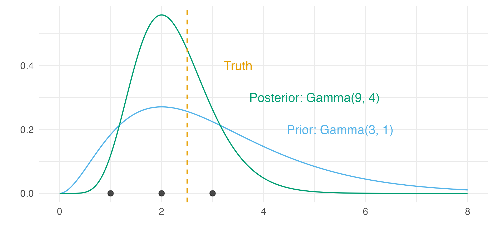

```{r echo = FALSE}
options(scipen = 100)

knitr::opts_chunk$set(
  echo = FALSE,
  warning = FALSE,
  message = FALSE,
  dpi = 320,
  cache = TRUE,
  out.width = "95%",
  fig.align = 'center'
)
```

\newpage

# Dr. Christopher Paciorek

Thank you for the thorough discussion of the thesis.
Both during the defense and in the provided corrections.
I have addressed your suggested corrections point by point, as follows.

## General comments

### Chapter 4

> *I'd like to see some more context relating the potential shortcomings to the public health setting (you have a bit of this in Section 4.1.3).
For a public health analyst, when might they be most concerned about using the Besag model?
What kinds of areal arrangements/neighborhood structures/types of data might be most prone to concern?
E.g., one might be concerned about cases like Canadian provinces where their populations are so concentrated right near neighboring US states and most of the provincial area is sparsely populated.

In Section 4.1.3. I have modified the text as follows:

"The Besag model was originally proposed by @besag1991bayesian for use in image analysis.
In this setting, areas correspond to pixels arranged in a regular lattice structure.
In an image, the data point at each pixel can be thought of as an average of the intensity or colour over the space represented by the pixel.

Since it's original proposal, the Besag model has seen wider use.
However, for small-area estimation of HIV, the spatial structure corresponds to administrative units.
These administrative units may have a more irregular spatial structure than a lattice. 
Furthermore, data points may not come about by uniform averaging over a space.
For example, population density may vary across the area."

> And as we discussed, I'd like for you to see if you can drill down into the localized results of the simulation to give some insight into where the smoothing is sub-optimal in the simulations.
> Relatedly would you expect the features highlighted by your vignettes to occur in reality in public health settings?*

Not yet resolved.

### Chapter 5

> *I'd like to see the chapter initially clearly lay out the overall goal, the quantitative representation of that, the various pieces of the analysis and how they fit together, and the data available, as well as what components you can estimate uncertainty for.
In particular the notion of "reaching" the population needs to be clearly spelled out initially.
And as we discussed, please make clear how prevalence is needed.*

I have updated Section 5.1 giving the background for Chapter 5 as follows:

"In this chapter, I used a Bayesian spatio-temporal model (Section 5.3) of behavioural data from household surveys (Section 5.2) to estimate HIV risk group proportions. To then estimate risk group specific HIV prevalence and HIV incidences (Section 5.4), I combined the proportion estimates with population size, HIV prevalence and HIV incidence estimates, as well as risk group specific HIV incidence rate ratios, and HIV prevalence rate ratios. Finally, by ordering district, age, risk group strata by HIV incidence, I estimated an upper bound for the number of new HIV infections that could be averted under different risk prioritisation strategies (Section 5.4.3)."

> *Model 5.11 omits various interactions.
Focusing on the category-area-age interaction, which seems like the omitted interaction most likely to have substantial variation in reality, some effort to come up with some "residual" type diagnostic to assess model mis-specification in this regard would be helpful (e.g., perhaps some sort of variogram type analysis of some sort of age-group specific "working residuals" to borrow a GLM framing). Or you mentioned fitting the model with the interaction for one country.
If that is not too burdensome that would also be a reasonable approach here.*

The linear predictor used for the multinomial logistic regression model was
$$
\eta_{ita} = \theta_{ita} + \beta_k + \zeta_{c[i]k} + \alpha_{ac[i]k} + u_{ik} + \gamma_{tk}.
$$
This equation does contain age-country-category interactions $\alpha_{ac[i]k}$, but you are right to point out that age-district-category interactions are omitted.
A model containing the effects $\alpha_{aik}$ is likely to cause computational difficulties.

> *The distinct differences between the CPO and information criteria (IC) results (and the very structured pattern in the surprising IC results) suggest the possibility of a bug somewhere, as we discussed.
Getting the observation-specific values from INLA might help to better understand this.*

I agree.

### Chapter 6

> *Chapter 6 extends standard INLA computation in two ways.
For the first, I'd like to see more clarity in how this differs from the Stringer et al. (2022) approach (i.e., that you go beyond the Gaussian mixture over the quadrature points, as we discussed in the defense) and the details of the software implementation (e.g., giving an overview in the chapter describing what someone would need to do to make use of your code/approach).*

The @stringer2022fast approach is that of Section 6.1.3.1.
It is similar to the `inla::inla` with `method = "gaussian"`.
The novel approach implemented in Section 6.2 is similar to `inla::inla` with `method = "laplace"`.

I have clarified this point in the following text: "First, a universally applicable implementation of INLA with Laplace marginals, where automatic differentiation via `TMB` is used to obtain the derivatives required for the Laplace approximation. For users of `R-INLA`, the @stringer2022fast approach is analogous to `method = "gaussian"`, while the approach newly implemented in this chapter is analogous to `method = "laplace"`. Section 6.2 demonstrates the implementation using two examples, one compatible with `R-INLA` and one incompatible."

> *As we discussed in the defense, I'm concerned about any case where one draws from marginals, implicitly assuming no dependence, either at the hyperparameter level or the latent process level, and then does inference on a derived quantity that depends on more than one input.
You should be clear anytime you do this that this is problematic (and try to avoid as much as possible).*

Not yet resolved.

> *Relatedly, assuming I'm understanding correctly, there is an important tradeoff between using Laplace marginals for improved accuracy for latent marginals and using the Gaussian mixture over the quadrature points, which allows one to make draws and do inference on any derived quantity in a way that takes account of posterior dependence between and amongst hyperparameters and latent process values.
If that's the case, I think it's worth pointing this out and discussing when one can use the Laplace marginals in a public health context and when one might need to use the Gaussian mixture.*

Not yet resolved.

## Minor comments

### Chapter 2

> *4: "develop into a stage" -> "Infection with HIV can"*

Changed to "If untreated, infection with HIV can develop into a more advanced stage known as acquired immunodeficiency syndrome (AIDS).".

> *6: "to result a reduction"*

Changed to "found complete surgical removal of the foreskin to result in a reduction".

> *11: "Both DHS and PHIA surveys collecting"*

Changed to "Both DHS and PHIA surveys collect demographic, behavioural, and clinical information.".

> *12: individual disclosure: error may come from them not knowing status*

Good point, I have added the sentence:
"Furthermore, individuals may be unaware of their HIV status.".

> *14: "UNAIDS process"*

Apologies for this stub!
This has been been corrected as follows:
"Indeed, careful validation of data by country teams is a crucial part of the yearly UNAIDS HIV estimates process.".

### Chapter 3

> *16 (and elsewhere): Please look up usage of "that" vs. "which" so you can join me in the grammar police. "Models which do not produce" -> "Models that do not produce"*

Thank you for the pointer, I have fixed this issue and look forward to joining the good fight.

> *Fig 3.1: I suggest that you also show the likelihood.*

I have now included the likelihood in this figure as follows.
Figure 6.1, demonstrating the Laplace approximation, has also been updated to include the likelihood.

```{r conjugate}

```

> *17: Beyond just p(y) even if you know the full form of p(phi|y) what do you do with it in non-trivial dimensions? You have to be able to either draw from it or estimate expectations of interest. the issue is rather broader than just the unknown normalizing constant.*

Good point!
I have added the sentence:
"Further, even given a closed form expression for the posterior distribution, if $\boldsymbol{\mathbf{\phi}}$ is of moderate to high dimension, then it is not obvious how to evaluate expressions of interest, which usually themselves are integrals, or expectations, with respect to the posterior distribution.".

> *19. You haven't defined 'convergence' when you dive into diagnostics.*

I have altered the text to read:
"After running an MCMC sampler, it is important that diagnostic checks are used to evaluate whether the Markov chain has reached its stationary distribution.
If so, the Markov chain is said to have converged, and its samples may be used to compute posterior quantities.
Though it is possible to check poor convergence in some cases, we may never be sure that a Markov chain has converged, and thus that results computed from MCMC will be accurate.".

> *21. I'd frame this as deterministic approximations need to focus on approximating expectations of interest. I think of Laplace as approximating an integral over part of parameter space (often > random effects') to be able to work with a smaller-dimensional space, such as for maximization.*

Thank you for the comment.
In Chapter 6, I refer to a Laplace approximation over part of the parameter space as the marginal Laplace approximation.

> *23. "data is" -> "data are" (also p 66 and perhaps elsewhere)*

I have corrected to "data are" in this instance and elsewhere in the thesis.

> *30. You distinguish ELGM from LGM with having defined eta for LGM or been explicit about 1:1 relationship of x and y.*

Good point.
In an LGM, it is that there is a one-to-one relationship between $\mathbf{y}$ and $\boldsymbol{\mathbf{\eta}}$.
I have added the sentence:
"In an LGM, like the more general GLMM case as given in Equation (3.6), there is a one-to-one correspondence between observations $y_i$ and elements of the linear predictor $\eta_i$.".

> *Sec 3.4: worth commenting on additivity of these measures that treat each obs as a unit of information given you are in a spatial setting.*

Note connection to SLOO-CV in Chapter 4.

> *35. (3.30) should be for $\pi_{2hj}$.*

Thank you for spotting this! Corrected.

> *37. "difficultly"*

Corrected to "problem difficulty".

> *37. "arrived at using by"*

Corrected to "arrived at by estimating the variance of".

### Chapter 4

> *41. Might be worth including the variance piece raised to the power `n-c`.*

I have added the factor $\tau_u^{\frac{n - n_c}{2}}$.
Initially I excluded this factor as the primary intention of Equation (4.4) is to demonstrate that $p(\mathbf{u})$ is a function of the pairwise differences and thus improper.

> *41. "recommended against": passive, and by who?*

I have altered the text to read:
"Directly using the Besag model as described in Section 4.1.1 has several practical limitations in applied settings.
To overcome these limitations, @freni2018note recommend three best practices:".

> *42. Why is unit variance correct?*

Yes that's a good point, what I mean to say is that the singletons have unit variance in the "structure matrix" sense.
I have corrected the text to read that $p(u_i) \sim \mathcal{N}(0, \tau_u^{-1})$.

> *47. tau_v an d tau_w are not orthogonal - what does this mean?*

Practically speaking, this means that the posteriors for $\tau_v$ and $\tau_w$ are likely to be correlated.
See Figure C.8 and Figure C.9 in Appendix C for an example, showing that the BYM2 parameterisation overcomes this issue.

> *48. Is convolution the right term here?*

I have altered the text to use the term "convolved random effects" following use of this terminology by @morris2019bayesian.

> *55: what is meant by "model is implemented in arealutils"?*

I have updated the text to read: "in the `arealutils` R package [@howes2023arealutils]".

> *56: need citation for v being hard to estimate*

Not yet resolved.

> *56: have Li vary with size?*

The $L_i$ did not vary with the size of the area.
A fixed number were used for each area.

> *56: effect -> affect*

Change made.

> *57: "and the calibration"*

I have altered the text to read: "and the probability integral transform (PIT; @dawid1984present) values".

> *57: What parameter is shown in Figs 4.7-4.9 - it's not clear you're assessing the latent process values. And in that case you should be clear the CRPS is averaged over locations.*

Not yet resolved.

> *59: Explain that mean CRPS is mean over the simulations.*

Not yet resolved.

> *63: Table 4.4 has no standard errors.*

Not yet resolved.

> *64: "resulted wide"*

Changed to "resulted in wide".

> *64: surprisingly*

Changed.

> *67: "This chapter used of area-level models to for point-level data throughout". I can't parse this. You can only use point level model if have point level data.*

Not yet resolved.

> *67: "measures are disaggregated by area" - not sure of the point here.*

Not yet resolved.

### Chapter 5

> *71: FSW is not defined in Table 1 caption.*

Changed to "female sex workers (FSW)".

> *71: In Table 1 why does High risk group IRR not vary with local incidence?*

The conceptual model underpinning this decision was to frame the "High" risk group as a part of the general population at higher risk and the "Very High" risk group as a concentrated epidemic subpopulation.
In reality IRR is likely to vary by local incidence for the "Very High" risk group as well, and as such this is a fair critique.
Practically speaking, the ALPHA network data used to inform the "High" IRR has quite little geographic variation.

> *71: Purpose of Table 1 is not clear. Nor how IRR is to be used.*

Not yet resolved.

> *Tables sometimes appear earlier than they should (e.g., 5.1 and 5.2).*

Not yet resolved.

> *77: Table 5.2: phi_{ik} should be u_{ik}.*

Good spot! Thank you, fixed.

> *80: Mention country-specific vs single models earlier.*

Not yet resolved.

> *82: I would say clearly that model structure for q_ia is discussed next.*

I have altered the text to read:
"As all such surveys occurred in the years 2013-2018 (Figure 5.2) I assumed no dependence on time, hence omission of the index $t$.
Model specification for the linear predictor $\eta_{ia}$ is discussed in Section 5.3.2.1 to follow."

> *85: First paragraph of 5.3.3 is a bit hard to follow.*

I have altered the text to read:
"Domain experts do not consider having had sex "in return for gifts, cash or anything else in the past 12 months" sufficient to constitute sex work.
For this reason, I adjusted the estimates obtained based on the transactional sex survey question to match alternatively obtained age-country FSW population size estimates.
Taking this approach retained subnational variation informed by the transactional sex survey question.".

> *86: The bio-marker survey data and disaggregation model is unclear. How are risk groups known for individuals in the survey?*

Not yet resolved.

> *88: Section 5.4.3 is hard to understand. I don't understand how it relates to 5.4.2. "Reach" is not clearly defined nor is it clearly discussed how it is quantified based on the various modeling pieces.*

Not yet resolved.

> *91: Not clear what the quantities are in the statement about "in most districts adolescent girls aged 15-19 were not sexually active". Is this an across-district or within-district quantity?*

Not yet resolved.

> *95: does the approach presented allow identification of actual people or just targeting efforts to reach more such people collectively*

Not yet resolved.

> *96: "Accounting for the 0% of new infections"?*

Not yet resolved.

### Chapter 6

> *106: Not sure what you mean by "log p(y|x,theta) is small". This is the likelihood...*

I based this sentence on @blangiardo2013spatial.

> *116: "in which, which"*

Changed to "in which, similar to extended latent Gaussian models".

> *122: "Method" in Table 6.1 a bit terse.*

I have updated this column to be more specific about the first word referring to "latent field marginals" and the second being "over the hyperparameters" (apart from for NUTS, which is over the whole space).

> *122: Is "Gaussian, EB" the same as frequentist Laplace approx (up to hyperparameter prior)? If so, probably worth saying.*

Yes I believe it is.
I have updated the text as follows:
"...".

> *130: Somewhat unclear how the quadrature is implemented, wrapped around the TMB-based Laplace approximation. Is your code in R? (Sorry, this may be because I didn't have time to look through appendices.)*

Not yet resolved.

> *131: Using same number of iterations with stan (full posterior, including latent values) vs tmbstan (hyperparameters, much lower-dimensional space) seems odd.*

Here I am using `tmbstan` with the default option `laplace = FALSE`.
Hence the `tmbstan` sampler is operating over the full space, just as the `rstan` sampler.

> *132: Fig 6.7 is just grid/AGHQ, not EB? If so, why present EB method?*

Not yet resolved.

> *132: Why surprising tmbstan faster than rstan - what are the different computations involved - having to compute Laplace vs doing HMC over higher dimensional space. I expect it would vary with I expect it would vary with hyperparameter and latent dimensions.*

It is surprising as they are running the same algorithm: HMC over the full space.

> *136: "kridge" -> "krige"*

Changed to `gstat::krige`.

> *137: "this" in "this difference" is unclear.*

I have altered the text to read:
"As $\beta_\phi$ was fixed then differences in approximation accuracy between the Gaussian and Laplace approximations of $\phi(s)$ are due only to differences in estimation of $u(s)$.".

> *143: "survey weighting increases variance" - what about effect of increasing precision in small strata? Are you talking about influence of complex survey design or somehow about weighting scheme?*

Not yet resolved.

> *149: INLA uses CCD for d>2, right? Would this not work for this setting?*

Yes, `R-INLA` does use central composite design (CCD) for integration over moderate dimensions.
I note that `R-INLA` uses CCD for $m > 2$ in Section 6.1.4.1, illustrate CCD in Figure 6.4, and mention that it would be of interest to compare PCA-AGHQ to CCD in Section 6.6.3.1.

> *151: (6.97) has 'd' instead of 'm'*

Agree, fixed swapping $d$ to $m$.

> *154: "closet"*

Changed to "posterior contraction was very close to zero.".

> *154: Did you use MAP for theta when looking at Hessian eigenvalues?*

Not yet resolved.

> *156: "Figure ??"*

Fixed, thank you.

> *156: "far fewer than full 24" - is this a problem?*

This is a problem in the sense that it would ideal for the quadrature nodes used to show some variability in all 24 dimensions.
PCA-AGHQ does improve upon a naive product grid, but is still far from ideal.

> *156: "point estimates" "distributional quantities" - need "and"*

Fixed, thank you.

> *157: Need caption to describe the green*

Thank you, I have updated this caption to read "The grey histograms show the 24 hyperparameter marginal distributions obtained with NUTS. The green lines indicate the position of the 6561 PCA-AGHQ nodes projected onto each hyperparameter marginal. For some hyperparameters, the PCA-AGHQ nodes vary over the domain of the posterior marginal distribution, while for others they concentrate at the mode.".

> *165: What went wrong with tmbstan?*

(Note to self that this is in regard to "Preliminary testing of this approach, using `tmbstan` and setting `laplace = TRUE`, did not show immediate success but likely could be worked on.")

\newpage

# Dr. Adam Sykulski

Thank you for providing a paper copy of the thesis annotated with suggested typographical changes.
I have made these changes, and additionally thoroughly proofread the thesis as requested.

\newpage

# References {#references .unnumbered}