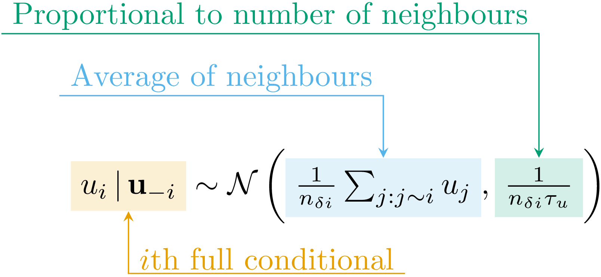
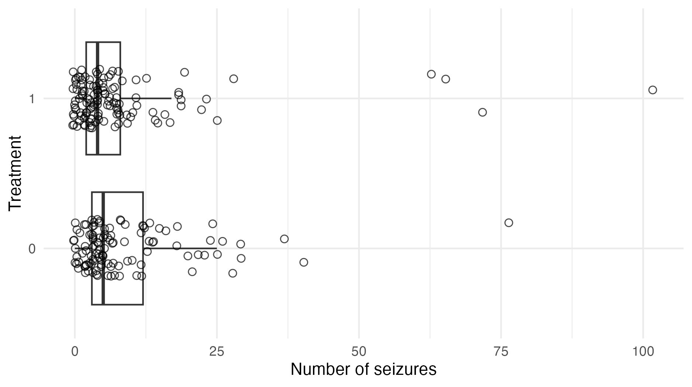
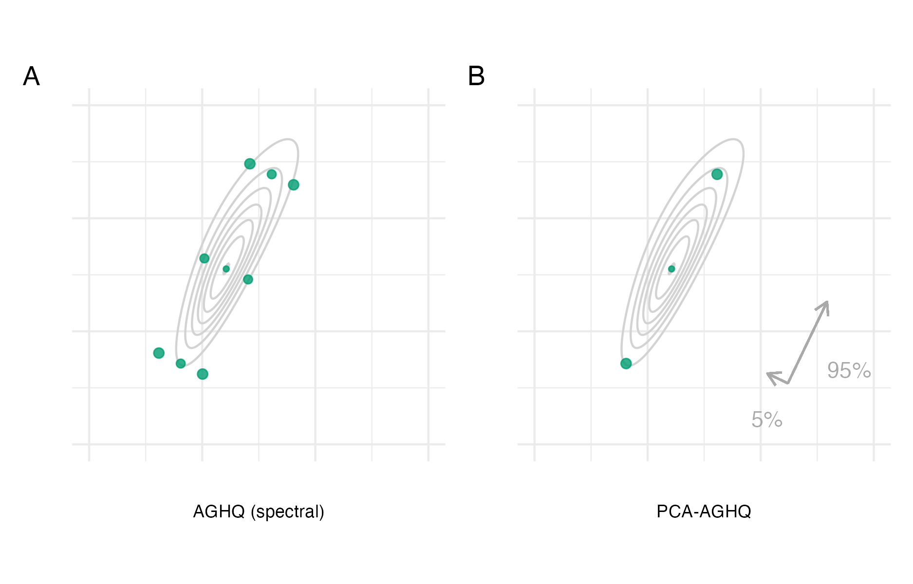

#

**Bayesian**

Use probability distributions for all unknowns

#

```{r conjugate, echo=FALSE, out.width="100%"}
knitr::include_graphics("../figures/bayesian/conjugate.png")
```

#

**Spatio-temporal**

Observed data has spatial and temporal location

#

```{r st, echo=FALSE, out.width="100%"}
knitr::include_graphics("../figures/bayesian/st.png")
```

#

**Small-area estimation**

Sample size for demographic subgroups too low for precise direct estimates

#

```{r zmb-maps, echo=FALSE, out.width="85%"}
knitr::include_graphics("../figures/bayesian/zmb-maps.png")
```

#

```{r zmb-scatter, echo=FALSE, out.width="85%"}
knitr::include_graphics("../figures/bayesian/zmb-scatter.png")
```


#

**Toy example! Same principle applies to real models**

e.g. Naomi^[See [C.4 Simplified Naomi model description](https://athowes.github.io/thesis/naomi-aghq-appendix.html#naomi-math)] [@eaton2021naomi; @esra2024improved]

#

```{r naomi-continent, echo=FALSE, out.width="95%"}
knitr::include_graphics("../figures/hiv-aids/naomi-continent.png")
```

#

**Nearby things tend to be similar**

Suppose prior correlation structure between observations!

#

**Gaussian Markov random field** model of @besag1991bayesian\
\

```{r besag, echo=FALSE, out.width="60%", fig.align = 'center'}

```

#

```{r geometry-graph, echo=FALSE, out.width="95%"}
knitr::include_graphics("../figures/beyond-borders/geometry-graph.png")
```

#

```{r geometries, echo=FALSE, out.width="95%"}
knitr::include_graphics("../figures/beyond-borders/geometries.png")
```

#

**Measure forecast performance using strictly proper scoring rules**

See @gneiting2007strictly

#

```{r crps-mean-se-civ, echo=FALSE, out.width="80%", fig.align = 'center'}
resource_version <- list.files("../resources/beyond-borders")
knitr::include_graphics(paste0("../resources/beyond-borders/", resource_version, "/depends/crps-mean-se-civ.png"))
```

#

```{r cv, echo=FALSE, out.width="80%", fig.align = 'center'}
knitr::include_graphics("../figures/beyond-borders/cv.R")
```

#

```{r crps-mean-se-surveys, echo=FALSE, out.width="65%", fig.align = 'center'}
knitr::include_graphics(paste0("../resources/beyond-borders/", resource_version, "/depends/crps-mean-se-surveys.png"))
```

#

```{r global-aids-strategy, echo=FALSE, out.width="40%", fig.align = 'center'}
knitr::include_graphics("global-aids-strategy.png")
```

#

```{r available-surveys, echo=FALSE, out.width="90%", fig.align = 'center'}
resource_version <- list.files("../resources/multi-agyw")
knitr::include_graphics(paste0("../resources/multi-agyw/", resource_version, "/depends/available-surveys.png"))
```

#

**Use the multinomial-Poisson transformation of @baker1994multinomial**

A multinomial logistic regression on $\mathbf{y} = (y_1, \ldots, y_K)$ can be expressed as a Poisson regression $y_k \sim \text{Poisson}(\lambda_k)$ with observation-specific random effects with recover the sample size $m = \sum_k y_k$.

#

```{r thesis-slide-multi-agyw, echo=FALSE, out.width="100%", fig.align = 'center'}
knitr::include_graphics(paste0("../resources/multi-agyw/", resource_version, "/depends/thesis-slide-multi-agyw.png"))
```

#

```{r model-direct-benefits, echo=FALSE, out.width="100%", fig.align = 'center'}
knitr::include_graphics(paste0("../resources/multi-agyw/", resource_version, "/depends/model-direct-benefits.png"))
```

#

**Since extended to include 1) males, 2) additional countries**

See the sub-national HIV estimates in priority populations UNAIDS tool at [`hivtools.unaids.org/shipp/`](https://hivtools.unaids.org/shipp/)

#

**Bayesian computation amounts to solving challenging integrals**
$$
p(\mathbf{y}) = \int p(\mathbf{y}, \boldsymbol{\mathbf{\phi}}) \text{d}\boldsymbol{\mathbf{\phi}}
$$

#

```{r stan, echo=FALSE, out.width="100%"}
knitr::include_graphics("../figures/bayesian/stan.png")
```

#

```{r epil, echo=FALSE, out.width="80%", fig.align = 'center'}

```

#

```{r intercept-comparison, echo=FALSE, out.width="80%", fig.align = 'center'}
knitr::include_graphics("../figures/naomi-aghq/intercept-comparison.png")
```

#

```{r loa-loa-data, echo=FALSE, out.width="80%", fig.align = 'center'}
knitr::include_graphics("../figures/naomi-aghq/loa-loa-data.png")
```

#

```{r conditional-simulation-rho-diff-fixed, echo=FALSE, out.width="90%", fig.align = 'center'}
knitr::include_graphics("../figures/naomi-aghq/conditional-simulation-rho-diff-fixed.png")
```

#

```{r pca-demo, echo=FALSE, out.width="95%"}

```

#

```{r sd-latent, echo=FALSE, out.width="90%", fig.align = 'center'}
resource_version <- list.files("../resources/naomi-aghq")
knitr::include_graphics(paste0("../resources/naomi-aghq/", resource_version, "/depends/sd-latent.png"))
```

#

```{r exceedance-1inc, echo=FALSE, out.width="90%", fig.align = 'center'}
knitr::include_graphics(paste0("../resources/naomi-aghq/", resource_version, "/depends/exceedance-1inc.png"))
```

# Acknowledgements

| Collaborator(s)  | Affiliation       |
| ------------- | ----------------- |
| Jeff Eaton    | Imperial, Harvard |
| Seth Flaxman  | Oxford            |
| Alex Stringer | Waterloo          |
| HIV Inference Group | Imperial    |
| Machine Learning and Global Health Network | Worldwide |
| StatML CDT  | Imperial, Oxford    |

# What am I up to now?

* Adaptive survey design to improve efficiency of mobile phone surveys
  * Still interested to apply this approach to household surveys e.g. for HIV
* Multilevel regression and poststratification models for district-level food security estimates
 
# References {.allowframebreaks}
