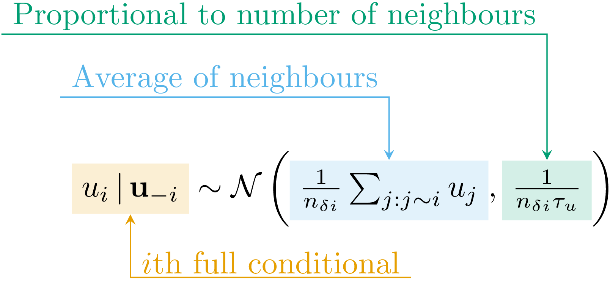
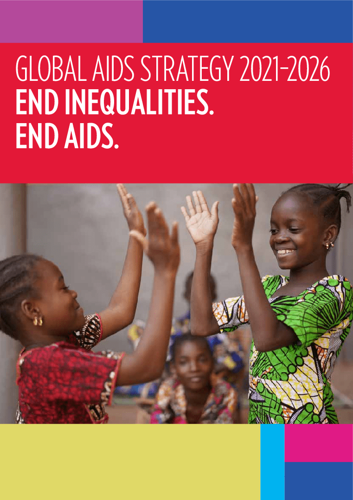

#

```{r naomi-continent, echo=FALSE, out.width="95%"}
knitr::include_graphics("../figures/hiv-aids/naomi-continent.png")
```

#

```{r besag, echo=FALSE, out.width="70%", fig.align = 'center'}

```

#

```{r geometry-graph, echo=FALSE, out.width="95%"}
knitr::include_graphics("../figures/beyond-borders/geometry-graph.png")
```

#

```{r geometries, echo=FALSE, out.width="95%"}
knitr::include_graphics("../figures/beyond-borders/geometries.png")
```

#

```{r crps-mean-se-civ, echo=FALSE, out.width="80%", fig.align = 'center'}
resource_version <- "20231218-195551-0129f3b4"
knitr::include_graphics(paste0("../resources/beyond-borders/", resource_version, "/depends/crps-mean-se-civ.png"))
```

#

```{r crps-mean-se-surveys, echo=FALSE, out.width="65%", fig.align = 'center'}
knitr::include_graphics(paste0("../resources/beyond-borders/", resource_version, "/depends/crps-mean-se-surveys.png"))
```

#

```{r global-aids-strategy, echo=FALSE, out.width="40%", fig.align = 'center'}

```

#

```{r available-surveys, echo=FALSE, out.width="90%", fig.align = 'center'}
resource_version <- "20231219-192637-4244d933"
knitr::include_graphics(paste0("../resources/multi-agyw/", resource_version, "/depends/available-surveys.png"))
```

#

```{r thesis-slide-multi-agyw, echo=FALSE, out.width="100%", fig.align = 'center'}
knitr::include_graphics(paste0("../resources/multi-agyw/", resource_version, "/depends/thesis-slide-multi-agyw.png"))
```

#

```{r model-direct-benefits, echo=FALSE, out.width="100%", fig.align = 'center'}
knitr::include_graphics(paste0("../resources/multi-agyw/", resource_version, "/depends/model-direct-benefits.png"))
```

#

```{r intercept-comparison, echo=FALSE, out.width="80%", fig.align = 'center'}
knitr::include_graphics("../figures/naomi-aghq/intercept-comparison.png")
```

#

```{r conditional-simulation-rho-diff-fixed, echo=FALSE, out.width="90%", fig.align = 'center'}
knitr::include_graphics("../figures/naomi-aghq/conditional-simulation-rho-diff-fixed.png")
```

#

```{r pca-demo, echo=FALSE, out.width="95%"}
knitr::include_graphics("../figures/naomi-aghq/pca-demo.png")
```

# Acknowledgements

| Collaborator  | Affiliation       |
| ------------- | ----------------- |
| Jeff Eaton    | Harvard, Imperial |
| Seth Flaxman  | Oxford            |
| Alex Stringer | Waterloo          |
| HIV Inference Group | Imperial    |
| Machine Learning and Global Health Network | Worldwide |
| StatML CDT  | Imperial, Oxford    |

# References {.allowframebreaks}
