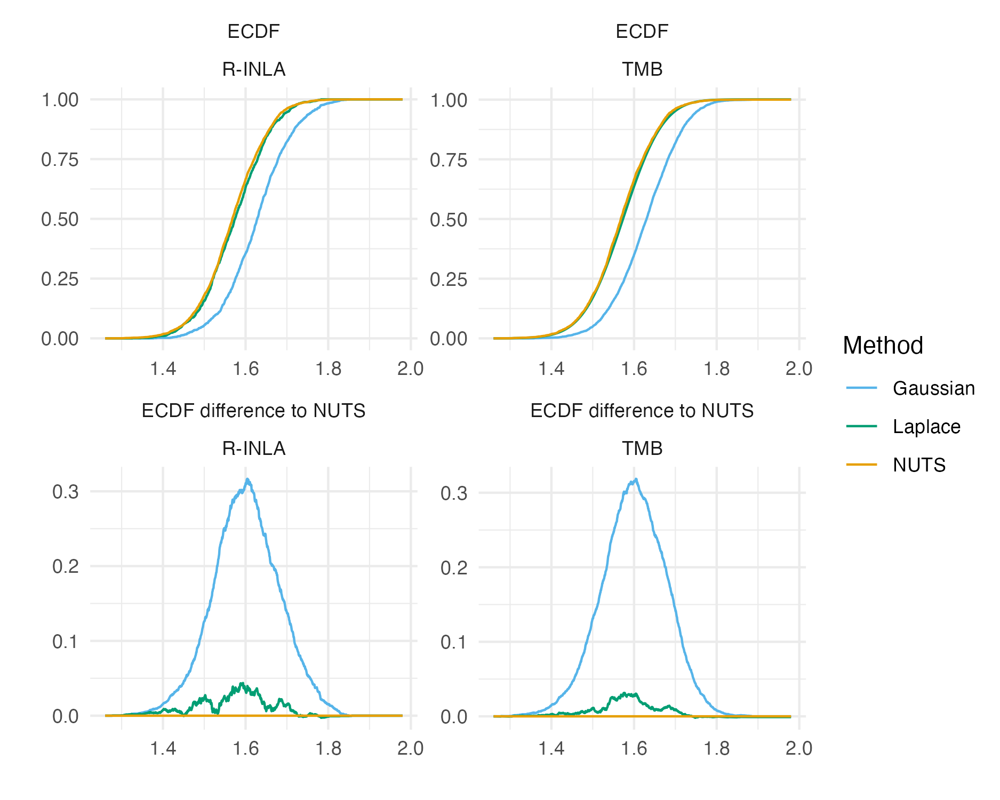

#

```{r naomi-continent, echo=FALSE, out.width="95%"}
knitr::include_graphics("../figures/hiv-aids/naomi-continent.png")
```

#

```{r besag, echo=FALSE, out.width="70%", fig.align = 'center'}
knitr::include_graphics("besag.png")
```

#

```{r geometry-graph, echo=FALSE, out.width="95%"}
knitr::include_graphics("../figures/beyond-borders/geometry-graph.png")
```

#

```{r geometries, echo=FALSE, out.width="95%"}
knitr::include_graphics("../figures/beyond-borders/geometries.png")
```

#

```{r intercept-comparison, echo=FALSE, out.width="70%", fig.align = 'center'}

```

#

```{r pca-demo, echo=FALSE, out.width="95%"}
knitr::include_graphics("../figures/naomi-aghq/pca-demo.png")
```

# Acknowledgements

| Collaborator  | Affiliation       |
| ------------- | ----------------- |
| Jeff Eaton    | Harvard, Imperial |
| Seth Flaxman  | Oxford            |
| Alex Stringer | Waterloo          |
| HIV Inference Group | Imperial    |
| Machine Learning and Global Health Network | Worldwide |
| StatML CDT  | Imperial, Oxford    |

# References {.allowframebreaks}
